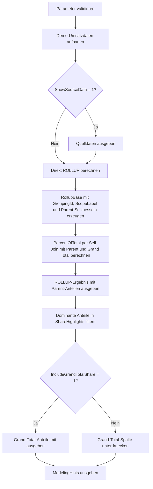

# RollupPercentOfTotalDemo.sql

Dieses Skript demonstriert Prozent-vom-Gesamtwert entlang einer `ROLLUP`-Hierarchie. Es unterscheidet sauber zwischen Anteil am direkten Parent und Anteil am Grand Total.

## Uebersicht

<!-- SQLDOC:SUMMARY_TABLE:BEGIN -->
| Feld | Wert |
|---|---|
| Script | [RollupPercentOfTotalDemo.sql](RollupPercentOfTotalDemo.sql) |
| Version | `1.0` |
| Typ | `didactic-lab` |
| Kapitel | `18_Cube_Rollup` |
| Sicherheit | `read-only-tempdb` |
| Zweck | Demonstriert Prozent-vom-Gesamt auf Basis von `ROLLUP` mit Parent- und Grand-Total-Anteilen. |
<!-- SQLDOC:SUMMARY_TABLE:END -->

## Einordnung

`ROLLUP` liefert eine hierarchische Aggregation. Dadurch ist ein Anteil relativ zum direkten Parent oft fachlich etwas anderes als ein Anteil relativ zur Gesamtsumme aller Daten.

## Annahmen

- Die Umsetzung bleibt didaktisch und arbeitet nur mit Temp-Tabellen.
- Die Hierarchie folgt `RegionCode -> ProductGroup -> SalesChannel -> FiscalQuarter`.
- `PercentOfParent` beschreibt den Beitrag zur unmittelbar naechsten `ROLLUP`-Ebene.
- `PercentOfGrandTotal` ist eine zusaetzliche globale Sicht.

## Parameter

<!-- SQLDOC:PARAMETERS_TABLE:BEGIN -->
| Parameter | SQL-Typ | Pflicht | Beschreibung |
|---|---|---|---|
| `@ShowSourceData` | `BIT` | Nein | Gibt bei `1` die Demo-Quelldaten aus. |
| `@IncludeGrandTotalShare` | `BIT` | Nein | Zeigt bei `1` den Anteil am Grand Total an. |
| `@HighlightShareFrom` | `DECIMAL(9,4)` | Nein | Markiert hohe Parent-Anteile ab diesem Schwellwert. |
<!-- SQLDOC:PARAMETERS_TABLE:END -->

## Abhaengigkeiten

<!-- SQLDOC:DEPENDENCIES_LIST:BEGIN -->
- `tempdb` fuer die didaktische Faktentabelle und Ergebnisstufen
- `GROUP BY ROLLUP`
- `GROUPING_ID`
- Self-Join auf das `ROLLUP`-Ergebnis
- `CASE`
<!-- SQLDOC:DEPENDENCIES_LIST:END -->

## Hinweise

- `RollupPercentOfTotal` ist die Hauptansicht fuer die Prozentinterpretation.
- `ShareHighlights` filtert dominante Anteile fuer Unterricht und Review.
- Die Parent-Beziehung wird direkt aus dem erzeugten `ROLLUP`-Ergebnis abgeleitet.

## Versionshistorie

<!-- SQLDOC:VERSION_HISTORY_TABLE:BEGIN -->
| Version | Datum | User | Beschreibung |
|---|---|---|---|
| `1.0` | `2026-04-19` | `ER` | Erstversion fuer Prozent-vom-Gesamt auf Basis eines didaktischen `ROLLUP`-Ergebnisses |
<!-- SQLDOC:VERSION_HISTORY_TABLE:END -->

## Ablauf

<!-- SQLDOC:MERMAID:BEGIN -->

<!-- SQLDOC:MERMAID:END -->

## SQL-Code

<!-- SQLDOC:SQL_CODE:BEGIN -->
```sql
/*
BEGIN:SQL-HEADER v1
---
sql_header: v1
script_name: "RollupPercentOfTotalDemo.sql"
script_version: "1.0"
script_type: "didactic-lab"
chapter: "18_Cube_Rollup"

purpose: >
  Demonstriert Prozent-vom-Gesamtwert auf Basis von ROLLUP mit Anteilen am
  direkten Parent und optional am Grand Total.

parameters:
  - name: "@ShowSourceData"
    sql_type: "BIT"
    direction: "IN"
    required: false
    description: "1 = Demo-Quelldaten ausgeben"
  - name: "@IncludeGrandTotalShare"
    sql_type: "BIT"
    direction: "IN"
    required: false
    description: "1 = Anteil am Grand Total zusaetzlich anzeigen"
  - name: "@HighlightShareFrom"
    sql_type: "DECIMAL(9,4)"
    direction: "IN"
    required: false
    description: "Schwellwert fuer auffaellige Parent-Anteile"

result_sets:
  - name: "SourceDataPreview"
    description: "Demo-Umsatzdaten"
  - name: "RollupPercentOfTotal"
    description: "ROLLUP-Ergebnis mit Parent- und Grand-Total-Anteilen"
  - name: "ShareHighlights"
    description: "Auffaellige Anteile fuer die Besprechung"
  - name: "ModelingHints"
    description: "Kurze Hinweise fuer Report-Interpretation"

dependencies:
  - "tempdb temporary tables"
  - "GROUP BY ROLLUP"
  - "GROUPING_ID"
  - "self join on rollup output"
  - "CASE"

safety:
  level: "read-only-tempdb"
  writes_data: false

documentation:
  markdown_file: "T-SQL/18_Cube_Rollup/SQLScripts/RollupPercentOfTotalDemo.md"
  sync_blocks:
    - "SUMMARY_TABLE"
    - "PARAMETERS_TABLE"
    - "DEPENDENCIES_LIST"
    - "VERSION_HISTORY_TABLE"
    - "SQL_CODE"
  mermaid:
    mode: "ai-agent-from-sql"
    source: "script-body"

main_responsible:
  name: "Erhard Rainer"
  initials: "ER"

version_history:
  - version: "1.0"
    date: "2026-04-19"
    user: "ER"
    description: "Erstversion fuer Prozent-vom-Gesamt auf Basis eines didaktischen ROLLUP-Ergebnisses"

notes:
  - "Die Demo-Daten arbeiten nur mit lokalen Temp-Tabellen"
  - "Die Parent-Sicht folgt der ROLLUP-Reihenfolge Region -> Produktgruppe -> Kanal -> Quartal"
---
END:SQL-HEADER v1
*/

SET NOCOUNT ON;

DECLARE @ShowSourceData BIT = 1;
DECLARE @IncludeGrandTotalShare BIT = 1;
DECLARE @HighlightShareFrom DECIMAL(9,4) = 0.2500;

IF @ShowSourceData NOT IN (0, 1)
    THROW 50060, '@ShowSourceData muss 0 oder 1 sein.', 1;

IF @IncludeGrandTotalShare NOT IN (0, 1)
    THROW 50061, '@IncludeGrandTotalShare muss 0 oder 1 sein.', 1;

IF @HighlightShareFrom < 0 OR @HighlightShareFrom > 1
    THROW 50062, '@HighlightShareFrom muss zwischen 0 und 1 liegen.', 1;

DROP TABLE IF EXISTS #SalesFact;
DROP TABLE IF EXISTS #RollupBase;
DROP TABLE IF EXISTS #PercentOfTotal;
DROP TABLE IF EXISTS #ShareHighlights;
DROP TABLE IF EXISTS #ModelingHints;

CREATE TABLE #SalesFact
(
    RegionCode VARCHAR(20) NOT NULL,
    ProductGroup VARCHAR(30) NOT NULL,
    SalesChannel VARCHAR(20) NOT NULL,
    FiscalQuarter VARCHAR(10) NOT NULL,
    RevenueAmount DECIMAL(18,2) NOT NULL
);

INSERT INTO #SalesFact (RegionCode, ProductGroup, SalesChannel, FiscalQuarter, RevenueAmount)
VALUES
    ('North', 'Hardware', 'Store', '2026-Q1', 9600.00),
    ('North', 'Hardware', 'Store', '2026-Q2', 10200.00),
    ('North', 'Services', 'Online', '2026-Q2', 11800.00),
    ('North', 'Services', 'Partner', '2026-Q3', 7400.00),
    ('South', 'Hardware', 'Store', '2026-Q1', 8800.00),
    ('South', 'Hardware', 'Online', '2026-Q2', 9100.00),
    ('South', 'Services', 'Partner', '2026-Q3', 12500.00),
    ('South', 'Training', 'Partner', '2026-Q4', 6800.00),
    ('West', 'Hardware', 'Online', '2026-Q1', 11100.00),
    ('West', 'Services', 'Store', '2026-Q3', 9700.00),
    ('West', 'Training', 'Online', '2026-Q4', 5900.00),
    ('Central', 'Hardware', 'Partner', '2026-Q4', 7300.00),
    ('Central', 'Services', 'Store', '2026-Q2', 10400.00),
    ('Central', 'Training', 'Online', '2026-Q4', 5200.00);

IF @ShowSourceData = 1
BEGIN
    SELECT RegionCode, ProductGroup, SalesChannel, FiscalQuarter, RevenueAmount
    FROM #SalesFact
    ORDER BY RegionCode, ProductGroup, SalesChannel, FiscalQuarter;
END;

CREATE TABLE #RollupBase
(
    RegionCode VARCHAR(20) NULL,
    ProductGroup VARCHAR(30) NULL,
    SalesChannel VARCHAR(20) NULL,
    FiscalQuarter VARCHAR(10) NULL,
    RevenueAmount DECIMAL(18,2) NOT NULL,
    GroupingId INT NOT NULL,
    AggregatedDimensions TINYINT NOT NULL,
    LevelLabel VARCHAR(40) NOT NULL,
    ScopeLabel VARCHAR(200) NOT NULL,
    ParentRegionCode VARCHAR(20) NULL,
    ParentProductGroup VARCHAR(30) NULL,
    ParentSalesChannel VARCHAR(20) NULL,
    ParentGroupingId INT NULL
);

INSERT INTO #RollupBase
(
    RegionCode, ProductGroup, SalesChannel, FiscalQuarter, RevenueAmount,
    GroupingId, AggregatedDimensions, LevelLabel, ScopeLabel,
    ParentRegionCode, ParentProductGroup, ParentSalesChannel, ParentGroupingId
)
SELECT
    sf.RegionCode,
    sf.ProductGroup,
    sf.SalesChannel,
    sf.FiscalQuarter,
    SUM(sf.RevenueAmount),
    GROUPING_ID(sf.RegionCode, sf.ProductGroup, sf.SalesChannel, sf.FiscalQuarter),
    GROUPING(sf.RegionCode) + GROUPING(sf.ProductGroup) + GROUPING(sf.SalesChannel) + GROUPING(sf.FiscalQuarter),
    CASE
        WHEN GROUPING(sf.RegionCode) + GROUPING(sf.ProductGroup) + GROUPING(sf.SalesChannel) + GROUPING(sf.FiscalQuarter) = 0 THEN 'leaf'
        WHEN GROUPING(sf.RegionCode) + GROUPING(sf.ProductGroup) + GROUPING(sf.SalesChannel) + GROUPING(sf.FiscalQuarter) = 4 THEN 'grand_total'
        ELSE 'subtotal'
    END,
    CONCAT(
        CASE WHEN GROUPING(sf.RegionCode) = 1 THEN '(all regions)' ELSE sf.RegionCode END,
        ' | ',
        CASE WHEN GROUPING(sf.ProductGroup) = 1 THEN '(all product groups)' ELSE sf.ProductGroup END,
        ' | ',
        CASE WHEN GROUPING(sf.SalesChannel) = 1 THEN '(all channels)' ELSE sf.SalesChannel END,
        ' | ',
        CASE WHEN GROUPING(sf.FiscalQuarter) = 1 THEN '(all quarters)' ELSE sf.FiscalQuarter END
    ),
    CASE
        WHEN GROUPING(sf.FiscalQuarter) = 0 THEN sf.RegionCode
        WHEN GROUPING(sf.SalesChannel) = 0 THEN sf.RegionCode
        WHEN GROUPING(sf.ProductGroup) = 0 THEN sf.RegionCode
        ELSE NULL
    END,
    CASE
        WHEN GROUPING(sf.FiscalQuarter) = 0 THEN sf.ProductGroup
        WHEN GROUPING(sf.SalesChannel) = 0 THEN sf.ProductGroup
        ELSE NULL
    END,
    CASE
        WHEN GROUPING(sf.FiscalQuarter) = 0 THEN sf.SalesChannel
        ELSE NULL
    END,
    CASE
        WHEN GROUPING(sf.FiscalQuarter) = 0 THEN 1
        WHEN GROUPING(sf.SalesChannel) = 0 THEN 3
        WHEN GROUPING(sf.ProductGroup) = 0 THEN 7
        WHEN GROUPING(sf.RegionCode) = 0 THEN 15
        ELSE NULL
    END
FROM #SalesFact AS sf
GROUP BY ROLLUP (sf.RegionCode, sf.ProductGroup, sf.SalesChannel, sf.FiscalQuarter);

CREATE TABLE #PercentOfTotal
(
    RegionCode VARCHAR(20) NULL,
    ProductGroup VARCHAR(30) NULL,
    SalesChannel VARCHAR(20) NULL,
    FiscalQuarter VARCHAR(10) NULL,
    GroupingId INT NOT NULL,
    AggregatedDimensions TINYINT NOT NULL,
    LevelLabel VARCHAR(40) NOT NULL,
    ScopeLabel VARCHAR(200) NOT NULL,
    RevenueAmount DECIMAL(18,2) NOT NULL,
    ParentScopeLabel VARCHAR(200) NULL,
    ParentRevenueAmount DECIMAL(18,2) NULL,
    PercentOfParent DECIMAL(9,4) NULL,
    GrandTotalAmount DECIMAL(18,2) NOT NULL,
    PercentOfGrandTotal DECIMAL(9,4) NULL,
    PercentCaption VARCHAR(220) NOT NULL
);

INSERT INTO #PercentOfTotal
(
    RegionCode, ProductGroup, SalesChannel, FiscalQuarter, GroupingId,
    AggregatedDimensions, LevelLabel, ScopeLabel, RevenueAmount,
    ParentScopeLabel, ParentRevenueAmount, PercentOfParent,
    GrandTotalAmount, PercentOfGrandTotal, PercentCaption
)
SELECT
    rb.RegionCode,
    rb.ProductGroup,
    rb.SalesChannel,
    rb.FiscalQuarter,
    rb.GroupingId,
    rb.AggregatedDimensions,
    rb.LevelLabel,
    rb.ScopeLabel,
    rb.RevenueAmount,
    parent.ScopeLabel,
    parent.RevenueAmount,
    CAST(rb.RevenueAmount / NULLIF(parent.RevenueAmount, 0) AS DECIMAL(9,4)),
    grand_total.RevenueAmount,
    CAST(rb.RevenueAmount / NULLIF(grand_total.RevenueAmount, 0) AS DECIMAL(9,4)),
    CASE
        WHEN rb.LevelLabel = 'grand_total' THEN 'Grand Total repraesentiert immer 100 Prozent.'
        WHEN parent.RevenueAmount IS NULL THEN 'Diese Zeile steht bereits am oberen Rand der ROLLUP-Hierarchie.'
        WHEN CAST(rb.RevenueAmount / NULLIF(parent.RevenueAmount, 0) AS DECIMAL(9,4)) >= @HighlightShareFrom THEN 'Diese Zeile traegt einen auffaellig grossen Anteil zu ihrem Parent bei.'
        ELSE 'Diese Zeile zeigt einen regulaeren Anteil innerhalb ihrer Parent-Ebene.'
    END
FROM #RollupBase AS rb
LEFT JOIN #RollupBase AS parent
    ON parent.GroupingId = rb.ParentGroupingId
   AND ISNULL(parent.RegionCode, '') = ISNULL(rb.ParentRegionCode, '')
   AND ISNULL(parent.ProductGroup, '') = ISNULL(rb.ParentProductGroup, '')
   AND ISNULL(parent.SalesChannel, '') = ISNULL(rb.ParentSalesChannel, '')
   AND parent.FiscalQuarter IS NULL
INNER JOIN #RollupBase AS grand_total
    ON grand_total.GroupingId = 15
   AND grand_total.RegionCode IS NULL
   AND grand_total.ProductGroup IS NULL
   AND grand_total.SalesChannel IS NULL
   AND grand_total.FiscalQuarter IS NULL;

SELECT
    pot.RegionCode,
    pot.ProductGroup,
    pot.SalesChannel,
    pot.FiscalQuarter,
    pot.GroupingId,
    pot.AggregatedDimensions,
    pot.LevelLabel,
    pot.ScopeLabel,
    pot.RevenueAmount,
    pot.ParentScopeLabel,
    pot.ParentRevenueAmount,
    pot.PercentOfParent,
    pot.GrandTotalAmount,
    CASE WHEN @IncludeGrandTotalShare = 1 THEN pot.PercentOfGrandTotal ELSE NULL END AS PercentOfGrandTotal,
    pot.PercentCaption
FROM #PercentOfTotal AS pot
ORDER BY
    pot.AggregatedDimensions DESC,
    pot.GroupingId ASC,
    pot.RegionCode,
    pot.ProductGroup,
    pot.SalesChannel,
    pot.FiscalQuarter;

CREATE TABLE #ShareHighlights
(
    ScopeLabel VARCHAR(200) NOT NULL,
    LevelLabel VARCHAR(40) NOT NULL,
    RevenueAmount DECIMAL(18,2) NOT NULL,
    ParentScopeLabel VARCHAR(200) NULL,
    PercentOfParent DECIMAL(9,4) NULL,
    PercentOfGrandTotal DECIMAL(9,4) NULL,
    ReviewHint VARCHAR(220) NOT NULL
);

INSERT INTO #ShareHighlights
(
    ScopeLabel, LevelLabel, RevenueAmount, ParentScopeLabel,
    PercentOfParent, PercentOfGrandTotal, ReviewHint
)
SELECT
    pot.ScopeLabel,
    pot.LevelLabel,
    pot.RevenueAmount,
    pot.ParentScopeLabel,
    pot.PercentOfParent,
    pot.PercentOfGrandTotal,
    CASE
        WHEN pot.LevelLabel = 'grand_total' THEN 'Grand Total ist die Referenz fuer alle globalen Anteile.'
        WHEN pot.PercentOfParent >= @HighlightShareFrom THEN 'Dieser Anteil ist hoch genug fuer eine gezielte Subtotal-Besprechung.'
        ELSE 'Die Zeile bleibt als Vergleich unterhalb des Schwellwerts.'
    END
FROM #PercentOfTotal AS pot
WHERE pot.LevelLabel = 'grand_total'
   OR pot.PercentOfParent >= @HighlightShareFrom;

SELECT
    sh.ScopeLabel,
    sh.LevelLabel,
    sh.RevenueAmount,
    sh.ParentScopeLabel,
    sh.PercentOfParent,
    CASE WHEN @IncludeGrandTotalShare = 1 THEN sh.PercentOfGrandTotal ELSE NULL END AS PercentOfGrandTotal,
    sh.ReviewHint
FROM #ShareHighlights AS sh
ORDER BY
    CASE sh.LevelLabel WHEN 'grand_total' THEN 0 WHEN 'subtotal' THEN 1 ELSE 2 END,
    sh.PercentOfParent DESC,
    sh.ScopeLabel;

CREATE TABLE #ModelingHints
(
    StepNumber INT NOT NULL,
    FocusArea VARCHAR(80) NOT NULL,
    GuidanceText VARCHAR(260) NOT NULL
);

INSERT INTO #ModelingHints (StepNumber, FocusArea, GuidanceText)
VALUES
    (1, 'Parent share', 'Lies PercentOfParent entlang der echten ROLLUP-Hierarchie und nicht als allgemeinen Marktanteil.'),
    (2, 'Grand total share', 'Nutze den Grand-Total-Anteil fuer den Gesamtbeitrag ueber alle Ebenen hinweg.'),
    (3, 'Thresholds', 'Ein Schwellwert hilft, dominante Teilmengen schneller fuer Unterricht und Review zu finden.'),
    (4, 'Reporting design', 'Wenn nur wenige Ebenen relevant sind, kann spaeter GROUPING SETS zielgenauer als volles ROLLUP sein.');

SELECT StepNumber, FocusArea, GuidanceText
FROM #ModelingHints
ORDER BY StepNumber;

```
<!-- SQLDOC:SQL_CODE:END -->
