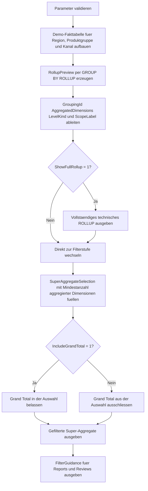

# SuperAggregateFilterPattern.sql

Dieses Skript zeigt, wie sich in einem `ROLLUP`-Ergebnis gezielt nur Super-Aggregate, Subtotals oder das Grand Total auswaehlen lassen. Die didaktische Erstversion trennt deshalb bewusst zwischen der technischen Vollausgabe und einer nachgelagerten Filterstufe fuer berichtsnahe Totalzeilen.

## Uebersicht

<!-- SQLDOC:SUMMARY_TABLE:BEGIN -->
| Feld | Wert |
|---|---|
| Script | [SuperAggregateFilterPattern.sql](SuperAggregateFilterPattern.sql) |
| Version | `1.0` |
| Typ | `didactic-lab` |
| Kapitel | `18_Cube_Rollup` |
| Sicherheit | `read-only-tempdb` |
| Zweck | Filtert in `ROLLUP`-Ergebnissen gezielt auf Super-Aggregate, Subtotals und optional das Grand Total. |
<!-- SQLDOC:SUMMARY_TABLE:END -->

## Einordnung

`ROLLUP` liefert technische Gesamt- und Zwischenzeilen sehr kompakt, aber nicht jede dieser Zeilen soll spaeter auch angezeigt oder weiterverarbeitet werden. Das Muster baut deshalb zuerst das komplette Aggregationsergebnis auf und filtert danach explizit ueber `GROUPING`-Metadaten. So bleibt sichtbar, welche Zeilen Leaf-Level sind und welche als Super-Aggregate fuer Reports oder Audits relevant werden.

## Annahmen

- Die Umsetzung bleibt didaktisch und verwendet nur lokale Temp-Tabellen.
- Die Demo-Daten modellieren Umsaetze ueber `RegionCode`, `ProductGroup` und `SalesChannel`.
- Super-Aggregate werden bewusst ueber `AggregatedDimensions` und `LevelKind` gefiltert, nicht nur ueber rohe `NULL`-Spalten.
- `@MinimumAggregatedDimensions` dient als generischer Regler, um feinere oder grobere Totalebenen auszuwahlen.

## Anwendungsfall

Das Skript eignet sich fuer Unterricht, Report-Prototypen und Review-Szenarien, in denen aus einem grossen `ROLLUP`-Ergebnis nur bestimmte Totalebenen benoetigt werden. Besonders hilfreich ist es fuer Matrix-Reports, Pivot-Vorstufen und Kontrollabfragen, die Leaf-Zeilen ausblenden, aber Subtotals oder das Grand Total sichtbar halten sollen.

## Parameter

<!-- SQLDOC:PARAMETERS_TABLE:BEGIN -->
| Parameter | SQL-Typ | Pflicht | Beschreibung |
|---|---|---|---|
| `@MinimumAggregatedDimensions` | `TINYINT` | Nein | Mindestanzahl aggregierter Dimensionen, die eine gefilterte Zeile besitzen muss. |
| `@IncludeGrandTotal` | `BIT` | Nein | Belasst bei `1` das Grand Total in der gefilterten Ausgabe. |
| `@ShowFullRollup` | `BIT` | Nein | Gibt bei `1` vorab das komplette technische `ROLLUP`-Ergebnis aus. |
<!-- SQLDOC:PARAMETERS_TABLE:END -->

## Abhaengigkeiten

<!-- SQLDOC:DEPENDENCIES_LIST:BEGIN -->
- `tempdb` fuer Demo-Fakten und gefilterte Ergebnistabellen
- `GROUP BY ROLLUP`
- `GROUPING`
- `GROUPING_ID`
- `CASE`
- `CONCAT`
<!-- SQLDOC:DEPENDENCIES_LIST:END -->

## Hinweise

- `RollupPreview` zeigt zuerst die komplette technische Aggregationssicht.
- `SuperAggregateSelection` enthaelt nur die Zeilen, die den Filter auf aggregierte Ebenen bestehen.
- `AggregatedDimensions` macht die Filterlogik leicht nachvollziehbar und ist fuer Parametrisierung stabiler als einzelne `IS NULL`-Pruefungen.
- `FilterGuidance` fasst typische Einsatzzwecke fuer Subtotals, hoehere Super-Aggregate und Grand Totals zusammen.

## Versionshistorie

<!-- SQLDOC:VERSION_HISTORY_TABLE:BEGIN -->
| Version | Datum | User | Beschreibung |
|---|---|---|---|
| `1.0` | `2026-04-19` | `ER` | Erstversion fuer das gezielte Filtern von Super-Aggregaten in `ROLLUP`-Ergebnissen |
<!-- SQLDOC:VERSION_HISTORY_TABLE:END -->

## Ablauf

<!-- SQLDOC:MERMAID:BEGIN -->

<!-- SQLDOC:MERMAID:END -->

## SQL-Code

<!-- SQLDOC:SQL_CODE:BEGIN -->
```sql
/*
BEGIN:SQL-HEADER v1
---
sql_header: v1
script_name: "SuperAggregateFilterPattern.sql"
script_version: "1.0"
script_type: "didactic-lab"
chapter: "18_Cube_Rollup"

purpose: >
  Zeigt, wie sich in einem ROLLUP-Ergebnis gezielt nur Super-Aggregate,
  Subtotals oder das Grand Total herausfiltern lassen. Das Skript
  kombiniert GROUPING, GROUPING_ID und einen nachgelagerten Filter, damit
  Report- und Review-Szenarien nicht mit Leaf-Zeilen ueberladen werden.

parameters:
  - name: "@MinimumAggregatedDimensions"
    sql_type: "TINYINT"
    direction: "IN"
    required: false
    description: "Minimale Anzahl aggregierter Dimensionen, die eine Zeile fuer den Filter mitbringen muss"
  - name: "@IncludeGrandTotal"
    sql_type: "BIT"
    direction: "IN"
    required: false
    description: "1 = Grand Total in den gefilterten Super-Aggregaten belassen"
  - name: "@ShowFullRollup"
    sql_type: "BIT"
    direction: "IN"
    required: false
    description: "1 = vor dem Filter das komplette technische ROLLUP-Ergebnis ausgeben"

result_sets:
  - name: "SourceFactPreview"
    description: "Demo-Umsatzdaten fuer Region, Produktgruppe und Kanal"
  - name: "RollupPreview"
    description: "Vollstaendiges ROLLUP-Ergebnis mit Grouping-Metadaten"
  - name: "SuperAggregateSelection"
    description: "Gefilterte Auswahl aus Subtotals und optionalem Grand Total"
  - name: "FilterGuidance"
    description: "Leitet pragmatische Regeln fuer das Filtern von Super-Aggregaten ab"

dependencies:
  - "tempdb temporary tables"
  - "GROUP BY ROLLUP"
  - "GROUPING"
  - "GROUPING_ID"
  - "CASE"
  - "CONCAT"

safety:
  level: "read-only-tempdb"
  writes_data: false

documentation:
  markdown_file: "T-SQL/18_Cube_Rollup/SQLScripts/SuperAggregateFilterPattern.md"
  sync_blocks:
    - "SUMMARY_TABLE"
    - "PARAMETERS_TABLE"
    - "DEPENDENCIES_LIST"
    - "VERSION_HISTORY_TABLE"
    - "SQL_CODE"
  mermaid:
    mode: "ai-agent-from-sql"
    source: "script-body"

main_responsible:
  name: "Erhard Rainer"
  initials: "ER"

version_history:
  - version: "1.0"
    date: "2026-04-19"
    user: "ER"
    description: "Erstversion fuer das gezielte Filtern von Super-Aggregaten in ROLLUP-Ergebnissen"

notes:
  - "Das Skript arbeitet ausschliesslich mit Demo-Daten in temporaeren Tabellen"
  - "Super-Aggregate werden hier ueber die Anzahl aggregierter Dimensionen und nicht ueber rohe NULL-Werte allein erkannt"
---
END:SQL-HEADER v1
*/

SET NOCOUNT ON;

DECLARE @MinimumAggregatedDimensions TINYINT = 1;
DECLARE @IncludeGrandTotal BIT = 1;
DECLARE @ShowFullRollup BIT = 1;

IF @MinimumAggregatedDimensions NOT BETWEEN 1 AND 3
BEGIN
    THROW 50080, '@MinimumAggregatedDimensions muss zwischen 1 und 3 liegen.', 1;
END;

IF @IncludeGrandTotal NOT IN (0, 1)
BEGIN
    THROW 50081, '@IncludeGrandTotal muss 0 oder 1 sein.', 1;
END;

IF @ShowFullRollup NOT IN (0, 1)
BEGIN
    THROW 50082, '@ShowFullRollup muss 0 oder 1 sein.', 1;
END;

DROP TABLE IF EXISTS #SalesFact;
DROP TABLE IF EXISTS #RollupPreview;
DROP TABLE IF EXISTS #SuperAggregateSelection;
DROP TABLE IF EXISTS #FilterGuidance;

CREATE TABLE #SalesFact
(
    RegionCode      VARCHAR(20)   NOT NULL,
    ProductGroup    VARCHAR(30)   NOT NULL,
    SalesChannel    VARCHAR(20)   NOT NULL,
    RevenueAmount   DECIMAL(18,2) NOT NULL
);

INSERT INTO #SalesFact
(
    RegionCode,
    ProductGroup,
    SalesChannel,
    RevenueAmount
)
VALUES
    ('North',   'Hardware', 'Online', 11200.00),
    ('North',   'Hardware', 'Store',   9700.00),
    ('North',   'Services', 'Online',  8300.00),
    ('North',   'Training', 'Partner', 4200.00),
    ('South',   'Hardware', 'Store',  10400.00),
    ('South',   'Services', 'Partner', 7600.00),
    ('South',   'Training', 'Online',  5100.00),
    ('West',    'Hardware', 'Partner', 8900.00),
    ('West',    'Services', 'Online',  7900.00),
    ('West',    'Training', 'Store',   4600.00),
    ('Central', 'Hardware', 'Store',   6800.00),
    ('Central', 'Services', 'Partner', 6100.00);

SELECT
    sf.RegionCode,
    sf.ProductGroup,
    sf.SalesChannel,
    sf.RevenueAmount
FROM #SalesFact AS sf
ORDER BY
    sf.RegionCode,
    sf.ProductGroup,
    sf.SalesChannel;

CREATE TABLE #RollupPreview
(
    RegionCode             VARCHAR(20)   NULL,
    ProductGroup           VARCHAR(30)   NULL,
    SalesChannel           VARCHAR(20)   NULL,
    RevenueAmount          DECIMAL(18,2) NOT NULL,
    GroupingId             INT           NOT NULL,
    AggregatedDimensions   TINYINT       NOT NULL,
    LevelKind              VARCHAR(20)   NOT NULL,
    ScopeLabel             VARCHAR(220)  NOT NULL
);

INSERT INTO #RollupPreview
(
    RegionCode,
    ProductGroup,
    SalesChannel,
    RevenueAmount,
    GroupingId,
    AggregatedDimensions,
    LevelKind,
    ScopeLabel
)
SELECT
    sf.RegionCode,
    sf.ProductGroup,
    sf.SalesChannel,
    SUM(sf.RevenueAmount) AS RevenueAmount,
    GROUPING_ID
    (
        sf.RegionCode,
        sf.ProductGroup,
        sf.SalesChannel
    ) AS GroupingId,
    GROUPING(sf.RegionCode)
    + GROUPING(sf.ProductGroup)
    + GROUPING(sf.SalesChannel) AS AggregatedDimensions,
    CASE
        WHEN GROUPING(sf.RegionCode)
           + GROUPING(sf.ProductGroup)
           + GROUPING(sf.SalesChannel) = 0 THEN 'leaf'
        WHEN GROUPING(sf.RegionCode)
           + GROUPING(sf.ProductGroup)
           + GROUPING(sf.SalesChannel) = 3 THEN 'grand_total'
        ELSE 'subtotal'
    END AS LevelKind,
    CONCAT(
        CASE WHEN GROUPING(sf.RegionCode) = 1 THEN '(all regions)' ELSE sf.RegionCode END,
        ' | ',
        CASE WHEN GROUPING(sf.ProductGroup) = 1 THEN '(all product groups)' ELSE sf.ProductGroup END,
        ' | ',
        CASE WHEN GROUPING(sf.SalesChannel) = 1 THEN '(all channels)' ELSE sf.SalesChannel END
    ) AS ScopeLabel
FROM #SalesFact AS sf
GROUP BY ROLLUP
(
    sf.RegionCode,
    sf.ProductGroup,
    sf.SalesChannel
);

IF @ShowFullRollup = 1
BEGIN
    SELECT
        rp.RegionCode,
        rp.ProductGroup,
        rp.SalesChannel,
        rp.RevenueAmount,
        rp.GroupingId,
        rp.AggregatedDimensions,
        rp.LevelKind,
        rp.ScopeLabel
    FROM #RollupPreview AS rp
    ORDER BY
        rp.AggregatedDimensions DESC,
        rp.GroupingId ASC,
        rp.RegionCode,
        rp.ProductGroup,
        rp.SalesChannel;
END;

CREATE TABLE #SuperAggregateSelection
(
    RegionCode             VARCHAR(20)   NULL,
    ProductGroup           VARCHAR(30)   NULL,
    SalesChannel           VARCHAR(20)   NULL,
    RevenueAmount          DECIMAL(18,2) NOT NULL,
    GroupingId             INT           NOT NULL,
    AggregatedDimensions   TINYINT       NOT NULL,
    LevelKind              VARCHAR(20)   NOT NULL,
    ScopeLabel             VARCHAR(220)  NOT NULL,
    FilterReason           VARCHAR(220)  NOT NULL
);

INSERT INTO #SuperAggregateSelection
(
    RegionCode,
    ProductGroup,
    SalesChannel,
    RevenueAmount,
    GroupingId,
    AggregatedDimensions,
    LevelKind,
    ScopeLabel,
    FilterReason
)
SELECT
    rp.RegionCode,
    rp.ProductGroup,
    rp.SalesChannel,
    rp.RevenueAmount,
    rp.GroupingId,
    rp.AggregatedDimensions,
    rp.LevelKind,
    rp.ScopeLabel,
    CASE
        WHEN rp.LevelKind = 'grand_total' THEN 'Grand Total erfuellt den Filter, weil alle Dimensionen aggregiert sind.'
        WHEN rp.AggregatedDimensions = 1 THEN 'Einfaches Subtotal ueber genau eine aggregierte Dimension.'
        WHEN rp.AggregatedDimensions = 2 THEN 'Hoeheres Super-Aggregat ueber zwei aggregierte Dimensionen.'
        ELSE 'Super-Aggregat mit maximaler Verdichtung unterhalb des Grand Totals.'
    END AS FilterReason
FROM #RollupPreview AS rp
WHERE rp.AggregatedDimensions >= @MinimumAggregatedDimensions
  AND (@IncludeGrandTotal = 1 OR rp.LevelKind <> 'grand_total');

SELECT
    sas.RegionCode,
    sas.ProductGroup,
    sas.SalesChannel,
    sas.RevenueAmount,
    sas.GroupingId,
    sas.AggregatedDimensions,
    sas.LevelKind,
    sas.ScopeLabel,
    sas.FilterReason
FROM #SuperAggregateSelection AS sas
ORDER BY
    sas.AggregatedDimensions DESC,
    sas.GroupingId ASC,
    sas.RegionCode,
    sas.ProductGroup,
    sas.SalesChannel;

CREATE TABLE #FilterGuidance
(
    StepNumber        TINYINT       NOT NULL,
    FocusArea         VARCHAR(80)   NOT NULL,
    Recommendation    VARCHAR(220)  NOT NULL,
    WhyItHelps        VARCHAR(220)  NOT NULL
);

INSERT INTO #FilterGuidance
(
    StepNumber,
    FocusArea,
    Recommendation,
    WhyItHelps
)
VALUES
    (
        1,
        'Detect totals',
        'Super-Aggregate ueber GROUPING oder GROUPING_ID statt nur ueber NULL-Werte erkennen.',
        'So bleiben fachliche NULLs und technisch aggregierte Ebenen sauber getrennt.'
    ),
    (
        2,
        'Keep subtotals only',
        'Mit @MinimumAggregatedDimensions = 1 und @IncludeGrandTotal = 0 nur Subtotals ohne Grand Total ausgeben.',
        'Das ist hilfreich fuer Zwischenebenen in Matrix- oder Pivot-Reports.'
    ),
    (
        3,
        'Focus on higher totals',
        'Hoehere Verdichtungen ueber einen Mindestwert fuer aggregierte Dimensionen filtern.',
        'Dadurch lassen sich besonders breite Totalebenen schnell isolieren.'
    ),
    (
        4,
        'Readable output',
        'Gefilterte Zeilen mit ScopeLabel oder separaten Display-Feldern dokumentieren.',
        'Reports und Reviews muessen dann die Aggregationsebene nicht aus rohen NULL-Mustern erraten.'
    );

SELECT
    fg.StepNumber,
    fg.FocusArea,
    fg.Recommendation,
    fg.WhyItHelps
FROM #FilterGuidance AS fg
ORDER BY
    fg.StepNumber;
```
<!-- SQLDOC:SQL_CODE:END -->
