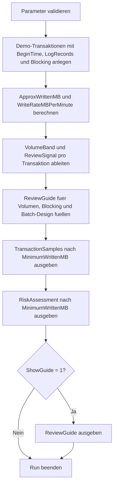

# ActiveTranWriteVolumeSample.sql

Dieses Skript modelliert aktive Schreibtransaktionen als didaktisches Inventar und leitet daraus ungefaehres Logvolumen, Schreibrate und Review-Signale ab. So laesst sich im Kapitel `19_Transaktions` besprechen, warum Volumen, Laufzeit und Blocking zusammen ausgewertet werden sollten.

## Uebersicht

<!-- SQLDOC:SUMMARY_TABLE:BEGIN -->
| Feld | Wert |
|---|---|
| Script | [ActiveTranWriteVolumeSample.sql](ActiveTranWriteVolumeSample.sql) |
| Version | `1.0` |
| Typ | `didactic-lab` |
| Kapitel | `19_Transaktions` |
| Sicherheit | `read-only-tempdb` |
| Zweck | Schaetzt Schreibvolumen aktiver Demo-Transaktionen ab und ordnet das Ergebnis fuer Reviews ein. |
<!-- SQLDOC:SUMMARY_TABLE:END -->

## Einordnung

Produktive Umgebungen ermitteln Schreiblast aktiver Transaktionen meist ueber DMVs, Log-Statistiken oder ein Monitoring-System. Diese Erstversion bleibt bewusst bei modellierten Demo-Faellen, damit das Bewertungsmuster ohne Systemabhaengigkeiten nachvollziehbar bleibt: Wie gross ist das angenommene Volumen, wie lange ist die Transaktion offen, und entstehen parallel Sperren oder Blocking-Ketten?

## Annahmen

- Es handelt sich um eine didaktische Erstversion mit Demo-Daten in `tempdb`.
- Das Schreibvolumen ist eine Approximation aus Anzahl der Logdatensaetze und einer modellierten Durchschnittsgroesse pro Datensatz.
- Die gezeigten Schwellen fuer `low-volume`, `medium-volume` und `high-volume` dienen der Einordnung im Unterricht und nicht als produktive Standardwerte.
- Fuer produktive Analysen sollten spaeter echte DMV- oder Monitoring-Daten statt der Demo-Samples verwendet werden.

## Anwendungsfall

Das Skript eignet sich fuer Unterricht, Reviews und Diagnosegespraeche rund um grosse offene Transaktionen. Es zeigt, dass nicht nur die absolute MB-Zahl relevant ist, sondern auch Dauer, Commit-Verhalten, offene Locks und die Anzahl blockierter Folge-Requests.

## Parameter

<!-- SQLDOC:PARAMETERS_TABLE:BEGIN -->
| Parameter | SQL-Typ | Pflicht | Beschreibung |
|---|---|---|---|
| `@MinimumWrittenMB` | `DECIMAL(18,2)` | Nein | Filtert auf Demo-Transaktionen ab einem ungefaehren Schreibvolumen in MB. |
| `@ShowGuide` | `BIT` | Nein | Gibt bei `1` zusaetzlich einen kompakten Review-Guide aus. |
<!-- SQLDOC:PARAMETERS_TABLE:END -->

## Abhaengigkeiten

<!-- SQLDOC:DEPENDENCIES_LIST:BEGIN -->
- `tempdb` fuer temporaere Tabellen
- `SYSUTCDATETIME`
- `DATEDIFF`
- `CASE`
- `ORDER BY`
<!-- SQLDOC:DEPENDENCIES_LIST:END -->

## Hinweise

- `TransactionSamples` zeigt das Demo-Inventar mit Dauer, approximiertem Volumen und Kontext.
- `RiskAssessment` ordnet jede Transaktion nach Volumenband, Schreibrate und Review-Signal ein.
- Der Guide uebersetzt die Beobachtungen in konkrete Fragen fuer Batch-Design, Blocking und operatives Monitoring.

## Versionshistorie

<!-- SQLDOC:VERSION_HISTORY_TABLE:BEGIN -->
| Version | Datum | User | Beschreibung |
|---|---|---|---|
| `1.0` | `2026-04-19` | `ER` | Erstversion des didaktischen Labs fuer Schreibvolumen aktiver Transaktionen |
<!-- SQLDOC:VERSION_HISTORY_TABLE:END -->

## Ablauf

<!-- SQLDOC:MERMAID:BEGIN -->

<!-- SQLDOC:MERMAID:END -->

## SQL-Code

<!-- SQLDOC:SQL_CODE:BEGIN -->
```sql
/*
BEGIN:SQL-HEADER v1
---
sql_header: v1
script_name: "ActiveTranWriteVolumeSample.sql"
script_version: "1.0"
script_type: "didactic-lab"
chapter: "19_Transaktions"

purpose: >
  Zeigt anhand eines didaktischen Demo-Inventars, wie das geschriebene
  Volumen aktiver Transaktionen abgeschaetzt und fuer ein Review nach
  Dauer, Schreibrate und Blocking-Risiko eingeordnet werden kann.

parameters:
  - name: "@MinimumWrittenMB"
    sql_type: "DECIMAL(18,2)"
    direction: "IN"
    required: false
    description: "Filtert die Ausgabe auf Demo-Transaktionen ab einem ungefaehren Schreibvolumen in MB"
  - name: "@ShowGuide"
    sql_type: "BIT"
    direction: "IN"
    required: false
    description: "1 = zusaetzlich einen kompakten Review-Guide fuer hohe Schreibvolumina ausgeben"

result_sets:
  - name: "TransactionSamples"
    description: "Zeigt das Demo-Inventar aktiver Transaktionen mit Dauer, Logschreibvolumen und Kontext"
  - name: "RiskAssessment"
    description: "Leitet Volumenband, Schreibrate und Review-Signal fuer jede Demo-Transaktion ab"
  - name: "ReviewGuide"
    description: "Fasst Beobachtungen und Guardrails fuer volumenstarke aktive Transaktionen zusammen"

dependencies:
  - "tempdb temporary tables"
  - "SYSUTCDATETIME"
  - "DATEDIFF"
  - "CASE"
  - "ORDER BY"

safety:
  level: "read-only-tempdb"
  writes_data: false

documentation:
  markdown_file: "T-SQL/19_Transaktions/SQLScripts/ActiveTranWriteVolumeSample.md"
  sync_blocks:
    - "SUMMARY_TABLE"
    - "PARAMETERS_TABLE"
    - "DEPENDENCIES_LIST"
    - "VERSION_HISTORY_TABLE"
    - "SQL_CODE"
  mermaid:
    mode: "ai-agent-from-sql"
    source: "script-body"

main_responsible:
  name: "Erhard Rainer"
  initials: "ER"

version_history:
  - version: "1.0"
    date: "2026-04-19"
    user: "ER"
    description: "Erstversion des didaktischen Labs fuer Schreibvolumen aktiver Transaktionen"

notes:
  - "Das Skript arbeitet mit modellierten Demo-Transaktionen statt mit produktiven DMVs oder Live-Logdateien"
  - "Das Schreibvolumen ist eine absichtliche Approximation aus Logdatensatz-Anzahl und durchschnittlicher Groesse"
---
END:SQL-HEADER v1
*/

SET NOCOUNT ON;

-- 1. Parameter vorbereiten
DECLARE @MinimumWrittenMB DECIMAL(18,2) = 0.00;
DECLARE @ShowGuide BIT = 1;

IF @MinimumWrittenMB < 0
BEGIN
    THROW 50000, '@MinimumWrittenMB darf nicht negativ sein.', 1;
END;

IF @ShowGuide NOT IN (0, 1)
BEGIN
    THROW 50001, '@ShowGuide muss 0 oder 1 sein.', 1;
END;

DROP TABLE IF EXISTS #TransactionSamples;
DROP TABLE IF EXISTS #RiskAssessment;
DROP TABLE IF EXISTS #ReviewGuide;

-- 2. Demo-Inventar aktiver Transaktionen aufbauen
CREATE TABLE #TransactionSamples
(
    TransactionID            INT             NOT NULL,
    DatabaseName             SYSNAME         NOT NULL,
    SessionID                SMALLINT        NOT NULL,
    TransactionName          VARCHAR(80)     NOT NULL,
    BeginTimeUtc             DATETIME2(0)    NOT NULL,
    LogRecordsWritten        INT             NOT NULL,
    AvgBytesPerRecord        INT             NOT NULL,
    HasOpenLocks             BIT             NOT NULL,
    BlockingCount            INT             NOT NULL,
    WhyRelevant              VARCHAR(220)    NOT NULL
);

INSERT INTO #TransactionSamples
(
    TransactionID,
    DatabaseName,
    SessionID,
    TransactionName,
    BeginTimeUtc,
    LogRecordsWritten,
    AvgBytesPerRecord,
    HasOpenLocks,
    BlockingCount,
    WhyRelevant
)
VALUES
    (
        4101,
        'SalesLab',
        57,
        'Batch price update',
        DATEADD(MINUTE, -42, SYSUTCDATETIME()),
        195000,
        420,
        1,
        3,
        'Lange laufendes Batch-Beispiel mit spuerbarem Logvolumen und Folge-Blocking.'
    ),
    (
        4102,
        'WarehouseLab',
        63,
        'Inventory sync',
        DATEADD(MINUTE, -11, SYSUTCDATETIME()),
        28000,
        640,
        1,
        1,
        'Mittleres Schreibvolumen mit offener Transaktion waehrend eines Imports.'
    ),
    (
        4103,
        'FinanceLab',
        71,
        'Ledger correction review',
        DATEADD(MINUTE, -6, SYSUTCDATETIME()),
        4200,
        512,
        0,
        0,
        'Kompakte Korrektur mit ueberschaubarem Schreibvolumen als Baseline.'
    ),
    (
        4104,
        'OrderLab',
        88,
        'Archive staging load',
        DATEADD(MINUTE, -28, SYSUTCDATETIME()),
        91000,
        896,
        1,
        5,
        'Groesserer Ladefall, bei dem Volumen, Dauer und Blocking gemeinsam betrachtet werden muessen.'
    );

-- 3. Volumen, Schreibrate und Review-Signale ableiten
CREATE TABLE #RiskAssessment
(
    TransactionID            INT             NOT NULL,
    DatabaseName             SYSNAME         NOT NULL,
    SessionID                SMALLINT        NOT NULL,
    TransactionName          VARCHAR(80)     NOT NULL,
    DurationMinutes          INT             NOT NULL,
    ApproxWrittenMB          DECIMAL(18,2)   NOT NULL,
    WriteRateMBPerMinute     DECIMAL(18,2)   NOT NULL,
    HasOpenLocks             BIT             NOT NULL,
    BlockingCount            INT             NOT NULL,
    VolumeBand               VARCHAR(30)     NOT NULL,
    ReviewSignal             VARCHAR(220)    NOT NULL
);

INSERT INTO #RiskAssessment
(
    TransactionID,
    DatabaseName,
    SessionID,
    TransactionName,
    DurationMinutes,
    ApproxWrittenMB,
    WriteRateMBPerMinute,
    HasOpenLocks,
    BlockingCount,
    VolumeBand,
    ReviewSignal
)
SELECT
    ts.TransactionID,
    ts.DatabaseName,
    ts.SessionID,
    ts.TransactionName,
    DATEDIFF(MINUTE, ts.BeginTimeUtc, SYSUTCDATETIME()) AS DurationMinutes,
    CAST((ts.LogRecordsWritten * ts.AvgBytesPerRecord) / 1048576.0 AS DECIMAL(18,2)) AS ApproxWrittenMB,
    CAST(
        ((ts.LogRecordsWritten * ts.AvgBytesPerRecord) / 1048576.0)
        / NULLIF(CAST(DATEDIFF(MINUTE, ts.BeginTimeUtc, SYSUTCDATETIME()) AS DECIMAL(18,2)), 0)
        AS DECIMAL(18,2)
    ) AS WriteRateMBPerMinute,
    ts.HasOpenLocks,
    ts.BlockingCount,
    CASE
        WHEN (ts.LogRecordsWritten * ts.AvgBytesPerRecord) / 1048576.0 >= 64 THEN 'high-volume'
        WHEN (ts.LogRecordsWritten * ts.AvgBytesPerRecord) / 1048576.0 >= 16 THEN 'medium-volume'
        ELSE 'low-volume'
    END AS VolumeBand,
    CASE
        WHEN ts.BlockingCount >= 3
         AND (ts.LogRecordsWritten * ts.AvgBytesPerRecord) / 1048576.0 >= 64
            THEN 'Hohe Schreiblast plus Blocking: Batch-Groesse, Commit-Frequenz und Log-Kapazitaet priorisiert pruefen.'
        WHEN ts.HasOpenLocks = 1
         AND DATEDIFF(MINUTE, ts.BeginTimeUtc, SYSUTCDATETIME()) >= 20
            THEN 'Laenger offene Schreibtransaktion: Laufzeit, Sperren und Rollback-Kosten eng beobachten.'
        WHEN (ts.LogRecordsWritten * ts.AvgBytesPerRecord) / 1048576.0 >= 16
            THEN 'Mittleres Schreibvolumen: fuer Demo-Zwecke genuegt meist ein Review der Batch-Grenzen und Monitoring-Schwellen.'
        ELSE 'Baseline-Fall: Volumen bleibt ueberschaubar und eignet sich als Vergleich fuer ruhigere Runs.'
    END AS ReviewSignal
FROM #TransactionSamples AS ts;

-- 4. Review-Guide formulieren
CREATE TABLE #ReviewGuide
(
    GuideStep                TINYINT         NOT NULL,
    FocusArea                VARCHAR(80)     NOT NULL,
    Recommendation           VARCHAR(220)    NOT NULL,
    WhyItHelps               VARCHAR(220)    NOT NULL
);

INSERT INTO #ReviewGuide
(
    GuideStep,
    FocusArea,
    Recommendation,
    WhyItHelps
)
VALUES
    (
        1,
        'Volume estimate',
        'Schreibvolumen immer zusammen mit Transaktionsdauer betrachten, nicht isoliert als Einzelwert.',
        'Eine kurze grosse Transaktion und eine lange mittelgrosse Transaktion erzeugen unterschiedliche Risiken fuer Log und Sperren.'
    ),
    (
        2,
        'Blocking context',
        'Hohe Volumina mit offenen Locks oder Blocking-Ketten zuerst untersuchen.',
        'So werden Engpaesse sichtbar, die nicht nur vom Logverbrauch, sondern vom Parallelitaetsverlust herruehren.'
    ),
    (
        3,
        'Batch design',
        'Bei volumenstarken Workloads Batch-Groesse und Commit-Frequenz als erste Stellschrauben pruefen.',
        'Kleinere Commit-Einheiten koennen Rollback-Kosten, Reuse-Wartezeiten und Blockierdauer reduzieren.'
    ),
    (
        4,
        'Operational handoff',
        'Didaktische Samples spaeter auf echte DMVs oder Monitoring-Datenquellen mappen, statt Schwellen blind zu uebernehmen.',
        'Die Demo zeigt Bewertungsmuster, ersetzt aber kein produktives Baselining pro System und Workload.'
    );

-- 5. Resultsets ausgeben
SELECT
    ts.TransactionID,
    ts.DatabaseName,
    ts.SessionID,
    ts.TransactionName,
    DATEDIFF(MINUTE, ts.BeginTimeUtc, SYSUTCDATETIME()) AS DurationMinutes,
    CAST((ts.LogRecordsWritten * ts.AvgBytesPerRecord) / 1048576.0 AS DECIMAL(18,2)) AS ApproxWrittenMB,
    ts.HasOpenLocks,
    ts.BlockingCount,
    ts.WhyRelevant
FROM #TransactionSamples AS ts
WHERE (ts.LogRecordsWritten * ts.AvgBytesPerRecord) / 1048576.0 >= @MinimumWrittenMB
ORDER BY
    ApproxWrittenMB DESC,
    ts.TransactionID;

SELECT
    ra.TransactionID,
    ra.DatabaseName,
    ra.SessionID,
    ra.TransactionName,
    ra.DurationMinutes,
    ra.ApproxWrittenMB,
    ra.WriteRateMBPerMinute,
    ra.HasOpenLocks,
    ra.BlockingCount,
    ra.VolumeBand,
    ra.ReviewSignal
FROM #RiskAssessment AS ra
WHERE ra.ApproxWrittenMB >= @MinimumWrittenMB
ORDER BY
    ra.ApproxWrittenMB DESC,
    ra.DurationMinutes DESC,
    ra.TransactionID;

IF @ShowGuide = 1
BEGIN
    SELECT
        rg.GuideStep,
        rg.FocusArea,
        rg.Recommendation,
        rg.WhyItHelps
    FROM #ReviewGuide AS rg
    ORDER BY
        rg.GuideStep;
END;
```
<!-- SQLDOC:SQL_CODE:END -->
