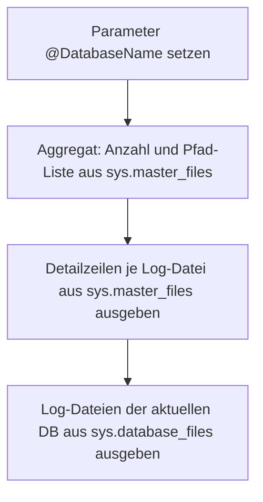

# CheckTransactionsLogsForSpecificDatabaseCount.sql

Dieses Skript ermittelt Anzahl und physische Pfade der Transaction-Log-Dateien fuer eine benannte Datenbank. Es liefert drei Ergebnis-Sets: eine aggregierte Zeile mit Gesamtanzahl und Pfad-Liste, Detailzeilen je Log-Datei aus `sys.master_files` sowie die entsprechenden Eintraege aus `sys.database_files` der aktuell verbundenen Datenbank.

## Uebersicht

<!-- SQLDOC:SUMMARY_TABLE:BEGIN -->
| Feld | Wert |
|---|---|
| Script | [CheckTransactionsLogsForSpecificDatabaseCount.sql](CheckTransactionsLogsForSpecificDatabaseCount.sql) |
| Version | `1.0` |
| Typ | `diagnostic-query` |
| Kapitel | `19_Transaktions` |
| Sicherheit | `read-only` |
| Zweck | Zeigt Anzahl, Pfade und Details der Transaction-Log-Dateien fuer eine benannte Datenbank. |
<!-- SQLDOC:SUMMARY_TABLE:END -->

## Einordnung

Der Unterschied zwischen einer und mehreren Log-Dateien ist fuer Shrink-Skripte entscheidend: `ShrinkSimple.sql` arbeitet nur mit Datenbanken mit genau einer Log-Datei, `ShrinkSimple_multiple_Files.sql` nur mit mehr als einer. Dieses Skript dient als Vorpruefung, um die Anzahl der Log-Dateien schnell festzustellen, bevor ein Shrink-Skript ausgefuehrt wird.

## Annahmen

- `@DatabaseName` muss auf eine existierende Datenbank zeigen; andernfalls liefern die Abfragen leere Ergebnisse.
- Das dritte Result-Set (`sys.database_files`) zeigt immer die Dateien der aktuell verbundenen Datenbank, unabhaengig von `@DatabaseName`.
- `STRING_AGG` erfordert SQL Server 2017 oder Azure SQL.

## Anwendungsfall

Das Skript eignet sich als Vorpruefung vor Shrink-Massnahmen, zur schnellen Inventarisierung von Log-Datei-Setups und zum Verstaendnis des Unterschieds zwischen `sys.master_files` (Instanzebene) und `sys.database_files` (Datenbankebene).

## Parameter

<!-- SQLDOC:PARAMETERS_TABLE:BEGIN -->
| Parameter | SQL-Typ | Pflicht | Beschreibung |
|---|---|---|---|
| `@DatabaseName` | `SYSNAME` | Ja | Name der zu pruefenden Datenbank; alternativ `DB_NAME()` fuer die aktuelle DB |
<!-- SQLDOC:PARAMETERS_TABLE:END -->

## Abhaengigkeiten

<!-- SQLDOC:DEPENDENCIES_LIST:BEGIN -->
- `sys.master_files`
- `sys.database_files`
<!-- SQLDOC:DEPENDENCIES_LIST:END -->

## Hinweise

- Das dritte Result-Set (`sys.database_files`) zeigt immer die Dateien der aktuell verbundenen DB, unabhaengig von `@DatabaseName`.
- `STRING_AGG` erfordert SQL Server 2017 oder Azure SQL.
- Fuer eine instanzweite Uebersicht aller Log-Dateien `ListLogUsageOfAllDB.sql` verwenden.

## Versionshistorie

<!-- SQLDOC:VERSION_HISTORY_TABLE:BEGIN -->
| Version | Datum | User | Beschreibung |
|---|---|---|---|
| `1.0` | `2026-04-21` | `ER` | Erstversion; alter einfacher Kommentar-Header durch SQL-HEADER v1 ersetzt |
<!-- SQLDOC:VERSION_HISTORY_TABLE:END -->

## Ablauf

<!-- SQLDOC:MERMAID:BEGIN -->

<!-- SQLDOC:MERMAID:END -->

## SQL-Code

<!-- SQLDOC:SQL_CODE:BEGIN -->
```sql
/*
BEGIN:SQL-HEADER v1
---
sql_header: v1
script_name: "CheckTransactionsLogsForSpecificDatabaseCount.sql"
script_version: "1.0"
script_type: "diagnostic-query"
chapter: "19_Transaktions"

purpose: >
  Ermittelt Anzahl und physische Pfade der Transaction-Log-Dateien fuer eine
  benannte Datenbank. Liefert drei Ergebnis-Sets: aggregierte Anzahl mit
  Pfad-Liste, Detailzeilen je Log-Datei aus sys.master_files sowie die
  entsprechenden Eintraege aus sys.database_files der aktuellen Datenbank.

parameters:
  - name: "@DatabaseName"
    sql_type: "SYSNAME"
    direction: "IN"
    required: true
    description: "Name der zu pruefenden Datenbank; alternativ DB_NAME() fuer die aktuelle DB"

result_sets:
  - name: "LogFileCount"
    description: "Anzahl der Log-Dateien und kommagetrennte Pfadliste fuer die angegebene Datenbank"
  - name: "LogFileDetails"
    description: "Detailzeilen je Log-Datei aus sys.master_files (file_id, Pfad, Groesse, Wachstum)"
  - name: "CurrentDBLogFiles"
    description: "Log-Dateien der aktuellen Datenbank aus sys.database_files"

dependencies:
  - "sys.master_files"
  - "sys.database_files"

safety:
  level: "read-only"
  writes_data: false

documentation:
  markdown_file: "T-SQL/19_Transaktions/SQLScripts/CheckTransactionsLogsForSpecificDatabaseCount.md"
  sync_blocks:
    - "SUMMARY_TABLE"
    - "PARAMETERS_TABLE"
    - "DEPENDENCIES_LIST"
    - "VERSION_HISTORY_TABLE"
    - "SQL_CODE"
  mermaid:
    mode: "ai-agent-from-sql"
    source: "script-body"

main_responsible:
  name: "Erhard Rainer"
  initials: "ER"

version_history:
  - version: "1.0"
    date: "2026-04-21"
    user: "ER"
    description: "Erstversion; alter einfacher Kommentar-Header durch SQL-HEADER v1 ersetzt"

notes:
  - "Das dritte Result-Set (sys.database_files) zeigt immer die Dateien der aktuell verbundenen DB, unabhaengig von @DatabaseName"
  - "STRING_AGG erfordert SQL Server 2017 oder Azure SQL"
---
END:SQL-HEADER v1
*/

DECLARE @DatabaseName SYSNAME = N'your_database_name';
-- Verwende die aktuelle Datenbank statt einer benannten Datenbank:
-- DECLARE @DatabaseName SYSNAME = DB_NAME();

PRINT N'Ermittle Transaction Log Dateien für Datenbank: ' + @DatabaseName;

SELECT
    DB_NAME(mf.database_id) AS DatabaseName,
    COUNT(*) AS LogFileCount,
    STRING_AGG(mf.physical_name, '; ') WITHIN GROUP (ORDER BY mf.file_id) AS LogFilePaths
FROM sys.master_files AS mf
WHERE mf.database_id = DB_ID(@DatabaseName)
  AND mf.type_desc = 'LOG'
GROUP BY mf.database_id;

SELECT
    mf.file_id,
    mf.name AS LogicalName,
    mf.type_desc AS FileType,
    mf.physical_name AS PhysicalPath,
    mf.size * 8 AS SizeKB,
    mf.max_size,
    mf.growth,
    mf.state_desc
FROM sys.master_files AS mf
WHERE mf.database_id = DB_ID(@DatabaseName)
  AND mf.type_desc = 'LOG'
ORDER BY mf.file_id;

-- Optional: Informationen für die aktuelle Datenbank direkt aus sys.database_files
SELECT
    DB_NAME() AS DatabaseName,
    file_id,
    name AS LogicalName,
    type_desc AS FileType,
    physical_name AS PhysicalPath,
    size * 8 AS SizeKB,
    max_size,
    growth,
    state_desc
FROM sys.database_files
WHERE type_desc = 'LOG'
ORDER BY file_id;
```
<!-- SQLDOC:SQL_CODE:END -->
