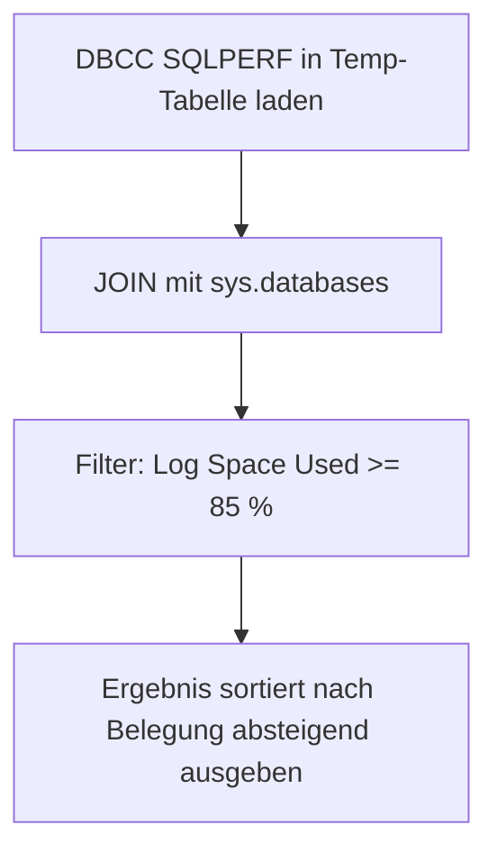

# ListAllCriticalTransactionLogs.sql

Dieses Skript listet gezielt nur jene Datenbanken, bei denen der Transaction-Log-Verbrauch bei mindestens 85 % liegt. Es dient als schneller Ueberblick ueber kritische Log-Fuellstaende und zeigt neben Groesse und Belegung auch den `log_reuse_wait_desc`, um den Blockierungsgrund sofort sichtbar zu machen.

## Uebersicht

<!-- SQLDOC:SUMMARY_TABLE:BEGIN -->
| Feld | Wert |
|---|---|
| Script | [ListAllCriticalTransactionLogs.sql](ListAllCriticalTransactionLogs.sql) |
| Version | `1.0` |
| Typ | `diagnostic-query` |
| Kapitel | `19_Transaktions` |
| Sicherheit | `read-only-tempdb` |
| Zweck | Zeigt nur Datenbanken mit Log-Belegung >= 85 % als kompakte Warnliste. |
<!-- SQLDOC:SUMMARY_TABLE:END -->

## Einordnung

Im Unterschied zu `ListTransactionLogs.sql`, das alle Datenbanken mit Statusklassen ausgibt, konzentriert sich dieses Skript auf den Handlungsbedarf: Nur Datenbanken oberhalb der kritischen Schwelle erscheinen im Ergebnis. Das reduziert Rauschen bei taeglich automatisierten Checks oder beim schnellen Incident-Review.

## Annahmen

- Die Schwelle von 85 % ist hart kodiert; bei Bedarf kann sie in einen Parameter ausgelagert werden.
- `DBCC SQLPERF(LOGSPACE)` liefert aggregierte Werte pro Datenbank, keine Einzel-Datei-Aufloesung.
- Datenbanken unterhalb der Schwelle erscheinen im Ergebnis nicht.

## Anwendungsfall

Das Skript eignet sich als Alarmstufe-Abfrage in Monitoring-Jobs, als erste Massnahme bei einem Log-voll-Incident und als Grundlage fuer die Priorisierung von Shrink- oder Backup-Massnahmen.

## Parameter

Dieses Skript hat keine Parameter.

## Abhaengigkeiten

<!-- SQLDOC:DEPENDENCIES_LIST:BEGIN -->
- `DBCC SQLPERF(LOGSPACE)`
- `sys.databases`
- `tempdb` fuer temporaere Tabellen
<!-- SQLDOC:DEPENDENCIES_LIST:END -->

## Hinweise

- Schwelle 85 % ist als erster Richtwert zu verstehen; produktive Systeme koennen eigene Grenzwerte haben.
- `log_reuse_wait_desc` in der Ausgabe zeigt direkt, warum der Log nicht freigegeben wird.
- Fuer eine vollstaendige Uebersicht aller Datenbanken `ListTransactionLogs.sql` verwenden.

## Versionshistorie

<!-- SQLDOC:VERSION_HISTORY_TABLE:BEGIN -->
| Version | Datum | User | Beschreibung |
|---|---|---|---|
| `1.0` | `2026-04-21` | `ER` | Erstversion |
<!-- SQLDOC:VERSION_HISTORY_TABLE:END -->

## Ablauf

<!-- SQLDOC:MERMAID:BEGIN -->

<!-- SQLDOC:MERMAID:END -->

## SQL-Code

<!-- SQLDOC:SQL_CODE:BEGIN -->
```sql
/*
BEGIN:SQL-HEADER v1
---
sql_header: v1
script_name: "ListAllCriticalTransactionLogs.sql"
script_version: "1.0"
script_type: "diagnostic-query"
chapter: "19_Transaktions"

purpose: >
  Listet nur jene Datenbanken, bei denen der Transaction-Log-Verbrauch bei
  mindestens 85 % liegt. Dient als schneller Ueberblick ueber kritische
  Log-Fuellstaende quer ueber alle Datenbanken.

parameters: []

result_sets:
  - name: "CriticalLogs"
    description: "Datenbanken mit Log-Belegung >= 85 % sortiert nach Belegung absteigend"

dependencies:
  - "DBCC SQLPERF(LOGSPACE)"
  - "sys.databases"
  - "tempdb temporary tables"

safety:
  level: "read-only-tempdb"
  writes_data: false

documentation:
  markdown_file: "T-SQL/19_Transaktions/SQLScripts/ListAllCriticalTransactionLogs.md"
  sync_blocks:
    - "SUMMARY_TABLE"
    - "DEPENDENCIES_LIST"
    - "VERSION_HISTORY_TABLE"
    - "SQL_CODE"
  mermaid:
    mode: "ai-agent-from-sql"
    source: "script-body"

main_responsible:
  name: "Erhard Rainer"
  initials: "ER"

version_history:
  - version: "1.0"
    date: "2026-04-21"
    user: "ER"
    description: "Erstversion"

notes:
  - "Schwelle von 85 % ist hart kodiert; bei Bedarf in einen Parameter auslagern"
  - "DBCC SQLPERF liefert nur DB-weite Aggregatwerte, keine Datei-Einzelansicht"
---
END:SQL-HEADER v1
*/

IF OBJECT_ID('tempdb..#LogSpace') IS NOT NULL
    DROP TABLE #LogSpace;

CREATE TABLE #LogSpace
(
    [Database Name]      SYSNAME,
    [Log Size (MB)]      DECIMAL(18,2),
    [Log Space Used (%)] DECIMAL(18,2),
    [Status]             INT
);

INSERT INTO #LogSpace
EXEC ('DBCC SQLPERF(LOGSPACE)');

SELECT
    ls.[Database Name] AS DatabaseName,
    d.recovery_model_desc AS RecoveryModel,
    CAST(ls.[Log Size (MB)] AS DECIMAL(18,2)) AS LogSizeMB,
    CAST(ls.[Log Space Used (%)] AS DECIMAL(18,2)) AS LogUsedPct,
    d.log_reuse_wait_desc
FROM #LogSpace AS ls
INNER JOIN sys.databases AS d
    ON d.name = ls.[Database Name]
WHERE ls.[Log Space Used (%)] >= 85
ORDER BY ls.[Log Space Used (%)] DESC;
```
<!-- SQLDOC:SQL_CODE:END -->
