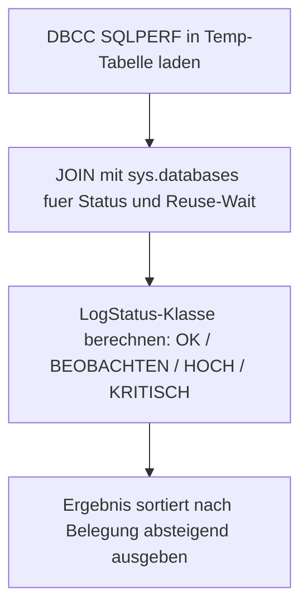

# ListTransactionLogs.sql

Dieses Skript listet alle Transaction-Log-Dateien aller Datenbanken mit Groesse, Belegung, freiem Speicher und `log_reuse_wait_desc`. Auf Basis des prozentualen Log-Verbrauchs wird jede Datenbank in eine einfache Statusklasse eingeordnet: `OK`, `BEOBACHTEN`, `HOCH` oder `KRITISCH`.

## Uebersicht

<!-- SQLDOC:SUMMARY_TABLE:BEGIN -->
| Feld | Wert |
|---|---|
| Script | [ListTransactionLogs.sql](ListTransactionLogs.sql) |
| Version | `1.0` |
| Typ | `diagnostic-query` |
| Kapitel | `19_Transaktions` |
| Sicherheit | `read-only-tempdb` |
| Zweck | Listet Log-Groesse, Belegung, freien Speicher und Statusklasse fuer alle Datenbanken. |
<!-- SQLDOC:SUMMARY_TABLE:END -->

## Einordnung

Die Abfrage dient als erster Schritt bei der Log-Ueberwachung: Ein einziger Blick genuegt, um zu erkennen, welche Datenbanken kritischen Log-Fuellstand aufweisen und wo `log_reuse_wait_desc` bereits auf ein strukturelles Problem hindeutet. Die Statusklassen sind Faustregeln und koennen je Umgebung verfeinert werden.

## Annahmen

- `DBCC SQLPERF(LOGSPACE)` liefert aggregierte Werte pro Datenbank, keine Einzel-Datei-Aufloesung.
- Alle systemdatenbanken und User-Datenbanken werden gleichermassen erfasst.
- Die Statusklassen (KRITISCH >= 95 %, HOCH >= 85 %, BEOBACHTEN >= 70 %) sind hart kodiert.

## Anwendungsfall

Das Skript eignet sich fuer taeglich automatisierte Monitoring-Abfragen, fuer schnelle Incident-Triage bei Log-vollen-Fehlern sowie als Startpunkt fuer eine tiefere Analyse mit `sys.dm_db_log_stats`.

## Parameter

Dieses Skript hat keine Parameter.

## Abhaengigkeiten

<!-- SQLDOC:DEPENDENCIES_LIST:BEGIN -->
- `DBCC SQLPERF(LOGSPACE)`
- `sys.databases`
- `tempdb` fuer temporaere Tabellen
<!-- SQLDOC:DEPENDENCIES_LIST:END -->

## Hinweise

- Der `LogStatus`-Wert zeigt nur eine Momentaufnahme; bei BEOBACHTEN oder HOCH lohnt sich eine regelmaessige Trendbeobachtung.
- `log_reuse_wait_desc` erklaert, warum der Log-Space noch nicht freigegeben werden kann – das ist oft wichtiger als die absolute Groesse.
- DBCC SQLPERF liefert keine Datei-Einzelansicht; fuer Mehrdatei-Setups `ListLogUsageOfAllDB.sql` verwenden.

## Versionshistorie

<!-- SQLDOC:VERSION_HISTORY_TABLE:BEGIN -->
| Version | Datum | User | Beschreibung |
|---|---|---|---|
| `1.0` | `2026-04-21` | `ER` | Erstversion |
<!-- SQLDOC:VERSION_HISTORY_TABLE:END -->

## Ablauf

<!-- SQLDOC:MERMAID:BEGIN -->

<!-- SQLDOC:MERMAID:END -->

## SQL-Code

<!-- SQLDOC:SQL_CODE:BEGIN -->
```sql
/*
BEGIN:SQL-HEADER v1
---
sql_header: v1
script_name: "ListTransactionLogs.sql"
script_version: "1.0"
script_type: "diagnostic-query"
chapter: "19_Transaktions"

purpose: >
  Listet alle Transaction-Log-Dateien aller Datenbanken mit Groesse, Belegung,
  freiem Speicher, log_reuse_wait_desc und einer einfachen Statusklassifikation
  (OK / BEOBACHTEN / HOCH / KRITISCH) auf Basis des prozentualen Log-Verbrauchs.

parameters: []

result_sets:
  - name: "LogSpaceOverview"
    description: "Alle Datenbanken mit Log-Groesse, Belegung, freiem Speicher und Statusklasse"

dependencies:
  - "DBCC SQLPERF(LOGSPACE)"
  - "sys.databases"
  - "tempdb temporary tables"

safety:
  level: "read-only-tempdb"
  writes_data: false

documentation:
  markdown_file: "T-SQL/19_Transaktions/SQLScripts/ListTransactionLogs.md"
  sync_blocks:
    - "SUMMARY_TABLE"
    - "DEPENDENCIES_LIST"
    - "VERSION_HISTORY_TABLE"
    - "SQL_CODE"
  mermaid:
    mode: "ai-agent-from-sql"
    source: "script-body"

main_responsible:
  name: "Erhard Rainer"
  initials: "ER"

version_history:
  - version: "1.0"
    date: "2026-04-21"
    user: "ER"
    description: "Erstversion"

notes:
  - "DBCC SQLPERF(LOGSPACE) liefert DB-weit aggregierte Werte, keine Einzeldatei-Aufloesung"
  - "Statusklassen basieren auf fixen Schwellen; diese koennen je Umgebung abweichen"
---
END:SQL-HEADER v1
*/

IF OBJECT_ID('tempdb..#LogSpace') IS NOT NULL
    DROP TABLE #LogSpace;

CREATE TABLE #LogSpace
(
    [Database Name]      SYSNAME,
    [Log Size (MB)]      DECIMAL(18,2),
    [Log Space Used (%)] DECIMAL(18,2),
    [Status]             INT
);

INSERT INTO #LogSpace
EXEC ('DBCC SQLPERF(LOGSPACE)');

SELECT
    ls.[Database Name] AS DatabaseName,
    d.state_desc AS DatabaseState,
    d.recovery_model_desc AS RecoveryModel,
    CAST(ls.[Log Size (MB)] AS DECIMAL(18,2)) AS LogSizeMB,
    CAST(ls.[Log Space Used (%)] AS DECIMAL(18,2)) AS LogUsedPct,
    CAST(ls.[Log Size (MB)] * ls.[Log Space Used (%)] / 100.0 AS DECIMAL(18,2)) AS LogUsedMB,
    CAST(ls.[Log Size (MB)] * (100.0 - ls.[Log Space Used (%)]) / 100.0 AS DECIMAL(18,2)) AS LogFreeMB,
    d.log_reuse_wait_desc,
    CASE
        WHEN ls.[Log Space Used (%)] >= 95 THEN 'KRITISCH'
        WHEN ls.[Log Space Used (%)] >= 85 THEN 'HOCH'
        WHEN ls.[Log Space Used (%)] >= 70 THEN 'BEOBACHTEN'
        ELSE 'OK'
    END AS LogStatus
FROM #LogSpace AS ls
LEFT JOIN sys.databases AS d
    ON d.name = ls.[Database Name]
ORDER BY
    ls.[Log Space Used (%)] DESC,
    ls.[Log Size (MB)] DESC;
```
<!-- SQLDOC:SQL_CODE:END -->
