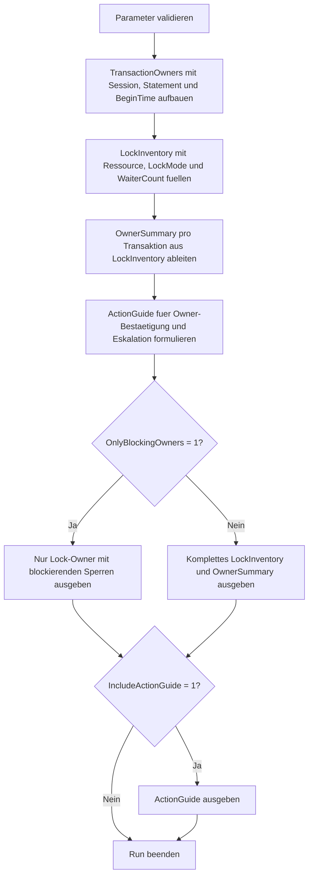

# LockOwnerByTransaction.sql

Dieses Skript ordnet modellierte Sperren ihren besitzenden Transaktionen zu und macht sichtbar, wie Session, Sperrmodus, Ressourcentyp und wartende Folge-Requests zusammen gelesen werden koennen. Die Erstversion bleibt bewusst didaktisch und arbeitet ohne produktive DMV-Abfragen.

## Uebersicht

<!-- SQLDOC:SUMMARY_TABLE:BEGIN -->
| Feld | Wert |
|---|---|
| Script | [LockOwnerByTransaction.sql](LockOwnerByTransaction.sql) |
| Version | `1.0` |
| Typ | `didactic-lab` |
| Kapitel | `19_Transaktions` |
| Sicherheit | `read-only-tempdb` |
| Zweck | Ordnet modellierte Sperren ihren besitzenden Transaktionen zu und bewertet deren Blocking-Wirkung. |
<!-- SQLDOC:SUMMARY_TABLE:END -->

## Einordnung

Bei Sperranalysen reicht es nicht, nur auf die wartende Session zu schauen. Entscheidend ist, welche Transaktion die Sperre besitzt, wie lange sie schon offen ist und wie viele Folge-Requests dadurch warten. Das Skript konzentriert sich deshalb auf Lock-Owner-Sicht statt auf reine Waiter-Listen.

## Annahmen

- Es handelt sich um eine didaktische Erstversion mit modellierten Transaktionen und Sperren in `tempdb`.
- Die Zuordnung zeigt bewusst Bewertungsmuster statt produktiver DMV-Momentaufnahmen.
- `EscalationPriority` ist eine Unterrichts- und Review-Heuristik aus wartenden Sessions, blockierenden Sperren und Transaktionsalter.
- Fuer produktive Analysen sollten spaeter echte Lock-, Session- und Transaction-Sichten gemeinsam ausgewertet werden.

## Anwendungsfall

Das Skript eignet sich fuer Unterricht, Incident-Reviews und Troubleshooting-Workshops zu Blocking, Lock-Ownership und Root-Cause-Analyse. Es hilft dabei, Blockierungsbilder nicht nur aus Sicht der Opfer, sondern aus Sicht der besitzenden Transaktion zu strukturieren.

## Parameter

<!-- SQLDOC:PARAMETERS_TABLE:BEGIN -->
| Parameter | SQL-Typ | Pflicht | Beschreibung |
|---|---|---|---|
| `@OnlyBlockingOwners` | `BIT` | Nein | Zeigt bei `1` nur Transaktionen mit mindestens einer blockierenden Sperre. |
| `@IncludeActionGuide` | `BIT` | Nein | Gibt bei `1` zusaetzlich einen Analyse- und Eskalationsguide aus. |
<!-- SQLDOC:PARAMETERS_TABLE:END -->

## Abhaengigkeiten

<!-- SQLDOC:DEPENDENCIES_LIST:BEGIN -->
- `tempdb` fuer temporaere Tabellen
- `SYSUTCDATETIME`
- `DATEDIFF`
- `CASE`
- `ORDER BY`
<!-- SQLDOC:DEPENDENCIES_LIST:END -->

## Hinweise

- `LockInventory` zeigt Ressource, Sperrmodus und unmittelbare Blockierungswirkung je Sperre.
- `OwnerSummary` verdichtet das Sperrbild je Transaktion zu Dauer, Warteschlange und Eskalationssignal.
- Der Guide trennt bestaetigte Lock-Owner-Analyse von vorschnellen Reaktionen auf einzelne wartende Sessions.

## Versionshistorie

<!-- SQLDOC:VERSION_HISTORY_TABLE:BEGIN -->
| Version | Datum | User | Beschreibung |
|---|---|---|---|
| `1.0` | `2026-04-19` | `ER` | Erstversion des didaktischen Labs zur Zuordnung von Sperren zu Transaktionen |
<!-- SQLDOC:VERSION_HISTORY_TABLE:END -->

## Ablauf

<!-- SQLDOC:MERMAID:BEGIN -->

<!-- SQLDOC:MERMAID:END -->

## SQL-Code

<!-- SQLDOC:SQL_CODE:BEGIN -->
```sql
/*
BEGIN:SQL-HEADER v1
---
sql_header: v1
script_name: "LockOwnerByTransaction.sql"
script_version: "1.0"
script_type: "didactic-lab"
chapter: "19_Transaktions"

purpose: >
  Ordnet modellierte Sperren ihren besitzenden Transaktionen zu und
  zeigt, wie sich Session, Transaktionsalter, Sperrmodus und
  Blockierungswirkung gemeinsam fuer Review und Troubleshooting
  interpretieren lassen.

parameters:
  - name: "@OnlyBlockingOwners"
    sql_type: "BIT"
    direction: "IN"
    required: false
    description: "1 = nur Transaktionen mit mindestens einer blockierenden Sperre ausgeben"
  - name: "@IncludeActionGuide"
    sql_type: "BIT"
    direction: "IN"
    required: false
    description: "1 = zusaetzlich einen Guide fuer Analyse und Eskalation ausgeben"

result_sets:
  - name: "LockInventory"
    description: "Zeigt modellierte Sperren mit Ressource, Modus und besitzender Transaktion"
  - name: "OwnerSummary"
    description: "Fasst pro Transaktion Anzahl Sperren, Blockierungswirkung und Review-Signal zusammen"
  - name: "ActionGuide"
    description: "Leitet Guardrails fuer Analyse, Kommunikation und weitere Pruefschritte ab"

dependencies:
  - "tempdb temporary tables"
  - "SYSUTCDATETIME"
  - "DATEDIFF"
  - "CASE"
  - "ORDER BY"

safety:
  level: "read-only-tempdb"
  writes_data: false

documentation:
  markdown_file: "T-SQL/19_Transaktions/SQLScripts/LockOwnerByTransaction.md"
  sync_blocks:
    - "SUMMARY_TABLE"
    - "PARAMETERS_TABLE"
    - "DEPENDENCIES_LIST"
    - "VERSION_HISTORY_TABLE"
    - "SQL_CODE"
  mermaid:
    mode: "ai-agent-from-sql"
    source: "script-body"

main_responsible:
  name: "Erhard Rainer"
  initials: "ER"

version_history:
  - version: "1.0"
    date: "2026-04-19"
    user: "ER"
    description: "Erstversion des didaktischen Labs zur Zuordnung von Sperren zu Transaktionen"

notes:
  - "Das Skript arbeitet mit modellierten Sperren statt mit produktiven DMV-Abfragen"
  - "Die Zuordnung zeigt didaktische Bewertungsmuster fuer Lock-Owner, Blocking und Eskalationsprioritaet"
---
END:SQL-HEADER v1
*/

SET NOCOUNT ON;

-- 1. Parameter vorbereiten
DECLARE @OnlyBlockingOwners BIT = 0;
DECLARE @IncludeActionGuide BIT = 1;

IF @OnlyBlockingOwners NOT IN (0, 1)
BEGIN
    THROW 50000, '@OnlyBlockingOwners muss 0 oder 1 sein.', 1;
END;

IF @IncludeActionGuide NOT IN (0, 1)
BEGIN
    THROW 50001, '@IncludeActionGuide muss 0 oder 1 sein.', 1;
END;

DROP TABLE IF EXISTS #TransactionOwners;
DROP TABLE IF EXISTS #LockInventory;
DROP TABLE IF EXISTS #OwnerSummary;
DROP TABLE IF EXISTS #ActionGuide;

-- 2. Modellierte Transaktionsbesitzer aufbauen
CREATE TABLE #TransactionOwners
(
    TransactionID             INT             NOT NULL,
    SessionID                 SMALLINT        NOT NULL,
    DatabaseName              SYSNAME         NOT NULL,
    TransactionName           VARCHAR(90)     NOT NULL,
    BeginTimeUtc              DATETIME2(0)    NOT NULL,
    OpenStatement             VARCHAR(120)    NOT NULL,
    WorkloadLabel             VARCHAR(80)     NOT NULL,
    WhyRelevant               VARCHAR(220)    NOT NULL
);

INSERT INTO #TransactionOwners
(
    TransactionID,
    SessionID,
    DatabaseName,
    TransactionName,
    BeginTimeUtc,
    OpenStatement,
    WorkloadLabel,
    WhyRelevant
)
VALUES
    (
        5101,
        57,
        'SalesLab',
        'Batch price update',
        DATEADD(MINUTE, -36, SYSUTCDATETIME()),
        'UPDATE dbo.PricePlan SET Amount = ...',
        'pricing-batch',
        'Laenger laufende Demo-Transaktion mit exklusiven Sperren auf Preis- und Indexressourcen.'
    ),
    (
        5102,
        63,
        'WarehouseLab',
        'Inventory sync',
        DATEADD(MINUTE, -14, SYSUTCDATETIME()),
        'MERGE dbo.StockSnapshot AS target ...',
        'inventory-sync',
        'Typischer Synchronisationslauf mit gemischten Update- und Intent-Sperren.'
    ),
    (
        5103,
        72,
        'FinanceLab',
        'Month-end review',
        DATEADD(MINUTE, -8, SYSUTCDATETIME()),
        'SELECT ... FROM dbo.Ledger WITH (HOLDLOCK)',
        'finance-review',
        'Didaktischer Leser mit absichtlich langer Haltezeit fuer Shared-Locks.'
    ),
    (
        5104,
        88,
        'SupportLab',
        'Case import correction',
        DATEADD(MINUTE, -22, SYSUTCDATETIME()),
        'DELETE FROM dbo.CaseStage WHERE ...',
        'support-cleanup',
        'Demo-Fall mit Loeschtransaktion und mehreren nachgelagerten Wartern.'
    );

-- 3. Modellierte Sperren den Besitzern zuordnen
CREATE TABLE #LockInventory
(
    LockID                     INT             NOT NULL,
    TransactionID              INT             NOT NULL,
    SessionID                  SMALLINT        NOT NULL,
    DatabaseName               SYSNAME         NOT NULL,
    ResourceType               VARCHAR(40)     NOT NULL,
    ResourceName               VARCHAR(120)    NOT NULL,
    LockMode                   VARCHAR(20)     NOT NULL,
    WaiterCount                INT             NOT NULL,
    IsBlockingLock             BIT             NOT NULL,
    LockNarrative              VARCHAR(220)    NOT NULL
);

INSERT INTO #LockInventory
(
    LockID,
    TransactionID,
    SessionID,
    DatabaseName,
    ResourceType,
    ResourceName,
    LockMode,
    WaiterCount,
    IsBlockingLock,
    LockNarrative
)
VALUES
    (
        1,
        5101,
        57,
        'SalesLab',
        'KEY',
        'dbo.PricePlan.PK_PricePlan',
        'X',
        3,
        1,
        'Exklusive Sperre auf Preisdatensaetzen blockiert Folgeupdates und Lesefaelle mit strenger Isolation.'
    ),
    (
        2,
        5101,
        57,
        'SalesLab',
        'PAGE',
        'dbo.PricePlan nonclustered index page',
        'IX',
        1,
        1,
        'Intent-Sperre signalisiert laufende Schreibarbeit und erhoeht die Breite des Blockierungsfensters.'
    ),
    (
        3,
        5102,
        63,
        'WarehouseLab',
        'OBJECT',
        'dbo.StockSnapshot',
        'IX',
        1,
        1,
        'MERGE-Lauf haelt Objektabsicht fuer mehrere Zeilenoperationen.'
    ),
    (
        4,
        5102,
        63,
        'WarehouseLab',
        'KEY',
        'dbo.StockSnapshot.PK_StockSnapshot',
        'U',
        0,
        0,
        'Update-Lock zeigt reservierte Aenderungsabsicht ohne akute Blockierung im Demo-Zeitpunkt.'
    ),
    (
        5,
        5103,
        72,
        'FinanceLab',
        'HOBT',
        'dbo.Ledger clustered range',
        'S',
        0,
        0,
        'Shared-Lock aus bewusst langer Review-Abfrage mit HOLDLOCK.'
    ),
    (
        6,
        5104,
        88,
        'SupportLab',
        'KEY',
        'dbo.CaseStage.PK_CaseStage',
        'X',
        4,
        1,
        'Loeschtransaktion haelt exklusive Sperren und blockiert nachgelagerte Korrektur- sowie Reporting-Jobs.'
    ),
    (
        7,
        5104,
        88,
        'SupportLab',
        'OBJECT',
        'dbo.CaseStage',
        'IX',
        2,
        1,
        'Intent-Sperre auf dem Objekt macht die Reichweite der offenen Aenderung sichtbar.'
    );

-- 4. Zusammenfassung pro Lock-Owner ableiten
CREATE TABLE #OwnerSummary
(
    TransactionID              INT             NOT NULL,
    SessionID                  SMALLINT        NOT NULL,
    DatabaseName               SYSNAME         NOT NULL,
    TransactionName            VARCHAR(90)     NOT NULL,
    DurationMinutes            INT             NOT NULL,
    LockCount                  INT             NOT NULL,
    BlockingLockCount          INT             NOT NULL,
    TotalWaiters               INT             NOT NULL,
    DominantLockMode           VARCHAR(20)     NOT NULL,
    EscalationPriority         VARCHAR(20)     NOT NULL,
    ReviewSignal               VARCHAR(220)    NOT NULL
);

INSERT INTO #OwnerSummary
(
    TransactionID,
    SessionID,
    DatabaseName,
    TransactionName,
    DurationMinutes,
    LockCount,
    BlockingLockCount,
    TotalWaiters,
    DominantLockMode,
    EscalationPriority,
    ReviewSignal
)
SELECT
    towner.TransactionID,
    towner.SessionID,
    towner.DatabaseName,
    towner.TransactionName,
    DATEDIFF(MINUTE, towner.BeginTimeUtc, SYSUTCDATETIME()) AS DurationMinutes,
    COUNT(*) AS LockCount,
    SUM(CASE WHEN li.IsBlockingLock = 1 THEN 1 ELSE 0 END) AS BlockingLockCount,
    SUM(li.WaiterCount) AS TotalWaiters,
    CASE
        WHEN SUM(CASE WHEN li.LockMode = 'X' THEN 1 ELSE 0 END) > 0 THEN 'X'
        WHEN SUM(CASE WHEN li.LockMode = 'U' THEN 1 ELSE 0 END) > 0 THEN 'U'
        ELSE 'S/IX'
    END AS DominantLockMode,
    CASE
        WHEN SUM(li.WaiterCount) >= 5 THEN 'urgent'
        WHEN SUM(CASE WHEN li.IsBlockingLock = 1 THEN 1 ELSE 0 END) >= 2 THEN 'high'
        ELSE 'review'
    END AS EscalationPriority,
    CASE
        WHEN SUM(li.WaiterCount) >= 5 THEN 'Mehrere wartende Sessions: Root-Cause, Transaktionsbesitzer und moegliches Rollback-Fenster priorisiert pruefen.'
        WHEN SUM(CASE WHEN li.IsBlockingLock = 1 THEN 1 ELSE 0 END) >= 2 THEN 'Mehrere blockierende Sperren: Commit-Grenzen, Batch-Design und Session-Kontext gemeinsam betrachten.'
        WHEN MAX(li.LockMode) = 'S' THEN 'Lesende Langlaeufer mit HOLDLOCK nur kurz halten und Isolationsbedarf hinterfragen.'
        ELSE 'Sperrbild dient als ruhiger Baseline-Fall fuer Reviews und Vergleiche.'
    END AS ReviewSignal
FROM #TransactionOwners AS towner
INNER JOIN #LockInventory AS li
    ON li.TransactionID = towner.TransactionID
GROUP BY
    towner.TransactionID,
    towner.SessionID,
    towner.DatabaseName,
    towner.TransactionName,
    towner.BeginTimeUtc;

-- 5. Guide fuer Analyse und Eskalation formulieren
CREATE TABLE #ActionGuide
(
    GuideStep                  TINYINT         NOT NULL,
    FocusArea                  VARCHAR(80)     NOT NULL,
    Recommendation             VARCHAR(220)    NOT NULL,
    WhyItHelps                 VARCHAR(220)    NOT NULL
);

INSERT INTO #ActionGuide
(
    GuideStep,
    FocusArea,
    Recommendation,
    WhyItHelps
)
VALUES
    (
        1,
        'Owner confirmation',
        'Vor Eskalation immer Session, offene Anweisung und zugehoerige Transaktion gemeinsam bestaetigen.',
        'So wird verhindert, dass nur ein wartender Prozess statt des eigentlichen Lock-Owners analysiert wird.'
    ),
    (
        2,
        'Blocking breadth',
        'Nicht nur die Anzahl Sperren, sondern vor allem wartende Sessions und Ressourcentypen bewerten.',
        'Wenige breite Sperren koennen folgenreicher sein als viele harmlose Nebensperren.'
    ),
    (
        3,
        'Transaction age',
        'Sperrmodus immer zusammen mit Transaktionsalter und Arbeitslastlabel lesen.',
        'Ein kurzer IX-Lock im Batch ist anders zu beurteilen als ein lange gehaltener X-Lock im Korrekturlauf.'
    ),
    (
        4,
        'Operational handoff',
        'Didaktische Ergebnisse spaeter auf echte DMVs wie Lock-, Session- und Transaction-Sichten mappen.',
        'Die Demo vermittelt das Bewertungsmuster, ersetzt aber keine produktive Momentaufnahme.'
    );

-- 6. Resultsets ausgeben
SELECT
    li.LockID,
    li.TransactionID,
    li.SessionID,
    li.DatabaseName,
    li.ResourceType,
    li.ResourceName,
    li.LockMode,
    li.WaiterCount,
    li.IsBlockingLock,
    li.LockNarrative
FROM #LockInventory AS li
INNER JOIN #OwnerSummary AS os
    ON os.TransactionID = li.TransactionID
WHERE @OnlyBlockingOwners = 0
   OR os.BlockingLockCount > 0
ORDER BY
    li.WaiterCount DESC,
    li.TransactionID,
    li.LockID;

SELECT
    os.TransactionID,
    os.SessionID,
    os.DatabaseName,
    os.TransactionName,
    os.DurationMinutes,
    os.LockCount,
    os.BlockingLockCount,
    os.TotalWaiters,
    os.DominantLockMode,
    os.EscalationPriority,
    os.ReviewSignal
FROM #OwnerSummary AS os
WHERE @OnlyBlockingOwners = 0
   OR os.BlockingLockCount > 0
ORDER BY
    os.TotalWaiters DESC,
    os.DurationMinutes DESC,
    os.TransactionID;

IF @IncludeActionGuide = 1
BEGIN
    SELECT
        ag.GuideStep,
        ag.FocusArea,
        ag.Recommendation,
        ag.WhyItHelps
    FROM #ActionGuide AS ag
    ORDER BY
        ag.GuideStep;
END;
```
<!-- SQLDOC:SQL_CODE:END -->
