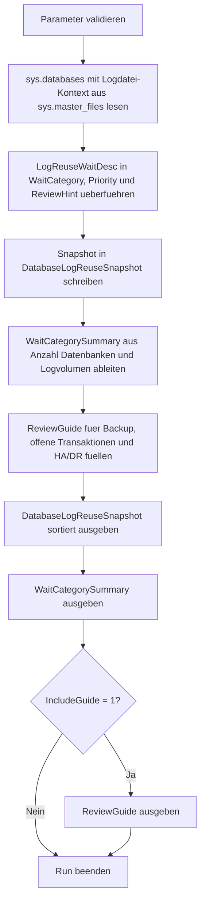

# LogReuseWaitSnapshot.sql

Dieses Skript erstellt einen lesenden Snapshot ueber `log_reuse_wait_desc` in allen Datenbanken der Instanz. Es kombiniert den aktuellen Wait-Typ mit Recovery-Modell, Datenbankstatus, ungefaehrer Loggroesse und einem kompakten Review-Hinweis, damit im Kapitel `19_Transaktions` die Ursachen fuer ausbleibende Log-Wiederverwendung systematisch besprochen werden koennen.

## Uebersicht

<!-- SQLDOC:SUMMARY_TABLE:BEGIN -->
| Feld | Wert |
|---|---|
| Script | [LogReuseWaitSnapshot.sql](LogReuseWaitSnapshot.sql) |
| Version | `1.0` |
| Typ | `diagnostic-query` |
| Kapitel | `19_Transaktions` |
| Sicherheit | `read-only` |
| Zweck | Erstellt einen Snapshot ueber `log_reuse_wait_desc` in allen Datenbanken und ordnet den Befund fuer Reviews ein. |
<!-- SQLDOC:SUMMARY_TABLE:END -->

## Einordnung

`log_reuse_wait_desc` ist ein kompakter Diagnosewert, der erklaert, warum freier Bereich im Transaktionslog aktuell nicht wiederverwendet werden kann. Fuer eine belastbare Einordnung reicht der Wait-Typ allein aber nicht aus: Recovery-Modell, Backup-Strategie, HA/DR-Features, offene Transaktionen und die aktuelle Logauslastung muessen mitgelesen werden. Dieses Skript bleibt bewusst lesend und eignet sich daher als sichere Bestandsaufnahme vor tieferen Analysen.

## Annahmen

- Das Skript ist als diagnostische Erstversion fuer SQL Server konzipiert und liest nur Instanzmetadaten sowie einen instanzweiten Logspace-Snapshot via `DBCC SQLPERF(LOGSPACE)`.
- `UsedLogSizeMB` wird aus der von `DBCC SQLPERF(LOGSPACE)` gelieferten Prozentnutzung und der gemeldeten Loggroesse je Datenbank abgeleitet.
- Die Review-Priorisierung ist eine didaktische Heuristik und ersetzt keine betriebliche Eskalationsmatrix.
- Nicht standardisierte oder seltener genutzte Wait-Typen werden bewusst in eine neutrale Kategorie `other` eingeordnet.

## Anwendungsfall

Das Skript passt zu Betriebsreviews, Unterrichtseinheiten und Erstanalysen rund um wachsende Logdateien. Es hilft dabei, zwischen eher erwartbaren Zustaenden wie `CHECKPOINT` und problematischeren Ursachen wie `ACTIVE_TRANSACTION`, `LOG_BACKUP` oder HA/DR-bedingtem Rueckstau zu unterscheiden.

## Parameter

<!-- SQLDOC:PARAMETERS_TABLE:BEGIN -->
| Parameter | SQL-Typ | Pflicht | Beschreibung |
|---|---|---|---|
| `@IncludeOfflineDatabases` | `BIT` | Nein | Nimmt bei `1` auch Datenbanken ausserhalb des ONLINE-Status in den Snapshot auf. |
| `@IncludeGuide` | `BIT` | Nein | Gibt bei `1` zusaetzlich einen Leitfaden fuer typische Log-Reuse-Waits aus. |
<!-- SQLDOC:PARAMETERS_TABLE:END -->

## Abhaengigkeiten

<!-- SQLDOC:DEPENDENCIES_LIST:BEGIN -->
- `sys.databases`
- `sys.master_files`
- `DBCC SQLPERF(LOGSPACE)`
- `CASE`
- `SUM`
- `ORDER BY`
<!-- SQLDOC:DEPENDENCIES_LIST:END -->

## Hinweise

- `DatabaseLogReuseSnapshot` zeigt den aktuellen Wait-Kontext pro Datenbank und sortiert nach Review-Prioritaet.
- `WaitCategorySummary` fasst gleiche Wait-Gruppen ueber mehrere Datenbanken zusammen.
- Der optionale Guide uebersetzt typische Ursachen in die naechsten Diagnosefragen fuer Backup, offene Transaktionen und HA/DR.

## Versionshistorie

<!-- SQLDOC:VERSION_HISTORY_TABLE:BEGIN -->
| Version | Datum | User | Beschreibung |
|---|---|---|---|
| `1.0` | `2026-04-19` | `ER` | Erstversion des Snapshots fuer `log_reuse_wait_desc` ueber alle Datenbanken |
<!-- SQLDOC:VERSION_HISTORY_TABLE:END -->

## Ablauf

<!-- SQLDOC:MERMAID:BEGIN -->

<!-- SQLDOC:MERMAID:END -->

## SQL-Code

<!-- SQLDOC:SQL_CODE:BEGIN -->
```sql
/*
BEGIN:SQL-HEADER v1
---
sql_header: v1
script_name: "LogReuseWaitSnapshot.sql"
script_version: "1.0"
script_type: "diagnostic-query"
chapter: "19_Transaktions"

purpose: >
  Erstellt einen Snapshot ueber log_reuse_wait_desc in allen Datenbanken
  der Instanz und ergaenzt den Befund um Recovery-Modell, Status,
  ungefaehre Loggroesse und kompakte Review-Hinweise.

parameters:
  - name: "@IncludeOfflineDatabases"
    sql_type: "BIT"
    direction: "IN"
    required: false
    description: "1 = auch Datenbanken ausserhalb des ONLINE-Status in den Snapshot aufnehmen"
  - name: "@IncludeGuide"
    sql_type: "BIT"
    direction: "IN"
    required: false
    description: "1 = zusaetzlich einen Leitfaden fuer typische Log-Reuse-Waits ausgeben"

result_sets:
  - name: "DatabaseLogReuseSnapshot"
    description: "Zeigt pro Datenbank den aktuellen log_reuse_wait_desc samt Status- und Logkontext"
  - name: "WaitCategorySummary"
    description: "Verdichtet die beobachteten Wait-Gruppen nach Anzahl Datenbanken und Logvolumen"
  - name: "ReviewGuide"
    description: "Ordnet haeufige Wait-Ursachen einem naechsten Review-Schritt zu"

dependencies:
  - "sys.databases"
  - "sys.master_files"
  - "DBCC SQLPERF(LOGSPACE)"
  - "CASE"
  - "SUM"
  - "ORDER BY"

safety:
  level: "read-only"
  writes_data: false

documentation:
  markdown_file: "T-SQL/19_Transaktions/SQLScripts/LogReuseWaitSnapshot.md"
  sync_blocks:
    - "SUMMARY_TABLE"
    - "PARAMETERS_TABLE"
    - "DEPENDENCIES_LIST"
    - "VERSION_HISTORY_TABLE"
    - "SQL_CODE"
  mermaid:
    mode: "ai-agent-from-sql"
    source: "script-body"

main_responsible:
  name: "Erhard Rainer"
  initials: "ER"

version_history:
  - version: "1.0"
    date: "2026-04-19"
    user: "ER"
    description: "Erstversion des Snapshots fuer log_reuse_wait_desc ueber alle Datenbanken"

notes:
  - "Das Skript liest nur Instanzmetadaten und fuehrt keine Sicherungs-, Shrink- oder Recovery-Aktionen aus."
  - "Die Bewertung bleibt bewusst diagnostisch; konkrete Gegenmassnahmen haengen vom Betriebsmodell der Datenbank ab."
---
END:SQL-HEADER v1
*/

SET NOCOUNT ON;

-- 1. Parameter vorbereiten
DECLARE @IncludeOfflineDatabases BIT = 1;
DECLARE @IncludeGuide BIT = 1;

IF @IncludeOfflineDatabases NOT IN (0, 1)
BEGIN
    THROW 50000, '@IncludeOfflineDatabases muss 0 oder 1 sein.', 1;
END;

IF @IncludeGuide NOT IN (0, 1)
BEGIN
    THROW 50001, '@IncludeGuide muss 0 oder 1 sein.', 1;
END;

DROP TABLE IF EXISTS #DatabaseLogReuseSnapshot;
DROP TABLE IF EXISTS #WaitCategorySummary;
DROP TABLE IF EXISTS #ReviewGuide;
DROP TABLE IF EXISTS #LogSpaceUsage;

CREATE TABLE #LogSpaceUsage
(
    DatabaseName             SYSNAME         NOT NULL,
    LogSizeMB                DECIMAL(18,2)   NOT NULL,
    LogSpaceUsedPercent      DECIMAL(9,2)    NOT NULL,
    Status                   INT             NOT NULL
);

INSERT INTO #LogSpaceUsage
(
    DatabaseName,
    LogSizeMB,
    LogSpaceUsedPercent,
    Status
)
EXEC ('DBCC SQLPERF(LOGSPACE)');

-- 2. Logkontext pro Datenbank einsammeln
CREATE TABLE #DatabaseLogReuseSnapshot
(
    DatabaseName             SYSNAME         NOT NULL,
    DatabaseState            NVARCHAR(60)    NOT NULL,
    RecoveryModel            NVARCHAR(60)    NOT NULL,
    LogReuseWaitDesc         NVARCHAR(120)   NOT NULL,
    WaitCategory             VARCHAR(40)     NOT NULL,
    LogFiles                 INT             NOT NULL,
    TotalLogSizeMB           DECIMAL(18,2)   NOT NULL,
    UsedLogSizeMB            DECIMAL(18,2)   NULL,
    LogUsagePercent          DECIMAL(9,2)    NULL,
    ReviewPriority           VARCHAR(20)     NOT NULL,
    ReviewHint               VARCHAR(220)    NOT NULL
);

INSERT INTO #DatabaseLogReuseSnapshot
(
    DatabaseName,
    DatabaseState,
    RecoveryModel,
    LogReuseWaitDesc,
    WaitCategory,
    LogFiles,
    TotalLogSizeMB,
    UsedLogSizeMB,
    LogUsagePercent,
    ReviewPriority,
    ReviewHint
)
SELECT
    d.name AS DatabaseName,
    d.state_desc AS DatabaseState,
    d.recovery_model_desc AS RecoveryModel,
    COALESCE(NULLIF(d.log_reuse_wait_desc, ''), 'UNKNOWN') AS LogReuseWaitDesc,
    CASE
        WHEN d.log_reuse_wait_desc IN ('NOTHING', 'NOTHING_PENDING') THEN 'healthy'
        WHEN d.log_reuse_wait_desc IN ('CHECKPOINT', 'XTP_CHECKPOINT') THEN 'checkpoint'
        WHEN d.log_reuse_wait_desc IN ('LOG_BACKUP', 'ACTIVE_BACKUP_OR_RESTORE') THEN 'backup'
        WHEN d.log_reuse_wait_desc IN ('ACTIVE_TRANSACTION', 'OLDEST_PAGE') THEN 'transaction'
        WHEN d.log_reuse_wait_desc IN ('REPLICATION', 'CDC', 'DATABASE_MIRRORING', 'AVAILABILITY_REPLICA') THEN 'ha-dr'
        ELSE 'other'
    END AS WaitCategory,
    COALESCE(lf.LogFiles, 0) AS LogFiles,
    COALESCE(lf.TotalLogSizeMB, 0.00) AS TotalLogSizeMB,
    CASE
        WHEN lsu.LogSizeMB IS NULL THEN NULL
        ELSE CAST(lsu.LogSizeMB * (lsu.LogSpaceUsedPercent / 100.0) AS DECIMAL(18,2))
    END AS UsedLogSizeMB,
    lsu.LogSpaceUsedPercent AS LogUsagePercent,
    CASE
        WHEN d.state_desc <> 'ONLINE' THEN 'review'
        WHEN d.log_reuse_wait_desc IN ('ACTIVE_TRANSACTION', 'OLDEST_PAGE') THEN 'high'
        WHEN d.log_reuse_wait_desc IN ('LOG_BACKUP', 'ACTIVE_BACKUP_OR_RESTORE', 'REPLICATION', 'CDC', 'DATABASE_MIRRORING', 'AVAILABILITY_REPLICA') THEN 'medium'
        WHEN d.log_reuse_wait_desc IN ('CHECKPOINT', 'XTP_CHECKPOINT') THEN 'observe'
        ELSE 'low'
    END AS ReviewPriority,
    CASE
        WHEN d.state_desc <> 'ONLINE' THEN 'Datenbank ist nicht online; zuerst Betriebsstatus und zuletzt bekannte Wartesituation einordnen.'
        WHEN d.log_reuse_wait_desc = 'LOG_BACKUP' THEN 'Log-Backup-Kette und Sicherungsfrequenz pruefen, bevor die Logdatei weiter waechst.'
        WHEN d.log_reuse_wait_desc = 'ACTIVE_BACKUP_OR_RESTORE' THEN 'Aktive Sicherung oder Restore-Vorgaenge koennen die Wiederverwendung voruebergehend blockieren.'
        WHEN d.log_reuse_wait_desc = 'ACTIVE_TRANSACTION' THEN 'Offene oder lange Transaktionen auf Commit-Frequenz, Sperren und Rollback-Risiko untersuchen.'
        WHEN d.log_reuse_wait_desc = 'OLDEST_PAGE' THEN 'Aelteste geaenderte Seite und indirekte Checkpoints als moegliche Ursache fuer verzoegerte Freigabe pruefen.'
        WHEN d.log_reuse_wait_desc IN ('REPLICATION', 'CDC', 'DATABASE_MIRRORING', 'AVAILABILITY_REPLICA') THEN 'HA/DR- oder Capture-Queues auf Rueckstau und Versandverzoegerung pruefen.'
        WHEN d.log_reuse_wait_desc IN ('CHECKPOINT', 'XTP_CHECKPOINT') THEN 'Checkpoint-Last beobachten; oft ist dies ein kurzfristiger Zustand ohne akuten Eingriff.'
        WHEN d.log_reuse_wait_desc IN ('NOTHING', 'NOTHING_PENDING') THEN 'Keine akute Blockade fuer die Wiederverwendung sichtbar.'
        ELSE 'Wait-Typ fachlich einordnen und mit Backup-, HA/DR- oder Transaktionskontext der Datenbank abgleichen.'
    END AS ReviewHint
FROM sys.databases AS d
LEFT JOIN
(
    SELECT
        mf.database_id,
        COUNT(*) AS LogFiles,
        CAST(SUM((mf.size * 8.0) / 1024.0) AS DECIMAL(18,2)) AS TotalLogSizeMB
    FROM sys.master_files AS mf
    WHERE mf.type_desc = 'LOG'
    GROUP BY
        mf.database_id
) AS lf
    ON lf.database_id = d.database_id
LEFT JOIN #LogSpaceUsage AS lsu
    ON lsu.DatabaseName = d.name
WHERE (@IncludeOfflineDatabases = 1 OR d.state_desc = 'ONLINE')
  AND (d.state_desc <> 'ONLINE' OR lsu.DatabaseName IS NOT NULL);

-- 3. Wait-Gruppen und Volumen zusammenfassen
CREATE TABLE #WaitCategorySummary
(
    WaitCategory             VARCHAR(40)     NOT NULL,
    DatabasesAffected        INT             NOT NULL,
    LargestWaitDesc          NVARCHAR(120)   NOT NULL,
    TotalLogSizeMB           DECIMAL(18,2)   NOT NULL,
    TotalUsedLogSizeMB       DECIMAL(18,2)   NOT NULL,
    HighestUsagePercent      DECIMAL(9,2)    NOT NULL,
    HighestReviewPriority    VARCHAR(20)     NOT NULL,
    SummaryComment           VARCHAR(220)    NOT NULL
);

INSERT INTO #WaitCategorySummary
(
    WaitCategory,
    DatabasesAffected,
    LargestWaitDesc,
    TotalLogSizeMB,
    TotalUsedLogSizeMB,
    HighestUsagePercent,
    HighestReviewPriority,
    SummaryComment
)
SELECT
    s.WaitCategory,
    COUNT(*) AS DatabasesAffected,
    MAX(s.LogReuseWaitDesc) AS LargestWaitDesc,
    CAST(SUM(s.TotalLogSizeMB) AS DECIMAL(18,2)) AS TotalLogSizeMB,
    CAST(SUM(COALESCE(s.UsedLogSizeMB, 0.00)) AS DECIMAL(18,2)) AS TotalUsedLogSizeMB,
    CAST(MAX(COALESCE(s.LogUsagePercent, 0.00)) AS DECIMAL(9,2)) AS HighestUsagePercent,
    CASE
        WHEN MAX(CASE s.ReviewPriority WHEN 'high' THEN 4 WHEN 'medium' THEN 3 WHEN 'review' THEN 2 WHEN 'observe' THEN 1 ELSE 0 END) >= 4 THEN 'high'
        WHEN MAX(CASE s.ReviewPriority WHEN 'high' THEN 4 WHEN 'medium' THEN 3 WHEN 'review' THEN 2 WHEN 'observe' THEN 1 ELSE 0 END) >= 3 THEN 'medium'
        WHEN MAX(CASE s.ReviewPriority WHEN 'high' THEN 4 WHEN 'medium' THEN 3 WHEN 'review' THEN 2 WHEN 'observe' THEN 1 ELSE 0 END) >= 2 THEN 'review'
        WHEN MAX(CASE s.ReviewPriority WHEN 'high' THEN 4 WHEN 'medium' THEN 3 WHEN 'review' THEN 2 WHEN 'observe' THEN 1 ELSE 0 END) >= 1 THEN 'observe'
        ELSE 'low'
    END AS HighestReviewPriority,
    CASE
        WHEN s.WaitCategory = 'transaction' THEN 'Lange oder alte Transaktionen sind die naheliegendste Erklaerung fuer ausbleibende Log-Wiederverwendung.'
        WHEN s.WaitCategory = 'backup' THEN 'Backup- oder Restore-Kontext dominiert; Frequenz und erfolgreiche Abschlusskette der Sicherungen pruefen.'
        WHEN s.WaitCategory = 'ha-dr' THEN 'Rueckstau in Replikation, Mirroring oder Availability Groups kann mehrere Datenbanken gleichzeitig betreffen.'
        WHEN s.WaitCategory = 'checkpoint' THEN 'Checkpoint-nahe Waits sind oft transient, sollten bei hoher Logauslastung aber beobachtet werden.'
        WHEN s.WaitCategory = 'healthy' THEN 'Keine auffaellige Reuse-Blockade sichtbar; Snapshot eignet sich als Baseline.'
        ELSE 'Waits ausserhalb der Standardgruppen brauchen Kontext aus Plattform, Feature-Nutzung und Betriebsmodell.'
    END AS SummaryComment
FROM #DatabaseLogReuseSnapshot AS s
GROUP BY
    s.WaitCategory;

-- 4. Leitfaden fuer Review und Priorisierung vorbereiten
CREATE TABLE #ReviewGuide
(
    GuideStep                TINYINT         NOT NULL,
    FocusArea                VARCHAR(80)     NOT NULL,
    Recommendation           VARCHAR(220)    NOT NULL,
    WhyItHelps               VARCHAR(220)    NOT NULL
);

INSERT INTO #ReviewGuide
(
    GuideStep,
    FocusArea,
    Recommendation,
    WhyItHelps
)
VALUES
    (
        1,
        'Backup chain',
        'Bei LOG_BACKUP zuerst pruefen, ob regulaere Log-Backups erfolgreich und im passenden Takt laufen.',
        'Fehlende oder verspaetete Log-Backups sind ein haeufiger Grund fuer wachsendes Transaktionslog im FULL- oder BULK_LOGGED-Modell.'
    ),
    (
        2,
        'Open transactions',
        'ACTIVE_TRANSACTION und OLDEST_PAGE zusammen mit offenen Sessions, Sperren und Commit-Verhalten untersuchen.',
        'So wird sichtbar, ob die Freigabe durch lange Transaktionen, Page-Recovery oder indirekte Checkpoints verzoegert wird.'
    ),
    (
        3,
        'HA and capture',
        'Bei REPLICATION, CDC, DATABASE_MIRRORING oder AVAILABILITY_REPLICA die Versand- und Nachverarbeitungsqueues pruefen.',
        'Rueckstau in diesen Features kann die Wiederverwendung blockieren, obwohl die Datenbank selbst gesund wirkt.'
    ),
    (
        4,
        'Capacity view',
        'Wait-Ursache immer zusammen mit Loggroesse, Auslastung und Recovery-Modell lesen.',
        'Der gleiche Wait-Typ ist bei 5 Prozent Logauslastung oft harmlos und bei 95 Prozent ein akutes Betriebsrisiko.'
    );

-- 5. Resultsets ausgeben
SELECT
    s.DatabaseName,
    s.DatabaseState,
    s.RecoveryModel,
    s.LogReuseWaitDesc,
    s.WaitCategory,
    s.LogFiles,
    s.TotalLogSizeMB,
    s.UsedLogSizeMB,
    s.LogUsagePercent,
    s.ReviewPriority,
    s.ReviewHint
FROM #DatabaseLogReuseSnapshot AS s
ORDER BY
    CASE s.ReviewPriority
        WHEN 'high' THEN 1
        WHEN 'medium' THEN 2
        WHEN 'review' THEN 3
        WHEN 'observe' THEN 4
        ELSE 5
    END,
    s.LogUsagePercent DESC,
    s.DatabaseName;

SELECT
    w.WaitCategory,
    w.DatabasesAffected,
    w.LargestWaitDesc,
    w.TotalLogSizeMB,
    w.TotalUsedLogSizeMB,
    w.HighestUsagePercent,
    w.HighestReviewPriority,
    w.SummaryComment
FROM #WaitCategorySummary AS w
ORDER BY
    CASE w.HighestReviewPriority
        WHEN 'high' THEN 1
        WHEN 'medium' THEN 2
        WHEN 'review' THEN 3
        WHEN 'observe' THEN 4
        ELSE 5
    END,
    w.DatabasesAffected DESC,
    w.WaitCategory;

IF @IncludeGuide = 1
BEGIN
    SELECT
        g.GuideStep,
        g.FocusArea,
        g.Recommendation,
        g.WhyItHelps
    FROM #ReviewGuide AS g
    ORDER BY
        g.GuideStep;
END;
```
<!-- SQLDOC:SQL_CODE:END -->
