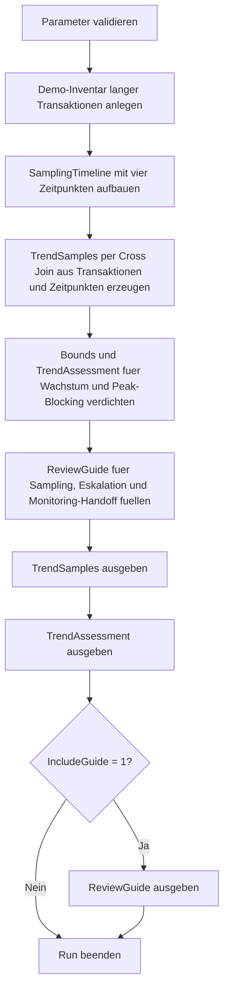

# LongRunningTranTrendSample.sql

Dieses Skript modelliert mehrere Stichproben langer Transaktionen ueber ein kleines Zeitfenster und zeigt, wie sich Dauer, Logvolumen und Blocking fuer eine spaetere Auswertung verdichten lassen. Im Kapitel `19_Transaktions` dient es als didaktische Vorlage fuer Trendbewertung, bevor ein echtes Polling ueber DMVs oder Monitoring-Systeme aufgebaut wird.

## Uebersicht

<!-- SQLDOC:SUMMARY_TABLE:BEGIN -->
| Feld | Wert |
|---|---|
| Script | [LongRunningTranTrendSample.sql](LongRunningTranTrendSample.sql) |
| Version | `1.0` |
| Typ | `didactic-lab` |
| Kapitel | `19_Transaktions` |
| Sicherheit | `read-only-tempdb` |
| Zweck | Modelliert Trend-Stichproben langer Transaktionen fuer spaetere Auswertung von Dauer, Logvolumen und Blocking. |
<!-- SQLDOC:SUMMARY_TABLE:END -->

## Einordnung

Produktive Trendanalysen verwenden meist wiederholte Abfragen auf DMVs, Extended Events oder ein externes Monitoring. Diese Erstversion bleibt bewusst bei modellierten Samples in `tempdb`, damit das Auswertungsmuster ohne Infrastrukturabhaengigkeit nachvollziehbar bleibt: Welche Transaktion wird laenger, wie stark waechst das angenommene Logvolumen, und steigt parallel der Blocking-Druck?

## Annahmen

- Es handelt sich um eine didaktische Erstversion mit modellierten Transaktionen und einem festen Vier-Punkte-Sampling.
- Das Skript verwendet keine produktiven DMVs und fuehrt kein echtes Polling ueber mehrere Runs aus.
- Logvolumen und Blocking-Anstieg sind bewusst einfache Demo-Kennzahlen fuer Trenddiskussionen.
- Fuer produktive Nutzung sollten spaeter echte Zeitreihen, Sampling-Jobs oder Monitoring-Datenquellen angebunden werden.

## Anwendungsfall

Das Skript eignet sich fuer Unterricht, Workshops und Reviews zu langen Transaktionen. Es zeigt, wie aus mehreren Stichproben pro Transaktion ein kompakter Trendbericht entsteht, der Eskalationspunkte, Baselines und Guardrails fuer die spaetere Automatisierung sichtbar macht.

## Parameter

<!-- SQLDOC:PARAMETERS_TABLE:BEGIN -->
| Parameter | SQL-Typ | Pflicht | Beschreibung |
|---|---|---|---|
| `@MinimumAgeMinutes` | `INT` | Nein | Filtert auf Demo-Transaktionen ab dieser Mindestdauer. |
| `@IncludeGuide` | `BIT` | Nein | Gibt bei `1` zusaetzlich einen kompakten Guide fuer Trendauswertung aus. |
<!-- SQLDOC:PARAMETERS_TABLE:END -->

## Abhaengigkeiten

<!-- SQLDOC:DEPENDENCIES_LIST:BEGIN -->
- `tempdb` fuer temporaere Tabellen
- `SYSUTCDATETIME`
- `DATEADD`
- `DATEDIFF`
- `CASE`
- `ROW_NUMBER`
- `ORDER BY`
<!-- SQLDOC:DEPENDENCIES_LIST:END -->

## Hinweise

- `TrendSamples` zeigt pro Transaktion mehrere modellierte Zeitpunkte mit Alter, angenommener Logmenge und Blocking-Anzahl.
- `TrendAssessment` verdichtet die Stichproben zu Wachstumsrichtung, Peak-Blocking und Review-Signal.
- Der Guide uebersetzt das Demo-Muster in Anforderungen fuer spaetere Polling-Jobs, Alerts und Incident-Reviews.

## Versionshistorie

<!-- SQLDOC:VERSION_HISTORY_TABLE:BEGIN -->
| Version | Datum | User | Beschreibung |
|---|---|---|---|
| `1.0` | `2026-04-19` | `ER` | Erstversion des didaktischen Labs fuer Trend-Stichproben langer Transaktionen |
<!-- SQLDOC:VERSION_HISTORY_TABLE:END -->

## Ablauf

<!-- SQLDOC:MERMAID:BEGIN -->

<!-- SQLDOC:MERMAID:END -->

## SQL-Code

<!-- SQLDOC:SQL_CODE:BEGIN -->
```sql
/*
BEGIN:SQL-HEADER v1
---
sql_header: v1
script_name: "LongRunningTranTrendSample.sql"
script_version: "1.0"
script_type: "didactic-lab"
chapter: "19_Transaktions"

purpose: >
  Modelliert mehrfache Stichproben langer Transaktionen ueber einen
  begrenzten Zeitraum, damit Dauerentwicklung, Blocking-Druck und
  veraenderte Lognutzung spaeter ausgewertet werden koennen.

parameters:
  - name: "@MinimumAgeMinutes"
    sql_type: "INT"
    direction: "IN"
    required: false
    description: "Filtert auf Demo-Transaktionen ab dieser Mindestdauer"
  - name: "@IncludeGuide"
    sql_type: "BIT"
    direction: "IN"
    required: false
    description: "1 = zusaetzlich einen kompakten Guide fuer Trendauswertung ausgeben"

result_sets:
  - name: "TrendSamples"
    description: "Zeigt mehrere modellierte Stichproben pro langer Transaktion mit Dauer, Blocking und Logvolumen"
  - name: "TrendAssessment"
    description: "Fasst Richtung, Beschleunigung und Review-Signal pro Transaktion zusammen"
  - name: "ReviewGuide"
    description: "Beschreibt Guardrails fuer spaetere Auswertung, Eskalation und Uebergabe an Monitoring"

dependencies:
  - "tempdb temporary tables"
  - "SYSUTCDATETIME"
  - "DATEADD"
  - "DATEDIFF"
  - "CASE"
  - "ROW_NUMBER"
  - "ORDER BY"

safety:
  level: "read-only-tempdb"
  writes_data: false

documentation:
  markdown_file: "T-SQL/19_Transaktions/SQLScripts/LongRunningTranTrendSample.md"
  sync_blocks:
    - "SUMMARY_TABLE"
    - "PARAMETERS_TABLE"
    - "DEPENDENCIES_LIST"
    - "VERSION_HISTORY_TABLE"
    - "SQL_CODE"
  mermaid:
    mode: "ai-agent-from-sql"
    source: "script-body"

main_responsible:
  name: "Erhard Rainer"
  initials: "ER"

version_history:
  - version: "1.0"
    date: "2026-04-19"
    user: "ER"
    description: "Erstversion des didaktischen Labs fuer Trend-Stichproben langer Transaktionen"

notes:
  - "Das Skript arbeitet mit modellierten Samples statt mit produktiven DMVs oder einem echten Polling-Job"
  - "Die Trendlogik zeigt Bewertungsmuster fuer spaetere Auswertung und ersetzt kein produktives Baselining"
---
END:SQL-HEADER v1
*/

SET NOCOUNT ON;

-- 1. Parameter vorbereiten
DECLARE @MinimumAgeMinutes INT = 20;
DECLARE @IncludeGuide BIT = 1;

IF @MinimumAgeMinutes < 0
BEGIN
    THROW 50000, '@MinimumAgeMinutes darf nicht negativ sein.', 1;
END;

IF @IncludeGuide NOT IN (0, 1)
BEGIN
    THROW 50001, '@IncludeGuide muss 0 oder 1 sein.', 1;
END;

DROP TABLE IF EXISTS #LongRunningTransactions;
DROP TABLE IF EXISTS #SamplingTimeline;
DROP TABLE IF EXISTS #TrendSamples;
DROP TABLE IF EXISTS #TrendAssessment;
DROP TABLE IF EXISTS #ReviewGuide;

-- 2. Demo-Inventar fuer lange Transaktionen aufbauen
CREATE TABLE #LongRunningTransactions
(
    TransactionID            INT             NOT NULL,
    DatabaseName             SYSNAME         NOT NULL,
    SessionID                SMALLINT        NOT NULL,
    TransactionName          VARCHAR(90)     NOT NULL,
    StartTimeUtc             DATETIME2(0)    NOT NULL,
    InitialLogMB             DECIMAL(18,2)   NOT NULL,
    LogGrowthMBPerSlice      DECIMAL(18,2)   NOT NULL,
    InitialBlockingCount     INT             NOT NULL,
    BlockingGrowthPerSlice   INT             NOT NULL,
    WhyRelevant              VARCHAR(220)    NOT NULL
);

INSERT INTO #LongRunningTransactions
(
    TransactionID,
    DatabaseName,
    SessionID,
    TransactionName,
    StartTimeUtc,
    InitialLogMB,
    LogGrowthMBPerSlice,
    InitialBlockingCount,
    BlockingGrowthPerSlice,
    WhyRelevant
)
VALUES
    (
        5101,
        'SalesLab',
        57,
        'Batch repricing',
        DATEADD(MINUTE, -46, SYSUTCDATETIME()),
        18.00,
        9.50,
        1,
        1,
        'Schreibintensive Batch-Transaktion mit wachsendem Blocking-Risiko ueber mehrere Stichproben.'
    ),
    (
        5102,
        'WarehouseLab',
        63,
        'Inventory sync',
        DATEADD(MINUTE, -29, SYSUTCDATETIME()),
        10.00,
        3.25,
        0,
        1,
        'Mittlere Import-Transaktion, bei der Verlauf und Eskalationspunkt beobachtet werden sollen.'
    ),
    (
        5103,
        'FinanceLab',
        74,
        'Ledger correction',
        DATEADD(MINUTE, -82, SYSUTCDATETIME()),
        34.00,
        12.00,
        2,
        2,
        'Langer Korrekturlauf mit deutlich steigender Last als Beispiel fuer spaetere Trendauswertung.'
    ),
    (
        5104,
        'SupportLab',
        91,
        'Snapshot export',
        DATEADD(MINUTE, -18, SYSUTCDATETIME()),
        6.00,
        1.50,
        0,
        0,
        'Kompakter Baseline-Fall mit ruhiger Entwicklung fuer den Vergleich.'
    );

-- 3. Stichprobenachsen vorbereiten
CREATE TABLE #SamplingTimeline
(
    SliceNo                  TINYINT         NOT NULL,
    SampleOffsetMinutes      INT             NOT NULL,
    SliceLabel               VARCHAR(20)     NOT NULL
);

INSERT INTO #SamplingTimeline
(
    SliceNo,
    SampleOffsetMinutes,
    SliceLabel
)
VALUES
    (1, -15, 'sample_t1'),
    (2, -10, 'sample_t2'),
    (3, -5,  'sample_t3'),
    (4,  0,  'sample_t4');

-- 4. Trend-Stichproben erzeugen
CREATE TABLE #TrendSamples
(
    TransactionID            INT             NOT NULL,
    DatabaseName             SYSNAME         NOT NULL,
    SessionID                SMALLINT        NOT NULL,
    TransactionName          VARCHAR(90)     NOT NULL,
    SliceNo                  TINYINT         NOT NULL,
    SliceLabel               VARCHAR(20)     NOT NULL,
    SampleTimeUtc            DATETIME2(0)    NOT NULL,
    AgeMinutes               INT             NOT NULL,
    ApproxLogMB              DECIMAL(18,2)   NOT NULL,
    BlockingCount            INT             NOT NULL,
    TrendComment             VARCHAR(220)    NOT NULL
);

INSERT INTO #TrendSamples
(
    TransactionID,
    DatabaseName,
    SessionID,
    TransactionName,
    SliceNo,
    SliceLabel,
    SampleTimeUtc,
    AgeMinutes,
    ApproxLogMB,
    BlockingCount,
    TrendComment
)
SELECT
    lrt.TransactionID,
    lrt.DatabaseName,
    lrt.SessionID,
    lrt.TransactionName,
    st.SliceNo,
    st.SliceLabel,
    DATEADD(MINUTE, st.SampleOffsetMinutes, SYSUTCDATETIME()) AS SampleTimeUtc,
    DATEDIFF(MINUTE, lrt.StartTimeUtc, DATEADD(MINUTE, st.SampleOffsetMinutes, SYSUTCDATETIME())) AS AgeMinutes,
    CAST(lrt.InitialLogMB + ((st.SliceNo - 1) * lrt.LogGrowthMBPerSlice) AS DECIMAL(18,2)) AS ApproxLogMB,
    lrt.InitialBlockingCount + ((st.SliceNo - 1) * lrt.BlockingGrowthPerSlice) AS BlockingCount,
    CASE
        WHEN lrt.BlockingGrowthPerSlice >= 2 THEN 'Blocking steigt pro Sample deutlich und sollte spaeter gegen Commit-Grenzen geprueft werden.'
        WHEN lrt.LogGrowthMBPerSlice >= 8 THEN 'Logvolumen waechst schnell; Sampling eignet sich fuer Trend- und Schwellenanalysen.'
        WHEN lrt.BlockingGrowthPerSlice = 0 THEN 'Ruhiger Vergleichsfall fuer Baseline und Grenzwert-Diskussion.'
        ELSE 'Moderater Verlauf fuer eine spaetere Review-Auswertung.'
    END AS TrendComment
FROM #LongRunningTransactions AS lrt
CROSS JOIN #SamplingTimeline AS st
WHERE DATEDIFF(MINUTE, lrt.StartTimeUtc, DATEADD(MINUTE, st.SampleOffsetMinutes, SYSUTCDATETIME())) >= @MinimumAgeMinutes;

-- 5. Verdichtete Trendbewertung ableiten
CREATE TABLE #TrendAssessment
(
    TransactionID            INT             NOT NULL,
    DatabaseName             SYSNAME         NOT NULL,
    SessionID                SMALLINT        NOT NULL,
    TransactionName          VARCHAR(90)     NOT NULL,
    FirstSampleAgeMinutes    INT             NOT NULL,
    LastSampleAgeMinutes     INT             NOT NULL,
    FirstSampleLogMB         DECIMAL(18,2)   NOT NULL,
    LastSampleLogMB          DECIMAL(18,2)   NOT NULL,
    PeakBlockingCount        INT             NOT NULL,
    LogGrowthMB              DECIMAL(18,2)   NOT NULL,
    GrowthDirection          VARCHAR(20)     NOT NULL,
    ReviewSignal             VARCHAR(220)    NOT NULL
);

WITH RankedSamples AS
(
    SELECT
        ts.TransactionID,
        ts.DatabaseName,
        ts.SessionID,
        ts.TransactionName,
        ts.SliceNo,
        ts.AgeMinutes,
        ts.ApproxLogMB,
        ts.BlockingCount,
        ROW_NUMBER() OVER (PARTITION BY ts.TransactionID ORDER BY ts.SliceNo ASC) AS RowAsc,
        ROW_NUMBER() OVER (PARTITION BY ts.TransactionID ORDER BY ts.SliceNo DESC) AS RowDesc
    FROM #TrendSamples AS ts
),
Bounds AS
(
    SELECT
        rs.TransactionID,
        MAX(CASE WHEN rs.RowAsc = 1 THEN rs.AgeMinutes END) AS FirstSampleAgeMinutes,
        MAX(CASE WHEN rs.RowDesc = 1 THEN rs.AgeMinutes END) AS LastSampleAgeMinutes,
        MAX(CASE WHEN rs.RowAsc = 1 THEN rs.ApproxLogMB END) AS FirstSampleLogMB,
        MAX(CASE WHEN rs.RowDesc = 1 THEN rs.ApproxLogMB END) AS LastSampleLogMB,
        MAX(rs.BlockingCount) AS PeakBlockingCount
    FROM RankedSamples AS rs
    GROUP BY
        rs.TransactionID
)
INSERT INTO #TrendAssessment
(
    TransactionID,
    DatabaseName,
    SessionID,
    TransactionName,
    FirstSampleAgeMinutes,
    LastSampleAgeMinutes,
    FirstSampleLogMB,
    LastSampleLogMB,
    PeakBlockingCount,
    LogGrowthMB,
    GrowthDirection,
    ReviewSignal
)
SELECT
    ts.TransactionID,
    MAX(ts.DatabaseName) AS DatabaseName,
    MAX(ts.SessionID) AS SessionID,
    MAX(ts.TransactionName) AS TransactionName,
    b.FirstSampleAgeMinutes,
    b.LastSampleAgeMinutes,
    b.FirstSampleLogMB,
    b.LastSampleLogMB,
    b.PeakBlockingCount,
    CAST(b.LastSampleLogMB - b.FirstSampleLogMB AS DECIMAL(18,2)) AS LogGrowthMB,
    CASE
        WHEN b.LastSampleLogMB - b.FirstSampleLogMB >= 24 THEN 'accelerating'
        WHEN b.LastSampleLogMB - b.FirstSampleLogMB >= 8 THEN 'rising'
        ELSE 'steady'
    END AS GrowthDirection,
    CASE
        WHEN b.PeakBlockingCount >= 6
         AND b.LastSampleLogMB - b.FirstSampleLogMB >= 24
            THEN 'Trend eskaliert: Logwachstum und Blocking steigen gemeinsam; Sampling sollte in echtes Monitoring ueberfuehrt werden.'
        WHEN b.PeakBlockingCount >= 3
            THEN 'Blocking nimmt zu: naechste Auswertung sollte Root-Blocker, Commit-Frequenz und betroffene Workloads einbeziehen.'
        WHEN b.LastSampleLogMB - b.FirstSampleLogMB >= 12
            THEN 'Logtrend ist sichtbar: geeignet fuer Schwellen, Dashboard-Prototypen und Kapazitaetsgespraeche.'
        ELSE 'Baseline-Fall: Verlauf bleibt ruhig und dient als Vergleich fuer spaetere Auswertungen.'
    END AS ReviewSignal
FROM #TrendSamples AS ts
INNER JOIN Bounds AS b
    ON b.TransactionID = ts.TransactionID
GROUP BY
    ts.TransactionID,
    b.FirstSampleAgeMinutes,
    b.LastSampleAgeMinutes,
    b.FirstSampleLogMB,
    b.LastSampleLogMB,
    b.PeakBlockingCount;

-- 6. Guide fuer spaetere Auswertung bereitstellen
CREATE TABLE #ReviewGuide
(
    GuideStep                TINYINT         NOT NULL,
    FocusArea                VARCHAR(80)     NOT NULL,
    Recommendation           VARCHAR(220)    NOT NULL,
    WhyItHelps               VARCHAR(220)    NOT NULL
);

INSERT INTO #ReviewGuide
(
    GuideStep,
    FocusArea,
    Recommendation,
    WhyItHelps
)
VALUES
    (
        1,
        'Sampling cadence',
        'Trend-Samples immer mit konsistentem Zeitraster aufnehmen und die Dauer seit Start mitprotokollieren.',
        'Nur so bleiben spaetere Vergleiche zwischen ruhigen und kritischen Runs belastbar.'
    ),
    (
        2,
        'Escalation signal',
        'Steigendes Logvolumen und zunehmendes Blocking gemeinsam bewerten statt isolierte Einzelwerte zu alarmieren.',
        'Die Kombination zeigt besser, wann eine lange Transaktion wirklich operativ problematisch wird.'
    ),
    (
        3,
        'Operational handoff',
        'Didaktische Samples spaeter auf DMVs, Extended Events oder Monitoring-Datenquellen mappen.',
        'Das Labor erklaert das Muster, waehrend produktive Systeme echte Zeitreihen und Benachrichtigungen benoetigen.'
    ),
    (
        4,
        'Review depth',
        'Fuer auffaellige Trends immer Commit-Grenzen, Batch-Groesse und betroffene Opferketten dokumentieren.',
        'So wird aus einer reinen Beobachtung eine konkrete Massnahmenliste fuer Troubleshooting und Nacharbeit.'
    );

-- 7. Resultsets ausgeben
SELECT
    ts.TransactionID,
    ts.DatabaseName,
    ts.SessionID,
    ts.TransactionName,
    ts.SliceLabel,
    ts.SampleTimeUtc,
    ts.AgeMinutes,
    ts.ApproxLogMB,
    ts.BlockingCount,
    ts.TrendComment
FROM #TrendSamples AS ts
ORDER BY
    ts.TransactionID,
    ts.SliceNo;

SELECT
    ta.TransactionID,
    ta.DatabaseName,
    ta.SessionID,
    ta.TransactionName,
    ta.FirstSampleAgeMinutes,
    ta.LastSampleAgeMinutes,
    ta.FirstSampleLogMB,
    ta.LastSampleLogMB,
    ta.PeakBlockingCount,
    ta.LogGrowthMB,
    ta.GrowthDirection,
    ta.ReviewSignal
FROM #TrendAssessment AS ta
ORDER BY
    ta.PeakBlockingCount DESC,
    ta.LogGrowthMB DESC,
    ta.TransactionID;

IF @IncludeGuide = 1
BEGIN
    SELECT
        rg.GuideStep,
        rg.FocusArea,
        rg.Recommendation,
        rg.WhyItHelps
    FROM #ReviewGuide AS rg
    ORDER BY
        rg.GuideStep;
END;
```
<!-- SQLDOC:SQL_CODE:END -->
