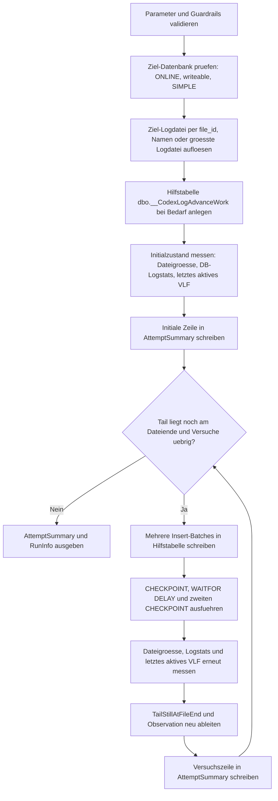

# MoveLastActiveVlfOffFileEnd.sql

Dieses Skript erzeugt gezielt weitere Schreibvorgaenge in einer SIMPLE-Datenbank, misst nach jedem Schreibzyklus die Ziel-Logdatei und prueft, ob das letzte aktive VLF noch am Dateiende liegt. Damit ist es als vorbereitender Helfer gedacht, wenn ein Shrink wegen eines aktiven Tail-VLF technisch noch nicht greifen kann.

## Uebersicht

<!-- SQLDOC:SUMMARY_TABLE:BEGIN -->
| Feld | Wert |
|---|---|
| Script | [MoveLastActiveVlfOffFileEnd.sql](MoveLastActiveVlfOffFileEnd.sql) |
| Version | `1.0` |
| Typ | `admin-change` |
| Kapitel | `19_Transaktions` |
| Sicherheit | `admin-change` |
| Zweck | Erzeugt kontrollierte Schreiblast, misst die Ziel-Logdatei erneut und wiederholt den Zyklus, bis das letzte aktive VLF nicht mehr am Dateiende liegt oder die maximale Versuchszahl erreicht ist. |
<!-- SQLDOC:SUMMARY_TABLE:END -->

## Einordnung

Dieses Hilfsskript ist keine allgemeine Wartungsroutine, sondern eine bewusst eingesetzte Admin-Massnahme fuer den Sonderfall "Logdatei ist fast leer, aber das letzte aktive VLF sitzt noch am Dateiende". Es erzeugt absichtlich echte Log-Schreibvorgaenge in der Zieldatenbank, fuehrt danach `CHECKPOINT` aus und misst erneut. Wenn der Tail-Bereich nicht mehr am Dateiende liegt, kann anschliessend `ShrinkSimple_multiple_Files.sql` oder ein gezielter `DBCC SHRINKFILE` sinnvoll erneut versucht werden.

## Annahmen

- Die Zieldatenbank ist `ONLINE`, nicht `READ_ONLY` und verwendet das Recovery-Modell `SIMPLE`.
- Echte Schreibvorgaenge in die Hilfstabelle `dbo.__CodexLogAdvanceWork` sind fuer das Wartungsfenster akzeptabel.
- Das erzeugte Hilfsvolumen darf bis zur spaeteren Bereinigung persistent in der Datenbank liegen.
- `sys.dm_db_log_stats` und `sys.dm_db_log_info` muessen verfuegbar sein, damit Tail-Lage und Holdup-Reason gemessen werden koennen.

## Anwendungsfall

Das Skript passt zu dem Status `Uebersprungen: letztes aktives VLF liegt am Dateiende; Datei derzeit nicht shrinkbar`. Statt blind weitere `CHECKPOINT`s zu setzen, wird kontrollierte Log-Aktivitaet erzeugt, danach erneut gemessen und dieser Zyklus wiederholt. So laesst sich beurteilen, ob das aktive Tail-VLF durch weitere Schreiblast vom Dateiende wegwandert oder ob groessere Batches notwendig sind.

## Parameter

<!-- SQLDOC:PARAMETERS_TABLE:BEGIN -->
| Parameter | SQL-Typ | Pflicht | Beschreibung |
|---|---|---|---|
| `@DatabaseName` | `SYSNAME` | Ja | Name der Ziel-Datenbank, in deren Log echte Schreibvorgaenge erzeugt werden. |
| `@TargetLogFileId` | `INT` | Nein | Optionale Ziel-Logdatei per `file_id`; `NULL` verwendet standardmaessig die groesste Logdatei der Datenbank. |
| `@TargetLogLogicalName` | `SYSNAME` | Nein | Optionale Ziel-Logdatei per logischem Dateinamen; darf nicht zusammen mit `@TargetLogFileId` gesetzt sein. |
| `@RowsPerBatch` | `INT` | Nein | Anzahl Hilfszeilen pro Insert-Batch in `dbo.__CodexLogAdvanceWork`. |
| `@BatchesPerAttempt` | `INT` | Nein | Anzahl Insert-Batches je Versuch. |
| `@PayloadBytes` | `INT` | Nein | Groesse des Payloads je Zeile in Bytes; zulaessig sind `100` bis `8000`. |
| `@MaxAttempts` | `INT` | Nein | Maximale Anzahl Versuche aus Schreiblast, Checkpoint und Messung. |
| `@DelayAfterCheckpointSeconds` | `INT` | Nein | Pause in Sekunden zwischen zwei `CHECKPOINT`s je Versuch. |
| `@TailAtEndToleranceMB` | `DECIMAL(18,2)` | Nein | Toleranz fuer den Vergleich zwischen Dateigroesse und Ende des letzten aktiven VLF. |
<!-- SQLDOC:PARAMETERS_TABLE:END -->

## Abhaengigkeiten

<!-- SQLDOC:DEPENDENCIES_LIST:BEGIN -->
- `CHECKPOINT`
- `WAITFOR DELAY`
- `sys.databases`
- `sys.master_files`
- `sys.dm_db_log_stats`
- `sys.dm_db_log_info`
- `sys.sp_executesql`
- `sys.all_objects`
<!-- SQLDOC:DEPENDENCIES_LIST:END -->

## Hinweise

- Wird weder `@TargetLogFileId` noch `@TargetLogLogicalName` gesetzt, arbeitet das Skript automatisch mit der groessten Logdatei der Zieldatenbank.
- Die Hilfstabelle `dbo.__CodexLogAdvanceWork` wird nur angelegt, wenn sie noch nicht existiert, und die erzeugten Daten bleiben bewusst erhalten, damit echte Log-Aktivitaet entsteht.
- Das grobe Schreibvolumen pro Versuch ist `@RowsPerBatch * @BatchesPerAttempt * @PayloadBytes`; im Resultset wird dazu `ApproxWriteMB` ausgewiesen.
- `AttemptSummary` zeigt Initialzustand und jeden Wiederholungszyklus mit `LogReuseWaitDesc`, `LogTruncationHoldupReason`, Tail-Endpunkt und Beobachtungstext.
- `RunInfo` liefert eine `SuggestedCleanupCommand`, mit der die fuer diesen Lauf erzeugten Hilfszeilen spaeter wieder geloescht werden koennen.
- Wenn das letzte aktive VLF trotz mehrerer Versuche am Dateiende bleibt, ist das Schreibvolumen pro Versuch meist zu klein oder die Zieldatei waechst parallel weiter.

## Versionshistorie

<!-- SQLDOC:VERSION_HISTORY_TABLE:BEGIN -->
| Version | Datum | User | Beschreibung |
|---|---|---|---|
| `1.0` | `2026-04-21` | `ER` | Erstversion fuer kontrollierte Schreiblast und VLF-Endpruefung vor erneutem Shrink-Versuch |
<!-- SQLDOC:VERSION_HISTORY_TABLE:END -->

## Ablauf

<!-- SQLDOC:MERMAID:BEGIN -->

<!-- SQLDOC:MERMAID:END -->

## SQL-Code

<!-- SQLDOC:SQL_CODE:BEGIN -->
```sql
/*
BEGIN:SQL-HEADER v1
---
sql_header: v1
script_name: "MoveLastActiveVlfOffFileEnd.sql"
script_version: "1.0"
script_type: "admin-change"
chapter: "19_Transaktions"

purpose: >
  Erzeugt kontrollierte Schreibvorgaenge in einer SIMPLE-Datenbank, misst nach
  jedem Schreibzyklus die Ziel-Logdatei und prueft, ob das letzte aktive VLF
  noch am Dateiende liegt. Das Skript wiederholt Schreiblast, CHECKPOINT und
  Messung bis das Logende nicht mehr gepinnt wirkt oder die maximale Zahl der
  Versuche erreicht ist.

parameters:
  - name: "@DatabaseName"
    sql_type: "SYSNAME"
    direction: "IN"
    required: true
    description: "Name der Ziel-Datenbank, in deren Log echte Schreibvorgaenge erzeugt werden"
  - name: "@TargetLogFileId"
    sql_type: "INT"
    direction: "IN"
    required: false
    description: "Optionale Ziel-Logdatei per file_id; NULL = groesste Logdatei der DB verwenden"
  - name: "@TargetLogLogicalName"
    sql_type: "SYSNAME"
    direction: "IN"
    required: false
    description: "Optionale Ziel-Logdatei per logischem Dateinamen; darf nicht zusammen mit @TargetLogFileId gesetzt sein"
  - name: "@RowsPerBatch"
    sql_type: "INT"
    direction: "IN"
    required: false
    description: "Anzahl Hilfszeilen pro Insert-Batch in dbo.__CodexLogAdvanceWork"
  - name: "@BatchesPerAttempt"
    sql_type: "INT"
    direction: "IN"
    required: false
    description: "Anzahl Insert-Batches je Versuch"
  - name: "@PayloadBytes"
    sql_type: "INT"
    direction: "IN"
    required: false
    description: "Groesse des Payloads je Zeile in Bytes; zulaessig sind 100 bis 8000"
  - name: "@MaxAttempts"
    sql_type: "INT"
    direction: "IN"
    required: false
    description: "Maximale Anzahl Versuche aus Schreiblast, Checkpoint und Messung"
  - name: "@DelayAfterCheckpointSeconds"
    sql_type: "INT"
    direction: "IN"
    required: false
    description: "Pause in Sekunden zwischen zwei CHECKPOINTs je Versuch"
  - name: "@TailAtEndToleranceMB"
    sql_type: "DECIMAL(18,2)"
    direction: "IN"
    required: false
    description: "Toleranz fuer den Vergleich zwischen Dateigroesse und Ende des letzten aktiven VLF"

result_sets:
  - name: "AttemptSummary"
    description: "Zeigt Initialzustand und alle Versuche mit Schreibvolumen, Holdup-Reason und VLF-Endpunkt"
  - name: "RunInfo"
    description: "Fasst RunId, Hilfstabelle und moegliche Folgeaktionen fuer Shrink oder spaetere Bereinigung zusammen"

dependencies:
  - "CHECKPOINT"
  - "WAITFOR DELAY"
  - "sys.databases"
  - "sys.master_files"
  - "sys.dm_db_log_stats"
  - "sys.dm_db_log_info"
  - "sys.sp_executesql"
  - "sys.all_objects"

safety:
  level: "admin-change"
  writes_data: true

documentation:
  markdown_file: "T-SQL/19_Transaktions/SQLScripts/MoveLastActiveVlfOffFileEnd.md"
  sync_blocks:
    - "SUMMARY_TABLE"
    - "PARAMETERS_TABLE"
    - "DEPENDENCIES_LIST"
    - "VERSION_HISTORY_TABLE"
    - "SQL_CODE"
  mermaid:
    mode: "ai-agent-from-sql"
    source: "script-body"

main_responsible:
  name: "Erhard Rainer"
  initials: "ER"

version_history:
  - version: "1.0"
    date: "2026-04-21"
    user: "ER"
    description: "Erstversion fuer kontrollierte Schreiblast und VLF-Endpruefung vor erneutem Shrink-Versuch"

notes:
  - "Das Skript erzeugt echte Writes in der Ziel-Datenbank und ist deshalb nur fuer bewusst gewaehlte Wartungsfenster gedacht"
  - "Hilfsdaten werden in dbo.__CodexLogAdvanceWork persistiert, damit der Log der Ziel-Datenbank belastet wird"
  - "Die Datenbank muss SIMPLE sein; fuer FULL oder BULK_LOGGED waere zusaetzlich die Log-Backup-Kette zu beachten"
  - "Wenn das letzte aktive VLF trotz mehrerer Versuche am Dateiende bleibt, kann die Schreiblast je Versuch zu klein sein"
---
END:SQL-HEADER v1
*/

SET NOCOUNT ON;

-- 1. Parameter und Guardrails
DECLARE @DatabaseName SYSNAME = N'BI_DWH';
DECLARE @TargetLogFileId INT = NULL;
DECLARE @TargetLogLogicalName SYSNAME = NULL;
DECLARE @RowsPerBatch INT = 8192;
DECLARE @BatchesPerAttempt INT = 8;
DECLARE @PayloadBytes INT = 4000;
DECLARE @MaxAttempts INT = 6;
DECLARE @DelayAfterCheckpointSeconds INT = 5;
DECLARE @TailAtEndToleranceMB DECIMAL(18,2) = 1.00;

IF @DatabaseName IS NULL OR LTRIM(RTRIM(@DatabaseName)) = N''
BEGIN
    THROW 50000, '@DatabaseName ist erforderlich.', 1;
END;

IF DB_ID(@DatabaseName) IS NULL
BEGIN
    THROW 50001, '@DatabaseName wurde nicht gefunden.', 1;
END;

IF @TargetLogFileId IS NOT NULL AND @TargetLogLogicalName IS NOT NULL
BEGIN
    THROW 50002, '@TargetLogFileId und @TargetLogLogicalName duerfen nicht gleichzeitig gesetzt sein.', 1;
END;

IF @RowsPerBatch < 1 OR @BatchesPerAttempt < 1 OR @MaxAttempts < 1
BEGIN
    THROW 50003, '@RowsPerBatch, @BatchesPerAttempt und @MaxAttempts muessen mindestens 1 sein.', 1;
END;

IF @PayloadBytes < 100 OR @PayloadBytes > 8000
BEGIN
    THROW 50004, '@PayloadBytes muss zwischen 100 und 8000 liegen.', 1;
END;

IF @DelayAfterCheckpointSeconds < 0 OR @DelayAfterCheckpointSeconds > 59
BEGIN
    THROW 50005, '@DelayAfterCheckpointSeconds muss zwischen 0 und 59 liegen.', 1;
END;

IF @TailAtEndToleranceMB < 0 OR @TailAtEndToleranceMB > 32
BEGIN
    THROW 50006, '@TailAtEndToleranceMB muss zwischen 0 und 32 liegen.', 1;
END;

DECLARE @DatabaseId INT;
DECLARE @RecoveryModel NVARCHAR(60);
DECLARE @StateDesc NVARCHAR(60);
DECLARE @IsReadOnly BIT;

SELECT
    @DatabaseId = d.database_id,
    @RecoveryModel = d.recovery_model_desc,
    @StateDesc = d.state_desc,
    @IsReadOnly = d.is_read_only
FROM sys.databases AS d
WHERE d.name = @DatabaseName;

IF @StateDesc <> N'ONLINE'
BEGIN
    THROW 50007, '@DatabaseName ist nicht ONLINE.', 1;
END;

IF @IsReadOnly = 1
BEGIN
    THROW 50008, '@DatabaseName ist READ_ONLY.', 1;
END;

IF @RecoveryModel <> N'SIMPLE'
BEGIN
    THROW 50009, 'Das Skript erwartet eine SIMPLE-Datenbank, damit CHECKPOINT den Log-Space freigeben kann.', 1;
END;

DECLARE @ResolvedLogFileId INT;
DECLARE @ResolvedLogLogicalName SYSNAME;
DECLARE @ResolvedPhysicalName NVARCHAR(260);

IF @TargetLogFileId IS NOT NULL
BEGIN
    SELECT
        @ResolvedLogFileId = mf.file_id,
        @ResolvedLogLogicalName = mf.name,
        @ResolvedPhysicalName = mf.physical_name
    FROM sys.master_files AS mf
    WHERE mf.database_id = @DatabaseId
      AND mf.type = 1
      AND mf.file_id = @TargetLogFileId;

    IF @ResolvedLogFileId IS NULL
    BEGIN
        THROW 50010, '@TargetLogFileId wurde in der Ziel-Datenbank nicht gefunden.', 1;
    END;
END;
ELSE IF @TargetLogLogicalName IS NOT NULL
BEGIN
    SELECT
        @ResolvedLogFileId = mf.file_id,
        @ResolvedLogLogicalName = mf.name,
        @ResolvedPhysicalName = mf.physical_name
    FROM sys.master_files AS mf
    WHERE mf.database_id = @DatabaseId
      AND mf.type = 1
      AND mf.name = @TargetLogLogicalName;

    IF @ResolvedLogFileId IS NULL
    BEGIN
        THROW 50011, '@TargetLogLogicalName wurde in der Ziel-Datenbank nicht gefunden.', 1;
    END;
END;
ELSE
BEGIN
    SELECT TOP (1)
        @ResolvedLogFileId = mf.file_id,
        @ResolvedLogLogicalName = mf.name,
        @ResolvedPhysicalName = mf.physical_name
    FROM sys.master_files AS mf
    WHERE mf.database_id = @DatabaseId
      AND mf.type = 1
    ORDER BY
        mf.size DESC,
        mf.file_id;
END;

DECLARE @RunId UNIQUEIDENTIFIER = NEWID();
DECLARE @RowsInsertedPerAttempt INT = @RowsPerBatch * @BatchesPerAttempt;
DECLARE @ApproxWriteMBPerAttempt DECIMAL(18,2) =
    CAST((@RowsInsertedPerAttempt * CAST(@PayloadBytes AS DECIMAL(18,2))) / 1048576.0 AS DECIMAL(18,2));
DECLARE @DelayLiteral CHAR(8) =
    CONVERT(CHAR(8), DATEADD(SECOND, @DelayAfterCheckpointSeconds, CAST('00:00:00' AS TIME(0))), 108);

DECLARE @AttemptNo INT = 0;
DECLARE @BatchNo INT;
DECLARE @sql NVARCHAR(MAX);

DECLARE @CurrentFileSizeMB DECIMAL(18,2);
DECLARE @LastActiveVlfSequenceNumber BIGINT;
DECLARE @LastActiveVlfSizeMB DECIMAL(18,2);
DECLARE @LastActiveVlfEndMB DECIMAL(18,2);
DECLARE @TailStillAtFileEnd BIT;
DECLARE @LogReuseWaitDesc NVARCHAR(120);
DECLARE @LogTruncationHoldupReason NVARCHAR(120);
DECLARE @DatabaseActiveLogMB DECIMAL(18,2);
DECLARE @Observation NVARCHAR(400);

DECLARE @AttemptSummary TABLE
(
    AttemptNo                    INT,
    RunId                        UNIQUEIDENTIFIER,
    DatabaseName                 SYSNAME,
    TargetLogFileId              INT,
    TargetLogLogicalName         SYSNAME,
    PhysicalName                 NVARCHAR(260),
    RowsInserted                 INT,
    ApproxWriteMB                DECIMAL(18,2),
    CurrentFileSizeMB            DECIMAL(18,2),
    DatabaseActiveLogMB          DECIMAL(18,2),
    LogReuseWaitDesc             NVARCHAR(120),
    LogTruncationHoldupReason    NVARCHAR(120),
    LastActiveVlfSequenceNumber  BIGINT NULL,
    LastActiveVlfSizeMB          DECIMAL(18,2) NULL,
    LastActiveVlfEndMB           DECIMAL(18,2) NULL,
    TailStillAtFileEnd           BIT,
    Observation                  NVARCHAR(400)
);

-- 2. Hilfstabelle in der Ziel-Datenbank vorbereiten
SET @sql =
    N'USE ' + QUOTENAME(@DatabaseName) + N';
      IF OBJECT_ID(N''dbo.__CodexLogAdvanceWork'', N''U'') IS NULL
      BEGIN
          CREATE TABLE dbo.__CodexLogAdvanceWork
          (
              WorkID BIGINT IDENTITY(1,1) NOT NULL PRIMARY KEY,
              RunId UNIQUEIDENTIFIER NOT NULL,
              AttemptNo INT NOT NULL,
              BatchNo INT NOT NULL,
              CreatedAt DATETIME2(0) NOT NULL DEFAULT SYSUTCDATETIME(),
              Payload VARBINARY(8000) NOT NULL
          );
      END;';

EXEC sys.sp_executesql @sql;

-- 3. Initialzustand messen
SELECT
    @CurrentFileSizeMB = CAST(mf.size / 128.0 AS DECIMAL(18,2))
FROM sys.master_files AS mf
WHERE mf.database_id = @DatabaseId
  AND mf.file_id = @ResolvedLogFileId
  AND mf.type = 1;

SELECT
    @LogReuseWaitDesc = COALESCE(NULLIF(d.log_reuse_wait_desc, N''), N'UNKNOWN'),
    @LogTruncationHoldupReason = COALESCE(NULLIF(ls.log_truncation_holdup_reason, N''), N'UNKNOWN'),
    @DatabaseActiveLogMB = CAST(ls.active_log_size_mb AS DECIMAL(18,2))
FROM sys.databases AS d
CROSS APPLY sys.dm_db_log_stats(d.database_id) AS ls
WHERE d.database_id = @DatabaseId;

SELECT TOP (1)
    @LastActiveVlfSequenceNumber = li.vlf_sequence_number,
    @LastActiveVlfSizeMB = CAST(li.vlf_size_mb AS DECIMAL(18,2)),
    @LastActiveVlfEndMB =
        CAST((CAST(li.vlf_begin_offset AS DECIMAL(20,2)) / 1048576.0) + li.vlf_size_mb AS DECIMAL(18,2))
FROM sys.dm_db_log_info(@DatabaseId) AS li
WHERE li.file_id = @ResolvedLogFileId
  AND li.vlf_active = 1
ORDER BY
    li.vlf_begin_offset DESC;

SET @TailStillAtFileEnd =
    CASE
        WHEN @LastActiveVlfEndMB IS NULL THEN 0
        WHEN ABS(@CurrentFileSizeMB - @LastActiveVlfEndMB) <= @TailAtEndToleranceMB THEN 1
        ELSE 0
    END;

SET @Observation =
    CASE
        WHEN @TailStillAtFileEnd = 1 THEN N'Initialzustand: letztes aktives VLF liegt am Dateiende.'
        ELSE N'Initialzustand: letztes aktives VLF liegt bereits nicht mehr am Dateiende.'
    END;

INSERT INTO @AttemptSummary
(
    AttemptNo, RunId, DatabaseName, TargetLogFileId, TargetLogLogicalName, PhysicalName,
    RowsInserted, ApproxWriteMB, CurrentFileSizeMB, DatabaseActiveLogMB,
    LogReuseWaitDesc, LogTruncationHoldupReason,
    LastActiveVlfSequenceNumber, LastActiveVlfSizeMB, LastActiveVlfEndMB,
    TailStillAtFileEnd, Observation
)
VALUES
(
    0, @RunId, @DatabaseName, @ResolvedLogFileId, @ResolvedLogLogicalName, @ResolvedPhysicalName,
    0, 0.00, @CurrentFileSizeMB, @DatabaseActiveLogMB,
    @LogReuseWaitDesc, @LogTruncationHoldupReason,
    @LastActiveVlfSequenceNumber, @LastActiveVlfSizeMB, @LastActiveVlfEndMB,
    @TailStillAtFileEnd, @Observation
);

-- 4. Schreiblast, CHECKPOINT und Messung wiederholen
WHILE @AttemptNo < @MaxAttempts
  AND @TailStillAtFileEnd = 1
BEGIN
    SET @AttemptNo += 1;
    SET @BatchNo = 1;

    WHILE @BatchNo <= @BatchesPerAttempt
    BEGIN
        SET @sql =
            N'USE ' + QUOTENAME(@DatabaseName) + N';
              INSERT INTO dbo.__CodexLogAdvanceWork
              (
                  RunId,
                  AttemptNo,
                  BatchNo,
                  Payload
              )
              SELECT TOP (@RowsPerBatch)
                  @RunId,
                  @AttemptNo,
                  @BatchNo,
                  CONVERT(VARBINARY(8000), REPLICATE(CAST(''X'' AS VARCHAR(1)), @PayloadBytes))
              FROM sys.all_objects AS a
              CROSS JOIN sys.all_objects AS b;';

        EXEC sys.sp_executesql
            @sql,
            N'@RowsPerBatch INT, @RunId UNIQUEIDENTIFIER, @AttemptNo INT, @BatchNo INT, @PayloadBytes INT',
            @RowsPerBatch = @RowsPerBatch,
            @RunId = @RunId,
            @AttemptNo = @AttemptNo,
            @BatchNo = @BatchNo,
            @PayloadBytes = @PayloadBytes;

        SET @BatchNo += 1;
    END;

    SET @sql =
        N'USE ' + QUOTENAME(@DatabaseName) + N';
          CHECKPOINT;
          WAITFOR DELAY ''' + @DelayLiteral + N''';
          CHECKPOINT;';

    EXEC sys.sp_executesql @sql;

    SELECT
        @CurrentFileSizeMB = CAST(mf.size / 128.0 AS DECIMAL(18,2))
    FROM sys.master_files AS mf
    WHERE mf.database_id = @DatabaseId
      AND mf.file_id = @ResolvedLogFileId
      AND mf.type = 1;

    SELECT
        @LogReuseWaitDesc = COALESCE(NULLIF(d.log_reuse_wait_desc, N''), N'UNKNOWN'),
        @LogTruncationHoldupReason = COALESCE(NULLIF(ls.log_truncation_holdup_reason, N''), N'UNKNOWN'),
        @DatabaseActiveLogMB = CAST(ls.active_log_size_mb AS DECIMAL(18,2))
    FROM sys.databases AS d
    CROSS APPLY sys.dm_db_log_stats(d.database_id) AS ls
    WHERE d.database_id = @DatabaseId;

    SELECT TOP (1)
        @LastActiveVlfSequenceNumber = li.vlf_sequence_number,
        @LastActiveVlfSizeMB = CAST(li.vlf_size_mb AS DECIMAL(18,2)),
        @LastActiveVlfEndMB =
            CAST((CAST(li.vlf_begin_offset AS DECIMAL(20,2)) / 1048576.0) + li.vlf_size_mb AS DECIMAL(18,2))
    FROM sys.dm_db_log_info(@DatabaseId) AS li
    WHERE li.file_id = @ResolvedLogFileId
      AND li.vlf_active = 1
    ORDER BY
        li.vlf_begin_offset DESC;

    SET @TailStillAtFileEnd =
        CASE
            WHEN @LastActiveVlfEndMB IS NULL THEN 0
            WHEN ABS(@CurrentFileSizeMB - @LastActiveVlfEndMB) <= @TailAtEndToleranceMB THEN 1
            ELSE 0
        END;

    SET @Observation =
        CASE
            WHEN @TailStillAtFileEnd = 0
                THEN N'Letztes aktives VLF liegt nicht mehr am Dateiende; erneuter Shrink-Versuch ist jetzt sinnvoll.'
            WHEN @ApproxWriteMBPerAttempt < ISNULL(@LastActiveVlfSizeMB, 0)
                THEN N'Letztes aktives VLF liegt weiter am Dateiende; das Schreibvolumen je Versuch ist kleiner als die aktive Tail-VLF-Groesse.'
            ELSE N'Letztes aktives VLF liegt weiterhin am Dateiende; bei Bedarf groessere oder mehr Schreib-Batches versuchen.'
        END;

    INSERT INTO @AttemptSummary
    (
        AttemptNo, RunId, DatabaseName, TargetLogFileId, TargetLogLogicalName, PhysicalName,
        RowsInserted, ApproxWriteMB, CurrentFileSizeMB, DatabaseActiveLogMB,
        LogReuseWaitDesc, LogTruncationHoldupReason,
        LastActiveVlfSequenceNumber, LastActiveVlfSizeMB, LastActiveVlfEndMB,
        TailStillAtFileEnd, Observation
    )
    VALUES
    (
        @AttemptNo, @RunId, @DatabaseName, @ResolvedLogFileId, @ResolvedLogLogicalName, @ResolvedPhysicalName,
        @RowsInsertedPerAttempt, @ApproxWriteMBPerAttempt, @CurrentFileSizeMB, @DatabaseActiveLogMB,
        @LogReuseWaitDesc, @LogTruncationHoldupReason,
        @LastActiveVlfSequenceNumber, @LastActiveVlfSizeMB, @LastActiveVlfEndMB,
        @TailStillAtFileEnd, @Observation
    );
END;

-- 5. Ergebnisse ausgeben
SELECT
    AttemptNo,
    RunId,
    DatabaseName,
    TargetLogFileId,
    TargetLogLogicalName,
    PhysicalName,
    RowsInserted,
    ApproxWriteMB,
    CurrentFileSizeMB,
    DatabaseActiveLogMB,
    LogReuseWaitDesc,
    LogTruncationHoldupReason,
    LastActiveVlfSequenceNumber,
    LastActiveVlfSizeMB,
    LastActiveVlfEndMB,
    TailStillAtFileEnd,
    Observation
FROM @AttemptSummary
ORDER BY
    AttemptNo;

SELECT
    DatabaseName = @DatabaseName,
    RunId = @RunId,
    TargetLogFileId = @ResolvedLogFileId,
    TargetLogLogicalName = @ResolvedLogLogicalName,
    HelperTable = N'dbo.__CodexLogAdvanceWork',
    ApproxWriteMBPerAttempt = @ApproxWriteMBPerAttempt,
    FinalTailStillAtFileEnd = @TailStillAtFileEnd,
    SuggestedNextStep =
        CASE
            WHEN @TailStillAtFileEnd = 0
                THEN N'Jetzt Shrink erneut versuchen.'
            ELSE N'Batches vergroessern oder mehr Versuche planen und danach erneut messen.'
        END,
    SuggestedCleanupCommand =
        N'USE ' + QUOTENAME(@DatabaseName) + N'; DELETE FROM dbo.__CodexLogAdvanceWork WHERE RunId = ''' +
        CAST(@RunId AS NVARCHAR(36)) + N''';';

```
<!-- SQLDOC:SQL_CODE:END -->
