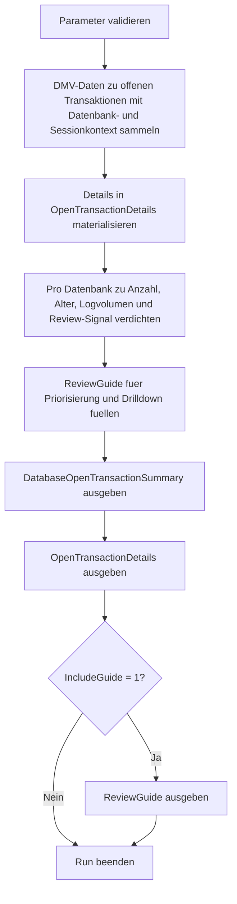

# OpenTransactionByDatabase.sql

Dieses Skript verdichtet offene Transaktionen zunaechst auf Datenbankebene und liefert danach das passende Detail-Resultset pro Transaktion. Im Kapitel `19_Transaktions` dient es als diagnostischer Einstieg, wenn zuerst sichtbar werden soll, welche Datenbank aktuell durch offene Transaktionen, Alter und Logverbrauch auffaellt.

## Uebersicht

<!-- SQLDOC:SUMMARY_TABLE:BEGIN -->
| Feld | Wert |
|---|---|
| Script | [OpenTransactionByDatabase.sql](OpenTransactionByDatabase.sql) |
| Version | `1.0` |
| Typ | `diagnostic-query` |
| Kapitel | `19_Transaktions` |
| Sicherheit | `read-only` |
| Zweck | Zeigt offene Transaktionen pro Datenbank mit Alter, Logverbrauch und erstem Review-Signal. |
<!-- SQLDOC:SUMMARY_TABLE:END -->

## Einordnung

Viele DMV-Abfragen springen direkt auf Session- oder Request-Ebene. Diese Erstversion geht absichtlich einen Schritt frueher: Zuerst wird pro Datenbank verdichtet, wie viele offene Transaktionen sichtbar sind, wie alt die aelteste davon ist und wie viel Logvolumen daran haengt. Erst danach folgt das Drilldown-Resultset fuer Sessions, Hosts und Programme.

## Annahmen

- Das Skript ist als read-only Diagnose fuer SQL Server DMVs ausgelegt und fuehrt keine Eingriffe gegen laufende Transaktionen aus.
- Die Zuordnung zwischen Transaktion und Session kann bei Hintergrundarbeit oder bereits beendeten Sessions unvollstaendig sein; solche Faelle bleiben im Detailresultset sichtbar.
- Die Log-Kennzahlen stammen aus `sys.dm_tran_database_transactions` und sind als operativer Schnellblick gedacht, nicht als exakte Kapazitaetsplanung.
- Standardmaessig werden Systemdatenbanken ausgeblendet, um den Fokus auf typische User-Datenbanken zu legen.

## Anwendungsfall

Das Skript eignet sich fuer Review, Unterricht und erste Incident-Einordnung rund um lange oder blockierende Transaktionen. Es beantwortet drei Fragen in einer Reihenfolge, die im Betrieb haeufig hilfreich ist: Welche Datenbank ist betroffen? Welche Transaktionen treiben Alter und Logverbrauch? Welche Sessions oder Hintergrundarbeiten sollten als Naechstes untersucht werden?

## Parameter

<!-- SQLDOC:PARAMETERS_TABLE:BEGIN -->
| Parameter | SQL-Typ | Pflicht | Beschreibung |
|---|---|---|---|
| `@MinimumAgeMinutes` | `INT` | Nein | Filtert auf Transaktionen ab dieser Mindestdauer in Minuten. |
| `@IncludeSystemDatabases` | `BIT` | Nein | Bezieht bei `1` auch `master`, `model`, `msdb` und `tempdb` ein. |
| `@IncludeGuide` | `BIT` | Nein | Gibt bei `1` zusaetzlich einen kompakten Leitfaden fuer die Einordnung aus. |
<!-- SQLDOC:PARAMETERS_TABLE:END -->

## Abhaengigkeiten

<!-- SQLDOC:DEPENDENCIES_LIST:BEGIN -->
- `sys.dm_tran_database_transactions`
- `sys.dm_tran_active_transactions`
- `sys.dm_tran_session_transactions`
- `sys.dm_exec_sessions`
- `sys.databases`
- `SYSUTCDATETIME`
- `DATEDIFF`
- `CASE`
- `SUM`
- `MAX`
- `COUNT`
- `ORDER BY`
<!-- SQLDOC:DEPENDENCIES_LIST:END -->

## Hinweise

- `DatabaseOpenTransactionSummary` priorisiert Datenbanken nach Review-Signal, Alter und Logverbrauch.
- `OpenTransactionDetails` zeigt dieselben Befunde als Drilldown mit Session-, Host- und Programmkontakt.
- Der Guide uebersetzt die Kennzahlen in naechste Schritte fuer Locking-, Backup- und DMV-Reviews.

## Versionshistorie

<!-- SQLDOC:VERSION_HISTORY_TABLE:BEGIN -->
| Version | Datum | User | Beschreibung |
|---|---|---|---|
| `1.0` | `2026-04-22` | `ER` | Erstversion des Diagnose-Skripts fuer offene Transaktionen pro Datenbank |
<!-- SQLDOC:VERSION_HISTORY_TABLE:END -->

## Ablauf

<!-- SQLDOC:MERMAID:BEGIN -->

<!-- SQLDOC:MERMAID:END -->

## SQL-Code

<!-- SQLDOC:SQL_CODE:BEGIN -->
```sql
/*
BEGIN:SQL-HEADER v1
---
sql_header: v1
script_name: "OpenTransactionByDatabase.sql"
script_version: "1.0"
script_type: "diagnostic-query"
chapter: "19_Transaktions"

purpose: >
  Zeigt offene Transaktionen pro Datenbank mit kompakten Basiskennzahlen
  zu Alter, betroffenen Sessions, Logverbrauch und einem ersten
  Review-Signal fuer das Troubleshooting.

parameters:
  - name: "@MinimumAgeMinutes"
    sql_type: "INT"
    direction: "IN"
    required: false
    description: "Filtert auf Transaktionen ab dieser Mindestdauer in Minuten"
  - name: "@IncludeSystemDatabases"
    sql_type: "BIT"
    direction: "IN"
    required: false
    description: "1 = auch master, model, msdb und tempdb einbeziehen"
  - name: "@IncludeGuide"
    sql_type: "BIT"
    direction: "IN"
    required: false
    description: "1 = zusaetzlich einen kompakten Leitfaden fuer die Einordnung ausgeben"

result_sets:
  - name: "DatabaseOpenTransactionSummary"
    description: "Verdichtet offene Transaktionen pro Datenbank zu Anzahl, Alter, Logvolumen und Review-Signal"
  - name: "OpenTransactionDetails"
    description: "Zeigt die einzelnen offenen Transaktionen mit Session-, Host- und Logkontext"
  - name: "ReviewGuide"
    description: "Ordnet auffaellige Kennzahlen typischen naechsten Schritten zu"

dependencies:
  - "sys.dm_tran_database_transactions"
  - "sys.dm_tran_active_transactions"
  - "sys.dm_tran_session_transactions"
  - "sys.dm_exec_sessions"
  - "sys.databases"
  - "SYSUTCDATETIME"
  - "DATEDIFF"
  - "CASE"
  - "SUM"
  - "MAX"
  - "COUNT"
  - "ORDER BY"

safety:
  level: "read-only"
  writes_data: false

documentation:
  markdown_file: "T-SQL/19_Transaktions/SQLScripts/OpenTransactionByDatabase.md"
  sync_blocks:
    - "SUMMARY_TABLE"
    - "PARAMETERS_TABLE"
    - "DEPENDENCIES_LIST"
    - "VERSION_HISTORY_TABLE"
    - "SQL_CODE"
  mermaid:
    mode: "ai-agent-from-sql"
    source: "script-body"

main_responsible:
  name: "Erhard Rainer"
  initials: "ER"

version_history:
  - version: "1.0"
    date: "2026-04-22"
    user: "ER"
    description: "Erstversion des Diagnose-Skripts fuer offene Transaktionen pro Datenbank"

notes:
  - "Das Skript liest nur DMVs und Katalogsichten; es fuehrt keine KILL-, COMMIT- oder Recovery-Aktionen aus."
  - "Mehrere Sessions koennen dieselbe Transaktion referenzieren; die Verdichtung pro Datenbank dient als Review-Einstieg."
---
END:SQL-HEADER v1
*/

SET NOCOUNT ON;

-- 1. Parameter vorbereiten
DECLARE @MinimumAgeMinutes INT = 0;
DECLARE @IncludeSystemDatabases BIT = 0;
DECLARE @IncludeGuide BIT = 1;

IF @MinimumAgeMinutes < 0
BEGIN
    THROW 50000, '@MinimumAgeMinutes darf nicht negativ sein.', 1;
END;

IF @IncludeSystemDatabases NOT IN (0, 1)
BEGIN
    THROW 50001, '@IncludeSystemDatabases muss 0 oder 1 sein.', 1;
END;

IF @IncludeGuide NOT IN (0, 1)
BEGIN
    THROW 50002, '@IncludeGuide muss 0 oder 1 sein.', 1;
END;

DROP TABLE IF EXISTS #OpenTransactionDetails;
DROP TABLE IF EXISTS #DatabaseOpenTransactionSummary;
DROP TABLE IF EXISTS #ReviewGuide;

-- 2. Offene Transaktionen mit Datenbank- und Sessionkontext sammeln
CREATE TABLE #OpenTransactionDetails
(
    DatabaseName                 SYSNAME         NOT NULL,
    DatabaseId                   INT             NOT NULL,
    TransactionId                BIGINT          NOT NULL,
    TransactionName              NVARCHAR(64)    NULL,
    TransactionType              NVARCHAR(40)    NOT NULL,
    TransactionState             NVARCHAR(60)    NOT NULL,
    TransactionBeginTimeUtc      DATETIME2(0)    NOT NULL,
    AgeMinutes                   INT             NOT NULL,
    DatabaseTransactionState     INT             NULL,
    DatabaseLogBytesUsed         BIGINT          NULL,
    DatabaseLogBytesReserved     BIGINT          NULL,
    SessionId                    SMALLINT        NULL,
    LoginName                    NVARCHAR(128)   NULL,
    HostName                     NVARCHAR(128)   NULL,
    ProgramName                  NVARCHAR(128)   NULL,
    IsUserProcess                BIT             NULL,
    TransactionRole              NVARCHAR(30)    NULL,
    ReviewSignal                 VARCHAR(20)     NOT NULL,
    ReviewHint                   VARCHAR(220)    NOT NULL
);

INSERT INTO #OpenTransactionDetails
(
    DatabaseName,
    DatabaseId,
    TransactionId,
    TransactionName,
    TransactionType,
    TransactionState,
    TransactionBeginTimeUtc,
    AgeMinutes,
    DatabaseTransactionState,
    DatabaseLogBytesUsed,
    DatabaseLogBytesReserved,
    SessionId,
    LoginName,
    HostName,
    ProgramName,
    IsUserProcess,
    TransactionRole,
    ReviewSignal,
    ReviewHint
)
SELECT
    d.name AS DatabaseName,
    d.database_id AS DatabaseId,
    dt.database_transaction_id AS TransactionId,
    at.name AS TransactionName,
    CASE at.transaction_type
        WHEN 1 THEN 'read/write'
        WHEN 2 THEN 'read-only'
        WHEN 3 THEN 'system'
        WHEN 4 THEN 'distributed'
        ELSE CONCAT('other(', at.transaction_type, ')')
    END AS TransactionType,
    CASE at.transaction_state
        WHEN 0 THEN 'not initialized'
        WHEN 1 THEN 'not yet started'
        WHEN 2 THEN 'active'
        WHEN 3 THEN 'ended read-only'
        WHEN 4 THEN 'commit initiated'
        WHEN 5 THEN 'prepared'
        WHEN 6 THEN 'committed'
        WHEN 7 THEN 'rolling back'
        WHEN 8 THEN 'rolled back'
        ELSE CONCAT('state(', at.transaction_state, ')')
    END AS TransactionState,
    CAST(at.transaction_begin_time AS DATETIME2(0)) AS TransactionBeginTimeUtc,
    DATEDIFF(MINUTE, at.transaction_begin_time, SYSUTCDATETIME()) AS AgeMinutes,
    dt.database_transaction_state,
    dt.database_transaction_log_bytes_used,
    dt.database_transaction_log_bytes_reserved,
    st.session_id AS SessionId,
    es.login_name,
    es.host_name,
    es.program_name,
    es.is_user_process,
    CASE
        WHEN st.is_enlisted = 1 THEN 'enlisted'
        WHEN st.is_bound = 1 THEN 'bound'
        WHEN st.session_id IS NULL THEN 'background-or-orphan'
        ELSE 'session-owned'
    END AS TransactionRole,
    CASE
        WHEN DATEDIFF(MINUTE, at.transaction_begin_time, SYSUTCDATETIME()) >= 60 THEN 'high'
        WHEN COALESCE(dt.database_transaction_log_bytes_used, 0) >= 268435456 THEN 'high'
        WHEN DATEDIFF(MINUTE, at.transaction_begin_time, SYSUTCDATETIME()) >= 15 THEN 'medium'
        ELSE 'observe'
    END AS ReviewSignal,
    CASE
        WHEN DATEDIFF(MINUTE, at.transaction_begin_time, SYSUTCDATETIME()) >= 60
            THEN 'Transaktion laeuft bereits lange; Commit-Grenzen, Sperren und Rollback-Folgen zuerst pruefen.'
        WHEN COALESCE(dt.database_transaction_log_bytes_used, 0) >= 268435456
            THEN 'Das reservierte oder genutzte Logvolumen ist auffaellig; Logreuse, Backup-Kette und Batch-Groesse einordnen.'
        WHEN st.session_id IS NULL
            THEN 'Keine direkte Session-Zuordnung sichtbar; Hintergrundarbeit oder bereits beendete Session mitdenken.'
        ELSE 'Kompakter Einstiegsbefund fuer Session-, Host- und Datenbankreview.'
    END AS ReviewHint
FROM sys.dm_tran_database_transactions AS dt
INNER JOIN sys.dm_tran_active_transactions AS at
    ON at.transaction_id = dt.transaction_id
INNER JOIN sys.databases AS d
    ON d.database_id = dt.database_id
LEFT JOIN sys.dm_tran_session_transactions AS st
    ON st.transaction_id = dt.transaction_id
LEFT JOIN sys.dm_exec_sessions AS es
    ON es.session_id = st.session_id
WHERE at.transaction_state NOT IN (3, 6, 8)
  AND DATEDIFF(MINUTE, at.transaction_begin_time, SYSUTCDATETIME()) >= @MinimumAgeMinutes
  AND (@IncludeSystemDatabases = 1 OR d.database_id > 4);

-- 3. Verdichtung pro Datenbank aufbauen
CREATE TABLE #DatabaseOpenTransactionSummary
(
    DatabaseName                 SYSNAME         NOT NULL,
    OpenTransactionCount         INT             NOT NULL,
    UserSessionCount             INT             NOT NULL,
    OldestTransactionBeginUtc    DATETIME2(0)    NOT NULL,
    MaxAgeMinutes                INT             NOT NULL,
    TotalLogUsedMB               DECIMAL(18,2)   NOT NULL,
    TotalLogReservedMB           DECIMAL(18,2)   NOT NULL,
    HighestReviewSignal          VARCHAR(20)     NOT NULL,
    ReviewHint                   VARCHAR(220)    NOT NULL
);

INSERT INTO #DatabaseOpenTransactionSummary
(
    DatabaseName,
    OpenTransactionCount,
    UserSessionCount,
    OldestTransactionBeginUtc,
    MaxAgeMinutes,
    TotalLogUsedMB,
    TotalLogReservedMB,
    HighestReviewSignal,
    ReviewHint
)
SELECT
    otd.DatabaseName,
    COUNT(DISTINCT otd.TransactionId) AS OpenTransactionCount,
    COUNT(DISTINCT CASE WHEN otd.IsUserProcess = 1 THEN otd.SessionId END) AS UserSessionCount,
    MIN(otd.TransactionBeginTimeUtc) AS OldestTransactionBeginUtc,
    MAX(otd.AgeMinutes) AS MaxAgeMinutes,
    CAST(SUM(COALESCE(otd.DatabaseLogBytesUsed, 0)) / 1048576.0 AS DECIMAL(18,2)) AS TotalLogUsedMB,
    CAST(SUM(COALESCE(otd.DatabaseLogBytesReserved, 0)) / 1048576.0 AS DECIMAL(18,2)) AS TotalLogReservedMB,
    CASE
        WHEN MAX(CASE otd.ReviewSignal WHEN 'high' THEN 3 WHEN 'medium' THEN 2 ELSE 1 END) >= 3 THEN 'high'
        WHEN MAX(CASE otd.ReviewSignal WHEN 'high' THEN 3 WHEN 'medium' THEN 2 ELSE 1 END) >= 2 THEN 'medium'
        ELSE 'observe'
    END AS HighestReviewSignal,
    CASE
        WHEN MAX(otd.AgeMinutes) >= 60 AND SUM(COALESCE(otd.DatabaseLogBytesUsed, 0)) >= 268435456
            THEN 'Alte offene Transaktionen und deutliches Logvolumen treffen zusammen; Datenbank priorisiert reviewen.'
        WHEN MAX(otd.AgeMinutes) >= 60
            THEN 'Mindestens eine offene Transaktion ist alt; Session-Kontext und Commit-Verhalten zuerst pruefen.'
        WHEN SUM(COALESCE(otd.DatabaseLogBytesUsed, 0)) >= 268435456
            THEN 'Logverbrauch ist auffaellig; Datenbank mit Logreuse- und Backup-Kontext zusammen betrachten.'
        ELSE 'Kompakte Baseline fuer Datenbanken mit aktuell offenen Transaktionen.'
    END AS ReviewHint
FROM #OpenTransactionDetails AS otd
GROUP BY
    otd.DatabaseName;

-- 4. Leitfaden fuer Review-Schritte bereitstellen
CREATE TABLE #ReviewGuide
(
    GuideStep                    TINYINT         NOT NULL,
    FocusArea                    VARCHAR(80)     NOT NULL,
    Recommendation               VARCHAR(220)    NOT NULL,
    WhyItHelps                   VARCHAR(220)    NOT NULL
);

INSERT INTO #ReviewGuide
(
    GuideStep,
    FocusArea,
    Recommendation,
    WhyItHelps
)
VALUES
    (
        1,
        'Database prioritization',
        'Zuerst Datenbanken mit hohem Alter und hohem Logverbrauch pruefen, bevor Einzelsessions vertieft werden.',
        'So entsteht schnell eine Reihenfolge fuer Incident-Review und Kapazitaetsrisiken.'
    ),
    (
        2,
        'Session drilldown',
        'Bei auffaelligen Datenbanken Login, Host und ProgramName aus dem Detail-Resultset mit Sperren und Requests kombinieren.',
        'Der Datenbankblick zeigt die Schwere, der Sessionblick die naechste operative Massnahme.'
    ),
    (
        3,
        'Log context',
        'Logbytes immer zusammen mit Recovery-Modell, Logreuse und Backup-Frequenz interpretieren.',
        'Hoher Verbrauch ist ohne Betriebs- und Backup-Kontext nur eingeschraenkt aussagekraeftig.'
    ),
    (
        4,
        'Background work',
        'Transaktionen ohne sichtbare Session als moegliche Hintergrundarbeit, interne Tasks oder verwaiste Zusammenhaenge markieren.',
        'Damit werden false positives reduziert und die weitere Diagnose zielgerichteter.'
    );

-- 5. Resultsets ausgeben
SELECT
    dots.DatabaseName,
    dots.OpenTransactionCount,
    dots.UserSessionCount,
    dots.OldestTransactionBeginUtc,
    dots.MaxAgeMinutes,
    dots.TotalLogUsedMB,
    dots.TotalLogReservedMB,
    dots.HighestReviewSignal,
    dots.ReviewHint
FROM #DatabaseOpenTransactionSummary AS dots
ORDER BY
    CASE dots.HighestReviewSignal
        WHEN 'high' THEN 1
        WHEN 'medium' THEN 2
        ELSE 3
    END,
    dots.MaxAgeMinutes DESC,
    dots.TotalLogUsedMB DESC,
    dots.DatabaseName;

SELECT
    otd.DatabaseName,
    otd.TransactionId,
    otd.TransactionName,
    otd.TransactionType,
    otd.TransactionState,
    otd.TransactionBeginTimeUtc,
    otd.AgeMinutes,
    CAST(COALESCE(otd.DatabaseLogBytesUsed, 0) / 1048576.0 AS DECIMAL(18,2)) AS DatabaseLogUsedMB,
    CAST(COALESCE(otd.DatabaseLogBytesReserved, 0) / 1048576.0 AS DECIMAL(18,2)) AS DatabaseLogReservedMB,
    otd.SessionId,
    otd.LoginName,
    otd.HostName,
    otd.ProgramName,
    otd.TransactionRole,
    otd.ReviewSignal,
    otd.ReviewHint
FROM #OpenTransactionDetails AS otd
ORDER BY
    CASE otd.ReviewSignal
        WHEN 'high' THEN 1
        WHEN 'medium' THEN 2
        ELSE 3
    END,
    otd.AgeMinutes DESC,
    otd.DatabaseName,
    otd.TransactionId,
    otd.SessionId;

IF @IncludeGuide = 1
BEGIN
    SELECT
        rg.GuideStep,
        rg.FocusArea,
        rg.Recommendation,
        rg.WhyItHelps
    FROM #ReviewGuide AS rg
    ORDER BY
        rg.GuideStep;
END;
```
<!-- SQLDOC:SQL_CODE:END -->
