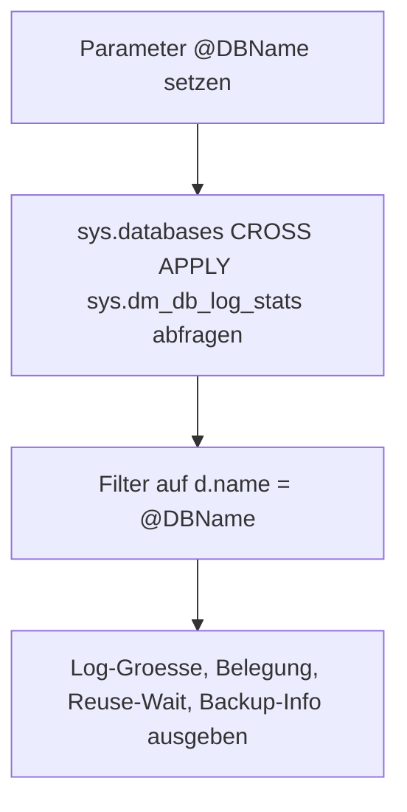

# RecoveryModelSimpleFullWhy_AllDB.sql

Dieses Skript zeigt fuer eine einzelne Datenbank detaillierte Log-Statistiken aus `sys.dm_db_log_stats`: Gesamtgroesse, aktiver Log-Anteil, `log_reuse_wait_desc`, `log_truncation_holdup_reason` sowie Groesse und Zeitpunkt seit dem letzten Log-Backup. Es dient zur Ursachenanalyse bei Log-Wachstum oder anhaltendem Reuse-Wait.

## Uebersicht

<!-- SQLDOC:SUMMARY_TABLE:BEGIN -->
| Feld | Wert |
|---|---|
| Script | [RecoveryModelSimpleFullWhy_AllDB.sql](RecoveryModelSimpleFullWhy_AllDB.sql) |
| Version | `1.0` |
| Typ | `diagnostic-query` |
| Kapitel | `19_Transaktions` |
| Sicherheit | `read-only` |
| Zweck | Zeigt tiefe Log-Statistiken fuer eine einzelne Datenbank zur Reuse-Wait-Ursachenanalyse. |
<!-- SQLDOC:SUMMARY_TABLE:END -->

## Einordnung

Waehrend `ListTransactionLogs.sql` einen Gesamtueberblick liefert, taucht dieses Skript fuer eine konkrete Datenbank tiefer ein. `log_truncation_holdup_reason` ist auf neueren SQL-Server-Versionen aussagekraeftiger als `log_reuse_wait_desc` und sollte vorrangig interpretiert werden. `log_since_last_log_backup_mb` zeigt, wie viel Log seit dem letzten Backup angewachsen ist – ein Indikator fuer Log-Wachstumsrate und Backup-Frequenz.

## Annahmen

- Der Parameter `@DBName` muss auf eine existierende, online Datenbank zeigen.
- `sys.dm_db_log_stats` erfordert mindestens SQL Server 2016 SP2 / 2017.
- Das Skript nimmt keine Aenderungen vor.

## Anwendungsfall

Das Skript eignet sich fuer die gezielte Diagnose einer einzelnen Datenbank im Incident-Fall, fuer das Verstaendnis des Log-Wachstumsmusters nach einem Backup-Ausfall und fuer Schulungszwecke rund um `log_reuse_wait_desc`-Werte.

## Parameter

<!-- SQLDOC:PARAMETERS_TABLE:BEGIN -->
| Parameter | SQL-Typ | Pflicht | Beschreibung |
|---|---|---|---|
| `@DBName` | `SYSNAME` | Ja | Name der zu analysierenden Datenbank |
<!-- SQLDOC:PARAMETERS_TABLE:END -->

## Abhaengigkeiten

<!-- SQLDOC:DEPENDENCIES_LIST:BEGIN -->
- `sys.databases`
- `sys.dm_db_log_stats`
<!-- SQLDOC:DEPENDENCIES_LIST:END -->

## Hinweise

- `sys.dm_db_log_stats` erfordert mindestens SQL Server 2016 SP2 / 2017.
- `log_truncation_holdup_reason` ist auf neueren Versionen aussagekraeftiger als `log_reuse_wait_desc`.
- Bei FULL-Recovery-Datenbanken zeigt `log_since_last_log_backup_mb` den angesammelten Log seit dem letzten Log-Backup – ein hoher Wert weist auf seltene Backups oder langen Reuse-Wait hin.

## Versionshistorie

<!-- SQLDOC:VERSION_HISTORY_TABLE:BEGIN -->
| Version | Datum | User | Beschreibung |
|---|---|---|---|
| `1.0` | `2026-04-21` | `ER` | Erstversion |
<!-- SQLDOC:VERSION_HISTORY_TABLE:END -->

## Ablauf

<!-- SQLDOC:MERMAID:BEGIN -->

<!-- SQLDOC:MERMAID:END -->

## SQL-Code

<!-- SQLDOC:SQL_CODE:BEGIN -->
```sql
/*
BEGIN:SQL-HEADER v1
---
sql_header: v1
script_name: "RecoveryModelSimpleFullWhy_AllDB.sql"
script_version: "1.0"
script_type: "diagnostic-query"
chapter: "19_Transaktions"

purpose: >
  Zeigt fuer eine einzelne Datenbank detaillierte Log-Statistiken aus
  sys.dm_db_log_stats: Log-Groesse, Belegung, log_reuse_wait_desc,
  log_truncation_holdup_reason sowie Zeit und Groesse seit dem letzten
  Log-Backup. Dient zur Ursachenanalyse bei Log-Wachstum oder hohen
  Reuse-Wait-Zeiten.

parameters:
  - name: "@DBName"
    sql_type: "SYSNAME"
    direction: "IN"
    required: true
    description: "Name der zu analysierenden Datenbank"

result_sets:
  - name: "LogStats"
    description: "Log-Statistiken der angegebenen Datenbank aus sys.dm_db_log_stats"

dependencies:
  - "sys.databases"
  - "sys.dm_db_log_stats"

safety:
  level: "read-only"
  writes_data: false

documentation:
  markdown_file: "T-SQL/19_Transaktions/SQLScripts/RecoveryModelSimpleFullWhy_AllDB.md"
  sync_blocks:
    - "SUMMARY_TABLE"
    - "PARAMETERS_TABLE"
    - "DEPENDENCIES_LIST"
    - "VERSION_HISTORY_TABLE"
    - "SQL_CODE"
  mermaid:
    mode: "ai-agent-from-sql"
    source: "script-body"

main_responsible:
  name: "Erhard Rainer"
  initials: "ER"

version_history:
  - version: "1.0"
    date: "2026-04-21"
    user: "ER"
    description: "Erstversion"

notes:
  - "sys.dm_db_log_stats erfordert mindestens SQL Server 2016 SP2 / 2017"
  - "log_truncation_holdup_reason ist aussagekraeftiger als log_reuse_wait_desc bei neueren Versionen"
---
END:SQL-HEADER v1
*/

DECLARE @DBName SYSNAME = N'BI_DWH';

SELECT
    d.name AS DatabaseName,
    d.state_desc,
    d.recovery_model_desc,
    ls.total_log_size_mb,
    ls.active_log_size_mb,
    CAST(
        CASE
            WHEN ls.total_log_size_mb > 0
                THEN (ls.active_log_size_mb * 100.0) / ls.total_log_size_mb
            ELSE 0
        END
        AS DECIMAL(10,2)
    ) AS LogUsedPct,
    d.log_reuse_wait_desc,
    ls.log_truncation_holdup_reason,
    ls.log_since_last_log_backup_mb,
    ls.log_backup_time
FROM sys.databases AS d
CROSS APPLY sys.dm_db_log_stats(d.database_id) AS ls
WHERE d.name = @DBName;
```
<!-- SQLDOC:SQL_CODE:END -->
