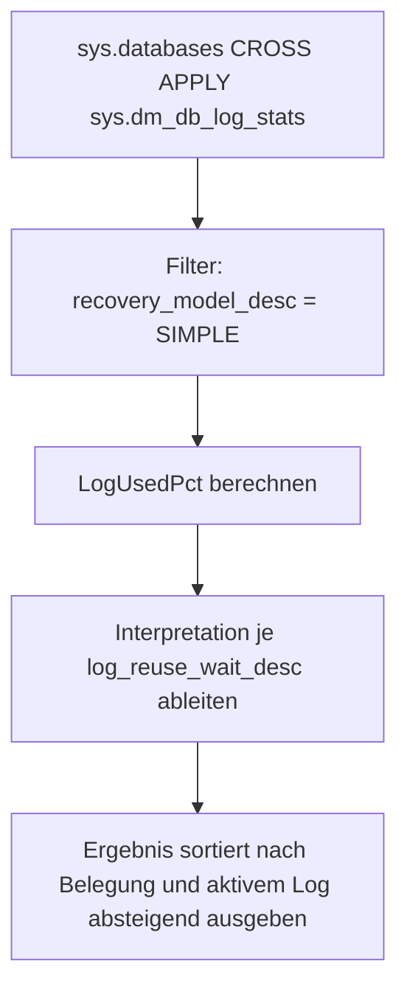

# RecoveryModelSimpleFullWhy_SpecificDB.sql

Dieses Skript listet alle SIMPLE-Recovery-Datenbanken mit detaillierten Log-Statistiken aus `sys.dm_db_log_stats` sowie einer deutschen Interpretation des `log_reuse_wait_desc`-Wertes. Die Sortierung nach Log-Belegung absteigend stellt die dringendsten Faelle an den Anfang der Ausgabe.

## Uebersicht

<!-- SQLDOC:SUMMARY_TABLE:BEGIN -->
| Feld | Wert |
|---|---|
| Script | [RecoveryModelSimpleFullWhy_SpecificDB.sql](RecoveryModelSimpleFullWhy_SpecificDB.sql) |
| Version | `1.0` |
| Typ | `diagnostic-query` |
| Kapitel | `19_Transaktions` |
| Sicherheit | `read-only` |
| Zweck | Listet alle SIMPLE-Datenbanken mit Log-Statistiken und Interpretation des Reuse-Wait-Grundes. |
<!-- SQLDOC:SUMMARY_TABLE:END -->

## Einordnung

Dieses Skript kombiniert die Breite eines Gesamt-Ueberblicks mit tieferen Statistiken aus `sys.dm_db_log_stats`. Die `Interpretation`-Spalte uebersetzt die `log_reuse_wait_desc`-Werte in verstaendliche Handlungshinweise auf Deutsch. Das Skript ist auf SIMPLE-Recovery-Datenbanken beschraenkt, da Log-Management und Shrink-Entscheidungen in SIMPLE-Umgebungen andere Regeln befolgen als in FULL-Recovery.

## Annahmen

- Das Skript hat keinen Parameter; es verarbeitet alle SIMPLE-Datenbanken auf der Instanz.
- `sys.dm_db_log_stats` erfordert mindestens SQL Server 2016 SP2 / 2017.
- Interpretationstexte sind Faustregeln; der konkrete Workload kann abweichende Bewertungen erfordern.

## Anwendungsfall

Das Skript eignet sich fuer den woechentlichen Review aller SIMPLE-Datenbanken, fuer Schulungen zu `log_reuse_wait_desc` und als Diagnose-Startpunkt bei unerwartetem Log-Wachstum auf einfach verwalteten Datenbanken.

## Parameter

Dieses Skript hat keine Parameter.

## Abhaengigkeiten

<!-- SQLDOC:DEPENDENCIES_LIST:BEGIN -->
- `sys.databases`
- `sys.dm_db_log_stats`
<!-- SQLDOC:DEPENDENCIES_LIST:END -->

## Hinweise

- `sys.dm_db_log_stats` erfordert mindestens SQL Server 2016 SP2 / 2017.
- Interpretationstexte sind Faustregeln; Details haengen vom konkreten Workload ab.
- `log_truncation_holdup_reason` in der Ausgabe kann auf neueren Versionen zusaetzliche Details liefern.
- Bei REPLICATION oder AVAILABILITY_REPLICA als Reuse-Wait: die betreffenden Agents oder Replicas pruefen.

## Versionshistorie

<!-- SQLDOC:VERSION_HISTORY_TABLE:BEGIN -->
| Version | Datum | User | Beschreibung |
|---|---|---|---|
| `1.0` | `2026-04-21` | `ER` | Erstversion |
<!-- SQLDOC:VERSION_HISTORY_TABLE:END -->

## Ablauf

<!-- SQLDOC:MERMAID:BEGIN -->

<!-- SQLDOC:MERMAID:END -->

## SQL-Code

<!-- SQLDOC:SQL_CODE:BEGIN -->
```sql
/*
BEGIN:SQL-HEADER v1
---
sql_header: v1
script_name: "RecoveryModelSimpleFullWhy_SpecificDB.sql"
script_version: "1.0"
script_type: "diagnostic-query"
chapter: "19_Transaktions"

purpose: >
  Listet alle SIMPLE-Recovery-Datenbanken mit detaillierten Log-Statistiken
  aus sys.dm_db_log_stats sowie einer deutschen Interpretation des
  log_reuse_wait_desc-Wertes. Sortiert nach Log-Belegung absteigend, um
  die dringendsten Faelle zuerst zu zeigen.

parameters: []

result_sets:
  - name: "SimpleDBLogStats"
    description: "Alle SIMPLE-Datenbanken mit Log-Groesse, Belegung, Reuse-Wait und Interpretation"

dependencies:
  - "sys.databases"
  - "sys.dm_db_log_stats"

safety:
  level: "read-only"
  writes_data: false

documentation:
  markdown_file: "T-SQL/19_Transaktions/SQLScripts/RecoveryModelSimpleFullWhy_SpecificDB.md"
  sync_blocks:
    - "SUMMARY_TABLE"
    - "DEPENDENCIES_LIST"
    - "VERSION_HISTORY_TABLE"
    - "SQL_CODE"
  mermaid:
    mode: "ai-agent-from-sql"
    source: "script-body"

main_responsible:
  name: "Erhard Rainer"
  initials: "ER"

version_history:
  - version: "1.0"
    date: "2026-04-21"
    user: "ER"
    description: "Erstversion"

notes:
  - "sys.dm_db_log_stats erfordert mindestens SQL Server 2016 SP2 / 2017"
  - "Interpretationstexte sind Faustregeln; Details haengen vom konkreten Workload ab"
---
END:SQL-HEADER v1
*/

SELECT
    d.name AS DatabaseName,
    d.state_desc,
    d.recovery_model_desc,
    ls.total_log_size_mb,
    ls.active_log_size_mb,
    CAST(
        CASE
            WHEN ls.total_log_size_mb > 0
                THEN (ls.active_log_size_mb * 100.0) / ls.total_log_size_mb
            ELSE 0
        END
        AS DECIMAL(10,2)
    ) AS LogUsedPct,
    d.log_reuse_wait_desc,
    ls.log_truncation_holdup_reason,
    ls.log_since_last_log_backup_mb,
    ls.log_backup_time,
    CASE d.log_reuse_wait_desc
        WHEN 'NOTHING' THEN 'Der Log kann wiederverwendet werden; akuter Reuse-Blocker ist nicht sichtbar.'
        WHEN 'CHECKPOINT' THEN 'Bei SIMPLE wird Log-Space typischerweise erst nach Checkpoint wiederverwendbar.'
        WHEN 'ACTIVE_TRANSACTION' THEN 'Eine lange/offene Transaktion verhindert die Log-Wiederverwendung.'
        WHEN 'ACTIVE_BACKUP_OR_RESTORE' THEN 'Backup- oder Restore-Vorgang blockiert aktuell die Wiederverwendung.'
        WHEN 'REPLICATION' THEN 'Replikation/Verteilung hält Log-Einträge noch fest.'
        WHEN 'DATABASE_MIRRORING' THEN 'Spiegelung/entsprechende Synchronisation blockiert die Wiederverwendung.'
        WHEN 'AVAILABILITY_REPLICA' THEN 'Eine Availability Replica hält die Wiederverwendung zurück.'
        WHEN 'XTP_CHECKPOINT' THEN 'In-Memory-OLTP-Checkpoint hält die Wiederverwendung zurück.'
        ELSE 'Details über log_reuse_wait_desc bzw. log_truncation_holdup_reason prüfen.'
    END AS Interpretation
FROM sys.databases AS d
CROSS APPLY sys.dm_db_log_stats(d.database_id) AS ls
WHERE d.recovery_model_desc = 'SIMPLE'
ORDER BY
    LogUsedPct DESC,
    ls.active_log_size_mb DESC;
```
<!-- SQLDOC:SQL_CODE:END -->
