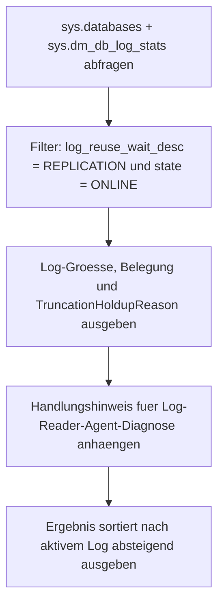

# ReuseWait_REPLICATION.sql

Dieses Skript listet alle Online-Datenbanken, bei denen `log_reuse_wait_desc` den Wert `REPLICATION` hat. Replikation haelt Log-Eintraege so lange fest, bis der Log-Reader-Agent sie verarbeitet hat. Die Ausgabe zeigt Log-Groesse, Belegung und einen konkreten Handlungshinweis fuer die Diagnose des Log-Reader-Agents.

## Uebersicht

<!-- SQLDOC:SUMMARY_TABLE:BEGIN -->
| Feld | Wert |
|---|---|
| Script | [ReuseWait_REPLICATION.sql](ReuseWait_REPLICATION.sql) |
| Version | `1.0` |
| Typ | `diagnostic-query` |
| Kapitel | `19_Transaktions` |
| Sicherheit | `read-only` |
| Zweck | Zeigt Datenbanken, deren Log-Wiederverwendung durch Replikation blockiert wird. |
<!-- SQLDOC:SUMMARY_TABLE:END -->

## Einordnung

`REPLICATION` als `log_reuse_wait_desc`-Wert bedeutet, dass der Log-Reader-Agent Eintraege noch nicht abgeholt hat. Das kann passieren, wenn der Agent gestoppt, rueckstaendig oder in einem Fehlerzustand ist. Dieses Skript gibt einen sofortigen Ueberblick, welche Datenbanken betroffen sind, und liefert einen Einstiegspunkt fuer die Diagnose.

## Annahmen

- Das Skript filtert auf `log_reuse_wait_desc = 'REPLICATION'` in `sys.databases`.
- `sys.dm_db_log_stats` liefert ergaenzende Metriken zu Groesse und aktivem Log.
- Der `Handlungshinweis` in der Ausgabe ist ein allgemeiner Startpunkt; die tatsaechliche Ursache muss im Replikationsmonitor oder per `sp_helpsubscription` verifiziert werden.

## Anwendungsfall

Das Skript eignet sich fuer die schnelle Triage bei unerwartetem Log-Wachstum auf replizierten Datenbanken, fuer Monitoring-Jobs und fuer den ersten Blick im Incident-Fall, wenn ein Log-voll-Fehler mit REPLICATION-Reuse-Wait auftritt.

## Parameter

Dieses Skript hat keine Parameter.

## Abhaengigkeiten

<!-- SQLDOC:DEPENDENCIES_LIST:BEGIN -->
- `sys.databases`
- `sys.dm_db_log_stats`
<!-- SQLDOC:DEPENDENCIES_LIST:END -->

## Hinweise

- `REPLICATION` als Reuse-Wait tritt auf, wenn der Log-Reader-Agent rueckstaendig oder gestoppt ist.
- Loesung: Log-Reader-Agent-Status pruefen (`sp_helpsubscription`, Replikationsmonitor) und ggf. neu starten.
- `sys.dm_db_log_stats` erfordert mindestens SQL Server 2016 SP2 / 2017.
- `log_truncation_holdup_reason` in der Ausgabe kann auf neueren Versionen zusaetzliche Details liefern.

## Versionshistorie

<!-- SQLDOC:VERSION_HISTORY_TABLE:BEGIN -->
| Version | Datum | User | Beschreibung |
|---|---|---|---|
| `1.0` | `2026-04-21` | `ER` | Erstversion; Platzhalter-Datei mit Inhalt und Header versehen |
<!-- SQLDOC:VERSION_HISTORY_TABLE:END -->

## Ablauf

<!-- SQLDOC:MERMAID:BEGIN -->

<!-- SQLDOC:MERMAID:END -->

## SQL-Code

<!-- SQLDOC:SQL_CODE:BEGIN -->
```sql
/*
BEGIN:SQL-HEADER v1
---
sql_header: v1
script_name: "ReuseWait_REPLICATION.sql"
script_version: "1.0"
script_type: "diagnostic-query"
chapter: "19_Transaktions"

purpose: >
  Zeigt alle Datenbanken, bei denen log_reuse_wait_desc den Wert REPLICATION
  hat. Replikation haelt Log-Eintraege solange fest, bis der Log-Reader-Agent
  sie verarbeitet hat. Das Skript listet betroffene DBs mit Log-Groesse,
  Belegung und Hinweisen zum weiteren Vorgehen.

parameters: []

result_sets:
  - name: "ReplicationLogWait"
    description: "Datenbanken mit log_reuse_wait_desc = REPLICATION samt Log-Groesse und Handlungshinweis"

dependencies:
  - "sys.databases"
  - "sys.dm_db_log_stats"

safety:
  level: "read-only"
  writes_data: false

documentation:
  markdown_file: "T-SQL/19_Transaktions/SQLScripts/ReuseWait_REPLICATION.md"
  sync_blocks:
    - "SUMMARY_TABLE"
    - "DEPENDENCIES_LIST"
    - "VERSION_HISTORY_TABLE"
    - "SQL_CODE"
  mermaid:
    mode: "ai-agent-from-sql"
    source: "script-body"

main_responsible:
  name: "Erhard Rainer"
  initials: "ER"

version_history:
  - version: "1.0"
    date: "2026-04-21"
    user: "ER"
    description: "Erstversion; Platzhalter-Datei mit Inhalt und Header versehen"

notes:
  - "REPLICATION als Reuse-Wait-Grund tritt auf, wenn der Log-Reader-Agent rueckstaendig oder gestoppt ist"
  - "Loesung: Log-Reader-Agent-Status pruefen (sp_helpsubscription, Replikationsmonitor) und ggf. neu starten"
  - "sys.dm_db_log_stats erfordert mindestens SQL Server 2016 SP2 / 2017"
---
END:SQL-HEADER v1
*/

SELECT
    d.name                              AS DatabaseName,
    d.recovery_model_desc               AS RecoveryModel,
    d.log_reuse_wait_desc               AS LogReuseWaitDesc,
    ls.total_log_size_mb                AS LogSizeMB,
    ls.active_log_size_mb               AS ActiveLogMB,
    CAST(
        CASE
            WHEN ls.total_log_size_mb > 0
                THEN (ls.active_log_size_mb * 100.0) / ls.total_log_size_mb
            ELSE 0
        END
        AS DECIMAL(10,2)
    )                                   AS LogUsedPct,
    ls.log_truncation_holdup_reason     AS TruncationHoldupReason,
    N'Log-Reader-Agent pruefen: ist der Agent aktiv und verarbeitet Transaktionen? '
    + N'Ggf. sp_helpsubscription / Replikationsmonitor verwenden.'
                                        AS Handlungshinweis
FROM sys.databases AS d
CROSS APPLY sys.dm_db_log_stats(d.database_id) AS ls
WHERE d.log_reuse_wait_desc = N'REPLICATION'
  AND d.state_desc = N'ONLINE'
ORDER BY
    ls.active_log_size_mb DESC,
    d.name;
```
<!-- SQLDOC:SQL_CODE:END -->
