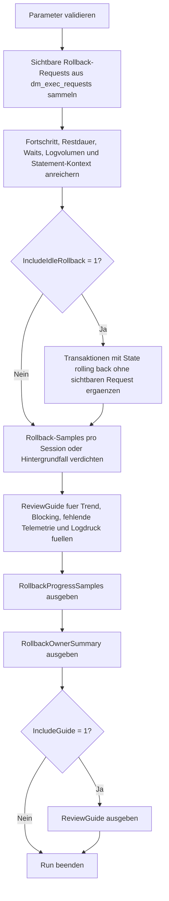

# RollbackProgressSampler.sql

Dieses Skript sampelt laufende Rollback-Vorgaenge aus den aktuellen DMVs und kombiniert Fortschrittswerte, Restdauer, Session-Kontext und Logvolumen in einer kompakten Diagnose. Im Kapitel `19_Transaktions` eignet es sich fuer Incident-Reviews und Unterricht, wenn nach einem `KILL`, Fehlerpfad oder manuellen Rueckbau sichtbar werden soll, wie weit der Rollback fortgeschritten ist und welche Folgewirkungen noch beobachtet werden sollten.

## Uebersicht

<!-- SQLDOC:SUMMARY_TABLE:BEGIN -->
| Feld | Wert |
|---|---|
| Script | [RollbackProgressSampler.sql](RollbackProgressSampler.sql) |
| Version | `1.0` |
| Typ | `diagnostic-query` |
| Kapitel | `19_Transaktions` |
| Sicherheit | `read-only` |
| Zweck | Sampelt laufende Rollback-Vorgaenge mit Prozentfortschritt, Restdauer und Session-Kontext. |
<!-- SQLDOC:SUMMARY_TABLE:END -->

## Einordnung

Bei Rollbacks ist der Druck oft hoch, schnell eine belastbare Restdauer zu nennen. Genau das ist in SQL Server aber nur eingeschraenkt moeglich, weil `percent_complete` und `estimated_completion_time` nicht in jedem Fall sichtbar oder stabil sind. Diese Erstversion nutzt deshalb mehrere DMV-Sichten: sichtbare Request-Rollbacks werden direkt beprobt, zusaetzlich koennen Transaktionen mit Status `rolling back` auch ohne sichtbaren Request aufgenommen werden.

## Annahmen

- Das Skript ist eine read-only Diagnose und fuehrt keine `ROLLBACK`, `KILL`, `COMMIT` oder Recovery-Befehle aus.
- `percent_complete` und `estimated_completion_time` werden als Stichprobe behandelt; fuer belastbare Aussagen ist meist mehr als ein Sample sinnvoll.
- Rollbacks ohne aktiven Request koennen als Hintergrundarbeit, Sessionwechsel oder nur eingeschraenkt sichtbarer DMV-Kontext erscheinen.
- Die Schwellen fuer `ReviewSignal` sind bewusst didaktische Priorisierungshilfen und keine verbindlichen Produktions-SLAs.

## Anwendungsfall

Das Skript passt zu Situationen, in denen ein Rollback bereits laeuft und schnelle Orientierung gebraucht wird: Welche Session oder Transaktion ist betroffen? Gibt es einen sichtbaren Fortschrittswert? Wie viel Logvolumen ist noch im Spiel? Und wann sollte man lieber Verlaufssamples nehmen, statt einen einzelnen Prozentwert zu ueberinterpretieren?

## Parameter

<!-- SQLDOC:PARAMETERS_TABLE:BEGIN -->
| Parameter | SQL-Typ | Pflicht | Beschreibung |
|---|---|---|---|
| `@MinimumPercentComplete` | `DECIMAL(5,2)` | Nein | Filtert auf Rollback-Vorgaenge ab diesem gemeldeten Prozentfortschritt. |
| `@IncludeIdleRollback` | `BIT` | Nein | `1` nimmt auch rollende Transaktionen ohne aktuell sichtbaren Request auf. |
| `@IncludeGuide` | `BIT` | Nein | Gibt bei `1` zusaetzlich einen kompakten Review-Leitfaden aus. |
<!-- SQLDOC:PARAMETERS_TABLE:END -->

## Abhaengigkeiten

<!-- SQLDOC:DEPENDENCIES_LIST:BEGIN -->
- `sys.dm_exec_requests`
- `sys.dm_exec_sessions`
- `sys.dm_exec_connections`
- `sys.dm_exec_sql_text`
- `sys.dm_tran_session_transactions`
- `sys.dm_tran_active_transactions`
- `sys.dm_tran_database_transactions`
- `sys.databases`
- `SYSUTCDATETIME`
- `DATEDIFF`
- `CASE`
- `ORDER BY`
- `tempdb temporary tables`
<!-- SQLDOC:DEPENDENCIES_LIST:END -->

## Hinweise

- `RollbackProgressSamples` zeigt einzelne Rollback-Beobachtungen mit Prozentwert, Restdauer, Wait- und Session-Kontext.
- `RollbackOwnerSummary` verdichtet dieselbe Sicht pro Session oder Hintergrundfall und priorisiert die naechsten Beobachtungsschritte.
- Der Guide betont Verlauf, Blockierung, fehlende Telemetrie und Logdruck statt vorschneller Abschlussprognosen.

## Versionshistorie

<!-- SQLDOC:VERSION_HISTORY_TABLE:BEGIN -->
| Version | Datum | User | Beschreibung |
|---|---|---|---|
| `1.0` | `2026-04-22` | `ER` | Erstversion des Diagnose-Skripts fuer laufende Rollback-Vorgaenge |
<!-- SQLDOC:VERSION_HISTORY_TABLE:END -->

## Ablauf

<!-- SQLDOC:MERMAID:BEGIN -->

<!-- SQLDOC:MERMAID:END -->

## SQL-Code

<!-- SQLDOC:SQL_CODE:BEGIN -->
```sql
/*
BEGIN:SQL-HEADER v1
---
sql_header: v1
script_name: "RollbackProgressSampler.sql"
script_version: "1.0"
script_type: "diagnostic-query"
chapter: "19_Transaktions"

purpose: >
  Sampelt laufende Rollback-Vorgaenge aus aktuellen DMVs und verdichtet
  Prozentfortschritt, Restdauer, Session-Kontext und Rollback-Typ zu einer
  kompakten Diagnose fuer Troubleshooting und Unterricht.

parameters:
  - name: "@MinimumPercentComplete"
    sql_type: "DECIMAL(5,2)"
    direction: "IN"
    required: false
    description: "Filtert auf Rollback-Vorgaenge ab diesem gemeldeten Prozentfortschritt"
  - name: "@IncludeIdleRollback"
    sql_type: "BIT"
    direction: "IN"
    required: false
    description: "1 = auch rollende Transaktionen ohne aktuell sichtbaren Request aufnehmen"
  - name: "@IncludeGuide"
    sql_type: "BIT"
    direction: "IN"
    required: false
    description: "1 = zusaetzlich einen kompakten Review-Leitfaden ausgeben"

result_sets:
  - name: "RollbackProgressSamples"
    description: "Zeigt laufende Rollback-Vorgaenge mit Prozentfortschritt, Restdauer und Session-Kontext"
  - name: "RollbackOwnerSummary"
    description: "Verdichtet die Stichprobe pro Session oder Hintergrund-Rollback zu einer Priorisierung"
  - name: "ReviewGuide"
    description: "Ordnet typische Rollback-Signale passenden naechsten Review-Schritten zu"

dependencies:
  - "sys.dm_exec_requests"
  - "sys.dm_exec_sessions"
  - "sys.dm_exec_connections"
  - "sys.dm_exec_sql_text"
  - "sys.dm_tran_session_transactions"
  - "sys.dm_tran_active_transactions"
  - "sys.dm_tran_database_transactions"
  - "sys.databases"
  - "SYSUTCDATETIME"
  - "DATEDIFF"
  - "CASE"
  - "ORDER BY"
  - "tempdb temporary tables"

safety:
  level: "read-only"
  writes_data: false

documentation:
  markdown_file: "T-SQL/19_Transaktions/SQLScripts/RollbackProgressSampler.md"
  sync_blocks:
    - "SUMMARY_TABLE"
    - "PARAMETERS_TABLE"
    - "DEPENDENCIES_LIST"
    - "VERSION_HISTORY_TABLE"
    - "SQL_CODE"
  mermaid:
    mode: "ai-agent-from-sql"
    source: "script-body"

main_responsible:
  name: "Erhard Rainer"
  initials: "ER"

version_history:
  - version: "1.0"
    date: "2026-04-22"
    user: "ER"
    description: "Erstversion des Diagnose-Skripts fuer laufende Rollback-Vorgaenge"

notes:
  - "Die Sicht basiert auf aktuellen DMV-Werten; percent_complete und estimated_completion_time koennen schwanken oder fehlen."
  - "Das Skript fuehrt keine ROLLBACK-, KILL- oder Recovery-Befehle aus und dient nur der Beobachtung."
---
END:SQL-HEADER v1
*/

SET NOCOUNT ON;

-- 1. Parameter vorbereiten
DECLARE @MinimumPercentComplete DECIMAL(5,2) = 0.00;
DECLARE @IncludeIdleRollback BIT = 1;
DECLARE @IncludeGuide BIT = 1;

IF @MinimumPercentComplete < 0 OR @MinimumPercentComplete > 100
BEGIN
    THROW 50000, '@MinimumPercentComplete muss zwischen 0 und 100 liegen.', 1;
END;

IF @IncludeIdleRollback NOT IN (0, 1)
BEGIN
    THROW 50001, '@IncludeIdleRollback muss 0 oder 1 sein.', 1;
END;

IF @IncludeGuide NOT IN (0, 1)
BEGIN
    THROW 50002, '@IncludeGuide muss 0 oder 1 sein.', 1;
END;

DROP TABLE IF EXISTS #RollbackProgressSamples;
DROP TABLE IF EXISTS #RollbackOwnerSummary;
DROP TABLE IF EXISTS #ReviewGuide;

-- 2. Rollback-Sicht vorbereiten
CREATE TABLE #RollbackProgressSamples
(
    SampleCapturedAtUtc             DATETIME2(0)    NOT NULL,
    SessionId                       SMALLINT        NULL,
    DatabaseName                    SYSNAME         NULL,
    TransactionId                   BIGINT          NULL,
    TransactionName                 NVARCHAR(64)    NULL,
    RollbackSource                  VARCHAR(30)     NOT NULL,
    RequestStatus                   NVARCHAR(30)    NULL,
    RequestCommand                  NVARCHAR(32)    NULL,
    TransactionState                NVARCHAR(40)    NOT NULL,
    RollbackPercentComplete         DECIMAL(6,2)    NULL,
    EstimatedCompletionMs           BIGINT          NULL,
    EstimatedCompletionMinutes      DECIMAL(18,2)   NULL,
    RollbackAgeMinutes              INT             NULL,
    BlockingSessionId               SMALLINT        NULL,
    WaitType                        NVARCHAR(120)   NULL,
    WaitTimeMs                      INT             NULL,
    OpenTransactionCount            INT             NULL,
    DatabaseLogUsedMB               DECIMAL(18,2)   NULL,
    DatabaseLogReservedMB           DECIMAL(18,2)   NULL,
    LoginName                       NVARCHAR(128)   NULL,
    HostName                        NVARCHAR(128)   NULL,
    ProgramName                     NVARCHAR(128)   NULL,
    ClientNetAddress                VARCHAR(48)     NULL,
    StatementSnippet                NVARCHAR(4000)  NULL,
    ReviewSignal                    VARCHAR(12)     NOT NULL,
    ReviewHint                      VARCHAR(220)    NOT NULL
);

INSERT INTO #RollbackProgressSamples
(
    SampleCapturedAtUtc,
    SessionId,
    DatabaseName,
    TransactionId,
    TransactionName,
    RollbackSource,
    RequestStatus,
    RequestCommand,
    TransactionState,
    RollbackPercentComplete,
    EstimatedCompletionMs,
    EstimatedCompletionMinutes,
    RollbackAgeMinutes,
    BlockingSessionId,
    WaitType,
    WaitTimeMs,
    OpenTransactionCount,
    DatabaseLogUsedMB,
    DatabaseLogReservedMB,
    LoginName,
    HostName,
    ProgramName,
    ClientNetAddress,
    StatementSnippet,
    ReviewSignal,
    ReviewHint
)
SELECT
    SYSUTCDATETIME() AS SampleCapturedAtUtc,
    r.session_id AS SessionId,
    DB_NAME(COALESCE(r.database_id, dt.database_id, s.database_id)) AS DatabaseName,
    at.transaction_id AS TransactionId,
    at.name AS TransactionName,
    'request-visible' AS RollbackSource,
    r.status AS RequestStatus,
    r.command AS RequestCommand,
    CASE at.transaction_state
        WHEN 0 THEN N'not initialized'
        WHEN 1 THEN N'initialized'
        WHEN 2 THEN N'active'
        WHEN 3 THEN N'ended read-only'
        WHEN 4 THEN N'commit started'
        WHEN 5 THEN N'prepared'
        WHEN 6 THEN N'committed'
        WHEN 7 THEN N'rolling back'
        WHEN 8 THEN N'rolled back'
        ELSE CONCAT(N'state(', at.transaction_state, N')')
    END AS TransactionState,
    CAST(r.percent_complete AS DECIMAL(6,2)) AS RollbackPercentComplete,
    CAST(r.estimated_completion_time AS BIGINT) AS EstimatedCompletionMs,
    CAST(CAST(r.estimated_completion_time AS DECIMAL(18,2)) / 60000.0 AS DECIMAL(18,2)) AS EstimatedCompletionMinutes,
    CASE
        WHEN at.transaction_begin_time IS NULL THEN NULL
        ELSE DATEDIFF(MINUTE, at.transaction_begin_time, SYSUTCDATETIME())
    END AS RollbackAgeMinutes,
    NULLIF(r.blocking_session_id, 0) AS BlockingSessionId,
    r.wait_type AS WaitType,
    r.wait_time AS WaitTimeMs,
    s.open_transaction_count AS OpenTransactionCount,
    CAST(COALESCE(dt.database_transaction_log_bytes_used, 0) / 1048576.0 AS DECIMAL(18,2)) AS DatabaseLogUsedMB,
    CAST(COALESCE(dt.database_transaction_log_bytes_reserved, 0) / 1048576.0 AS DECIMAL(18,2)) AS DatabaseLogReservedMB,
    s.login_name AS LoginName,
    s.host_name AS HostName,
    s.program_name AS ProgramName,
    c.client_net_address AS ClientNetAddress,
    CASE
        WHEN r.sql_handle IS NULL OR txt.text IS NULL THEN NULL
        ELSE LTRIM(RTRIM(
            SUBSTRING(
                txt.text,
                (r.statement_start_offset / 2) + 1,
                CASE
                    WHEN r.statement_end_offset IS NULL OR r.statement_end_offset < 0
                        THEN LEN(CONVERT(NVARCHAR(MAX), txt.text))
                    ELSE ((r.statement_end_offset - r.statement_start_offset) / 2) + 1
                END
            )
        ))
    END AS StatementSnippet,
    CASE
        WHEN COALESCE(r.percent_complete, 0) < 5 THEN 'high'
        WHEN COALESCE(r.estimated_completion_time, 0) >= 900000 THEN 'high'
        WHEN NULLIF(r.blocking_session_id, 0) IS NOT NULL THEN 'high'
        WHEN COALESCE(dt.database_transaction_log_bytes_used, 0) >= 268435456 THEN 'medium'
        ELSE 'observe'
    END AS ReviewSignal,
    CASE
        WHEN NULLIF(r.blocking_session_id, 0) IS NOT NULL
            THEN 'Rollback ist weiterhin in Blocking-Kontext eingebunden; Root-Blocker und Restdauer gemeinsam reviewen.'
        WHEN COALESCE(r.percent_complete, 0) < 5
            THEN 'Rollback steht noch sehr frueh; laengere Rueckbauzeit und Benutzerkommunikation einplanen.'
        WHEN COALESCE(r.estimated_completion_time, 0) >= 900000
            THEN 'Gemeldete Restdauer ist auffaellig hoch; Incident-Kommunikation und Kapazitaetsauswirkung frueh abstimmen.'
        WHEN COALESCE(dt.database_transaction_log_bytes_used, 0) >= 268435456
            THEN 'Der Rueckbau betrifft merkliches Logvolumen; Logreuse und Backup-Kontext parallel beobachten.'
        ELSE 'Kompakte Stichprobe fuer Verlauf und naechste Beobachtung.'
    END AS ReviewHint
FROM sys.dm_exec_requests AS r
LEFT JOIN sys.dm_exec_sessions AS s
    ON s.session_id = r.session_id
LEFT JOIN sys.dm_exec_connections AS c
    ON c.session_id = r.session_id
LEFT JOIN sys.dm_tran_session_transactions AS st
    ON st.session_id = r.session_id
LEFT JOIN sys.dm_tran_active_transactions AS at
    ON at.transaction_id = st.transaction_id
LEFT JOIN sys.dm_tran_database_transactions AS dt
    ON dt.transaction_id = at.transaction_id
OUTER APPLY sys.dm_exec_sql_text(r.sql_handle) AS txt
WHERE r.command LIKE N'%ROLLBACK%'
  AND COALESCE(r.percent_complete, 0) >= @MinimumPercentComplete;

IF @IncludeIdleRollback = 1
BEGIN
    INSERT INTO #RollbackProgressSamples
    (
        SampleCapturedAtUtc,
        SessionId,
        DatabaseName,
        TransactionId,
        TransactionName,
        RollbackSource,
        RequestStatus,
        RequestCommand,
        TransactionState,
        RollbackPercentComplete,
        EstimatedCompletionMs,
        EstimatedCompletionMinutes,
        RollbackAgeMinutes,
        BlockingSessionId,
        WaitType,
        WaitTimeMs,
        OpenTransactionCount,
        DatabaseLogUsedMB,
        DatabaseLogReservedMB,
        LoginName,
        HostName,
        ProgramName,
        ClientNetAddress,
        StatementSnippet,
        ReviewSignal,
        ReviewHint
    )
    SELECT
        SYSUTCDATETIME() AS SampleCapturedAtUtc,
        st.session_id AS SessionId,
        DB_NAME(dt.database_id) AS DatabaseName,
        at.transaction_id AS TransactionId,
        at.name AS TransactionName,
        'transaction-state' AS RollbackSource,
        s.status AS RequestStatus,
        NULL AS RequestCommand,
        N'rolling back' AS TransactionState,
        NULL AS RollbackPercentComplete,
        NULL AS EstimatedCompletionMs,
        NULL AS EstimatedCompletionMinutes,
        CASE
            WHEN at.transaction_begin_time IS NULL THEN NULL
            ELSE DATEDIFF(MINUTE, at.transaction_begin_time, SYSUTCDATETIME())
        END AS RollbackAgeMinutes,
        NULL AS BlockingSessionId,
        NULL AS WaitType,
        NULL AS WaitTimeMs,
        s.open_transaction_count AS OpenTransactionCount,
        CAST(COALESCE(dt.database_transaction_log_bytes_used, 0) / 1048576.0 AS DECIMAL(18,2)) AS DatabaseLogUsedMB,
        CAST(COALESCE(dt.database_transaction_log_bytes_reserved, 0) / 1048576.0 AS DECIMAL(18,2)) AS DatabaseLogReservedMB,
        s.login_name AS LoginName,
        s.host_name AS HostName,
        s.program_name AS ProgramName,
        c.client_net_address AS ClientNetAddress,
        NULL AS StatementSnippet,
        CASE
            WHEN st.session_id IS NULL THEN 'high'
            WHEN COALESCE(dt.database_transaction_log_bytes_used, 0) >= 268435456 THEN 'medium'
            ELSE 'observe'
        END AS ReviewSignal,
        CASE
            WHEN st.session_id IS NULL
                THEN 'Rollback ist ueber den Transaktionsstatus sichtbar, aber ohne aktiven Request; Hintergrund- oder Restkontext gezielt pruefen.'
            WHEN COALESCE(dt.database_transaction_log_bytes_used, 0) >= 268435456
                THEN 'Rollback ohne percent_complete, aber mit deutlichem Logvolumen; Verlauf ueber mehrere Samples beobachten.'
            ELSE 'Rollback ist nur indirekt sichtbar; zweites Sample fuer Verlauf oder Sessionwechsel einplanen.'
        END AS ReviewHint
    FROM sys.dm_tran_active_transactions AS at
    LEFT JOIN sys.dm_tran_session_transactions AS st
        ON st.transaction_id = at.transaction_id
    LEFT JOIN sys.dm_exec_sessions AS s
        ON s.session_id = st.session_id
    LEFT JOIN sys.dm_exec_connections AS c
        ON c.session_id = st.session_id
    LEFT JOIN sys.dm_tran_database_transactions AS dt
        ON dt.transaction_id = at.transaction_id
    WHERE at.transaction_state = 7
      AND NOT EXISTS
      (
          SELECT 1
          FROM #RollbackProgressSamples AS existing
          WHERE existing.TransactionId = at.transaction_id
      );
END;

-- 3. Rollback-Sicht pro Session oder Hintergrundfall verdichten
CREATE TABLE #RollbackOwnerSummary
(
    RollbackOwnerKey                NVARCHAR(40)    NOT NULL,
    SessionId                       SMALLINT        NULL,
    DatabaseName                    SYSNAME         NULL,
    RollbackCount                   INT             NOT NULL,
    VisibleRequestCount             INT             NOT NULL,
    MaxPercentComplete              DECIMAL(6,2)    NULL,
    MinPercentComplete              DECIMAL(6,2)    NULL,
    LongestEstimatedMinutes         DECIMAL(18,2)   NULL,
    MaxRollbackAgeMinutes           INT             NULL,
    TotalLogUsedMB                  DECIMAL(18,2)   NOT NULL,
    HighestReviewSignal             VARCHAR(12)     NOT NULL,
    SummaryRecommendation           VARCHAR(220)    NOT NULL
);

INSERT INTO #RollbackOwnerSummary
(
    RollbackOwnerKey,
    SessionId,
    DatabaseName,
    RollbackCount,
    VisibleRequestCount,
    MaxPercentComplete,
    MinPercentComplete,
    LongestEstimatedMinutes,
    MaxRollbackAgeMinutes,
    TotalLogUsedMB,
    HighestReviewSignal,
    SummaryRecommendation
)
SELECT
    COALESCE(CONCAT('SPID-', rps.SessionId), CONCAT('TX-', rps.TransactionId), 'UNKNOWN') AS RollbackOwnerKey,
    rps.SessionId,
    MAX(rps.DatabaseName) AS DatabaseName,
    COUNT(*) AS RollbackCount,
    SUM(CASE WHEN rps.RollbackSource = 'request-visible' THEN 1 ELSE 0 END) AS VisibleRequestCount,
    MAX(rps.RollbackPercentComplete) AS MaxPercentComplete,
    MIN(rps.RollbackPercentComplete) AS MinPercentComplete,
    MAX(rps.EstimatedCompletionMinutes) AS LongestEstimatedMinutes,
    MAX(rps.RollbackAgeMinutes) AS MaxRollbackAgeMinutes,
    CAST(SUM(COALESCE(rps.DatabaseLogUsedMB, 0.00)) AS DECIMAL(18,2)) AS TotalLogUsedMB,
    CASE
        WHEN MAX(CASE rps.ReviewSignal WHEN 'high' THEN 3 WHEN 'medium' THEN 2 ELSE 1 END) >= 3 THEN 'high'
        WHEN MAX(CASE rps.ReviewSignal WHEN 'high' THEN 3 WHEN 'medium' THEN 2 ELSE 1 END) >= 2 THEN 'medium'
        ELSE 'observe'
    END AS HighestReviewSignal,
    CASE
        WHEN MAX(CASE rps.ReviewSignal WHEN 'high' THEN 3 WHEN 'medium' THEN 2 ELSE 1 END) >= 3
            THEN 'Rollback priorisiert beobachten und Incident-Kommunikation mit Restdauer, Blockierung und Besitzer abstimmen.'
        WHEN MAX(rps.RollbackPercentComplete) IS NULL
            THEN 'Kein percent_complete sichtbar; mehrere Samples vergleichen und DMV-Kontext mit Sessionstatus kombinieren.'
        WHEN MAX(COALESCE(rps.RollbackPercentComplete, 0.00)) < 100.00
            THEN 'Fortschritt ist sichtbar; naechstes Sample fuer Trend und verbleibende Dauer vormerken.'
        ELSE 'Rollback wirkt nahezu abgeschlossen; Nachwirkungen auf Logreuse und wartende Sessions weiter beobachten.'
    END AS SummaryRecommendation
FROM #RollbackProgressSamples AS rps
GROUP BY
    COALESCE(CONCAT('SPID-', rps.SessionId), CONCAT('TX-', rps.TransactionId), 'UNKNOWN'),
    rps.SessionId;

-- 4. Leitfaden fuellen
CREATE TABLE #ReviewGuide
(
    GuideStep                       TINYINT         NOT NULL,
    FocusArea                       VARCHAR(80)     NOT NULL,
    TriggerDescription              VARCHAR(220)    NOT NULL,
    RecommendedNextStep             VARCHAR(220)    NOT NULL,
    WhyItHelps                      VARCHAR(220)    NOT NULL
);

INSERT INTO #ReviewGuide
(
    GuideStep,
    FocusArea,
    TriggerDescription,
    RecommendedNextStep,
    WhyItHelps
)
VALUES
    (
        1,
        'Progress trend',
        'Percent_complete ist sichtbar und eignet sich fuer wiederholte Stichproben.',
        'Mehrere Samples im selben Incident vergleichen, statt nur einen Einzelwert zu melden.',
        'Rollback-Zeiten koennen schwanken; der Trend ist oft belastbarer als eine Einzelprognose.'
    ),
    (
        2,
        'Blocking context',
        'Rollback und Blocking treten gleichzeitig auf oder wartende Sessions bleiben sichtbar.',
        'Rollback-Owner, Root-Blocker und betroffene Workloads gemeinsam reviewen.',
        'So wird klar, ob der Rueckbau bereits entlastet oder weiterhin Folgeprobleme erzeugt.'
    ),
    (
        3,
        'Missing progress',
        'TransactionState zeigt rolling back, aber kein sichtbarer Request liefert percent_complete.',
        'Zusatz-DMVs und ein weiteres Sample nutzen, statt einen Abschlusszeitpunkt zu versprechen.',
        'Nicht jeder Rueckbau meldet denselben Telemetrieumfang; saubere Kommunikation vermeidet Scheingenauigkeit.'
    ),
    (
        4,
        'Log pressure',
        'Rollback betrifft hohes Logvolumen oder laeuft bereits lange.',
        'Logreuse, Logbackup-Frequenz und Kapazitaetsgrenzen parallel zum Rueckbau beobachten.',
        'Ein Rollback entlastet nicht sofort jede Log- oder Sperrsituation.'
    );

-- 5. Resultsets ausgeben
SELECT
    rps.SampleCapturedAtUtc,
    rps.SessionId,
    rps.DatabaseName,
    rps.TransactionId,
    rps.TransactionName,
    rps.RollbackSource,
    rps.RequestStatus,
    rps.RequestCommand,
    rps.TransactionState,
    rps.RollbackPercentComplete,
    rps.EstimatedCompletionMs,
    rps.EstimatedCompletionMinutes,
    rps.RollbackAgeMinutes,
    rps.BlockingSessionId,
    rps.WaitType,
    rps.WaitTimeMs,
    rps.OpenTransactionCount,
    rps.DatabaseLogUsedMB,
    rps.DatabaseLogReservedMB,
    rps.LoginName,
    rps.HostName,
    rps.ProgramName,
    rps.ClientNetAddress,
    rps.StatementSnippet,
    rps.ReviewSignal,
    rps.ReviewHint
FROM #RollbackProgressSamples AS rps
ORDER BY
    CASE rps.ReviewSignal
        WHEN 'high' THEN 1
        WHEN 'medium' THEN 2
        ELSE 3
    END,
    COALESCE(rps.EstimatedCompletionMinutes, 0.00) DESC,
    COALESCE(rps.RollbackAgeMinutes, 0) DESC,
    rps.SessionId,
    rps.TransactionId;

SELECT
    ros.RollbackOwnerKey,
    ros.SessionId,
    ros.DatabaseName,
    ros.RollbackCount,
    ros.VisibleRequestCount,
    ros.MinPercentComplete,
    ros.MaxPercentComplete,
    ros.LongestEstimatedMinutes,
    ros.MaxRollbackAgeMinutes,
    ros.TotalLogUsedMB,
    ros.HighestReviewSignal,
    ros.SummaryRecommendation
FROM #RollbackOwnerSummary AS ros
ORDER BY
    CASE ros.HighestReviewSignal
        WHEN 'high' THEN 1
        WHEN 'medium' THEN 2
        ELSE 3
    END,
    COALESCE(ros.LongestEstimatedMinutes, 0.00) DESC,
    COALESCE(ros.MaxRollbackAgeMinutes, 0) DESC,
    ros.RollbackOwnerKey;

IF @IncludeGuide = 1
BEGIN
    SELECT
        rg.GuideStep,
        rg.FocusArea,
        rg.TriggerDescription,
        rg.RecommendedNextStep,
        rg.WhyItHelps
    FROM #ReviewGuide AS rg
    ORDER BY
        rg.GuideStep;
END;
```
<!-- SQLDOC:SQL_CODE:END -->
