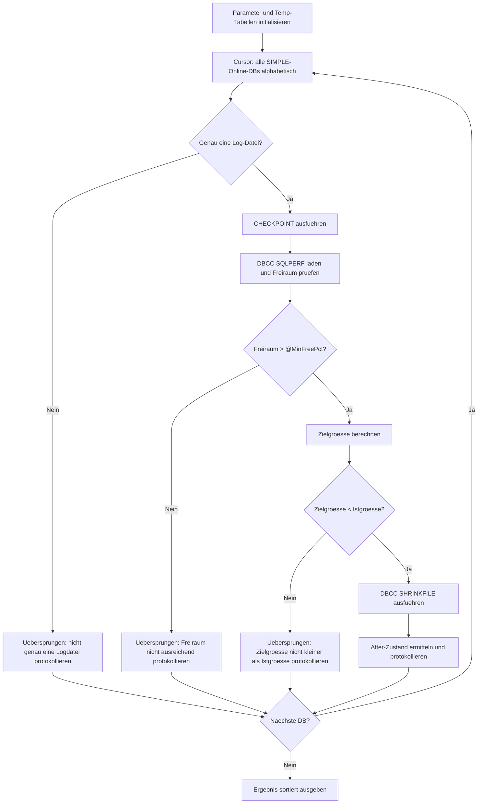

# ShrinkSimple.sql

Dieses Skript fuehrt eine automatisierte Shrink-Operation fuer alle SIMPLE-Recovery-Datenbanken mit genau einer Log-Datei durch. Fuer jede qualifizierte Datenbank werden CHECKPOINT ausgefuehrt, der Ist-Zustand ermittelt, eine Zielgroesse berechnet und `DBCC SHRINKFILE` aufgerufen. Das Ergebnis zeigt Before/After-Werte und einen Aktionsstatus je Datenbank.

## Uebersicht

<!-- SQLDOC:SUMMARY_TABLE:BEGIN -->
| Feld | Wert |
|---|---|
| Script | [ShrinkSimple.sql](ShrinkSimple.sql) |
| Version | `1.0` |
| Typ | `maintenance-script` |
| Kapitel | `19_Transaktions` |
| Sicherheit | `destructive` |
| Zweck | Shrink-Automatisierung fuer alle SIMPLE-DBs mit genau einer Log-Datei; Before/After-Reporting. |
<!-- SQLDOC:SUMMARY_TABLE:END -->

## Einordnung

Shrinks sind in SIMPLE-Recovery-Umgebungen eine gaengige Massnahme nach einmaligem Log-Wachstum. Dieses Skript prueft vor dem Shrink, ob genuegend Freiraum vorhanden ist (`@MinFreePct`) und ob die berechnete Zielgroesse ueberhaupt kleiner als die aktuelle Groesse ist. Datenbanken mit aktiver Transaktion oder mehr als einer Log-Datei werden explizit uebersprungen und protokolliert. Fuer Datenbanken mit mehreren Log-Dateien `ShrinkSimple_multiple_Files.sql` verwenden.

## Annahmen

- Nur SIMPLE-Recovery-Datenbanken werden verarbeitet.
- Nur Datenbanken mit genau einer Log-Datei werden geshrunkt.
- Datenbanken mit nicht ausreichendem Freiraum (< `@MinFreePct`) werden uebersprungen.
- Alle uebersprungenen und geshrunkten Datenbanken werden in der Ergebnis-Tabelle protokolliert.

## Anwendungsfall

Das Skript eignet sich als regelmaessige Wartungsaufgabe fuer SIMPLE-Umgebungen mit vielen Datenbanken, als gezielte Massnahme nach einmaligem Log-Wachstum und als Basis fuer einen automatisierten Shrink-Job mit vollstaendigem Protokoll.

## Parameter

<!-- SQLDOC:PARAMETERS_TABLE:BEGIN -->
| Parameter | SQL-Typ | Pflicht | Beschreibung |
|---|---|---|---|
| `@MinFreePct` | `DECIMAL(5,2)` | Nein | Mindest-Freiraum in % DB-weit; bei weniger Freiraum wird die DB uebersprungen (Standard: 60 %) |
| `@MinimumTargetSizeMB` | `INT` | Nein | Absolute Untergrenze fuer die Zielgroesse der Log-Datei in MB (Standard: 256 MB) |
<!-- SQLDOC:PARAMETERS_TABLE:END -->

## Abhaengigkeiten

<!-- SQLDOC:DEPENDENCIES_LIST:BEGIN -->
- `DBCC SQLPERF(LOGSPACE)`
- `DBCC SHRINKFILE`
- `sys.databases`
- `sys.master_files`
- `sys.sp_executesql`
- `tempdb` fuer temporaere Tabellen
<!-- SQLDOC:DEPENDENCIES_LIST:END -->

## Hinweise

- Shrinks koennen VLF-Fragmentierung erzeugen; nach dem Shrink ggf. Log-Wachstum mit sinnvoller Schrittgroesse konfigurieren.
- Fuer Datenbanken mit mehr als einer Log-Datei `ShrinkSimple_multiple_Files.sql` verwenden.
- Datenbanken, bei denen `log_reuse_wait_desc` nicht `NOTHING` oder `CHECKPOINT` ist, sollten vor dem Shrink untersucht werden.
- Der Cursor verarbeitet Datenbanken alphabetisch; bei sehr vielen Datenbanken kann das Skript laenger dauern.

## Versionshistorie

<!-- SQLDOC:VERSION_HISTORY_TABLE:BEGIN -->
| Version | Datum | User | Beschreibung |
|---|---|---|---|
| `1.0` | `2026-04-21` | `ER` | Erstversion |
<!-- SQLDOC:VERSION_HISTORY_TABLE:END -->

## Ablauf

<!-- SQLDOC:MERMAID:BEGIN -->

<!-- SQLDOC:MERMAID:END -->

## SQL-Code

<!-- SQLDOC:SQL_CODE:BEGIN -->
```sql
/*
BEGIN:SQL-HEADER v1
---
sql_header: v1
script_name: "ShrinkSimple.sql"
script_version: "1.0"
script_type: "maintenance-script"
chapter: "19_Transaktions"

purpose: >
  Shrink-Automatisierung fuer alle SIMPLE-Recovery-Datenbanken mit genau
  einer Log-Datei. Fuer jede qualifizierte DB werden CHECKPOINT ausgefuehrt,
  Ist-Zustand ermittelt, Zielgroesse berechnet und DBCC SHRINKFILE aufgerufen.
  Ergebnis-Tabelle zeigt Before/After-Werte und Aktionsstatus je Datenbank.

parameters:
  - name: "@MinFreePct"
    sql_type: "DECIMAL(5,2)"
    direction: "IN"
    required: false
    description: "Mindest-Freiraum in % (DB-weit); bei weniger Freiraum wird die DB uebersprungen"
  - name: "@MinimumTargetSizeMB"
    sql_type: "INT"
    direction: "IN"
    required: false
    description: "Minimale Zielgroesse der Log-Datei in MB; Shrink geht nie darunter"

result_sets:
  - name: "ShrinkResult"
    description: "Alle verarbeiteten Datenbanken mit Before/After-Log-Groessen und Aktionsstatus"

dependencies:
  - "DBCC SQLPERF(LOGSPACE)"
  - "DBCC SHRINKFILE"
  - "sys.databases"
  - "sys.master_files"
  - "sys.sp_executesql"
  - "tempdb temporary tables"

safety:
  level: "destructive"
  writes_data: true

documentation:
  markdown_file: "T-SQL/19_Transaktions/SQLScripts/ShrinkSimple.md"
  sync_blocks:
    - "SUMMARY_TABLE"
    - "PARAMETERS_TABLE"
    - "DEPENDENCIES_LIST"
    - "VERSION_HISTORY_TABLE"
    - "SQL_CODE"
  mermaid:
    mode: "ai-agent-from-sql"
    source: "script-body"

main_responsible:
  name: "Erhard Rainer"
  initials: "ER"

version_history:
  - version: "1.0"
    date: "2026-04-21"
    user: "ER"
    description: "Erstversion"

notes:
  - "Nur Datenbanken mit genau einer Log-Datei werden verarbeitet; fuer mehrere Dateien ShrinkSimple_multiple_Files.sql verwenden"
  - "Shrinks verursachen VLF-Fragmentierung; nach dem Shrink ggf. Log-Wachstum mit sinnvoller Schrittgroesse konfigurieren"
  - "Datenbanken mit aktiver Transaktion oder Log-Reuse-Wait ungleich NOTHING werden uebersprungen"
---
END:SQL-HEADER v1
*/

SET NOCOUNT ON;

DECLARE @MinFreePct            DECIMAL(5,2) = 60.00; -- X: nur shrinken, wenn mehr als X % frei sind
DECLARE @MinimumTargetSizeMB   INT          = 256;   -- Logdatei nie kleiner als dieser Wert

DECLARE @DBName                SYSNAME;
DECLARE @LogLogicalName        SYSNAME;
DECLARE @LogFileCount          INT;

DECLARE @LogSizeMB             DECIMAL(18,2);
DECLARE @LogUsedPct            DECIMAL(18,2);
DECLARE @LogFreePct            DECIMAL(18,2);
DECLARE @LogUsedMB             DECIMAL(18,2);

DECLARE @TargetSizeMB          INT;
DECLARE @PotentialGainMB       DECIMAL(18,2);

DECLARE @AfterLogSizeMB        DECIMAL(18,2);
DECLARE @AfterLogUsedPct       DECIMAL(18,2);
DECLARE @AfterLogFreePct       DECIMAL(18,2);

DECLARE @LogReuseWaitDesc      NVARCHAR(120);
DECLARE @sql                   NVARCHAR(MAX);
DECLARE @ErrorMessage          NVARCHAR(4000);

IF OBJECT_ID('tempdb..#LogSpace') IS NOT NULL
    DROP TABLE #LogSpace;

CREATE TABLE #LogSpace
(
    [Database Name]      SYSNAME,
    [Log Size (MB)]      DECIMAL(18,2),
    [Log Space Used (%)] DECIMAL(18,2),
    [Status]             INT
);

IF OBJECT_ID('tempdb..#Result') IS NOT NULL
    DROP TABLE #Result;

CREATE TABLE #Result
(
    DatabaseName         SYSNAME,
    RecoveryModel        NVARCHAR(60),
    LogReuseWaitDesc     NVARCHAR(120),
    LogFileCount         INT,
    LogLogicalName       SYSNAME NULL,
    LogSizeMB_Before     DECIMAL(18,2) NULL,
    LogUsedPct_Before    DECIMAL(18,2) NULL,
    LogFreePct_Before    DECIMAL(18,2) NULL,
    TargetSizeMB         INT NULL,
    PotentialGainMB      DECIMAL(18,2) NULL,
    LogSizeMB_After      DECIMAL(18,2) NULL,
    LogUsedPct_After     DECIMAL(18,2) NULL,
    LogFreePct_After     DECIMAL(18,2) NULL,
    ActionStatus         NVARCHAR(200),
    ErrorMessage         NVARCHAR(4000) NULL
);

DECLARE curDB CURSOR LOCAL FAST_FORWARD FOR
SELECT d.name
FROM sys.databases AS d
WHERE d.database_id > 4              -- nur User-DBs
  AND d.name <> N'tempdb'            -- tempdb bewusst ausgenommen
  AND d.state_desc = N'ONLINE'
  AND d.is_read_only = 0
  AND d.recovery_model_desc = N'SIMPLE'
ORDER BY d.name;

OPEN curDB;
FETCH NEXT FROM curDB INTO @DBName;

WHILE @@FETCH_STATUS = 0
BEGIN
    BEGIN TRY
        SET @LogLogicalName   = NULL;
        SET @LogFileCount     = NULL;
        SET @LogSizeMB        = NULL;
        SET @LogUsedPct       = NULL;
        SET @LogFreePct       = NULL;
        SET @LogUsedMB        = NULL;
        SET @TargetSizeMB     = NULL;
        SET @PotentialGainMB  = NULL;
        SET @AfterLogSizeMB   = NULL;
        SET @AfterLogUsedPct  = NULL;
        SET @AfterLogFreePct  = NULL;
        SET @LogReuseWaitDesc = NULL;
        SET @ErrorMessage     = NULL;

        SELECT
            @LogFileCount = COUNT(*),
            @LogLogicalName = CASE WHEN COUNT(*) = 1 THEN MAX(mf.name) END
        FROM sys.master_files AS mf
        WHERE mf.database_id = DB_ID(@DBName)
          AND mf.type = 1;

        SELECT
            @LogReuseWaitDesc = d.log_reuse_wait_desc
        FROM sys.databases AS d
        WHERE d.name = @DBName;

        IF @LogFileCount <> 1
        BEGIN
            INSERT INTO #Result
            (
                DatabaseName, RecoveryModel, LogReuseWaitDesc, LogFileCount, LogLogicalName, ActionStatus
            )
            VALUES
            (
                @DBName, N'SIMPLE', @LogReuseWaitDesc, @LogFileCount, @LogLogicalName, N'Übersprungen: nicht genau eine Logdatei'
            );

            FETCH NEXT FROM curDB INTO @DBName;
            CONTINUE;
        END;

        SET @sql = N'USE ' + QUOTENAME(@DBName) + N'; CHECKPOINT;';
        EXEC sys.sp_executesql @sql;

        TRUNCATE TABLE #LogSpace;
        INSERT INTO #LogSpace
        EXEC ('DBCC SQLPERF(LOGSPACE)');

        SELECT
            @LogSizeMB  = ls.[Log Size (MB)],
            @LogUsedPct = ls.[Log Space Used (%)]
        FROM #LogSpace AS ls
        WHERE ls.[Database Name] = @DBName;

        SET @LogFreePct = CAST(100.0 - @LogUsedPct AS DECIMAL(18,2));
        SET @LogUsedMB  = CAST(@LogSizeMB * @LogUsedPct / 100.0 AS DECIMAL(18,2));

        SET @TargetSizeMB =
            CASE
                WHEN CEILING(@LogUsedMB * 2.0) > @MinimumTargetSizeMB
                    THEN CAST(CEILING(@LogUsedMB * 2.0) AS INT)
                ELSE @MinimumTargetSizeMB
            END;

        SET @PotentialGainMB = CAST(@LogSizeMB - @TargetSizeMB AS DECIMAL(18,2));

        IF @LogFreePct <= @MinFreePct
        BEGIN
            INSERT INTO #Result
            (
                DatabaseName, RecoveryModel, LogReuseWaitDesc, LogFileCount, LogLogicalName,
                LogSizeMB_Before, LogUsedPct_Before, LogFreePct_Before,
                TargetSizeMB, PotentialGainMB, ActionStatus
            )
            VALUES
            (
                @DBName, N'SIMPLE', @LogReuseWaitDesc, @LogFileCount, @LogLogicalName,
                @LogSizeMB, @LogUsedPct, @LogFreePct,
                @TargetSizeMB, @PotentialGainMB, N'Übersprungen: Freiraum nicht größer als X %'
            );

            FETCH NEXT FROM curDB INTO @DBName;
            CONTINUE;
        END;

        IF @TargetSizeMB >= CEILING(@LogSizeMB)
        BEGIN
            INSERT INTO #Result
            (
                DatabaseName, RecoveryModel, LogReuseWaitDesc, LogFileCount, LogLogicalName,
                LogSizeMB_Before, LogUsedPct_Before, LogFreePct_Before,
                TargetSizeMB, PotentialGainMB, ActionStatus
            )
            VALUES
            (
                @DBName, N'SIMPLE', @LogReuseWaitDesc, @LogFileCount, @LogLogicalName,
                @LogSizeMB, @LogUsedPct, @LogFreePct,
                @TargetSizeMB, @PotentialGainMB, N'Übersprungen: Zielgröße nicht kleiner als Istgröße'
            );

            FETCH NEXT FROM curDB INTO @DBName;
            CONTINUE;
        END;

        SET @sql =
            N'USE ' + QUOTENAME(@DBName) + N';
              DBCC SHRINKFILE (N''' + REPLACE(@LogLogicalName, '''', '''''') + N''', ' + CAST(@TargetSizeMB AS NVARCHAR(20)) + N');';

        EXEC sys.sp_executesql @sql;

        TRUNCATE TABLE #LogSpace;
        INSERT INTO #LogSpace
        EXEC ('DBCC SQLPERF(LOGSPACE)');

        SELECT
            @AfterLogSizeMB  = ls.[Log Size (MB)],
            @AfterLogUsedPct = ls.[Log Space Used (%)]
        FROM #LogSpace AS ls
        WHERE ls.[Database Name] = @DBName;

        SET @AfterLogFreePct = CAST(100.0 - @AfterLogUsedPct AS DECIMAL(18,2));

        INSERT INTO #Result
        (
            DatabaseName, RecoveryModel, LogReuseWaitDesc, LogFileCount, LogLogicalName,
            LogSizeMB_Before, LogUsedPct_Before, LogFreePct_Before,
            TargetSizeMB, PotentialGainMB,
            LogSizeMB_After, LogUsedPct_After, LogFreePct_After,
            ActionStatus
        )
        VALUES
        (
            @DBName, N'SIMPLE', @LogReuseWaitDesc, @LogFileCount, @LogLogicalName,
            @LogSizeMB, @LogUsedPct, @LogFreePct,
            @TargetSizeMB, @PotentialGainMB,
            @AfterLogSizeMB, @AfterLogUsedPct, @AfterLogFreePct,
            N'Geschrumpft'
        );
    END TRY
    BEGIN CATCH
        SET @ErrorMessage = ERROR_MESSAGE();

        INSERT INTO #Result
        (
            DatabaseName, RecoveryModel, LogReuseWaitDesc, LogFileCount, LogLogicalName,
            LogSizeMB_Before, LogUsedPct_Before, LogFreePct_Before,
            TargetSizeMB, PotentialGainMB, ActionStatus, ErrorMessage
        )
        VALUES
        (
            @DBName, N'SIMPLE', @LogReuseWaitDesc, @LogFileCount, @LogLogicalName,
            @LogSizeMB, @LogUsedPct, @LogFreePct,
            @TargetSizeMB, @PotentialGainMB, N'Fehler', @ErrorMessage
        );
    END CATCH;

    FETCH NEXT FROM curDB INTO @DBName;
END;

CLOSE curDB;
DEALLOCATE curDB;

SELECT
    DatabaseName,
    RecoveryModel,
    LogReuseWaitDesc,
    LogFileCount,
    LogLogicalName,
    LogSizeMB_Before,
    LogUsedPct_Before,
    LogFreePct_Before,
    TargetSizeMB,
    PotentialGainMB,
    LogSizeMB_After,
    LogUsedPct_After,
    LogFreePct_After,
    ActionStatus,
    ErrorMessage
FROM #Result
ORDER BY
    CASE
        WHEN ActionStatus = N'Geschrumpft' THEN 0
        WHEN ActionStatus LIKE N'Übersprungen:%' THEN 1
        ELSE 2
    END,
    PotentialGainMB DESC,
    DatabaseName;
```
<!-- SQLDOC:SQL_CODE:END -->
