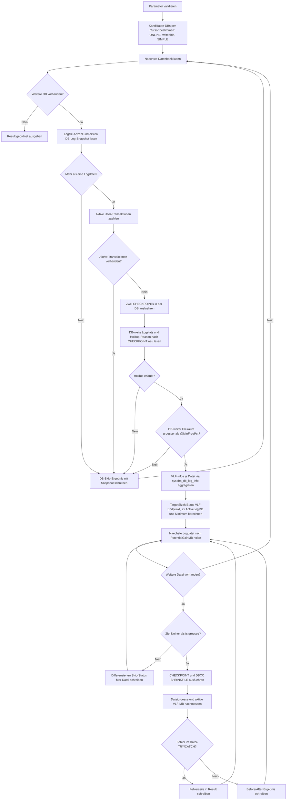

# ShrinkSimple_multiple_Files.sql

Dieses Skript automatisiert Log-Shrinks fuer SIMPLE-Recovery-Datenbanken mit mehr als einer Log-Datei. Gegenueber den frueheren Fassungen bewertet es nicht nur aktive Log-MB, sondern auch das Ende des letzten aktiven VLF pro Datei, protokolliert fruehe Skip-Pfade mit einem konsistenten DB-weiten Log-Snapshot und unterscheidet bei nicht shrinkbaren Dateien explizit zwischen VLF-Ende am Dateiende, zu hohem Mindest-Target und zu hohem aktivem Log-Anteil.

## Uebersicht

<!-- SQLDOC:SUMMARY_TABLE:BEGIN -->
| Feld | Wert |
|---|---|
| Script | [ShrinkSimple_multiple_Files.sql](ShrinkSimple_multiple_Files.sql) |
| Version | `1.3` |
| Typ | `admin-change` |
| Kapitel | `19_Transaktions` |
| Sicherheit | `admin-change` |
| Zweck | Automatisiert Log-Shrinks bei SIMPLE-DBs mit mehr als einer Log-Datei und nutzt dazu VLF-Endpunkte, Freiraum, Holdup-Reason und differenzierte Skip-Status als Guardrails. |
<!-- SQLDOC:SUMMARY_TABLE:END -->

## Einordnung

Log-Shrinks bleiben ein administrativer Eingriff fuer Ausnahmesituationen und keine Dauerstrategie fuer Log-Management. Diese Fassung versucht deshalb, unnoetige oder technisch aussichtslose Shrinks frueher auszusortieren: Sie prueft aktive Transaktionen, liest den aktuellen Truncation-Holdup je Datenbank und orientiert die Zielgroesse pro Datei am Ende des letzten aktiven VLF statt nur an der aufsummierten aktiven Log-Menge. Wenn eine Datei wegen eines aktiven Tail-VLF am Dateiende nicht shrinkbar ist, verweist der `ActionStatus` jetzt klar auf genau diesen Fall; fuer die vorbereitende Gegenmassnahme passt dann [MoveLastActiveVlfOffFileEnd.sql](MoveLastActiveVlfOffFileEnd.sql).

## Annahmen

- Das Skript wird gezielt auf einer bestehenden SQL-Server-Instanz mit ONLINE-, beschreibbaren User-Datenbanken ausgefuehrt.
- Verarbeitet werden nur Datenbanken im Recovery-Modell `SIMPLE`; fuer genau eine Log-Datei ist weiterhin `ShrinkSimple.sql` die passendere Variante.
- `sys.dm_db_log_stats` und `sys.dm_db_log_info` muessen verfuegbar sein; das setzt praktisch mindestens SQL Server 2016 SP2 / 2017 voraus.
- Ein Shrink wird nur dann als sinnvoller Kandidat betrachtet, wenn keine aktiven User-Transaktionen sichtbar sind, der Holdup-Reason nicht zu den harten Blockern gehoert und genug DB-weiter Freiraum vorhanden ist.

## Anwendungsfall

Das Skript eignet sich fuer Aufraeum- oder Review-Situationen nach temporaeren Lastspitzen, ETL-Fenstern oder untypischen Wartungsphasen, in denen SIMPLE-Datenbanken mit mehreren Log-Dateien deutlich zu gross geworden sind. Es ist bewusst konservativer als ein reiner Groessenvergleich und soll dabei helfen, Shrink-Aktionen zu begruenden statt bloss mechanisch fuer jede Datei auszufuehren.

## Parameter

<!-- SQLDOC:PARAMETERS_TABLE:BEGIN -->
| Parameter | SQL-Typ | Pflicht | Beschreibung |
|---|---|---|---|
| `@FilterDBName` | `SYSNAME` | Nein | `NULL` verarbeitet alle qualifizierten SIMPLE-Datenbanken; ein DB-Name beschraenkt den Lauf auf genau diese Datenbank. |
| `@MinFreePct` | `DECIMAL(5,2)` | Nein | Mindest-Freiraum in Prozent auf Datenbankebene; liegt der freie Anteil nicht darueber, wird die DB uebersprungen. |
| `@MinimumTargetSizeMB` | `INT` | Nein | Absolute Untergrenze fuer die Zielgroesse jeder Log-Datei in MB. |
<!-- SQLDOC:PARAMETERS_TABLE:END -->

## Abhaengigkeiten

<!-- SQLDOC:DEPENDENCIES_LIST:BEGIN -->
- `DBCC SHRINKFILE`
- `sys.databases`
- `sys.master_files`
- `sys.dm_db_log_stats`
- `sys.dm_db_log_info`
- `sys.dm_exec_sessions`
- `sys.dm_tran_session_transactions`
- `sys.dm_tran_active_transactions`
- `sys.dm_tran_database_transactions`
- `sys.sp_executesql`
<!-- SQLDOC:DEPENDENCIES_LIST:END -->

## Hinweise

- `DatabaseLogSizeMB_Before`, `DatabaseActiveLogMB_Before` und die Prozentwerte werden aus `sys.dm_db_log_stats` gelesen und sind damit DB-weit konsistent.
- Auch fruehe Skip-Pfade wie `nicht mehr als eine Logdatei` oder `aktive Transaktionen vorhanden` schreiben denselben DB-weiten Snapshot in das Resultset.
- `MinShrinkableSizeMB_Before` modelliert die kleinste realistische Zielgroesse pro Datei ueber das Ende des letzten aktiven VLF; dadurch werden unrealistische Targets in Mehrdatei-Logs vermieden.
- `TargetSizeMB` wird aus `max(MinShrinkableSizeMB_Before, 2 x ActiveLogMB_Before, @MinimumTargetSizeMB)` abgeleitet und `PotentialGainMB` nie negativ ausgewiesen.
- Wenn `ActionStatus = Uebersprungen: letztes aktives VLF liegt am Dateiende; Datei derzeit nicht shrinkbar`, ist nicht `CHECKPOINT` allein der Engpass, sondern der aktive Tail-Bereich der Datei. Dafuer ist [MoveLastActiveVlfOffFileEnd.sql](MoveLastActiveVlfOffFileEnd.sql) die passende vorbereitende Folgeaktion.
- Harte Blocker fuer einen Shrink sind in dieser Version unter anderem `ACTIVE_TRANSACTION`, `ACTIVE_BACKUP_OR_RESTORE`, `REPLICATION`, `CDC`, `DATABASE_MIRRORING`, `AVAILABILITY_REPLICA`, `OLDEST_PAGE`, `LOG_SCAN`, `LOG_BACKUP` und `XTP_CHECKPOINT`.
- Auch mit diesen Guardrails bleibt ein Shrink eine Ausnahmehandlung; anschliessend sollte die kuenftige Log-Wachstumsstrategie geprueft werden.

## Versionshistorie

<!-- SQLDOC:VERSION_HISTORY_TABLE:BEGIN -->
| Version | Datum | User | Beschreibung |
|---|---|---|---|
| `1.3` | `2026-04-21` | `ER` | Nicht-shrinkbare Dateien differenzierter als VLF-Ende-, Active-Log- oder Minimum-Target-Fall ausgewiesen |
| `1.2` | `2026-04-21` | `ER` | Fruehe Skip-Pfade um konsistente Log-Snapshots erweitert und Dokumentation wieder mit dem SQL synchronisiert |
| `1.1` | `2026-04-21` | `ER` | Target-Berechnung pro Datei auf aktiven VLF-Endpunkt erweitert, Holdup-Guardrails und Markdown-Dokumentation ergaenzt |
| `1.0` | `2026-04-21` | `ER` | Erstversion mit optionalem DB-Filter; alter Freitext-Header durch SQL-HEADER v1 ersetzt |
<!-- SQLDOC:VERSION_HISTORY_TABLE:END -->

## Ablauf

<!-- SQLDOC:MERMAID:BEGIN -->

<!-- SQLDOC:MERMAID:END -->

## SQL-Code

<!-- SQLDOC:SQL_CODE:BEGIN -->
```sql
/*
BEGIN:SQL-HEADER v1
---
sql_header: v1
script_name: "ShrinkSimple_multiple_Files.sql"
script_version: "1.3"
script_type: "admin-change"
chapter: "19_Transaktions"

purpose: >
  Shrink-Automatisierung fuer SIMPLE-Recovery-Datenbanken mit mehr als einer
  Log-Datei. Ohne DB-Angabe werden alle qualifizierten Datenbanken verarbeitet;
  mit DB-Angabe nur die angegebene. Je Log-Datei werden CHECKPOINTs ausgefuehrt,
  Zielgroessen aus aktivem VLF-Endpunkt und aktiver Log-Menge berechnet und
  DBCC SHRINKFILE nur dann aufgerufen, wenn Holdup-Reason und Freiraum dafuer
  sprechen. Das Ergebnis zeigt Before/After-Werte und Aktionsstatus je Datei.

parameters:
  - name: "@FilterDBName"
    sql_type: "SYSNAME"
    direction: "IN"
    required: false
    description: "NULL = alle qualifizierten SIMPLE-DBs verarbeiten; DB-Name = nur diese eine DB"
  - name: "@MinFreePct"
    sql_type: "DECIMAL(5,2)"
    direction: "IN"
    required: false
    description: "Mindest-Freiraum in % DB-weit; bei weniger Freiraum wird die DB uebersprungen"
  - name: "@MinimumTargetSizeMB"
    sql_type: "INT"
    direction: "IN"
    required: false
    description: "Absolute Untergrenze fuer die Zielgroesse jeder Log-Datei in MB"

result_sets:
  - name: "ShrinkResult"
    description: "Alle verarbeiteten Datenbanken und Log-Dateien mit Before/After-Werten, Holdup-Reason und Aktionsstatus"

dependencies:
  - "DBCC SHRINKFILE"
  - "sys.databases"
  - "sys.master_files"
  - "sys.dm_db_log_stats"
  - "sys.dm_db_log_info"
  - "sys.dm_exec_sessions"
  - "sys.dm_tran_session_transactions"
  - "sys.dm_tran_active_transactions"
  - "sys.dm_tran_database_transactions"
  - "sys.sp_executesql"

safety:
  level: "admin-change"
  writes_data: true

documentation:
  markdown_file: "T-SQL/19_Transaktions/SQLScripts/ShrinkSimple_multiple_Files.md"
  sync_blocks:
    - "SUMMARY_TABLE"
    - "PARAMETERS_TABLE"
    - "DEPENDENCIES_LIST"
    - "VERSION_HISTORY_TABLE"
    - "SQL_CODE"
  mermaid:
    mode: "ai-agent-from-sql"
    source: "script-body"

main_responsible:
  name: "Erhard Rainer"
  initials: "ER"

version_history:
  - version: "1.3"
    date: "2026-04-21"
    user: "ER"
    description: "Nicht-shrinkbare Dateien differenzierter als VLF-Ende-, Active-Log- oder Minimum-Target-Fall ausgewiesen"
  - version: "1.2"
    date: "2026-04-21"
    user: "ER"
    description: "Fruehe Skip-Pfade um konsistente Log-Snapshots erweitert und Dokumentation wieder mit dem SQL synchronisiert"
  - version: "1.1"
    date: "2026-04-21"
    user: "ER"
    description: "Target-Berechnung pro Datei auf aktiven VLF-Endpunkt erweitert, Holdup-Guardrails und Markdown-Dokumentation ergaenzt"
  - version: "1.0"
    date: "2026-04-21"
    user: "ER"
    description: "Erstversion mit optionalem DB-Filter; alter Freitext-Header durch SQL-HEADER v1 ersetzt"

notes:
  - "Datenbanken mit aktiven Transaktionen oder blockierendem log_truncation_holdup_reason werden uebersprungen"
  - "Zielgroesse pro Datei basiert auf max(Ende des letzten aktiven VLF, 2x aktive Log-MB, @MinimumTargetSizeMB)"
  - "Wenn eine Datei nicht shrinkbar ist, unterscheidet der ActionStatus zwischen VLF-Ende am Dateiende, zu hohem Minimum-Target und zu hohem aktivem Log-Anteil"
  - "sys.dm_db_log_stats erfordert mindestens SQL Server 2016 SP2 / 2017"
  - "Fuer Datenbanken mit genau einer Log-Datei stattdessen ShrinkSimple.sql verwenden"
  - "Shrinks koennen VLF-Fragmentierung verursachen; anschliessend Log-Wachstum mit sinnvoller Schrittgroesse pruefen"
---
END:SQL-HEADER v1
*/

SET NOCOUNT ON;

-- 1. Parameter und Guardrails
DECLARE @FilterDBName         SYSNAME      = NULL;   -- NULL = alle DBs, sonst DB-Name
DECLARE @MinFreePct           DECIMAL(5,2) = 60.00;  -- nur shrinken, wenn insgesamt mehr als X % Log frei sind
DECLARE @MinimumTargetSizeMB  INT          = 256;    -- keine Logdatei kleiner als dieser Wert

IF @MinFreePct < 0 OR @MinFreePct >= 100
BEGIN
    THROW 50000, '@MinFreePct muss zwischen 0 und kleiner 100 liegen.', 1;
END;

IF @MinimumTargetSizeMB < 1
BEGIN
    THROW 50001, '@MinimumTargetSizeMB muss mindestens 1 sein.', 1;
END;

IF @FilterDBName IS NOT NULL
   AND DB_ID(@FilterDBName) IS NULL
BEGIN
    THROW 50002, '@FilterDBName wurde nicht gefunden.', 1;
END;

DECLARE @DBName                     SYSNAME;
DECLARE @LogFileCount               INT;
DECLARE @LogReuseWaitDesc           NVARCHAR(120);
DECLARE @LogTruncationHoldupReason  NVARCHAR(120);
DECLARE @EffectiveHoldupReason      NVARCHAR(120);
DECLARE @ActiveTransactionCount     INT;

DECLARE @DatabaseLogSizeMB          DECIMAL(18,2);
DECLARE @DatabaseActiveLogMB        DECIMAL(18,2);
DECLARE @DatabaseLogUsedPct         DECIMAL(18,2);
DECLARE @DatabaseLogFreePct         DECIMAL(18,2);

DECLARE @FileId                     INT;
DECLARE @LogLogicalName             SYSNAME;
DECLARE @PhysicalName               NVARCHAR(260);

DECLARE @LogSizeMB                  DECIMAL(18,2);
DECLARE @ActiveLogMB                DECIMAL(18,2);
DECLARE @ActiveLogPct               DECIMAL(18,2);
DECLARE @FileFreePct                DECIMAL(18,2);
DECLARE @MinShrinkableSizeMB        DECIMAL(18,2);

DECLARE @TargetSizeMB               INT;
DECLARE @PotentialGainMB            DECIMAL(18,2);

DECLARE @AfterLogSizeMB             DECIMAL(18,2);
DECLARE @AfterActiveLogMB           DECIMAL(18,2);
DECLARE @AfterActiveLogPct          DECIMAL(18,2);
DECLARE @AfterFileFreePct           DECIMAL(18,2);

DECLARE @ActionStatus               NVARCHAR(200);
DECLARE @sql                        NVARCHAR(MAX);
DECLARE @ErrorMessage               NVARCHAR(4000);

DECLARE @LogFiles TABLE
(
    FileId                     INT PRIMARY KEY,
    LogLogicalName             SYSNAME,
    PhysicalName               NVARCHAR(260),
    LogSizeMB_Before           DECIMAL(18,2),
    ActiveLogMB_Before         DECIMAL(18,2),
    ActiveLogPct_Before        DECIMAL(18,2),
    FileFreePct_Before         DECIMAL(18,2),
    MinShrinkableSizeMB_Before DECIMAL(18,2),
    TargetSizeMB               INT NULL,
    PotentialGainMB            DECIMAL(18,2) NULL
);

DECLARE @Result TABLE
(
    DatabaseName                 SYSNAME,
    RecoveryModel                NVARCHAR(60),
    LogReuseWaitDesc             NVARCHAR(120),
    LogTruncationHoldupReason    NVARCHAR(120),
    ActiveTransactionCount       INT,
    LogFileCount                 INT,
    FileId                       INT NULL,
    LogLogicalName               SYSNAME NULL,
    PhysicalName                 NVARCHAR(260) NULL,
    DatabaseLogSizeMB_Before     DECIMAL(18,2) NULL,
    DatabaseActiveLogMB_Before   DECIMAL(18,2) NULL,
    DatabaseLogUsedPct_Before    DECIMAL(18,2) NULL,
    DatabaseLogFreePct_Before    DECIMAL(18,2) NULL,
    LogSizeMB_Before             DECIMAL(18,2) NULL,
    ActiveLogMB_Before           DECIMAL(18,2) NULL,
    ActiveLogPct_Before          DECIMAL(18,2) NULL,
    FileFreePct_Before           DECIMAL(18,2) NULL,
    MinShrinkableSizeMB_Before   DECIMAL(18,2) NULL,
    TargetSizeMB                 INT NULL,
    PotentialGainMB              DECIMAL(18,2) NULL,
    LogSizeMB_After              DECIMAL(18,2) NULL,
    ActiveLogMB_After            DECIMAL(18,2) NULL,
    ActiveLogPct_After           DECIMAL(18,2) NULL,
    FileFreePct_After            DECIMAL(18,2) NULL,
    ActionStatus                 NVARCHAR(200),
    ErrorMessage                 NVARCHAR(4000) NULL
);

-- 2. Kandidaten-DBs waehlen
DECLARE curDB CURSOR LOCAL FAST_FORWARD FOR
SELECT d.name
FROM sys.databases AS d
WHERE d.database_id > 4
  AND d.name <> N'tempdb'
  AND d.state_desc = N'ONLINE'
  AND d.is_read_only = 0
  AND d.recovery_model_desc = N'SIMPLE'
  AND (@FilterDBName IS NULL OR d.name = @FilterDBName)
  AND
  (
      @FilterDBName IS NOT NULL
      OR
      (
          SELECT COUNT(*)
          FROM sys.master_files AS mf2
          WHERE mf2.database_id = d.database_id
            AND mf2.type = 1
      ) > 1
  )
ORDER BY d.name;

OPEN curDB;
FETCH NEXT FROM curDB INTO @DBName;

WHILE @@FETCH_STATUS = 0
BEGIN
    BEGIN TRY
        SET @LogFileCount               = NULL;
        SET @LogReuseWaitDesc           = NULL;
        SET @LogTruncationHoldupReason  = NULL;
        SET @EffectiveHoldupReason      = NULL;
        SET @ActiveTransactionCount     = 0;
        SET @DatabaseLogSizeMB          = NULL;
        SET @DatabaseActiveLogMB        = NULL;
        SET @DatabaseLogUsedPct         = NULL;
        SET @DatabaseLogFreePct         = NULL;
        SET @ErrorMessage               = NULL;

        SELECT
            @LogFileCount = COUNT(*)
        FROM sys.master_files AS mf
        WHERE mf.database_id = DB_ID(@DBName)
          AND mf.type = 1;

        SELECT
            @LogReuseWaitDesc =
                COALESCE(NULLIF(d.log_reuse_wait_desc, N''), N'UNKNOWN'),
            @LogTruncationHoldupReason =
                COALESCE(NULLIF(ls.log_truncation_holdup_reason, N''), N'UNKNOWN'),
            @DatabaseLogSizeMB =
                CAST(ls.total_log_size_mb AS DECIMAL(18,2)),
            @DatabaseActiveLogMB =
                CAST(ls.active_log_size_mb AS DECIMAL(18,2)),
            @DatabaseLogUsedPct =
                CAST
                (
                    CASE
                        WHEN ls.total_log_size_mb > 0
                            THEN (ls.active_log_size_mb * 100.0) / ls.total_log_size_mb
                        ELSE 0
                    END
                    AS DECIMAL(18,2)
                ),
            @DatabaseLogFreePct =
                CAST
                (
                    100.0 -
                    CASE
                        WHEN ls.total_log_size_mb > 0
                            THEN (ls.active_log_size_mb * 100.0) / ls.total_log_size_mb
                        ELSE 0
                    END
                    AS DECIMAL(18,2)
                )
        FROM sys.databases AS d
        CROSS APPLY sys.dm_db_log_stats(d.database_id) AS ls
        WHERE d.name = @DBName;

        IF @LogFileCount <= 1
        BEGIN
            INSERT INTO @Result
            (
                DatabaseName, RecoveryModel, LogReuseWaitDesc, LogTruncationHoldupReason,
                ActiveTransactionCount, LogFileCount,
                DatabaseLogSizeMB_Before, DatabaseActiveLogMB_Before,
                DatabaseLogUsedPct_Before, DatabaseLogFreePct_Before,
                ActionStatus
            )
            VALUES
            (
                @DBName, N'SIMPLE', @LogReuseWaitDesc, @LogTruncationHoldupReason,
                @ActiveTransactionCount, @LogFileCount,
                @DatabaseLogSizeMB, @DatabaseActiveLogMB,
                @DatabaseLogUsedPct, @DatabaseLogFreePct,
                N'Uebersprungen: nicht mehr als eine Logdatei'
            );

            FETCH NEXT FROM curDB INTO @DBName;
            CONTINUE;
        END;

        SELECT
            @ActiveTransactionCount = COUNT(DISTINCT at.transaction_id)
        FROM sys.dm_exec_sessions AS s
        INNER JOIN sys.dm_tran_session_transactions AS st
            ON st.session_id = s.session_id
        INNER JOIN sys.dm_tran_active_transactions AS at
            ON at.transaction_id = st.transaction_id
        INNER JOIN sys.dm_tran_database_transactions AS dt
            ON dt.transaction_id = at.transaction_id
        WHERE s.is_user_process = 1
          AND s.session_id <> @@SPID
          AND dt.database_id = DB_ID(@DBName)
          AND at.transaction_state NOT IN (3, 6, 8);

        IF ISNULL(@ActiveTransactionCount, 0) > 0
        BEGIN
            INSERT INTO @Result
            (
                DatabaseName, RecoveryModel, LogReuseWaitDesc, LogTruncationHoldupReason,
                ActiveTransactionCount, LogFileCount,
                DatabaseLogSizeMB_Before, DatabaseActiveLogMB_Before,
                DatabaseLogUsedPct_Before, DatabaseLogFreePct_Before,
                ActionStatus
            )
            VALUES
            (
                @DBName, N'SIMPLE', @LogReuseWaitDesc, @LogTruncationHoldupReason,
                @ActiveTransactionCount, @LogFileCount,
                @DatabaseLogSizeMB, @DatabaseActiveLogMB,
                @DatabaseLogUsedPct, @DatabaseLogFreePct,
                N'Uebersprungen: aktive Transaktionen vorhanden'
            );

            FETCH NEXT FROM curDB INTO @DBName;
            CONTINUE;
        END;

        SET @sql = N'USE ' + QUOTENAME(@DBName) + N'; CHECKPOINT; CHECKPOINT;';
        EXEC sys.sp_executesql @sql;

        SELECT
            @LogReuseWaitDesc =
                COALESCE(NULLIF(d.log_reuse_wait_desc, N''), N'UNKNOWN'),
            @LogTruncationHoldupReason =
                COALESCE(NULLIF(ls.log_truncation_holdup_reason, N''), N'UNKNOWN'),
            @DatabaseLogSizeMB =
                CAST(ls.total_log_size_mb AS DECIMAL(18,2)),
            @DatabaseActiveLogMB =
                CAST(ls.active_log_size_mb AS DECIMAL(18,2)),
            @DatabaseLogUsedPct =
                CAST
                (
                    CASE
                        WHEN ls.total_log_size_mb > 0
                            THEN (ls.active_log_size_mb * 100.0) / ls.total_log_size_mb
                        ELSE 0
                    END
                    AS DECIMAL(18,2)
                ),
            @DatabaseLogFreePct =
                CAST
                (
                    100.0 -
                    CASE
                        WHEN ls.total_log_size_mb > 0
                            THEN (ls.active_log_size_mb * 100.0) / ls.total_log_size_mb
                        ELSE 0
                    END
                    AS DECIMAL(18,2)
                )
        FROM sys.databases AS d
        CROSS APPLY sys.dm_db_log_stats(d.database_id) AS ls
        WHERE d.name = @DBName;

        SET @EffectiveHoldupReason =
            COALESCE
            (
                NULLIF(@LogTruncationHoldupReason, N'UNKNOWN'),
                NULLIF(@LogReuseWaitDesc, N'UNKNOWN'),
                N'UNKNOWN'
            );

        IF @EffectiveHoldupReason IN
           (
               N'ACTIVE_TRANSACTION',
               N'ACTIVE_BACKUP_OR_RESTORE',
               N'REPLICATION',
               N'CDC',
               N'DATABASE_MIRRORING',
               N'AVAILABILITY_REPLICA',
               N'OLDEST_PAGE',
               N'LOG_SCAN',
               N'LOG_BACKUP',
               N'XTP_CHECKPOINT'
           )
        BEGIN
            INSERT INTO @Result
            (
                DatabaseName, RecoveryModel, LogReuseWaitDesc, LogTruncationHoldupReason,
                ActiveTransactionCount, LogFileCount,
                DatabaseLogSizeMB_Before, DatabaseActiveLogMB_Before,
                DatabaseLogUsedPct_Before, DatabaseLogFreePct_Before,
                ActionStatus
            )
            VALUES
            (
                @DBName, N'SIMPLE', @LogReuseWaitDesc, @LogTruncationHoldupReason,
                @ActiveTransactionCount, @LogFileCount,
                @DatabaseLogSizeMB, @DatabaseActiveLogMB,
                @DatabaseLogUsedPct, @DatabaseLogFreePct,
                N'Uebersprungen: Truncation-Holdup ' + @EffectiveHoldupReason
            );

            FETCH NEXT FROM curDB INTO @DBName;
            CONTINUE;
        END;

        IF @DatabaseLogFreePct <= @MinFreePct
        BEGIN
            INSERT INTO @Result
            (
                DatabaseName, RecoveryModel, LogReuseWaitDesc, LogTruncationHoldupReason,
                ActiveTransactionCount, LogFileCount,
                DatabaseLogSizeMB_Before, DatabaseActiveLogMB_Before,
                DatabaseLogUsedPct_Before, DatabaseLogFreePct_Before,
                ActionStatus
            )
            VALUES
            (
                @DBName, N'SIMPLE', @LogReuseWaitDesc, @LogTruncationHoldupReason,
                @ActiveTransactionCount, @LogFileCount,
                @DatabaseLogSizeMB, @DatabaseActiveLogMB,
                @DatabaseLogUsedPct, @DatabaseLogFreePct,
                N'Uebersprungen: Freiraum nicht groesser als @MinFreePct'
            );

            FETCH NEXT FROM curDB INTO @DBName;
            CONTINUE;
        END;

        DELETE FROM @LogFiles;

        ;WITH FileLogInfo AS
        (
            SELECT
                li.file_id,
                ActiveLogMB_Before =
                    CAST
                    (
                        ISNULL(SUM(CASE WHEN li.vlf_active = 1 THEN li.vlf_size_mb ELSE 0 END), 0.0)
                        AS DECIMAL(18,2)
                    ),
                MinShrinkableSizeMB_Before =
                    CAST
                    (
                        ISNULL
                        (
                            MAX
                            (
                                CASE
                                    WHEN li.vlf_active = 1
                                        THEN (CAST(li.vlf_begin_offset AS DECIMAL(20,2)) / 1048576.0) + li.vlf_size_mb
                                END
                            ),
                            0.0
                        )
                        AS DECIMAL(18,2)
                    )
            FROM sys.dm_db_log_info(DB_ID(@DBName)) AS li
            GROUP BY
                li.file_id
        )
        INSERT INTO @LogFiles
        (
            FileId,
            LogLogicalName,
            PhysicalName,
            LogSizeMB_Before,
            ActiveLogMB_Before,
            ActiveLogPct_Before,
            FileFreePct_Before,
            MinShrinkableSizeMB_Before
        )
        SELECT
            mf.file_id,
            mf.name,
            mf.physical_name,
            CAST(mf.size / 128.0 AS DECIMAL(18,2)) AS LogSizeMB_Before,
            ISNULL(fli.ActiveLogMB_Before, 0.0) AS ActiveLogMB_Before,
            CAST
            (
                CASE
                    WHEN mf.size > 0
                        THEN ISNULL(fli.ActiveLogMB_Before, 0.0) * 100.0 / (mf.size / 128.0)
                    ELSE 0
                END
                AS DECIMAL(18,2)
            ) AS ActiveLogPct_Before,
            CAST
            (
                100.0 -
                CASE
                    WHEN mf.size > 0
                        THEN ISNULL(fli.ActiveLogMB_Before, 0.0) * 100.0 / (mf.size / 128.0)
                    ELSE 0
                END
                AS DECIMAL(18,2)
            ) AS FileFreePct_Before,
            ISNULL(fli.MinShrinkableSizeMB_Before, 0.0) AS MinShrinkableSizeMB_Before
        FROM sys.master_files AS mf
        LEFT JOIN FileLogInfo AS fli
            ON fli.file_id = mf.file_id
        WHERE mf.database_id = DB_ID(@DBName)
          AND mf.type = 1;

        ;WITH FileBaseTarget AS
        (
            SELECT
                lf.FileId,
                BaseMB =
                    CASE
                        WHEN lf.MinShrinkableSizeMB_Before > (lf.ActiveLogMB_Before * 2.0)
                            THEN lf.MinShrinkableSizeMB_Before
                        ELSE lf.ActiveLogMB_Before * 2.0
                    END
            FROM @LogFiles AS lf
        ),
        FileTargets AS
        (
            SELECT
                fb.FileId,
                EffectiveTargetMB =
                    CASE
                        WHEN CEILING(fb.BaseMB) > @MinimumTargetSizeMB
                            THEN CAST(CEILING(fb.BaseMB) AS INT)
                        ELSE @MinimumTargetSizeMB
                    END
            FROM FileBaseTarget AS fb
        )
        UPDATE lf
        SET
            TargetSizeMB = ft.EffectiveTargetMB,
            PotentialGainMB =
                CAST
                (
                    CASE
                        WHEN lf.LogSizeMB_Before > ft.EffectiveTargetMB
                            THEN lf.LogSizeMB_Before - ft.EffectiveTargetMB
                        ELSE 0
                    END
                    AS DECIMAL(18,2)
                )
        FROM @LogFiles AS lf
        INNER JOIN FileTargets AS ft
            ON ft.FileId = lf.FileId;

        WHILE EXISTS (SELECT 1 FROM @LogFiles)
        BEGIN
            SELECT TOP (1)
                @FileId              = lf.FileId,
                @LogLogicalName      = lf.LogLogicalName,
                @PhysicalName        = lf.PhysicalName,
                @LogSizeMB           = lf.LogSizeMB_Before,
                @ActiveLogMB         = lf.ActiveLogMB_Before,
                @ActiveLogPct        = lf.ActiveLogPct_Before,
                @FileFreePct         = lf.FileFreePct_Before,
                @MinShrinkableSizeMB = lf.MinShrinkableSizeMB_Before,
                @TargetSizeMB        = lf.TargetSizeMB,
                @PotentialGainMB     = lf.PotentialGainMB
            FROM @LogFiles AS lf
            ORDER BY
                lf.PotentialGainMB DESC,
                lf.FileId;

            DELETE FROM @LogFiles
            WHERE FileId = @FileId;

            BEGIN TRY
                SET @AfterLogSizeMB    = NULL;
                SET @AfterActiveLogMB  = NULL;
                SET @AfterActiveLogPct = NULL;
                SET @AfterFileFreePct  = NULL;
                SET @ActionStatus      = NULL;
                SET @ErrorMessage      = NULL;

                IF @TargetSizeMB >= CEILING(@LogSizeMB)
                BEGIN
                    SET @ActionStatus =
                        CASE
                            WHEN CEILING(@MinShrinkableSizeMB) >= CEILING(@LogSizeMB)
                                THEN N'Uebersprungen: letztes aktives VLF liegt am Dateiende; Datei derzeit nicht shrinkbar'
                            WHEN @MinimumTargetSizeMB >= CEILING(@LogSizeMB)
                                THEN N'Uebersprungen: @MinimumTargetSizeMB nicht kleiner als Istgroesse'
                            WHEN CEILING(@ActiveLogMB * 2.0) >= CEILING(@LogSizeMB)
                                THEN N'Uebersprungen: aktives Log fuellt die Datei im Zielmodell bereits aus'
                            ELSE N'Uebersprungen: Zielgroesse nicht kleiner als Istgroesse'
                        END;

                    INSERT INTO @Result
                    (
                        DatabaseName, RecoveryModel, LogReuseWaitDesc, LogTruncationHoldupReason,
                        ActiveTransactionCount, LogFileCount,
                        FileId, LogLogicalName, PhysicalName,
                        DatabaseLogSizeMB_Before, DatabaseActiveLogMB_Before,
                        DatabaseLogUsedPct_Before, DatabaseLogFreePct_Before,
                        LogSizeMB_Before, ActiveLogMB_Before, ActiveLogPct_Before, FileFreePct_Before,
                        MinShrinkableSizeMB_Before,
                        TargetSizeMB, PotentialGainMB, ActionStatus
                    )
                    VALUES
                    (
                        @DBName, N'SIMPLE', @LogReuseWaitDesc, @LogTruncationHoldupReason,
                        @ActiveTransactionCount, @LogFileCount,
                        @FileId, @LogLogicalName, @PhysicalName,
                        @DatabaseLogSizeMB, @DatabaseActiveLogMB,
                        @DatabaseLogUsedPct, @DatabaseLogFreePct,
                        @LogSizeMB, @ActiveLogMB, @ActiveLogPct, @FileFreePct,
                        @MinShrinkableSizeMB,
                        @TargetSizeMB, @PotentialGainMB,
                        @ActionStatus
                    );

                    CONTINUE;
                END;

                SET @sql =
                    N'USE ' + QUOTENAME(@DBName) + N';
                      CHECKPOINT;
                      DBCC SHRINKFILE (' + CAST(@FileId AS NVARCHAR(20)) + N', ' + CAST(@TargetSizeMB AS NVARCHAR(20)) + N') WITH NO_INFOMSGS;';

                EXEC sys.sp_executesql @sql;

                SELECT
                    @AfterLogSizeMB = CAST(mf.size / 128.0 AS DECIMAL(18,2))
                FROM sys.master_files AS mf
                WHERE mf.database_id = DB_ID(@DBName)
                  AND mf.file_id = @FileId
                  AND mf.type = 1;

                SELECT
                    @AfterActiveLogMB =
                        CAST(ISNULL(SUM(CASE WHEN li.vlf_active = 1 THEN li.vlf_size_mb ELSE 0 END), 0.0) AS DECIMAL(18,2))
                FROM sys.dm_db_log_info(DB_ID(@DBName)) AS li
                WHERE li.file_id = @FileId;

                SET @AfterActiveLogPct =
                    CAST
                    (
                        CASE
                            WHEN @AfterLogSizeMB > 0
                                THEN @AfterActiveLogMB * 100.0 / @AfterLogSizeMB
                            ELSE 0
                        END
                        AS DECIMAL(18,2)
                    );

                SET @AfterFileFreePct =
                    CAST(100.0 - @AfterActiveLogPct AS DECIMAL(18,2));

                SET @ActionStatus =
                    CASE
                        WHEN @AfterLogSizeMB < @LogSizeMB THEN N'Geschrumpft'
                        ELSE N'Shrink ausgefuehrt, aber keine Groessenaenderung'
                    END;

                INSERT INTO @Result
                (
                    DatabaseName, RecoveryModel, LogReuseWaitDesc, LogTruncationHoldupReason,
                    ActiveTransactionCount, LogFileCount,
                    FileId, LogLogicalName, PhysicalName,
                    DatabaseLogSizeMB_Before, DatabaseActiveLogMB_Before,
                    DatabaseLogUsedPct_Before, DatabaseLogFreePct_Before,
                    LogSizeMB_Before, ActiveLogMB_Before, ActiveLogPct_Before, FileFreePct_Before,
                    MinShrinkableSizeMB_Before,
                    TargetSizeMB, PotentialGainMB,
                    LogSizeMB_After, ActiveLogMB_After, ActiveLogPct_After, FileFreePct_After,
                    ActionStatus
                )
                VALUES
                (
                    @DBName, N'SIMPLE', @LogReuseWaitDesc, @LogTruncationHoldupReason,
                    @ActiveTransactionCount, @LogFileCount,
                    @FileId, @LogLogicalName, @PhysicalName,
                    @DatabaseLogSizeMB, @DatabaseActiveLogMB,
                    @DatabaseLogUsedPct, @DatabaseLogFreePct,
                    @LogSizeMB, @ActiveLogMB, @ActiveLogPct, @FileFreePct,
                    @MinShrinkableSizeMB,
                    @TargetSizeMB, @PotentialGainMB,
                    @AfterLogSizeMB, @AfterActiveLogMB, @AfterActiveLogPct, @AfterFileFreePct,
                    @ActionStatus
                );
            END TRY
            BEGIN CATCH
                SET @ErrorMessage = ERROR_MESSAGE();

                INSERT INTO @Result
                (
                    DatabaseName, RecoveryModel, LogReuseWaitDesc, LogTruncationHoldupReason,
                    ActiveTransactionCount, LogFileCount,
                    FileId, LogLogicalName, PhysicalName,
                    DatabaseLogSizeMB_Before, DatabaseActiveLogMB_Before,
                    DatabaseLogUsedPct_Before, DatabaseLogFreePct_Before,
                    LogSizeMB_Before, ActiveLogMB_Before, ActiveLogPct_Before, FileFreePct_Before,
                    MinShrinkableSizeMB_Before,
                    TargetSizeMB, PotentialGainMB, ActionStatus, ErrorMessage
                )
                VALUES
                (
                    @DBName, N'SIMPLE', @LogReuseWaitDesc, @LogTruncationHoldupReason,
                    @ActiveTransactionCount, @LogFileCount,
                    @FileId, @LogLogicalName, @PhysicalName,
                    @DatabaseLogSizeMB, @DatabaseActiveLogMB,
                    @DatabaseLogUsedPct, @DatabaseLogFreePct,
                    @LogSizeMB, @ActiveLogMB, @ActiveLogPct, @FileFreePct,
                    @MinShrinkableSizeMB,
                    @TargetSizeMB, @PotentialGainMB, N'Fehler', @ErrorMessage
                );
            END CATCH;
        END;
    END TRY
    BEGIN CATCH
        SET @ErrorMessage = ERROR_MESSAGE();

        INSERT INTO @Result
        (
            DatabaseName, RecoveryModel, LogReuseWaitDesc, LogTruncationHoldupReason,
            ActiveTransactionCount, LogFileCount,
            DatabaseLogSizeMB_Before, DatabaseActiveLogMB_Before,
            DatabaseLogUsedPct_Before, DatabaseLogFreePct_Before,
            ActionStatus, ErrorMessage
        )
        VALUES
        (
            @DBName, N'SIMPLE', @LogReuseWaitDesc, @LogTruncationHoldupReason,
            @ActiveTransactionCount, @LogFileCount,
            @DatabaseLogSizeMB, @DatabaseActiveLogMB,
            @DatabaseLogUsedPct, @DatabaseLogFreePct,
            N'Fehler', @ErrorMessage
        );
    END CATCH;

    FETCH NEXT FROM curDB INTO @DBName;
END;

CLOSE curDB;
DEALLOCATE curDB;

-- 3. Ergebnis ausgeben
SELECT
    DatabaseName,
    RecoveryModel,
    LogReuseWaitDesc,
    LogTruncationHoldupReason,
    ActiveTransactionCount,
    LogFileCount,
    FileId,
    LogLogicalName,
    PhysicalName,
    DatabaseLogSizeMB_Before,
    DatabaseActiveLogMB_Before,
    DatabaseLogUsedPct_Before,
    DatabaseLogFreePct_Before,
    LogSizeMB_Before,
    ActiveLogMB_Before,
    ActiveLogPct_Before,
    FileFreePct_Before,
    MinShrinkableSizeMB_Before,
    TargetSizeMB,
    PotentialGainMB,
    LogSizeMB_After,
    ActiveLogMB_After,
    ActiveLogPct_After,
    FileFreePct_After,
    ActionStatus,
    ErrorMessage
FROM @Result
ORDER BY
    CASE
        WHEN ActionStatus = N'Geschrumpft' THEN 0
        WHEN ActionStatus = N'Shrink ausgefuehrt, aber keine Groessenaenderung' THEN 1
        WHEN ActionStatus LIKE N'Uebersprungen:%' THEN 2
        ELSE 3
    END,
    PotentialGainMB DESC,
    DatabaseName,
    FileId;

```
<!-- SQLDOC:SQL_CODE:END -->
