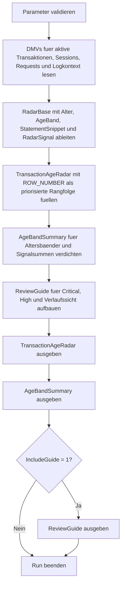

# TransactionAgeRadar.sql

Dieses Skript baut ein kompaktes Radar fuer aktuell laufende Transaktionen auf. Statt sofort mit langen Detailtabellen zu starten, priorisiert es die sichtbaren Faelle nach Alter, Blocking-Kontext, Logverbrauch und Session-Zustand, damit ein operatives Review mit einer belastbaren Rangfolge beginnen kann.

## Uebersicht

<!-- SQLDOC:SUMMARY_TABLE:BEGIN -->
| Feld | Wert |
|---|---|
| Script | [TransactionAgeRadar.sql](TransactionAgeRadar.sql) |
| Version | `1.0` |
| Typ | `diagnostic-query` |
| Kapitel | `19_Transaktions` |
| Sicherheit | `read-only` |
| Zweck | Baut ein Radar fuer aktuell laufende Transaktionen und priorisiert sie nach Alter, Logdruck und moeglicher Stoerwirkung. |
<!-- SQLDOC:SUMMARY_TABLE:END -->

## Einordnung

Im Unterschied zu rein datenbank- oder sessionorientierten Sichten stellt das Radar die Frage: Welche laufenden Transaktionen verdienen jetzt zuerst Aufmerksamkeit? Dazu werden DMV-Daten in eine klare Rangfolge uebersetzt. Das erste Resultset ist fuer den schnellen Einstieg gedacht, das zweite fasst die Befunde in Altersbaendern zusammen, und der Guide liefert die naechsten sinnvollen Drilldown-Schritte.

## Annahmen

- Das Skript arbeitet read-only auf Basis aktueller DMVs und Katalogsichten.
- Die Radar-Signale `observe`, `medium`, `high` und `critical` sind didaktische Priorisierungshilfen und keine verbindlichen Produktionsschwellen.
- `StatementSnippet` ist nur dann sichtbar, wenn eine aktuelle Request-Zuordnung und die erforderlichen Leserechte vorhanden sind.
- Standardmaessig werden nur Benutzer-Sessions betrachtet, damit das Radar im Alltagsbetrieb auf typische Anwendungsfaelle fokussiert bleibt.

## Anwendungsfall

Das Skript eignet sich fuer Incident-Reviews, Health-Checks und Unterricht, wenn lange offene oder druckvolle Transaktionen zuerst in eine belastbare Reihenfolge gebracht werden sollen. Besonders nuetzlich ist es als Startpunkt vor dem Wechsel in tiefere Analysen wie `OpenTransactionsBySession.sql`, Blocking-Ketten oder Datenbank-spezifische Logauswertungen.

## Parameter

<!-- SQLDOC:PARAMETERS_TABLE:BEGIN -->
| Parameter | SQL-Typ | Pflicht | Beschreibung |
|---|---|---|---|
| `@MinimumAgeMinutes` | `INT` | Nein | Beruecksichtigt nur Transaktionen ab dieser Mindestdauer in Minuten. |
| `@OnlyUserSessions` | `BIT` | Nein | `1` zeigt nur Benutzer-Sessions, `0` bezieht auch System- oder Hintergrundkontext ein. |
| `@IncludeGuide` | `BIT` | Nein | Gibt bei `1` zusaetzlich einen kompakten Leitfaden fuer die Radar-Interpretation aus. |
<!-- SQLDOC:PARAMETERS_TABLE:END -->

## Abhaengigkeiten

<!-- SQLDOC:DEPENDENCIES_LIST:BEGIN -->
- `sys.dm_tran_active_transactions`
- `sys.dm_tran_session_transactions`
- `sys.dm_tran_database_transactions`
- `sys.dm_exec_sessions`
- `sys.dm_exec_requests`
- `sys.dm_exec_connections`
- `sys.dm_exec_sql_text`
- `sys.databases`
- `SYSUTCDATETIME`
- `DATEDIFF`
- `CASE`
- `COUNT`
- `SUM`
- `ORDER BY`
- `tempdb temporary tables`
<!-- SQLDOC:DEPENDENCIES_LIST:END -->

## Hinweise

- `TransactionAgeRadar` ordnet einzelne laufende Transaktionen nach Radar-Signal, Alter und Logverbrauch.
- `AgeBandSummary` zeigt, ob das Problem eher aus wenigen sehr alten Faellen oder aus einer groesseren Anzahl mittlerer Faelle besteht.
- Der Guide hilft dabei, die Rangfolge in konkrete Review- und Drilldown-Schritte zu uebersetzen.

## Versionshistorie

<!-- SQLDOC:VERSION_HISTORY_TABLE:BEGIN -->
| Version | Datum | User | Beschreibung |
|---|---|---|---|
| `1.0` | `2026-04-22` | `ER` | Erstversion des Diagnose-Skripts fuer ein Altersradar laufender Transaktionen |
<!-- SQLDOC:VERSION_HISTORY_TABLE:END -->

## Ablauf

<!-- SQLDOC:MERMAID:BEGIN -->

<!-- SQLDOC:MERMAID:END -->

## SQL-Code

<!-- SQLDOC:SQL_CODE:BEGIN -->
```sql
/*
BEGIN:SQL-HEADER v1
---
sql_header: v1
script_name: "TransactionAgeRadar.sql"
script_version: "1.0"
script_type: "diagnostic-query"
chapter: "19_Transaktions"

purpose: >
  Baut ein Radar fuer aktuell laufende Transaktionen auf und priorisiert
  sie nach Alter, Session-Kontext, Logdruck und moeglicher Blockierung,
  damit das operative Review mit einer kompakten Rangfolge starten kann.

parameters:
  - name: "@MinimumAgeMinutes"
    sql_type: "INT"
    direction: "IN"
    required: false
    description: "Beruecksichtigt nur Transaktionen ab dieser Mindestdauer in Minuten"
  - name: "@OnlyUserSessions"
    sql_type: "BIT"
    direction: "IN"
    required: false
    description: "1 = nur Benutzer-Sessions, 0 = auch System- oder Hintergrundkontext zeigen"
  - name: "@IncludeGuide"
    sql_type: "BIT"
    direction: "IN"
    required: false
    description: "1 = zusaetzlich einen kompakten Leitfaden fuer Radar-Interpretation ausgeben"

result_sets:
  - name: "TransactionAgeRadar"
    description: "Priorisiert aktuell laufende Transaktionen nach Alter, Logdruck, Blocking-Kontext und Radar-Stufe"
  - name: "AgeBandSummary"
    description: "Verdichtet die laufenden Transaktionen in Altersbaender und zaehlt Radarsignale pro Band"
  - name: "ReviewGuide"
    description: "Leitet naechste Schritte fuer Incident-Review und Drilldown aus dem Radar ab"

dependencies:
  - "sys.dm_tran_active_transactions"
  - "sys.dm_tran_session_transactions"
  - "sys.dm_tran_database_transactions"
  - "sys.dm_exec_sessions"
  - "sys.dm_exec_requests"
  - "sys.dm_exec_connections"
  - "sys.dm_exec_sql_text"
  - "sys.databases"
  - "SYSUTCDATETIME"
  - "DATEDIFF"
  - "CASE"
  - "COUNT"
  - "SUM"
  - "ORDER BY"
  - "tempdb temporary tables"

safety:
  level: "read-only"
  writes_data: false

documentation:
  markdown_file: "T-SQL/19_Transaktions/SQLScripts/TransactionAgeRadar.md"
  sync_blocks:
    - "SUMMARY_TABLE"
    - "PARAMETERS_TABLE"
    - "DEPENDENCIES_LIST"
    - "VERSION_HISTORY_TABLE"
    - "SQL_CODE"
  mermaid:
    mode: "ai-agent-from-sql"
    source: "script-body"

main_responsible:
  name: "Erhard Rainer"
  initials: "ER"

version_history:
  - version: "1.0"
    date: "2026-04-22"
    user: "ER"
    description: "Erstversion des Diagnose-Skripts fuer ein Altersradar laufender Transaktionen"

notes:
  - "Das Skript liest aktuelle DMVs und fuehrt keine KILL-, COMMIT- oder ROLLBACK-Aktionen aus."
  - "Die Radar-Stufen sind didaktische Priorisierungshilfen fuer den Einstieg in ein operatives Review."
---
END:SQL-HEADER v1
*/

SET NOCOUNT ON;

-- 1. Parameter vorbereiten
DECLARE @MinimumAgeMinutes INT = 0;
DECLARE @OnlyUserSessions BIT = 1;
DECLARE @IncludeGuide BIT = 1;

IF @MinimumAgeMinutes < 0
BEGIN
    THROW 50000, '@MinimumAgeMinutes darf nicht negativ sein.', 1;
END;

IF @OnlyUserSessions NOT IN (0, 1)
BEGIN
    THROW 50001, '@OnlyUserSessions muss 0 oder 1 sein.', 1;
END;

IF @IncludeGuide NOT IN (0, 1)
BEGIN
    THROW 50002, '@IncludeGuide muss 0 oder 1 sein.', 1;
END;

DROP TABLE IF EXISTS #TransactionAgeRadar;
DROP TABLE IF EXISTS #AgeBandSummary;
DROP TABLE IF EXISTS #ReviewGuide;

-- 2. Laufende Transaktionen mit Session-, Request- und Logkontext sammeln
CREATE TABLE #TransactionAgeRadar
(
    RadarRank                    INT              NOT NULL,
    TransactionId                BIGINT           NOT NULL,
    DatabaseName                 SYSNAME          NULL,
    SessionId                    SMALLINT         NULL,
    TransactionName              NVARCHAR(64)     NULL,
    TransactionType              NVARCHAR(40)     NOT NULL,
    TransactionState             NVARCHAR(40)     NOT NULL,
    TransactionBeginTimeUtc      DATETIME2(0)     NOT NULL,
    AgeMinutes                   INT              NOT NULL,
    AgeBand                      VARCHAR(20)      NOT NULL,
    SessionStatus                NVARCHAR(30)     NULL,
    RequestStatus                NVARCHAR(30)     NULL,
    LoginName                    NVARCHAR(128)    NULL,
    HostName                     NVARCHAR(128)    NULL,
    ProgramName                  NVARCHAR(128)    NULL,
    ClientNetAddress             VARCHAR(48)      NULL,
    BlockingSessionId            SMALLINT         NULL,
    WaitType                     NVARCHAR(120)    NULL,
    WaitTimeMs                   INT              NULL,
    DatabaseLogUsedMB            DECIMAL(18,2)    NOT NULL,
    DatabaseLogReservedMB        DECIMAL(18,2)    NOT NULL,
    RadarSignal                  VARCHAR(12)      NOT NULL,
    RadarReason                  VARCHAR(220)     NOT NULL,
    StatementSnippet             NVARCHAR(4000)   NULL
);

WITH RadarBase AS
(
    SELECT
        at.transaction_id AS TransactionId,
        DB_NAME(COALESCE(dt.database_id, r.database_id, s.database_id)) AS DatabaseName,
        tst.session_id AS SessionId,
        at.name AS TransactionName,
        CASE at.transaction_type
            WHEN 1 THEN N'read/write'
            WHEN 2 THEN N'read-only'
            WHEN 3 THEN N'system'
            WHEN 4 THEN N'distributed'
            ELSE CONCAT(N'other(', at.transaction_type, N')')
        END AS TransactionType,
        CASE at.transaction_state
            WHEN 0 THEN N'not initialized'
            WHEN 1 THEN N'initialized'
            WHEN 2 THEN N'active'
            WHEN 3 THEN N'ended read-only'
            WHEN 4 THEN N'commit started'
            WHEN 5 THEN N'prepared'
            WHEN 6 THEN N'committed'
            WHEN 7 THEN N'rolling back'
            WHEN 8 THEN N'rolled back'
            ELSE CONCAT(N'state(', at.transaction_state, N')')
        END AS TransactionState,
        CAST(at.transaction_begin_time AS DATETIME2(0)) AS TransactionBeginTimeUtc,
        DATEDIFF(MINUTE, at.transaction_begin_time, SYSUTCDATETIME()) AS AgeMinutes,
        CASE
            WHEN DATEDIFF(MINUTE, at.transaction_begin_time, SYSUTCDATETIME()) >= 240 THEN '240+ min'
            WHEN DATEDIFF(MINUTE, at.transaction_begin_time, SYSUTCDATETIME()) >= 60 THEN '60-239 min'
            WHEN DATEDIFF(MINUTE, at.transaction_begin_time, SYSUTCDATETIME()) >= 15 THEN '15-59 min'
            ELSE '0-14 min'
        END AS AgeBand,
        s.status AS SessionStatus,
        r.status AS RequestStatus,
        s.login_name AS LoginName,
        s.host_name AS HostName,
        s.program_name AS ProgramName,
        c.client_net_address AS ClientNetAddress,
        NULLIF(r.blocking_session_id, 0) AS BlockingSessionId,
        r.wait_type AS WaitType,
        r.wait_time AS WaitTimeMs,
        CAST(COALESCE(dt.database_transaction_log_bytes_used, 0) / 1048576.0 AS DECIMAL(18,2)) AS DatabaseLogUsedMB,
        CAST(COALESCE(dt.database_transaction_log_bytes_reserved, 0) / 1048576.0 AS DECIMAL(18,2)) AS DatabaseLogReservedMB,
        CASE
            WHEN r.sql_handle IS NULL OR txt.text IS NULL THEN NULL
            ELSE LTRIM(RTRIM(
                SUBSTRING(
                    txt.text,
                    (r.statement_start_offset / 2) + 1,
                    CASE
                        WHEN r.statement_end_offset IS NULL OR r.statement_end_offset < 0
                            THEN LEN(CONVERT(NVARCHAR(MAX), txt.text))
                        ELSE ((r.statement_end_offset - r.statement_start_offset) / 2) + 1
                    END
                )
            ))
        END AS StatementSnippet,
        CASE
            WHEN NULLIF(r.blocking_session_id, 0) IS NOT NULL THEN 'critical'
            WHEN DATEDIFF(MINUTE, at.transaction_begin_time, SYSUTCDATETIME()) >= 240 THEN 'critical'
            WHEN COALESCE(dt.database_transaction_log_bytes_used, 0) >= 536870912 THEN 'critical'
            WHEN DATEDIFF(MINUTE, at.transaction_begin_time, SYSUTCDATETIME()) >= 60 THEN 'high'
            WHEN s.status = N'sleeping' AND COALESCE(s.open_transaction_count, 0) > 0 THEN 'high'
            WHEN COALESCE(dt.database_transaction_log_bytes_used, 0) >= 134217728 THEN 'high'
            WHEN DATEDIFF(MINUTE, at.transaction_begin_time, SYSUTCDATETIME()) >= 15 THEN 'medium'
            ELSE 'observe'
        END AS RadarSignal,
        CASE
            WHEN NULLIF(r.blocking_session_id, 0) IS NOT NULL
                THEN 'Blocking-Kontext sichtbar; Root-Blocker und Statement zuerst einordnen.'
            WHEN DATEDIFF(MINUTE, at.transaction_begin_time, SYSUTCDATETIME()) >= 240
                THEN 'Sehr alte laufende Transaktion; Commit-Grenzen und Rollback-Kosten priorisieren.'
            WHEN COALESCE(dt.database_transaction_log_bytes_used, 0) >= 536870912
                THEN 'Sehr hoher Logverbrauch; Logreuse, Backup-Kette und Batch-Groesse gemeinsam bewerten.'
            WHEN s.status = N'sleeping' AND COALESCE(s.open_transaction_count, 0) > 0
                THEN 'Sleeping Session mit offener Transaktion; Anwendungspfad auf fehlendes COMMIT pruefen.'
            WHEN DATEDIFF(MINUTE, at.transaction_begin_time, SYSUTCDATETIME()) >= 60
                THEN 'Lange laufende Transaktion; Owner und Betriebsfenster fuer Drilldown abstimmen.'
            WHEN COALESCE(dt.database_transaction_log_bytes_used, 0) >= 134217728
                THEN 'Erhoehtes Logvolumen; Entwicklung im Verlauf und Recovery-Kontext beobachten.'
            ELSE 'Kurzlaufender oder wenig druckvoller Befund; fuer Verlauf und Baseline geeignet.'
        END AS RadarReason
    FROM sys.dm_tran_active_transactions AS at
    LEFT JOIN sys.dm_tran_session_transactions AS tst
        ON tst.transaction_id = at.transaction_id
    LEFT JOIN sys.dm_exec_sessions AS s
        ON s.session_id = tst.session_id
    LEFT JOIN sys.dm_exec_requests AS r
        ON r.session_id = s.session_id
    LEFT JOIN sys.dm_exec_connections AS c
        ON c.session_id = s.session_id
    LEFT JOIN sys.dm_tran_database_transactions AS dt
        ON dt.transaction_id = at.transaction_id
    OUTER APPLY sys.dm_exec_sql_text(r.sql_handle) AS txt
    WHERE at.transaction_state NOT IN (3, 6, 8)
      AND at.transaction_begin_time IS NOT NULL
      AND DATEDIFF(MINUTE, at.transaction_begin_time, SYSUTCDATETIME()) >= @MinimumAgeMinutes
      AND (@OnlyUserSessions = 0 OR COALESCE(s.is_user_process, 0) = 1)
)
INSERT INTO #TransactionAgeRadar
(
    RadarRank,
    TransactionId,
    DatabaseName,
    SessionId,
    TransactionName,
    TransactionType,
    TransactionState,
    TransactionBeginTimeUtc,
    AgeMinutes,
    AgeBand,
    SessionStatus,
    RequestStatus,
    LoginName,
    HostName,
    ProgramName,
    ClientNetAddress,
    BlockingSessionId,
    WaitType,
    WaitTimeMs,
    DatabaseLogUsedMB,
    DatabaseLogReservedMB,
    RadarSignal,
    RadarReason,
    StatementSnippet
)
SELECT
    ROW_NUMBER() OVER
    (
        ORDER BY
            CASE rb.RadarSignal
                WHEN 'critical' THEN 1
                WHEN 'high' THEN 2
                WHEN 'medium' THEN 3
                ELSE 4
            END,
            rb.AgeMinutes DESC,
            rb.DatabaseLogUsedMB DESC,
            rb.TransactionId ASC
    ) AS RadarRank,
    rb.TransactionId,
    rb.DatabaseName,
    rb.SessionId,
    rb.TransactionName,
    rb.TransactionType,
    rb.TransactionState,
    rb.TransactionBeginTimeUtc,
    rb.AgeMinutes,
    rb.AgeBand,
    rb.SessionStatus,
    rb.RequestStatus,
    rb.LoginName,
    rb.HostName,
    rb.ProgramName,
    rb.ClientNetAddress,
    rb.BlockingSessionId,
    rb.WaitType,
    rb.WaitTimeMs,
    rb.DatabaseLogUsedMB,
    rb.DatabaseLogReservedMB,
    rb.RadarSignal,
    rb.RadarReason,
    rb.StatementSnippet
FROM RadarBase AS rb;

-- 3. Altersbaender und Signalsummen verdichten
CREATE TABLE #AgeBandSummary
(
    AgeBand                      VARCHAR(20)      NOT NULL,
    TransactionsInBand           INT              NOT NULL,
    CriticalSignals              INT              NOT NULL,
    HighSignals                  INT              NOT NULL,
    MediumSignals                INT              NOT NULL,
    ObserveSignals               INT              NOT NULL,
    MaxAgeMinutes                INT              NOT NULL,
    TotalLogUsedMB               DECIMAL(18,2)    NOT NULL,
    ReviewHint                   VARCHAR(220)     NOT NULL
);

INSERT INTO #AgeBandSummary
(
    AgeBand,
    TransactionsInBand,
    CriticalSignals,
    HighSignals,
    MediumSignals,
    ObserveSignals,
    MaxAgeMinutes,
    TotalLogUsedMB,
    ReviewHint
)
SELECT
    tar.AgeBand,
    COUNT(*) AS TransactionsInBand,
    SUM(CASE WHEN tar.RadarSignal = 'critical' THEN 1 ELSE 0 END) AS CriticalSignals,
    SUM(CASE WHEN tar.RadarSignal = 'high' THEN 1 ELSE 0 END) AS HighSignals,
    SUM(CASE WHEN tar.RadarSignal = 'medium' THEN 1 ELSE 0 END) AS MediumSignals,
    SUM(CASE WHEN tar.RadarSignal = 'observe' THEN 1 ELSE 0 END) AS ObserveSignals,
    MAX(tar.AgeMinutes) AS MaxAgeMinutes,
    CAST(SUM(tar.DatabaseLogUsedMB) AS DECIMAL(18,2)) AS TotalLogUsedMB,
    CASE tar.AgeBand
        WHEN '240+ min' THEN 'Sehr alte Faelle zuerst gegen Blocking, Owner und Rollback-Kosten spiegeln.'
        WHEN '60-239 min' THEN 'Langlaufende Faelle fuer Commit-Grenzen, Logentwicklung und Idle-Verhalten priorisieren.'
        WHEN '15-59 min' THEN 'Mittleres Band fuer Trendbeobachtung, Batch-Groesse und Session-Ownership nutzen.'
        ELSE 'Kurzlaufende Faelle als Baseline oder fruehen Drift-Indikator beobachten.'
    END AS ReviewHint
FROM #TransactionAgeRadar AS tar
GROUP BY
    tar.AgeBand;

-- 4. Leitfaden fuer Radar-Interpretation bereitstellen
CREATE TABLE #ReviewGuide
(
    GuideStep                    TINYINT          NOT NULL,
    FocusArea                    VARCHAR(80)      NOT NULL,
    TriggerDescription           VARCHAR(220)     NOT NULL,
    RecommendedNextStep          VARCHAR(220)     NOT NULL,
    WhyItHelps                   VARCHAR(220)     NOT NULL
);

INSERT INTO #ReviewGuide
(
    GuideStep,
    FocusArea,
    TriggerDescription,
    RecommendedNextStep,
    WhyItHelps
)
VALUES
    (
        1,
        'Critical radar',
        'Critical-Signale entstehen durch Blocking, sehr hohes Alter oder sehr hohen Logverbrauch.',
        'Owner, StatementSnippet, Wait-Kontext und moegliche Rueckbaukosten zuerst abstimmen.',
        'So startet das Incident-Review mit den teuersten oder sichtbar stoerenden Faellen.'
    ),
    (
        2,
        'High radar',
        'High-Signale decken langlaufende oder sleeping Sessions mit offener Transaktion ab.',
        'Commit-Pfade, Batch-Grenzen und Verbindungskontext ueber Host und ProgramName pruefen.',
        'Viele reale Stoerungen entstehen in diesem Bereich, bevor ein echter Incident gemeldet wird.'
    ),
    (
        3,
        'Age bands',
        'Die Altersbaender zeigen, ob wenige alte Ausreisser oder viele mittlere Faelle vorliegen.',
        'Band-Summen mit Session- oder Datenbank-Drilldown kombinieren, statt nur einzelne SPIDs isoliert zu betrachten.',
        'Das verhindert vorschnelle Eingriffe ohne Blick auf Muster und Haeufungen.'
    ),
    (
        4,
        'Observe baseline',
        'Observe-Signale sind nicht automatisch harmlos, sondern eher Kandidaten fuer Verlauf und Baseline.',
        'Bei Wiederholung ueber mehrere Messpunkte hinweg in Trends, Jobs oder Polling-Workloads hineinzoomen.',
        'Damit bleibt das Radar auch fuer fruehe Drift-Erkennung nutzbar.'
    );

-- 5. Resultsets ausgeben
SELECT
    tar.RadarRank,
    tar.TransactionId,
    tar.DatabaseName,
    tar.SessionId,
    tar.TransactionName,
    tar.TransactionType,
    tar.TransactionState,
    tar.TransactionBeginTimeUtc,
    tar.AgeMinutes,
    tar.AgeBand,
    tar.SessionStatus,
    tar.RequestStatus,
    tar.LoginName,
    tar.HostName,
    tar.ProgramName,
    tar.ClientNetAddress,
    tar.BlockingSessionId,
    tar.WaitType,
    tar.WaitTimeMs,
    tar.DatabaseLogUsedMB,
    tar.DatabaseLogReservedMB,
    tar.RadarSignal,
    tar.RadarReason,
    tar.StatementSnippet
FROM #TransactionAgeRadar AS tar
ORDER BY
    tar.RadarRank;

SELECT
    abs.AgeBand,
    abs.TransactionsInBand,
    abs.CriticalSignals,
    abs.HighSignals,
    abs.MediumSignals,
    abs.ObserveSignals,
    abs.MaxAgeMinutes,
    abs.TotalLogUsedMB,
    abs.ReviewHint
FROM #AgeBandSummary AS abs
ORDER BY
    CASE abs.AgeBand
        WHEN '240+ min' THEN 1
        WHEN '60-239 min' THEN 2
        WHEN '15-59 min' THEN 3
        ELSE 4
    END;

IF @IncludeGuide = 1
BEGIN
    SELECT
        rg.GuideStep,
        rg.FocusArea,
        rg.TriggerDescription,
        rg.RecommendedNextStep,
        rg.WhyItHelps
    FROM #ReviewGuide AS rg
    ORDER BY
        rg.GuideStep;
END;
```
<!-- SQLDOC:SQL_CODE:END -->
