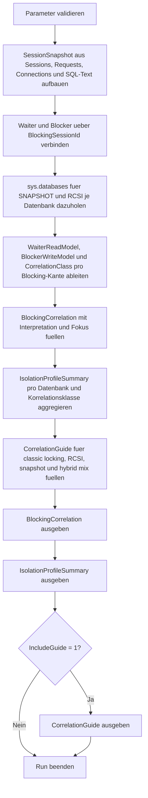

# VersionedBlockingCorrelation.sql

Dieses Skript korreliert aktuelle Blocking-Situationen mit klassischer Locking-Isolation, `SNAPSHOT` und `READ_COMMITTED_SNAPSHOT`. Es verbindet Waiter- und Blocker-Sessions mit Datenbankoptionen, Wait-Kontext und einer didaktischen Einschaetzung, ob eher klassische Sperren, hybride Mischlagen oder versionierungsnahe Muster vorliegen.

## Uebersicht

<!-- SQLDOC:SUMMARY_TABLE:BEGIN -->
| Feld | Wert |
|---|---|
| Script | [VersionedBlockingCorrelation.sql](VersionedBlockingCorrelation.sql) |
| Version | `1.0` |
| Typ | `diagnostic-query` |
| Kapitel | `19_Transaktions` |
| Sicherheit | `read-only` |
| Zweck | Korreliert Blocking-Kanten mit Isolationsstufen und Datenbankoptionen fuer Row-Versioning. |
<!-- SQLDOC:SUMMARY_TABLE:END -->

## Einordnung

Blocking wird in Trainings- und Produktivumgebungen oft pauschal als klassisches Locking-Problem gelesen. In der Praxis haengt die Bewertung aber davon ab, ob die Datenbank `READ_COMMITTED_SNAPSHOT` aktiviert hat, ob Sessions explizit `SNAPSHOT` nutzen und ob Blocking vielleicht aus Schreibpfaden, Hints oder Metadaten stammt. Das Skript verdichtet diese Perspektiven in einer kompakten Korrelation.

## Annahmen

- Das Skript ist eine read-only Diagnoseabfrage gegen aktuelle DMVs und Datenbankoptionen.
- Die Korrelation ist didaktisch: Sie priorisiert plausible Muster fuer das Review, ersetzt aber keine tiefe Analyse einzelner `wait_type`- oder Lock-Hint-Faelle.
- `READ COMMITTED` in einer RCSI-Datenbank wird als versionierungsnahes Lesemodell behandelt, auch wenn bestimmte Schreib- oder Sonderpfade weiterhin blockieren koennen.
- Fuer die benoetigten DMVs werden in der Praxis meist Diagnose- oder Admin-Rechte wie `VIEW SERVER STATE` benoetigt.

## Anwendungsfall

Das Skript eignet sich fuer Blocking-Troubleshooting, wenn Teams klären muessen, ob eine aktuelle Wait-Kette zu klassischem Locking passt oder ob Datenbankoptionen und Session-Isolation eine differenziertere Diagnose verlangen. Besonders hilfreich ist es nach Aktivierung von `READ_COMMITTED_SNAPSHOT`, bei gemischten Isolationen oder wenn `SNAPSHOT`-Leser unerwartet warten.

## Parameter

<!-- SQLDOC:PARAMETERS_TABLE:BEGIN -->
| Parameter | SQL-Typ | Pflicht | Beschreibung |
|---|---|---|---|
| `@IncludeSleepingBlockers` | `BIT` | Nein | `1` nimmt auch Blocker ohne aktiven Request in die Korrelation auf. |
| `@MinimumWaitMs` | `INT` | Nein | Filtert Blocking-Kanten auf mindestens diese Wait-Dauer in Millisekunden. |
| `@IncludeGuide` | `BIT` | Nein | Gibt bei `1` zusaetzlich einen didaktischen Guide fuer Locking-, RCSI- und SNAPSHOT-Muster aus. |
<!-- SQLDOC:PARAMETERS_TABLE:END -->

## Abhaengigkeiten

<!-- SQLDOC:DEPENDENCIES_LIST:BEGIN -->
- `sys.dm_exec_sessions`
- `sys.dm_exec_requests`
- `sys.dm_exec_connections`
- `sys.dm_exec_sql_text`
- `sys.databases`
- `DB_NAME`
- `CASE`
- `tempdb temporary tables`
- `ORDER BY`
<!-- SQLDOC:DEPENDENCIES_LIST:END -->

## Hinweise

- `BlockingCorrelation` zeigt pro Blocking-Kante die Isolationsstufen beider Sessions, die Datenbankoptionen fuer Versioning und eine knappe didaktische Bewertung.
- `IsolationProfileSummary` verdichtet die beobachteten Faelle pro Datenbank und Korrelationsklasse.
- Der Guide trennt klassische Locking-Muster von RCSI-nahen, hybriden und explizit versionierten Faellen.

## Versionshistorie

<!-- SQLDOC:VERSION_HISTORY_TABLE:BEGIN -->
| Version | Datum | User | Beschreibung |
|---|---|---|---|
| `1.0` | `2026-04-22` | `ER` | Erstversion der Blocking-Korrelation fuer klassische und versionierte Isolation |
<!-- SQLDOC:VERSION_HISTORY_TABLE:END -->

## Ablauf

<!-- SQLDOC:MERMAID:BEGIN -->

<!-- SQLDOC:MERMAID:END -->

## SQL-Code

<!-- SQLDOC:SQL_CODE:BEGIN -->
```sql
/*
BEGIN:SQL-HEADER v1
---
sql_header: v1
script_name: "VersionedBlockingCorrelation.sql"
script_version: "1.0"
script_type: "diagnostic-query"
chapter: "19_Transaktions"

purpose: >
  Korreliert aktuelle Blocking-Situationen mit klassischer Locking-
  Isolation, SNAPSHOT-Isolation und READ_COMMITTED_SNAPSHOT auf
  Datenbankebene. Das Skript verbindet Blocker- und Waiter-Sessions mit
  Datenbankoptionen, Wait-Kontext und einer didaktischen Einschaetzung,
  ob eher klassische Sperren, hybride Mischlagen oder versionierungsnahe
  Muster vorliegen.

parameters:
  - name: "@IncludeSleepingBlockers"
    sql_type: "BIT"
    direction: "IN"
    required: false
    description: "1 = auch Blocker ohne aktiven Request in die Korrelation aufnehmen"
  - name: "@MinimumWaitMs"
    sql_type: "INT"
    direction: "IN"
    required: false
    description: "Filtert Blocking-Kanten auf mindestens diese Wait-Dauer in Millisekunden"
  - name: "@IncludeGuide"
    sql_type: "BIT"
    direction: "IN"
    required: false
    description: "1 = zusaetzlich einen didaktischen Guide fuer Locking-, RCSI- und SNAPSHOT-Muster ausgeben"

result_sets:
  - name: "BlockingCorrelation"
    description: "Zeigt Blocking-Kanten mit Isolation, Versioning-Optionen und didaktischer Korrelation"
  - name: "IsolationProfileSummary"
    description: "Verdichtet Blocking-Faelle nach Datenbank und erkannter Korrelationsklasse"
  - name: "CorrelationGuide"
    description: "Leitet naechste Diagnose-Schritte fuer klassische, hybride und versionierte Muster ab"

dependencies:
  - "sys.dm_exec_sessions"
  - "sys.dm_exec_requests"
  - "sys.dm_exec_connections"
  - "sys.dm_exec_sql_text"
  - "sys.databases"
  - "DB_NAME"
  - "CASE"
  - "tempdb temporary tables"
  - "ORDER BY"

safety:
  level: "read-only"
  writes_data: false

documentation:
  markdown_file: "T-SQL/19_Transaktions/SQLScripts/VersionedBlockingCorrelation.md"
  sync_blocks:
    - "SUMMARY_TABLE"
    - "PARAMETERS_TABLE"
    - "DEPENDENCIES_LIST"
    - "VERSION_HISTORY_TABLE"
    - "SQL_CODE"
  mermaid:
    mode: "ai-agent-from-sql"
    source: "script-body"

main_responsible:
  name: "Erhard Rainer"
  initials: "ER"

version_history:
  - version: "1.0"
    date: "2026-04-22"
    user: "ER"
    description: "Erstversion der Blocking-Korrelation fuer klassische und versionierte Isolation"

notes:
  - "Die Korrelation ist didaktisch und ersetzt keine tiefe Analyse einzelner Wait-Typen oder Lock-Hints."
  - "READ COMMITTED unter READ_COMMITTED_SNAPSHOT kann weiterhin durch Schreibpfade, Hints oder andere Ressourcen beeinflusst werden."
---
END:SQL-HEADER v1
*/

SET NOCOUNT ON;

-- 1. Parameter vorbereiten
DECLARE @IncludeSleepingBlockers BIT = 1;
DECLARE @MinimumWaitMs INT = 0;
DECLARE @IncludeGuide BIT = 1;

IF @IncludeSleepingBlockers NOT IN (0, 1)
BEGIN
    THROW 50000, '@IncludeSleepingBlockers muss 0 oder 1 sein.', 1;
END;

IF @MinimumWaitMs < 0
BEGIN
    THROW 50001, '@MinimumWaitMs darf nicht negativ sein.', 1;
END;

IF @IncludeGuide NOT IN (0, 1)
BEGIN
    THROW 50002, '@IncludeGuide muss 0 oder 1 sein.', 1;
END;

DROP TABLE IF EXISTS #SessionSnapshot;
DROP TABLE IF EXISTS #BlockingCorrelation;
DROP TABLE IF EXISTS #IsolationProfileSummary;
DROP TABLE IF EXISTS #CorrelationGuide;

-- 2. Session- und Request-Kontext mit Isolation und Statement-Snippets erfassen
CREATE TABLE #SessionSnapshot
(
    SessionId                    SMALLINT         NOT NULL PRIMARY KEY,
    IsUserProcess                BIT              NOT NULL,
    SessionStatus                NVARCHAR(30)     NULL,
    RequestStatus                NVARCHAR(30)     NULL,
    DatabaseId                   INT              NULL,
    DatabaseName                 SYSNAME          NULL,
    LoginName                    NVARCHAR(128)    NULL,
    HostName                     NVARCHAR(128)    NULL,
    ProgramName                  NVARCHAR(128)    NULL,
    ClientNetAddress             VARCHAR(48)      NULL,
    RequestCommand               NVARCHAR(32)     NULL,
    WaitType                     NVARCHAR(120)    NULL,
    WaitTimeMs                   INT              NULL,
    WaitResource                 NVARCHAR(256)    NULL,
    BlockingSessionId            SMALLINT         NULL,
    OpenTransactionCount         INT              NULL,
    TransactionIsolationLevel    NVARCHAR(40)     NOT NULL,
    IsolationFamily              NVARCHAR(40)     NOT NULL,
    StatementSnippet             NVARCHAR(4000)   NULL
);

INSERT INTO #SessionSnapshot
(
    SessionId,
    IsUserProcess,
    SessionStatus,
    RequestStatus,
    DatabaseId,
    DatabaseName,
    LoginName,
    HostName,
    ProgramName,
    ClientNetAddress,
    RequestCommand,
    WaitType,
    WaitTimeMs,
    WaitResource,
    BlockingSessionId,
    OpenTransactionCount,
    TransactionIsolationLevel,
    IsolationFamily,
    StatementSnippet
)
SELECT
    s.session_id AS SessionId,
    CAST(COALESCE(s.is_user_process, 0) AS BIT) AS IsUserProcess,
    s.status AS SessionStatus,
    r.status AS RequestStatus,
    COALESCE(r.database_id, s.database_id) AS DatabaseId,
    DB_NAME(COALESCE(r.database_id, s.database_id)) AS DatabaseName,
    s.login_name AS LoginName,
    s.host_name AS HostName,
    s.program_name AS ProgramName,
    c.client_net_address AS ClientNetAddress,
    r.command AS RequestCommand,
    r.wait_type AS WaitType,
    r.wait_time AS WaitTimeMs,
    r.wait_resource AS WaitResource,
    NULLIF(r.blocking_session_id, 0) AS BlockingSessionId,
    s.open_transaction_count AS OpenTransactionCount,
    CASE s.transaction_isolation_level
        WHEN 0 THEN N'unspecified'
        WHEN 1 THEN N'read uncommitted'
        WHEN 2 THEN N'read committed'
        WHEN 3 THEN N'repeatable read'
        WHEN 4 THEN N'serializable'
        WHEN 5 THEN N'snapshot'
        ELSE CONCAT(N'level(', s.transaction_isolation_level, N')')
    END AS TransactionIsolationLevel,
    CASE s.transaction_isolation_level
        WHEN 5 THEN N'row-versioning'
        WHEN 1 THEN N'locking-read'
        WHEN 2 THEN N'locking-read'
        WHEN 3 THEN N'locking-read'
        WHEN 4 THEN N'locking-read'
        ELSE N'other'
    END AS IsolationFamily,
    CASE
        WHEN r.sql_handle IS NULL OR txt.text IS NULL THEN NULL
        ELSE LTRIM(RTRIM(
            SUBSTRING(
                txt.text,
                (r.statement_start_offset / 2) + 1,
                CASE
                    WHEN r.statement_end_offset IS NULL OR r.statement_end_offset < 0
                        THEN LEN(CONVERT(NVARCHAR(MAX), txt.text))
                    ELSE ((r.statement_end_offset - r.statement_start_offset) / 2) + 1
                END
            )
        ))
    END AS StatementSnippet
FROM sys.dm_exec_sessions AS s
LEFT JOIN sys.dm_exec_requests AS r
    ON r.session_id = s.session_id
LEFT JOIN sys.dm_exec_connections AS c
    ON c.session_id = s.session_id
OUTER APPLY sys.dm_exec_sql_text(r.sql_handle) AS txt
WHERE s.session_id <> @@SPID
  AND COALESCE(s.is_user_process, 0) = 1;

-- 3. Blocking-Kanten mit Datenbankoptionen und didaktischer Korrelation verdichten
CREATE TABLE #BlockingCorrelation
(
    WaiterSessionId                SMALLINT         NOT NULL,
    BlockerSessionId               SMALLINT         NOT NULL,
    DatabaseName                   SYSNAME          NULL,
    WaitTimeMs                     INT              NULL,
    WaitType                       NVARCHAR(120)    NULL,
    WaitResource                   NVARCHAR(256)    NULL,
    WaiterIsolationLevel           NVARCHAR(40)     NOT NULL,
    WaiterIsolationFamily          NVARCHAR(40)     NOT NULL,
    BlockerIsolationLevel          NVARCHAR(40)     NOT NULL,
    BlockerIsolationFamily         NVARCHAR(40)     NOT NULL,
    SnapshotIsolationState         NVARCHAR(30)     NOT NULL,
    IsReadCommittedSnapshotOn      BIT              NOT NULL,
    WaiterReadModel                VARCHAR(40)      NOT NULL,
    BlockerWriteModel              VARCHAR(40)      NOT NULL,
    CorrelationClass               VARCHAR(40)      NOT NULL,
    DiagnosticInterpretation       VARCHAR(220)     NOT NULL,
    RecommendedFocus               VARCHAR(220)     NOT NULL,
    WaiterProgramName              NVARCHAR(128)    NULL,
    BlockerProgramName             NVARCHAR(128)    NULL,
    WaiterStatementSnippet         NVARCHAR(4000)   NULL,
    BlockerStatementSnippet        NVARCHAR(4000)   NULL
);

INSERT INTO #BlockingCorrelation
(
    WaiterSessionId,
    BlockerSessionId,
    DatabaseName,
    WaitTimeMs,
    WaitType,
    WaitResource,
    WaiterIsolationLevel,
    WaiterIsolationFamily,
    BlockerIsolationLevel,
    BlockerIsolationFamily,
    SnapshotIsolationState,
    IsReadCommittedSnapshotOn,
    WaiterReadModel,
    BlockerWriteModel,
    CorrelationClass,
    DiagnosticInterpretation,
    RecommendedFocus,
    WaiterProgramName,
    BlockerProgramName,
    WaiterStatementSnippet,
    BlockerStatementSnippet
)
SELECT
    waiter.SessionId AS WaiterSessionId,
    blocker.SessionId AS BlockerSessionId,
    COALESCE(waiter.DatabaseName, blocker.DatabaseName) AS DatabaseName,
    waiter.WaitTimeMs,
    waiter.WaitType,
    waiter.WaitResource,
    waiter.TransactionIsolationLevel AS WaiterIsolationLevel,
    waiter.IsolationFamily AS WaiterIsolationFamily,
    blocker.TransactionIsolationLevel AS BlockerIsolationLevel,
    blocker.IsolationFamily AS BlockerIsolationFamily,
    CASE db.snapshot_isolation_state
        WHEN 0 THEN 'OFF'
        WHEN 1 THEN 'ON'
        WHEN 2 THEN 'IN TRANSITION TO OFF'
        WHEN 3 THEN 'IN TRANSITION TO ON'
        ELSE 'UNKNOWN'
    END AS SnapshotIsolationState,
    CAST(COALESCE(db.is_read_committed_snapshot_on, 0) AS BIT) AS IsReadCommittedSnapshotOn,
    CASE
        WHEN waiter.TransactionIsolationLevel = N'snapshot' THEN 'snapshot-reader'
        WHEN waiter.TransactionIsolationLevel = N'read committed'
         AND COALESCE(db.is_read_committed_snapshot_on, 0) = 1 THEN 'rcsi-reader'
        WHEN waiter.IsolationFamily = N'locking-read' THEN 'classic-locking'
        ELSE 'other'
    END AS WaiterReadModel,
    CASE
        WHEN blocker.TransactionIsolationLevel = N'snapshot' THEN 'snapshot-writer'
        WHEN blocker.TransactionIsolationLevel = N'read committed'
         AND COALESCE(db.is_read_committed_snapshot_on, 0) = 1 THEN 'rcsi-mixed'
        WHEN blocker.IsolationFamily = N'locking-read' THEN 'classic-locking'
        ELSE 'other'
    END AS BlockerWriteModel,
    CASE
        WHEN waiter.TransactionIsolationLevel = N'snapshot'
            THEN 'versioned-waiter'
        WHEN waiter.TransactionIsolationLevel = N'read committed'
         AND COALESCE(db.is_read_committed_snapshot_on, 0) = 1
            THEN 'rcsi-adjacent'
        WHEN waiter.IsolationFamily = N'locking-read'
         AND blocker.IsolationFamily = N'locking-read'
         AND COALESCE(db.is_read_committed_snapshot_on, 0) = 0
            THEN 'classic-locking'
        WHEN waiter.IsolationFamily <> blocker.IsolationFamily
            THEN 'hybrid-mix'
        ELSE 'mixed-review'
    END AS CorrelationClass,
    CASE
        WHEN waiter.TransactionIsolationLevel = N'snapshot'
            THEN 'Snapshot-Session wartet trotzdem; eher Write-Write-, Metadaten- oder Ressourcenpfad als klassischer Shared-Lock-Konflikt pruefen.'
        WHEN waiter.TransactionIsolationLevel = N'read committed'
         AND COALESCE(db.is_read_committed_snapshot_on, 0) = 1
            THEN 'READ COMMITTED laeuft in einer RCSI-Datenbank; Blocking kann auf Schreibpfade, Lock-Hints oder nicht versionierte Ressourcen hindeuten.'
        WHEN waiter.IsolationFamily = N'locking-read'
         AND blocker.IsolationFamily = N'locking-read'
         AND COALESCE(db.is_read_committed_snapshot_on, 0) = 0
            THEN 'Blocking passt zunaechst zu klassischer Locking-Isolation ohne Row-Versioning.'
        WHEN waiter.IsolationFamily <> blocker.IsolationFamily
            THEN 'Unterschiedliche Isolationsfamilien treffen aufeinander; Session-Initialisierung und bewusste Ausnahmen abgleichen.'
        ELSE 'Blocking-Muster ist nicht rein klassisch und sollte mit Datenbankoptionen sowie Statement-Kontext abgestimmt werden.'
    END AS DiagnosticInterpretation,
    CASE
        WHEN waiter.TransactionIsolationLevel = N'snapshot'
            THEN 'Schreibkonflikte, Update-Pfade, Tempdb-Versionstore und objektbezogene Locks gezielt reviewen.'
        WHEN waiter.TransactionIsolationLevel = N'read committed'
         AND COALESCE(db.is_read_committed_snapshot_on, 0) = 1
            THEN 'Tabellenhints, explizite UPDLOCK/HOLDLOCK-Muster und schreibende Transaktionen zuerst durchsuchen.'
        WHEN waiter.IsolationFamily = N'locking-read'
         AND blocker.IsolationFamily = N'locking-read'
         AND COALESCE(db.is_read_committed_snapshot_on, 0) = 0
            THEN 'Transaktionsgrenzen, Commit-Latenz und Root-Blocker mit klassischer Lock-Kette nachverfolgen.'
        WHEN waiter.IsolationFamily <> blocker.IsolationFamily
            THEN 'Runbook fuer Isolation, Datenbankoptionen und Session-Setup auf Drift zwischen Anwendungen pruefen.'
        ELSE 'WaitType, StatementSnippet und Datenbankoptionen zusammen lesen statt nur die Isolationsebene isoliert zu bewerten.'
    END AS RecommendedFocus,
    waiter.ProgramName AS WaiterProgramName,
    blocker.ProgramName AS BlockerProgramName,
    waiter.StatementSnippet AS WaiterStatementSnippet,
    blocker.StatementSnippet AS BlockerStatementSnippet
FROM #SessionSnapshot AS waiter
INNER JOIN #SessionSnapshot AS blocker
    ON blocker.SessionId = waiter.BlockingSessionId
LEFT JOIN sys.databases AS db
    ON db.database_id = COALESCE(waiter.DatabaseId, blocker.DatabaseId)
WHERE waiter.BlockingSessionId IS NOT NULL
  AND waiter.BlockingSessionId > 0
  AND COALESCE(waiter.WaitTimeMs, 0) >= @MinimumWaitMs
  AND (@IncludeSleepingBlockers = 1 OR blocker.RequestStatus IS NOT NULL);

-- 4. Korrelation pro Datenbank und Muster zusammenfassen
CREATE TABLE #IsolationProfileSummary
(
    DatabaseName                   SYSNAME         NULL,
    CorrelationClass               VARCHAR(40)     NOT NULL,
    BlockingEdges                  INT             NOT NULL,
    MaxWaitMs                      INT             NULL,
    SnapshotIsolationState         NVARCHAR(30)    NOT NULL,
    IsReadCommittedSnapshotOn      BIT             NOT NULL,
    WaiterIsolationLevels          NVARCHAR(400)   NOT NULL,
    BlockerIsolationLevels         NVARCHAR(400)   NOT NULL,
    SummaryRecommendation          VARCHAR(220)    NOT NULL
);

WITH correlation_base AS
(
    SELECT
        bc.DatabaseName,
        bc.CorrelationClass,
        MAX(bc.SnapshotIsolationState) AS SnapshotIsolationState,
        MAX(bc.IsReadCommittedSnapshotOn) AS IsReadCommittedSnapshotOn,
        COUNT(*) AS BlockingEdges,
        MAX(bc.WaitTimeMs) AS MaxWaitMs
    FROM #BlockingCorrelation AS bc
    GROUP BY
        bc.DatabaseName,
        bc.CorrelationClass
)
INSERT INTO #IsolationProfileSummary
(
    DatabaseName,
    CorrelationClass,
    BlockingEdges,
    MaxWaitMs,
    SnapshotIsolationState,
    IsReadCommittedSnapshotOn,
    WaiterIsolationLevels,
    BlockerIsolationLevels,
    SummaryRecommendation
)
SELECT
    cb.DatabaseName,
    cb.CorrelationClass,
    cb.BlockingEdges,
    cb.MaxWaitMs,
    cb.SnapshotIsolationState,
    cb.IsReadCommittedSnapshotOn,
    waiter_levels.WaiterIsolationLevels,
    blocker_levels.BlockerIsolationLevels,
    CASE cb.CorrelationClass
        WHEN 'classic-locking' THEN 'Blocking laeuft ohne aktive Row-Versioning-Hilfe; Root-Blocker und Commit-Pfade zuerst pruefen.'
        WHEN 'rcsi-adjacent' THEN 'RCSI ist beteiligt; Tabellenhints, Schreibkonflikte und Sonderpfade explizit sichtbar machen.'
        WHEN 'versioned-waiter' THEN 'Versionierte Leser warten dennoch; Schreibkonflikte oder nicht versionierte Ressourcen gesondert analysieren.'
        WHEN 'hybrid-mix' THEN 'Isolation-Drift zwischen Sessions oder Komponenten dokumentieren und mit Architekturentscheidungen abgleichen.'
        ELSE 'Blocking-Muster im Kontext von WaitType, Datenbankoptionen und Session-Setup reviewen.'
    END AS SummaryRecommendation
FROM correlation_base AS cb
CROSS APPLY
(
    SELECT STRING_AGG(levels.WaiterIsolationLevel, ', ')
           WITHIN GROUP (ORDER BY levels.SortWeight, levels.WaiterIsolationLevel) AS WaiterIsolationLevels
    FROM
    (
        SELECT DISTINCT
            bc.WaiterIsolationLevel,
            CASE bc.WaiterIsolationLevel
                WHEN N'read uncommitted' THEN 1
                WHEN N'read committed' THEN 2
                WHEN N'repeatable read' THEN 3
                WHEN N'serializable' THEN 4
                WHEN N'snapshot' THEN 5
                ELSE 6
            END AS SortWeight
        FROM #BlockingCorrelation AS bc
        WHERE ISNULL(bc.DatabaseName, '<no-db>') = ISNULL(cb.DatabaseName, '<no-db>')
          AND bc.CorrelationClass = cb.CorrelationClass
    ) AS levels
) AS waiter_levels
CROSS APPLY
(
    SELECT STRING_AGG(levels.BlockerIsolationLevel, ', ')
           WITHIN GROUP (ORDER BY levels.SortWeight, levels.BlockerIsolationLevel) AS BlockerIsolationLevels
    FROM
    (
        SELECT DISTINCT
            bc.BlockerIsolationLevel,
            CASE bc.BlockerIsolationLevel
                WHEN N'read uncommitted' THEN 1
                WHEN N'read committed' THEN 2
                WHEN N'repeatable read' THEN 3
                WHEN N'serializable' THEN 4
                WHEN N'snapshot' THEN 5
                ELSE 6
            END AS SortWeight
        FROM #BlockingCorrelation AS bc
        WHERE ISNULL(bc.DatabaseName, '<no-db>') = ISNULL(cb.DatabaseName, '<no-db>')
          AND bc.CorrelationClass = cb.CorrelationClass
    ) AS levels
) AS blocker_levels;

-- 5. Didaktischen Guide fuer die Korrelationsklassen bereitstellen
CREATE TABLE #CorrelationGuide
(
    GuideStep                    TINYINT          NOT NULL,
    FocusArea                    VARCHAR(80)      NOT NULL,
    TriggerDescription           VARCHAR(220)     NOT NULL,
    RecommendedNextStep          VARCHAR(220)     NOT NULL,
    WhyItHelps                   VARCHAR(220)     NOT NULL
);

INSERT INTO #CorrelationGuide
(
    GuideStep,
    FocusArea,
    TriggerDescription,
    RecommendedNextStep,
    WhyItHelps
)
VALUES
    (
        1,
        'Classic locking baseline',
        'Waiter und Blocker laufen in klassischer Locking-Isolation und die Datenbank hat RCSI nicht aktiviert.',
        'Root-Blocker, offene Transaktionen und Commit-Latenz entlang der Wait-Kette nachverfolgen.',
        'So wird ein erwartbares Locking-Muster sauber von versionierungsnahen Sonderfaellen getrennt.'
    ),
    (
        2,
        'RCSI adjacent blocking',
        'READ COMMITTED trifft auf eine Datenbank mit READ_COMMITTED_SNAPSHOT = ON.',
        'Schreibpfade, Lock-Hints und Sonderobjekte wie Metadaten oder Schema-Locks explizit reviewen.',
        'RCSI reduziert viele Leser-Schreiber-Konflikte, beseitigt aber nicht jedes Warten.'
    ),
    (
        3,
        'Versioned waiter',
        'Eine SNAPSHOT-Session wartet trotz versionierter Leserlogik.',
        'Write-Write-Konflikte, Update-Pfade, Versionstore-Druck und nicht datenbezogene Waits priorisieren.',
        'Die Diagnose springt damit nicht vorschnell zu klassischen Shared-Lock-Erklaerungen.'
    ),
    (
        4,
        'Hybrid mix',
        'Blocker und Waiter nutzen unterschiedliche Isolationsfamilien oder Initialisierungspfade.',
        'Session-Setup, Connection-Defaults und bewusste Ausnahmen zwischen Anwendungen vergleichen.',
        'So wird technische Drift zwischen Komponenten sichtbar, bevor nur einzelne Waits repariert werden.'
    );

-- 6. Resultsets ausgeben
SELECT
    bc.WaiterSessionId,
    bc.BlockerSessionId,
    bc.DatabaseName,
    bc.WaitTimeMs,
    bc.WaitType,
    bc.WaitResource,
    bc.WaiterIsolationLevel,
    bc.BlockerIsolationLevel,
    bc.SnapshotIsolationState,
    bc.IsReadCommittedSnapshotOn,
    bc.WaiterReadModel,
    bc.BlockerWriteModel,
    bc.CorrelationClass,
    bc.DiagnosticInterpretation,
    bc.RecommendedFocus,
    bc.WaiterProgramName,
    bc.BlockerProgramName,
    bc.WaiterStatementSnippet,
    bc.BlockerStatementSnippet
FROM #BlockingCorrelation AS bc
ORDER BY
    COALESCE(bc.WaitTimeMs, 0) DESC,
    bc.DatabaseName,
    bc.WaiterSessionId;

SELECT
    ips.DatabaseName,
    ips.CorrelationClass,
    ips.BlockingEdges,
    ips.MaxWaitMs,
    ips.SnapshotIsolationState,
    ips.IsReadCommittedSnapshotOn,
    ips.WaiterIsolationLevels,
    ips.BlockerIsolationLevels,
    ips.SummaryRecommendation
FROM #IsolationProfileSummary AS ips
ORDER BY
    ips.BlockingEdges DESC,
    ips.MaxWaitMs DESC,
    ips.DatabaseName,
    ips.CorrelationClass;

IF @IncludeGuide = 1
BEGIN
    SELECT
        cg.GuideStep,
        cg.FocusArea,
        cg.TriggerDescription,
        cg.RecommendedNextStep,
        cg.WhyItHelps
    FROM #CorrelationGuide AS cg
    ORDER BY
        cg.GuideStep;
END;
```
<!-- SQLDOC:SQL_CODE:END -->
