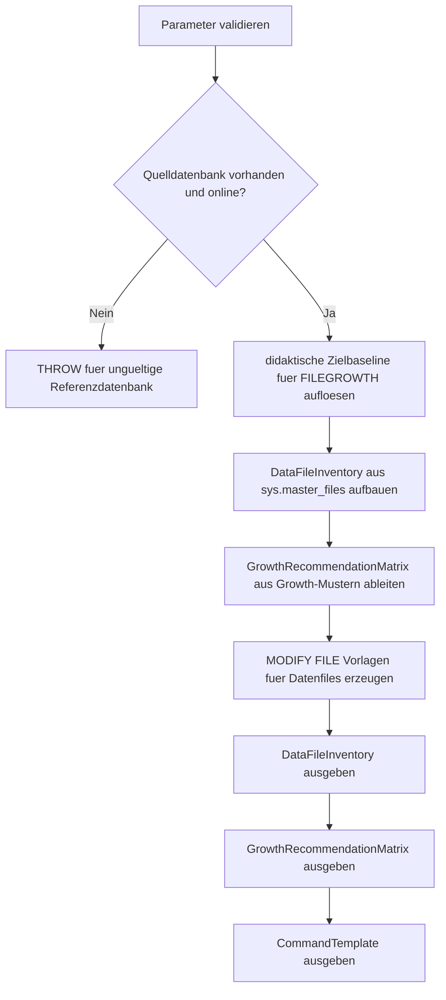

# DataFileAutogrowthTemplate.sql

Dieses Skript inventarisiert die Growth-Einstellungen von Datenfiles einer Referenzdatenbank und leitet daraus eine wiederverwendbare Baseline fuer `CREATE DATABASE`-nahe Datenfiles ab. Zusaetzlich erzeugt es `ALTER DATABASE ... MODIFY FILE`-Vorlagen, ohne selbst persistente Aenderungen auszufuehren.

## Uebersicht

<!-- SQLDOC:SUMMARY_TABLE:BEGIN -->
| Feld | Wert |
|---|---|
| Script | [DataFileAutogrowthTemplate.sql](DataFileAutogrowthTemplate.sql) |
| Version | `1.0` |
| Typ | `template` |
| Kapitel | `20_Create_Database` |
| Sicherheit | `read-only` |
| Zweck | Leitet eine konsistente Autogrowth-Baseline fuer Datenfiles ab und erzeugt passende `MODIFY FILE`-Vorlagen. |
<!-- SQLDOC:SUMMARY_TABLE:END -->

## Einordnung

Beim Aufbau neuer Datenbanken werden Dateiwachstumseinstellungen oft aus `model` uebernommen oder spaeter uneinheitlich nachgezogen. Das Skript macht die aktuelle Lage sichtbar, stuft Growth-Muster fuer Datenfiles ein und trennt bewusst zwischen Analyse, Empfehlung und ausfuehrbarer Vorlagenzeile.

## Annahmen

- Es handelt sich um eine didaktische Template-Erstversion fuer Bootstrap- und Review-Zwecke.
- Standardmaessig wird `model` als Referenz fuer neue Datenbanken gelesen.
- Fuer Datenfiles wird als konservative Baseline fixes Wachstum in MB bevorzugt; Prozentwachstum bleibt nur als bewusst zuschaltbare Variante sichtbar.
- Logdateien koennen optional mit ausgegeben werden, stehen aber nicht im Fokus der generierten Datenfile-Vorlagen.

## Anwendungsfall

Das Skript eignet sich fuer Checklisten, Bootstrap-Standards und Reviews im Kapitel `20_Create_Database`. Es hilft dabei, inkonsistente `FILEGROWTH`-Muster frueh zu erkennen und aus einer Referenzdatenbank sofort wiederverwendbare `ALTER DATABASE ... MODIFY FILE`-Vorlagen fuer Datenfiles abzuleiten.

## Parameter

<!-- SQLDOC:PARAMETERS_TABLE:BEGIN -->
| Parameter | SQL-Typ | Pflicht | Beschreibung |
|---|---|---|---|
| `@DatabaseName` | `SYSNAME` | Nein | Quelldatenbank fuer das File-Inventar; standardmaessig `model`. |
| `@TargetDatabaseName` | `SYSNAME` | Nein | Name der Zieldatenbank fuer generierte Befehlsvorlagen. |
| `@TargetGrowthMB` | `INT` | Nein | Optionaler Zielwert fuer fixes Growth in MB; sonst didaktische Baseline. |
| `@MaxRecommendedGrowthMB` | `INT` | Nein | Review-Schwelle fuer sehr grosse fixe Growth-Schritte. |
| `@PreferPercentGrowth` | `BIT` | Nein | Markiert bei `1` Prozentwachstum als Zielvariante statt fixer MB-Werte. |
| `@IncludeLogFiles` | `BIT` | Nein | Zeigt bei `1` auch Logdateien im Inventar an. |
<!-- SQLDOC:PARAMETERS_TABLE:END -->

## Abhaengigkeiten

<!-- SQLDOC:DEPENDENCIES_LIST:BEGIN -->
- `sys.databases`
- `sys.master_files`
- `tempdb` fuer temporaere Tabellen
- `CASE`
- `CONCAT`
- `QUOTENAME`
<!-- SQLDOC:DEPENDENCIES_LIST:END -->

## Hinweise

- `DataFileInventory` zeigt pro Datei Groesse, aktuelles Growth-Muster, Zielbaseline und Review-Fokus.
- `GrowthRecommendationMatrix` verdichtet die wichtigsten Abweichungen in priorisierte Empfehlungen.
- `CommandTemplate` erzeugt nur Vorlagen fuer Datenfiles vom Typ `ROWS`, nicht fuer Logdateien.

## Versionshistorie

<!-- SQLDOC:VERSION_HISTORY_TABLE:BEGIN -->
| Version | Datum | User | Beschreibung |
|---|---|---|---|
| `1.0` | `2026-04-22` | `ER` | Erstversion der Template-Baseline fuer konsistente Data-File-Autogrowth-Einstellungen |
<!-- SQLDOC:VERSION_HISTORY_TABLE:END -->

## Ablauf

<!-- SQLDOC:MERMAID:BEGIN -->

<!-- SQLDOC:MERMAID:END -->

## SQL-Code

<!-- SQLDOC:SQL_CODE:BEGIN -->
```sql
/*
BEGIN:SQL-HEADER v1
---
sql_header: v1
script_name: "DataFileAutogrowthTemplate.sql"
script_version: "1.0"
script_type: "template"
chapter: "20_Create_Database"
purpose: >
  Inventarisiert die Growth-Einstellungen von Datenfiles, leitet eine
  konsistente Zielbaseline fuer CREATE-DATABASE-nahe Datenfiles ab und
  erzeugt passende ALTER DATABASE ... MODIFY FILE Vorlagen, ohne selbst
  persistente Aenderungen auszufuehren.

parameters:
  - name: "@DatabaseName"
    sql_type: "SYSNAME"
    direction: "IN"
    required: false
    description: "Quelldatenbank fuer das File-Inventar; standardmaessig model"
  - name: "@TargetDatabaseName"
    sql_type: "SYSNAME"
    direction: "IN"
    required: false
    description: "Name der Zieldatenbank fuer generierte Befehlsvorlagen"
  - name: "@TargetGrowthMB"
    sql_type: "INT"
    direction: "IN"
    required: false
    description: "Optionale Zielvorgabe fuer fixes Growth in MB; NULL nutzt eine didaktische Baseline"
  - name: "@MaxRecommendedGrowthMB"
    sql_type: "INT"
    direction: "IN"
    required: false
    description: "Obere Schwelle fuer die Review-Einstufung sehr grosser fixierter Growth-Schritte"
  - name: "@PreferPercentGrowth"
    sql_type: "BIT"
    direction: "IN"
    required: false
    description: "1 = Prozentwachstum als Ziel markieren, 0 = fixes MB-Wachstum bevorzugen"
  - name: "@IncludeLogFiles"
    sql_type: "BIT"
    direction: "IN"
    required: false
    description: "1 = Logdateien im Inventar mit anzeigen; Vorlagen werden trotzdem nur fuer Datenfiles erzeugt"

result_sets:
  - name: "DataFileInventory"
    description: "Zeigt Dateityp, aktuelle Groesse, Growth-Muster und Baseline-Hinweise pro Datei"
  - name: "GrowthRecommendationMatrix"
    description: "Verdichtet die Review-Sicht auf riskante oder inkonsistente Growth-Konfigurationen"
  - name: "CommandTemplate"
    description: "Generiert ALTER DATABASE ... MODIFY FILE Vorlagen fuer Datenfiles"

dependencies:
  - "sys.databases"
  - "sys.master_files"
  - "tempdb temporary tables"
  - "CASE"
  - "CONCAT"
  - "QUOTENAME"

safety:
  level: "read-only"
  writes_data: false

documentation:
  markdown_file: "T-SQL/20_Create_Database/SQLScripts/DataFileAutogrowthTemplate.md"
  sync_blocks:
    - "SUMMARY_TABLE"
    - "PARAMETERS_TABLE"
    - "DEPENDENCIES_LIST"
    - "VERSION_HISTORY_TABLE"
    - "SQL_CODE"
  mermaid:
    mode: "ai-agent-from-sql"
    source: "script-body"

main_responsible:
  name: "Erhard Rainer"
  initials: "ER"

version_history:
  - version: "1.0"
    date: "2026-04-22"
    user: "ER"
    description: "Erstversion der Template-Baseline fuer konsistente Data-File-Autogrowth-Einstellungen"

notes:
  - "Das Skript erzeugt nur Analyse- und Befehlsvorlagen; es fuehrt keine ALTER DATABASE Anweisungen aus."
  - "Die Zielbaseline bevorzugt fuer Datenfiles standardmaessig fixes MB-Wachstum statt Prozentwachstum."
---
END:SQL-HEADER v1
*/

SET NOCOUNT ON;

-- 1. Parameter vorbereiten
DECLARE @DatabaseName SYSNAME = N'model';
DECLARE @TargetDatabaseName SYSNAME = N'TrainingAutogrowthBaselineDemo';
DECLARE @TargetGrowthMB INT = NULL;
DECLARE @MaxRecommendedGrowthMB INT = 512;
DECLARE @PreferPercentGrowth BIT = 0;
DECLARE @IncludeLogFiles BIT = 0;

IF DB_ID(@DatabaseName) IS NULL
BEGIN
    THROW 50000, '@DatabaseName verweist auf keine vorhandene Datenbank.', 1;
END;

IF @TargetDatabaseName IS NULL OR LTRIM(RTRIM(@TargetDatabaseName)) = N''
BEGIN
    THROW 50001, '@TargetDatabaseName darf nicht leer sein.', 1;
END;

IF @TargetGrowthMB IS NOT NULL AND @TargetGrowthMB <= 0
BEGIN
    THROW 50002, '@TargetGrowthMB muss NULL oder groesser als 0 sein.', 1;
END;

IF @MaxRecommendedGrowthMB <= 0
BEGIN
    THROW 50003, '@MaxRecommendedGrowthMB muss groesser als 0 sein.', 1;
END;

IF @PreferPercentGrowth NOT IN (0, 1)
BEGIN
    THROW 50004, '@PreferPercentGrowth muss 0 oder 1 sein.', 1;
END;

IF @IncludeLogFiles NOT IN (0, 1)
BEGIN
    THROW 50005, '@IncludeLogFiles muss 0 oder 1 sein.', 1;
END;

IF NOT EXISTS
(
    SELECT 1
    FROM sys.databases AS d
    WHERE d.name = @DatabaseName
      AND d.state_desc = 'ONLINE'
)
BEGIN
    THROW 50006, 'Die gewaehlte Quelldatenbank muss ONLINE sein.', 1;
END;

DECLARE @DefaultTargetGrowthMB INT;
SET @DefaultTargetGrowthMB =
    CASE
        WHEN @TargetGrowthMB IS NOT NULL THEN @TargetGrowthMB
        ELSE 256
    END;

DROP TABLE IF EXISTS #DataFileInventory;
DROP TABLE IF EXISTS #GrowthRecommendationMatrix;
DROP TABLE IF EXISTS #CommandTemplate;

-- 2. Datei-Inventar fuer Datenbankdateien aufbauen
CREATE TABLE #DataFileInventory
(
    FileOrder INT NOT NULL,
    DatabaseName SYSNAME NOT NULL,
    FileId INT NOT NULL,
    FileType VARCHAR(20) NOT NULL,
    LogicalFileName SYSNAME NOT NULL,
    PhysicalFileName NVARCHAR(260) NOT NULL,
    CurrentSizeMB DECIMAL(18, 2) NOT NULL,
    MaxSizeDisplay VARCHAR(30) NOT NULL,
    GrowthMode VARCHAR(20) NOT NULL,
    CurrentGrowthDisplay VARCHAR(40) NOT NULL,
    CurrentGrowthMB DECIMAL(18, 2) NULL,
    TargetGrowthMode VARCHAR(20) NOT NULL,
    TargetGrowthDisplay VARCHAR(40) NOT NULL,
    ReviewSeverity VARCHAR(12) NOT NULL,
    ReviewFocus VARCHAR(220) NOT NULL,
    RecommendedAction VARCHAR(220) NOT NULL
);

INSERT INTO #DataFileInventory
(
    FileOrder,
    DatabaseName,
    FileId,
    FileType,
    LogicalFileName,
    PhysicalFileName,
    CurrentSizeMB,
    MaxSizeDisplay,
    GrowthMode,
    CurrentGrowthDisplay,
    CurrentGrowthMB,
    TargetGrowthMode,
    TargetGrowthDisplay,
    ReviewSeverity,
    ReviewFocus,
    RecommendedAction
)
SELECT
    ROW_NUMBER() OVER
    (
        ORDER BY
            CASE mf.type_desc WHEN 'ROWS' THEN 1 ELSE 2 END,
            mf.file_id
    ) AS FileOrder,
    DB_NAME(mf.database_id) AS DatabaseName,
    mf.file_id AS FileId,
    mf.type_desc AS FileType,
    mf.name AS LogicalFileName,
    mf.physical_name AS PhysicalFileName,
    CAST(mf.size / 128.0 AS DECIMAL(18, 2)) AS CurrentSizeMB,
    CASE
        WHEN mf.max_size = -1 THEN 'UNLIMITED'
        ELSE CONVERT(VARCHAR(30), CAST(mf.max_size / 128.0 AS DECIMAL(18, 2)))
    END AS MaxSizeDisplay,
    CASE
        WHEN mf.is_percent_growth = 1 THEN 'percent'
        ELSE 'fixed-mb'
    END AS GrowthMode,
    CASE
        WHEN mf.is_percent_growth = 1 THEN CONCAT(CONVERT(VARCHAR(20), mf.growth), '%')
        ELSE CONCAT(CONVERT(VARCHAR(30), CAST(mf.growth / 128.0 AS DECIMAL(18, 2))), ' MB')
    END AS CurrentGrowthDisplay,
    CASE
        WHEN mf.is_percent_growth = 1 THEN NULL
        ELSE CAST(mf.growth / 128.0 AS DECIMAL(18, 2))
    END AS CurrentGrowthMB,
    CASE
        WHEN mf.type_desc = 'LOG' AND mf.is_percent_growth = 1 THEN 'percent'
        WHEN mf.type_desc = 'LOG' THEN 'keep-current'
        WHEN @PreferPercentGrowth = 1 THEN 'percent'
        ELSE 'fixed-mb'
    END AS TargetGrowthMode,
    CASE
        WHEN mf.type_desc = 'LOG' AND mf.is_percent_growth = 1 THEN CONCAT(CONVERT(VARCHAR(20), mf.growth), '%')
        WHEN mf.type_desc = 'LOG' THEN CONCAT(CONVERT(VARCHAR(30), CAST(mf.growth / 128.0 AS DECIMAL(18, 2))), ' MB')
        WHEN @PreferPercentGrowth = 1 THEN '10%'
        ELSE CONCAT(CONVERT(VARCHAR(20), @DefaultTargetGrowthMB), ' MB')
    END AS TargetGrowthDisplay,
    CASE
        WHEN mf.type_desc = 'ROWS' AND mf.is_percent_growth = 1 THEN 'high'
        WHEN mf.type_desc = 'ROWS' AND CAST(mf.growth / 128.0 AS DECIMAL(18, 2)) > @MaxRecommendedGrowthMB THEN 'high'
        WHEN mf.type_desc = 'ROWS' AND CAST(mf.growth / 128.0 AS DECIMAL(18, 2)) <> @DefaultTargetGrowthMB THEN 'medium'
        ELSE 'low'
    END AS ReviewSeverity,
    CASE
        WHEN mf.type_desc = 'ROWS' AND mf.is_percent_growth = 1 THEN 'Prozentwachstum erschwert planbare Kapazitaet und fuehrt bei grossen Datenfiles schnell zu ungleichmaessigem Wachstum.'
        WHEN mf.type_desc = 'ROWS' AND CAST(mf.growth / 128.0 AS DECIMAL(18, 2)) > @MaxRecommendedGrowthMB THEN 'Sehr grosse fixe Growth-Schritte sollten gegen Speicherstrategie, Wartungsfenster und Initialgroesse geprueft werden.'
        WHEN mf.type_desc = 'ROWS' AND CAST(mf.growth / 128.0 AS DECIMAL(18, 2)) <> @DefaultTargetGrowthMB THEN 'Uneinheitliche fixe Growth-Werte erschweren standardisierte CREATE DATABASE Vorlagen.'
        WHEN mf.type_desc = 'LOG' THEN 'Logdateien werden sichtbar gehalten, aber die eigentliche Vorlage fokussiert auf konsistente Datenfiles.'
        ELSE 'Die aktuelle Growth-Konfiguration passt zur didaktischen Baseline fuer Datenfiles.'
    END AS ReviewFocus,
    CASE
        WHEN mf.type_desc = 'ROWS' AND @PreferPercentGrowth = 1 THEN 'Prozentwachstum nur behalten, wenn das Team dies bewusst standardisiert; sonst auf fixes MB-Wachstum umstellen.'
        WHEN mf.type_desc = 'ROWS' THEN 'Fuer Datenfiles eine feste Growth-Stufe in MB als wiederverwendbare Baseline dokumentieren.'
        ELSE 'Logdatei separat reviewen; keine automatische Datenfile-Vorlage dafuer erzeugen.'
    END AS RecommendedAction
FROM sys.master_files AS mf
WHERE mf.database_id = DB_ID(@DatabaseName)
  AND (@IncludeLogFiles = 1 OR mf.type_desc = 'ROWS');

-- 3. Review-Matrix fuer Growth-Konfigurationen ableiten
CREATE TABLE #GrowthRecommendationMatrix
(
    RecommendationOrder INT NOT NULL,
    Category VARCHAR(40) NOT NULL,
    LogicalFileName SYSNAME NOT NULL,
    PriorityLevel VARCHAR(12) NOT NULL,
    RecommendationText VARCHAR(260) NOT NULL,
    WhyItMatters VARCHAR(260) NOT NULL
);

INSERT INTO #GrowthRecommendationMatrix
(
    RecommendationOrder,
    Category,
    LogicalFileName,
    PriorityLevel,
    RecommendationText,
    WhyItMatters
)
SELECT
    dfi.FileOrder,
    CASE
        WHEN dfi.FileType = 'LOG' THEN 'Informational'
        WHEN dfi.GrowthMode = 'percent' THEN 'Standardization'
        WHEN dfi.ReviewSeverity = 'high' THEN 'Capacity guardrail'
        ELSE 'Baseline alignment'
    END AS Category,
    dfi.LogicalFileName,
    dfi.ReviewSeverity,
    CASE
        WHEN dfi.FileType = 'LOG' THEN 'Logdatei nur beobachten; das Template erzeugt keine Datenfile-Kommandos fuer LOG.'
        WHEN dfi.GrowthMode = 'percent' THEN 'Datenfile von Prozentwachstum auf eine feste MB-Baseline umstellen.'
        WHEN dfi.ReviewSeverity = 'high' THEN 'Growth-Schritt mit Betriebsstandard und Dateigroesse abgleichen, bevor die Baseline uebernommen wird.'
        ELSE 'Growth-Wert als wiederverwendbare CREATE-DATABASE-Baseline dokumentieren.'
    END AS RecommendationText,
    dfi.ReviewFocus
FROM #DataFileInventory AS dfi;

-- 4. ALTER DATABASE ... MODIFY FILE Vorlagen fuer Datenfiles erzeugen
CREATE TABLE #CommandTemplate
(
    CommandOrder INT NOT NULL,
    CommandName VARCHAR(100) NOT NULL,
    AppliesTo VARCHAR(80) NOT NULL,
    GeneratedCommand NVARCHAR(MAX) NOT NULL
);

INSERT INTO #CommandTemplate
(
    CommandOrder,
    CommandName,
    AppliesTo,
    GeneratedCommand
)
SELECT
    dfi.FileOrder,
    'Modify FILE growth for data file' AS CommandName,
    dfi.LogicalFileName AS AppliesTo,
    CASE
        WHEN @PreferPercentGrowth = 1 THEN
            CONCAT(
                N'ALTER DATABASE ',
                QUOTENAME(@TargetDatabaseName),
                N' MODIFY FILE ( NAME = ',
                QUOTENAME(dfi.LogicalFileName, ''''),
                N', FILEGROWTH = 10% );'
            )
        ELSE
            CONCAT(
                N'ALTER DATABASE ',
                QUOTENAME(@TargetDatabaseName),
                N' MODIFY FILE ( NAME = ',
                QUOTENAME(dfi.LogicalFileName, ''''),
                N', FILEGROWTH = ',
                CONVERT(NVARCHAR(20), @DefaultTargetGrowthMB),
                N'MB );'
            )
    END AS GeneratedCommand
FROM #DataFileInventory AS dfi
WHERE dfi.FileType = 'ROWS'
;

-- 5. Ergebnisse ausgeben
SELECT
    dfi.FileOrder,
    dfi.DatabaseName,
    dfi.FileId,
    dfi.FileType,
    dfi.LogicalFileName,
    dfi.PhysicalFileName,
    dfi.CurrentSizeMB,
    dfi.MaxSizeDisplay,
    dfi.GrowthMode,
    dfi.CurrentGrowthDisplay,
    dfi.TargetGrowthMode,
    dfi.TargetGrowthDisplay,
    dfi.ReviewSeverity,
    dfi.ReviewFocus,
    dfi.RecommendedAction
FROM #DataFileInventory AS dfi
ORDER BY
    dfi.FileOrder;

SELECT
    grm.RecommendationOrder,
    grm.Category,
    grm.LogicalFileName,
    grm.PriorityLevel,
    grm.RecommendationText,
    grm.WhyItMatters
FROM #GrowthRecommendationMatrix AS grm
ORDER BY
    grm.RecommendationOrder;

SELECT
    ct.CommandOrder,
    ct.CommandName,
    ct.AppliesTo,
    ct.GeneratedCommand
FROM #CommandTemplate AS ct
ORDER BY
    ct.CommandOrder;
```
<!-- SQLDOC:SQL_CODE:END -->
