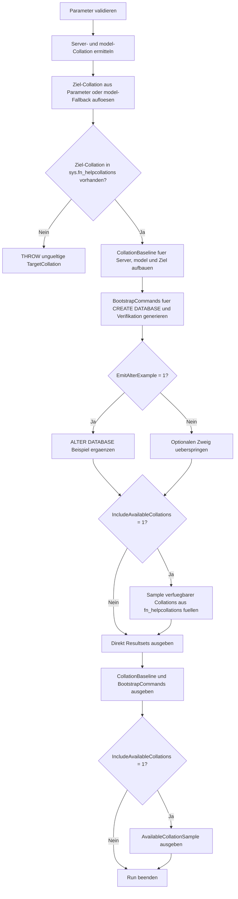

# DatabaseCollationBootstrap.sql

Dieses Skript erzeugt eine lesende Bootstrap-Vorlage fuer konsistente Datenbank-Collations. Statt `CREATE DATABASE` oder `ALTER DATABASE` direkt auszufuehren, vergleicht es Server-, `model`- und Ziel-Collation und generiert daraus belastbare Startbefehle fuer neue oder zu reviewende Datenbanken.

## Uebersicht

<!-- SQLDOC:SUMMARY_TABLE:BEGIN -->
| Feld | Wert |
|---|---|
| Script | [DatabaseCollationBootstrap.sql](DatabaseCollationBootstrap.sql) |
| Version | `1.0` |
| Typ | `template` |
| Kapitel | `20_Create_Database` |
| Sicherheit | `read-only` |
| Zweck | Vergleicht Collation-Baselines und generiert CREATE- bzw. ALTER-DATABASE-Beispiele fuer einen konsistenten Start. |
<!-- SQLDOC:SUMMARY_TABLE:END -->

## Einordnung

Beim Anlegen neuer Datenbanken wird die Collation oft implizit ueber Server- und `model`-Defaults geerbt. Fuer Trainings-, Migrations- oder Standardisierungs-Szenarien ist es jedoch hilfreicher, die Ziel-Collation bewusst festzulegen und die Abweichungen vorab sichtbar zu machen. Das Skript liefert genau diese Startbasis und bleibt dabei rein lesend.

## Annahmen

- Das Skript wird auf einer SQL-Server-Instanz mit Zugriff auf `sys.databases`, `sys.fn_helpcollations()` und `SERVERPROPERTY` ausgefuehrt.
- Wenn `@TargetCollation` leer bleibt, wird die Collation der `model`-Datenbank als konservative Bootstrap-Baseline verwendet.
- Die generierten `ALTER DATABASE ... COLLATE`-Beispiele sind nur Startpunkte fuer Reviews; moegliche Folgen fuer vorhandene Objekte oder Datentypen muessen anschliessend separat bewertet werden.

## Anwendungsfall

Die erste Ausgabe vergleicht Instanz-, `model`- und Ziel-Collation. Die zweite Ausgabe erzeugt konkrete `CREATE DATABASE`- und optional `ALTER DATABASE`-Befehle fuer Checklisten, Schulungen oder Migrationsvorbereitung. Optional zeigt ein drittes Resultset eine kleine Stichprobe verfuegbarer Collations, damit Zielwerte ohne Volltextliste schneller diskutiert werden koennen.

## Parameter

<!-- SQLDOC:PARAMETERS_TABLE:BEGIN -->
| Parameter | SQL-Typ | Pflicht | Beschreibung |
|---|---|---|---|
| `@TargetDatabaseName` | `SYSNAME` | Nein | Name der Datenbank, fuer die ein Bootstrap-Vorschlag erzeugt werden soll. |
| `@TargetCollation` | `SYSNAME` | Nein | Gewuenschte Ziel-Collation; `NULL` uebernimmt die `model`-Collation. |
| `@EmitAlterExample` | `BIT` | Nein | Gibt bei `1` zusaetzlich ein `ALTER DATABASE ... COLLATE`-Beispiel aus. |
| `@IncludeAvailableCollations` | `BIT` | Nein | Zeigt bei `1` eine kompakte Stichprobe verfuegbarer Collations an. |
<!-- SQLDOC:PARAMETERS_TABLE:END -->

## Abhaengigkeiten

<!-- SQLDOC:DEPENDENCIES_LIST:BEGIN -->
- `sys.databases`
- `sys.fn_helpcollations`
- `SERVERPROPERTY`
- `tempdb temporary tables`
<!-- SQLDOC:DEPENDENCIES_LIST:END -->

## Hinweise

- `CollationBaseline` zeigt sofort, ob Server-Default oder `model` bereits zum Ziel passen oder ob eine explizite `COLLATE`-Klausel noetig bleibt.
- `BootstrapCommands` trennt klar zwischen Startbefehl fuer neue Datenbanken, Verifikation danach und optionalem Review-Beispiel fuer bestehende Datenbanken.
- Das optionale Collation-Sample haelt die Ausgabe klein und fokussiert sich auf typische `Latin1_General`-Varianten plus die aufgeloeste Ziel-Collation.

## Versionshistorie

<!-- SQLDOC:VERSION_HISTORY_TABLE:BEGIN -->
| Version | Datum | User | Beschreibung |
|---|---|---|---|
| `1.0` | `2026-04-22` | `ER` | Erstversion der lesenden Bootstrap-Vorlage fuer konsistente Datenbank-Collations |
<!-- SQLDOC:VERSION_HISTORY_TABLE:END -->

## Ablauf

<!-- SQLDOC:MERMAID:BEGIN -->

<!-- SQLDOC:MERMAID:END -->

## SQL-Code

<!-- SQLDOC:SQL_CODE:BEGIN -->
```sql
/*
BEGIN:SQL-HEADER v1
---
sql_header: v1
script_name: "DatabaseCollationBootstrap.sql"
script_version: "1.0"
script_type: "template"
chapter: "20_Create_Database"
purpose: >
  Erstellt eine lesende Bootstrap-Vorlage fuer konsistente Datenbank-
  Kollationen, indem Instanz-, model- und Zielwert verglichen und
  passende CREATE- bzw. ALTER-DATABASE-Beispiele generiert werden.

parameters:
  - name: "@TargetDatabaseName"
    sql_type: "SYSNAME"
    direction: "IN"
    required: false
    description: "Name der Datenbank, fuer die ein Bootstrap-Vorschlag erzeugt werden soll"
  - name: "@TargetCollation"
    sql_type: "SYSNAME"
    direction: "IN"
    required: false
    description: "Gewuenschte Ziel-Collation; NULL uebernimmt die model-Collation als Baseline"
  - name: "@EmitAlterExample"
    sql_type: "BIT"
    direction: "IN"
    required: false
    description: "1 = zusaetzlich ein ALTER DATABASE ... COLLATE Beispiel fuer bestehende Datenbanken ausgeben"
  - name: "@IncludeAvailableCollations"
    sql_type: "BIT"
    direction: "IN"
    required: false
    description: "1 = ein kompaktes Sample verfuegbarer Collations aus sys.fn_helpcollations() ausgeben"

result_sets:
  - name: "CollationBaseline"
    description: "Vergleicht Instanz-, model- und Ziel-Collation sowie deren Rolle im Bootstrap"
  - name: "BootstrapCommands"
    description: "Generierte CREATE- und optional ALTER-DATABASE-Beispiele fuer den Collation-Start"
  - name: "AvailableCollationSample"
    description: "Optionale Stichprobe verfuegbarer Collations fuer die manuelle Zielauswahl"

dependencies:
  - "sys.databases"
  - "sys.fn_helpcollations"
  - "SERVERPROPERTY"
  - "tempdb temporary tables"

safety:
  level: "read-only"
  writes_data: false

documentation:
  markdown_file: "T-SQL/20_Create_Database/SQLScripts/DatabaseCollationBootstrap.md"
  sync_blocks:
    - "SUMMARY_TABLE"
    - "PARAMETERS_TABLE"
    - "DEPENDENCIES_LIST"
    - "VERSION_HISTORY_TABLE"
    - "SQL_CODE"
  mermaid:
    mode: "ai-agent-from-sql"
    source: "script-body"

main_responsible:
  name: "Erhard Rainer"
  initials: "ER"

version_history:
  - version: "1.0"
    date: "2026-04-22"
    user: "ER"
    description: "Erstversion der lesenden Bootstrap-Vorlage fuer konsistente Datenbank-Collations"

notes:
  - "Das Skript fuehrt keine CREATE- oder ALTER-DATABASE-Anweisungen aus, sondern generiert nur Vorschlaege."
  - "Wenn keine Ziel-Collation angegeben wird, dient die model-Datenbank als konservative Default-Baseline."
---
END:SQL-HEADER v1
*/

SET NOCOUNT ON;

-- 1. Parameter vorbereiten
DECLARE @TargetDatabaseName SYSNAME = N'TrainingCollationDemo';
DECLARE @TargetCollation SYSNAME = NULL;
DECLARE @EmitAlterExample BIT = 1;
DECLARE @IncludeAvailableCollations BIT = 1;

IF @TargetDatabaseName IS NULL OR LTRIM(RTRIM(@TargetDatabaseName)) = N''
BEGIN
    THROW 50000, '@TargetDatabaseName darf nicht leer sein.', 1;
END;

IF @EmitAlterExample NOT IN (0, 1)
BEGIN
    THROW 50001, '@EmitAlterExample muss 0 oder 1 sein.', 1;
END;

IF @IncludeAvailableCollations NOT IN (0, 1)
BEGIN
    THROW 50002, '@IncludeAvailableCollations muss 0 oder 1 sein.', 1;
END;

DECLARE @ServerCollation SYSNAME = CAST(SERVERPROPERTY('Collation') AS SYSNAME);
DECLARE @ModelCollation SYSNAME;
DECLARE @ResolvedTargetCollation SYSNAME;

SELECT
    @ModelCollation = d.collation_name
FROM sys.databases AS d
WHERE d.name = N'model';

IF @ModelCollation IS NULL
BEGIN
    THROW 50003, 'Die model-Datenbank konnte nicht mit einer Collation aufgeloest werden.', 1;
END;

SET @ResolvedTargetCollation = COALESCE(NULLIF(LTRIM(RTRIM(@TargetCollation)), N''), @ModelCollation);

IF NOT EXISTS
(
    SELECT 1
    FROM sys.fn_helpcollations() AS hc
    WHERE hc.name = @ResolvedTargetCollation
)
BEGIN
    THROW 50004, '@TargetCollation ist auf dieser Instanz nicht verfuegbar.', 1;
END;

DROP TABLE IF EXISTS #CollationBaseline;
DROP TABLE IF EXISTS #BootstrapCommands;
DROP TABLE IF EXISTS #AvailableCollationSample;

-- 2. Baseline fuer Instanz, model und Zielwert aufbauen
CREATE TABLE #CollationBaseline
(
    ComparisonOrder TINYINT NOT NULL,
    ScopeName VARCHAR(40) NOT NULL,
    CollationName SYSNAME NOT NULL,
    SourceDetail VARCHAR(120) NOT NULL,
    MatchesTarget BIT NOT NULL,
    BootstrapInterpretation VARCHAR(220) NOT NULL
);

INSERT INTO #CollationBaseline
(
    ComparisonOrder,
    ScopeName,
    CollationName,
    SourceDetail,
    MatchesTarget,
    BootstrapInterpretation
)
VALUES
    (
        1,
        'Server default',
        @ServerCollation,
        'SERVERPROPERTY(''Collation'')',
        CASE WHEN @ServerCollation = @ResolvedTargetCollation THEN 1 ELSE 0 END,
        CASE
            WHEN @ServerCollation = @ResolvedTargetCollation THEN 'Die Instanz liefert bereits dieselbe Sortier- und Vergleichsbasis wie das Ziel.'
            ELSE 'Abweichung zur Ziel-Collation; ohne explizite Angabe wuerde CREATE DATABASE diesen Server-Default nicht angleichen.'
        END
    ),
    (
        2,
        'model baseline',
        @ModelCollation,
        'sys.databases fuer model',
        CASE WHEN @ModelCollation = @ResolvedTargetCollation THEN 1 ELSE 0 END,
        CASE
            WHEN @ModelCollation = @ResolvedTargetCollation THEN 'Die model-Datenbank deckt die Ziel-Collation bereits ab und eignet sich als konservative Default-Basis.'
            ELSE 'model weicht vom Ziel ab; eine explizite COLLATE-Klausel im Bootstrap bleibt sinnvoll.'
        END
    ),
    (
        3,
        'Requested target',
        @ResolvedTargetCollation,
        'Parameter oder model-Fallback',
        1,
        CASE
            WHEN @TargetCollation IS NULL OR LTRIM(RTRIM(@TargetCollation)) = N'' THEN 'Keine Ziel-Collation vorgegeben; das Skript bootstrappt gegen die model-Baseline.'
            ELSE 'Explizite Ziel-Collation fuer CREATE- oder Review-Szenarien.'
        END
    );

-- 3. Vorschlagsbefehle fuer neue und bestehende Datenbanken generieren
CREATE TABLE #BootstrapCommands
(
    CommandOrder TINYINT NOT NULL,
    CommandName VARCHAR(60) NOT NULL,
    AppliesTo VARCHAR(80) NOT NULL,
    RiskHint VARCHAR(220) NOT NULL,
    GeneratedCommand NVARCHAR(MAX) NOT NULL
);

INSERT INTO #BootstrapCommands
(
    CommandOrder,
    CommandName,
    AppliesTo,
    RiskHint,
    GeneratedCommand
)
VALUES
    (
        1,
        'Create database bootstrap',
        'Neue Datenbank',
        'Explizite COLLATE-Angabe verhindert stilles Erben einer unpassenden Server- oder model-Baseline.',
        CONCAT(
            N'CREATE DATABASE ',
            QUOTENAME(@TargetDatabaseName),
            NCHAR(13) + NCHAR(10),
            N'COLLATE ',
            @ResolvedTargetCollation,
            N';'
        )
    ),
    (
        2,
        'Post-create verification',
        'Direkt nach CREATE DATABASE',
        'Die Rueckfrage bestaetigt, dass die angelegte Datenbank wirklich mit der gewuenschten Collation arbeitet.',
        CONCAT(
            N'SELECT name, collation_name',
            NCHAR(13) + NCHAR(10),
            N'FROM sys.databases',
            NCHAR(13) + NCHAR(10),
            N'WHERE name = N''',
            REPLACE(@TargetDatabaseName, '''', ''''''),
            N''';'
        )
    );

IF @EmitAlterExample = 1
BEGIN
    INSERT INTO #BootstrapCommands
    (
        CommandOrder,
        CommandName,
        AppliesTo,
        RiskHint,
        GeneratedCommand
    )
    VALUES
        (
            3,
            'Alter database example',
            'Bestehende Datenbank nach Review',
            'Eine Collation-Aenderung auf Datenbankebene benoetigt zusaetzliche Objekt- und Datentyp-Pruefungen; das Beispiel dient nur als Startpunkt.',
            CONCAT(
                N'ALTER DATABASE ',
                QUOTENAME(@TargetDatabaseName),
                N' COLLATE ',
                @ResolvedTargetCollation,
                N';'
            )
        );
END;

-- 4. Optionales Sample verfuegbarer Collations bereitstellen
CREATE TABLE #AvailableCollationSample
(
    SampleOrder INT NOT NULL,
    CollationName SYSNAME NOT NULL,
    Description NVARCHAR(1000) NOT NULL,
    SelectionHint VARCHAR(220) NOT NULL
);

IF @IncludeAvailableCollations = 1
BEGIN
    INSERT INTO #AvailableCollationSample
    (
        SampleOrder,
        CollationName,
        Description,
        SelectionHint
    )
    SELECT TOP (12)
        ROW_NUMBER() OVER (ORDER BY hc.name) AS SampleOrder,
        hc.name AS CollationName,
        hc.description AS Description,
        CASE
            WHEN hc.name = @ResolvedTargetCollation THEN 'Aktuell aufgeloeste Ziel-Collation'
            WHEN hc.name LIKE '%_CI_%' THEN 'Typisches Sample fuer case-insensitive Standards'
            WHEN hc.name LIKE '%_CS_%' THEN 'Typisches Sample fuer case-sensitive Review-Szenarien'
            ELSE 'Vergleichswert fuer manuelle Vorauswahl'
        END AS SelectionHint
    FROM sys.fn_helpcollations() AS hc
    WHERE hc.name LIKE 'Latin1_General%'
       OR hc.name = @ResolvedTargetCollation
    ORDER BY
        CASE WHEN hc.name = @ResolvedTargetCollation THEN 0 ELSE 1 END,
        hc.name;
END;

-- 5. Resultsets ausgeben
SELECT
    cb.ComparisonOrder,
    cb.ScopeName,
    cb.CollationName,
    cb.SourceDetail,
    cb.MatchesTarget,
    cb.BootstrapInterpretation
FROM #CollationBaseline AS cb
ORDER BY
    cb.ComparisonOrder;

SELECT
    bc.CommandOrder,
    bc.CommandName,
    bc.AppliesTo,
    bc.RiskHint,
    bc.GeneratedCommand
FROM #BootstrapCommands AS bc
ORDER BY
    bc.CommandOrder;

IF @IncludeAvailableCollations = 1
BEGIN
    SELECT
        acs.SampleOrder,
        acs.CollationName,
        acs.Description,
        acs.SelectionHint
    FROM #AvailableCollationSample AS acs
    ORDER BY
        acs.SampleOrder;
END;
```
<!-- SQLDOC:SQL_CODE:END -->
