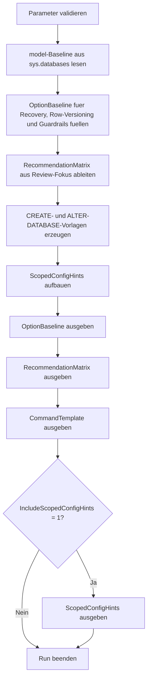

# DatabaseOptionBaseline.sql

Dieses Skript erstellt eine lesende Baseline fuer wichtige Datenbankoptionen neuer Datenbanken. Es vergleicht die `model`-Vorgaben mit optionalen Zielwerten und erzeugt daraus eine kompakte Review-Matrix sowie konkrete `ALTER DATABASE`-Vorlagen fuer den Bootstrap.

## Uebersicht

<!-- SQLDOC:SUMMARY_TABLE:BEGIN -->
| Feld | Wert |
|---|---|
| Script | [DatabaseOptionBaseline.sql](DatabaseOptionBaseline.sql) |
| Version | `1.0` |
| Typ | `template` |
| Kapitel | `20_Create_Database` |
| Sicherheit | `read-only` |
| Zweck | Leitet eine konservative Baseline wichtiger Datenbankoptionen fuer neue Datenbanken ab. |
<!-- SQLDOC:SUMMARY_TABLE:END -->

## Einordnung

Beim Anlegen neuer Datenbanken werden zentrale Optionen oft implizit von `model` geerbt oder spaeter uneinheitlich gesetzt. Das Skript macht diese Startwerte sichtbar und trennt bewusst zwischen Baseline, Review-Entscheidung und generierten Befehlsvorlagen.

## Annahmen

- Es handelt sich um eine didaktische Erstversion fuer Bootstrap- und Review-Zwecke, nicht um ein ausfuehrendes Deployment-Skript.
- Wenn keine Zielwerte ueber Parameter vorgegeben werden, dient die `model`-Datenbank als konservative Ausgangsbasis.
- Hinweise zu `DATABASE SCOPED CONFIGURATION` bleiben bewusst allgemein und erzeugen keine direkten Aenderungsbefehle.

## Anwendungsfall

Das Skript eignet sich fuer Schulung, Checklisten und Vorlagenpflege im Kapitel `20_Create_Database`. Es hilft dabei, Recovery Model, Row-Versioning, `PAGE_VERIFY` und Guardrails wie `AUTO_SHRINK` oder `AUTO_CLOSE` vor dem eigentlichen Datenbank-Setup strukturiert zu entscheiden.

## Parameter

<!-- SQLDOC:PARAMETERS_TABLE:BEGIN -->
| Parameter | SQL-Typ | Pflicht | Beschreibung |
|---|---|---|---|
| `@TargetDatabaseName` | `SYSNAME` | Nein | Name der neuen Datenbank fuer die generierten Vorlagen. |
| `@TargetRecoveryModel` | `NVARCHAR(20)` | Nein | Optionaler Zielwert fuer das Recovery Model; sonst `model`-Fallback. |
| `@EnableReadCommittedSnapshot` | `BIT` | Nein | Optionaler Zielwert fuer `READ_COMMITTED_SNAPSHOT`; sonst `model`-Fallback. |
| `@EnableSnapshotIsolation` | `BIT` | Nein | Optionaler Zielwert fuer `ALLOW_SNAPSHOT_ISOLATION`; sonst `model`-Fallback. |
| `@PageVerifyOption` | `NVARCHAR(20)` | Nein | Optionaler Zielwert fuer `PAGE_VERIFY`; sonst `model`-Fallback. |
| `@AutoShrinkDesired` | `BIT` | Nein | Optionaler Zielwert fuer `AUTO_SHRINK`; sonst `model`-Fallback. |
| `@IncludeScopedConfigHints` | `BIT` | Nein | Gibt bei `1` zusaetzliche Hinweise zu typischen Scoped-Configuration-Guardrails aus. |
<!-- SQLDOC:PARAMETERS_TABLE:END -->

## Abhaengigkeiten

<!-- SQLDOC:DEPENDENCIES_LIST:BEGIN -->
- `sys.databases`
- `tempdb` fuer temporaere Tabellen
- `CASE`
- `CONCAT`
- `QUOTENAME`
<!-- SQLDOC:DEPENDENCIES_LIST:END -->

## Hinweise

- `OptionBaseline` zeigt pro Option die `model`-Vorgabe, den aufgeloesten Zielwert und den Review-Fokus.
- `RecommendationMatrix` verdichtet die Baseline in priorisierte Entscheidungen fuer Bootstrap und Betrieb.
- `CommandTemplate` erzeugt nur Vorlagen und fuehrt keine `ALTER DATABASE`-Anweisungen aus.
- `ScopedConfigHints` dient als Anschluss fuer spaetere Performance- oder Kompatibilitaetsreviews.

## Versionshistorie

<!-- SQLDOC:VERSION_HISTORY_TABLE:BEGIN -->
| Version | Datum | User | Beschreibung |
|---|---|---|---|
| `1.0` | `2026-04-22` | `ER` | Erstversion der lesenden Baseline fuer wichtige Datenbankoptionen |
<!-- SQLDOC:VERSION_HISTORY_TABLE:END -->

## Ablauf

<!-- SQLDOC:MERMAID:BEGIN -->

<!-- SQLDOC:MERMAID:END -->

## SQL-Code

<!-- SQLDOC:SQL_CODE:BEGIN -->
```sql
/*
BEGIN:SQL-HEADER v1
---
sql_header: v1
script_name: "DatabaseOptionBaseline.sql"
script_version: "1.0"
script_type: "template"
chapter: "20_Create_Database"
purpose: >
  Erstellt eine lesende Baseline wichtiger Datenbankoptionen fuer neue
  Datenbanken, vergleicht die model-Vorgaben mit optionalen Zielwerten
  und generiert passende ALTER-DATABASE-Vorschlaege fuer den Bootstrap.

parameters:
  - name: "@TargetDatabaseName"
    sql_type: "SYSNAME"
    direction: "IN"
    required: false
    description: "Name der neu anzulegenden Datenbank fuer die generierten Befehlsvorlagen"
  - name: "@TargetRecoveryModel"
    sql_type: "NVARCHAR(20)"
    direction: "IN"
    required: false
    description: "Optionale Zielvorgabe fuer das Recovery Model; NULL uebernimmt die model-Baseline"
  - name: "@EnableReadCommittedSnapshot"
    sql_type: "BIT"
    direction: "IN"
    required: false
    description: "Optionale Zielvorgabe fuer READ_COMMITTED_SNAPSHOT; NULL uebernimmt die model-Baseline"
  - name: "@EnableSnapshotIsolation"
    sql_type: "BIT"
    direction: "IN"
    required: false
    description: "Optionale Zielvorgabe fuer ALLOW_SNAPSHOT_ISOLATION; NULL uebernimmt die model-Baseline"
  - name: "@PageVerifyOption"
    sql_type: "NVARCHAR(20)"
    direction: "IN"
    required: false
    description: "Optionale Zielvorgabe fuer PAGE_VERIFY; NULL uebernimmt die model-Baseline"
  - name: "@AutoShrinkDesired"
    sql_type: "BIT"
    direction: "IN"
    required: false
    description: "Optionale Zielvorgabe fuer AUTO_SHRINK; NULL uebernimmt die model-Baseline"
  - name: "@IncludeScopedConfigHints"
    sql_type: "BIT"
    direction: "IN"
    required: false
    description: "1 = zusaetzlich Hinweise zu typischen DATABASE SCOPED CONFIGURATION Guardrails ausgeben"

result_sets:
  - name: "OptionBaseline"
    description: "Vergleicht model-Baseline, Zielwert und Handlungsbedarf fuer wichtige Datenbankoptionen"
  - name: "RecommendationMatrix"
    description: "Leitet priorisierte Empfehlungen fuer Bootstrap und Review neuer Datenbanken ab"
  - name: "CommandTemplate"
    description: "Generiert CREATE- und ALTER-DATABASE-Vorlagen fuer die aufgeloeste Zielbaseline"
  - name: "ScopedConfigHints"
    description: "Optionale Hinweise auf haeufig gepruefte DATABASE SCOPED CONFIGURATION Defaults"

dependencies:
  - "sys.databases"
  - "tempdb temporary tables"
  - "CASE"
  - "CONCAT"
  - "QUOTENAME"

safety:
  level: "read-only"
  writes_data: false

documentation:
  markdown_file: "T-SQL/20_Create_Database/SQLScripts/DatabaseOptionBaseline.md"
  sync_blocks:
    - "SUMMARY_TABLE"
    - "PARAMETERS_TABLE"
    - "DEPENDENCIES_LIST"
    - "VERSION_HISTORY_TABLE"
    - "SQL_CODE"
  mermaid:
    mode: "ai-agent-from-sql"
    source: "script-body"

main_responsible:
  name: "Erhard Rainer"
  initials: "ER"

version_history:
  - version: "1.0"
    date: "2026-04-22"
    user: "ER"
    description: "Erstversion der lesenden Baseline fuer wichtige Datenbankoptionen"

notes:
  - "Das Skript erzeugt nur Vorlagen und Review-Ergebnisse, fuehrt aber keine CREATE- oder ALTER-DATABASE-Befehle aus."
  - "Wenn Zielwerte fehlen, wird konservativ auf die model-Datenbank als Bootstrap-Baseline zurueckgegriffen."
---
END:SQL-HEADER v1
*/

SET NOCOUNT ON;

-- 1. Parameter vorbereiten
DECLARE @TargetDatabaseName SYSNAME = N'TrainingOptionBaselineDemo';
DECLARE @TargetRecoveryModel NVARCHAR(20) = NULL;
DECLARE @EnableReadCommittedSnapshot BIT = NULL;
DECLARE @EnableSnapshotIsolation BIT = NULL;
DECLARE @PageVerifyOption NVARCHAR(20) = NULL;
DECLARE @AutoShrinkDesired BIT = NULL;
DECLARE @IncludeScopedConfigHints BIT = 1;

IF @TargetDatabaseName IS NULL OR LTRIM(RTRIM(@TargetDatabaseName)) = N''
BEGIN
    THROW 50000, '@TargetDatabaseName darf nicht leer sein.', 1;
END;

IF @TargetRecoveryModel IS NOT NULL
   AND UPPER(LTRIM(RTRIM(@TargetRecoveryModel))) NOT IN (N'FULL', N'SIMPLE', N'BULK_LOGGED')
BEGIN
    THROW 50001, '@TargetRecoveryModel muss FULL, SIMPLE oder BULK_LOGGED sein.', 1;
END;

IF @PageVerifyOption IS NOT NULL
   AND UPPER(LTRIM(RTRIM(@PageVerifyOption))) NOT IN (N'CHECKSUM', N'TORN_PAGE_DETECTION', N'NONE')
BEGIN
    THROW 50002, '@PageVerifyOption muss CHECKSUM, TORN_PAGE_DETECTION oder NONE sein.', 1;
END;

IF @EnableReadCommittedSnapshot IS NOT NULL
   AND @EnableReadCommittedSnapshot NOT IN (0, 1)
BEGIN
    THROW 50003, '@EnableReadCommittedSnapshot muss NULL, 0 oder 1 sein.', 1;
END;

IF @EnableSnapshotIsolation IS NOT NULL
   AND @EnableSnapshotIsolation NOT IN (0, 1)
BEGIN
    THROW 50004, '@EnableSnapshotIsolation muss NULL, 0 oder 1 sein.', 1;
END;

IF @AutoShrinkDesired IS NOT NULL
   AND @AutoShrinkDesired NOT IN (0, 1)
BEGIN
    THROW 50005, '@AutoShrinkDesired muss NULL, 0 oder 1 sein.', 1;
END;

IF @IncludeScopedConfigHints NOT IN (0, 1)
BEGIN
    THROW 50006, '@IncludeScopedConfigHints muss 0 oder 1 sein.', 1;
END;

DECLARE @ModelRecoveryModel NVARCHAR(20);
DECLARE @ModelReadCommittedSnapshot BIT;
DECLARE @ModelSnapshotIsolation BIT;
DECLARE @ModelPageVerifyOption NVARCHAR(20);
DECLARE @ModelAutoShrink BIT;

SELECT
    @ModelRecoveryModel = d.recovery_model_desc,
    @ModelReadCommittedSnapshot = d.is_read_committed_snapshot_on,
    @ModelSnapshotIsolation = d.snapshot_isolation_state,
    @ModelPageVerifyOption = d.page_verify_option_desc,
    @ModelAutoShrink = d.is_auto_shrink_on
FROM sys.databases AS d
WHERE d.name = N'model';

IF @ModelRecoveryModel IS NULL
BEGIN
    THROW 50007, 'Die model-Datenbank konnte nicht fuer die Options-Baseline gelesen werden.', 1;
END;

DROP TABLE IF EXISTS #OptionBaseline;
DROP TABLE IF EXISTS #RecommendationMatrix;
DROP TABLE IF EXISTS #CommandTemplate;
DROP TABLE IF EXISTS #ScopedConfigHints;

-- 2. Options-Baseline fuer neue Datenbanken aufbauen
CREATE TABLE #OptionBaseline
(
    OptionOrder INT NOT NULL,
    OptionName VARCHAR(60) NOT NULL,
    ModelBaseline VARCHAR(30) NOT NULL,
    TargetSetting VARCHAR(30) NOT NULL,
    BootstrapPhase VARCHAR(30) NOT NULL,
    SourceDetail VARCHAR(80) NOT NULL,
    ReviewFocus VARCHAR(220) NOT NULL,
    RecommendedAction VARCHAR(220) NOT NULL
);

INSERT INTO #OptionBaseline
(
    OptionOrder,
    OptionName,
    ModelBaseline,
    TargetSetting,
    BootstrapPhase,
    SourceDetail,
    ReviewFocus,
    RecommendedAction
)
VALUES
    (
        1,
        'Recovery model',
        @ModelRecoveryModel,
        COALESCE(UPPER(LTRIM(RTRIM(@TargetRecoveryModel))), @ModelRecoveryModel),
        'post-create',
        CASE WHEN @TargetRecoveryModel IS NULL THEN 'model fallback' ELSE 'explicit parameter' END,
        'Recovery Model steuert Log-Verhalten, Backup-Pflichten und Restore-Szenarien.',
        'Zielwert bewusst gegen Backup-Strategie und Log-Wachstum pruefen.'
    ),
    (
        2,
        'READ_COMMITTED_SNAPSHOT',
        CASE WHEN @ModelReadCommittedSnapshot = 1 THEN 'ON' ELSE 'OFF' END,
        CASE WHEN COALESCE(@EnableReadCommittedSnapshot, @ModelReadCommittedSnapshot) = 1 THEN 'ON' ELSE 'OFF' END,
        'post-create',
        CASE WHEN @EnableReadCommittedSnapshot IS NULL THEN 'model fallback' ELSE 'explicit parameter' END,
        'RCSI beeinflusst Standard-Read-Blocking und den TempDB-Verbrauch neuer Datenbanken.',
        'Nur aktivieren, wenn das Team Row-Versioning, TempDB-Folgen und Betriebsstandard mitdenkt.'
    ),
    (
        3,
        'ALLOW_SNAPSHOT_ISOLATION',
        CASE WHEN @ModelSnapshotIsolation = 1 THEN 'ON' ELSE 'OFF' END,
        CASE WHEN COALESCE(@EnableSnapshotIsolation, CASE WHEN @ModelSnapshotIsolation = 1 THEN 1 ELSE 0 END) = 1 THEN 'ON' ELSE 'OFF' END,
        'post-create',
        CASE WHEN @EnableSnapshotIsolation IS NULL THEN 'model fallback' ELSE 'explicit parameter' END,
        'Snapshot Isolation ist eine bewusste Anwendungs- und Konfliktentscheidung, nicht nur eine Schalterkopie.',
        'Mit RCSI, Schreibmustern und Konfliktbehandlung gemeinsam reviewen.'
    ),
    (
        4,
        'PAGE_VERIFY',
        @ModelPageVerifyOption,
        COALESCE(UPPER(LTRIM(RTRIM(@PageVerifyOption))), @ModelPageVerifyOption),
        'post-create',
        CASE WHEN @PageVerifyOption IS NULL THEN 'model fallback' ELSE 'explicit parameter' END,
        'PAGE_VERIFY gehoert zu den fruehen Guardrails fuer I/O-Integritaet und Fehlererkennung.',
        'Fuer neue Datenbanken konservativ CHECKSUM bevorzugen und Abweichungen begruenden.'
    ),
    (
        5,
        'AUTO_SHRINK',
        CASE WHEN @ModelAutoShrink = 1 THEN 'ON' ELSE 'OFF' END,
        CASE WHEN COALESCE(@AutoShrinkDesired, @ModelAutoShrink) = 1 THEN 'ON' ELSE 'OFF' END,
        'post-create',
        CASE WHEN @AutoShrinkDesired IS NULL THEN 'model fallback' ELSE 'explicit parameter' END,
        'AUTO_SHRINK ist fuer neue Datenbanken meist ein Anti-Pattern und sollte explizit bewertet werden.',
        'Im Regelfall OFF belassen und nur in klar dokumentierten Ausnahmefaellen aktivieren.'
    ),
    (
        6,
        'AUTO_CLOSE',
        CASE WHEN (SELECT d.is_auto_close_on FROM sys.databases AS d WHERE d.name = N'model') = 1 THEN 'ON' ELSE 'OFF' END,
        CASE WHEN (SELECT d.is_auto_close_on FROM sys.databases AS d WHERE d.name = N'model') = 1 THEN 'ON' ELSE 'OFF' END,
        'post-create',
        'model baseline only',
        'AUTO_CLOSE fuehrt in Trainings- und Produktivumgebungen haeufig zu unnoetigen Wiederanlaufkosten.',
        'Nur fuer Spezialfaelle akzeptieren; fuer normale Datenbanken OFF erwarten.'
    );

-- 3. Priorisierte Empfehlungen aus der Baseline ableiten
CREATE TABLE #RecommendationMatrix
(
    RecommendationOrder INT NOT NULL,
    Category VARCHAR(40) NOT NULL,
    OptionName VARCHAR(60) NOT NULL,
    PriorityLevel VARCHAR(10) NOT NULL,
    RecommendationText VARCHAR(260) NOT NULL,
    WhyItMatters VARCHAR(260) NOT NULL
);

INSERT INTO #RecommendationMatrix
(
    RecommendationOrder,
    Category,
    OptionName,
    PriorityLevel,
    RecommendationText,
    WhyItMatters
)
SELECT
    ob.OptionOrder,
    CASE
        WHEN ob.OptionName IN ('Recovery model', 'PAGE_VERIFY') THEN 'Core baseline'
        WHEN ob.OptionName IN ('READ_COMMITTED_SNAPSHOT', 'ALLOW_SNAPSHOT_ISOLATION') THEN 'Concurrency'
        ELSE 'Operational guardrail'
    END,
    ob.OptionName,
    CASE
        WHEN ob.OptionName IN ('Recovery model', 'PAGE_VERIFY', 'AUTO_SHRINK') THEN 'high'
        ELSE 'medium'
    END,
    CASE
        WHEN ob.OptionName = 'Recovery model' THEN 'Recovery Model im Bootstrap zusammen mit Backup- und Restore-Konzept freigeben.'
        WHEN ob.OptionName = 'READ_COMMITTED_SNAPSHOT' THEN 'RCSI nur mit bewusster Concurrency-Strategie und TempDB-Bewertung aktivieren.'
        WHEN ob.OptionName = 'ALLOW_SNAPSHOT_ISOLATION' THEN 'Snapshot Isolation nicht automatisch spiegeln, sondern als Applikationsentscheidung behandeln.'
        WHEN ob.OptionName = 'PAGE_VERIFY' THEN 'CHECKSUM fuer neue Datenbanken als Standard-Guardrail verankern.'
        WHEN ob.OptionName = 'AUTO_SHRINK' THEN 'AUTO_SHRINK fuer neue Datenbanken standardmaessig deaktiviert halten.'
        ELSE 'AUTO_CLOSE nur in seltenen Randfaellen zulassen und sonst explizit ablehnen.'
    END,
    ob.ReviewFocus
FROM #OptionBaseline AS ob;

-- 4. CREATE- und ALTER-DATABASE-Vorlagen generieren
CREATE TABLE #CommandTemplate
(
    CommandOrder INT NOT NULL,
    CommandName VARCHAR(80) NOT NULL,
    AppliesTo VARCHAR(80) NOT NULL,
    GeneratedCommand NVARCHAR(MAX) NOT NULL
);

INSERT INTO #CommandTemplate
(
    CommandOrder,
    CommandName,
    AppliesTo,
    GeneratedCommand
)
VALUES
    (
        1,
        'Create database skeleton',
        'Neue Datenbank',
        CONCAT(
            N'CREATE DATABASE ',
            QUOTENAME(@TargetDatabaseName),
            N';'
        )
    ),
    (
        2,
        'Recovery model baseline',
        'Nach CREATE DATABASE',
        CONCAT(
            N'ALTER DATABASE ',
            QUOTENAME(@TargetDatabaseName),
            N' SET RECOVERY ',
            (SELECT TOP (1) ob.TargetSetting FROM #OptionBaseline AS ob WHERE ob.OptionName = 'Recovery model'),
            N';'
        )
    ),
    (
        3,
        'Read committed snapshot baseline',
        'Nach CREATE DATABASE',
        CONCAT(
            N'ALTER DATABASE ',
            QUOTENAME(@TargetDatabaseName),
            N' SET READ_COMMITTED_SNAPSHOT ',
            (SELECT TOP (1) ob.TargetSetting FROM #OptionBaseline AS ob WHERE ob.OptionName = 'READ_COMMITTED_SNAPSHOT'),
            N';'
        )
    ),
    (
        4,
        'Snapshot isolation baseline',
        'Nach CREATE DATABASE',
        CONCAT(
            N'ALTER DATABASE ',
            QUOTENAME(@TargetDatabaseName),
            N' SET ALLOW_SNAPSHOT_ISOLATION ',
            CASE
                WHEN (SELECT TOP (1) ob.TargetSetting FROM #OptionBaseline AS ob WHERE ob.OptionName = 'ALLOW_SNAPSHOT_ISOLATION') = 'ON'
                    THEN N'ON'
                ELSE N'OFF'
            END,
            N';'
        )
    ),
    (
        5,
        'Page verify baseline',
        'Nach CREATE DATABASE',
        CONCAT(
            N'ALTER DATABASE ',
            QUOTENAME(@TargetDatabaseName),
            N' SET PAGE_VERIFY ',
            (SELECT TOP (1) ob.TargetSetting FROM #OptionBaseline AS ob WHERE ob.OptionName = 'PAGE_VERIFY'),
            N';'
        )
    ),
    (
        6,
        'Auto shrink guardrail',
        'Nach CREATE DATABASE',
        CONCAT(
            N'ALTER DATABASE ',
            QUOTENAME(@TargetDatabaseName),
            N' SET AUTO_SHRINK ',
            (SELECT TOP (1) ob.TargetSetting FROM #OptionBaseline AS ob WHERE ob.OptionName = 'AUTO_SHRINK'),
            N';'
        )
    ),
    (
        7,
        'Auto close guardrail',
        'Nach CREATE DATABASE',
        CONCAT(
            N'ALTER DATABASE ',
            QUOTENAME(@TargetDatabaseName),
            N' SET AUTO_CLOSE ',
            (SELECT TOP (1) ob.TargetSetting FROM #OptionBaseline AS ob WHERE ob.OptionName = 'AUTO_CLOSE'),
            N';'
        )
    );

-- 5. Optionale Hinweise zu DATABASE SCOPED CONFIGURATION bereitstellen
CREATE TABLE #ScopedConfigHints
(
    HintOrder INT NOT NULL,
    ConfigName VARCHAR(80) NOT NULL,
    SuggestedReview VARCHAR(220) NOT NULL,
    WhyItHelps VARCHAR(220) NOT NULL
);

INSERT INTO #ScopedConfigHints
(
    HintOrder,
    ConfigName,
    SuggestedReview,
    WhyItHelps
)
VALUES
    (
        1,
        'LEGACY_CARDINALITY_ESTIMATION',
        'Nur bei begruendetem Workload-Bedarf nach Query-Tuning und Regressionstests anfassen.',
        'Die Einstellung beeinflusst Planverhalten und sollte nicht unbemerkt in neue Datenbanken wandern.'
    ),
    (
        2,
        'QUERY_OPTIMIZER_HOTFIXES',
        'Bewusst mit Kompatibilitaetslevel und Teststrategie zusammen entscheiden.',
        'So bleibt nachvollziehbar, warum neue Datenbanken vom Standard abweichen.'
    ),
    (
        3,
        'MAXDOP',
        'Nur als datenbankspezifische Ausnahme statt als reflexartige Baseline setzen.',
        'Compute- und Parallelism-Entscheidungen gehoeren in das Betriebsprofil, nicht in einen unkommentierten Default.'
    );

-- 6. Ergebnisse ausgeben
SELECT
    ob.OptionOrder,
    ob.OptionName,
    ob.ModelBaseline,
    ob.TargetSetting,
    ob.BootstrapPhase,
    ob.SourceDetail,
    ob.ReviewFocus,
    ob.RecommendedAction
FROM #OptionBaseline AS ob
ORDER BY
    ob.OptionOrder;

SELECT
    rm.RecommendationOrder,
    rm.Category,
    rm.OptionName,
    rm.PriorityLevel,
    rm.RecommendationText,
    rm.WhyItMatters
FROM #RecommendationMatrix AS rm
ORDER BY
    rm.RecommendationOrder;

SELECT
    ct.CommandOrder,
    ct.CommandName,
    ct.AppliesTo,
    ct.GeneratedCommand
FROM #CommandTemplate AS ct
ORDER BY
    ct.CommandOrder;

IF @IncludeScopedConfigHints = 1
BEGIN
    SELECT
        sch.HintOrder,
        sch.ConfigName,
        sch.SuggestedReview,
        sch.WhyItHelps
    FROM #ScopedConfigHints AS sch
    ORDER BY
        sch.HintOrder;
END;
```
<!-- SQLDOC:SQL_CODE:END -->
