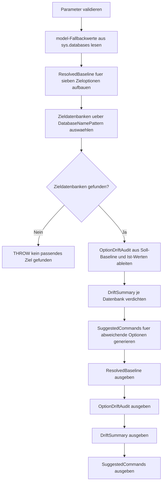

# DatabaseOptionDriftAudit.sql

Dieses Skript prueft Datenbanken gegen eine definierte Options-Baseline und macht Drift fuer typische `CREATE DATABASE`-Folgeeinstellungen sichtbar. Es verbindet eine lesende Bestandsaufnahme mit priorisierten Review-Hinweisen und generierten `ALTER DATABASE`-Vorlagen, ohne selbst Aenderungen auszufuehren.

## Uebersicht

<!-- SQLDOC:SUMMARY_TABLE:BEGIN -->
| Feld | Wert |
|---|---|
| Script | [DatabaseOptionDriftAudit.sql](DatabaseOptionDriftAudit.sql) |
| Version | `1.0` |
| Typ | `diagnostic-query` |
| Kapitel | `20_Create_Database` |
| Sicherheit | `read-only` |
| Zweck | Audit ueber Optionsdrift gegen eine definierte Datenbank-Baseline. |
<!-- SQLDOC:SUMMARY_TABLE:END -->

## Einordnung

Im Kapitel `20_Create_Database` geht es nicht nur um den ersten `CREATE DATABASE`-Befehl, sondern auch um die Folgeeinstellungen, die danach stabil bleiben sollen. Das Skript hilft dabei, vorhandene Datenbanken gegen einen expliziten Teamstandard oder gegen die `model`-Baseline zu spiegeln und daraus einen priorisierten Review abzuleiten.

## Annahmen

- Es handelt sich um ein lesendes Audit fuer Review und Schulung, nicht um ein ausfuehrendes Betriebs- oder Deployment-Skript.
- Wenn einzelne Sollwerte leer bleiben, kann das Skript sie optional aus der `model`-Datenbank ableiten.
- Ist `@UseModelAsFallback = 0`, wird fuer fehlende Sollwerte konservativ der aktuelle Ist-Wert je Datenbank als neutrale Baseline behandelt.
- Die generierten `ALTER DATABASE`-Befehle sind Vorlagen fuer Review und Freigabe, insbesondere bei `COMPATIBILITY_LEVEL`, `READ_COMMITTED_SNAPSHOT` und `ALLOW_SNAPSHOT_ISOLATION`.

## Anwendungsfall

Das Skript eignet sich fuer Baseline-Checks nach Provisionierung, fuer technische Schulungen und fuer Vorbereitungen auf Standardisierung oder Migration. Es zeigt zuerst die aufgeloeste Soll-Baseline, dann den Drift pro Datenbank und Option, verdichtet die Ergebnisse zu einer Review-Prioritaet und erzeugt schliesslich konkrete Befehlsvorlagen fuer die Abweichungen.

## Parameter

<!-- SQLDOC:PARAMETERS_TABLE:BEGIN -->
| Parameter | SQL-Typ | Pflicht | Beschreibung |
|---|---|---|---|
| `@DatabaseNamePattern` | `SYSNAME` | Nein | `LIKE`-Pattern fuer die zu pruefenden Datenbanken. |
| `@IncludeSystemDatabases` | `BIT` | Nein | Nimmt bei `1` auch Systemdatenbanken in die Pruefung auf. |
| `@UseModelAsFallback` | `BIT` | Nein | Leitet bei `1` fehlende Sollwerte aus `model` ab. |
| `@ExpectedRecoveryModel` | `NVARCHAR(20)` | Nein | Optionaler Sollwert fuer `RECOVERY`; sonst `model` oder Ist-Wert. |
| `@ExpectedCompatibilityLevel` | `INT` | Nein | Optionaler Sollwert fuer `COMPATIBILITY_LEVEL`. |
| `@ExpectedPageVerifyOption` | `NVARCHAR(30)` | Nein | Optionaler Sollwert fuer `PAGE_VERIFY`. |
| `@ExpectedAutoClose` | `BIT` | Nein | Optionaler Sollwert fuer `AUTO_CLOSE`. |
| `@ExpectedAutoShrink` | `BIT` | Nein | Optionaler Sollwert fuer `AUTO_SHRINK`. |
| `@ExpectedReadCommittedSnapshot` | `BIT` | Nein | Optionaler Sollwert fuer `READ_COMMITTED_SNAPSHOT`. |
| `@ExpectedAllowSnapshotIsolation` | `BIT` | Nein | Optionaler Sollwert fuer `ALLOW_SNAPSHOT_ISOLATION`. |
<!-- SQLDOC:PARAMETERS_TABLE:END -->

## Abhaengigkeiten

<!-- SQLDOC:DEPENDENCIES_LIST:BEGIN -->
- `sys.databases`
- `tempdb` fuer temporaere Tabellen
- `CASE`
- `CONCAT`
- `QUOTENAME`
<!-- SQLDOC:DEPENDENCIES_LIST:END -->

## Hinweise

- `ResolvedBaseline` macht transparent, ob ein Sollwert aus einem Parameter, aus `model` oder konservativ aus dem Ist-Zustand stammt.
- `OptionDriftAudit` listet pro Datenbank und Option Soll-Ist-Vergleich, Prioritaet und naechste Review-Aktion.
- `DriftSummary` hilft beim Sortieren der Datenbanken nach Handlungsbedarf.
- `SuggestedCommands` erzeugt nur Vorlagen; besonders Concurrency- und Compatibility-Aenderungen sollten vor der Umsetzung getestet werden.

## Versionshistorie

<!-- SQLDOC:VERSION_HISTORY_TABLE:BEGIN -->
| Version | Datum | User | Beschreibung |
|---|---|---|---|
| `1.0` | `2026-04-22` | `ER` | Erstversion des lesenden Drift-Audits fuer zentrale Datenbankoptionen |
<!-- SQLDOC:VERSION_HISTORY_TABLE:END -->

## Ablauf

<!-- SQLDOC:MERMAID:BEGIN -->

<!-- SQLDOC:MERMAID:END -->

## SQL-Code

<!-- SQLDOC:SQL_CODE:BEGIN -->
```sql
/*
BEGIN:SQL-HEADER v1
---
sql_header: v1
script_name: "DatabaseOptionDriftAudit.sql"
script_version: "1.0"
script_type: "diagnostic-query"
chapter: "20_Create_Database"
purpose: >
  Prueft Datenbanken gegen eine definierte Options-Baseline, zeigt
  Abweichungen fuer zentrale CREATE-DATABASE-Folgeeinstellungen und
  erzeugt passende Review- bzw. ALTER-DATABASE-Vorlagen.

parameters:
  - name: "@DatabaseNamePattern"
    sql_type: "SYSNAME"
    direction: "IN"
    required: false
    description: "LIKE-Pattern fuer die zu pruefenden Datenbanken"
  - name: "@IncludeSystemDatabases"
    sql_type: "BIT"
    direction: "IN"
    required: false
    description: "1 = systemeigene Datenbanken in die Pruefung aufnehmen"
  - name: "@UseModelAsFallback"
    sql_type: "BIT"
    direction: "IN"
    required: false
    description: "1 = fehlende Sollwerte aus der model-Datenbank ableiten"
  - name: "@ExpectedRecoveryModel"
    sql_type: "NVARCHAR(20)"
    direction: "IN"
    required: false
    description: "Optionaler Sollwert fuer RECOVERY; NULL verwendet model oder Ist-Wert als Baseline"
  - name: "@ExpectedCompatibilityLevel"
    sql_type: "INT"
    direction: "IN"
    required: false
    description: "Optionaler Sollwert fuer COMPATIBILITY_LEVEL"
  - name: "@ExpectedPageVerifyOption"
    sql_type: "NVARCHAR(30)"
    direction: "IN"
    required: false
    description: "Optionaler Sollwert fuer PAGE_VERIFY"
  - name: "@ExpectedAutoClose"
    sql_type: "BIT"
    direction: "IN"
    required: false
    description: "Optionaler Sollwert fuer AUTO_CLOSE"
  - name: "@ExpectedAutoShrink"
    sql_type: "BIT"
    direction: "IN"
    required: false
    description: "Optionaler Sollwert fuer AUTO_SHRINK"
  - name: "@ExpectedReadCommittedSnapshot"
    sql_type: "BIT"
    direction: "IN"
    required: false
    description: "Optionaler Sollwert fuer READ_COMMITTED_SNAPSHOT"
  - name: "@ExpectedAllowSnapshotIsolation"
    sql_type: "BIT"
    direction: "IN"
    required: false
    description: "Optionaler Sollwert fuer ALLOW_SNAPSHOT_ISOLATION"

result_sets:
  - name: "ResolvedBaseline"
    description: "Zeigt die aufgeloeste Soll-Baseline fuer jede gepruefte Option"
  - name: "OptionDriftAudit"
    description: "Listet pro Datenbank und Option Soll-Ist-Abweichungen mit Risikoeinordnung"
  - name: "DriftSummary"
    description: "Verdichtet Drift je Datenbank zu Prioritaet und Anzahl betroffener Optionen"
  - name: "SuggestedCommands"
    description: "Erzeugt ALTER-DATABASE-Vorlagen fuer abweichende Optionen"

dependencies:
  - "sys.databases"
  - "tempdb temporary tables"
  - "CASE"
  - "CONCAT"
  - "QUOTENAME"

safety:
  level: "read-only"
  writes_data: false

documentation:
  markdown_file: "T-SQL/20_Create_Database/SQLScripts/DatabaseOptionDriftAudit.md"
  sync_blocks:
    - "SUMMARY_TABLE"
    - "PARAMETERS_TABLE"
    - "DEPENDENCIES_LIST"
    - "VERSION_HISTORY_TABLE"
    - "SQL_CODE"
  mermaid:
    mode: "ai-agent-from-sql"
    source: "script-body"

main_responsible:
  name: "Erhard Rainer"
  initials: "ER"

version_history:
  - version: "1.0"
    date: "2026-04-22"
    user: "ER"
    description: "Erstversion des lesenden Drift-Audits fuer zentrale Datenbankoptionen"

notes:
  - "Fehlende Sollwerte werden optional aus der model-Datenbank aufgeloest, sonst konservativ aus dem Ist-Wert je Datenbank."
  - "Die generierten ALTER-DATABASE-Befehle sind Review-Vorlagen und werden nicht automatisch ausgefuehrt."
---
END:SQL-HEADER v1
*/

SET NOCOUNT ON;

-- 1. Parameter vorbereiten
DECLARE @DatabaseNamePattern SYSNAME = N'Training%';
DECLARE @IncludeSystemDatabases BIT = 0;
DECLARE @UseModelAsFallback BIT = 1;
DECLARE @ExpectedRecoveryModel NVARCHAR(20) = NULL;
DECLARE @ExpectedCompatibilityLevel INT = NULL;
DECLARE @ExpectedPageVerifyOption NVARCHAR(30) = NULL;
DECLARE @ExpectedAutoClose BIT = 0;
DECLARE @ExpectedAutoShrink BIT = 0;
DECLARE @ExpectedReadCommittedSnapshot BIT = NULL;
DECLARE @ExpectedAllowSnapshotIsolation BIT = NULL;

IF @DatabaseNamePattern IS NULL OR LTRIM(RTRIM(@DatabaseNamePattern)) = N''
BEGIN
    THROW 50000, '@DatabaseNamePattern darf nicht leer sein.', 1;
END;

IF @IncludeSystemDatabases NOT IN (0, 1)
BEGIN
    THROW 50001, '@IncludeSystemDatabases muss 0 oder 1 sein.', 1;
END;

IF @UseModelAsFallback NOT IN (0, 1)
BEGIN
    THROW 50002, '@UseModelAsFallback muss 0 oder 1 sein.', 1;
END;

IF @ExpectedRecoveryModel IS NOT NULL
   AND UPPER(LTRIM(RTRIM(@ExpectedRecoveryModel))) NOT IN (N'FULL', N'SIMPLE', N'BULK_LOGGED')
BEGIN
    THROW 50003, '@ExpectedRecoveryModel muss FULL, SIMPLE oder BULK_LOGGED sein.', 1;
END;

IF @ExpectedPageVerifyOption IS NOT NULL
   AND UPPER(LTRIM(RTRIM(@ExpectedPageVerifyOption))) NOT IN (N'CHECKSUM', N'TORN_PAGE_DETECTION', N'NONE')
BEGIN
    THROW 50004, '@ExpectedPageVerifyOption muss CHECKSUM, TORN_PAGE_DETECTION oder NONE sein.', 1;
END;

IF @ExpectedCompatibilityLevel IS NOT NULL
   AND @ExpectedCompatibilityLevel NOT BETWEEN 80 AND 180
BEGIN
    THROW 50005, '@ExpectedCompatibilityLevel muss zwischen 80 und 180 liegen.', 1;
END;

IF @ExpectedAutoClose IS NOT NULL
   AND @ExpectedAutoClose NOT IN (0, 1)
BEGIN
    THROW 50006, '@ExpectedAutoClose muss NULL, 0 oder 1 sein.', 1;
END;

IF @ExpectedAutoShrink IS NOT NULL
   AND @ExpectedAutoShrink NOT IN (0, 1)
BEGIN
    THROW 50007, '@ExpectedAutoShrink muss NULL, 0 oder 1 sein.', 1;
END;

IF @ExpectedReadCommittedSnapshot IS NOT NULL
   AND @ExpectedReadCommittedSnapshot NOT IN (0, 1)
BEGIN
    THROW 50008, '@ExpectedReadCommittedSnapshot muss NULL, 0 oder 1 sein.', 1;
END;

IF @ExpectedAllowSnapshotIsolation IS NOT NULL
   AND @ExpectedAllowSnapshotIsolation NOT IN (0, 1)
BEGIN
    THROW 50009, '@ExpectedAllowSnapshotIsolation muss NULL, 0 oder 1 sein.', 1;
END;

DECLARE @ModelRecoveryModel NVARCHAR(20);
DECLARE @ModelCompatibilityLevel INT;
DECLARE @ModelPageVerifyOption NVARCHAR(30);
DECLARE @ModelAutoClose BIT;
DECLARE @ModelAutoShrink BIT;
DECLARE @ModelReadCommittedSnapshot BIT;
DECLARE @ModelAllowSnapshotIsolation BIT;

SELECT
    @ModelRecoveryModel = d.recovery_model_desc,
    @ModelCompatibilityLevel = d.compatibility_level,
    @ModelPageVerifyOption = d.page_verify_option_desc,
    @ModelAutoClose = d.is_auto_close_on,
    @ModelAutoShrink = d.is_auto_shrink_on,
    @ModelReadCommittedSnapshot = d.is_read_committed_snapshot_on,
    @ModelAllowSnapshotIsolation = CASE WHEN d.snapshot_isolation_state = 1 THEN 1 ELSE 0 END
FROM sys.databases AS d
WHERE d.name = N'model';

IF @UseModelAsFallback = 1 AND @ModelRecoveryModel IS NULL
BEGIN
    THROW 50010, 'Die model-Datenbank konnte nicht fuer Fallback-Werte gelesen werden.', 1;
END;

DROP TABLE IF EXISTS #ResolvedBaseline;
DROP TABLE IF EXISTS #TargetDatabases;
DROP TABLE IF EXISTS #OptionDriftAudit;
DROP TABLE IF EXISTS #DriftSummary;
DROP TABLE IF EXISTS #SuggestedCommands;

-- 2. Aufgeloeste Soll-Baseline definieren
CREATE TABLE #ResolvedBaseline
(
    OptionOrder INT NOT NULL,
    OptionName VARCHAR(60) NOT NULL,
    ExpectedValue VARCHAR(40) NOT NULL,
    BaselineSource VARCHAR(80) NOT NULL,
    WhyRelevant VARCHAR(220) NOT NULL
);

INSERT INTO #ResolvedBaseline
(
    OptionOrder,
    OptionName,
    ExpectedValue,
    BaselineSource,
    WhyRelevant
)
VALUES
    (
        1,
        'RECOVERY',
        COALESCE(UPPER(LTRIM(RTRIM(@ExpectedRecoveryModel))), CASE WHEN @UseModelAsFallback = 1 THEN @ModelRecoveryModel ELSE '<per-db>' END),
        CASE
            WHEN @ExpectedRecoveryModel IS NOT NULL THEN 'explicit parameter'
            WHEN @UseModelAsFallback = 1 THEN 'model fallback'
            ELSE 'per-database current state'
        END,
        'Recovery Model beeinflusst Backup-Kette, Log-Wachstum und Restore-Strategie.'
    ),
    (
        2,
        'COMPATIBILITY_LEVEL',
        COALESCE(CONVERT(VARCHAR(10), @ExpectedCompatibilityLevel), CASE WHEN @UseModelAsFallback = 1 THEN CONVERT(VARCHAR(10), @ModelCompatibilityLevel) ELSE '<per-db>' END),
        CASE
            WHEN @ExpectedCompatibilityLevel IS NOT NULL THEN 'explicit parameter'
            WHEN @UseModelAsFallback = 1 THEN 'model fallback'
            ELSE 'per-database current state'
        END,
        'Das Compatibility Level steuert T-SQL-Verhalten und Teile des Optimizer-Verhaltens.'
    ),
    (
        3,
        'PAGE_VERIFY',
        COALESCE(UPPER(LTRIM(RTRIM(@ExpectedPageVerifyOption))), CASE WHEN @UseModelAsFallback = 1 THEN @ModelPageVerifyOption ELSE '<per-db>' END),
        CASE
            WHEN @ExpectedPageVerifyOption IS NOT NULL THEN 'explicit parameter'
            WHEN @UseModelAsFallback = 1 THEN 'model fallback'
            ELSE 'per-database current state'
        END,
        'PAGE_VERIFY ist ein frueher Guardrail fuer Integritaets- und I/O-Probleme.'
    ),
    (
        4,
        'AUTO_CLOSE',
        CASE
            WHEN @ExpectedAutoClose IS NOT NULL THEN CASE WHEN @ExpectedAutoClose = 1 THEN 'ON' ELSE 'OFF' END
            WHEN @UseModelAsFallback = 1 THEN CASE WHEN @ModelAutoClose = 1 THEN 'ON' ELSE 'OFF' END
            ELSE '<per-db>'
        END,
        CASE
            WHEN @ExpectedAutoClose IS NOT NULL THEN 'explicit parameter'
            WHEN @UseModelAsFallback = 1 THEN 'model fallback'
            ELSE 'per-database current state'
        END,
        'AUTO_CLOSE erzeugt haeufig unnoetige Wiederanlaeufe und sollte bewusst bewertet werden.'
    ),
    (
        5,
        'AUTO_SHRINK',
        CASE
            WHEN @ExpectedAutoShrink IS NOT NULL THEN CASE WHEN @ExpectedAutoShrink = 1 THEN 'ON' ELSE 'OFF' END
            WHEN @UseModelAsFallback = 1 THEN CASE WHEN @ModelAutoShrink = 1 THEN 'ON' ELSE 'OFF' END
            ELSE '<per-db>'
        END,
        CASE
            WHEN @ExpectedAutoShrink IS NOT NULL THEN 'explicit parameter'
            WHEN @UseModelAsFallback = 1 THEN 'model fallback'
            ELSE 'per-database current state'
        END,
        'AUTO_SHRINK ist meist ein Anti-Pattern und signalisiert haeufig instabile Kapazitaetsplanung.'
    ),
    (
        6,
        'READ_COMMITTED_SNAPSHOT',
        CASE
            WHEN @ExpectedReadCommittedSnapshot IS NOT NULL THEN CASE WHEN @ExpectedReadCommittedSnapshot = 1 THEN 'ON' ELSE 'OFF' END
            WHEN @UseModelAsFallback = 1 THEN CASE WHEN @ModelReadCommittedSnapshot = 1 THEN 'ON' ELSE 'OFF' END
            ELSE '<per-db>'
        END,
        CASE
            WHEN @ExpectedReadCommittedSnapshot IS NOT NULL THEN 'explicit parameter'
            WHEN @UseModelAsFallback = 1 THEN 'model fallback'
            ELSE 'per-database current state'
        END,
        'RCSI beeinflusst Blocking-Verhalten und TempDB-Verbrauch.'
    ),
    (
        7,
        'ALLOW_SNAPSHOT_ISOLATION',
        CASE
            WHEN @ExpectedAllowSnapshotIsolation IS NOT NULL THEN CASE WHEN @ExpectedAllowSnapshotIsolation = 1 THEN 'ON' ELSE 'OFF' END
            WHEN @UseModelAsFallback = 1 THEN CASE WHEN @ModelAllowSnapshotIsolation = 1 THEN 'ON' ELSE 'OFF' END
            ELSE '<per-db>'
        END,
        CASE
            WHEN @ExpectedAllowSnapshotIsolation IS NOT NULL THEN 'explicit parameter'
            WHEN @UseModelAsFallback = 1 THEN 'model fallback'
            ELSE 'per-database current state'
        END,
        'Snapshot Isolation ist eine bewusste Concurrency-Entscheidung und kein stiller Default.'
    );

-- 3. Zielmenge der Datenbanken bestimmen
CREATE TABLE #TargetDatabases
(
    DatabaseName SYSNAME NOT NULL,
    DatabaseId INT NOT NULL,
    RecoveryModel VARCHAR(20) NOT NULL,
    CompatibilityLevel INT NOT NULL,
    PageVerifyOption VARCHAR(30) NOT NULL,
    AutoCloseValue VARCHAR(3) NOT NULL,
    AutoShrinkValue VARCHAR(3) NOT NULL,
    ReadCommittedSnapshotValue VARCHAR(3) NOT NULL,
    AllowSnapshotIsolationValue VARCHAR(3) NOT NULL
);

INSERT INTO #TargetDatabases
(
    DatabaseName,
    DatabaseId,
    RecoveryModel,
    CompatibilityLevel,
    PageVerifyOption,
    AutoCloseValue,
    AutoShrinkValue,
    ReadCommittedSnapshotValue,
    AllowSnapshotIsolationValue
)
SELECT
    d.name,
    d.database_id,
    d.recovery_model_desc,
    d.compatibility_level,
    d.page_verify_option_desc,
    CASE WHEN d.is_auto_close_on = 1 THEN 'ON' ELSE 'OFF' END,
    CASE WHEN d.is_auto_shrink_on = 1 THEN 'ON' ELSE 'OFF' END,
    CASE WHEN d.is_read_committed_snapshot_on = 1 THEN 'ON' ELSE 'OFF' END,
    CASE WHEN d.snapshot_isolation_state = 1 THEN 'ON' ELSE 'OFF' END
FROM sys.databases AS d
WHERE d.name LIKE @DatabaseNamePattern
  AND (@IncludeSystemDatabases = 1 OR d.database_id > 4);

IF NOT EXISTS (SELECT 1 FROM #TargetDatabases)
BEGIN
    THROW 50011, 'Keine Datenbanken fuer das angegebene Pattern gefunden.', 1;
END;

-- 4. Drift je Option und Datenbank ableiten
CREATE TABLE #OptionDriftAudit
(
    DatabaseName SYSNAME NOT NULL,
    OptionOrder INT NOT NULL,
    OptionName VARCHAR(60) NOT NULL,
    ExpectedValue VARCHAR(40) NOT NULL,
    ActualValue VARCHAR(40) NOT NULL,
    BaselineSource VARCHAR(80) NOT NULL,
    DriftStatus VARCHAR(12) NOT NULL,
    Severity VARCHAR(10) NOT NULL,
    WhyItMatters VARCHAR(220) NOT NULL,
    SuggestedAction VARCHAR(260) NOT NULL
);

INSERT INTO #OptionDriftAudit
(
    DatabaseName,
    OptionOrder,
    OptionName,
    ExpectedValue,
    ActualValue,
    BaselineSource,
    DriftStatus,
    Severity,
    WhyItMatters,
    SuggestedAction
)
SELECT
    td.DatabaseName,
    rb.OptionOrder,
    rb.OptionName,
    CASE
        WHEN rb.ExpectedValue = '<per-db>' AND rb.OptionName = 'RECOVERY' THEN td.RecoveryModel
        WHEN rb.ExpectedValue = '<per-db>' AND rb.OptionName = 'COMPATIBILITY_LEVEL' THEN CONVERT(VARCHAR(40), td.CompatibilityLevel)
        WHEN rb.ExpectedValue = '<per-db>' AND rb.OptionName = 'PAGE_VERIFY' THEN td.PageVerifyOption
        WHEN rb.ExpectedValue = '<per-db>' AND rb.OptionName = 'AUTO_CLOSE' THEN td.AutoCloseValue
        WHEN rb.ExpectedValue = '<per-db>' AND rb.OptionName = 'AUTO_SHRINK' THEN td.AutoShrinkValue
        WHEN rb.ExpectedValue = '<per-db>' AND rb.OptionName = 'READ_COMMITTED_SNAPSHOT' THEN td.ReadCommittedSnapshotValue
        WHEN rb.ExpectedValue = '<per-db>' AND rb.OptionName = 'ALLOW_SNAPSHOT_ISOLATION' THEN td.AllowSnapshotIsolationValue
        ELSE rb.ExpectedValue
    END AS ExpectedValue,
    CASE rb.OptionName
        WHEN 'RECOVERY' THEN td.RecoveryModel
        WHEN 'COMPATIBILITY_LEVEL' THEN CONVERT(VARCHAR(40), td.CompatibilityLevel)
        WHEN 'PAGE_VERIFY' THEN td.PageVerifyOption
        WHEN 'AUTO_CLOSE' THEN td.AutoCloseValue
        WHEN 'AUTO_SHRINK' THEN td.AutoShrinkValue
        WHEN 'READ_COMMITTED_SNAPSHOT' THEN td.ReadCommittedSnapshotValue
        WHEN 'ALLOW_SNAPSHOT_ISOLATION' THEN td.AllowSnapshotIsolationValue
    END AS ActualValue,
    rb.BaselineSource,
    CASE
        WHEN
            CASE rb.OptionName
                WHEN 'RECOVERY' THEN td.RecoveryModel
                WHEN 'COMPATIBILITY_LEVEL' THEN CONVERT(VARCHAR(40), td.CompatibilityLevel)
                WHEN 'PAGE_VERIFY' THEN td.PageVerifyOption
                WHEN 'AUTO_CLOSE' THEN td.AutoCloseValue
                WHEN 'AUTO_SHRINK' THEN td.AutoShrinkValue
                WHEN 'READ_COMMITTED_SNAPSHOT' THEN td.ReadCommittedSnapshotValue
                WHEN 'ALLOW_SNAPSHOT_ISOLATION' THEN td.AllowSnapshotIsolationValue
            END
            =
            CASE
                WHEN rb.ExpectedValue = '<per-db>' AND rb.OptionName = 'RECOVERY' THEN td.RecoveryModel
                WHEN rb.ExpectedValue = '<per-db>' AND rb.OptionName = 'COMPATIBILITY_LEVEL' THEN CONVERT(VARCHAR(40), td.CompatibilityLevel)
                WHEN rb.ExpectedValue = '<per-db>' AND rb.OptionName = 'PAGE_VERIFY' THEN td.PageVerifyOption
                WHEN rb.ExpectedValue = '<per-db>' AND rb.OptionName = 'AUTO_CLOSE' THEN td.AutoCloseValue
                WHEN rb.ExpectedValue = '<per-db>' AND rb.OptionName = 'AUTO_SHRINK' THEN td.AutoShrinkValue
                WHEN rb.ExpectedValue = '<per-db>' AND rb.OptionName = 'READ_COMMITTED_SNAPSHOT' THEN td.ReadCommittedSnapshotValue
                WHEN rb.ExpectedValue = '<per-db>' AND rb.OptionName = 'ALLOW_SNAPSHOT_ISOLATION' THEN td.AllowSnapshotIsolationValue
                ELSE rb.ExpectedValue
            END
            THEN 'aligned'
        ELSE 'drift'
    END AS DriftStatus,
    CASE
        WHEN rb.OptionName IN ('RECOVERY', 'PAGE_VERIFY', 'AUTO_SHRINK') THEN 'high'
        WHEN rb.OptionName IN ('COMPATIBILITY_LEVEL', 'READ_COMMITTED_SNAPSHOT', 'ALLOW_SNAPSHOT_ISOLATION') THEN 'medium'
        ELSE 'low'
    END AS Severity,
    rb.WhyRelevant,
    CASE rb.OptionName
        WHEN 'RECOVERY' THEN 'Recovery Model gegen Backup- und Restore-Konzept pruefen.'
        WHEN 'COMPATIBILITY_LEVEL' THEN 'Kompatibilitaetslevel gegen Engine-Version und Regressionstests abstimmen.'
        WHEN 'PAGE_VERIFY' THEN 'PAGE_VERIFY moeglichst auf CHECKSUM standardisieren.'
        WHEN 'AUTO_CLOSE' THEN 'AUTO_CLOSE nur in klaren Ausnahmefaellen eingeschaltet lassen.'
        WHEN 'AUTO_SHRINK' THEN 'AUTO_SHRINK standardmaessig deaktivieren und Growth getrennt planen.'
        WHEN 'READ_COMMITTED_SNAPSHOT' THEN 'RCSI nur mit bewusstem TempDB- und Blocking-Modell freigeben.'
        ELSE 'Snapshot Isolation als Anwendungsentscheidung dokumentieren.'
    END AS SuggestedAction
FROM #TargetDatabases AS td
CROSS JOIN #ResolvedBaseline AS rb;

-- 5. Drift pro Datenbank verdichten
CREATE TABLE #DriftSummary
(
    DatabaseName SYSNAME NOT NULL,
    DriftedOptions INT NOT NULL,
    HighSeverityDrift INT NOT NULL,
    MediumSeverityDrift INT NOT NULL,
    ReviewPriority VARCHAR(10) NOT NULL,
    ReviewRecommendation VARCHAR(260) NOT NULL
);

INSERT INTO #DriftSummary
(
    DatabaseName,
    DriftedOptions,
    HighSeverityDrift,
    MediumSeverityDrift,
    ReviewPriority,
    ReviewRecommendation
)
SELECT
    oda.DatabaseName,
    SUM(CASE WHEN oda.DriftStatus = 'drift' THEN 1 ELSE 0 END) AS DriftedOptions,
    SUM(CASE WHEN oda.DriftStatus = 'drift' AND oda.Severity = 'high' THEN 1 ELSE 0 END) AS HighSeverityDrift,
    SUM(CASE WHEN oda.DriftStatus = 'drift' AND oda.Severity = 'medium' THEN 1 ELSE 0 END) AS MediumSeverityDrift,
    CASE
        WHEN SUM(CASE WHEN oda.DriftStatus = 'drift' AND oda.Severity = 'high' THEN 1 ELSE 0 END) > 0 THEN 'high'
        WHEN SUM(CASE WHEN oda.DriftStatus = 'drift' AND oda.Severity = 'medium' THEN 1 ELSE 0 END) > 0 THEN 'medium'
        ELSE 'low'
    END AS ReviewPriority,
    CASE
        WHEN SUM(CASE WHEN oda.DriftStatus = 'drift' THEN 1 ELSE 0 END) = 0 THEN 'Keine Abweichung gegen die aufgeloeste Baseline festgestellt.'
        WHEN SUM(CASE WHEN oda.DriftStatus = 'drift' AND oda.Severity = 'high' THEN 1 ELSE 0 END) > 0 THEN 'Zuerst Recovery, PAGE_VERIFY oder AUTO_SHRINK aufloesen und danach Nebenoptionen reviewen.'
        ELSE 'Optionen mit mittlerer Prioritaet gegen Teamstandard und model-Baseline abgleichen.'
    END AS ReviewRecommendation
FROM #OptionDriftAudit AS oda
GROUP BY
    oda.DatabaseName;

-- 6. ALTER-DATABASE-Vorlagen fuer Drift erzeugen
CREATE TABLE #SuggestedCommands
(
    DatabaseName SYSNAME NOT NULL,
    CommandOrder INT NOT NULL,
    OptionName VARCHAR(60) NOT NULL,
    GeneratedCommand NVARCHAR(MAX) NOT NULL,
    CommandNote VARCHAR(220) NOT NULL
);

INSERT INTO #SuggestedCommands
(
    DatabaseName,
    CommandOrder,
    OptionName,
    GeneratedCommand,
    CommandNote
)
SELECT
    oda.DatabaseName,
    oda.OptionOrder,
    oda.OptionName,
    CASE oda.OptionName
        WHEN 'RECOVERY' THEN CONCAT(N'ALTER DATABASE ', QUOTENAME(oda.DatabaseName), N' SET RECOVERY ', oda.ExpectedValue, N';')
        WHEN 'COMPATIBILITY_LEVEL' THEN CONCAT(N'ALTER DATABASE ', QUOTENAME(oda.DatabaseName), N' SET COMPATIBILITY_LEVEL = ', oda.ExpectedValue, N';')
        WHEN 'PAGE_VERIFY' THEN CONCAT(N'ALTER DATABASE ', QUOTENAME(oda.DatabaseName), N' SET PAGE_VERIFY ', oda.ExpectedValue, N';')
        WHEN 'AUTO_CLOSE' THEN CONCAT(N'ALTER DATABASE ', QUOTENAME(oda.DatabaseName), N' SET AUTO_CLOSE ', oda.ExpectedValue, N';')
        WHEN 'AUTO_SHRINK' THEN CONCAT(N'ALTER DATABASE ', QUOTENAME(oda.DatabaseName), N' SET AUTO_SHRINK ', oda.ExpectedValue, N';')
        WHEN 'READ_COMMITTED_SNAPSHOT' THEN CONCAT(N'ALTER DATABASE ', QUOTENAME(oda.DatabaseName), N' SET READ_COMMITTED_SNAPSHOT ', oda.ExpectedValue, N';')
        WHEN 'ALLOW_SNAPSHOT_ISOLATION' THEN CONCAT(N'ALTER DATABASE ', QUOTENAME(oda.DatabaseName), N' SET ALLOW_SNAPSHOT_ISOLATION ', oda.ExpectedValue, N';')
    END AS GeneratedCommand,
    CASE
        WHEN oda.OptionName IN ('READ_COMMITTED_SNAPSHOT', 'ALLOW_SNAPSHOT_ISOLATION') THEN 'Concurrency-Optionen vor Umsetzung mit Workload und Session-Strategie reviewen.'
        WHEN oda.OptionName = 'COMPATIBILITY_LEVEL' THEN 'Kompatibilitaetswechsel vorab mit Regressionstests absichern.'
        ELSE 'Befehl ist als Review-Vorlage gedacht und wird vom Skript nicht ausgefuehrt.'
    END AS CommandNote
FROM #OptionDriftAudit AS oda
WHERE oda.DriftStatus = 'drift'
ORDER BY
    oda.DatabaseName,
    oda.OptionOrder;

-- 7. Resultsets ausgeben
SELECT
    rb.OptionOrder,
    rb.OptionName,
    rb.ExpectedValue,
    rb.BaselineSource,
    rb.WhyRelevant
FROM #ResolvedBaseline AS rb
ORDER BY
    rb.OptionOrder;

SELECT
    oda.DatabaseName,
    oda.OptionOrder,
    oda.OptionName,
    oda.ExpectedValue,
    oda.ActualValue,
    oda.BaselineSource,
    oda.DriftStatus,
    oda.Severity,
    oda.WhyItMatters,
    oda.SuggestedAction
FROM #OptionDriftAudit AS oda
ORDER BY
    oda.DatabaseName,
    oda.OptionOrder;

SELECT
    ds.DatabaseName,
    ds.DriftedOptions,
    ds.HighSeverityDrift,
    ds.MediumSeverityDrift,
    ds.ReviewPriority,
    ds.ReviewRecommendation
FROM #DriftSummary AS ds
ORDER BY
    ds.ReviewPriority DESC,
    ds.DriftedOptions DESC,
    ds.DatabaseName;

SELECT
    sc.DatabaseName,
    sc.CommandOrder,
    sc.OptionName,
    sc.GeneratedCommand,
    sc.CommandNote
FROM #SuggestedCommands AS sc
ORDER BY
    sc.DatabaseName,
    sc.CommandOrder;
```
<!-- SQLDOC:SQL_CODE:END -->
