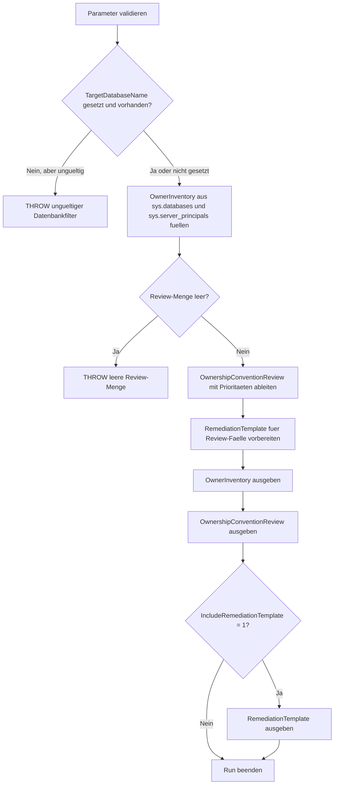

# DatabaseOwnerReview.sql

Dieses Skript inventarisiert Datenbank-Owner fuer einzelne oder mehrere Datenbanken und spiegelt sie gegen einfache Besitzkonventionen. Es bleibt rein lesend, macht Owner-Abweichungen sichtbar und erzeugt auf Wunsch nur Vorlagen fuer spaetere `ALTER AUTHORIZATION`-Schritte.

## Uebersicht

<!-- SQLDOC:SUMMARY_TABLE:BEGIN -->
| Feld | Wert |
|---|---|
| Script | [DatabaseOwnerReview.sql](DatabaseOwnerReview.sql) |
| Version | `1.0` |
| Typ | `diagnostic-query` |
| Kapitel | `20_Create_Database` |
| Sicherheit | `read-only` |
| Zweck | Prueft DB-Owner, Namenskonventionen und Soll-Ist-Abweichungen fuer Bootstrap und Betriebsreview. |
<!-- SQLDOC:SUMMARY_TABLE:END -->

## Einordnung

Beim Erstellen oder Uebernehmen einer Datenbank bleibt der Owner haeufig implizit gesetzt. Das erschwert spaetere Verantwortungsklaerung, Security-Reviews und standardisierte Betriebsdokumentation. Das Skript konzentriert sich deshalb auf Transparenz: Welcher Login ist Owner, ist er aktiv, passt er zur Konvention und weicht er von einem gewuenschten Zielbild ab.

## Annahmen

- Die Erstversion arbeitet ausschliesslich lesend gegen `sys.databases` und `sys.server_principals`.
- Ohne expliziten Soll-Owner wird keine produktive Zielvorgabe erfunden; das Skript liefert dann vor allem Inventar und Review-Hinweise.
- Das voreingestellte Muster `svc[_]sql%` ist ein didaktischer Platzhalter fuer Servicekonto-Konventionen und kann bei Bedarf deaktiviert oder ersetzt werden.
- Systemdatenbanken bleiben standardmaessig ausgeschlossen, weil der Fokus auf Review und Bootstrap benutzerdefinierter Datenbanken liegt.

## Anwendungsfall

Das erste Resultset liefert das Owner-Inventar mit Typ, Aktivstatus und Zielbild. Das zweite Resultset priorisiert Review-Faelle wie nicht aufloesbare SIDs, deaktivierte Logins oder Konventionsabweichungen. Optional erzeugt das dritte Resultset vorbereitete `ALTER AUTHORIZATION`-Befehle fuer eine spaetere, bewusst freigegebene Anpassung.

## Parameter

<!-- SQLDOC:PARAMETERS_TABLE:BEGIN -->
| Parameter | SQL-Typ | Pflicht | Beschreibung |
|---|---|---|---|
| `@TargetDatabaseName` | `SYSNAME` | Nein | Optionaler Name einer einzelnen Datenbank; `NULL` prueft alle benutzerdefinierten Datenbanken. |
| `@ExpectedOwner` | `SYSNAME` | Nein | Optionaler Soll-Owner; ohne Wert bleibt die Sicht konservativ und inventarisierend. |
| `@PreferredOwnerPattern` | `NVARCHAR(128)` | Nein | Optionales `LIKE`-Muster fuer bevorzugte Owner-Namen, etwa `N'svc[_]sql%'`. |
| `@IncludeSystemDatabases` | `BIT` | Nein | Nimmt bei `1` auch Systemdatenbanken in die Review auf. |
| `@IncludeRemediationTemplate` | `BIT` | Nein | Gibt bei `1` zusaetzliche `ALTER AUTHORIZATION`-Vorlagen aus. |
<!-- SQLDOC:PARAMETERS_TABLE:END -->

## Abhaengigkeiten

<!-- SQLDOC:DEPENDENCIES_LIST:BEGIN -->
- `sys.databases`
- `sys.server_principals`
- `SUSER_SNAME`
- `tempdb` fuer temporaere Tabellen
- `CASE`
- `CONCAT`
- `QUOTENAME`
<!-- SQLDOC:DEPENDENCIES_LIST:END -->

## Hinweise

- `OwnerInventory` zeigt pro Datenbank Owner, Logintyp, Aktivstatus, Pattern-Status und die begruendete Review-Einschaetzung.
- `OwnershipConventionReview` priorisiert Owner-Faelle nach Aufloesbarkeit, Soll-Ist-Abweichung und Konventionspassung.
- `RemediationTemplate` fuehrt keine Aenderung aus; die generierten Befehle sind bewusst nur Vorlagen fuer einen spaeteren Freigabeschritt.

## Versionshistorie

<!-- SQLDOC:VERSION_HISTORY_TABLE:BEGIN -->
| Version | Datum | User | Beschreibung |
|---|---|---|---|
| `1.0` | `2026-04-22` | `ER` | Erstversion der lesenden Review fuer DB-Owner und Besitzkonventionen |
<!-- SQLDOC:VERSION_HISTORY_TABLE:END -->

## Ablauf

<!-- SQLDOC:MERMAID:BEGIN -->

<!-- SQLDOC:MERMAID:END -->

## SQL-Code

<!-- SQLDOC:SQL_CODE:BEGIN -->
```sql
/*
BEGIN:SQL-HEADER v1
---
sql_header: v1
script_name: "DatabaseOwnerReview.sql"
script_version: "1.0"
script_type: "diagnostic-query"
chapter: "20_Create_Database"
purpose: >
  Prueft den Datenbank-Owner fuer eine Ziel- oder Review-Menge von
  Datenbanken und vergleicht den Ist-Zustand mit einfachen
  Besitzkonventionen. Das Skript arbeitet rein lesend gegen
  Katalogsichten und erzeugt Review-Hinweise sowie optionale
  Remediation-Vorlagen.

parameters:
  - name: "@TargetDatabaseName"
    sql_type: "SYSNAME"
    direction: "IN"
    required: false
    description: "Optionaler Name einer einzelnen Datenbank; NULL prueft alle benutzerdefinierten Datenbanken"
  - name: "@ExpectedOwner"
    sql_type: "SYSNAME"
    direction: "IN"
    required: false
    description: "Optionaler Soll-Owner; NULL nutzt den aktuell ermittelten Owner als reine Inventarsicht"
  - name: "@PreferredOwnerPattern"
    sql_type: "NVARCHAR(128)"
    direction: "IN"
    required: false
    description: "Optionales LIKE-Muster fuer bevorzugte Owner-Namen, zum Beispiel N'svc[_]sql%'"
  - name: "@IncludeSystemDatabases"
    sql_type: "BIT"
    direction: "IN"
    required: false
    description: "1 = Systemdatenbanken in die Review aufnehmen"
  - name: "@IncludeRemediationTemplate"
    sql_type: "BIT"
    direction: "IN"
    required: false
    description: "1 = ALTER AUTHORIZATION-Vorlagen fuer Abweichungen ausgeben"

result_sets:
  - name: "OwnerInventory"
    description: "Inventarisiert aktuelle DB-Owner inklusive Typ, Aktivitaet und Zielbild"
  - name: "OwnershipConventionReview"
    description: "Leitet priorisierte Review-Hinweise fuer Owner-Konventionen und Sonderfaelle ab"
  - name: "RemediationTemplate"
    description: "Erzeugt optionale ALTER AUTHORIZATION-Vorlagen fuer Owner-Anpassungen"

dependencies:
  - "sys.databases"
  - "sys.server_principals"
  - "SUSER_SNAME"
  - "tempdb temporary tables"
  - "CASE"
  - "CONCAT"
  - "QUOTENAME"

safety:
  level: "read-only"
  writes_data: false

documentation:
  markdown_file: "T-SQL/20_Create_Database/SQLScripts/DatabaseOwnerReview.md"
  sync_blocks:
    - "SUMMARY_TABLE"
    - "PARAMETERS_TABLE"
    - "DEPENDENCIES_LIST"
    - "VERSION_HISTORY_TABLE"
    - "SQL_CODE"
  mermaid:
    mode: "ai-agent-from-sql"
    source: "script-body"

main_responsible:
  name: "Erhard Rainer"
  initials: "ER"

version_history:
  - version: "1.0"
    date: "2026-04-22"
    user: "ER"
    description: "Erstversion der lesenden Review fuer DB-Owner und Besitzkonventionen"

notes:
  - "Das Skript aendert keine Owner, sondern erzeugt nur Review- und Befehlsvorlagen."
  - "Ohne expliziten Soll-Owner bleibt die Bewertung konservativ und fokussiert auf Transparenz sowie Konventionsabweichungen."
---
END:SQL-HEADER v1
*/

SET NOCOUNT ON;

-- 1. Parameter vorbereiten
DECLARE @TargetDatabaseName SYSNAME = NULL;
DECLARE @ExpectedOwner SYSNAME = NULL;
DECLARE @PreferredOwnerPattern NVARCHAR(128) = N'svc[_]sql%';
DECLARE @IncludeSystemDatabases BIT = 0;
DECLARE @IncludeRemediationTemplate BIT = 1;

IF @TargetDatabaseName IS NOT NULL
   AND LTRIM(RTRIM(@TargetDatabaseName)) = N''
BEGIN
    THROW 50000, '@TargetDatabaseName darf nicht leer sein.', 1;
END;

IF @ExpectedOwner IS NOT NULL
   AND LTRIM(RTRIM(@ExpectedOwner)) = N''
BEGIN
    THROW 50001, '@ExpectedOwner darf nicht leer sein.', 1;
END;

IF @PreferredOwnerPattern IS NOT NULL
   AND LTRIM(RTRIM(@PreferredOwnerPattern)) = N''
BEGIN
    SET @PreferredOwnerPattern = NULL;
END;

IF @IncludeSystemDatabases NOT IN (0, 1)
BEGIN
    THROW 50002, '@IncludeSystemDatabases muss 0 oder 1 sein.', 1;
END;

IF @IncludeRemediationTemplate NOT IN (0, 1)
BEGIN
    THROW 50003, '@IncludeRemediationTemplate muss 0 oder 1 sein.', 1;
END;

IF @TargetDatabaseName IS NOT NULL
   AND DB_ID(@TargetDatabaseName) IS NULL
BEGIN
    THROW 50004, '@TargetDatabaseName wurde auf dieser Instanz nicht gefunden.', 1;
END;

DROP TABLE IF EXISTS #OwnerInventory;
DROP TABLE IF EXISTS #OwnershipConventionReview;
DROP TABLE IF EXISTS #RemediationTemplate;

-- 2. Owner-Inventar aus sys.databases und sys.server_principals aufbauen
CREATE TABLE #OwnerInventory
(
    InventoryOrder INT NOT NULL,
    DatabaseName SYSNAME NOT NULL,
    DatabaseState VARCHAR(60) NOT NULL,
    RecoveryModel VARCHAR(20) NOT NULL,
    CurrentOwner SYSNAME NOT NULL,
    OwnerType VARCHAR(60) NOT NULL,
    OwnerDisabled BIT NOT NULL,
    TargetOwner SYSNAME NOT NULL,
    PatternStatus VARCHAR(20) NOT NULL,
    ReviewStatus VARCHAR(20) NOT NULL,
    WhyItMatters VARCHAR(260) NOT NULL
);

INSERT INTO #OwnerInventory
(
    InventoryOrder,
    DatabaseName,
    DatabaseState,
    RecoveryModel,
    CurrentOwner,
    OwnerType,
    OwnerDisabled,
    TargetOwner,
    PatternStatus,
    ReviewStatus,
    WhyItMatters
)
SELECT
    ROW_NUMBER() OVER (ORDER BY d.database_id) AS InventoryOrder,
    d.name AS DatabaseName,
    d.state_desc AS DatabaseState,
    d.recovery_model_desc AS RecoveryModel,
    COALESCE(SUSER_SNAME(d.owner_sid), N'<unresolved>') AS CurrentOwner,
    COALESCE(sp.type_desc, 'UNKNOWN') AS OwnerType,
    COALESCE(sp.is_disabled, 0) AS OwnerDisabled,
    COALESCE(@ExpectedOwner, COALESCE(SUSER_SNAME(d.owner_sid), N'<review explicitly>')) AS TargetOwner,
    CASE
        WHEN @PreferredOwnerPattern IS NULL THEN 'not-set'
        WHEN COALESCE(SUSER_SNAME(d.owner_sid), N'') LIKE @PreferredOwnerPattern THEN 'aligned'
        ELSE 'review'
    END AS PatternStatus,
    CASE
        WHEN @ExpectedOwner IS NOT NULL
             AND COALESCE(SUSER_SNAME(d.owner_sid), N'<unresolved>') <> @ExpectedOwner THEN 'change'
        WHEN sp.is_disabled = 1 THEN 'review'
        WHEN COALESCE(sp.type_desc, 'UNKNOWN') IN ('SQL_LOGIN', 'WINDOWS_LOGIN', 'WINDOWS_GROUP') THEN 'aligned'
        ELSE 'review'
    END AS ReviewStatus,
    CASE
        WHEN SUSER_SNAME(d.owner_sid) IS NULL THEN 'Owner SID konnte nicht zu einem Login aufgeloest werden und sollte vor Betriebsuebergabe geklaert werden.'
        WHEN sp.is_disabled = 1 THEN 'Ein deaktivierter Owner erschwert klare Verantwortlichkeit und sollte bewusst bewertet werden.'
        WHEN @ExpectedOwner IS NOT NULL
             AND COALESCE(SUSER_SNAME(d.owner_sid), N'<unresolved>') <> @ExpectedOwner THEN 'Der aktuelle Owner weicht vom Sollbild ab und sollte vor produktiver Nutzung geklaert werden.'
        WHEN @PreferredOwnerPattern IS NOT NULL
             AND COALESCE(SUSER_SNAME(d.owner_sid), N'') NOT LIKE @PreferredOwnerPattern THEN 'Der Owner passt nicht zur bevorzugten Namenskonvention und sollte bewusst begruendet werden.'
        ELSE 'Owner-Zuordnung ist transparent und kann als Referenz fuer Bootstrap und Betriebsdokumentation dienen.'
    END AS WhyItMatters
FROM sys.databases AS d
LEFT JOIN sys.server_principals AS sp
    ON sp.sid = d.owner_sid
WHERE
    (@TargetDatabaseName IS NULL OR d.name = @TargetDatabaseName)
    AND (@IncludeSystemDatabases = 1 OR d.database_id > 4);

IF NOT EXISTS (SELECT 1 FROM #OwnerInventory)
BEGIN
    THROW 50005, 'Die Review-Menge ist leer; pruefe Filter und Sichtbarkeit der Datenbanken.', 1;
END;

-- 3. Review-Matrix fuer Besitzkonventionen ableiten
CREATE TABLE #OwnershipConventionReview
(
    ReviewOrder INT NOT NULL,
    PriorityLevel VARCHAR(10) NOT NULL,
    DatabaseName SYSNAME NOT NULL,
    Concern VARCHAR(100) NOT NULL,
    ReviewStatus VARCHAR(20) NOT NULL,
    WhyItMatters VARCHAR(260) NOT NULL,
    RecommendedAction VARCHAR(260) NOT NULL
);

INSERT INTO #OwnershipConventionReview
(
    ReviewOrder,
    PriorityLevel,
    DatabaseName,
    Concern,
    ReviewStatus,
    WhyItMatters,
    RecommendedAction
)
SELECT
    oi.InventoryOrder,
    CASE
        WHEN oi.CurrentOwner = N'<unresolved>' OR oi.ReviewStatus = 'change' THEN 'high'
        WHEN oi.OwnerDisabled = 1 OR oi.PatternStatus = 'review' THEN 'medium'
        ELSE 'low'
    END AS PriorityLevel,
    oi.DatabaseName,
    CASE
        WHEN oi.CurrentOwner = N'<unresolved>' THEN 'Owner resolution'
        WHEN oi.ReviewStatus = 'change' THEN 'Expected owner mismatch'
        WHEN oi.OwnerDisabled = 1 THEN 'Disabled owner login'
        WHEN oi.PatternStatus = 'review' THEN 'Owner naming convention'
        ELSE 'Owner transparency'
    END AS Concern,
    oi.ReviewStatus,
    oi.WhyItMatters,
    CASE
        WHEN oi.CurrentOwner = N'<unresolved>' THEN 'Owner explizit festlegen und SID-Aufloesung vor dem naechsten Deployment pruefen.'
        WHEN oi.ReviewStatus = 'change' THEN CONCAT('Soll-Owner fuer ', oi.DatabaseName, ' dokumentieren und anschliessend per ALTER AUTHORIZATION angleichen.')
        WHEN oi.OwnerDisabled = 1 THEN 'Deaktivierten Owner nur mit begruendeter Betriebsregel behalten oder auf ein aktives Servicekonto ueberfuehren.'
        WHEN oi.PatternStatus = 'review' THEN 'Konventionsabweichung als Ausnahme dokumentieren oder auf das bevorzugte Owner-Muster vereinheitlichen.'
        ELSE 'Owner als Baseline in die Bootstrap- und Betriebsdokumentation uebernehmen.'
    END AS RecommendedAction
FROM #OwnerInventory AS oi;

-- 4. Optionale Remediation-Vorlagen erzeugen
CREATE TABLE #RemediationTemplate
(
    TemplateOrder INT NOT NULL,
    DatabaseName SYSNAME NOT NULL,
    AppliesWhen VARCHAR(140) NOT NULL,
    GeneratedCommand NVARCHAR(MAX) NOT NULL
);

INSERT INTO #RemediationTemplate
(
    TemplateOrder,
    DatabaseName,
    AppliesWhen,
    GeneratedCommand
)
SELECT
    oi.InventoryOrder,
    oi.DatabaseName,
    CASE
        WHEN @ExpectedOwner IS NOT NULL AND oi.CurrentOwner <> @ExpectedOwner THEN 'Soll-Owner ist gesetzt und weicht vom Ist-Zustand ab'
        WHEN oi.CurrentOwner = N'<unresolved>' THEN 'Owner konnte nicht aufgeloest werden'
        ELSE 'Owner soll aktiv vereinheitlicht oder dokumentiert werden'
    END AS AppliesWhen,
    CONCAT(
        N'ALTER AUTHORIZATION ON DATABASE::',
        QUOTENAME(oi.DatabaseName),
        N' TO ',
        QUOTENAME(
            CASE
                WHEN @ExpectedOwner IS NOT NULL THEN @ExpectedOwner
                WHEN oi.CurrentOwner = N'<unresolved>' THEN N'review_owner'
                ELSE oi.CurrentOwner
            END
        ),
        N';'
    ) AS GeneratedCommand
FROM #OwnerInventory AS oi
WHERE
    oi.ReviewStatus IN ('change', 'review')
    OR oi.PatternStatus = 'review';

-- 5. Resultsets ausgeben
SELECT
    oi.InventoryOrder,
    oi.DatabaseName,
    oi.DatabaseState,
    oi.RecoveryModel,
    oi.CurrentOwner,
    oi.OwnerType,
    oi.OwnerDisabled,
    oi.TargetOwner,
    oi.PatternStatus,
    oi.ReviewStatus,
    oi.WhyItMatters
FROM #OwnerInventory AS oi
ORDER BY
    oi.InventoryOrder;

SELECT
    ocr.ReviewOrder,
    ocr.PriorityLevel,
    ocr.DatabaseName,
    ocr.Concern,
    ocr.ReviewStatus,
    ocr.WhyItMatters,
    ocr.RecommendedAction
FROM #OwnershipConventionReview AS ocr
ORDER BY
    CASE ocr.PriorityLevel
        WHEN 'high' THEN 1
        WHEN 'medium' THEN 2
        ELSE 3
    END,
    ocr.ReviewOrder;

IF @IncludeRemediationTemplate = 1
BEGIN
    SELECT
        rt.TemplateOrder,
        rt.DatabaseName,
        rt.AppliesWhen,
        rt.GeneratedCommand
    FROM #RemediationTemplate AS rt
    ORDER BY
        rt.TemplateOrder;
END;
```
<!-- SQLDOC:SQL_CODE:END -->
