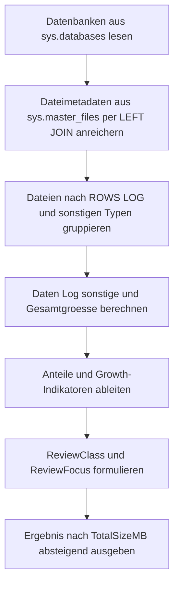

# DatabaseSizeInventory.sql

Dieses Skript liefert eine serverweite Groessenuebersicht aller Datenbanken auf Basis der aktuell zugewiesenen SQL-Server-Dateien. Es trennt Daten-, Log- und sonstige Dateien, damit CREATE-DATABASE-nahe Fragen zu Initialgroesse, Wachstum und Dateilayout schnell eingeordnet werden koennen.

## Uebersicht

<!-- SQLDOC:SUMMARY_TABLE:BEGIN -->
| Feld | Wert |
|---|---|
| Script | [DatabaseSizeInventory.sql](DatabaseSizeInventory.sql) |
| Version | `1.0` |
| Typ | `diagnostic-query` |
| Kapitel | `20_Create_Database` |
| Sicherheit | `read-only` |
| Zweck | Ermittelt die aktuell zugewiesene Dateigroesse aller Datenbanken der Instanz aus sys.databases und sys.master_files und trennt Daten-, Log- und sonstige Dateitypen fuer eine schnelle Groessenuebersicht. |
<!-- SQLDOC:SUMMARY_TABLE:END -->

## Einordnung

Die Abfrage misst die zugewiesene Dateigroesse aus `sys.master_files`. Das ist die physische Groessenperspektive der Datenbankdateien, nicht die tatsaechlich belegte Nutzdatenmenge innerhalb einzelner Dateien. Fuer Speicherplanung, Review von Autogrowth und grobe Instanzinventare ist diese Sicht ein guter Startpunkt.

## Annahmen

- Die Auswertung bleibt rein lesend und nutzt nur Instanzmetadaten.
- Offline-Datenbanken werden aufgefuehrt, wenn ihre Dateimetadaten sichtbar sind.
- Prozentuales Wachstum und ungewoehnlich grosse Logdateien werden als Review-Hinweise markiert, aber nicht automatisch bewertet.
- Fuer freien Platz innerhalb der Datenfiles waeren datenbankspezifische Zusatzabfragen noetig.

## Parameter

<!-- SQLDOC:PARAMETERS_TABLE:BEGIN -->
Dieses Skript hat keine Parameter.
<!-- SQLDOC:PARAMETERS_TABLE:END -->

## Abhaengigkeiten

<!-- SQLDOC:DEPENDENCIES_LIST:BEGIN -->
- `sys.databases`
- `sys.master_files`
- `CASE`
- `NULLIF`
- aggregate functions
<!-- SQLDOC:DEPENDENCIES_LIST:END -->

## Hinweise

- `TotalSizeMB` ist die Summe aller sichtbaren Datenbankdateien.
- `DataSizeMB` umfasst Dateien mit `type_desc = 'ROWS'`.
- `LogSizeMB` umfasst Dateien mit `type_desc = 'LOG'`.
- `ReviewClass` ist eine schnelle Sortierhilfe fuer Nachpruefungen, keine automatische Handlungsempfehlung.

## Versionshistorie

<!-- SQLDOC:VERSION_HISTORY_TABLE:BEGIN -->
| Version | Datum | User | Beschreibung |
|---|---|---|---|
| `1.0` | `2026-05-11` | `ER` | Erstversion der serverweiten Datenbankgroessen-Uebersicht |
<!-- SQLDOC:VERSION_HISTORY_TABLE:END -->

## Ablauf

<!-- SQLDOC:MERMAID:BEGIN -->

<!-- SQLDOC:MERMAID:END -->

## SQL-Code

<!-- SQLDOC:SQL_CODE:BEGIN -->
```sql
/*
BEGIN:SQL-HEADER v1
---
sql_header: v1
script_name: "DatabaseSizeInventory.sql"
script_version: "1.0"
script_type: "diagnostic-query"
chapter: "20_Create_Database"
purpose: >
  Ermittelt die aktuell zugewiesene Dateigroesse aller Datenbanken der
  Instanz aus sys.databases und sys.master_files und trennt Daten-,
  Log- und sonstige Dateitypen fuer eine schnelle Groessenuebersicht.

parameters: []

result_sets:
  - name: "DatabaseSizeInventory"
    description: "Eine Zeile pro Datenbank mit Daten-, Log-, sonstiger und gesamter Dateigroesse"

dependencies:
  - "sys.databases"
  - "sys.master_files"
  - "CASE"
  - "NULLIF"
  - "aggregate functions"

safety:
  level: "read-only"
  writes_data: false

documentation:
  markdown_file: "T-SQL/20_Create_Database/SQLScripts/DatabaseSizeInventory.md"
  sync_blocks:
    - "SUMMARY_TABLE"
    - "PARAMETERS_TABLE"
    - "DEPENDENCIES_LIST"
    - "VERSION_HISTORY_TABLE"
    - "SQL_CODE"
  mermaid:
    mode: "ai-agent-from-sql"
    source: "script-body"

main_responsible:
  name: "Erhard Rainer"
  initials: "ER"

version_history:
  - version: "1.0"
    date: "2026-05-11"
    user: "ER"
    description: "Erstversion der serverweiten Datenbankgroessen-Uebersicht"

notes:
  - "Die Groesse basiert auf aktuell zugewiesenen Dateien in sys.master_files, nicht auf belegten Datenbankseiten."
  - "Offline-Datenbanken koennen enthalten sein, sofern Dateimetadaten in sys.master_files sichtbar sind."
---
END:SQL-HEADER v1
*/

SET NOCOUNT ON;

-- 1. Datenbank- und Dateimetadaten aus der Instanzsicht sammeln
;WITH DatabaseFileInventory AS
(
    SELECT
        d.database_id AS DatabaseId,
        d.name AS DatabaseName,
        d.state_desc AS StateDesc,
        d.recovery_model_desc AS RecoveryModelDesc,
        d.user_access_desc AS UserAccessDesc,
        d.compatibility_level AS CompatibilityLevel,
        d.source_database_id AS SourceDatabaseId,
        mf.file_id AS FileId,
        mf.type_desc AS FileType,
        CAST(COALESCE(mf.size, 0) / 128.0 AS DECIMAL(18, 2)) AS SizeMB,
        CASE
            WHEN mf.max_size = -1 THEN NULL
            WHEN mf.max_size IS NULL THEN NULL
            ELSE CAST(mf.max_size / 128.0 AS DECIMAL(18, 2))
        END AS MaxSizeMB,
        CASE
            WHEN mf.file_id IS NOT NULL AND mf.is_percent_growth = 1 THEN 1
            ELSE 0
        END AS IsPercentGrowth,
        CASE
            WHEN mf.file_id IS NOT NULL AND mf.growth = 0 THEN 1
            ELSE 0
        END AS IsFixedSize
    FROM sys.databases AS d
    LEFT JOIN sys.master_files AS mf
        ON mf.database_id = d.database_id
),
DatabaseSizeSummary AS
(
    SELECT
        dfi.DatabaseId,
        dfi.DatabaseName,
        dfi.StateDesc,
        dfi.RecoveryModelDesc,
        dfi.UserAccessDesc,
        dfi.CompatibilityLevel,
        dfi.SourceDatabaseId,
        COUNT(dfi.FileId) AS FileCount,
        SUM(CASE WHEN dfi.FileType = 'ROWS' THEN 1 ELSE 0 END) AS DataFileCount,
        SUM(CASE WHEN dfi.FileType = 'LOG' THEN 1 ELSE 0 END) AS LogFileCount,
        SUM(CASE WHEN dfi.FileType NOT IN ('ROWS', 'LOG') AND dfi.FileType IS NOT NULL THEN 1 ELSE 0 END) AS OtherFileCount,
        SUM(CASE WHEN dfi.FileType = 'ROWS' THEN dfi.SizeMB ELSE 0 END) AS DataSizeMB,
        SUM(CASE WHEN dfi.FileType = 'LOG' THEN dfi.SizeMB ELSE 0 END) AS LogSizeMB,
        SUM(CASE WHEN dfi.FileType NOT IN ('ROWS', 'LOG') AND dfi.FileType IS NOT NULL THEN dfi.SizeMB ELSE 0 END) AS OtherSizeMB,
        SUM(dfi.SizeMB) AS TotalSizeMB,
        MAX(dfi.SizeMB) AS LargestFileMB,
        SUM(dfi.IsPercentGrowth) AS PercentGrowthFileCount,
        SUM(dfi.IsFixedSize) AS FixedSizeFileCount,
        MAX(dfi.MaxSizeMB) AS LargestConfiguredMaxMB
    FROM DatabaseFileInventory AS dfi
    GROUP BY
        dfi.DatabaseId,
        dfi.DatabaseName,
        dfi.StateDesc,
        dfi.RecoveryModelDesc,
        dfi.UserAccessDesc,
        dfi.CompatibilityLevel,
        dfi.SourceDatabaseId
)
-- 2. Groessen, Anteile und einfache Review-Hinweise ausgeben
SELECT
    dss.DatabaseName,
    dss.DatabaseId,
    dss.StateDesc,
    dss.RecoveryModelDesc,
    dss.UserAccessDesc,
    dss.CompatibilityLevel,
    CASE
        WHEN dss.SourceDatabaseId IS NULL THEN NULL
        ELSE DB_NAME(dss.SourceDatabaseId)
    END AS SnapshotSourceDatabase,
    dss.FileCount,
    dss.DataFileCount,
    dss.LogFileCount,
    dss.OtherFileCount,
    CAST(dss.DataSizeMB AS DECIMAL(18, 2)) AS DataSizeMB,
    CAST(dss.LogSizeMB AS DECIMAL(18, 2)) AS LogSizeMB,
    CAST(dss.OtherSizeMB AS DECIMAL(18, 2)) AS OtherSizeMB,
    CAST(dss.TotalSizeMB AS DECIMAL(18, 2)) AS TotalSizeMB,
    CAST(dss.TotalSizeMB / 1024.0 AS DECIMAL(18, 3)) AS TotalSizeGB,
    CAST((dss.DataSizeMB * 100.0) / NULLIF(dss.TotalSizeMB, 0) AS DECIMAL(9, 2)) AS DataSharePct,
    CAST((dss.LogSizeMB * 100.0) / NULLIF(dss.TotalSizeMB, 0) AS DECIMAL(9, 2)) AS LogSharePct,
    CAST(dss.LargestFileMB AS DECIMAL(18, 2)) AS LargestFileMB,
    dss.PercentGrowthFileCount,
    dss.FixedSizeFileCount,
    dss.LargestConfiguredMaxMB,
    CASE
        WHEN dss.StateDesc <> 'ONLINE' THEN 'state-not-online'
        WHEN dss.FileCount = 0 THEN 'no-files-visible'
        WHEN dss.PercentGrowthFileCount > 0 THEN 'review-percent-growth'
        WHEN dss.DataSizeMB > 0 AND dss.LogSizeMB > dss.DataSizeMB THEN 'log-larger-than-data'
        ELSE 'baseline'
    END AS ReviewClass,
    CASE
        WHEN dss.StateDesc <> 'ONLINE' THEN 'Datenbank ist nicht ONLINE; die Groesse stammt nur aus sichtbaren Metadaten.'
        WHEN dss.FileCount = 0 THEN 'Keine Dateimetadaten sichtbar; Berechtigungen und Datenbankzustand pruefen.'
        WHEN dss.PercentGrowthFileCount > 0 THEN 'Mindestens eine Datei nutzt Prozentwachstum; feste MB-Werte sind fuer Groessenplanung meist stabiler.'
        WHEN dss.DataSizeMB > 0 AND dss.LogSizeMB > dss.DataSizeMB THEN 'Die Logdateien sind groesser als die Datendateien; Recovery-Modell, Log-Backups und Wachstumshistorie pruefen.'
        ELSE 'Groessenverteilung zeigt in dieser Uebersicht keinen unmittelbaren Review-Hinweis.'
    END AS ReviewFocus
FROM DatabaseSizeSummary AS dss
ORDER BY
    dss.TotalSizeMB DESC,
    dss.DatabaseName;
```
<!-- SQLDOC:SQL_CODE:END -->
