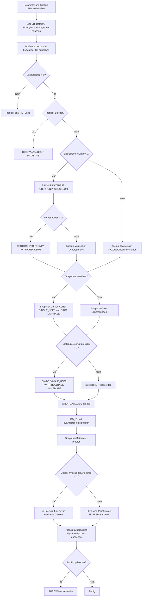

# DropDatabaseWithBackupAndValidation.sql

Dieses Skript loescht eine SQL-Server-Datenbank kontrolliert. Es sammelt vorab Metadaten, Dateien, aktive Sitzungen und Snapshots, erstellt optional ein COPY_ONLY-Backup, fuehrt `DROP DATABASE` aus und prueft danach Katalogeintraege sowie die zuvor ermittelten physischen Dateien.

## Uebersicht

<!-- SQLDOC:SUMMARY_TABLE:BEGIN -->
| Feld | Wert |
|---|---|
| Script | [DropDatabaseWithBackupAndValidation.sql](DropDatabaseWithBackupAndValidation.sql) |
| Version | `1.0` |
| Typ | `admin-change` |
| Kapitel | `20_Create_Database` |
| Sicherheit | `admin-change` |
| Zweck | Kontrolliertes Loeschen einer Datenbank mit Preflight, optionalem Backup und Nachkontrolle. |
<!-- SQLDOC:SUMMARY_TABLE:END -->

## Einordnung

`DROP DATABASE` ist eine administrative und destruktive Operation. Das Skript setzt deshalb standardmaessig `@ExecuteDrop = 0` und gibt zuerst nur die Pruefresultsets aus. Erst wenn Zielname, Bestaetigungsname, Backup-Optionen und weitere Schutzbedingungen passen, kann mit `@ExecuteDrop = 1` geloescht werden.

## Annahmen

- Das Skript wird in SQL Server beziehungsweise einer kompatiblen T-SQL-Umgebung mit ausreichenden Rechten fuer Backup, ALTER DATABASE und DROP DATABASE ausgefuehrt.
- Die Ziel-Datenbank soll online sein. Offline- oder Restoring-Datenbanken werden blockiert, weil physische Dateien dabei eher uebrig bleiben koennen.
- `@BackupDirectory` ist ein Verzeichnis, in das der SQL-Server-Dienst schreiben darf.
- Die physische Dateipruefung nutzt `master.dbo.xp_fileexist`; wenn diese Prozedur nicht verfuegbar oder nicht erlaubt ist, bleibt die Metadatenpruefung trotzdem erhalten.

## Anwendungsfall

Der typische Ablauf ist zweistufig: Zuerst die Parameter setzen und mit `@ExecuteDrop = 0` die Resultsets lesen. Danach denselben Lauf mit `@ExecuteDrop = 1` wiederholen, wenn Backup-Pfad, Zielname, aktive Sitzungen und Snapshot-Situation bewusst akzeptiert sind.

## Parameter

<!-- SQLDOC:PARAMETERS_TABLE:BEGIN -->
| Parameter | SQL-Typ | Pflicht | Beschreibung |
|---|---|---|---|
| `@TargetDatabaseName` | `SYSNAME` | Ja | Name der zu loeschenden Datenbank. |
| `@ConfirmDatabaseName` | `SYSNAME` | Ja | Muss exakt dem Zielnamen entsprechen. |
| `@ExecuteDrop` | `BIT` | Ja | `0` = nur Preflight, `1` = Backup und `DROP DATABASE` ausfuehren. |
| `@BackupBeforeDrop` | `BIT` | Nein | `1` erstellt vor dem Loeschen ein COPY_ONLY-Backup. |
| `@BackupDirectory` | `NVARCHAR(4000)` | Nein | Zielverzeichnis fuer die Sicherung; erforderlich bei `@BackupBeforeDrop = 1`. |
| `@BackupFileName` | `NVARCHAR(260)` | Nein | Optionaler Backup-Dateiname; `NULL` erzeugt einen Namen aus DB-Name und Zeitstempel. |
| `@VerifyBackup` | `BIT` | Nein | `1` fuehrt nach dem Backup `RESTORE VERIFYONLY WITH CHECKSUM` aus. |
| `@SetSingleUserBeforeDrop` | `BIT` | Nein | `1` setzt die DB vor dem Drop auf `SINGLE_USER WITH ROLLBACK IMMEDIATE`. |
| `@CheckPhysicalFilesAfterDrop` | `BIT` | Nein | `1` prueft die zuvor ermittelten Dateipfade nach dem Drop mit `xp_fileexist`. |
| `@DropDatabaseSnapshots` | `BIT` | Nein | `1` loescht gefundene Datenbank-Snapshots vor der Ziel-Datenbank. |
<!-- SQLDOC:PARAMETERS_TABLE:END -->

## Abhaengigkeiten

<!-- SQLDOC:DEPENDENCIES_LIST:BEGIN -->
- `sys.databases`
- `sys.master_files`
- `sys.sysprocesses`
- `sys.sp_executesql`
- `BACKUP DATABASE`
- `RESTORE VERIFYONLY`
- `ALTER DATABASE`
- `DROP DATABASE`
- `master.dbo.xp_fileexist`
- `tempdb temporary tables`
<!-- SQLDOC:DEPENDENCIES_LIST:END -->

## Hinweise

- Das Skript fuehrt kein explizites Transaktionswrapping um `DROP DATABASE` aus, weil diese Operation nicht als normale, rueckrollbare DML-Aktion behandelt werden kann.
- Wenn Snapshots existieren, blockiert der Preflight, solange `@DropDatabaseSnapshots = 0` ist.
- Wenn Dateien nach dem Drop physisch noch vorhanden sind, meldet die Nachkontrolle einen `BLOCKER`; die Datenbank ist dann zwar ggf. aus SQL Server entfernt, aber die Dateiebene muss separat geprueft werden.

## Versionshistorie

<!-- SQLDOC:VERSION_HISTORY_TABLE:BEGIN -->
| Version | Datum | User | Beschreibung |
|---|---|---|---|
| `1.0` | `2026-05-11` | `ER` | Erstversion fuer kontrolliertes DROP DATABASE mit optionalem Backup und Nachkontrolle |
<!-- SQLDOC:VERSION_HISTORY_TABLE:END -->

## Ablauf

<!-- SQLDOC:MERMAID:BEGIN -->

<!-- SQLDOC:MERMAID:END -->

## SQL-Code

<!-- SQLDOC:SQL_CODE:BEGIN -->
```sql
/*
BEGIN:SQL-HEADER v1
---
sql_header: v1
script_name: "DropDatabaseWithBackupAndValidation.sql"
script_version: "1.0"
script_type: "admin-change"
chapter: "20_Create_Database"
purpose: >
  Loescht eine SQL-Server-Datenbank kontrolliert mit Preflight-Pruefungen,
  optionalem COPY_ONLY-Backup, Metadatenkontrolle und physischer
  Dateipruefung nach DROP DATABASE.

parameters:
  - name: "@TargetDatabaseName"
    sql_type: "SYSNAME"
    direction: "IN"
    required: true
    description: "Name der zu loeschenden Datenbank"
  - name: "@ConfirmDatabaseName"
    sql_type: "SYSNAME"
    direction: "IN"
    required: true
    description: "Muss exakt dem Zielnamen entsprechen, damit versehentliches Loeschen verhindert wird"
  - name: "@ExecuteDrop"
    sql_type: "BIT"
    direction: "IN"
    required: true
    description: "0 = nur Preflight ausgeben, 1 = Backup und DROP DATABASE ausfuehren"
  - name: "@BackupBeforeDrop"
    sql_type: "BIT"
    direction: "IN"
    required: false
    description: "1 = vor dem Loeschen ein COPY_ONLY-Backup erstellen"
  - name: "@BackupDirectory"
    sql_type: "NVARCHAR(4000)"
    direction: "IN"
    required: false
    description: "Zielverzeichnis fuer die Sicherung; erforderlich, wenn @BackupBeforeDrop = 1"
  - name: "@BackupFileName"
    sql_type: "NVARCHAR(260)"
    direction: "IN"
    required: false
    description: "Optionaler Dateiname der Sicherung; NULL erzeugt einen Namen aus Datenbankname und Zeitstempel"
  - name: "@VerifyBackup"
    sql_type: "BIT"
    direction: "IN"
    required: false
    description: "1 = nach dem Backup RESTORE VERIFYONLY WITH CHECKSUM ausfuehren"
  - name: "@SetSingleUserBeforeDrop"
    sql_type: "BIT"
    direction: "IN"
    required: false
    description: "1 = vor DROP DATABASE SINGLE_USER WITH ROLLBACK IMMEDIATE setzen"
  - name: "@CheckPhysicalFilesAfterDrop"
    sql_type: "BIT"
    direction: "IN"
    required: false
    description: "1 = zuvor ermittelte Datenbankdateien nach dem DROP mit xp_fileexist pruefen"
  - name: "@DropDatabaseSnapshots"
    sql_type: "BIT"
    direction: "IN"
    required: false
    description: "1 = vorhandene Datenbank-Snapshots der Ziel-DB vor der eigentlichen DB loeschen"

result_sets:
  - name: "PreDropChecks"
    description: "Vorpruefungen zu Ziel-DB, Schutzschaltern, Dateien, Sitzungen, Snapshots und Backupplan"
  - name: "DropTargetFiles"
    description: "Vor dem Loeschen ermittelte Daten- und Logdateien der Ziel-DB sowie optionaler Snapshots"
  - name: "ActiveSessions"
    description: "Zum Pruefzeitpunkt bekannte Sitzungen in der Ziel-DB"
  - name: "DatabaseSnapshots"
    description: "Gefundene Datenbank-Snapshots der Ziel-DB"
  - name: "ExecutionPlan"
    description: "Geplante Hauptaktionen inklusive Backup-Dateipfad"
  - name: "PostDropChecks"
    description: "Nachkontrolle von Backup, DROP DATABASE, Metadaten und Dateipruefung"
  - name: "PhysicalFileCheck"
    description: "Ergebnis der physischen Dateipruefung nach DROP DATABASE"

dependencies:
  - "sys.databases"
  - "sys.master_files"
  - "sys.sysprocesses"
  - "sys.sp_executesql"
  - "BACKUP DATABASE"
  - "RESTORE VERIFYONLY"
  - "ALTER DATABASE"
  - "DROP DATABASE"
  - "master.dbo.xp_fileexist"
  - "tempdb temporary tables"

safety:
  level: "admin-change"
  writes_data: true

documentation:
  markdown_file: "T-SQL/20_Create_Database/SQLScripts/DropDatabaseWithBackupAndValidation.md"
  sync_blocks:
    - "SUMMARY_TABLE"
    - "PARAMETERS_TABLE"
    - "DEPENDENCIES_LIST"
    - "VERSION_HISTORY_TABLE"
    - "SQL_CODE"
  mermaid:
    mode: "ai-agent-from-sql"
    source: "script-body"

main_responsible:
  name: "Erhard Rainer"
  initials: "ER"

version_history:
  - version: "1.0"
    date: "2026-05-11"
    user: "ER"
    description: "Erstversion fuer kontrolliertes DROP DATABASE mit optionalem Backup und Nachkontrolle"

notes:
  - "DROP DATABASE ist destruktiv und kann nicht per Transaktion zurueckgerollt werden."
  - "Der Standardwert @ExecuteDrop = 0 fuehrt nur die Preflight-Pruefung aus."
  - "Die physische Dateipruefung nutzt xp_fileexist und kann je nach Berechtigungen nicht verfuegbar sein."
---
END:SQL-HEADER v1
*/

USE [master];
GO

SET NOCOUNT ON;

-- 1. Parameter vorbereiten
DECLARE @TargetDatabaseName SYSNAME = N'TrainingDropDatabaseDemo';
DECLARE @ConfirmDatabaseName SYSNAME = N'TrainingDropDatabaseDemo';
DECLARE @ExecuteDrop BIT = 0;
DECLARE @BackupBeforeDrop BIT = 1;
DECLARE @BackupDirectory NVARCHAR(4000) = N'C:\SQLBackups';
DECLARE @BackupFileName NVARCHAR(260) = NULL;
DECLARE @VerifyBackup BIT = 1;
DECLARE @SetSingleUserBeforeDrop BIT = 1;
DECLARE @CheckPhysicalFilesAfterDrop BIT = 1;
DECLARE @DropDatabaseSnapshots BIT = 0;

DROP TABLE IF EXISTS #PreDropChecks;
DROP TABLE IF EXISTS #DropTargetFiles;
DROP TABLE IF EXISTS #ActiveSessions;
DROP TABLE IF EXISTS #DatabaseSnapshots;
DROP TABLE IF EXISTS #ExecutionPlan;
DROP TABLE IF EXISTS #PostDropChecks;
DROP TABLE IF EXISTS #PhysicalFileCheck;
DROP TABLE IF EXISTS #XpFileExistResult;

CREATE TABLE #PreDropChecks
(
    CheckOrder INT NOT NULL,
    CheckName VARCHAR(120) NOT NULL,
    CheckStatus VARCHAR(20) NOT NULL,
    CheckDetail NVARCHAR(4000) NOT NULL
);

CREATE TABLE #DropTargetFiles
(
    DatabaseRole VARCHAR(30) NOT NULL,
    DatabaseName SYSNAME NOT NULL,
    DatabaseId INT NOT NULL,
    FileId INT NOT NULL,
    FileType NVARCHAR(60) NOT NULL,
    LogicalFileName SYSNAME NOT NULL,
    PhysicalName NVARCHAR(260) NOT NULL,
    SizeMB DECIMAL(19, 2) NOT NULL,
    MaxSizeDescription NVARCHAR(60) NOT NULL,
    GrowthDescription NVARCHAR(60) NOT NULL,
    FileState NVARCHAR(60) NOT NULL
);

CREATE TABLE #ActiveSessions
(
    SessionId INT NOT NULL,
    LoginName SYSNAME NULL,
    HostName NVARCHAR(128) NULL,
    ProgramName NVARCHAR(128) NULL,
    Command NVARCHAR(32) NULL,
    SessionStatus NVARCHAR(30) NULL,
    OpenTransactions INT NULL
);

CREATE TABLE #DatabaseSnapshots
(
    SnapshotDatabaseId INT NOT NULL,
    SnapshotName SYSNAME NOT NULL,
    SourceDatabaseName SYSNAME NOT NULL,
    SnapshotState NVARCHAR(60) NOT NULL,
    CreateDate DATETIME NOT NULL
);

CREATE TABLE #ExecutionPlan
(
    ActionOrder INT NOT NULL,
    ActionName VARCHAR(120) NOT NULL,
    WillRun BIT NOT NULL,
    Detail NVARCHAR(4000) NOT NULL
);

CREATE TABLE #PostDropChecks
(
    CheckOrder INT NOT NULL,
    CheckName VARCHAR(120) NOT NULL,
    CheckStatus VARCHAR(20) NOT NULL,
    CheckDetail NVARCHAR(4000) NOT NULL
);

CREATE TABLE #PhysicalFileCheck
(
    DatabaseRole VARCHAR(30) NOT NULL,
    DatabaseName SYSNAME NOT NULL,
    PhysicalName NVARCHAR(260) NOT NULL,
    FileExists INT NULL,
    FileIsDirectory INT NULL,
    ParentDirectoryExists INT NULL,
    CheckStatus VARCHAR(30) NOT NULL,
    CheckMessage NVARCHAR(4000) NOT NULL
);

CREATE TABLE #XpFileExistResult
(
    FileExists INT NULL,
    FileIsDirectory INT NULL,
    ParentDirectoryExists INT NULL
);

DECLARE @TargetDatabaseId INT = DB_ID(@TargetDatabaseName);
DECLARE @TargetDatabaseState NVARCHAR(60) = NULL;
DECLARE @TargetDatabaseUserAccess NVARCHAR(60) = NULL;
DECLARE @TargetDatabaseRecoveryModel NVARCHAR(60) = NULL;
DECLARE @SnapshotCount INT = 0;
DECLARE @ActiveSessionCount INT = 0;
DECLARE @DropTargetFileCount INT = 0;
DECLARE @DropTargetSizeMB DECIMAL(19, 2) = 0;
DECLARE @SafeFileDatabaseName NVARCHAR(260) = CONVERT(NVARCHAR(260), COALESCE(@TargetDatabaseName, N'UnknownDatabase'));
DECLARE @Timestamp NVARCHAR(32) =
    CONVERT(CHAR(8), SYSDATETIME(), 112)
    + N'_'
    + REPLACE(CONVERT(CHAR(8), CONVERT(TIME(0), SYSDATETIME()), 108), N':', N'');
DECLARE @ResolvedBackupDirectory NVARCHAR(4000) = NULLIF(LTRIM(RTRIM(@BackupDirectory)), N'');
DECLARE @ResolvedBackupFileName NVARCHAR(260) = NULLIF(LTRIM(RTRIM(@BackupFileName)), N'');
DECLARE @ResolvedBackupFilePath NVARCHAR(4000) = NULL;
DECLARE @DirectorySeparator NVARCHAR(1) = N'\';

SET @SafeFileDatabaseName = REPLACE(@SafeFileDatabaseName, N'\', N'_');
SET @SafeFileDatabaseName = REPLACE(@SafeFileDatabaseName, N'/', N'_');
SET @SafeFileDatabaseName = REPLACE(@SafeFileDatabaseName, N':', N'_');
SET @SafeFileDatabaseName = REPLACE(@SafeFileDatabaseName, N'*', N'_');
SET @SafeFileDatabaseName = REPLACE(@SafeFileDatabaseName, N'?', N'_');
SET @SafeFileDatabaseName = REPLACE(@SafeFileDatabaseName, N'"', N'_');
SET @SafeFileDatabaseName = REPLACE(@SafeFileDatabaseName, N'<', N'_');
SET @SafeFileDatabaseName = REPLACE(@SafeFileDatabaseName, N'>', N'_');
SET @SafeFileDatabaseName = REPLACE(@SafeFileDatabaseName, N'|', N'_');

IF @ResolvedBackupFileName IS NULL
BEGIN
    SET @ResolvedBackupFileName = CONCAT(@SafeFileDatabaseName, N'_before_drop_', @Timestamp, N'.bak');
END;

IF @ResolvedBackupDirectory IS NOT NULL
BEGIN
    SET @DirectorySeparator =
        CASE
            WHEN RIGHT(@ResolvedBackupDirectory, 1) IN (N'\', N'/') THEN N''
            ELSE N'\'
        END;
    SET @ResolvedBackupFilePath = CONCAT(@ResolvedBackupDirectory, @DirectorySeparator, @ResolvedBackupFileName);
END;

-- 2. Metadaten vor dem Loeschen sammeln
IF @TargetDatabaseId IS NOT NULL
BEGIN
    SELECT
        @TargetDatabaseState = d.state_desc,
        @TargetDatabaseUserAccess = d.user_access_desc,
        @TargetDatabaseRecoveryModel = d.recovery_model_desc
    FROM sys.databases AS d
    WHERE d.database_id = @TargetDatabaseId;

    INSERT INTO #DropTargetFiles
    (
        DatabaseRole,
        DatabaseName,
        DatabaseId,
        FileId,
        FileType,
        LogicalFileName,
        PhysicalName,
        SizeMB,
        MaxSizeDescription,
        GrowthDescription,
        FileState
    )
    SELECT
        'TARGET_DATABASE' AS DatabaseRole,
        DB_NAME(mf.database_id) AS DatabaseName,
        mf.database_id AS DatabaseId,
        mf.file_id AS FileId,
        mf.type_desc AS FileType,
        mf.name AS LogicalFileName,
        mf.physical_name AS PhysicalName,
        CAST(mf.size / 128.0 AS DECIMAL(19, 2)) AS SizeMB,
        CASE
            WHEN mf.max_size = -1 THEN N'UNLIMITED'
            WHEN mf.max_size = 0 THEN N'NO_GROWTH'
            ELSE CONCAT(CAST(mf.max_size / 128.0 AS DECIMAL(19, 2)), N' MB')
        END AS MaxSizeDescription,
        CASE
            WHEN mf.growth = 0 THEN N'NO_GROWTH'
            WHEN mf.is_percent_growth = 1 THEN CONCAT(mf.growth, N'%')
            ELSE CONCAT(CAST(mf.growth / 128.0 AS DECIMAL(19, 2)), N' MB')
        END AS GrowthDescription,
        mf.state_desc AS FileState
    FROM sys.master_files AS mf
    WHERE mf.database_id = @TargetDatabaseId;

    INSERT INTO #DatabaseSnapshots
    (
        SnapshotDatabaseId,
        SnapshotName,
        SourceDatabaseName,
        SnapshotState,
        CreateDate
    )
    SELECT
        snapshot_db.database_id AS SnapshotDatabaseId,
        snapshot_db.name AS SnapshotName,
        source_db.name AS SourceDatabaseName,
        snapshot_db.state_desc AS SnapshotState,
        snapshot_db.create_date AS CreateDate
    FROM sys.databases AS snapshot_db
    INNER JOIN sys.databases AS source_db
        ON source_db.database_id = snapshot_db.source_database_id
    WHERE snapshot_db.source_database_id = @TargetDatabaseId;

    INSERT INTO #DropTargetFiles
    (
        DatabaseRole,
        DatabaseName,
        DatabaseId,
        FileId,
        FileType,
        LogicalFileName,
        PhysicalName,
        SizeMB,
        MaxSizeDescription,
        GrowthDescription,
        FileState
    )
    SELECT
        'DATABASE_SNAPSHOT' AS DatabaseRole,
        DB_NAME(mf.database_id) AS DatabaseName,
        mf.database_id AS DatabaseId,
        mf.file_id AS FileId,
        mf.type_desc AS FileType,
        mf.name AS LogicalFileName,
        mf.physical_name AS PhysicalName,
        CAST(mf.size / 128.0 AS DECIMAL(19, 2)) AS SizeMB,
        CASE
            WHEN mf.max_size = -1 THEN N'UNLIMITED'
            WHEN mf.max_size = 0 THEN N'NO_GROWTH'
            ELSE CONCAT(CAST(mf.max_size / 128.0 AS DECIMAL(19, 2)), N' MB')
        END AS MaxSizeDescription,
        CASE
            WHEN mf.growth = 0 THEN N'NO_GROWTH'
            WHEN mf.is_percent_growth = 1 THEN CONCAT(mf.growth, N'%')
            ELSE CONCAT(CAST(mf.growth / 128.0 AS DECIMAL(19, 2)), N' MB')
        END AS GrowthDescription,
        mf.state_desc AS FileState
    FROM sys.master_files AS mf
    INNER JOIN #DatabaseSnapshots AS ds
        ON ds.SnapshotDatabaseId = mf.database_id;

    INSERT INTO #ActiveSessions
    (
        SessionId,
        LoginName,
        HostName,
        ProgramName,
        Command,
        SessionStatus,
        OpenTransactions
    )
    SELECT
        sp.spid AS SessionId,
        NULLIF(LTRIM(RTRIM(sp.loginame)), N'') AS LoginName,
        NULLIF(LTRIM(RTRIM(sp.hostname)), N'') AS HostName,
        NULLIF(LTRIM(RTRIM(sp.program_name)), N'') AS ProgramName,
        NULLIF(LTRIM(RTRIM(sp.cmd)), N'') AS Command,
        NULLIF(LTRIM(RTRIM(sp.status)), N'') AS SessionStatus,
        sp.open_tran AS OpenTransactions
    FROM sys.sysprocesses AS sp
    WHERE sp.dbid = @TargetDatabaseId
      AND sp.spid <> @@SPID;
END;

SELECT
    @SnapshotCount = COUNT(*)
FROM #DatabaseSnapshots;

SELECT
    @ActiveSessionCount = COUNT(*)
FROM #ActiveSessions;

SELECT
    @DropTargetFileCount = COUNT(*),
    @DropTargetSizeMB = COALESCE(SUM(SizeMB), 0)
FROM #DropTargetFiles;

-- 3. Preflight-Pruefungen bewerten
INSERT INTO #PreDropChecks
(
    CheckOrder,
    CheckName,
    CheckStatus,
    CheckDetail
)
VALUES
(
    10,
    'Target database exists',
    CASE WHEN @TargetDatabaseId IS NULL THEN 'BLOCKER' ELSE 'OK' END,
    CASE
        WHEN @TargetDatabaseId IS NULL THEN CONCAT(N'Datenbank ', COALESCE(QUOTENAME(@TargetDatabaseName), N'<NULL>'), N' wurde nicht gefunden.')
        ELSE CONCAT(N'Datenbank-ID: ', @TargetDatabaseId, N', State: ', @TargetDatabaseState, N', User access: ', @TargetDatabaseUserAccess, N', Recovery model: ', @TargetDatabaseRecoveryModel)
    END
),
(
    20,
    'System database guard',
    CASE WHEN @TargetDatabaseId BETWEEN 1 AND 4 THEN 'BLOCKER' ELSE 'OK' END,
    N'Systemdatenbanken master, tempdb, model und msdb werden nicht geloescht.'
),
(
    30,
    'Explicit confirmation',
    CASE WHEN @TargetDatabaseName IS NULL OR @ConfirmDatabaseName IS NULL OR @TargetDatabaseName <> @ConfirmDatabaseName THEN 'BLOCKER' ELSE 'OK' END,
    N'@ConfirmDatabaseName muss exakt @TargetDatabaseName entsprechen.'
),
(
    40,
    'Database state',
    CASE
        WHEN @TargetDatabaseId IS NULL THEN 'BLOCKER'
        WHEN @TargetDatabaseState <> N'ONLINE' THEN 'BLOCKER'
        ELSE 'OK'
    END,
    CONCAT(N'Ermittelter Zustand: ', COALESCE(@TargetDatabaseState, N'<nicht verfuegbar>'), N'. Offline-/Restoring-Datenbanken werden nicht geloescht, weil Dateien danach uebrig bleiben koennen.')
),
(
    50,
    'File inventory',
    CASE WHEN @TargetDatabaseId IS NOT NULL AND @DropTargetFileCount > 0 THEN 'OK' ELSE 'BLOCKER' END,
    CONCAT(N'Ermittelte Dateiobjekte: ', @DropTargetFileCount, N', Gesamtgroesse laut sys.master_files: ', @DropTargetSizeMB, N' MB.')
),
(
    60,
    'Active sessions',
    CASE
        WHEN @ActiveSessionCount = 0 THEN 'OK'
        WHEN @SetSingleUserBeforeDrop = 1 THEN 'WARN'
        ELSE 'BLOCKER'
    END,
    CASE
        WHEN @ActiveSessionCount = 0 THEN N'Keine fremden Sitzungen in der Ziel-DB gefunden.'
        WHEN @SetSingleUserBeforeDrop = 1 THEN CONCAT(@ActiveSessionCount, N' Sitzung(en) werden durch SINGLE_USER WITH ROLLBACK IMMEDIATE beendet.')
        ELSE CONCAT(@ActiveSessionCount, N' Sitzung(en) vorhanden; ohne SINGLE_USER kann DROP DATABASE scheitern.')
    END
),
(
    70,
    'Database snapshots',
    CASE
        WHEN @SnapshotCount = 0 THEN 'OK'
        WHEN @DropDatabaseSnapshots = 1 THEN 'WARN'
        ELSE 'BLOCKER'
    END,
    CASE
        WHEN @SnapshotCount = 0 THEN N'Keine Datenbank-Snapshots zur Ziel-DB gefunden.'
        WHEN @DropDatabaseSnapshots = 1 THEN CONCAT(@SnapshotCount, N' Snapshot(s) werden vor der Ziel-DB geloescht.')
        ELSE CONCAT(@SnapshotCount, N' Snapshot(s) gefunden. Setze @DropDatabaseSnapshots = 1 oder loesche sie bewusst separat.')
    END
),
(
    80,
    'Backup plan',
    CASE
        WHEN @BackupBeforeDrop = 1 AND @ResolvedBackupFilePath IS NULL THEN 'BLOCKER'
        WHEN @BackupBeforeDrop = 1 THEN 'OK'
        ELSE 'WARN'
    END,
    CASE
        WHEN @BackupBeforeDrop = 1 AND @ResolvedBackupFilePath IS NULL THEN N'@BackupDirectory ist erforderlich, wenn @BackupBeforeDrop = 1 ist.'
        WHEN @BackupBeforeDrop = 1 THEN CONCAT(N'Backup wird geschrieben nach: ', @ResolvedBackupFilePath)
        ELSE N'Backup vor DROP DATABASE ist deaktiviert.'
    END
),
(
    90,
    'Execution switch',
    CASE
        WHEN @ExecuteDrop = 1 THEN 'OK'
        WHEN @ExecuteDrop = 0 THEN 'INFO'
        ELSE 'BLOCKER'
    END,
    N'@ExecuteDrop = 0 gibt nur die Pruefungen aus; @ExecuteDrop = 1 fuehrt Backup und DROP DATABASE aus.'
),
(
    100,
    'Boolean parameters',
    CASE
        WHEN @ExecuteDrop IS NULL
          OR @BackupBeforeDrop IS NULL
          OR @VerifyBackup IS NULL
          OR @SetSingleUserBeforeDrop IS NULL
          OR @CheckPhysicalFilesAfterDrop IS NULL
          OR @DropDatabaseSnapshots IS NULL
        THEN 'BLOCKER'
        ELSE 'OK'
    END,
    N'BIT-Parameter duerfen nicht NULL sein.'
);

INSERT INTO #ExecutionPlan
(
    ActionOrder,
    ActionName,
    WillRun,
    Detail
)
VALUES
(
    10,
    'Preflight resultsets',
    1,
    N'PreDropChecks, DropTargetFiles, ActiveSessions, DatabaseSnapshots und ExecutionPlan werden immer ausgegeben.'
),
(
    20,
    'COPY_ONLY backup',
    CASE WHEN @ExecuteDrop = 1 AND @BackupBeforeDrop = 1 THEN 1 ELSE 0 END,
    COALESCE(@ResolvedBackupFilePath, N'Kein Backup-Pfad aufgeloest.')
),
(
    30,
    'RESTORE VERIFYONLY',
    CASE WHEN @ExecuteDrop = 1 AND @BackupBeforeDrop = 1 AND @VerifyBackup = 1 THEN 1 ELSE 0 END,
    N'Verifiziert das erzeugte Backup mit CHECKSUM.'
),
(
    40,
    'Drop database snapshots',
    CASE WHEN @ExecuteDrop = 1 AND @DropDatabaseSnapshots = 1 AND @SnapshotCount > 0 THEN 1 ELSE 0 END,
    CONCAT(@SnapshotCount, N' Snapshot(s) im Preflight gefunden.')
),
(
    50,
    'SINGLE_USER WITH ROLLBACK IMMEDIATE',
    CASE WHEN @ExecuteDrop = 1 AND @SetSingleUserBeforeDrop = 1 THEN 1 ELSE 0 END,
    N'Beendet konkurrierende Sitzungen vor DROP DATABASE.'
),
(
    60,
    'DROP DATABASE target',
    CASE WHEN @ExecuteDrop = 1 THEN 1 ELSE 0 END,
    CONCAT(N'DROP DATABASE ', COALESCE(QUOTENAME(@TargetDatabaseName), N'<NULL>'))
),
(
    70,
    'Metadata and physical file check',
    CASE WHEN @ExecuteDrop = 1 THEN 1 ELSE 0 END,
    N'Prueft DB_ID, sys.master_files und optional zuvor ermittelte physische Dateien.'
);

SELECT
    CheckOrder,
    CheckName,
    CheckStatus,
    CheckDetail
FROM #PreDropChecks
ORDER BY CheckOrder;

SELECT
    DatabaseRole,
    DatabaseName,
    DatabaseId,
    FileId,
    FileType,
    LogicalFileName,
    PhysicalName,
    SizeMB,
    MaxSizeDescription,
    GrowthDescription,
    FileState
FROM #DropTargetFiles
ORDER BY DatabaseRole, DatabaseName, FileId;

SELECT
    SessionId,
    LoginName,
    HostName,
    ProgramName,
    Command,
    SessionStatus,
    OpenTransactions
FROM #ActiveSessions
ORDER BY SessionId;

SELECT
    SnapshotDatabaseId,
    SnapshotName,
    SourceDatabaseName,
    SnapshotState,
    CreateDate
FROM #DatabaseSnapshots
ORDER BY SnapshotName;

SELECT
    ActionOrder,
    ActionName,
    WillRun,
    Detail
FROM #ExecutionPlan
ORDER BY ActionOrder;

IF @ExecuteDrop = 0
BEGIN
    RETURN;
END;

IF EXISTS (SELECT 1 FROM #PreDropChecks WHERE CheckStatus = 'BLOCKER')
BEGIN
    THROW 51000, 'Preflight hat BLOCKER gefunden. Es wurde keine Datenbank geloescht.', 1;
END;

-- 4. Backup, optional Snapshot-Drop und DROP DATABASE ausfuehren
DECLARE @Sql NVARCHAR(MAX);
DECLARE @SnapshotName SYSNAME;

BEGIN TRY
    IF @BackupBeforeDrop = 1
    BEGIN
        SET @Sql =
            N'BACKUP DATABASE ' + QUOTENAME(@TargetDatabaseName) + N'
TO DISK = @BackupFilePath
WITH COPY_ONLY, INIT, CHECKSUM, STATS = 10;';

        EXEC sys.sp_executesql
            @Sql,
            N'@BackupFilePath NVARCHAR(4000)',
            @BackupFilePath = @ResolvedBackupFilePath;

        INSERT INTO #PostDropChecks
        (
            CheckOrder,
            CheckName,
            CheckStatus,
            CheckDetail
        )
        VALUES
        (
            10,
            'Backup created',
            'OK',
            CONCAT(N'COPY_ONLY-Backup erstellt: ', @ResolvedBackupFilePath)
        );

        IF @VerifyBackup = 1
        BEGIN
            RESTORE VERIFYONLY
            FROM DISK = @ResolvedBackupFilePath
            WITH CHECKSUM;

            INSERT INTO #PostDropChecks
            (
                CheckOrder,
                CheckName,
                CheckStatus,
                CheckDetail
            )
            VALUES
            (
                20,
                'Backup verified',
                'OK',
                N'RESTORE VERIFYONLY WITH CHECKSUM wurde erfolgreich ausgefuehrt.'
            );
        END;
    END
    ELSE
    BEGIN
        INSERT INTO #PostDropChecks
        (
            CheckOrder,
            CheckName,
            CheckStatus,
            CheckDetail
        )
        VALUES
        (
            10,
            'Backup skipped',
            'WARN',
            N'@BackupBeforeDrop = 0; DROP DATABASE wird ohne neu erzeugtes Backup ausgefuehrt.'
        );
    END;

    IF @DropDatabaseSnapshots = 1 AND EXISTS (SELECT 1 FROM #DatabaseSnapshots)
    BEGIN
        DECLARE snapshot_cursor CURSOR LOCAL FAST_FORWARD FOR
            SELECT SnapshotName
            FROM #DatabaseSnapshots
            ORDER BY SnapshotName;

        OPEN snapshot_cursor;
        FETCH NEXT FROM snapshot_cursor INTO @SnapshotName;

        WHILE @@FETCH_STATUS = 0
        BEGIN
            SET @Sql =
                N'ALTER DATABASE ' + QUOTENAME(@SnapshotName) + N' SET SINGLE_USER WITH ROLLBACK IMMEDIATE;
DROP DATABASE ' + QUOTENAME(@SnapshotName) + N';';

            EXEC sys.sp_executesql @Sql;

            FETCH NEXT FROM snapshot_cursor INTO @SnapshotName;
        END;

        CLOSE snapshot_cursor;
        DEALLOCATE snapshot_cursor;

        INSERT INTO #PostDropChecks
        (
            CheckOrder,
            CheckName,
            CheckStatus,
            CheckDetail
        )
        VALUES
        (
            30,
            'Snapshots dropped',
            'OK',
            CONCAT(@SnapshotCount, N' Datenbank-Snapshot(s) wurden vor der Ziel-DB geloescht.')
        );
    END;

    IF @SetSingleUserBeforeDrop = 1
    BEGIN
        SET @Sql =
            N'ALTER DATABASE ' + QUOTENAME(@TargetDatabaseName) + N' SET SINGLE_USER WITH ROLLBACK IMMEDIATE;';

        EXEC sys.sp_executesql @Sql;

        INSERT INTO #PostDropChecks
        (
            CheckOrder,
            CheckName,
            CheckStatus,
            CheckDetail
        )
        VALUES
        (
            40,
            'Single user set',
            'OK',
            N'SINGLE_USER WITH ROLLBACK IMMEDIATE wurde vor DROP DATABASE ausgefuehrt.'
        );
    END;

    SET @Sql = N'DROP DATABASE ' + QUOTENAME(@TargetDatabaseName) + N';';
    EXEC sys.sp_executesql @Sql;

    INSERT INTO #PostDropChecks
    (
        CheckOrder,
        CheckName,
        CheckStatus,
        CheckDetail
    )
    VALUES
    (
        50,
        'DROP DATABASE executed',
        'OK',
        CONCAT(N'DROP DATABASE ', QUOTENAME(@TargetDatabaseName), N' wurde ausgefuehrt.')
    );
END TRY
BEGIN CATCH
    INSERT INTO #PostDropChecks
    (
        CheckOrder,
        CheckName,
        CheckStatus,
        CheckDetail
    )
    VALUES
    (
        900,
        'Execution failed',
        'ERROR',
        CONCAT(N'Fehler ', ERROR_NUMBER(), N' in Zeile ', ERROR_LINE(), N': ', ERROR_MESSAGE())
    );

    SELECT
        CheckOrder,
        CheckName,
        CheckStatus,
        CheckDetail
    FROM #PostDropChecks
    ORDER BY CheckOrder;

    THROW;
END CATCH;

-- 5. Nach dem Loeschen Metadaten und physische Dateien pruefen
INSERT INTO #PostDropChecks
(
    CheckOrder,
    CheckName,
    CheckStatus,
    CheckDetail
)
VALUES
(
    60,
    'Database metadata removed',
    CASE WHEN DB_ID(@TargetDatabaseName) IS NULL THEN 'OK' ELSE 'BLOCKER' END,
    CASE
        WHEN DB_ID(@TargetDatabaseName) IS NULL THEN N'DB_ID liefert NULL; die Datenbank ist nicht mehr im Katalog sichtbar.'
        ELSE N'DB_ID liefert weiterhin einen Wert; DROP DATABASE war nicht vollstaendig.'
    END
),
(
    70,
    'master_files metadata removed',
    CASE WHEN NOT EXISTS (SELECT 1 FROM sys.master_files WHERE database_id = @TargetDatabaseId) THEN 'OK' ELSE 'BLOCKER' END,
    CASE
        WHEN NOT EXISTS (SELECT 1 FROM sys.master_files WHERE database_id = @TargetDatabaseId) THEN N'Keine sys.master_files-Eintraege fuer die fruehere database_id gefunden.'
        ELSE N'Es existieren weiterhin sys.master_files-Eintraege fuer die fruehere database_id.'
    END
),
(
    80,
    'Snapshot metadata removed',
    CASE
        WHEN NOT EXISTS
        (
            SELECT 1
            FROM #DatabaseSnapshots AS ds
            INNER JOIN sys.databases AS d
                ON d.name = ds.SnapshotName
        ) THEN 'OK'
        ELSE 'BLOCKER'
    END,
    CASE
        WHEN NOT EXISTS
        (
            SELECT 1
            FROM #DatabaseSnapshots AS ds
            INNER JOIN sys.databases AS d
                ON d.name = ds.SnapshotName
        ) THEN N'Keine zuvor ermittelten Snapshot-Datenbanken sind noch im Katalog sichtbar.'
        ELSE N'Mindestens eine zuvor ermittelte Snapshot-Datenbank ist weiterhin im Katalog sichtbar.'
    END
);

IF @CheckPhysicalFilesAfterDrop = 1
BEGIN
    DECLARE @FileCheckDatabaseRole VARCHAR(30);
    DECLARE @FileCheckDatabaseName SYSNAME;
    DECLARE @PhysicalName NVARCHAR(260);

    DECLARE file_check_cursor CURSOR LOCAL FAST_FORWARD FOR
        SELECT
            DatabaseRole,
            DatabaseName,
            PhysicalName
        FROM #DropTargetFiles
        ORDER BY DatabaseRole, DatabaseName, FileId;

    OPEN file_check_cursor;
    FETCH NEXT FROM file_check_cursor INTO @FileCheckDatabaseRole, @FileCheckDatabaseName, @PhysicalName;

    WHILE @@FETCH_STATUS = 0
    BEGIN
        TRUNCATE TABLE #XpFileExistResult;

        BEGIN TRY
            INSERT INTO #XpFileExistResult
            (
                FileExists,
                FileIsDirectory,
                ParentDirectoryExists
            )
            EXEC master.dbo.xp_fileexist @PhysicalName;

            INSERT INTO #PhysicalFileCheck
            (
                DatabaseRole,
                DatabaseName,
                PhysicalName,
                FileExists,
                FileIsDirectory,
                ParentDirectoryExists,
                CheckStatus,
                CheckMessage
            )
            SELECT TOP (1)
                @FileCheckDatabaseRole AS DatabaseRole,
                @FileCheckDatabaseName AS DatabaseName,
                @PhysicalName AS PhysicalName,
                xfer.FileExists,
                xfer.FileIsDirectory,
                xfer.ParentDirectoryExists,
                CASE WHEN xfer.FileExists = 1 THEN 'FILE_STILL_EXISTS' ELSE 'REMOVED_OR_NOT_FOUND' END AS CheckStatus,
                CASE
                    WHEN xfer.FileExists = 1 THEN N'Die Datei ist nach DROP DATABASE noch vorhanden und muss geprueft werden.'
                    ELSE N'Die Datei wurde nicht mehr gefunden.'
                END AS CheckMessage
            FROM #XpFileExistResult AS xfer;
        END TRY
        BEGIN CATCH
            INSERT INTO #PhysicalFileCheck
            (
                DatabaseRole,
                DatabaseName,
                PhysicalName,
                FileExists,
                FileIsDirectory,
                ParentDirectoryExists,
                CheckStatus,
                CheckMessage
            )
            VALUES
            (
                @FileCheckDatabaseRole,
                @FileCheckDatabaseName,
                @PhysicalName,
                NULL,
                NULL,
                NULL,
                'NOT_VERIFIED',
                CONCAT(N'xp_fileexist konnte nicht ausgefuehrt werden: ', ERROR_MESSAGE())
            );
        END CATCH;

        FETCH NEXT FROM file_check_cursor INTO @FileCheckDatabaseRole, @FileCheckDatabaseName, @PhysicalName;
    END;

    CLOSE file_check_cursor;
    DEALLOCATE file_check_cursor;

    INSERT INTO #PostDropChecks
    (
        CheckOrder,
        CheckName,
        CheckStatus,
        CheckDetail
    )
    VALUES
    (
        90,
        'Physical files removed',
        CASE
            WHEN EXISTS (SELECT 1 FROM #PhysicalFileCheck WHERE CheckStatus = 'FILE_STILL_EXISTS') THEN 'BLOCKER'
            WHEN EXISTS (SELECT 1 FROM #PhysicalFileCheck WHERE CheckStatus = 'NOT_VERIFIED') THEN 'WARN'
            ELSE 'OK'
        END,
        CASE
            WHEN EXISTS (SELECT 1 FROM #PhysicalFileCheck WHERE CheckStatus = 'FILE_STILL_EXISTS') THEN N'Mindestens eine zuvor ermittelte Datei ist physisch noch vorhanden.'
            WHEN EXISTS (SELECT 1 FROM #PhysicalFileCheck WHERE CheckStatus = 'NOT_VERIFIED') THEN N'Mindestens eine Datei konnte nicht per xp_fileexist geprueft werden.'
            ELSE N'Alle zuvor ermittelten Dateien wurden per xp_fileexist nicht mehr gefunden.'
        END
    );
END
ELSE
BEGIN
    INSERT INTO #PostDropChecks
    (
        CheckOrder,
        CheckName,
        CheckStatus,
        CheckDetail
    )
    VALUES
    (
        90,
        'Physical files removed',
        'SKIPPED',
        N'@CheckPhysicalFilesAfterDrop = 0; physische Dateien wurden nicht per xp_fileexist geprueft.'
    );
END;

SELECT
    CheckOrder,
    CheckName,
    CheckStatus,
    CheckDetail
FROM #PostDropChecks
ORDER BY CheckOrder;

SELECT
    DatabaseRole,
    DatabaseName,
    PhysicalName,
    FileExists,
    FileIsDirectory,
    ParentDirectoryExists,
    CheckStatus,
    CheckMessage
FROM #PhysicalFileCheck
ORDER BY DatabaseRole, DatabaseName, PhysicalName;

IF EXISTS (SELECT 1 FROM #PostDropChecks WHERE CheckStatus = 'BLOCKER')
BEGIN
    THROW 51001, 'Nachkontrolle hat BLOCKER gefunden. Bitte PostDropChecks und PhysicalFileCheck pruefen.', 1;
END;
```
<!-- SQLDOC:SQL_CODE:END -->
