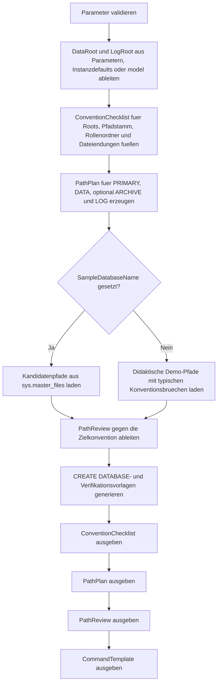

# FilePathConventionTemplate.sql

Dieses Skript definiert eine didaktische Pfad- und Dateikonvention fuer `CREATE DATABASE` im Kapitel `20_Create_Database`. Es leitet standardisierte Root-, Rollenordner- und Dateinamen ab, prueft vorhandene oder modellierte Kandidatenpfade gegen diese Baseline und erzeugt daraus wiederverwendbare DDL- sowie Verifikationsvorlagen, ohne selbst DDL auszufuehren.

## Uebersicht

<!-- SQLDOC:SUMMARY_TABLE:BEGIN -->
| Feld | Wert |
|---|---|
| Script | [FilePathConventionTemplate.sql](FilePathConventionTemplate.sql) |
| Version | `1.0` |
| Typ | `template` |
| Kapitel | `20_Create_Database` |
| Sicherheit | `read-only` |
| Zweck | Definiert standardisierte Datei- und Pfadkonventionen fuer Daten-, Archiv- und Logdateien und erzeugt passende Vorlagen. |
<!-- SQLDOC:SUMMARY_TABLE:END -->

## Einordnung

Bei `CREATE DATABASE` entstehen Inkonsistenzen oft nicht in der Syntax, sondern in Pfadwurzeln, Rollenordnern und Dateinamen. Das Skript trennt diese Entscheidungen deshalb bewusst in eine klare Baseline: getrennte Roots fuer Daten und Log, ein stabiler Pfadstamm aus Umgebung und Anwendung, dedizierte Unterordner fuer `data`, `archive` und `log` sowie konsistente Dateinamen mit Rollen- und Sequenzanteilen.

## Annahmen

- Es handelt sich um eine didaktische Template-Erstversion fuer Planung, Review und Standardisierung.
- Ohne explizite Wurzelpfade werden Instanzdefaults oder `model` als konservativer Fallback verwendet.
- Die Pfadpruefung bewertet Konventionsnahe, nicht die physische Existenz oder Performance eines Laufwerks.
- `ARCHIVE` bleibt optional und dient als lesbares Beispiel fuer eine bewusst getrennte Datenablage.

## Anwendungsfall

Das Skript eignet sich fuer Bootstrap-Workshops, Review-Checklisten und Team-Standards rund um neue Datenbanken. Es hilft dabei, Pfade nicht ad hoc pro Projekt zu vergeben, sondern aus wenigen stabilen Tokens abzuleiten und spaeter gegen dieselbe Baseline zu pruefen.

## Parameter

<!-- SQLDOC:PARAMETERS_TABLE:BEGIN -->
| Parameter | SQL-Typ | Pflicht | Beschreibung |
|---|---|---|---|
| `@TargetDatabaseName` | `SYSNAME` | Nein | Name der Zieldatenbank fuer die Konventionsvorlage. |
| `@EnvironmentCode` | `NVARCHAR(20)` | Nein | Umgebungskennzeichen wie `DEV`, `TEST` oder `PROD`. |
| `@ApplicationCode` | `NVARCHAR(30)` | Nein | Optionales Anwendungs- oder Domaintoken fuer den Pfadstamm. |
| `@DataRootDirectory` | `NVARCHAR(260)` | Nein | Optionales Root-Verzeichnis fuer Datenfiles. |
| `@LogRootDirectory` | `NVARCHAR(260)` | Nein | Optionales Root-Verzeichnis fuer Logdateien. |
| `@DataFileCount` | `INT` | Nein | Anzahl standardisierter DATA-Dateien in der Vorlage. |
| `@IncludeArchiveFilegroup` | `BIT` | Nein | Zeigt bei `1` eine zusaetzliche ARCHIVE-Datei und deren Pfadkonvention. |
| `@SampleDatabaseName` | `SYSNAME` | Nein | Optionale Referenzdatenbank fuer die Pfadpruefung; `NULL` nutzt Demo-Pfade. |
<!-- SQLDOC:PARAMETERS_TABLE:END -->

## Abhaengigkeiten

<!-- SQLDOC:DEPENDENCIES_LIST:BEGIN -->
- `sys.databases`
- `sys.master_files`
- `SERVERPROPERTY`
- temporaere Tabellen in `tempdb`
- `CASE`
- `CONCAT`
- `QUOTENAME`
- `STRING_AGG`
<!-- SQLDOC:DEPENDENCIES_LIST:END -->

## Hinweise

- `ConventionChecklist` sammelt die Baseline fuer Roots, Pfadstamm, Rollenordner, Dateinamen und Erweiterungen.
- `PathPlan` erzeugt konkrete didaktische Zielpfade fuer `PRIMARY`, `DATA`, optional `ARCHIVE` und `LOG`.
- `PathReview` vergleicht vorhandene oder modellierte Kandidatenpfade mit der Zielkonvention und markiert typische Gegenbeispiele.
- `CommandTemplate` erzeugt eine `CREATE DATABASE`-Vorlage und einen kompakten Verifikationslauf fuer `sys.database_files`.

## Versionshistorie

<!-- SQLDOC:VERSION_HISTORY_TABLE:BEGIN -->
| Version | Datum | User | Beschreibung |
|---|---|---|---|
| `1.0` | `2026-04-22` | `ER` | Erstversion der didaktischen Pfad- und Dateikonventionsvorlage fuer CREATE DATABASE |
<!-- SQLDOC:VERSION_HISTORY_TABLE:END -->

## Ablauf

<!-- SQLDOC:MERMAID:BEGIN -->

<!-- SQLDOC:MERMAID:END -->

## SQL-Code

<!-- SQLDOC:SQL_CODE:BEGIN -->
```sql
/*
BEGIN:SQL-HEADER v1
---
sql_header: v1
script_name: "FilePathConventionTemplate.sql"
script_version: "1.0"
script_type: "template"
chapter: "20_Create_Database"
purpose: >
  Definiert eine didaktische Pfad- und Dateikonvention fuer CREATE DATABASE,
  leitet daraus standardisierte Zielpfade und Dateinamen ab, prueft
  vorhandene oder modellierte Pfade gegen diese Baseline und erzeugt
  wiederverwendbare DDL- sowie Verifikationsvorlagen.

parameters:
  - name: "@TargetDatabaseName"
    sql_type: "SYSNAME"
    direction: "IN"
    required: false
    description: "Name der Zieldatenbank fuer die Konventionsvorlage"
  - name: "@EnvironmentCode"
    sql_type: "NVARCHAR(20)"
    direction: "IN"
    required: false
    description: "Kurzes Umgebungskennzeichen wie DEV, TEST oder PROD"
  - name: "@ApplicationCode"
    sql_type: "NVARCHAR(30)"
    direction: "IN"
    required: false
    description: "Optionales Anwendungs- oder Domaintoken fuer die Pfadstruktur"
  - name: "@DataRootDirectory"
    sql_type: "NVARCHAR(260)"
    direction: "IN"
    required: false
    description: "Optionales Root-Verzeichnis fuer Datenfiles"
  - name: "@LogRootDirectory"
    sql_type: "NVARCHAR(260)"
    direction: "IN"
    required: false
    description: "Optionales Root-Verzeichnis fuer Logdateien"
  - name: "@DataFileCount"
    sql_type: "INT"
    direction: "IN"
    required: false
    description: "Anzahl standardisierter DATA-Dateien in der Vorlage"
  - name: "@IncludeArchiveFilegroup"
    sql_type: "BIT"
    direction: "IN"
    required: false
    description: "1 = zusaetzliche ARCHIVE-Datei und Pfadkonvention anzeigen"
  - name: "@SampleDatabaseName"
    sql_type: "SYSNAME"
    direction: "IN"
    required: false
    description: "Optionale Referenzdatenbank fuer die Pfadpruefung; NULL nutzt Demo-Pfade"

result_sets:
  - name: "ConventionChecklist"
    description: "Leitplanken fuer getrennte Roots, Rollenordner, Dateiendungen und Token-Konventionen"
  - name: "PathPlan"
    description: "Konkrete didaktische Zielpfade und Dateinamen fuer PRIMARY, DATA, ARCHIVE und LOG"
  - name: "PathReview"
    description: "Vergleicht vorhandene oder didaktische Kandidatenpfade mit der Zielkonvention"
  - name: "CommandTemplate"
    description: "Erzeugt CREATE-DATABASE- und Verifikationsvorlagen aus der Pfadkonvention"

dependencies:
  - "sys.databases"
  - "sys.master_files"
  - "SERVERPROPERTY"
  - "tempdb temporary tables"
  - "CASE"
  - "CONCAT"
  - "QUOTENAME"
  - "STRING_AGG"

safety:
  level: "read-only"
  writes_data: false

documentation:
  markdown_file: "T-SQL/20_Create_Database/SQLScripts/FilePathConventionTemplate.md"
  sync_blocks:
    - "SUMMARY_TABLE"
    - "PARAMETERS_TABLE"
    - "DEPENDENCIES_LIST"
    - "VERSION_HISTORY_TABLE"
    - "SQL_CODE"
  mermaid:
    mode: "ai-agent-from-sql"
    source: "script-body"

main_responsible:
  name: "Erhard Rainer"
  initials: "ER"

version_history:
  - version: "1.0"
    date: "2026-04-22"
    user: "ER"
    description: "Erstversion der didaktischen Pfad- und Dateikonventionsvorlage fuer CREATE DATABASE"

notes:
  - "Das Skript fuehrt keine DDL aus, sondern erzeugt nur Planungs-, Review- und Vorlagenresultsets."
  - "Falls keine Referenzdatenbank angegeben ist, nutzt die Pfadpruefung bewusst unruhige Demo-Pfade als Gegenbeispiele."
---
END:SQL-HEADER v1
*/

SET NOCOUNT ON;

-- 1. Parameter vorbereiten
DECLARE @TargetDatabaseName SYSNAME = N'TrainingPathDemo';
DECLARE @EnvironmentCode NVARCHAR(20) = N'DEV';
DECLARE @ApplicationCode NVARCHAR(30) = N'TRAINING';
DECLARE @DataRootDirectory NVARCHAR(260) = NULL;
DECLARE @LogRootDirectory NVARCHAR(260) = NULL;
DECLARE @DataFileCount INT = 2;
DECLARE @IncludeArchiveFilegroup BIT = 1;
DECLARE @SampleDatabaseName SYSNAME = N'model';

IF @TargetDatabaseName IS NULL OR LTRIM(RTRIM(@TargetDatabaseName)) = N''
BEGIN
    THROW 50000, '@TargetDatabaseName darf nicht leer sein.', 1;
END;

IF @EnvironmentCode IS NULL OR LTRIM(RTRIM(@EnvironmentCode)) = N''
BEGIN
    THROW 50001, '@EnvironmentCode darf nicht leer sein.', 1;
END;

IF @ApplicationCode IS NULL OR LTRIM(RTRIM(@ApplicationCode)) = N''
BEGIN
    THROW 50002, '@ApplicationCode darf nicht leer sein.', 1;
END;

IF @DataFileCount < 1 OR @DataFileCount > 8
BEGIN
    THROW 50003, '@DataFileCount muss zwischen 1 und 8 liegen.', 1;
END;

IF @IncludeArchiveFilegroup NOT IN (0, 1)
BEGIN
    THROW 50004, '@IncludeArchiveFilegroup muss 0 oder 1 sein.', 1;
END;

IF @SampleDatabaseName IS NOT NULL AND DB_ID(@SampleDatabaseName) IS NULL
BEGIN
    THROW 50005, '@SampleDatabaseName verweist auf keine vorhandene Datenbank.', 1;
END;

DECLARE @InstanceDefaultDataPath NVARCHAR(260) = CAST(SERVERPROPERTY('InstanceDefaultDataPath') AS NVARCHAR(260));
DECLARE @InstanceDefaultLogPath NVARCHAR(260) = CAST(SERVERPROPERTY('InstanceDefaultLogPath') AS NVARCHAR(260));
DECLARE @ModelDataPath NVARCHAR(260);
DECLARE @ModelLogPath NVARCHAR(260);
DECLARE @ResolvedDataRoot NVARCHAR(260);
DECLARE @ResolvedLogRoot NVARCHAR(260);
DECLARE @PathStem NVARCHAR(200);
DECLARE @PrimaryLogicalName SYSNAME = CONCAT(@TargetDatabaseName, N'_PRIMARY');
DECLARE @LogLogicalName SYSNAME = CONCAT(@TargetDatabaseName, N'_LOG');
DECLARE @ArchiveLogicalName SYSNAME = CONCAT(@TargetDatabaseName, N'_ARCHIVE_01');

SELECT TOP (1)
    @ModelDataPath = LEFT(mf.physical_name, LEN(mf.physical_name) - CHARINDEX('\', REVERSE(mf.physical_name)))
FROM sys.master_files AS mf
WHERE mf.database_id = DB_ID(N'model')
  AND mf.type_desc = 'ROWS'
ORDER BY
    mf.file_id;

SELECT TOP (1)
    @ModelLogPath = LEFT(mf.physical_name, LEN(mf.physical_name) - CHARINDEX('\', REVERSE(mf.physical_name)))
FROM sys.master_files AS mf
WHERE mf.database_id = DB_ID(N'model')
  AND mf.type_desc = 'LOG'
ORDER BY
    mf.file_id;

SET @ResolvedDataRoot =
    COALESCE(NULLIF(@DataRootDirectory, N''), NULLIF(@InstanceDefaultDataPath, N''), @ModelDataPath);
SET @ResolvedLogRoot =
    COALESCE(NULLIF(@LogRootDirectory, N''), NULLIF(@InstanceDefaultLogPath, N''), @ModelLogPath, @ResolvedDataRoot);
SET @PathStem = CONCAT(UPPER(@EnvironmentCode), N'\', UPPER(@ApplicationCode), N'\', @TargetDatabaseName);

IF @ResolvedDataRoot IS NULL OR @ResolvedLogRoot IS NULL
BEGIN
    THROW 50006, 'Data- oder Log-Root konnte nicht aus Parametern, Instanzdefaults oder model abgeleitet werden.', 1;
END;

DROP TABLE IF EXISTS #ConventionChecklist;
DROP TABLE IF EXISTS #PathPlan;
DROP TABLE IF EXISTS #CandidatePaths;
DROP TABLE IF EXISTS #PathReview;
DROP TABLE IF EXISTS #CommandTemplate;

-- 2. Leitplanken fuer Pfadkonventionen erfassen
CREATE TABLE #ConventionChecklist
(
    ChecklistOrder INT NOT NULL,
    ConventionArea VARCHAR(40) NOT NULL,
    RuleName VARCHAR(100) NOT NULL,
    RecommendedPattern NVARCHAR(260) NOT NULL,
    WhyItMatters NVARCHAR(320) NOT NULL,
    ExampleValue NVARCHAR(320) NOT NULL
);

INSERT INTO #ConventionChecklist
(
    ChecklistOrder,
    ConventionArea,
    RuleName,
    RecommendedPattern,
    WhyItMatters,
    ExampleValue
)
VALUES
    (
        1,
        'Roots',
        'Separate data and log roots',
        N'Daten- und Logdateien erhalten getrennte Root-Verzeichnisse; beide Pfade werden bewusst dokumentiert.',
        N'Getrennte Roots machen Storage-Entscheidungen, Recovery-Ueberlegungen und spaetere Reviews nachvollziehbar.',
        CONCAT(N'DataRoot=', @ResolvedDataRoot, N'; LogRoot=', @ResolvedLogRoot)
    ),
    (
        2,
        'Tokens',
        'Stable environment and application stem',
        N'Unterhalb des Roots folgt stets ENV\\APP\\DatabaseName als stabiler Pfadstamm.',
        N'Der gemeinsame Stamm erleichtert Ablagekonventionen ueber mehrere Datenbanken und Umgebungen hinweg.',
        CONCAT(@PathStem, N'\data')
    ),
    (
        3,
        'Role folders',
        'Use dedicated role folders',
        N'Primaere und weitere Datenfiles liegen unter data, Archive-Dateien unter archive, Logs unter log.',
        N'Rollenordner machen die Dateifunktion bereits im Dateisystem sichtbar und vereinfachen Inventur sowie Automatisierung.',
        CONCAT(@PathStem, N'\log')
    ),
    (
        4,
        'File names',
        'Combine database stem, role and sequence',
        N'Dateinamen kombinieren Datenbankname, Rollentoken und bei mehreren Dateien eine zweistellige Sequenz.',
        N'Konsistente Dateinamen bleiben sortierbar, lesbar und passen zu Monitoring- oder Restore-Workflows.',
        CONCAT(@TargetDatabaseName, N'_DATA_01.ndf')
    ),
    (
        5,
        'Extensions',
        'Match extension to file role',
        N'PRIMARY endet auf .mdf, weitere Datenfiles und ARCHIVE auf .ndf, Logs auf .ldf.',
        N'Die Endung zeigt den Dateityp sofort und reduziert Fehler in CREATE-DATABASE-Vorlagen.',
        CONCAT(@TargetDatabaseName, N'_LOG.ldf')
    );

-- 3. Standardisierte Zielpfade erzeugen
CREATE TABLE #PathPlan
(
    PlanOrder INT NOT NULL,
    FilegroupName SYSNAME NOT NULL,
    FileRole VARCHAR(20) NOT NULL,
    LogicalFileName SYSNAME NOT NULL,
    DirectoryPath NVARCHAR(320) NOT NULL,
    PhysicalFileName NVARCHAR(400) NOT NULL,
    Extension VARCHAR(10) NOT NULL,
    ReviewNote NVARCHAR(260) NOT NULL
);

INSERT INTO #PathPlan
(
    PlanOrder,
    FilegroupName,
    FileRole,
    LogicalFileName,
    DirectoryPath,
    PhysicalFileName,
    Extension,
    ReviewNote
)
VALUES
    (
        10,
        N'PRIMARY',
        'DATA',
        @PrimaryLogicalName,
        CONCAT(@ResolvedDataRoot, CASE WHEN RIGHT(@ResolvedDataRoot, 1) = '\' THEN N'' ELSE N'\' END, @PathStem, N'\data'),
        CONCAT(@ResolvedDataRoot, CASE WHEN RIGHT(@ResolvedDataRoot, 1) = '\' THEN N'' ELSE N'\' END, @PathStem, N'\data\', @TargetDatabaseName, N'_PRIMARY.mdf'),
        '.mdf',
        N'Die primaere Datendatei nutzt denselben Datenstamm wie weitere Datendateien, aber eine eigene PRIMARY-Rolle.'
    );

;WITH Numbers AS
(
    SELECT 1 AS FileNumber
    UNION ALL
    SELECT FileNumber + 1
    FROM Numbers
    WHERE FileNumber < @DataFileCount
)
INSERT INTO #PathPlan
(
    PlanOrder,
    FilegroupName,
    FileRole,
    LogicalFileName,
    DirectoryPath,
    PhysicalFileName,
    Extension,
    ReviewNote
)
SELECT
    20 + n.FileNumber,
    N'DATA',
    'DATA',
    CONCAT(@TargetDatabaseName, N'_DATA_', RIGHT(CONCAT(N'0', CONVERT(NVARCHAR(10), n.FileNumber)), 2)),
    CONCAT(@ResolvedDataRoot, CASE WHEN RIGHT(@ResolvedDataRoot, 1) = '\' THEN N'' ELSE N'\' END, @PathStem, N'\data'),
    CONCAT(
        @ResolvedDataRoot,
        CASE WHEN RIGHT(@ResolvedDataRoot, 1) = '\' THEN N'' ELSE N'\' END,
        @PathStem,
        N'\data\',
        @TargetDatabaseName,
        N'_DATA_',
        RIGHT(CONCAT(N'0', CONVERT(NVARCHAR(10), n.FileNumber)), 2),
        N'.ndf'
    ),
    '.ndf',
    N'DATA-Dateien verwenden denselben Stammordner und eine zweistellige Sequenz fuer stabile Sortierung.'
FROM Numbers AS n
OPTION (MAXRECURSION 8);

IF @IncludeArchiveFilegroup = 1
BEGIN
    INSERT INTO #PathPlan
    (
        PlanOrder,
        FilegroupName,
        FileRole,
        LogicalFileName,
        DirectoryPath,
        PhysicalFileName,
        Extension,
        ReviewNote
    )
    VALUES
        (
            80,
            N'ARCHIVE',
            'DATA',
            @ArchiveLogicalName,
            CONCAT(@ResolvedDataRoot, CASE WHEN RIGHT(@ResolvedDataRoot, 1) = '\' THEN N'' ELSE N'\' END, @PathStem, N'\archive'),
            CONCAT(@ResolvedDataRoot, CASE WHEN RIGHT(@ResolvedDataRoot, 1) = '\' THEN N'' ELSE N'\' END, @PathStem, N'\archive\', @TargetDatabaseName, N'_ARCHIVE_01.ndf'),
            '.ndf',
            N'ARCHIVE bleibt optional und trennt selten veraenderte oder didaktisch getrennte Datenpfade klar von DATA.'
        );
END;

INSERT INTO #PathPlan
(
    PlanOrder,
    FilegroupName,
    FileRole,
    LogicalFileName,
    DirectoryPath,
    PhysicalFileName,
    Extension,
    ReviewNote
)
VALUES
    (
        90,
        N'LOG',
        'LOG',
        @LogLogicalName,
        CONCAT(@ResolvedLogRoot, CASE WHEN RIGHT(@ResolvedLogRoot, 1) = '\' THEN N'' ELSE N'\' END, @PathStem, N'\log'),
        CONCAT(@ResolvedLogRoot, CASE WHEN RIGHT(@ResolvedLogRoot, 1) = '\' THEN N'' ELSE N'\' END, @PathStem, N'\log\', @TargetDatabaseName, N'_LOG.ldf'),
        '.ldf',
        N'Die Logdatei verwendet einen eigenen Root und einen klaren log-Ordner fuer Storage- und Recovery-Reviews.'
    );

-- 4. Bestehende oder didaktische Pfade gegen die Baseline pruefen
CREATE TABLE #CandidatePaths
(
    CandidateOrder INT NOT NULL,
    CandidateSource VARCHAR(20) NOT NULL,
    CandidateType VARCHAR(20) NOT NULL,
    CandidatePath NVARCHAR(400) NOT NULL,
    ExpectedRole VARCHAR(20) NOT NULL
);

IF @SampleDatabaseName IS NOT NULL
BEGIN
    INSERT INTO #CandidatePaths
    (
        CandidateOrder,
        CandidateSource,
        CandidateType,
        CandidatePath,
        ExpectedRole
    )
    SELECT
        ROW_NUMBER() OVER (ORDER BY mf.file_id),
        'catalog',
        mf.type_desc,
        mf.physical_name,
        CASE WHEN mf.type_desc = 'LOG' THEN 'LOG' ELSE 'DATA' END
    FROM sys.master_files AS mf
    WHERE mf.database_id = DB_ID(@SampleDatabaseName);
END;
ELSE
BEGIN
    INSERT INTO #CandidatePaths
    (
        CandidateOrder,
        CandidateSource,
        CandidateType,
        CandidatePath,
        ExpectedRole
    )
    VALUES
        (1, 'demo', 'ROWS', N'C:\SQLData\TrainingPathDemo.mdf', 'DATA'),
        (2, 'demo', 'ROWS', N'C:\SQLData\Mixed\TrainingPathDemo-Data02.ndf', 'DATA'),
        (3, 'demo', 'ROWS', N'C:\SQLData\Archive\TrainingPathDemo_Archive1.ndf', 'DATA'),
        (4, 'demo', 'LOG', N'C:\SQLData\TrainingPathDemo_log.ldf', 'LOG');
END;

CREATE TABLE #PathReview
(
    ReviewOrder INT NOT NULL,
    CandidateSource VARCHAR(20) NOT NULL,
    CandidateType VARCHAR(20) NOT NULL,
    CandidatePath NVARCHAR(400) NOT NULL,
    ReviewSeverity VARCHAR(12) NOT NULL,
    ExpectedPattern NVARCHAR(260) NOT NULL,
    Findings NVARCHAR(320) NOT NULL,
    Recommendation NVARCHAR(320) NOT NULL
);

INSERT INTO #PathReview
(
    ReviewOrder,
    CandidateSource,
    CandidateType,
    CandidatePath,
    ReviewSeverity,
    ExpectedPattern,
    Findings,
    Recommendation
)
SELECT
    cp.CandidateOrder,
    cp.CandidateSource,
    cp.CandidateType,
    cp.CandidatePath,
    CASE
        WHEN cp.ExpectedRole = 'LOG' AND cp.CandidatePath LIKE N'%\log\%.ldf' THEN 'low'
        WHEN cp.ExpectedRole = 'DATA' AND cp.CandidatePath LIKE N'%\data\%.mdf' THEN 'low'
        WHEN cp.ExpectedRole = 'DATA' AND cp.CandidatePath LIKE N'%\data\%.ndf' THEN 'low'
        WHEN cp.ExpectedRole = 'LOG' AND cp.CandidatePath NOT LIKE N'%.ldf' THEN 'high'
        WHEN cp.ExpectedRole = 'DATA' AND cp.CandidatePath NOT LIKE N'%.mdf' AND cp.CandidatePath NOT LIKE N'%.ndf' THEN 'high'
        WHEN cp.CandidatePath NOT LIKE N'%\data\%' AND cp.CandidatePath NOT LIKE N'%\archive\%' AND cp.CandidatePath NOT LIKE N'%\log\%' THEN 'high'
        WHEN cp.CandidatePath LIKE N'%-%' OR cp.CandidatePath LIKE N'% %' THEN 'medium'
        ELSE 'medium'
    END,
    CASE
        WHEN cp.ExpectedRole = 'LOG' THEN CONCAT(@ResolvedLogRoot, N'\', @PathStem, N'\log\', @TargetDatabaseName, N'_LOG.ldf')
        WHEN cp.CandidateOrder = 1 THEN CONCAT(@ResolvedDataRoot, N'\', @PathStem, N'\data\', @TargetDatabaseName, N'_PRIMARY.mdf')
        ELSE CONCAT(@ResolvedDataRoot, N'\', @PathStem, N'\data\', @TargetDatabaseName, N'_DATA_NN.ndf')
    END,
    CASE
        WHEN cp.ExpectedRole = 'LOG' AND cp.CandidatePath LIKE N'%\log\%.ldf' THEN N'Der Logpfad liegt bereits in einem klaren log-Ordner und nutzt die passende Endung.'
        WHEN cp.ExpectedRole = 'DATA' AND cp.CandidatePath LIKE N'%\data\%.mdf' THEN N'Die primaere Datendatei folgt bereits der data-Ordnerkonvention mit passender Endung.'
        WHEN cp.ExpectedRole = 'DATA' AND cp.CandidatePath LIKE N'%\data\%.ndf' THEN N'Der Datenpfad ist bereits nach Rolle getrennt und grundsaetzlich konventionsnah.'
        WHEN cp.ExpectedRole = 'LOG' AND cp.CandidatePath NOT LIKE N'%.ldf' THEN N'Der Logpfad nutzt keine .ldf-Endung und ist damit fuer DDL- oder Review-Vorlagen unklar.'
        WHEN cp.ExpectedRole = 'DATA' AND cp.CandidatePath NOT LIKE N'%.mdf' AND cp.CandidatePath NOT LIKE N'%.ndf' THEN N'Der Datenpfad hat keine typische SQL-Server-Dateiendung und erschwert die Einordnung.'
        WHEN cp.CandidatePath NOT LIKE N'%\data\%' AND cp.CandidatePath NOT LIKE N'%\archive\%' AND cp.CandidatePath NOT LIKE N'%\log\%' THEN N'Der Pfad verwendet keine sichtbaren Rollenordner fuer data, archive oder log.'
        WHEN cp.CandidatePath LIKE N'%-%' THEN N'Bindestriche im Dateinamen oder Ordnerstamm mischen die Benennung und erschweren stabile Pattern-Pruefungen.'
        WHEN cp.CandidatePath LIKE N'% %' THEN N'Leerzeichen im Pfad sind didaktisch vermeidbar und machen Copy/Paste- oder Skriptvorlagen stoeranfaelliger.'
        ELSE N'Der Pfad ist teilweise brauchbar, folgt aber nicht vollstaendig der vorgesehenen Root- und Rollenstruktur.'
    END,
    CASE
        WHEN cp.ExpectedRole = 'LOG' THEN CONCAT(N'Bevorzuge ', @ResolvedLogRoot, N'\', @PathStem, N'\log\', @TargetDatabaseName, N'_LOG.ldf')
        WHEN cp.CandidateOrder = 1 THEN CONCAT(N'Bevorzuge ', @ResolvedDataRoot, N'\', @PathStem, N'\data\', @TargetDatabaseName, N'_PRIMARY.mdf')
        ELSE CONCAT(N'Bevorzuge ', @ResolvedDataRoot, N'\', @PathStem, N'\data\', @TargetDatabaseName, N'_DATA_', RIGHT(CONCAT(N'0', CONVERT(NVARCHAR(10), cp.CandidateOrder - 1)), 2), N'.ndf')
    END
FROM #CandidatePaths AS cp;

-- 5. CREATE DATABASE- und Verifikationsvorlagen erzeugen
CREATE TABLE #CommandTemplate
(
    CommandOrder INT NOT NULL,
    CommandName VARCHAR(100) NOT NULL,
    GeneratedCommand NVARCHAR(MAX) NOT NULL,
    ReviewHint NVARCHAR(320) NOT NULL
);

DECLARE @PrimaryClause NVARCHAR(MAX);
DECLARE @DataClause NVARCHAR(MAX);
DECLARE @ArchiveClause NVARCHAR(MAX);
DECLARE @LogClause NVARCHAR(MAX);
DECLARE @VerificationCommand NVARCHAR(MAX);

SELECT TOP (1)
    @PrimaryClause = CONCAT(
        N'ON PRIMARY',
        NCHAR(13) + NCHAR(10),
        N'(',
        NCHAR(13) + NCHAR(10),
        N'    NAME = N''', pp.LogicalFileName, N''',',
        NCHAR(13) + NCHAR(10),
        N'    FILENAME = N''', pp.PhysicalFileName, N''',',
        NCHAR(13) + NCHAR(10),
        N'    SIZE = 256MB,',
        NCHAR(13) + NCHAR(10),
        N'    FILEGROWTH = 128MB',
        NCHAR(13) + NCHAR(10),
        N')'
    )
FROM #PathPlan AS pp
WHERE pp.FilegroupName = N'PRIMARY';

SELECT
    @DataClause =
        STRING_AGG(
            CONCAT(
                N'(',
                NCHAR(13) + NCHAR(10),
                N'    NAME = N''', pp.LogicalFileName, N''',',
                NCHAR(13) + NCHAR(10),
                N'    FILENAME = N''', pp.PhysicalFileName, N''',',
                NCHAR(13) + NCHAR(10),
                N'    SIZE = 256MB,',
                NCHAR(13) + NCHAR(10),
                N'    FILEGROWTH = 128MB',
                NCHAR(13) + NCHAR(10),
                N')'
            ),
            N',' + NCHAR(13) + NCHAR(10)
        ) WITHIN GROUP (ORDER BY pp.PlanOrder)
FROM #PathPlan AS pp
WHERE pp.FilegroupName = N'DATA';

SELECT TOP (1)
    @ArchiveClause = CONCAT(
        N'(',
        NCHAR(13) + NCHAR(10),
        N'    NAME = N''', pp.LogicalFileName, N''',',
        NCHAR(13) + NCHAR(10),
        N'    FILENAME = N''', pp.PhysicalFileName, N''',',
        NCHAR(13) + NCHAR(10),
        N'    SIZE = 256MB,',
        NCHAR(13) + NCHAR(10),
        N'    FILEGROWTH = 128MB',
        NCHAR(13) + NCHAR(10),
        N')'
    )
FROM #PathPlan AS pp
WHERE pp.FilegroupName = N'ARCHIVE';

SELECT TOP (1)
    @LogClause = CONCAT(
        N'LOG ON',
        NCHAR(13) + NCHAR(10),
        N'(',
        NCHAR(13) + NCHAR(10),
        N'    NAME = N''', pp.LogicalFileName, N''',',
        NCHAR(13) + NCHAR(10),
        N'    FILENAME = N''', pp.PhysicalFileName, N''',',
        NCHAR(13) + NCHAR(10),
        N'    SIZE = 128MB,',
        NCHAR(13) + NCHAR(10),
        N'    FILEGROWTH = 64MB',
        NCHAR(13) + NCHAR(10),
        N')'
    )
FROM #PathPlan AS pp
WHERE pp.FilegroupName = N'LOG';

SET @VerificationCommand =
    CONCAT(
        N'SELECT df.file_id,',
        NCHAR(13) + NCHAR(10),
        N'       df.name AS logical_file_name,',
        NCHAR(13) + NCHAR(10),
        N'       df.physical_name,',
        NCHAR(13) + NCHAR(10),
        N'       CASE WHEN df.type_desc = ''LOG'' THEN ''log'' ELSE ''data'' END AS expected_role,',
        NCHAR(13) + NCHAR(10),
        N'       CASE',
        NCHAR(13) + NCHAR(10),
        N'           WHEN df.type_desc = ''LOG'' AND df.physical_name LIKE ''%\log\%.ldf'' THEN ''ok''',
        NCHAR(13) + NCHAR(10),
        N'           WHEN df.type_desc <> ''LOG'' AND df.physical_name LIKE ''%\data\%.mdf'' THEN ''ok''',
        NCHAR(13) + NCHAR(10),
        N'           WHEN df.type_desc <> ''LOG'' AND df.physical_name LIKE ''%\data\%.ndf'' THEN ''ok''',
        NCHAR(13) + NCHAR(10),
        N'           ELSE ''review''',
        NCHAR(13) + NCHAR(10),
        N'       END AS path_convention_status',
        NCHAR(13) + NCHAR(10),
        N'FROM ',
        QUOTENAME(@TargetDatabaseName),
        N'.sys.database_files AS df',
        NCHAR(13) + NCHAR(10),
        N'ORDER BY df.file_id;'
    );

INSERT INTO #CommandTemplate
(
    CommandOrder,
    CommandName,
    GeneratedCommand,
    ReviewHint
)
VALUES
    (
        1,
        'Create database path template',
        CONCAT(
            N'CREATE DATABASE ',
            QUOTENAME(@TargetDatabaseName),
            NCHAR(13) + NCHAR(10),
            @PrimaryClause,
            N',' + NCHAR(13) + NCHAR(10) +
            N'FILEGROUP [DATA]' + NCHAR(13) + NCHAR(10) +
            @DataClause,
            CASE
                WHEN @ArchiveClause IS NOT NULL THEN
                    N',' + NCHAR(13) + NCHAR(10) +
                    N'FILEGROUP [ARCHIVE]' + NCHAR(13) + NCHAR(10) +
                    @ArchiveClause
                ELSE N''
            END,
            NCHAR(13) + NCHAR(10),
            @LogClause,
            N';'
        ),
        N'Die Vorlage zeigt bewusst nur Pfad- und Dateikonventionen; reale Groessen, Filegroups und Lifecycle-Regeln muessen vor Produktiveinsatz geprueft werden.'
    ),
    (
        2,
        'Path verification template',
        @VerificationCommand,
        N'Der Verifikationslauf zeigt pro Datei, ob die resultierenden Pfade die data- oder log-Konvention treffen.'
    );

-- 6. Resultsets ausgeben
SELECT
    cc.ChecklistOrder,
    cc.ConventionArea,
    cc.RuleName,
    cc.RecommendedPattern,
    cc.WhyItMatters,
    cc.ExampleValue
FROM #ConventionChecklist AS cc
ORDER BY
    cc.ChecklistOrder;

SELECT
    pp.PlanOrder,
    pp.FilegroupName,
    pp.FileRole,
    pp.LogicalFileName,
    pp.DirectoryPath,
    pp.PhysicalFileName,
    pp.Extension,
    pp.ReviewNote
FROM #PathPlan AS pp
ORDER BY
    pp.PlanOrder;

SELECT
    pr.ReviewOrder,
    pr.CandidateSource,
    pr.CandidateType,
    pr.CandidatePath,
    pr.ReviewSeverity,
    pr.ExpectedPattern,
    pr.Findings,
    pr.Recommendation
FROM #PathReview AS pr
ORDER BY
    pr.ReviewOrder;

SELECT
    ct.CommandOrder,
    ct.CommandName,
    ct.GeneratedCommand,
    ct.ReviewHint
FROM #CommandTemplate AS ct
ORDER BY
    ct.CommandOrder;
```
<!-- SQLDOC:SQL_CODE:END -->
