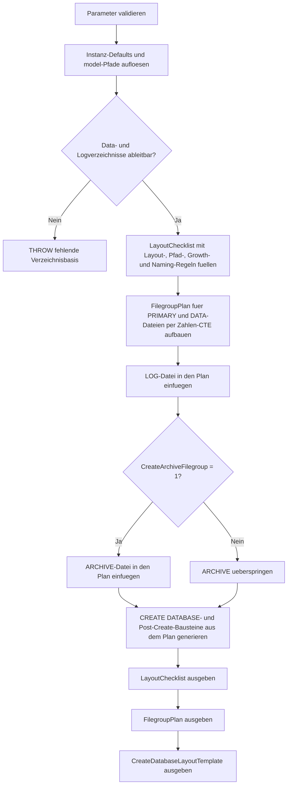

# FilegroupLayoutStarter.sql

Dieses Skript erzeugt eine lesende Startvorlage fuer Filegroups, Dateinamen und feste Growth-Konventionen beim Anlegen neuer Datenbanken. Es kombiniert Instanz- und `model`-Metadaten mit einer didaktischen Layout-Heuristik und liefert daraus einen konkret lesbaren Dateiplan sowie `CREATE DATABASE`-Bausteine.

## Uebersicht

<!-- SQLDOC:SUMMARY_TABLE:BEGIN -->
| Feld | Wert |
|---|---|
| Script | [FilegroupLayoutStarter.sql](FilegroupLayoutStarter.sql) |
| Version | `1.0` |
| Typ | `template` |
| Kapitel | `20_Create_Database` |
| Sicherheit | `read-only` |
| Zweck | Leitet ein konservatives Filegroup- und Dateilayout fuer `CREATE DATABASE` ab und erzeugt passende T-SQL-Bausteine. |
<!-- SQLDOC:SUMMARY_TABLE:END -->

## Einordnung

Beim Start mit `CREATE DATABASE` fehlt haeufig noch eine klare Aufteilung fuer PRIMARY, weitere Datenfiles, Logdatei und optional historische Datenbereiche. Das Skript macht diese Entscheidungen explizit, ohne bereits produktive Storage-Topologien zu unterstellen oder DDL auszufuehren.

## Annahmen

- Es handelt sich um eine didaktische Erstversion fuer Bootstrap-, Review- und Template-Zwecke.
- Ohne weitere Vorgaben wird eine kleine, konservative Struktur mit `PRIMARY`, `DATA`, `LOG` und optional `ARCHIVE` vorgeschlagen.
- Verzeichnisse werden aus Parametern, `SERVERPROPERTY('InstanceDefaultDataPath')`, `SERVERPROPERTY('InstanceDefaultLogPath')` oder aus `model` abgeleitet.
- Growth-Werte bleiben bewusst fix in MB, damit die Vorlage planbar und mit anderen Baseline-Skripten des Kapitels konsistent bleibt.

## Anwendungsfall

Das erste Resultset zeigt Leitplanken fuer Layout, Pfade, Dateianzahl und Namenskonventionen. Das zweite Resultset beschreibt den konkreten Filegroup- und Dateiplan. Das dritte Resultset liefert eine direkt lesbare `CREATE DATABASE`-Vorlage sowie einen Nachfolgebaustein zum Setzen der Default-Filegroup und zur Verifikation.

## Parameter

<!-- SQLDOC:PARAMETERS_TABLE:BEGIN -->
| Parameter | SQL-Typ | Pflicht | Beschreibung |
|---|---|---|---|
| `@TargetDatabaseName` | `SYSNAME` | Nein | Name der geplanten Zieldatenbank fuer die Layout-Vorlage. |
| `@PrimaryDataDirectory` | `NVARCHAR(260)` | Nein | Optionales Verzeichnis fuer PRIMARY-Dateien; ohne Wert wird Instanz- oder `model`-Fallback genutzt. |
| `@SecondaryDataDirectory` | `NVARCHAR(260)` | Nein | Optionales Verzeichnis fuer weitere Datenfiles; ohne Wert wird das PRIMARY-Verzeichnis wiederverwendet. |
| `@LogDirectory` | `NVARCHAR(260)` | Nein | Optionales Verzeichnis fuer Logdateien; ohne Wert wird Instanz- oder `model`-Fallback genutzt. |
| `@DataFileCount` | `INT` | Nein | Anzahl geplanter Datenfiles fuer PRIMARY und DATA. |
| `@DataFileSizeMB` | `INT` | Nein | Didaktische Startgroesse je Datenfile in MB. |
| `@DataFileGrowthMB` | `INT` | Nein | Didaktischer fixer Growth-Wert je Datenfile in MB. |
| `@LogFileSizeMB` | `INT` | Nein | Didaktische Startgroesse der Logdatei in MB. |
| `@LogFileGrowthMB` | `INT` | Nein | Didaktischer fixer Growth-Wert der Logdatei in MB. |
| `@CreateArchiveFilegroup` | `BIT` | Nein | Aktiviert bei `1` eine zusaetzliche ARCHIVE-Filegroup samt Datei-Vorlage. |
<!-- SQLDOC:PARAMETERS_TABLE:END -->

## Abhaengigkeiten

<!-- SQLDOC:DEPENDENCIES_LIST:BEGIN -->
- `sys.databases`
- `sys.master_files`
- `SERVERPROPERTY`
- `tempdb temporary tables`
- `CASE`
- `CONCAT`
- `QUOTENAME`
<!-- SQLDOC:DEPENDENCIES_LIST:END -->

## Hinweise

- `LayoutChecklist` fasst die wichtigsten Review-Punkte fuer Filegroup-Rollen, Pfadtrennung, Growth und Namenskonventionen zusammen.
- `FilegroupPlan` zeigt pro Datei die geplante Rolle, den logischen Namen, den physischen Pfad und die Startgroessen.
- `CreateDatabaseLayoutTemplate` liefert einen `CREATE DATABASE`-Baustein mit mehreren Filegroups sowie eine Nachkontrolle fuer Default-Filegroup und Datei-Zuordnung.

## Versionshistorie

<!-- SQLDOC:VERSION_HISTORY_TABLE:BEGIN -->
| Version | Datum | User | Beschreibung |
|---|---|---|---|
| `1.0` | `2026-04-22` | `ER` | Erstversion der lesenden Filegroup-Layout-Vorlage fuer CREATE DATABASE |
<!-- SQLDOC:VERSION_HISTORY_TABLE:END -->

## Ablauf

<!-- SQLDOC:MERMAID:BEGIN -->

<!-- SQLDOC:MERMAID:END -->

## SQL-Code

<!-- SQLDOC:SQL_CODE:BEGIN -->
```sql
/*
BEGIN:SQL-HEADER v1
---
sql_header: v1
script_name: "FilegroupLayoutStarter.sql"
script_version: "1.0"
script_type: "template"
chapter: "20_Create_Database"
purpose: >
  Erstellt eine lesende Startvorlage fuer Filegroups, Dateinamen und
  Growth-Konventionen beim Anlegen neuer Datenbanken. Das Skript nutzt
  model- und Instanzmetadaten, leitet eine didaktische Layout-Baseline
  ab und erzeugt daraus wiederverwendbare CREATE-DATABASE-Bausteine.

parameters:
  - name: "@TargetDatabaseName"
    sql_type: "SYSNAME"
    direction: "IN"
    required: false
    description: "Name der geplanten Zieldatenbank fuer die Layout-Vorlage"
  - name: "@PrimaryDataDirectory"
    sql_type: "NVARCHAR(260)"
    direction: "IN"
    required: false
    description: "Optionales Verzeichnis fuer PRIMARY-Dateien; NULL nutzt Instanz- oder model-Fallback"
  - name: "@SecondaryDataDirectory"
    sql_type: "NVARCHAR(260)"
    direction: "IN"
    required: false
    description: "Optionales Verzeichnis fuer weitere Datenfiles; NULL nutzt das PRIMARY-Verzeichnis"
  - name: "@LogDirectory"
    sql_type: "NVARCHAR(260)"
    direction: "IN"
    required: false
    description: "Optionales Verzeichnis fuer Logdateien; NULL nutzt Instanz- oder model-Fallback"
  - name: "@DataFileCount"
    sql_type: "INT"
    direction: "IN"
    required: false
    description: "Anzahl geplanter Datenfiles fuer die PRIMARY- und DATA-Filegroups"
  - name: "@DataFileSizeMB"
    sql_type: "INT"
    direction: "IN"
    required: false
    description: "Didaktische Startgroesse je Datenfile in MB"
  - name: "@DataFileGrowthMB"
    sql_type: "INT"
    direction: "IN"
    required: false
    description: "Didaktischer fixer Growth-Wert je Datenfile in MB"
  - name: "@LogFileSizeMB"
    sql_type: "INT"
    direction: "IN"
    required: false
    description: "Didaktische Startgroesse der Logdatei in MB"
  - name: "@LogFileGrowthMB"
    sql_type: "INT"
    direction: "IN"
    required: false
    description: "Didaktischer fixer Growth-Wert der Logdatei in MB"
  - name: "@CreateArchiveFilegroup"
    sql_type: "BIT"
    direction: "IN"
    required: false
    description: "1 = zusaetzliche ARCHIVE-Filegroup und Datei-Vorlage erzeugen"

result_sets:
  - name: "LayoutChecklist"
    description: "Priorisierte Leitplanken fuer Dateipfade, Dateianzahl, Filegroup-Rollen und Growth-Konventionen"
  - name: "FilegroupPlan"
    description: "Konkreter didaktischer Filegroup- und Dateiplan fuer PRIMARY, DATA und optional ARCHIVE"
  - name: "CreateDatabaseLayoutTemplate"
    description: "Generierte CREATE-DATABASE-Bausteine fuer Filegroups und Dateien"

dependencies:
  - "sys.databases"
  - "sys.master_files"
  - "SERVERPROPERTY"
  - "tempdb temporary tables"
  - "CASE"
  - "CONCAT"
  - "QUOTENAME"

safety:
  level: "read-only"
  writes_data: false

documentation:
  markdown_file: "T-SQL/20_Create_Database/SQLScripts/FilegroupLayoutStarter.md"
  sync_blocks:
    - "SUMMARY_TABLE"
    - "PARAMETERS_TABLE"
    - "DEPENDENCIES_LIST"
    - "VERSION_HISTORY_TABLE"
    - "SQL_CODE"
  mermaid:
    mode: "ai-agent-from-sql"
    source: "script-body"

main_responsible:
  name: "Erhard Rainer"
  initials: "ER"

version_history:
  - version: "1.0"
    date: "2026-04-22"
    user: "ER"
    description: "Erstversion der lesenden Filegroup-Layout-Vorlage fuer CREATE DATABASE"

notes:
  - "Das Skript erzeugt nur Planungsresultsets und T-SQL-Vorlagen; es fuehrt kein CREATE DATABASE aus."
  - "Ohne produktiven Kontext bleibt die Filegroup-Struktur bewusst konservativ und didaktisch nachvollziehbar."
---
END:SQL-HEADER v1
*/

SET NOCOUNT ON;

-- 1. Parameter vorbereiten
DECLARE @TargetDatabaseName SYSNAME = N'TrainingFilegroupDemo';
DECLARE @PrimaryDataDirectory NVARCHAR(260) = NULL;
DECLARE @SecondaryDataDirectory NVARCHAR(260) = NULL;
DECLARE @LogDirectory NVARCHAR(260) = NULL;
DECLARE @DataFileCount INT = 2;
DECLARE @DataFileSizeMB INT = 256;
DECLARE @DataFileGrowthMB INT = 128;
DECLARE @LogFileSizeMB INT = 128;
DECLARE @LogFileGrowthMB INT = 64;
DECLARE @CreateArchiveFilegroup BIT = 1;

IF @TargetDatabaseName IS NULL OR LTRIM(RTRIM(@TargetDatabaseName)) = N''
BEGIN
    THROW 50000, '@TargetDatabaseName darf nicht leer sein.', 1;
END;

IF @DataFileCount < 1 OR @DataFileCount > 8
BEGIN
    THROW 50001, '@DataFileCount muss zwischen 1 und 8 liegen.', 1;
END;

IF @DataFileSizeMB <= 0
BEGIN
    THROW 50002, '@DataFileSizeMB muss groesser als 0 sein.', 1;
END;

IF @DataFileGrowthMB <= 0
BEGIN
    THROW 50003, '@DataFileGrowthMB muss groesser als 0 sein.', 1;
END;

IF @LogFileSizeMB <= 0
BEGIN
    THROW 50004, '@LogFileSizeMB muss groesser als 0 sein.', 1;
END;

IF @LogFileGrowthMB <= 0
BEGIN
    THROW 50005, '@LogFileGrowthMB muss groesser als 0 sein.', 1;
END;

IF @CreateArchiveFilegroup NOT IN (0, 1)
BEGIN
    THROW 50006, '@CreateArchiveFilegroup muss 0 oder 1 sein.', 1;
END;

DECLARE @InstanceDefaultDataPath NVARCHAR(260) = CAST(SERVERPROPERTY('InstanceDefaultDataPath') AS NVARCHAR(260));
DECLARE @InstanceDefaultLogPath NVARCHAR(260) = CAST(SERVERPROPERTY('InstanceDefaultLogPath') AS NVARCHAR(260));
DECLARE @ModelDataPath NVARCHAR(260);
DECLARE @ModelLogPath NVARCHAR(260);
DECLARE @ResolvedPrimaryDirectory NVARCHAR(260);
DECLARE @ResolvedSecondaryDirectory NVARCHAR(260);
DECLARE @ResolvedLogDirectory NVARCHAR(260);
DECLARE @PrimaryLogicalName SYSNAME = CONCAT(@TargetDatabaseName, N'_Primary');
DECLARE @LogLogicalName SYSNAME = CONCAT(@TargetDatabaseName, N'_log');
DECLARE @ArchiveLogicalName SYSNAME = CONCAT(@TargetDatabaseName, N'_Archive01');

SELECT TOP (1)
    @ModelDataPath = LEFT(mf.physical_name, LEN(mf.physical_name) - CHARINDEX('\', REVERSE(mf.physical_name)))
FROM sys.master_files AS mf
WHERE mf.database_id = DB_ID(N'model')
  AND mf.type_desc = 'ROWS'
ORDER BY
    mf.file_id;

SELECT TOP (1)
    @ModelLogPath = LEFT(mf.physical_name, LEN(mf.physical_name) - CHARINDEX('\', REVERSE(mf.physical_name)))
FROM sys.master_files AS mf
WHERE mf.database_id = DB_ID(N'model')
  AND mf.type_desc = 'LOG'
ORDER BY
    mf.file_id;

SET @ResolvedPrimaryDirectory =
    COALESCE(NULLIF(@PrimaryDataDirectory, N''), NULLIF(@InstanceDefaultDataPath, N''), @ModelDataPath);
SET @ResolvedSecondaryDirectory =
    COALESCE(NULLIF(@SecondaryDataDirectory, N''), @ResolvedPrimaryDirectory);
SET @ResolvedLogDirectory =
    COALESCE(NULLIF(@LogDirectory, N''), NULLIF(@InstanceDefaultLogPath, N''), @ModelLogPath);

IF @ResolvedPrimaryDirectory IS NULL OR @ResolvedLogDirectory IS NULL
BEGIN
    THROW 50007, 'Data- oder Logverzeichnis konnte nicht aus Parametern, Instanzdefaults oder model abgeleitet werden.', 1;
END;

DROP TABLE IF EXISTS #LayoutChecklist;
DROP TABLE IF EXISTS #FilegroupPlan;
DROP TABLE IF EXISTS #CreateDatabaseLayoutTemplate;

-- 2. Planungsleitplanken erzeugen
CREATE TABLE #LayoutChecklist
(
    ChecklistOrder INT NOT NULL,
    ChecklistArea VARCHAR(40) NOT NULL,
    CheckItem VARCHAR(120) NOT NULL,
    Recommendation NVARCHAR(360) NOT NULL,
    WhyItMatters NVARCHAR(320) NOT NULL,
    CurrentBaseline NVARCHAR(320) NOT NULL
);

INSERT INTO #LayoutChecklist
(
    ChecklistOrder,
    ChecklistArea,
    CheckItem,
    Recommendation,
    WhyItMatters,
    CurrentBaseline
)
VALUES
    (
        1,
        'Layout',
        'Filegroup roles',
        N'PRIMARY klein halten und fuer Kernobjekte reservieren; zusaetzliche Datenfiles in eine eigene DATA-Filegroup einplanen.',
        N'Getrennte Rollen erleichtern spaetere Datenplatzierung, Restore-Strategien und Wartung.',
        N'Dieses Startskript plant PRIMARY, DATA und optional ARCHIVE als didaktische Baseline.'
    ),
    (
        2,
        'Paths',
        'Directory separation',
        N'Data- und Logdateien getrennt dokumentieren; weitere Datenfiles duerfen ein eigenes Verzeichnis erhalten.',
        N'Pfadtrennung macht IO-Entscheidungen, Provisionierung und spaetere Reviews sichtbarer.',
        CONCAT(N'PRIMARY: ', @ResolvedPrimaryDirectory, N'; SECONDARY: ', @ResolvedSecondaryDirectory, N'; LOG: ', @ResolvedLogDirectory)
    ),
    (
        3,
        'Files',
        'Data file count',
        N'Die Anzahl an Datenfiles nur bei realem Parallelisierungs- oder Verwaltungsbedarf erhoehen; diese Vorlage startet bewusst mit wenigen Dateien.',
        N'Zu viele Dateien ohne Grund erschweren Layout und Betrieb, zu wenige koennen Wachstum und Verteilung unklar lassen.',
        CONCAT(N'Didaktische Startanzahl fuer Datenfiles: ', CONVERT(NVARCHAR(10), @DataFileCount))
    ),
    (
        4,
        'Growth',
        'Fixed growth convention',
        N'Fuer Daten- und Logdateien standardmaessig fixes Wachstum in MB dokumentieren und Prozentwachstum vermeiden.',
        N'Feste Growth-Werte sind planbarer und passen besser zu wiederverwendbaren CREATE-DATABASE-Vorlagen.',
        CONCAT(N'Data growth: ', CONVERT(NVARCHAR(10), @DataFileGrowthMB), N'MB; Log growth: ', CONVERT(NVARCHAR(10), @LogFileGrowthMB), N'MB')
    ),
    (
        5,
        'Naming',
        'Logical and physical names',
        N'Logical und physische Namen mit Rollenkennzeichen wie Primary, DataNN und ArchiveNN versehen.',
        N'Konsistente Benennung vereinfacht spaetere ALTER DATABASE-, Monitoring- und Restore-Aufgaben.',
        CONCAT(N'Basenamen fuer diesen Run: ', @PrimaryLogicalName, N', ', @TargetDatabaseName, N'_DataNN, ', @LogLogicalName)
    ),
    (
        6,
        'Optional',
        'Archive filegroup',
        N'Eine ARCHIVE-Filegroup nur dann anlegen, wenn historische oder seltener genutzte Daten bewusst getrennt werden sollen.',
        N'Zusatz-Filegroups sind hilfreich, sollten aber nicht ohne erkennbare Datenlebenszyklus-Regel eingefuehrt werden.',
        CASE
            WHEN @CreateArchiveFilegroup = 1 THEN N'ARCHIVE ist fuer diesen Run aktiviert.'
            ELSE N'ARCHIVE ist fuer diesen Run deaktiviert.'
        END
    );

-- 3. Didaktischen Filegroup- und Dateiplan ableiten
CREATE TABLE #FilegroupPlan
(
    PlanOrder INT NOT NULL,
    FilegroupName SYSNAME NOT NULL,
    FileRole VARCHAR(20) NOT NULL,
    LogicalFileName SYSNAME NOT NULL,
    PhysicalFileName NVARCHAR(400) NOT NULL,
    InitialSizeMB INT NOT NULL,
    GrowthMB INT NOT NULL,
    IsPrimaryFilegroup BIT NOT NULL,
    ReviewNote NVARCHAR(260) NOT NULL
);

;WITH Numbers AS
(
    SELECT 1 AS FileNumber
    UNION ALL
    SELECT FileNumber + 1
    FROM Numbers
    WHERE FileNumber < @DataFileCount
)
INSERT INTO #FilegroupPlan
(
    PlanOrder,
    FilegroupName,
    FileRole,
    LogicalFileName,
    PhysicalFileName,
    InitialSizeMB,
    GrowthMB,
    IsPrimaryFilegroup,
    ReviewNote
)
SELECT
    n.FileNumber AS PlanOrder,
    CASE
        WHEN n.FileNumber = 1 THEN N'PRIMARY'
        ELSE N'DATA'
    END AS FilegroupName,
    'DATA' AS FileRole,
    CASE
        WHEN n.FileNumber = 1 THEN @PrimaryLogicalName
        ELSE CONCAT(@TargetDatabaseName, N'_Data', RIGHT(CONCAT(N'0', CONVERT(NVARCHAR(10), n.FileNumber - 1)), 2))
    END AS LogicalFileName,
    CASE
        WHEN n.FileNumber = 1 THEN CONCAT(@ResolvedPrimaryDirectory, CASE WHEN RIGHT(@ResolvedPrimaryDirectory, 1) = '\' THEN N'' ELSE N'\' END, @TargetDatabaseName, N'_Primary.mdf')
        ELSE CONCAT(@ResolvedSecondaryDirectory, CASE WHEN RIGHT(@ResolvedSecondaryDirectory, 1) = '\' THEN N'' ELSE N'\' END, @TargetDatabaseName, N'_Data', RIGHT(CONCAT(N'0', CONVERT(NVARCHAR(10), n.FileNumber - 1)), 2), N'.ndf')
    END AS PhysicalFileName,
    @DataFileSizeMB AS InitialSizeMB,
    @DataFileGrowthMB AS GrowthMB,
    CASE WHEN n.FileNumber = 1 THEN 1 ELSE 0 END AS IsPrimaryFilegroup,
    CASE
        WHEN n.FileNumber = 1 THEN N'PRIMARY nur als Startdatei nutzen und spaetere Objekte gezielt in DATA verschieben.'
        ELSE N'DATA-Filegroup fuer skalierbare Nutzdaten und spaetere Dateiverteilung vorbereitet.'
    END AS ReviewNote
FROM Numbers AS n
OPTION (MAXRECURSION 8);

INSERT INTO #FilegroupPlan
(
    PlanOrder,
    FilegroupName,
    FileRole,
    LogicalFileName,
    PhysicalFileName,
    InitialSizeMB,
    GrowthMB,
    IsPrimaryFilegroup,
    ReviewNote
)
VALUES
    (
        90,
        N'LOG',
        'LOG',
        @LogLogicalName,
        CONCAT(@ResolvedLogDirectory, CASE WHEN RIGHT(@ResolvedLogDirectory, 1) = '\' THEN N'' ELSE N'\' END, @TargetDatabaseName, N'_log.ldf'),
        @LogFileSizeMB,
        @LogFileGrowthMB,
        0,
        N'Logdatei getrennt halten und Growth getrennt von Datenfiles reviewen.'
    );

IF @CreateArchiveFilegroup = 1
BEGIN
    INSERT INTO #FilegroupPlan
    (
        PlanOrder,
        FilegroupName,
        FileRole,
        LogicalFileName,
        PhysicalFileName,
        InitialSizeMB,
        GrowthMB,
        IsPrimaryFilegroup,
        ReviewNote
    )
    VALUES
        (
            80,
            N'ARCHIVE',
            'DATA',
            @ArchiveLogicalName,
            CONCAT(@ResolvedSecondaryDirectory, CASE WHEN RIGHT(@ResolvedSecondaryDirectory, 1) = '\' THEN N'' ELSE N'\' END, @TargetDatabaseName, N'_Archive01.ndf'),
            @DataFileSizeMB,
            @DataFileGrowthMB,
            0,
            N'ARCHIVE dient hier nur als Beispiel fuer getrennte historische Datenbereiche.'
        );
END;

-- 4. CREATE DATABASE-Bausteine und Folgekommandos generieren
CREATE TABLE #CreateDatabaseLayoutTemplate
(
    TemplateOrder INT NOT NULL,
    TemplateName VARCHAR(80) NOT NULL,
    GeneratedCommand NVARCHAR(MAX) NOT NULL,
    ReviewHint NVARCHAR(300) NOT NULL
);

DECLARE @PrimaryClause NVARCHAR(MAX);
DECLARE @SecondaryFileEntries NVARCHAR(MAX);
DECLARE @ArchiveFileEntries NVARCHAR(MAX);
DECLARE @LogClause NVARCHAR(MAX);
DECLARE @PostCreateClause NVARCHAR(MAX);

SELECT TOP (1)
    @PrimaryClause = CONCAT(
        N'ON PRIMARY',
        NCHAR(13) + NCHAR(10),
        N'(',
        NCHAR(13) + NCHAR(10),
        N'    NAME = N''', fgp.LogicalFileName, N''',',
        NCHAR(13) + NCHAR(10),
        N'    FILENAME = N''', fgp.PhysicalFileName, N''',',
        NCHAR(13) + NCHAR(10),
        N'    SIZE = ', CONVERT(NVARCHAR(10), fgp.InitialSizeMB), N'MB,',
        NCHAR(13) + NCHAR(10),
        N'    FILEGROWTH = ', CONVERT(NVARCHAR(10), fgp.GrowthMB), N'MB',
        NCHAR(13) + NCHAR(10),
        N')'
    )
FROM #FilegroupPlan AS fgp
WHERE fgp.FilegroupName = N'PRIMARY';

SELECT
    @SecondaryFileEntries =
        STRING_AGG(
            CONCAT(
                N'(',
                NCHAR(13) + NCHAR(10),
                N'    NAME = N''', fgp.LogicalFileName, N''',',
                NCHAR(13) + NCHAR(10),
                N'    FILENAME = N''', fgp.PhysicalFileName, N''',',
                NCHAR(13) + NCHAR(10),
                N'    SIZE = ', CONVERT(NVARCHAR(10), fgp.InitialSizeMB), N'MB,',
                NCHAR(13) + NCHAR(10),
                N'    FILEGROWTH = ', CONVERT(NVARCHAR(10), fgp.GrowthMB), N'MB',
                NCHAR(13) + NCHAR(10),
                N')'
            ),
            N',' + NCHAR(13) + NCHAR(10)
        )
FROM #FilegroupPlan AS fgp
WHERE fgp.FilegroupName = N'DATA';

SELECT
    @ArchiveFileEntries =
        STRING_AGG(
            CONCAT(
                N'(',
                NCHAR(13) + NCHAR(10),
                N'    NAME = N''', fgp.LogicalFileName, N''',',
                NCHAR(13) + NCHAR(10),
                N'    FILENAME = N''', fgp.PhysicalFileName, N''',',
                NCHAR(13) + NCHAR(10),
                N'    SIZE = ', CONVERT(NVARCHAR(10), fgp.InitialSizeMB), N'MB,',
                NCHAR(13) + NCHAR(10),
                N'    FILEGROWTH = ', CONVERT(NVARCHAR(10), fgp.GrowthMB), N'MB',
                NCHAR(13) + NCHAR(10),
                N')'
            ),
            N',' + NCHAR(13) + NCHAR(10)
        )
FROM #FilegroupPlan AS fgp
WHERE fgp.FilegroupName = N'ARCHIVE';

SELECT TOP (1)
    @LogClause = CONCAT(
        N'LOG ON',
        NCHAR(13) + NCHAR(10),
        N'(',
        NCHAR(13) + NCHAR(10),
        N'    NAME = N''', fgp.LogicalFileName, N''',',
        NCHAR(13) + NCHAR(10),
        N'    FILENAME = N''', fgp.PhysicalFileName, N''',',
        NCHAR(13) + NCHAR(10),
        N'    SIZE = ', CONVERT(NVARCHAR(10), fgp.InitialSizeMB), N'MB,',
        NCHAR(13) + NCHAR(10),
        N'    FILEGROWTH = ', CONVERT(NVARCHAR(10), fgp.GrowthMB), N'MB',
        NCHAR(13) + NCHAR(10),
        N')'
    )
FROM #FilegroupPlan AS fgp
WHERE fgp.FilegroupName = N'LOG';

SET @PostCreateClause =
    CONCAT(
        N'ALTER DATABASE ',
        QUOTENAME(@TargetDatabaseName),
        N' MODIFY FILEGROUP [DATA] DEFAULT;',
        NCHAR(13) + NCHAR(10),
        CASE
            WHEN @CreateArchiveFilegroup = 1 THEN
                CONCAT(
                    N'-- Optional: spaeter Daten gezielt nach [ARCHIVE] verschieben.',
                    NCHAR(13) + NCHAR(10)
                )
            ELSE
                N''
        END,
        N'SELECT fg.name, df.name, df.physical_name',
        NCHAR(13) + NCHAR(10),
        N'FROM ',
        QUOTENAME(@TargetDatabaseName),
        N'.sys.filegroups AS fg',
        NCHAR(13) + NCHAR(10),
        N'LEFT JOIN ',
        QUOTENAME(@TargetDatabaseName),
        N'.sys.database_files AS df',
        NCHAR(13) + NCHAR(10),
        N'    ON fg.data_space_id = df.data_space_id',
        NCHAR(13) + NCHAR(10),
        N'ORDER BY fg.data_space_id, df.file_id;'
    );

INSERT INTO #CreateDatabaseLayoutTemplate
(
    TemplateOrder,
    TemplateName,
    GeneratedCommand,
    ReviewHint
)
VALUES
    (
        1,
        'Create database layout template',
        CONCAT(
            N'CREATE DATABASE ',
            QUOTENAME(@TargetDatabaseName),
            NCHAR(13) + NCHAR(10),
            @PrimaryClause,
            CASE
                WHEN @SecondaryFileEntries IS NOT NULL THEN
                    N',' + NCHAR(13) + NCHAR(10) +
                    N'FILEGROUP [DATA]' + NCHAR(13) + NCHAR(10) +
                    @SecondaryFileEntries
                ELSE N''
            END,
            CASE
                WHEN @ArchiveFileEntries IS NOT NULL THEN
                    N',' + NCHAR(13) + NCHAR(10) +
                    N'FILEGROUP [ARCHIVE]' + NCHAR(13) + NCHAR(10) +
                    @ArchiveFileEntries
                ELSE N''
            END,
            NCHAR(13) + NCHAR(10),
            @LogClause,
            N';'
        ),
        N'Die erzeugte Vorlage bleibt bewusst konservativ und sollte vor produktiver Nutzung um reale Groessen, Pfade und Filegroup-Regeln erweitert werden.'
    ),
    (
        2,
        'Post-create default filegroup and verification',
        @PostCreateClause,
        N'Der zweite Baustein setzt DATA als Default-Filegroup und prueft anschliessend Filegroups sowie zugeordnete Dateien.'
    );

-- 5. Resultsets ausgeben
SELECT
    lc.ChecklistOrder,
    lc.ChecklistArea,
    lc.CheckItem,
    lc.Recommendation,
    lc.WhyItMatters,
    lc.CurrentBaseline
FROM #LayoutChecklist AS lc
ORDER BY
    lc.ChecklistOrder;

SELECT
    fgp.PlanOrder,
    fgp.FilegroupName,
    fgp.FileRole,
    fgp.LogicalFileName,
    fgp.PhysicalFileName,
    fgp.InitialSizeMB,
    fgp.GrowthMB,
    fgp.IsPrimaryFilegroup,
    fgp.ReviewNote
FROM #FilegroupPlan AS fgp
ORDER BY
    fgp.PlanOrder;

SELECT
    cdlt.TemplateOrder,
    cdlt.TemplateName,
    cdlt.GeneratedCommand,
    cdlt.ReviewHint
FROM #CreateDatabaseLayoutTemplate AS cdlt
ORDER BY
    cdlt.TemplateOrder;
```
<!-- SQLDOC:SQL_CODE:END -->
