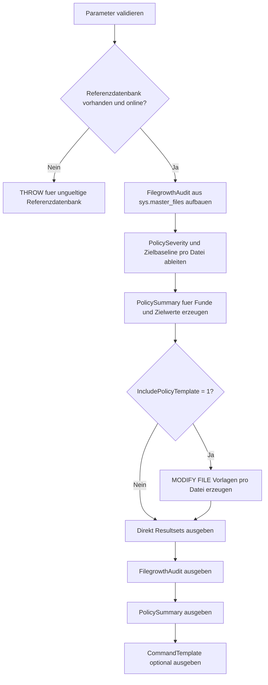

# FilegrowthPolicyAudit.sql

Dieses Skript prueft Daten- und Logdateien einer Referenzdatenbank auf problematische `FILEGROWTH`-Einstellungen. Es ordnet Prozentwachstum, sehr grosse fixe Spruenge und Abweichungen von einer didaktischen MB-Baseline ein und erzeugt lesende `ALTER DATABASE ... MODIFY FILE`-Vorlagen.

## Uebersicht

<!-- SQLDOC:SUMMARY_TABLE:BEGIN -->
| Feld | Wert |
|---|---|
| Script | [FilegrowthPolicyAudit.sql](FilegrowthPolicyAudit.sql) |
| Version | `1.0` |
| Typ | `diagnostic-query` |
| Kapitel | `20_Create_Database` |
| Sicherheit | `read-only` |
| Zweck | Prueft Datei-Growth-Einstellungen gegen eine konservative Policy fuer neue Datenbanken. |
<!-- SQLDOC:SUMMARY_TABLE:END -->

## Einordnung

`FILEGROWTH` wird bei neuen Datenbanken oft aus `model` uebernommen oder spaeter inkonsistent gesetzt. Das Skript macht diese Lage sichtbar, trennt zwischen Audit, Policy-Zusammenfassung und Vorlagenzeilen und fuehrt dabei keine aendernden Befehle aus.

## Annahmen

- Es handelt sich um eine didaktische, rein lesende Erstversion fuer Bootstrap- und Review-Zwecke.
- Die Zielpolicy bevorzugt feste Growth-Werte in MB statt Prozentwachstum.
- Datenfiles und Logdateien erhalten getrennte Standardwerte, damit ihr Wachstumsverhalten bewusst dokumentiert werden kann.
- Die generierten `MODIFY FILE`-Zeilen sind Vorlagen und muessen vor produktivem Einsatz gegen reale Speicher- und Betriebsregeln geprueft werden.

## Anwendungsfall

Das Skript eignet sich fuer Kapitel `20_Create_Database`, wenn Growth-Konventionen frueh standardisiert oder bestehende Defaults aus `model` und Referenzdatenbanken kritisch gelesen werden sollen. Das erste Resultset zeigt pro Datei die aktuelle Lage, das zweite verdichtet die wichtigsten Kennzahlen und das dritte liefert direkte Policy-Vorlagen.

## Parameter

<!-- SQLDOC:PARAMETERS_TABLE:BEGIN -->
| Parameter | SQL-Typ | Pflicht | Beschreibung |
|---|---|---|---|
| `@DatabaseName` | `SYSNAME` | Nein | Referenzdatenbank fuer das Audit; standardmaessig `model`. |
| `@TargetDatabaseName` | `SYSNAME` | Nein | Name der Zieldatenbank fuer generierte `MODIFY FILE`-Vorlagen. |
| `@PreferredDataGrowthMB` | `INT` | Nein | Bevorzugter fixer Growth-Wert fuer Datenfiles in MB. |
| `@PreferredLogGrowthMB` | `INT` | Nein | Bevorzugter fixer Growth-Wert fuer Logdateien in MB. |
| `@LargeGrowthThresholdMB` | `INT` | Nein | Schwelle fuer ungewoehnlich grosse fixe Growth-Schritte. |
| `@PercentGrowthRiskThreshold` | `INT` | Nein | Prozent-Schwelle, ab der Prozentwachstum als besonders riskant markiert wird. |
| `@IncludePolicyTemplate` | `BIT` | Nein | Gibt bei `1` zusaetzlich eine kompakte Zielpolicy mit `MODIFY FILE`-Vorlagen aus. |
<!-- SQLDOC:PARAMETERS_TABLE:END -->

## Abhaengigkeiten

<!-- SQLDOC:DEPENDENCIES_LIST:BEGIN -->
- `sys.databases`
- `sys.master_files`
- `tempdb` fuer temporaere Tabellen
- `CASE`
- `CONCAT`
- `QUOTENAME`
- `window functions`
<!-- SQLDOC:DEPENDENCIES_LIST:END -->

## Hinweise

- `FilegrowthAudit` zeigt Dateiart, aktuellen Growth-Modus, Zielbaseline und Review-Schwere pro Datei.
- `PolicySummary` fasst Prozentwachstum, hohe Funde und die bevorzugten Zielwerte kompakt zusammen.
- `CommandTemplate` erzeugt fuer jede Datei eine `ALTER DATABASE ... MODIFY FILE`-Vorlage mit festen MB-Werten.

## Versionshistorie

<!-- SQLDOC:VERSION_HISTORY_TABLE:BEGIN -->
| Version | Datum | User | Beschreibung |
|---|---|---|---|
| `1.0` | `2026-04-22` | `ER` | Erstversion des lesenden Filegrowth-Policy-Audits fuer CREATE DATABASE |
<!-- SQLDOC:VERSION_HISTORY_TABLE:END -->

## Ablauf

<!-- SQLDOC:MERMAID:BEGIN -->

<!-- SQLDOC:MERMAID:END -->

## SQL-Code

<!-- SQLDOC:SQL_CODE:BEGIN -->
```sql
/*
BEGIN:SQL-HEADER v1
---
sql_header: v1
script_name: "FilegrowthPolicyAudit.sql"
script_version: "1.0"
script_type: "diagnostic-query"
chapter: "20_Create_Database"
purpose: >
  Prueft Daten- und Logdateien auf problematische Growth-Einstellungen,
  ordnet typische Risikoindikatoren fuer CREATE-DATABASE-nahe Baselines
  ein und erzeugt lesende ALTER DATABASE ... MODIFY FILE Vorlagen fuer
  eine konsistente Filegrowth-Policy.

parameters:
  - name: "@DatabaseName"
    sql_type: "SYSNAME"
    direction: "IN"
    required: false
    description: "Referenzdatenbank fuer das Audit; standardmaessig model"
  - name: "@TargetDatabaseName"
    sql_type: "SYSNAME"
    direction: "IN"
    required: false
    description: "Name der Zieldatenbank fuer generierte MODIFY FILE Vorlagen"
  - name: "@PreferredDataGrowthMB"
    sql_type: "INT"
    direction: "IN"
    required: false
    description: "Bevorzugter fixer Growth-Wert fuer Datenfiles in MB"
  - name: "@PreferredLogGrowthMB"
    sql_type: "INT"
    direction: "IN"
    required: false
    description: "Bevorzugter fixer Growth-Wert fuer Logdateien in MB"
  - name: "@LargeGrowthThresholdMB"
    sql_type: "INT"
    direction: "IN"
    required: false
    description: "Schwelle fuer ungewoehnlich grosse fixe Growth-Schritte"
  - name: "@PercentGrowthRiskThreshold"
    sql_type: "INT"
    direction: "IN"
    required: false
    description: "Schwelle, ab der Prozentwachstum als besonders riskant markiert wird"
  - name: "@IncludePolicyTemplate"
    sql_type: "BIT"
    direction: "IN"
    required: false
    description: "1 = zusaetzlich MODIFY FILE Vorlagen und eine kompakte Zielpolicy ausgeben"

result_sets:
  - name: "FilegrowthAudit"
    description: "Zeigt aktuelle Growth-Parameter, Zielbaseline und Review-Schwere pro Datei"
  - name: "PolicySummary"
    description: "Verdichtet die haeufigsten Policy-Abweichungen und den empfohlenen Standard"
  - name: "CommandTemplate"
    description: "Erzeugt didaktische MODIFY FILE Vorlagen fuer Daten- und Logdateien"

dependencies:
  - "sys.databases"
  - "sys.master_files"
  - "tempdb temporary tables"
  - "CASE"
  - "CONCAT"
  - "QUOTENAME"
  - "window functions"

safety:
  level: "read-only"
  writes_data: false

documentation:
  markdown_file: "T-SQL/20_Create_Database/SQLScripts/FilegrowthPolicyAudit.md"
  sync_blocks:
    - "SUMMARY_TABLE"
    - "PARAMETERS_TABLE"
    - "DEPENDENCIES_LIST"
    - "VERSION_HISTORY_TABLE"
    - "SQL_CODE"
  mermaid:
    mode: "ai-agent-from-sql"
    source: "script-body"

main_responsible:
  name: "Erhard Rainer"
  initials: "ER"

version_history:
  - version: "1.0"
    date: "2026-04-22"
    user: "ER"
    description: "Erstversion des lesenden Filegrowth-Policy-Audits fuer CREATE DATABASE"

notes:
  - "Das Skript fuehrt keine Datei- oder Datenbankaenderungen aus."
  - "Die Zielpolicy bevorzugt feste Growth-Werte in MB statt Prozentwachstum."
---
END:SQL-HEADER v1
*/

SET NOCOUNT ON;

-- 1. Parameter vorbereiten
DECLARE @DatabaseName SYSNAME = N'model';
DECLARE @TargetDatabaseName SYSNAME = N'TrainingFilegrowthPolicyDemo';
DECLARE @PreferredDataGrowthMB INT = 256;
DECLARE @PreferredLogGrowthMB INT = 128;
DECLARE @LargeGrowthThresholdMB INT = 1024;
DECLARE @PercentGrowthRiskThreshold INT = 10;
DECLARE @IncludePolicyTemplate BIT = 1;

IF DB_ID(@DatabaseName) IS NULL
BEGIN
    THROW 50000, '@DatabaseName verweist auf keine vorhandene Datenbank.', 1;
END;

IF NOT EXISTS
(
    SELECT 1
    FROM sys.databases AS d
    WHERE d.name = @DatabaseName
      AND d.state_desc = 'ONLINE'
)
BEGIN
    THROW 50001, 'Die gewaehlte Referenzdatenbank muss ONLINE sein.', 1;
END;

IF @TargetDatabaseName IS NULL OR LTRIM(RTRIM(@TargetDatabaseName)) = N''
BEGIN
    THROW 50002, '@TargetDatabaseName darf nicht leer sein.', 1;
END;

IF @PreferredDataGrowthMB <= 0
BEGIN
    THROW 50003, '@PreferredDataGrowthMB muss groesser als 0 sein.', 1;
END;

IF @PreferredLogGrowthMB <= 0
BEGIN
    THROW 50004, '@PreferredLogGrowthMB muss groesser als 0 sein.', 1;
END;

IF @LargeGrowthThresholdMB <= 0
BEGIN
    THROW 50005, '@LargeGrowthThresholdMB muss groesser als 0 sein.', 1;
END;

IF @PercentGrowthRiskThreshold <= 0 OR @PercentGrowthRiskThreshold > 100
BEGIN
    THROW 50006, '@PercentGrowthRiskThreshold muss zwischen 1 und 100 liegen.', 1;
END;

IF @IncludePolicyTemplate NOT IN (0, 1)
BEGIN
    THROW 50007, '@IncludePolicyTemplate muss 0 oder 1 sein.', 1;
END;

DROP TABLE IF EXISTS #FilegrowthAudit;
DROP TABLE IF EXISTS #PolicySummary;
DROP TABLE IF EXISTS #CommandTemplate;

-- 2. Growth-Einstellungen inventarisieren und gegen eine Zielpolicy spiegeln
CREATE TABLE #FilegrowthAudit
(
    FileOrder INT NOT NULL,
    DatabaseName SYSNAME NOT NULL,
    FileId INT NOT NULL,
    FileType VARCHAR(20) NOT NULL,
    LogicalFileName SYSNAME NOT NULL,
    PhysicalFileName NVARCHAR(260) NOT NULL,
    CurrentSizeMB DECIMAL(18, 2) NOT NULL,
    GrowthMode VARCHAR(20) NOT NULL,
    CurrentGrowthDisplay VARCHAR(40) NOT NULL,
    TargetGrowthDisplay VARCHAR(40) NOT NULL,
    PolicySeverity VARCHAR(12) NOT NULL,
    PolicyCategory VARCHAR(40) NOT NULL,
    ReviewFocus VARCHAR(260) NOT NULL,
    RecommendedAction VARCHAR(260) NOT NULL
);

INSERT INTO #FilegrowthAudit
(
    FileOrder,
    DatabaseName,
    FileId,
    FileType,
    LogicalFileName,
    PhysicalFileName,
    CurrentSizeMB,
    GrowthMode,
    CurrentGrowthDisplay,
    TargetGrowthDisplay,
    PolicySeverity,
    PolicyCategory,
    ReviewFocus,
    RecommendedAction
)
SELECT
    ROW_NUMBER() OVER
    (
        ORDER BY
            CASE mf.type_desc WHEN 'ROWS' THEN 1 ELSE 2 END,
            mf.file_id
    ) AS FileOrder,
    DB_NAME(mf.database_id) AS DatabaseName,
    mf.file_id AS FileId,
    mf.type_desc AS FileType,
    mf.name AS LogicalFileName,
    mf.physical_name AS PhysicalFileName,
    CAST(mf.size / 128.0 AS DECIMAL(18, 2)) AS CurrentSizeMB,
    CASE
        WHEN mf.is_percent_growth = 1 THEN 'percent'
        ELSE 'fixed-mb'
    END AS GrowthMode,
    CASE
        WHEN mf.is_percent_growth = 1 THEN CONCAT(CONVERT(VARCHAR(20), mf.growth), '%')
        ELSE CONCAT(CONVERT(VARCHAR(30), CAST(mf.growth / 128.0 AS DECIMAL(18, 2))), ' MB')
    END AS CurrentGrowthDisplay,
    CASE
        WHEN mf.type_desc = 'LOG' THEN CONCAT(CONVERT(VARCHAR(20), @PreferredLogGrowthMB), ' MB')
        ELSE CONCAT(CONVERT(VARCHAR(20), @PreferredDataGrowthMB), ' MB')
    END AS TargetGrowthDisplay,
    CASE
        WHEN mf.is_percent_growth = 1 AND mf.growth >= @PercentGrowthRiskThreshold THEN 'high'
        WHEN mf.is_percent_growth = 1 THEN 'medium'
        WHEN CAST(mf.growth / 128.0 AS DECIMAL(18, 2)) > @LargeGrowthThresholdMB THEN 'high'
        WHEN mf.type_desc = 'ROWS'
             AND CAST(mf.growth / 128.0 AS DECIMAL(18, 2)) <> @PreferredDataGrowthMB THEN 'medium'
        WHEN mf.type_desc = 'LOG'
             AND CAST(mf.growth / 128.0 AS DECIMAL(18, 2)) <> @PreferredLogGrowthMB THEN 'medium'
        ELSE 'low'
    END AS PolicySeverity,
    CASE
        WHEN mf.is_percent_growth = 1 THEN 'Percent growth'
        WHEN mf.type_desc = 'ROWS' THEN 'Data file baseline'
        ELSE 'Log file baseline'
    END AS PolicyCategory,
    CASE
        WHEN mf.is_percent_growth = 1 AND mf.growth >= @PercentGrowthRiskThreshold THEN 'Prozentwachstum mit hohem Prozentwert fuehrt bei grossen Dateien schnell zu sprunghaften Kapazitaetsanforderungen.'
        WHEN mf.is_percent_growth = 1 THEN 'Prozentwachstum ist fuer Baselines schwerer planbar als fixe MB-Schritte.'
        WHEN CAST(mf.growth / 128.0 AS DECIMAL(18, 2)) > @LargeGrowthThresholdMB THEN 'Sehr grosse fixe Growth-Schritte sollten gegen Storage- und Wartungsfenster geprueft werden.'
        WHEN mf.type_desc = 'ROWS'
             AND CAST(mf.growth / 128.0 AS DECIMAL(18, 2)) <> @PreferredDataGrowthMB THEN 'Das Datenfile weicht von der didaktischen MB-Baseline fuer CREATE DATABASE ab.'
        WHEN mf.type_desc = 'LOG'
             AND CAST(mf.growth / 128.0 AS DECIMAL(18, 2)) <> @PreferredLogGrowthMB THEN 'Die Logdatei weicht von der konservativen Growth-Baseline fuer Transaktionslogs ab.'
        ELSE 'Die Datei passt zur vorgesehenen Growth-Policy.'
    END AS ReviewFocus,
    CASE
        WHEN mf.is_percent_growth = 1 THEN 'FILEGROWTH auf einen festen MB-Wert umstellen und den Zielwert im Bootstrap dokumentieren.'
        WHEN mf.type_desc = 'ROWS' THEN 'Datenfile auf die bevorzugte Data-Growth-Baseline angleichen.'
        ELSE 'Logdatei auf die bevorzugte Log-Growth-Baseline angleichen.'
    END AS RecommendedAction
FROM sys.master_files AS mf
WHERE mf.database_id = DB_ID(@DatabaseName);

-- 3. Policy-Zusammenfassung und Priorisierung ableiten
CREATE TABLE #PolicySummary
(
    SummaryOrder INT NOT NULL,
    SummaryLabel VARCHAR(80) NOT NULL,
    SummaryValue VARCHAR(80) NOT NULL,
    Interpretation VARCHAR(260) NOT NULL
);

INSERT INTO #PolicySummary
(
    SummaryOrder,
    SummaryLabel,
    SummaryValue,
    Interpretation
)
SELECT
    1,
    'Database name',
    MIN(fga.DatabaseName),
    'Referenzdatenbank fuer das aktuelle Filegrowth-Audit.'
FROM #FilegrowthAudit AS fga
UNION ALL
SELECT
    2,
    'Files audited',
    CONVERT(VARCHAR(20), COUNT(*)),
    'Anzahl der geprueften Daten- und Logdateien.'
FROM #FilegrowthAudit AS fga
UNION ALL
SELECT
    3,
    'High severity findings',
    CONVERT(VARCHAR(20), SUM(CASE WHEN fga.PolicySeverity = 'high' THEN 1 ELSE 0 END)),
    'Hohe Funde zeigen deutliche Policy-Abweichungen oder riskantes Prozentwachstum.'
FROM #FilegrowthAudit AS fga
UNION ALL
SELECT
    4,
    'Percent growth files',
    CONVERT(VARCHAR(20), SUM(CASE WHEN fga.GrowthMode = 'percent' THEN 1 ELSE 0 END)),
    'Dateien mit Prozentwachstum sind fuer CREATE-DATABASE-Baselines meist besonders review-beduerftig.'
FROM #FilegrowthAudit AS fga
UNION ALL
SELECT
    5,
    'Preferred data growth',
    CONCAT(CONVERT(VARCHAR(20), @PreferredDataGrowthMB), ' MB'),
    'Didaktischer Zielwert fuer Datenfiles.'
UNION ALL
SELECT
    6,
    'Preferred log growth',
    CONCAT(CONVERT(VARCHAR(20), @PreferredLogGrowthMB), ' MB'),
    'Didaktischer Zielwert fuer Logdateien.'
;

-- 4. MODIFY FILE Vorlagen fuer eine konsistente Policy erzeugen
CREATE TABLE #CommandTemplate
(
    CommandOrder INT NOT NULL,
    LogicalFileName SYSNAME NOT NULL,
    AppliesTo VARCHAR(20) NOT NULL,
    PriorityLevel VARCHAR(12) NOT NULL,
    GeneratedCommand NVARCHAR(MAX) NOT NULL,
    Rationale VARCHAR(260) NOT NULL
);

IF @IncludePolicyTemplate = 1
BEGIN
    INSERT INTO #CommandTemplate
    (
        CommandOrder,
        LogicalFileName,
        AppliesTo,
        PriorityLevel,
        GeneratedCommand,
        Rationale
    )
    SELECT
        fga.FileOrder,
        fga.LogicalFileName,
        fga.FileType,
        fga.PolicySeverity,
        CONCAT(
            N'ALTER DATABASE ',
            QUOTENAME(@TargetDatabaseName),
            N' MODIFY FILE ( NAME = ',
            QUOTENAME(fga.LogicalFileName, ''''),
            N', FILEGROWTH = ',
            CASE
                WHEN fga.FileType = 'LOG' THEN CONVERT(NVARCHAR(20), @PreferredLogGrowthMB)
                ELSE CONVERT(NVARCHAR(20), @PreferredDataGrowthMB)
            END,
            N'MB );'
        ) AS GeneratedCommand,
        fga.RecommendedAction
    FROM #FilegrowthAudit AS fga;
END;

-- 5. Ergebnisse ausgeben
SELECT
    fga.FileOrder,
    fga.DatabaseName,
    fga.FileId,
    fga.FileType,
    fga.LogicalFileName,
    fga.PhysicalFileName,
    fga.CurrentSizeMB,
    fga.GrowthMode,
    fga.CurrentGrowthDisplay,
    fga.TargetGrowthDisplay,
    fga.PolicySeverity,
    fga.PolicyCategory,
    fga.ReviewFocus,
    fga.RecommendedAction
FROM #FilegrowthAudit AS fga
ORDER BY
    fga.FileOrder;

SELECT
    ps.SummaryOrder,
    ps.SummaryLabel,
    ps.SummaryValue,
    ps.Interpretation
FROM #PolicySummary AS ps
ORDER BY
    ps.SummaryOrder;

IF @IncludePolicyTemplate = 1
BEGIN
    SELECT
        ct.CommandOrder,
        ct.LogicalFileName,
        ct.AppliesTo,
        ct.PriorityLevel,
        ct.GeneratedCommand,
        ct.Rationale
    FROM #CommandTemplate AS ct
    ORDER BY
        ct.CommandOrder;
END;
```
<!-- SQLDOC:SQL_CODE:END -->
