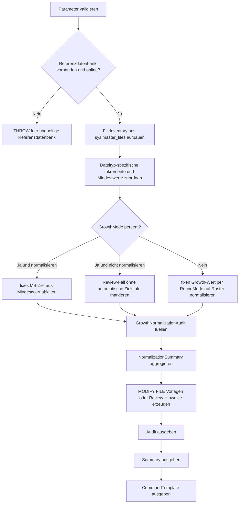

# GrowthIncrementNormalizer.sql

Dieses Skript inventarisiert die aktuellen `FILEGROWTH`-Werte einer Referenzdatenbank und harmonisiert sie auf feste MB-Inkremente fuer Daten- und Logfiles. Dabei werden nur Analyseergebnisse und `ALTER DATABASE ... MODIFY FILE`-Vorlagen erzeugt, keine aendernden Befehle ausgefuehrt.

## Uebersicht

<!-- SQLDOC:SUMMARY_TABLE:BEGIN -->
| Feld | Wert |
|---|---|
| Script | [GrowthIncrementNormalizer.sql](GrowthIncrementNormalizer.sql) |
| Version | `1.0` |
| Typ | `diagnostic-query` |
| Kapitel | `20_Create_Database` |
| Sicherheit | `read-only` |
| Zweck | Normalisiert Growth-Inkremente fuer Daten- und Logfiles auf feste MB-Raster und erzeugt passende `MODIFY FILE`-Vorlagen. |
<!-- SQLDOC:SUMMARY_TABLE:END -->

## Einordnung

Im Kapitel `20_Create_Database` helfen konsistente Growth-Inkremente dabei, Baselines fuer neue Datenbanken nachvollziehbar zu halten. Das Skript trennt zwischen Audit, Zusammenfassung und Vorlagenbildung, damit Prozentwachstum, zu kleine Growth-Werte und uneinheitliche Raster sichtbar bleiben.

## Annahmen

- Es handelt sich um eine didaktische, rein lesende Erstversion fuer Review- und Bootstrap-Zwecke.
- `model` dient standardmaessig als Referenzdatenbank fuer neue Datenbanken.
- Datenfiles und Logdateien erhalten getrennte Inkrementraster, weil sich ihre Growth-Strategien typischerweise unterscheiden.
- Prozentwachstum wird standardmaessig auf feste MB-Werte ueberfuehrt; bei deaktivierter Normalisierung bleibt es als manueller Review-Fall markiert.

## Anwendungsfall

Das Skript eignet sich fuer Standards, Audits und Bootstrap-Workflows rund um `CREATE DATABASE`. Das erste Resultset zeigt pro Datei die aktuelle und die normalisierte Growth-Stufe, das zweite verdichtet die wichtigsten Signale und das dritte liefert direkt wiederverwendbare `MODIFY FILE`-Vorlagen.

## Parameter

<!-- SQLDOC:PARAMETERS_TABLE:BEGIN -->
| Parameter | SQL-Typ | Pflicht | Beschreibung |
|---|---|---|---|
| `@DatabaseName` | `SYSNAME` | Nein | Referenzdatenbank fuer das File-Inventar; standardmaessig `model`. |
| `@TargetDatabaseName` | `SYSNAME` | Nein | Name der Zieldatenbank fuer generierte `MODIFY FILE`-Vorlagen. |
| `@DataGrowthIncrementMB` | `INT` | Nein | Gewuenschtes MB-Inkrement fuer Datenfiles. |
| `@LogGrowthIncrementMB` | `INT` | Nein | Gewuenschtes MB-Inkrement fuer Logdateien. |
| `@MinimumDataGrowthMB` | `INT` | Nein | Untergrenze fuer normalisierte Datenfile-Growth-Werte. |
| `@MinimumLogGrowthMB` | `INT` | Nein | Untergrenze fuer normalisierte Logfile-Growth-Werte. |
| `@NormalizePercentGrowth` | `BIT` | Nein | Fuehrt bei `1` Prozentwachstum in fixe MB-Inkremente ueber. |
| `@RoundMode` | `VARCHAR(10)` | Nein | Rundungsmodus fuer fixe Growth-Werte: `UP`, `DOWN` oder `NEAREST`. |
<!-- SQLDOC:PARAMETERS_TABLE:END -->

## Abhaengigkeiten

<!-- SQLDOC:DEPENDENCIES_LIST:BEGIN -->
- `sys.databases`
- `sys.master_files`
- `tempdb` fuer temporaere Tabellen
- `CASE`
- `CEILING`
- `FLOOR`
- `CONCAT`
- `QUOTENAME`
- `window functions`
<!-- SQLDOC:DEPENDENCIES_LIST:END -->

## Hinweise

- `GrowthNormalizationAudit` zeigt Dateityp, aktuelles Growth-Muster, Zielraster und Harmonisierungsempfehlung pro Datei.
- `NormalizationSummary` fasst Prozentwachstum, Zahl der anzupassenden Dateien und die aktiven Rasterwerte zusammen.
- `CommandTemplate` erzeugt fuer jede Datei eine `ALTER DATABASE ... MODIFY FILE`-Vorlage oder einen Review-Hinweis, wenn Prozentwachstum bewusst unberuecksichtigt bleibt.

## Versionshistorie

<!-- SQLDOC:VERSION_HISTORY_TABLE:BEGIN -->
| Version | Datum | User | Beschreibung |
|---|---|---|---|
| `1.0` | `2026-04-22` | `ER` | Erstversion des lesenden Growth-Increment-Normalizers fuer CREATE DATABASE |
<!-- SQLDOC:VERSION_HISTORY_TABLE:END -->

## Ablauf

<!-- SQLDOC:MERMAID:BEGIN -->

<!-- SQLDOC:MERMAID:END -->

## SQL-Code

<!-- SQLDOC:SQL_CODE:BEGIN -->
```sql
/*
BEGIN:SQL-HEADER v1
---
sql_header: v1
script_name: "GrowthIncrementNormalizer.sql"
script_version: "1.0"
script_type: "diagnostic-query"
chapter: "20_Create_Database"
purpose: >
  Inventarisiert Growth-Einstellungen von Daten- und Logfiles, normalisiert
  fixe Growth-Schritte auf definierte MB-Inkremente und erzeugt passende
  ALTER DATABASE ... MODIFY FILE Vorlagen, ohne selbst persistente Aenderungen
  auszufuehren.

parameters:
  - name: "@DatabaseName"
    sql_type: "SYSNAME"
    direction: "IN"
    required: false
    description: "Referenzdatenbank fuer das File-Inventar; standardmaessig model"
  - name: "@TargetDatabaseName"
    sql_type: "SYSNAME"
    direction: "IN"
    required: false
    description: "Name der Zieldatenbank fuer generierte MODIFY FILE Vorlagen"
  - name: "@DataGrowthIncrementMB"
    sql_type: "INT"
    direction: "IN"
    required: false
    description: "Gewuenschtes MB-Inkrement fuer Datenfiles"
  - name: "@LogGrowthIncrementMB"
    sql_type: "INT"
    direction: "IN"
    required: false
    description: "Gewuenschtes MB-Inkrement fuer Logdateien"
  - name: "@MinimumDataGrowthMB"
    sql_type: "INT"
    direction: "IN"
    required: false
    description: "Untergrenze fuer normalisierte Datenfile-Growth-Werte"
  - name: "@MinimumLogGrowthMB"
    sql_type: "INT"
    direction: "IN"
    required: false
    description: "Untergrenze fuer normalisierte Logfile-Growth-Werte"
  - name: "@NormalizePercentGrowth"
    sql_type: "BIT"
    direction: "IN"
    required: false
    description: "1 = Prozentwachstum in fixe MB-Inkremente ueberfuehren, 0 = Prozentwachstum nur markieren"
  - name: "@RoundMode"
    sql_type: "VARCHAR(10)"
    direction: "IN"
    required: false
    description: "Rundungsmodus fuer fixe Growth-Werte: UP, DOWN oder NEAREST"

result_sets:
  - name: "GrowthNormalizationAudit"
    description: "Zeigt aktuelles Growth-Muster, normalisierte Zielwerte und Review-Fokus pro Datei"
  - name: "NormalizationSummary"
    description: "Verdichtet die wichtigsten Harmonisierungssignale fuer Daten- und Logfiles"
  - name: "CommandTemplate"
    description: "Erzeugt ALTER DATABASE ... MODIFY FILE Vorlagen mit normalisierten Growth-Inkrementen"

dependencies:
  - "sys.databases"
  - "sys.master_files"
  - "tempdb temporary tables"
  - "CASE"
  - "CEILING"
  - "FLOOR"
  - "CONCAT"
  - "QUOTENAME"
  - "window functions"

safety:
  level: "read-only"
  writes_data: false

documentation:
  markdown_file: "T-SQL/20_Create_Database/SQLScripts/GrowthIncrementNormalizer.md"
  sync_blocks:
    - "SUMMARY_TABLE"
    - "PARAMETERS_TABLE"
    - "DEPENDENCIES_LIST"
    - "VERSION_HISTORY_TABLE"
    - "SQL_CODE"
  mermaid:
    mode: "ai-agent-from-sql"
    source: "script-body"

main_responsible:
  name: "Erhard Rainer"
  initials: "ER"

version_history:
  - version: "1.0"
    date: "2026-04-22"
    user: "ER"
    description: "Erstversion des lesenden Growth-Increment-Normalizers fuer CREATE DATABASE"

notes:
  - "Das Skript fuehrt keine ALTER DATABASE Anweisungen aus."
  - "Die Harmonisierung orientiert sich an festen MB-Inkrementen statt Prozentwachstum."
---
END:SQL-HEADER v1
*/

SET NOCOUNT ON;

-- 1. Parameter vorbereiten
DECLARE @DatabaseName SYSNAME = N'model';
DECLARE @TargetDatabaseName SYSNAME = N'TrainingGrowthNormalizationDemo';
DECLARE @DataGrowthIncrementMB INT = 64;
DECLARE @LogGrowthIncrementMB INT = 128;
DECLARE @MinimumDataGrowthMB INT = 64;
DECLARE @MinimumLogGrowthMB INT = 128;
DECLARE @NormalizePercentGrowth BIT = 1;
DECLARE @RoundMode VARCHAR(10) = 'UP';

IF DB_ID(@DatabaseName) IS NULL
BEGIN
    THROW 50000, '@DatabaseName verweist auf keine vorhandene Datenbank.', 1;
END;

IF NOT EXISTS
(
    SELECT 1
    FROM sys.databases AS d
    WHERE d.name = @DatabaseName
      AND d.state_desc = 'ONLINE'
)
BEGIN
    THROW 50001, 'Die gewaehlte Referenzdatenbank muss ONLINE sein.', 1;
END;

IF @TargetDatabaseName IS NULL OR LTRIM(RTRIM(@TargetDatabaseName)) = N''
BEGIN
    THROW 50002, '@TargetDatabaseName darf nicht leer sein.', 1;
END;

IF @DataGrowthIncrementMB <= 0
BEGIN
    THROW 50003, '@DataGrowthIncrementMB muss groesser als 0 sein.', 1;
END;

IF @LogGrowthIncrementMB <= 0
BEGIN
    THROW 50004, '@LogGrowthIncrementMB muss groesser als 0 sein.', 1;
END;

IF @MinimumDataGrowthMB <= 0
BEGIN
    THROW 50005, '@MinimumDataGrowthMB muss groesser als 0 sein.', 1;
END;

IF @MinimumLogGrowthMB <= 0
BEGIN
    THROW 50006, '@MinimumLogGrowthMB muss groesser als 0 sein.', 1;
END;

IF @NormalizePercentGrowth NOT IN (0, 1)
BEGIN
    THROW 50007, '@NormalizePercentGrowth muss 0 oder 1 sein.', 1;
END;

IF UPPER(@RoundMode) NOT IN ('UP', 'DOWN', 'NEAREST')
BEGIN
    THROW 50008, '@RoundMode muss UP, DOWN oder NEAREST sein.', 1;
END;

DROP TABLE IF EXISTS #GrowthNormalizationAudit;
DROP TABLE IF EXISTS #NormalizationSummary;
DROP TABLE IF EXISTS #CommandTemplate;

-- 2. Datei-Inventar mit normalisierten Zielwerten aufbauen
CREATE TABLE #GrowthNormalizationAudit
(
    FileOrder INT NOT NULL,
    DatabaseName SYSNAME NOT NULL,
    FileId INT NOT NULL,
    FileType VARCHAR(20) NOT NULL,
    LogicalFileName SYSNAME NOT NULL,
    PhysicalFileName NVARCHAR(260) NOT NULL,
    CurrentSizeMB DECIMAL(18, 2) NOT NULL,
    GrowthMode VARCHAR(20) NOT NULL,
    CurrentGrowthDisplay VARCHAR(40) NOT NULL,
    CurrentGrowthMB DECIMAL(18, 2) NULL,
    TargetIncrementMB INT NOT NULL,
    MinimumGrowthMB INT NOT NULL,
    NormalizedGrowthMB INT NULL,
    TargetGrowthDisplay VARCHAR(40) NOT NULL,
    ReviewSeverity VARCHAR(12) NOT NULL,
    NormalizationAction VARCHAR(40) NOT NULL,
    ReviewFocus VARCHAR(260) NOT NULL,
    RecommendedAction VARCHAR(260) NOT NULL
);

WITH FileInventory AS
(
    SELECT
        ROW_NUMBER() OVER
        (
            ORDER BY
                CASE mf.type_desc WHEN 'ROWS' THEN 1 ELSE 2 END,
                mf.file_id
        ) AS FileOrder,
        DB_NAME(mf.database_id) AS DatabaseName,
        mf.file_id AS FileId,
        mf.type_desc AS FileType,
        mf.name AS LogicalFileName,
        mf.physical_name AS PhysicalFileName,
        CAST(mf.size / 128.0 AS DECIMAL(18, 2)) AS CurrentSizeMB,
        CASE
            WHEN mf.is_percent_growth = 1 THEN 'percent'
            ELSE 'fixed-mb'
        END AS GrowthMode,
        CASE
            WHEN mf.is_percent_growth = 1 THEN CONCAT(CONVERT(VARCHAR(20), mf.growth), '%')
            ELSE CONCAT(CONVERT(VARCHAR(30), CAST(mf.growth / 128.0 AS DECIMAL(18, 2))), ' MB')
        END AS CurrentGrowthDisplay,
        CASE
            WHEN mf.is_percent_growth = 1 THEN NULL
            ELSE CAST(mf.growth / 128.0 AS DECIMAL(18, 2))
        END AS CurrentGrowthMB,
        CASE
            WHEN mf.type_desc = 'LOG' THEN @LogGrowthIncrementMB
            ELSE @DataGrowthIncrementMB
        END AS TargetIncrementMB,
        CASE
            WHEN mf.type_desc = 'LOG' THEN @MinimumLogGrowthMB
            ELSE @MinimumDataGrowthMB
        END AS MinimumGrowthMB
    FROM sys.master_files AS mf
    WHERE mf.database_id = DB_ID(@DatabaseName)
),
NormalizedInventory AS
(
    SELECT
        fi.FileOrder,
        fi.DatabaseName,
        fi.FileId,
        fi.FileType,
        fi.LogicalFileName,
        fi.PhysicalFileName,
        fi.CurrentSizeMB,
        fi.GrowthMode,
        fi.CurrentGrowthDisplay,
        fi.CurrentGrowthMB,
        fi.TargetIncrementMB,
        fi.MinimumGrowthMB,
        CASE
            WHEN fi.GrowthMode = 'percent' AND @NormalizePercentGrowth = 0 THEN NULL
            WHEN fi.GrowthMode = 'percent' THEN fi.MinimumGrowthMB
            WHEN UPPER(@RoundMode) = 'UP' THEN
                CASE
                    WHEN fi.CurrentGrowthMB IS NULL THEN fi.MinimumGrowthMB
                    ELSE
                        CASE
                            WHEN CAST(CEILING(fi.CurrentGrowthMB / fi.TargetIncrementMB) * fi.TargetIncrementMB AS INT) < fi.MinimumGrowthMB
                                THEN fi.MinimumGrowthMB
                            ELSE CAST(CEILING(fi.CurrentGrowthMB / fi.TargetIncrementMB) * fi.TargetIncrementMB AS INT)
                        END
                END
            WHEN UPPER(@RoundMode) = 'DOWN' THEN
                CASE
                    WHEN fi.CurrentGrowthMB IS NULL THEN fi.MinimumGrowthMB
                    ELSE
                        CASE
                            WHEN CAST(FLOOR(fi.CurrentGrowthMB / fi.TargetIncrementMB) * fi.TargetIncrementMB AS INT) < fi.MinimumGrowthMB
                                THEN fi.MinimumGrowthMB
                            ELSE CAST(FLOOR(fi.CurrentGrowthMB / fi.TargetIncrementMB) * fi.TargetIncrementMB AS INT)
                        END
                END
            ELSE
                CASE
                    WHEN fi.CurrentGrowthMB IS NULL THEN fi.MinimumGrowthMB
                    ELSE
                        CASE
                            WHEN CAST(ROUND(fi.CurrentGrowthMB / fi.TargetIncrementMB, 0) * fi.TargetIncrementMB AS INT) < fi.MinimumGrowthMB
                                THEN fi.MinimumGrowthMB
                            ELSE CAST(ROUND(fi.CurrentGrowthMB / fi.TargetIncrementMB, 0) * fi.TargetIncrementMB AS INT)
                        END
                END
        END AS NormalizedGrowthMB
    FROM FileInventory AS fi
)
INSERT INTO #GrowthNormalizationAudit
(
    FileOrder,
    DatabaseName,
    FileId,
    FileType,
    LogicalFileName,
    PhysicalFileName,
    CurrentSizeMB,
    GrowthMode,
    CurrentGrowthDisplay,
    CurrentGrowthMB,
    TargetIncrementMB,
    MinimumGrowthMB,
    NormalizedGrowthMB,
    TargetGrowthDisplay,
    ReviewSeverity,
    NormalizationAction,
    ReviewFocus,
    RecommendedAction
)
SELECT
    ni.FileOrder,
    ni.DatabaseName,
    ni.FileId,
    ni.FileType,
    ni.LogicalFileName,
    ni.PhysicalFileName,
    ni.CurrentSizeMB,
    ni.GrowthMode,
    ni.CurrentGrowthDisplay,
    ni.CurrentGrowthMB,
    ni.TargetIncrementMB,
    ni.MinimumGrowthMB,
    ni.NormalizedGrowthMB,
    CASE
        WHEN ni.NormalizedGrowthMB IS NULL THEN 'review-percent-growth'
        ELSE CONCAT(CONVERT(VARCHAR(20), ni.NormalizedGrowthMB), ' MB')
    END AS TargetGrowthDisplay,
    CASE
        WHEN ni.GrowthMode = 'percent' AND @NormalizePercentGrowth = 0 THEN 'high'
        WHEN ni.GrowthMode = 'percent' THEN 'high'
        WHEN ni.CurrentGrowthMB = ni.NormalizedGrowthMB THEN 'low'
        WHEN ABS(ni.CurrentGrowthMB - ni.NormalizedGrowthMB) >= ni.TargetIncrementMB THEN 'medium'
        ELSE 'low'
    END AS ReviewSeverity,
    CASE
        WHEN ni.GrowthMode = 'percent' AND @NormalizePercentGrowth = 0 THEN 'keep-percent-for-review'
        WHEN ni.GrowthMode = 'percent' THEN 'convert-percent-to-fixed'
        WHEN ni.CurrentGrowthMB = ni.NormalizedGrowthMB THEN 'keep-fixed-growth'
        ELSE 'normalize-fixed-growth'
    END AS NormalizationAction,
    CASE
        WHEN ni.GrowthMode = 'percent' AND @NormalizePercentGrowth = 0 THEN 'Prozentwachstum bleibt sichtbar und muss vor einer einheitlichen Baseline manuell entschieden werden.'
        WHEN ni.GrowthMode = 'percent' THEN 'Prozentwachstum wird auf ein fixes MB-Inkrement ueberfuehrt, damit CREATE-DATABASE-Baselines konsistent dokumentiert werden koennen.'
        WHEN ni.CurrentGrowthMB = ni.NormalizedGrowthMB THEN 'Der aktuelle Growth-Wert entspricht bereits dem gewuenschten Inkrementraster.'
        WHEN ni.CurrentGrowthMB < ni.MinimumGrowthMB THEN 'Der aktuelle Growth-Wert liegt unter der definierten Untergrenze und wird auf die Mindeststufe angehoben.'
        ELSE 'Der aktuelle Growth-Wert wird auf das definierte Inkrementraster fuer den Dateityp gerundet.'
    END AS ReviewFocus,
    CASE
        WHEN ni.GrowthMode = 'percent' AND @NormalizePercentGrowth = 0 THEN 'Prozentwachstum separat reviewen und anschliessend bewusst auf feste MB-Werte oder einen begruendeten Sonderfall festlegen.'
        WHEN ni.FileType = 'LOG' THEN 'Logfile auf das normalisierte Log-Inkrement angleichen und den Wert in der Datei-Policy dokumentieren.'
        ELSE 'Datenfile auf das normalisierte Data-Inkrement angleichen und denselben Rasterwert in CREATE DATABASE Vorlagen uebernehmen.'
    END AS RecommendedAction
FROM NormalizedInventory AS ni;

-- 3. Zusammenfassung der Harmonisierung erzeugen
CREATE TABLE #NormalizationSummary
(
    SummaryOrder INT NOT NULL,
    SummaryLabel VARCHAR(80) NOT NULL,
    SummaryValue VARCHAR(80) NOT NULL,
    Interpretation VARCHAR(260) NOT NULL
);

INSERT INTO #NormalizationSummary
(
    SummaryOrder,
    SummaryLabel,
    SummaryValue,
    Interpretation
)
SELECT
    1,
    'Database name',
    MIN(gna.DatabaseName),
    'Referenzdatenbank fuer die aktuelle Growth-Harmonisierung.'
FROM #GrowthNormalizationAudit AS gna
UNION ALL
SELECT
    2,
    'Files audited',
    CONVERT(VARCHAR(20), COUNT(*)),
    'Anzahl der geprueften Daten- und Logdateien.'
FROM #GrowthNormalizationAudit AS gna
UNION ALL
SELECT
    3,
    'Percent growth files',
    CONVERT(VARCHAR(20), SUM(CASE WHEN gna.GrowthMode = 'percent' THEN 1 ELSE 0 END)),
    'Diese Dateien brechen das feste Inkrementraster und sind prioritaer zu harmonisieren.'
FROM #GrowthNormalizationAudit AS gna
UNION ALL
SELECT
    4,
    'Normalized files',
    CONVERT(VARCHAR(20), SUM(CASE WHEN gna.NormalizationAction IN ('convert-percent-to-fixed', 'normalize-fixed-growth') THEN 1 ELSE 0 END)),
    'Zeigt, wie viele Dateien auf eine andere Growth-Stufe gebracht werden sollten.'
FROM #GrowthNormalizationAudit AS gna
UNION ALL
SELECT
    5,
    'Data increment',
    CONCAT(CONVERT(VARCHAR(20), @DataGrowthIncrementMB), ' MB'),
    'Didaktisches Inkrementraster fuer Datenfiles.'
UNION ALL
SELECT
    6,
    'Log increment',
    CONCAT(CONVERT(VARCHAR(20), @LogGrowthIncrementMB), ' MB'),
    'Didaktisches Inkrementraster fuer Logdateien.'
;

-- 4. MODIFY FILE Vorlagen fuer normalisierte Growth-Werte erzeugen
CREATE TABLE #CommandTemplate
(
    CommandOrder INT NOT NULL,
    LogicalFileName SYSNAME NOT NULL,
    AppliesTo VARCHAR(20) NOT NULL,
    PriorityLevel VARCHAR(12) NOT NULL,
    GeneratedCommand NVARCHAR(MAX) NOT NULL,
    Rationale VARCHAR(260) NOT NULL
);

INSERT INTO #CommandTemplate
(
    CommandOrder,
    LogicalFileName,
    AppliesTo,
    PriorityLevel,
    GeneratedCommand,
    Rationale
)
SELECT
    gna.FileOrder,
    gna.LogicalFileName,
    gna.FileType,
    gna.ReviewSeverity,
    CASE
        WHEN gna.NormalizedGrowthMB IS NULL THEN
            N'-- Prozentwachstum manuell pruefen: keine automatische MODIFY FILE Vorlage erzeugt.'
        ELSE
            CONCAT(
                N'ALTER DATABASE ',
                QUOTENAME(@TargetDatabaseName),
                N' MODIFY FILE ( NAME = ',
                QUOTENAME(gna.LogicalFileName, ''''),
                N', FILEGROWTH = ',
                CONVERT(NVARCHAR(20), gna.NormalizedGrowthMB),
                N'MB );'
            )
    END AS GeneratedCommand,
    gna.RecommendedAction
FROM #GrowthNormalizationAudit AS gna;

-- 5. Ergebnisse ausgeben
SELECT
    gna.FileOrder,
    gna.DatabaseName,
    gna.FileId,
    gna.FileType,
    gna.LogicalFileName,
    gna.PhysicalFileName,
    gna.CurrentSizeMB,
    gna.GrowthMode,
    gna.CurrentGrowthDisplay,
    gna.TargetIncrementMB,
    gna.MinimumGrowthMB,
    gna.TargetGrowthDisplay,
    gna.ReviewSeverity,
    gna.NormalizationAction,
    gna.ReviewFocus,
    gna.RecommendedAction
FROM #GrowthNormalizationAudit AS gna
ORDER BY
    gna.FileOrder;

SELECT
    ns.SummaryOrder,
    ns.SummaryLabel,
    ns.SummaryValue,
    ns.Interpretation
FROM #NormalizationSummary AS ns
ORDER BY
    ns.SummaryOrder;

SELECT
    ct.CommandOrder,
    ct.LogicalFileName,
    ct.AppliesTo,
    ct.PriorityLevel,
    ct.GeneratedCommand,
    ct.Rationale
FROM #CommandTemplate AS ct
ORDER BY
    ct.CommandOrder;
```
<!-- SQLDOC:SQL_CODE:END -->
