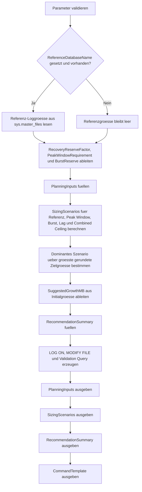

# LogFileSizingPlanner.sql

Dieses Skript plant eine didaktisch nachvollziehbare initiale Logfile-Groesse fuer neue Datenbanken im Kapitel `20_Create_Database`. Es kombiniert Referenzgroesse, Lastfenster, grosse Einzeltransaktionen und Recovery-Reserve zu mehreren Bemessungsszenarien und erzeugt daraus rein lesende Vorlagen fuer `CREATE DATABASE` und `ALTER DATABASE`.

## Uebersicht

<!-- SQLDOC:SUMMARY_TABLE:BEGIN -->
| Feld | Wert |
|---|---|
| Script | [LogFileSizingPlanner.sql](LogFileSizingPlanner.sql) |
| Version | `1.0` |
| Typ | `template` |
| Kapitel | `20_Create_Database` |
| Sicherheit | `read-only` |
| Zweck | Plant eine konservative initiale Logfile-Groesse aus Last- und Transaktionsannahmen und erzeugt passende DDL-Vorlagen. |
<!-- SQLDOC:SUMMARY_TABLE:END -->

## Einordnung

Logfiles werden in Trainings- und Praxisumgebungen oft zu klein angelegt und wachsen dann frueh in unruhigen Schritten. Das Skript trennt deshalb zwischen Eingangsannahmen, mehreren Planungsmodellen und der finalen Empfehlung. So bleibt sichtbar, ob die Erstgroesse eher durch eine Referenzdatenbank, durch das Lastfenster oder durch grosse parallel laufende Transaktionen getrieben wird.

## Annahmen

- Es handelt sich um eine didaktische Template-Erstversion fuer Planungs- und Review-Situationen.
- Die Formeln liefern konservative Richtwerte und ersetzen keine Messung produktiver Workloads.
- `model` dient standardmaessig als Referenzdatenbank, falls kein anderer Basispunkt genannt wird.
- Das Recovery Model beeinflusst nur einen Reservefaktor, nicht die operative Backup-Strategie selbst.
- Dateipfade in den erzeugten Befehlen bleiben bewusst Platzhalter und muessen an die lokale Pfadkonvention angepasst werden.

## Anwendungsfall

Das Skript eignet sich fuer Bootstrap-Workshops, Datenbankstandards und Architektur-Reviews. Das erste Resultset zeigt die verwendeten Eingaben, das zweite vergleicht mehrere Sizing-Szenarien, das dritte verdichtet die dominante Empfehlung und das vierte liefert direkt uebernehmbare Befehlsvorlagen.

## Parameter

<!-- SQLDOC:PARAMETERS_TABLE:BEGIN -->
| Parameter | SQL-Typ | Pflicht | Beschreibung |
|---|---|---|---|
| `@TargetDatabaseName` | `SYSNAME` | Nein | Name der Zieldatenbank fuer die generierten Logfile-Vorlagen. |
| `@ReferenceDatabaseName` | `SYSNAME` | Nein | Optionale Referenzdatenbank fuer eine konservative Ausgangsgroesse; standardmaessig `model`. |
| `@EstimatedLogGenerationMBPerMinute` | `DECIMAL(12,2)` | Nein | Didaktische Schaetzung des erzeugten Transaktionslogs pro Minute waehrend der Lastspitze. |
| `@PeakLoadWindowMinutes` | `INT` | Nein | Kritisches Lastfenster, das ohne sofortiges Wachstum abgefangen werden soll. |
| `@LargestSingleTransactionMB` | `DECIMAL(12,2)` | Nein | Groesste erwartete Einzeltransaktion in MB. |
| `@ConcurrentLongRunningTransactions` | `INT` | Nein | Anzahl parallel laufender Transaktionen mit laenger gebundenem Logplatz. |
| `@SafetyBufferPercent` | `INT` | Nein | Sicherheitsaufschlag fuer Unschaerfen in Last- und Batchannahmen. |
| `@GrowthIncrementMB` | `INT` | Nein | Raster fuer die Rundung der empfohlenen Initialgroesse. |
| `@RecoveryModel` | `VARCHAR(20)` | Nein | Didaktischer Kontext fuer die Reserve: `SIMPLE`, `FULL` oder `BULK_LOGGED`. |
<!-- SQLDOC:PARAMETERS_TABLE:END -->

## Abhaengigkeiten

<!-- SQLDOC:DEPENDENCIES_LIST:BEGIN -->
- `sys.databases`
- `sys.master_files`
- temporaere Tabellen in `tempdb`
- `CASE`
- `CEILING`
- `CONCAT`
- `MAX`
- `QUOTENAME`
<!-- SQLDOC:DEPENDENCIES_LIST:END -->

## Hinweise

- `PlanningInputs` dokumentiert alle Eingaben und die abgeleitete Referenzbasis fuer das Sizing.
- `SizingScenarios` stellt Referenz-, Durchsatz-, Burst- und Kombinationsszenarien mit Buffer und Rasterrundung gegenueber.
- `RecommendationSummary` zeigt, welches Szenario die finale Initialgroesse bestimmt.
- `CommandTemplate` liefert eine didaktische `LOG ON`-Klausel, eine `MODIFY FILE`-Vorlage und einen kompakten Validierungslauf.

## Versionshistorie

<!-- SQLDOC:VERSION_HISTORY_TABLE:BEGIN -->
| Version | Datum | User | Beschreibung |
|---|---|---|---|
| `1.0` | `2026-04-22` | `ER` | Erstversion des didaktischen Logfile-Sizing-Planers fuer CREATE DATABASE |
<!-- SQLDOC:VERSION_HISTORY_TABLE:END -->

## Ablauf

<!-- SQLDOC:MERMAID:BEGIN -->

<!-- SQLDOC:MERMAID:END -->

## SQL-Code

<!-- SQLDOC:SQL_CODE:BEGIN -->
```sql
/*
BEGIN:SQL-HEADER v1
---
sql_header: v1
script_name: "LogFileSizingPlanner.sql"
script_version: "1.0"
script_type: "template"
chapter: "20_Create_Database"
purpose: >
  Plant eine didaktisch nachvollziehbare initiale Logfile-Groesse fuer neue
  Datenbanken, leitet mehrere Bemessungsszenarien aus Last- und
  Transaktionsannahmen ab und erzeugt passende CREATE DATABASE- sowie ALTER
  DATABASE Vorlagen, ohne selbst persistente Aenderungen auszufuehren.

parameters:
  - name: "@TargetDatabaseName"
    sql_type: "SYSNAME"
    direction: "IN"
    required: false
    description: "Name der Zieldatenbank fuer die generierten Logfile-Vorlagen"
  - name: "@ReferenceDatabaseName"
    sql_type: "SYSNAME"
    direction: "IN"
    required: false
    description: "Optionale Referenzdatenbank fuer eine konservative Ausgangsgroesse; standardmaessig model"
  - name: "@EstimatedLogGenerationMBPerMinute"
    sql_type: "DECIMAL(12,2)"
    direction: "IN"
    required: false
    description: "Didaktische Schaetzung des erzeugten Transaktionslogs pro Minute waehrend der Lastspitze"
  - name: "@PeakLoadWindowMinutes"
    sql_type: "INT"
    direction: "IN"
    required: false
    description: "Laenge des kritischen Lastfensters, das ohne sofortiges Wachstum aufgefangen werden soll"
  - name: "@LargestSingleTransactionMB"
    sql_type: "DECIMAL(12,2)"
    direction: "IN"
    required: false
    description: "Groesste erwartete Einzeltransaktion in MB"
  - name: "@ConcurrentLongRunningTransactions"
    sql_type: "INT"
    direction: "IN"
    required: false
    description: "Anzahl laenger laufender Transaktionen, die parallel Logplatz binden koennen"
  - name: "@SafetyBufferPercent"
    sql_type: "INT"
    direction: "IN"
    required: false
    description: "Sicherheitsaufschlag fuer Unschaerfen in Last- und Batchannahmen"
  - name: "@GrowthIncrementMB"
    sql_type: "INT"
    direction: "IN"
    required: false
    description: "Rundet die empfohlene Initialgroesse auf ein fixes Growth-Raster"
  - name: "@RecoveryModel"
    sql_type: "VARCHAR(20)"
    direction: "IN"
    required: false
    description: "Didaktischer Kontext fuer Logreserve: SIMPLE, FULL oder BULK_LOGGED"

result_sets:
  - name: "PlanningInputs"
    description: "Zeigt die verwendeten Eingaben, abgeleiteten Kennzahlen und die Referenzbasis"
  - name: "SizingScenarios"
    description: "Stellt mehrere Log-Bemessungsszenarien mit Rohwert, Buffer und gerundeter Zielgroesse gegenueber"
  - name: "RecommendationSummary"
    description: "Verdichtet die dominante Planungssituation und die finale Initialgroesse"
  - name: "CommandTemplate"
    description: "Erzeugt CREATE DATABASE- und MODIFY FILE Vorlagen fuer die geplante Loggroesse"

dependencies:
  - "sys.databases"
  - "sys.master_files"
  - "tempdb temporary tables"
  - "CASE"
  - "CEILING"
  - "CONCAT"
  - "MAX"
  - "QUOTENAME"

safety:
  level: "read-only"
  writes_data: false

documentation:
  markdown_file: "T-SQL/20_Create_Database/SQLScripts/LogFileSizingPlanner.md"
  sync_blocks:
    - "SUMMARY_TABLE"
    - "PARAMETERS_TABLE"
    - "DEPENDENCIES_LIST"
    - "VERSION_HISTORY_TABLE"
    - "SQL_CODE"
  mermaid:
    mode: "ai-agent-from-sql"
    source: "script-body"

main_responsible:
  name: "Erhard Rainer"
  initials: "ER"

version_history:
  - version: "1.0"
    date: "2026-04-22"
    user: "ER"
    description: "Erstversion des didaktischen Logfile-Sizing-Planers fuer CREATE DATABASE"

notes:
  - "Das Skript fuehrt keine DDL aus, sondern liefert nur Planungs- und Vorlagenresultsets."
  - "Die Formeln sind bewusst konservativ und fuer Review-Workshops, nicht fuer ungepruefte Produktionsfreigaben gedacht."
---
END:SQL-HEADER v1
*/

SET NOCOUNT ON;

-- 1. Parameter vorbereiten
DECLARE @TargetDatabaseName SYSNAME = N'TrainingLogSizingDemo';
DECLARE @ReferenceDatabaseName SYSNAME = N'model';
DECLARE @EstimatedLogGenerationMBPerMinute DECIMAL(12, 2) = 180.00;
DECLARE @PeakLoadWindowMinutes INT = 20;
DECLARE @LargestSingleTransactionMB DECIMAL(12, 2) = 640.00;
DECLARE @ConcurrentLongRunningTransactions INT = 3;
DECLARE @SafetyBufferPercent INT = 30;
DECLARE @GrowthIncrementMB INT = 256;
DECLARE @RecoveryModel VARCHAR(20) = 'FULL';

IF @TargetDatabaseName IS NULL OR LTRIM(RTRIM(@TargetDatabaseName)) = N''
BEGIN
    THROW 50000, '@TargetDatabaseName darf nicht leer sein.', 1;
END;

IF @ReferenceDatabaseName IS NOT NULL AND DB_ID(@ReferenceDatabaseName) IS NULL
BEGIN
    THROW 50001, '@ReferenceDatabaseName verweist auf keine vorhandene Datenbank.', 1;
END;

IF @EstimatedLogGenerationMBPerMinute <= 0
BEGIN
    THROW 50002, '@EstimatedLogGenerationMBPerMinute muss groesser als 0 sein.', 1;
END;

IF @PeakLoadWindowMinutes <= 0
BEGIN
    THROW 50003, '@PeakLoadWindowMinutes muss groesser als 0 sein.', 1;
END;

IF @LargestSingleTransactionMB <= 0
BEGIN
    THROW 50004, '@LargestSingleTransactionMB muss groesser als 0 sein.', 1;
END;

IF @ConcurrentLongRunningTransactions < 1
BEGIN
    THROW 50005, '@ConcurrentLongRunningTransactions muss mindestens 1 sein.', 1;
END;

IF @SafetyBufferPercent < 0 OR @SafetyBufferPercent > 200
BEGIN
    THROW 50006, '@SafetyBufferPercent muss zwischen 0 und 200 liegen.', 1;
END;

IF @GrowthIncrementMB <= 0
BEGIN
    THROW 50007, '@GrowthIncrementMB muss groesser als 0 sein.', 1;
END;

IF UPPER(@RecoveryModel) NOT IN ('SIMPLE', 'FULL', 'BULK_LOGGED')
BEGIN
    THROW 50008, '@RecoveryModel muss SIMPLE, FULL oder BULK_LOGGED sein.', 1;
END;

DECLARE @ReferenceLogSizeMB DECIMAL(12, 2) = NULL;
DECLARE @BufferFactor DECIMAL(12, 4) = 1.0 + (@SafetyBufferPercent / 100.0);
DECLARE @RecoveryReserveFactor DECIMAL(12, 4);
DECLARE @ConcurrentTransactionReserveMB DECIMAL(12, 2);
DECLARE @PeakWindowRequirementMB DECIMAL(12, 2);
DECLARE @BurstRequirementMB DECIMAL(12, 2);
DECLARE @CheckpointLagReserveMB DECIMAL(12, 2);
DECLARE @RecommendedInitialSizeMB DECIMAL(12, 2);
DECLARE @RoundedInitialSizeMB INT;
DECLARE @SuggestedGrowthMB INT;
DECLARE @DominantScenarioName VARCHAR(80);

SELECT TOP (1)
    @ReferenceLogSizeMB = CAST(mf.size / 128.0 AS DECIMAL(12, 2))
FROM sys.master_files AS mf
WHERE mf.database_id = DB_ID(@ReferenceDatabaseName)
  AND mf.type_desc = 'LOG'
ORDER BY
    mf.file_id;

SET @RecoveryReserveFactor =
    CASE UPPER(@RecoveryModel)
        WHEN 'FULL' THEN 1.25
        WHEN 'BULK_LOGGED' THEN 1.15
        ELSE 1.05
    END;

SET @ConcurrentTransactionReserveMB =
    @LargestSingleTransactionMB
    + ((@ConcurrentLongRunningTransactions - 1) * (@LargestSingleTransactionMB * 0.35));

SET @PeakWindowRequirementMB = @EstimatedLogGenerationMBPerMinute * @PeakLoadWindowMinutes;
SET @BurstRequirementMB = @ConcurrentTransactionReserveMB * @RecoveryReserveFactor;
SET @CheckpointLagReserveMB = (@EstimatedLogGenerationMBPerMinute * 5.0) * @RecoveryReserveFactor;

DROP TABLE IF EXISTS #PlanningInputs;
DROP TABLE IF EXISTS #SizingScenarios;
DROP TABLE IF EXISTS #RecommendationSummary;
DROP TABLE IF EXISTS #CommandTemplate;

-- 2. Eingaben und abgeleitete Kennzahlen festhalten
CREATE TABLE #PlanningInputs
(
    InputOrder INT NOT NULL,
    InputName VARCHAR(80) NOT NULL,
    InputValue NVARCHAR(80) NOT NULL,
    Interpretation NVARCHAR(260) NOT NULL
);

INSERT INTO #PlanningInputs
(
    InputOrder,
    InputName,
    InputValue,
    Interpretation
)
VALUES
    (
        1,
        'Target database',
        @TargetDatabaseName,
        N'Zieldatenbank fuer die generierten DDL-Vorlagen.'
    ),
    (
        2,
        'Reference database',
        COALESCE(@ReferenceDatabaseName, N'(none)'),
        N'Referenz fuer eine konservative Ausgangsgroesse des Logfiles.'
    ),
    (
        3,
        'Reference log size',
        COALESCE(CONCAT(CONVERT(VARCHAR(20), @ReferenceLogSizeMB), ' MB'), 'not available'),
        N'Bestehende Loggroesse einer Referenzdatenbank; wenn nicht verfuegbar, dominiert nur die Lastschaetzung.'
    ),
    (
        4,
        'Estimated log generation',
        CONCAT(CONVERT(VARCHAR(20), @EstimatedLogGenerationMBPerMinute), ' MB/min'),
        N'Didaktische Schaetzung fuer den Loganfall waehrend der Lastspitze.'
    ),
    (
        5,
        'Peak load window',
        CONCAT(CONVERT(VARCHAR(20), @PeakLoadWindowMinutes), ' min'),
        N'Zeitraum, der ohne sofortiges Auto-Growth aufgenommen werden soll.'
    ),
    (
        6,
        'Largest single transaction',
        CONCAT(CONVERT(VARCHAR(20), @LargestSingleTransactionMB), ' MB'),
        N'Groesste erwartete Einzeltransaktion im Planungsmodell.'
    ),
    (
        7,
        'Concurrent long transactions',
        CONVERT(VARCHAR(20), @ConcurrentLongRunningTransactions),
        N'Parallel laufende Transaktionen, die Logplatz gebunden halten koennen.'
    ),
    (
        8,
        'Safety buffer',
        CONCAT(CONVERT(VARCHAR(20), @SafetyBufferPercent), '%'),
        N'Puffert Unschaerfen in Lastspitzen, Batches und Wiederholungen ab.'
    ),
    (
        9,
        'Recovery model context',
        UPPER(@RecoveryModel),
        N'Beeinflusst die zusaetzliche Reserve fuer laenger aufbewahrtes Transaktionslog.'
    ),
    (
        10,
        'Growth increment',
        CONCAT(CONVERT(VARCHAR(20), @GrowthIncrementMB), ' MB'),
        N'Rundet die finale Initialgroesse auf ein fixes und gut kommunizierbares Raster.'
    );

-- 3. Mehrere Bemessungsszenarien berechnen
CREATE TABLE #SizingScenarios
(
    ScenarioOrder INT NOT NULL,
    ScenarioName VARCHAR(80) NOT NULL,
    ScenarioFocus NVARCHAR(260) NOT NULL,
    RawRequirementMB DECIMAL(12, 2) NOT NULL,
    BufferedRequirementMB DECIMAL(12, 2) NOT NULL,
    RoundedRequirementMB INT NOT NULL,
    RecommendationLevel VARCHAR(12) NOT NULL
);

INSERT INTO #SizingScenarios
(
    ScenarioOrder,
    ScenarioName,
    ScenarioFocus,
    RawRequirementMB,
    BufferedRequirementMB,
    RoundedRequirementMB,
    RecommendationLevel
)
VALUES
    (
        10,
        'Reference baseline',
        N'Uebernimmt die vorhandene Groesse der Referenzdatenbank als konservativen Startwert.',
        COALESCE(@ReferenceLogSizeMB, 0.00),
        COALESCE(@ReferenceLogSizeMB, 0.00),
        CASE
            WHEN COALESCE(@ReferenceLogSizeMB, 0.00) = 0.00 THEN 0
            ELSE CAST(CEILING(COALESCE(@ReferenceLogSizeMB, 0.00) / @GrowthIncrementMB) * @GrowthIncrementMB AS INT)
        END,
        CASE
            WHEN @ReferenceLogSizeMB IS NULL THEN 'info'
            ELSE 'baseline'
        END
    ),
    (
        20,
        'Peak window throughput',
        N'Deckt den geschaetzten Loganfall des kritischen Lastfensters inklusive Sicherheitsaufschlag ab.',
        @PeakWindowRequirementMB,
        @PeakWindowRequirementMB * @BufferFactor,
        CAST(CEILING((@PeakWindowRequirementMB * @BufferFactor) / @GrowthIncrementMB) * @GrowthIncrementMB AS INT),
        'high'
    ),
    (
        30,
        'Burst transaction reserve',
        N'Plant Reserve fuer grosse und teilweise ueberlappende Transaktionen unter dem gewaelten Recovery-Kontext ein.',
        @BurstRequirementMB,
        @BurstRequirementMB * @BufferFactor,
        CAST(CEILING((@BurstRequirementMB * @BufferFactor) / @GrowthIncrementMB) * @GrowthIncrementMB AS INT),
        'high'
    ),
    (
        40,
        'Checkpoint lag reserve',
        N'Laesst zusaetzlichen Platz fuer Log, das zwischen Backups, Checkpoints oder Reuse-Fenstern stehen bleiben kann.',
        @CheckpointLagReserveMB,
        @CheckpointLagReserveMB * @BufferFactor,
        CAST(CEILING((@CheckpointLagReserveMB * @BufferFactor) / @GrowthIncrementMB) * @GrowthIncrementMB AS INT),
        'medium'
    ),
    (
        50,
        'Combined planning ceiling',
        N'Kombiniert Lastfenster, Burst-Reserve und die groessere von Referenz- oder Lag-Basis zu einer bewusst konservativen Oberkante.',
        @PeakWindowRequirementMB + (@ConcurrentTransactionReserveMB * 0.50) + COALESCE(NULLIF(@ReferenceLogSizeMB, 0.00), @CheckpointLagReserveMB),
        (@PeakWindowRequirementMB + (@ConcurrentTransactionReserveMB * 0.50) + COALESCE(NULLIF(@ReferenceLogSizeMB, 0.00), @CheckpointLagReserveMB)) * @BufferFactor,
        CAST(CEILING(((@PeakWindowRequirementMB + (@ConcurrentTransactionReserveMB * 0.50) + COALESCE(NULLIF(@ReferenceLogSizeMB, 0.00), @CheckpointLagReserveMB)) * @BufferFactor) / @GrowthIncrementMB) * @GrowthIncrementMB AS INT),
        'primary'
    );

SELECT TOP (1)
    @RecommendedInitialSizeMB = ss.BufferedRequirementMB,
    @RoundedInitialSizeMB = ss.RoundedRequirementMB,
    @DominantScenarioName = ss.ScenarioName
FROM #SizingScenarios AS ss
ORDER BY
    ss.RoundedRequirementMB DESC,
    ss.ScenarioOrder DESC;

SET @SuggestedGrowthMB =
    CASE
        WHEN @RoundedInitialSizeMB >= 8192 THEN @GrowthIncrementMB
        WHEN @RoundedInitialSizeMB >= 4096 THEN CAST(@GrowthIncrementMB / 2 AS INT)
        ELSE CAST(@GrowthIncrementMB / 4 AS INT)
    END;

IF @SuggestedGrowthMB < 64
BEGIN
    SET @SuggestedGrowthMB = 64;
END;

-- 4. Empfehlung und Vorlagen verdichten
CREATE TABLE #RecommendationSummary
(
    SummaryOrder INT NOT NULL,
    SummaryLabel VARCHAR(80) NOT NULL,
    SummaryValue NVARCHAR(120) NOT NULL,
    Explanation NVARCHAR(320) NOT NULL
);

INSERT INTO #RecommendationSummary
(
    SummaryOrder,
    SummaryLabel,
    SummaryValue,
    Explanation
)
VALUES
    (
        1,
        'Dominant scenario',
        @DominantScenarioName,
        N'Dieses Szenario liefert die groesste gerundete Zielgroesse und bestimmt damit die Erstplanung.'
    ),
    (
        2,
        'Recommended initial size',
        CONCAT(CONVERT(VARCHAR(20), @RoundedInitialSizeMB), ' MB'),
        N'Gerundete Initialgroesse, die ohne sofortiges Auto-Growth in der didaktischen Planung auskommen soll.'
    ),
    (
        3,
        'Suggested growth increment',
        CONCAT(CONVERT(VARCHAR(20), @SuggestedGrowthMB), ' MB'),
        N'Growth-Schritt fuer den laufenden Betrieb; kleiner als die Initialgroesse, aber weiterhin rasterbasiert.'
    ),
    (
        4,
        'Buffered planning size',
        CONCAT(CONVERT(VARCHAR(20), CAST(@RecommendedInitialSizeMB AS DECIMAL(12, 2))), ' MB'),
        N'Unrundierter Rechenwert vor der Anpassung an das vereinbarte Growth-Raster.'
    ),
    (
        5,
        'Recovery reserve factor',
        CONVERT(VARCHAR(20), CAST(@RecoveryReserveFactor AS DECIMAL(12, 2))),
        N'Zusaetzlicher Faktor fuer Recovery- und Reuse-Verzoegerungen je nach Recovery Model.'
    );

CREATE TABLE #CommandTemplate
(
    CommandOrder INT NOT NULL,
    CommandName VARCHAR(80) NOT NULL,
    GeneratedCommand NVARCHAR(MAX) NOT NULL,
    ReviewHint NVARCHAR(320) NOT NULL
);

INSERT INTO #CommandTemplate
(
    CommandOrder,
    CommandName,
    GeneratedCommand,
    ReviewHint
)
VALUES
    (
        1,
        'Create database log clause',
        CONCAT(
            N'LOG ON',
            NCHAR(13) + NCHAR(10),
            N'(',
            NCHAR(13) + NCHAR(10),
            N'    NAME = N''', @TargetDatabaseName, N'_LOG'',',
            NCHAR(13) + NCHAR(10),
            N'    FILENAME = N''C:\SQLLogs\', @TargetDatabaseName, N'_LOG.ldf'',',
            NCHAR(13) + NCHAR(10),
            N'    SIZE = ', CONVERT(NVARCHAR(20), @RoundedInitialSizeMB), N'MB,',
            NCHAR(13) + NCHAR(10),
            N'    FILEGROWTH = ', CONVERT(NVARCHAR(20), @SuggestedGrowthMB), N'MB',
            NCHAR(13) + NCHAR(10),
            N')'
        ),
        N'Die Dateipfade bleiben didaktische Platzhalter und muessen an die lokale Pfadkonvention angepasst werden.'
    ),
    (
        2,
        'Modify file template',
        CONCAT(
            N'ALTER DATABASE ',
            QUOTENAME(@TargetDatabaseName),
            N' MODIFY FILE ( NAME = ',
            QUOTENAME(CONCAT(@TargetDatabaseName, N'_LOG'), ''''),
            N', SIZE = ',
            CONVERT(NVARCHAR(20), @RoundedInitialSizeMB),
            N'MB, FILEGROWTH = ',
            CONVERT(NVARCHAR(20), @SuggestedGrowthMB),
            N'MB );'
        ),
        N'Geeignet fuer spaetere Nachjustierung, falls die neue Datenbank zunaechst mit konservativerer Loggroesse angelegt wurde.'
    ),
    (
        3,
        'Validation query',
        CONCAT(
            N'SELECT df.name, df.size / 128.0 AS size_mb, df.growth, df.is_percent_growth',
            NCHAR(13) + NCHAR(10),
            N'FROM ',
            QUOTENAME(@TargetDatabaseName),
            N'.sys.database_files AS df',
            NCHAR(13) + NCHAR(10),
            N'WHERE df.type_desc = ''LOG'';'
        ),
        N'Prueft nach der Anlage, ob Initialgroesse und Growth-Wert der Planungsentscheidung entsprechen.'
    );

-- 5. Resultsets ausgeben
SELECT
    pi.InputOrder,
    pi.InputName,
    pi.InputValue,
    pi.Interpretation
FROM #PlanningInputs AS pi
ORDER BY
    pi.InputOrder;

SELECT
    ss.ScenarioOrder,
    ss.ScenarioName,
    ss.ScenarioFocus,
    ss.RawRequirementMB,
    ss.BufferedRequirementMB,
    ss.RoundedRequirementMB,
    ss.RecommendationLevel
FROM #SizingScenarios AS ss
ORDER BY
    ss.ScenarioOrder;

SELECT
    rs.SummaryOrder,
    rs.SummaryLabel,
    rs.SummaryValue,
    rs.Explanation
FROM #RecommendationSummary AS rs
ORDER BY
    rs.SummaryOrder;

SELECT
    ct.CommandOrder,
    ct.CommandName,
    ct.GeneratedCommand,
    ct.ReviewHint
FROM #CommandTemplate AS ct
ORDER BY
    ct.CommandOrder;
```
<!-- SQLDOC:SQL_CODE:END -->
