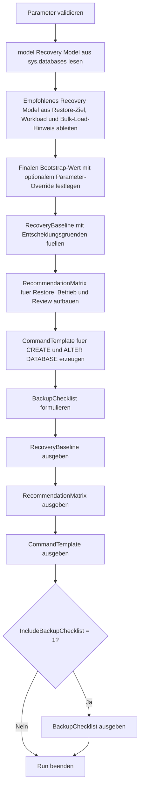

# RecoveryModelBootstrap.sql

Dieses Skript leitet fuer neue Datenbanken ein sinnvolles Recovery-Model-Default ab. Es kombiniert die `model`-Baseline mit Restore-Ziel, Workload-Profil und optionalen Bulk-Load-Hinweisen und erzeugt daraus eine kompakte Bootstrap-Matrix sowie konkrete Befehlsvorlagen.

## Uebersicht

<!-- SQLDOC:SUMMARY_TABLE:BEGIN -->
| Feld | Wert |
|---|---|
| Script | [RecoveryModelBootstrap.sql](RecoveryModelBootstrap.sql) |
| Version | `1.0` |
| Typ | `template` |
| Kapitel | `20_Create_Database` |
| Sicherheit | `read-only` |
| Zweck | Leitet eine nachvollziehbare Recovery-Model-Baseline fuer neue Datenbanken ab. |
<!-- SQLDOC:SUMMARY_TABLE:END -->

## Einordnung

Beim Datenbank-Bootstrap wird das Recovery Model oft zu spaet oder nur implizit ueber `model` betrachtet. Genau dort entstehen spaeter Missverstaendnisse zwischen Restore-Erwartung, Backup-Kette und Log-Wachstum. Das Skript macht diese Entscheidung explizit und trennt sauber zwischen technischer Baseline, didaktischer Empfehlung und finaler Bootstrap-Vorlage.

## Annahmen

- Es handelt sich um eine didaktische Erstversion fuer Bootstrap- und Review-Zwecke, nicht um ein ausfuehrendes Deployment-Skript.
- `model` wird als technischer Startpunkt gelesen, aber nicht automatisch als fachlich richtige Recovery-Entscheidung behandelt.
- `BULK_LOGGED` wird nur als bewusstes Zwischenmodell fuer Ladefenster betrachtet, nicht als pauschaler Default.
- Die erste sinnvolle Folgemassnahme nach `FULL` bleibt eine belastbare Full-Backup-Basis; das Skript erinnert daran, fuehrt sie aber nicht aus.

## Anwendungsfall

Das Skript eignet sich fuer Unterricht, Runbooks und Bootstrap-Checklisten im Kapitel `20_Create_Database`. Es hilft Teams dabei, zwischen `FULL`, `SIMPLE` und `BULK_LOGGED` nicht nur technisch, sondern entlang von Restore-Ziel, Betriebsprofil und Log-Pflege zu entscheiden.

## Parameter

<!-- SQLDOC:PARAMETERS_TABLE:BEGIN -->
| Parameter | SQL-Typ | Pflicht | Beschreibung |
|---|---|---|---|
| `@TargetDatabaseName` | `SYSNAME` | Nein | Name der Ziel-Datenbank fuer die generierten Bootstrap-Befehle. |
| `@PreferredRecoveryModel` | `NVARCHAR(20)` | Nein | Optionaler Zielwert fuer das Recovery Model; sonst wird die Empfehlung verwendet. |
| `@WorkloadProfile` | `NVARCHAR(20)` | Nein | Didaktisches Betriebsprofil: `OLTP`, `DW`, `STAGE` oder `DEV`. |
| `@NeedPointInTimeRestore` | `BIT` | Nein | Erzwingt bei `1` eine PITR-orientierte Empfehlung. |
| `@FrequentBulkLoad` | `BIT` | Nein | Beruecksichtigt bei `1` haeufige Bulk-Load- oder Ladefenster. |
| `@IncludeBackupChecklist` | `BIT` | Nein | Gibt bei `1` zusaetzlich eine Backup- und Log-Checkliste aus. |
<!-- SQLDOC:PARAMETERS_TABLE:END -->

## Abhaengigkeiten

<!-- SQLDOC:DEPENDENCIES_LIST:BEGIN -->
- `sys.databases`
- `tempdb` fuer temporaere Tabellen
- `CASE`
- `CONCAT`
- `QUOTENAME`
<!-- SQLDOC:DEPENDENCIES_LIST:END -->

## Hinweise

- `RecoveryBaseline` stellt `model`, Eingaben, Empfehlung und finalen Bootstrap-Wert direkt nebeneinander.
- `RecommendationMatrix` uebersetzt die Wahl des Recovery Models in Restore-, Betriebs- und Review-Hinweise.
- `CommandTemplate` erzeugt nur Vorlagen fuer `CREATE DATABASE` und `ALTER DATABASE`.
- `BackupChecklist` dient als Anschluss fuer spaetere Backup-, Log- und Change-Guardrails.

## Versionshistorie

<!-- SQLDOC:VERSION_HISTORY_TABLE:BEGIN -->
| Version | Datum | User | Beschreibung |
|---|---|---|---|
| `1.0` | `2026-04-22` | `ER` | Erstversion des Recovery-Model-Bootstrap-Skripts |
<!-- SQLDOC:VERSION_HISTORY_TABLE:END -->

## Ablauf

<!-- SQLDOC:MERMAID:BEGIN -->

<!-- SQLDOC:MERMAID:END -->

## SQL-Code

<!-- SQLDOC:SQL_CODE:BEGIN -->
```sql
/*
BEGIN:SQL-HEADER v1
---
sql_header: v1
script_name: "RecoveryModelBootstrap.sql"
script_version: "1.0"
script_type: "template"
chapter: "20_Create_Database"
purpose: >
  Leitet fuer neue Datenbanken eine sinnvolle Recovery-Model-Baseline
  aus model, Backup-Zielbild und Betriebsprofil ab und erzeugt dazu
  passende CREATE- sowie ALTER-DATABASE-Vorlagen fuer den Bootstrap.

parameters:
  - name: "@TargetDatabaseName"
    sql_type: "SYSNAME"
    direction: "IN"
    required: false
    description: "Name der Ziel-Datenbank fuer die generierten Bootstrap-Befehle"
  - name: "@PreferredRecoveryModel"
    sql_type: "NVARCHAR(20)"
    direction: "IN"
    required: false
    description: "Optionaler Zielwert fuer das Recovery Model; NULL nutzt die abgeleitete Empfehlung"
  - name: "@WorkloadProfile"
    sql_type: "NVARCHAR(20)"
    direction: "IN"
    required: false
    description: "Didaktisches Betriebsprofil: OLTP, DW, STAGE oder DEV"
  - name: "@NeedPointInTimeRestore"
    sql_type: "BIT"
    direction: "IN"
    required: false
    description: "1 = Point-in-Time-Restore ist fachlich erforderlich"
  - name: "@FrequentBulkLoad"
    sql_type: "BIT"
    direction: "IN"
    required: false
    description: "1 = haeufige Bulk-Loads oder indexlastige Ladefenster sollen beruecksichtigt werden"
  - name: "@IncludeBackupChecklist"
    sql_type: "BIT"
    direction: "IN"
    required: false
    description: "1 = zusaetzlich eine Backup- und Log-Guardrail-Checkliste ausgeben"

result_sets:
  - name: "RecoveryBaseline"
    description: "Vergleicht model, Eingaben und abgeleitete Recovery-Model-Empfehlung fuer den Bootstrap"
  - name: "RecommendationMatrix"
    description: "Ordnet Recovery-Model-Entscheidungen nach Betriebsprofil, Restore-Ziel und Log-Folgen ein"
  - name: "CommandTemplate"
    description: "Erzeugt CREATE- und ALTER-DATABASE-Vorlagen fuer die gewaehlte Baseline"
  - name: "BackupChecklist"
    description: "Optionale Guardrails fuer Backup-Kette, Log-Wachstum und spaetere Review-Punkte"

dependencies:
  - "sys.databases"
  - "tempdb temporary tables"
  - "CASE"
  - "CONCAT"
  - "QUOTENAME"

safety:
  level: "read-only"
  writes_data: false

documentation:
  markdown_file: "T-SQL/20_Create_Database/SQLScripts/RecoveryModelBootstrap.md"
  sync_blocks:
    - "SUMMARY_TABLE"
    - "PARAMETERS_TABLE"
    - "DEPENDENCIES_LIST"
    - "VERSION_HISTORY_TABLE"
    - "SQL_CODE"
  mermaid:
    mode: "ai-agent-from-sql"
    source: "script-body"

main_responsible:
  name: "Erhard Rainer"
  initials: "ER"

version_history:
  - version: "1.0"
    date: "2026-04-22"
    user: "ER"
    description: "Erstversion des Recovery-Model-Bootstrap-Skripts"

notes:
  - "Das Skript erzeugt nur Review-Ergebnisse und Befehlsvorlagen, fuehrt aber keine CREATE- oder ALTER-DATABASE-Befehle aus."
  - "Wenn kein expliziter Zielwert angegeben ist, wird das Recovery Model aus Restore-Ziel, Workload-Profil und model abgeleitet."
---
END:SQL-HEADER v1
*/

SET NOCOUNT ON;

-- 1. Parameter vorbereiten
DECLARE @TargetDatabaseName SYSNAME = N'TrainingRecoveryBootstrapDemo';
DECLARE @PreferredRecoveryModel NVARCHAR(20) = NULL;
DECLARE @WorkloadProfile NVARCHAR(20) = N'OLTP';
DECLARE @NeedPointInTimeRestore BIT = 1;
DECLARE @FrequentBulkLoad BIT = 0;
DECLARE @IncludeBackupChecklist BIT = 1;

IF @TargetDatabaseName IS NULL OR LTRIM(RTRIM(@TargetDatabaseName)) = N''
BEGIN
    THROW 50000, '@TargetDatabaseName darf nicht leer sein.', 1;
END;

IF @PreferredRecoveryModel IS NOT NULL
   AND UPPER(LTRIM(RTRIM(@PreferredRecoveryModel))) NOT IN (N'FULL', N'SIMPLE', N'BULK_LOGGED')
BEGIN
    THROW 50001, '@PreferredRecoveryModel muss FULL, SIMPLE oder BULK_LOGGED sein.', 1;
END;

IF UPPER(LTRIM(RTRIM(@WorkloadProfile))) NOT IN (N'OLTP', N'DW', N'STAGE', N'DEV')
BEGIN
    THROW 50002, '@WorkloadProfile muss OLTP, DW, STAGE oder DEV sein.', 1;
END;

IF @NeedPointInTimeRestore NOT IN (0, 1)
BEGIN
    THROW 50003, '@NeedPointInTimeRestore muss 0 oder 1 sein.', 1;
END;

IF @FrequentBulkLoad NOT IN (0, 1)
BEGIN
    THROW 50004, '@FrequentBulkLoad muss 0 oder 1 sein.', 1;
END;

IF @IncludeBackupChecklist NOT IN (0, 1)
BEGIN
    THROW 50005, '@IncludeBackupChecklist muss 0 oder 1 sein.', 1;
END;

DECLARE @NormalizedWorkloadProfile NVARCHAR(20) = UPPER(LTRIM(RTRIM(@WorkloadProfile)));
DECLARE @ModelRecoveryModel NVARCHAR(20);
DECLARE @RecommendedRecoveryModel NVARCHAR(20);
DECLARE @FinalRecoveryModel NVARCHAR(20);
DECLARE @DecisionReason NVARCHAR(220);

SELECT
    @ModelRecoveryModel = d.recovery_model_desc
FROM sys.databases AS d
WHERE d.name = N'model';

IF @ModelRecoveryModel IS NULL
BEGIN
    THROW 50006, 'Die model-Datenbank konnte nicht fuer die Recovery-Baseline gelesen werden.', 1;
END;

SET @RecommendedRecoveryModel =
    CASE
        WHEN @NeedPointInTimeRestore = 1 THEN N'FULL'
        WHEN @FrequentBulkLoad = 1 AND @NormalizedWorkloadProfile IN (N'DW', N'STAGE') THEN N'BULK_LOGGED'
        WHEN @NormalizedWorkloadProfile = N'DEV' THEN N'SIMPLE'
        WHEN @NormalizedWorkloadProfile = N'DW' THEN N'SIMPLE'
        ELSE @ModelRecoveryModel
    END;

SET @FinalRecoveryModel = COALESCE(UPPER(LTRIM(RTRIM(@PreferredRecoveryModel))), @RecommendedRecoveryModel);

SET @DecisionReason =
    CASE
        WHEN @PreferredRecoveryModel IS NOT NULL THEN N'Expliziter Parameter ueberschreibt die didaktische Empfehlung.'
        WHEN @NeedPointInTimeRestore = 1 THEN N'Point-in-Time-Restore verlangt eine planbare Log-Backup-Kette und daher FULL.'
        WHEN @FrequentBulkLoad = 1 AND @NormalizedWorkloadProfile IN (N'DW', N'STAGE') THEN N'Bulk-load-lastiges Profil kann BULK_LOGGED als Zwischenmodell begruenden, wenn Restore-Ziele dazu passen.'
        WHEN @NormalizedWorkloadProfile IN (N'DEV', N'DW') THEN N'Fuer Entwicklungs- oder analytische Baselines ohne PITR ist SIMPLE oft die konservativere Startempfehlung.'
        ELSE N'Ohne staerkere Gegenargumente bleibt die model-Baseline der vorsichtige Bootstrap-Startpunkt.'
    END;

DROP TABLE IF EXISTS #RecoveryBaseline;
DROP TABLE IF EXISTS #RecommendationMatrix;
DROP TABLE IF EXISTS #CommandTemplate;
DROP TABLE IF EXISTS #BackupChecklist;

-- 2. Recovery-Baseline aus model, Eingaben und Zielbild aufbauen
CREATE TABLE #RecoveryBaseline
(
    DecisionOrder INT NOT NULL,
    DecisionArea VARCHAR(60) NOT NULL,
    CurrentOrInputValue VARCHAR(40) NOT NULL,
    RecommendedValue VARCHAR(40) NOT NULL,
    FinalBootstrapValue VARCHAR(40) NOT NULL,
    ReviewFocus VARCHAR(220) NOT NULL,
    RecommendedAction VARCHAR(220) NOT NULL
);

INSERT INTO #RecoveryBaseline
(
    DecisionOrder,
    DecisionArea,
    CurrentOrInputValue,
    RecommendedValue,
    FinalBootstrapValue,
    ReviewFocus,
    RecommendedAction
)
VALUES
    (
        1,
        'model baseline',
        @ModelRecoveryModel,
        @RecommendedRecoveryModel,
        @FinalRecoveryModel,
        'Die model-Datenbank zeigt den technischen Startwert, aber nicht automatisch das gewuenschte Restore-Ziel der neuen Datenbank.',
        'model nur als Ausgangspunkt lesen und die Recovery-Entscheidung anschliessend fachlich absichern.'
    ),
    (
        2,
        'restore objective',
        CASE WHEN @NeedPointInTimeRestore = 1 THEN 'PITR required' ELSE 'No PITR requirement' END,
        CASE WHEN @NeedPointInTimeRestore = 1 THEN 'FULL' ELSE @RecommendedRecoveryModel END,
        @FinalRecoveryModel,
        'Recovery Model und Restore-Ziel muessen zusammenpassen; sonst entsteht eine truegerische Backup-Sicherheit.',
        'Vor Go-live die Restore-Zeitpunkte und die noetige Backup-Kette explizit dokumentieren.'
    ),
    (
        3,
        'workload profile',
        @NormalizedWorkloadProfile,
        @RecommendedRecoveryModel,
        @FinalRecoveryModel,
        'OLTP, DW, STAGE und DEV haben unterschiedliche Log- und Restore-Schwerpunkte fuer den Bootstrap.',
        'Das Betriebsprofil zusammen mit Ladefenstern und Wiederanlaufanforderungen gegenpruefen.'
    ),
    (
        4,
        'bulk-load hint',
        CASE WHEN @FrequentBulkLoad = 1 THEN 'Frequent bulk load' ELSE 'No frequent bulk load' END,
        @RecommendedRecoveryModel,
        @FinalRecoveryModel,
        'Bulk-load-Fenster koennen BULK_LOGGED begruenden, verlangen aber bewusste Restore- und Backup-Abwaegungen.',
        'Nur dann BULK_LOGGED einplanen, wenn das Team die Restore-Einschraenkungen der minimal protokollierten Phasen akzeptiert.'
    ),
    (
        5,
        'decision source',
        CASE WHEN @PreferredRecoveryModel IS NULL THEN 'Derived recommendation' ELSE 'Explicit override' END,
        @RecommendedRecoveryModel,
        @FinalRecoveryModel,
        @DecisionReason,
        'Abweichungen von der Empfehlung im Ticket, Runbook oder Bootstrap-Template nachvollziehbar festhalten.'
    );

-- 3. Empfehlungsmatrix fuer Recovery-Entscheidungen verdichten
CREATE TABLE #RecommendationMatrix
(
    RecommendationOrder INT NOT NULL,
    Category VARCHAR(40) NOT NULL,
    RecommendedModel VARCHAR(20) NOT NULL,
    PriorityLevel VARCHAR(10) NOT NULL,
    RecommendationText VARCHAR(260) NOT NULL,
    WhyItMatters VARCHAR(260) NOT NULL
);

INSERT INTO #RecommendationMatrix
(
    RecommendationOrder,
    Category,
    RecommendedModel,
    PriorityLevel,
    RecommendationText,
    WhyItMatters
)
VALUES
    (
        1,
        'Restore strategy',
        @FinalRecoveryModel,
        'high',
        CASE
            WHEN @FinalRecoveryModel = 'FULL' THEN 'FULL nur waehlen, wenn Full-, Differential- und Log-Backups organisatorisch mitgetragen werden.'
            WHEN @FinalRecoveryModel = 'BULK_LOGGED' THEN 'BULK_LOGGED nur fuer klar definierte Ladefenster und mit bekannter Restore-Wirkung einsetzen.'
            ELSE 'SIMPLE nur waehlen, wenn kein Point-in-Time-Restore benoetigt wird und vereinfachte Log-Pflege Vorrang hat.'
        END,
        'Das Recovery Model bestimmt nicht nur Log-Groesse, sondern vor allem das erreichbare Restore-Ziel.'
    ),
    (
        2,
        'Bootstrap timing',
        @FinalRecoveryModel,
        'high',
        'Recovery Model direkt nach CREATE DATABASE explizit setzen und nicht nur implizit von model erben.',
        'So bleibt der Startzustand reproduzierbar, auch wenn sich model spaeter aendert oder je Instanz abweicht.'
    ),
    (
        3,
        'Operations',
        @FinalRecoveryModel,
        'medium',
        CASE
            WHEN @FinalRecoveryModel = 'FULL' THEN 'Frueh eine erste Full-Backup-Basis anlegen, damit die Log-Backup-Kette sinnvoll startet.'
            WHEN @FinalRecoveryModel = 'BULK_LOGGED' THEN 'Ladefenster, Log-Backups und moegliche Restore-Einschraenkungen als Betriebsregel festhalten.'
            ELSE 'Log-Wachstum weiter beobachten, aber keine Full/Log-Backup-Kette als Standardannahme voraussetzen.'
        END,
        'Ohne passende Betriebsregel fuehrt selbst ein formal richtig gesetztes Recovery Model zu falschen Erwartungen.'
    ),
    (
        4,
        'Review',
        @FinalRecoveryModel,
        'medium',
        'Die Recovery-Entscheidung immer mit Backup-Frequenz, Wiederanlaufanforderung und Workload-Profil gemeinsam reviewen.',
        'Erst die Kombination dieser Faktoren macht den Default fachlich sinnvoll statt nur technisch moeglich.'
    );

-- 4. CREATE- und ALTER-DATABASE-Vorlagen erzeugen
CREATE TABLE #CommandTemplate
(
    CommandOrder INT NOT NULL,
    CommandName VARCHAR(80) NOT NULL,
    AppliesTo VARCHAR(80) NOT NULL,
    GeneratedCommand NVARCHAR(MAX) NOT NULL
);

INSERT INTO #CommandTemplate
(
    CommandOrder,
    CommandName,
    AppliesTo,
    GeneratedCommand
)
VALUES
    (
        1,
        'Create database skeleton',
        'Neue Datenbank',
        CONCAT(
            N'CREATE DATABASE ',
            QUOTENAME(@TargetDatabaseName),
            N';'
        )
    ),
    (
        2,
        'Recovery model bootstrap',
        'Direkt nach CREATE DATABASE',
        CONCAT(
            N'ALTER DATABASE ',
            QUOTENAME(@TargetDatabaseName),
            N' SET RECOVERY ',
            @FinalRecoveryModel,
            N';'
        )
    ),
    (
        3,
        'Initial full backup reminder',
        'Nach Recovery-Entscheidung',
        CASE
            WHEN @FinalRecoveryModel = N'FULL' THEN
                CONCAT(
                    N'-- Nach dem Bootstrap ein erstes FULL BACKUP fuer ',
                    QUOTENAME(@TargetDatabaseName),
                    N' einplanen, damit anschliessend Log-Backups sinnvoll starten koennen.'
                )
            WHEN @FinalRecoveryModel = N'BULK_LOGGED' THEN
                CONCAT(
                    N'-- Vor oder nach Bulk-Load-Fenstern Full- und Log-Backup-Strategie fuer ',
                    QUOTENAME(@TargetDatabaseName),
                    N' mit den Restore-Anforderungen abstimmen.'
                )
            ELSE
                CONCAT(
                    N'-- SIMPLE-Baseline fuer ',
                    QUOTENAME(@TargetDatabaseName),
                    N' regelmaessig gegen spaetere Restore-Anforderungen revalidieren.'
                )
        END
    );

-- 5. Optionale Backup- und Log-Checkliste fuer den Bootstrap formulieren
CREATE TABLE #BackupChecklist
(
    ChecklistOrder INT NOT NULL,
    FocusArea VARCHAR(60) NOT NULL,
    Guardrail VARCHAR(220) NOT NULL,
    WhyItHelps VARCHAR(220) NOT NULL
);

INSERT INTO #BackupChecklist
(
    ChecklistOrder,
    FocusArea,
    Guardrail,
    WhyItHelps
)
VALUES
    (
        1,
        'Restore target',
        'Vor dem ersten Produktiveinsatz dokumentieren, ob Point-in-Time-Restore wirklich erforderlich ist.',
        'So wird FULL nicht reflexhaft gesetzt und SIMPLE nicht versehentlich unterdimensioniert gewaehlt.'
    ),
    (
        2,
        'Backup chain',
        'Bei FULL oder BULK_LOGGED frueh festlegen, wann die erste Full-Sicherung und die nachfolgenden Log-Backups starten.',
        'Ohne belastbare Backup-Kette bleibt die Recovery-Entscheidung nur nominell richtig.'
    ),
    (
        3,
        'Log growth',
        'Log-Datei-Groesse, VLF-Strategie und Ladefenster gemeinsam mit dem Recovery Model reviewen.',
        'Recovery-Vorgaben wirken direkt auf Log-Wachstum, Wartungsfenster und Wiederanlaufzeiten.'
    ),
    (
        4,
        'Change control',
        'Spaetere Wechsel zwischen SIMPLE, FULL und BULK_LOGGED nur mit begruendetem Change und aktualisierter Backup-Regel durchfuehren.',
        'Das verhindert, dass Restore-Ziele stillschweigend von der technischen Realitaet abweichen.'
    );

-- 6. Ergebnisse ausgeben
SELECT
    rb.DecisionOrder,
    rb.DecisionArea,
    rb.CurrentOrInputValue,
    rb.RecommendedValue,
    rb.FinalBootstrapValue,
    rb.ReviewFocus,
    rb.RecommendedAction
FROM #RecoveryBaseline AS rb
ORDER BY
    rb.DecisionOrder;

SELECT
    rm.RecommendationOrder,
    rm.Category,
    rm.RecommendedModel,
    rm.PriorityLevel,
    rm.RecommendationText,
    rm.WhyItMatters
FROM #RecommendationMatrix AS rm
ORDER BY
    rm.RecommendationOrder;

SELECT
    ct.CommandOrder,
    ct.CommandName,
    ct.AppliesTo,
    ct.GeneratedCommand
FROM #CommandTemplate AS ct
ORDER BY
    ct.CommandOrder;

IF @IncludeBackupChecklist = 1
BEGIN
    SELECT
        bc.ChecklistOrder,
        bc.FocusArea,
        bc.Guardrail,
        bc.WhyItHelps
    FROM #BackupChecklist AS bc
    ORDER BY
        bc.ChecklistOrder;
END;
```
<!-- SQLDOC:SQL_CODE:END -->
