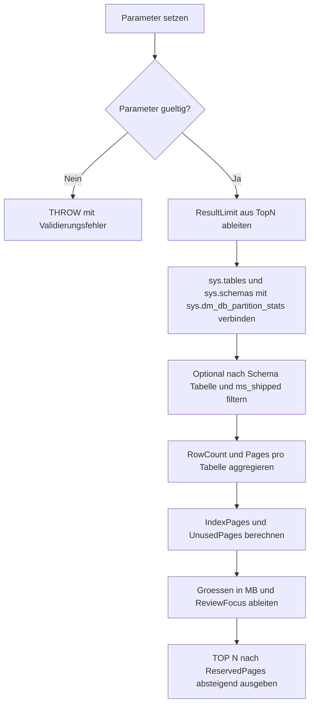

# TableSizeInventory.sql

Dieses Skript ermittelt die Groesse aller Tabellen in der aktuell verwendeten Datenbank. Es nutzt `sys.dm_db_partition_stats`, damit Rowcount, reservierte Seiten, genutzte Seiten, Datenseiten, Indexseiten und ungenutzte Seiten in einer kompakten Diagnoseausgabe sichtbar werden.

## Uebersicht

<!-- SQLDOC:SUMMARY_TABLE:BEGIN -->
| Feld | Wert |
|---|---|
| Script | [TableSizeInventory.sql](TableSizeInventory.sql) |
| Version | `1.0` |
| Typ | `diagnostic-query` |
| Kapitel | `20_Create_Database` |
| Sicherheit | `read-only` |
| Zweck | Ermittelt die Groesse aller Tabellen in der aktuellen Datenbank ueber sys.tables, sys.schemas und sys.dm_db_partition_stats und trennt reservierte, genutzte, Daten-, Index- und ungenutzte Seiten. |
<!-- SQLDOC:SUMMARY_TABLE:END -->

## Einordnung

Die Abfrage wird in der Datenbank ausgefuehrt, deren Tabellen analysiert werden sollen. Das passt zur SQL-Server-Sicht auf Tabellenmetadaten, weil `sys.tables` und `sys.dm_db_partition_stats` datenbanklokale Kataloge sind. Fuer serverweite Tabelleninventare muesste diese Abfrage gezielt pro Datenbank ausgefuehrt oder dynamisch orchestriert werden.

## Annahmen

- Die Abfrage bleibt rein lesend und erzeugt keine temporaeren oder persistenten Objekte.
- `RowCount` wird nur ueber Heap oder Clustered Index summiert, damit Nonclustered Indexes die Zeilenanzahl nicht mehrfach zaehlen.
- `IndexMB` ist aus `UsedPages - DataPages` abgeleitet und dient als pragmatische Review-Groesse.
- Memory-optimized Tabellen werden markiert; deren Speicherbedarf sollte bei Bedarf mit speziellen In-Memory-DMVs vertieft werden.

## Parameter

<!-- SQLDOC:PARAMETERS_TABLE:BEGIN -->
| Parameter | SQL-Typ | Pflicht | Beschreibung |
|---|---|---|---|
| `@SchemaName` | `SYSNAME` | Nein | Optionaler Schemaname; NULL zeigt alle Schemata. |
| `@TableName` | `SYSNAME` | Nein | Optionaler Tabellenname; NULL zeigt alle Tabellen. |
| `@MinimumReservedMB` | `DECIMAL(18,2)` | Nein | Mindestgroesse in MB fuer die Ausgabe, bezogen auf reservierte Seiten. |
| `@TopN` | `INT` | Nein | 0 = alle Treffer; sonst maximale Anzahl der groessten Tabellen. |
| `@IncludeMsShipped` | `BIT` | Nein | 1 = auch als systemnah markierte Tabellen einbeziehen. |
<!-- SQLDOC:PARAMETERS_TABLE:END -->

## Abhaengigkeiten

<!-- SQLDOC:DEPENDENCIES_LIST:BEGIN -->
- `sys.tables`
- `sys.schemas`
- `sys.dm_db_partition_stats`
- `CASE`
- `NULLIF`
- window functions
<!-- SQLDOC:DEPENDENCIES_LIST:END -->

## Hinweise

- `ReservedMB` ist die wichtigste Sortiergroesse fuer Speicherverbrauch.
- `UnusedPct` hilft, stark reservierte, aber wenig genutzte Tabellen zu finden.
- `@TopN = 0` gibt alle passenden Tabellen aus.
- Fuer eine einzelne Tabelle koennen `@SchemaName` und `@TableName` gemeinsam gesetzt werden.

## Versionshistorie

<!-- SQLDOC:VERSION_HISTORY_TABLE:BEGIN -->
| Version | Datum | User | Beschreibung |
|---|---|---|---|
| `1.0` | `2026-05-11` | `ER` | Erstversion der Tabellen-Groessenuebersicht fuer die aktuelle Datenbank |
<!-- SQLDOC:VERSION_HISTORY_TABLE:END -->

## Ablauf

<!-- SQLDOC:MERMAID:BEGIN -->

<!-- SQLDOC:MERMAID:END -->

## SQL-Code

<!-- SQLDOC:SQL_CODE:BEGIN -->
```sql
/*
BEGIN:SQL-HEADER v1
---
sql_header: v1
script_name: "TableSizeInventory.sql"
script_version: "1.0"
script_type: "diagnostic-query"
chapter: "20_Create_Database"
purpose: >
  Ermittelt die Groesse aller Tabellen in der aktuellen Datenbank ueber
  sys.tables, sys.schemas und sys.dm_db_partition_stats und trennt
  reservierte, genutzte, Daten-, Index- und ungenutzte Seiten.

parameters:
  - name: "@SchemaName"
    sql_type: "SYSNAME"
    direction: "IN"
    required: false
    description: "Optionaler Schemaname; NULL zeigt alle Schemata"
  - name: "@TableName"
    sql_type: "SYSNAME"
    direction: "IN"
    required: false
    description: "Optionaler Tabellenname; NULL zeigt alle Tabellen"
  - name: "@MinimumReservedMB"
    sql_type: "DECIMAL(18,2)"
    direction: "IN"
    required: false
    description: "Mindestgroesse in MB fuer die Ausgabe, bezogen auf reservierte Seiten"
  - name: "@TopN"
    sql_type: "INT"
    direction: "IN"
    required: false
    description: "0 = alle Treffer; sonst maximale Anzahl der groessten Tabellen"
  - name: "@IncludeMsShipped"
    sql_type: "BIT"
    direction: "IN"
    required: false
    description: "1 = auch als systemnah markierte Tabellen einbeziehen"

result_sets:
  - name: "TableSizeInventory"
    description: "Eine Zeile pro Tabelle mit Rowcount, ReservedMB, UsedMB, DataMB, IndexMB und UnusedMB"

dependencies:
  - "sys.tables"
  - "sys.schemas"
  - "sys.dm_db_partition_stats"
  - "CASE"
  - "NULLIF"
  - "window functions"

safety:
  level: "read-only"
  writes_data: false

documentation:
  markdown_file: "T-SQL/20_Create_Database/SQLScripts/TableSizeInventory.md"
  sync_blocks:
    - "SUMMARY_TABLE"
    - "PARAMETERS_TABLE"
    - "DEPENDENCIES_LIST"
    - "VERSION_HISTORY_TABLE"
    - "SQL_CODE"
  mermaid:
    mode: "ai-agent-from-sql"
    source: "script-body"

main_responsible:
  name: "Erhard Rainer"
  initials: "ER"

version_history:
  - version: "1.0"
    date: "2026-05-11"
    user: "ER"
    description: "Erstversion der Tabellen-Groessenuebersicht fuer die aktuelle Datenbank"

notes:
  - "Das Skript wird in der zu analysierenden Datenbank ausgefuehrt."
  - "RowCount wird nur ueber Heap oder Clustered Index summiert, damit Nonclustered Indexes die Zeilenzahl nicht vervielfachen."
---
END:SQL-HEADER v1
*/

SET NOCOUNT ON;

-- 1. Parameter vorbereiten
DECLARE @SchemaName SYSNAME = NULL;
DECLARE @TableName SYSNAME = NULL;
DECLARE @MinimumReservedMB DECIMAL(18, 2) = 0.00;
DECLARE @TopN INT = 0;
DECLARE @IncludeMsShipped BIT = 0;

IF @MinimumReservedMB < 0
BEGIN
    THROW 50000, '@MinimumReservedMB darf nicht negativ sein.', 1;
END;

IF @TopN < 0
BEGIN
    THROW 50001, '@TopN darf nicht negativ sein.', 1;
END;

IF @IncludeMsShipped NOT IN (0, 1)
BEGIN
    THROW 50002, '@IncludeMsShipped muss 0 oder 1 sein.', 1;
END;

DECLARE @ResultLimit INT =
    CASE
        WHEN @TopN = 0 THEN 2147483647
        ELSE @TopN
    END;

-- 2. Tabellen- und Partitionsseiten der aktuellen Datenbank verdichten
;WITH TablePartitionStats AS
(
    SELECT
        s.name AS SchemaName,
        t.name AS TableName,
        t.object_id AS ObjectId,
        t.temporal_type_desc AS TemporalTypeDesc,
        t.is_memory_optimized AS IsMemoryOptimized,
        t.is_ms_shipped AS IsMsShipped,
        COALESCE(ps.index_id, -1) AS IndexId,
        ps.partition_number AS PartitionNumber,
        COALESCE(ps.row_count, 0) AS RowCount,
        COALESCE(ps.reserved_page_count, 0) AS ReservedPageCount,
        COALESCE(ps.used_page_count, 0) AS UsedPageCount,
        COALESCE(ps.in_row_data_page_count, 0) AS InRowDataPageCount,
        COALESCE(ps.lob_used_page_count, 0) AS LobUsedPageCount,
        COALESCE(ps.row_overflow_used_page_count, 0) AS RowOverflowUsedPageCount
    FROM sys.tables AS t
    INNER JOIN sys.schemas AS s
        ON s.schema_id = t.schema_id
    LEFT JOIN sys.dm_db_partition_stats AS ps
        ON ps.object_id = t.object_id
    WHERE (@SchemaName IS NULL OR s.name = @SchemaName)
      AND (@TableName IS NULL OR t.name = @TableName)
      AND (@IncludeMsShipped = 1 OR t.is_ms_shipped = 0)
),
TableSize AS
(
    SELECT
        DB_NAME() AS DatabaseName,
        tps.SchemaName,
        tps.TableName,
        tps.ObjectId,
        tps.TemporalTypeDesc,
        tps.IsMemoryOptimized,
        SUM(CASE WHEN tps.IndexId IN (0, 1) THEN tps.RowCount ELSE 0 END) AS RowCount,
        COUNT(DISTINCT CASE WHEN tps.IndexId IN (0, 1) THEN tps.PartitionNumber END) AS TablePartitionCount,
        SUM(tps.ReservedPageCount) AS ReservedPages,
        SUM(tps.UsedPageCount) AS UsedPages,
        SUM
        (
            CASE
                WHEN tps.IndexId IN (0, 1)
                    THEN tps.InRowDataPageCount + tps.LobUsedPageCount + tps.RowOverflowUsedPageCount
                ELSE 0
            END
        ) AS DataPages
    FROM TablePartitionStats AS tps
    GROUP BY
        tps.SchemaName,
        tps.TableName,
        tps.ObjectId,
        tps.TemporalTypeDesc,
        tps.IsMemoryOptimized
),
ClassifiedTableSize AS
(
    SELECT
        ROW_NUMBER() OVER
        (
            ORDER BY
                ts.ReservedPages DESC,
                ts.SchemaName,
                ts.TableName
        ) AS SizeRank,
        ts.DatabaseName,
        ts.SchemaName,
        ts.TableName,
        ts.ObjectId,
        ts.TemporalTypeDesc,
        ts.IsMemoryOptimized,
        ts.RowCount,
        ts.TablePartitionCount,
        ts.ReservedPages,
        ts.UsedPages,
        ts.DataPages,
        CASE
            WHEN ts.UsedPages > ts.DataPages THEN ts.UsedPages - ts.DataPages
            ELSE 0
        END AS IndexPages,
        CASE
            WHEN ts.ReservedPages > ts.UsedPages THEN ts.ReservedPages - ts.UsedPages
            ELSE 0
        END AS UnusedPages
    FROM TableSize AS ts
)
-- 3. Groesste Tabellen nach reserviertem Speicher ausgeben
SELECT TOP (@ResultLimit)
    cts.SizeRank,
    cts.DatabaseName,
    cts.SchemaName,
    cts.TableName,
    cts.ObjectId,
    cts.TemporalTypeDesc,
    CASE
        WHEN cts.IsMemoryOptimized = 1 THEN 'memory-optimized'
        ELSE 'disk-based'
    END AS StorageType,
    cts.RowCount,
    cts.TablePartitionCount,
    CAST(cts.ReservedPages * 8.0 / 1024.0 AS DECIMAL(18, 2)) AS ReservedMB,
    CAST(cts.UsedPages * 8.0 / 1024.0 AS DECIMAL(18, 2)) AS UsedMB,
    CAST(cts.DataPages * 8.0 / 1024.0 AS DECIMAL(18, 2)) AS DataMB,
    CAST(cts.IndexPages * 8.0 / 1024.0 AS DECIMAL(18, 2)) AS IndexMB,
    CAST(cts.UnusedPages * 8.0 / 1024.0 AS DECIMAL(18, 2)) AS UnusedMB,
    CAST((cts.UnusedPages * 100.0) / NULLIF(cts.ReservedPages, 0) AS DECIMAL(9, 2)) AS UnusedPct,
    CASE
        WHEN cts.ReservedPages * 8.0 / 1024.0 >= 1024 THEN 'large'
        WHEN cts.ReservedPages * 8.0 / 1024.0 >= 128 THEN 'medium'
        WHEN cts.ReservedPages > 0 THEN 'small'
        ELSE 'empty'
    END AS SizeBand,
    CASE
        WHEN cts.IsMemoryOptimized = 1 THEN 'Memory-optimized Tabellen werden markiert; Speicherbedarf sollte zusaetzlich mit In-Memory-DMVs geprueft werden.'
        WHEN cts.ReservedPages = 0 THEN 'Keine reservierten Seiten sichtbar.'
        WHEN (cts.UnusedPages * 100.0) / NULLIF(cts.ReservedPages, 0) >= 30 THEN 'Hoher Anteil ungenutzter reservierter Seiten; Wartung, Ladefenster oder Wachstumsverlauf pruefen.'
        WHEN cts.IndexPages > cts.DataPages THEN 'Indexseiten sind groesser als Datenseiten; Indexdesign und breite Includes koennen ein Review lohnen.'
        ELSE 'Tabellengroesse ist fuer diese Uebersicht unauffaellig.'
    END AS ReviewFocus
FROM ClassifiedTableSize AS cts
WHERE cts.ReservedPages * 8.0 / 1024.0 >= @MinimumReservedMB
ORDER BY
    cts.ReservedPages DESC,
    cts.SchemaName,
    cts.TableName;
```
<!-- SQLDOC:SQL_CODE:END -->
