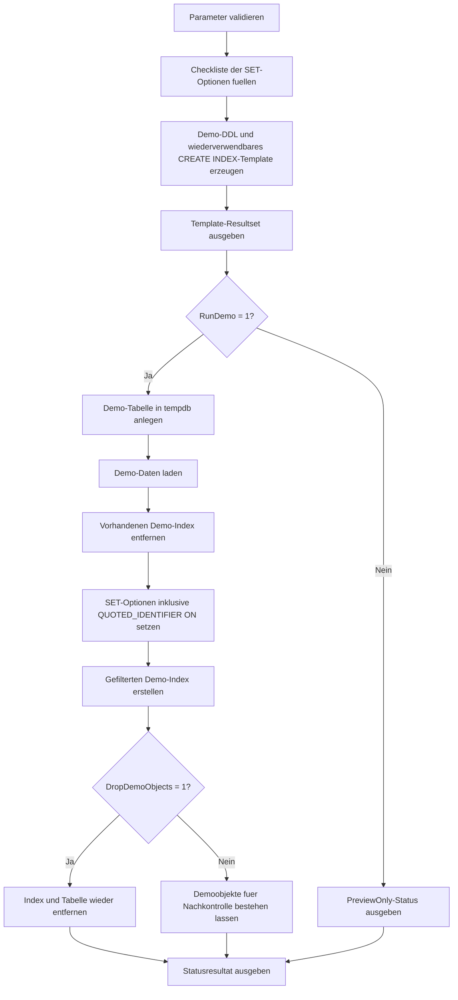

# FilteredIndexBuildSessionTemplate.sql

Dieses Skript liefert eine didaktische Vorlage fuer Session-Optionen rund um `CREATE INDEX` mit Filterpraedikat. Statt produktive Tabellen vorauszusetzen, erzeugt es eine uebertragbare Statement-Vorlage und kann denselben Ablauf optional gegen Demoobjekte in `tempdb` ausfuehren.

## Uebersicht

<!-- SQLDOC:SUMMARY_TABLE:BEGIN -->
| Feld | Wert |
|---|---|
| Script | [FilteredIndexBuildSessionTemplate.sql](FilteredIndexBuildSessionTemplate.sql) |
| Version | `1.0` |
| Typ | `template` |
| Kapitel | `21_QUOTED_IDENTIFIER` |
| Sicherheit | `demo-write-tempdb` |
| Zweck | Vorlage fuer Session-Optionen beim Erstellen gefilterter Indizes. |
<!-- SQLDOC:SUMMARY_TABLE:END -->

## Einordnung

Der Fokus liegt nicht auf einem bestimmten Business-Index, sondern auf der Session-Konfiguration vor `CREATE INDEX`. Das Skript trennt deshalb drei Ebenen: eine Checkliste der relevanten SET-Optionen, eine wiederverwendbare Vorlage fuer produktive Skripte und eine optionale `tempdb`-Demo, die den Ablauf inklusive Cleanup demonstriert.

## Annahmen

- Es handelt sich um eine didaktische Erstversion ohne vorgegebene Zieltabelle.
- Die Session-Optionen werden als konservatives Template fuer gefilterte Indizes gesammelt und nicht nur auf `QUOTED_IDENTIFIER` reduziert.
- Die Demo verwendet `tempdb.dbo.FilteredIndexBuildSessionTemplateDemo`, damit keine fachlichen Tabellen oder Indizes benoetigt werden.
- Das Produktiv-Statement im Resultset `GeneratedTemplate` ist als Startvorlage gedacht und muss auf reale Spalten, Include-Spalten und Filterbedingungen angepasst werden.

## Anwendungsfall

Das Skript eignet sich fuer Unterricht, Reviews und Build-Pipeline-Vorlagen, wenn gezeigt werden soll, welche Session-SET-Optionen vor einem gefilterten Index stabil gesetzt werden sollten. Besonders nuetzlich ist es, wenn Teams bestehende DDL-Skripte vereinheitlichen oder den Zusammenhang zwischen `QUOTED_IDENTIFIER ON` und indexbezogenen Features transparent dokumentieren wollen.

## Parameter

<!-- SQLDOC:PARAMETERS_TABLE:BEGIN -->
| Parameter | SQL-Typ | Pflicht | Beschreibung |
|---|---|---|---|
| `@RunDemo` | `BIT` | Nein | Erstellt bei `1` die Demo-Tabelle in `tempdb` und fuehrt `CREATE INDEX` wirklich aus. |
| `@DropDemoObjects` | `BIT` | Nein | Entfernt bei `1` die Demoobjekte nach der optionalen Ausfuehrung wieder. |
<!-- SQLDOC:PARAMETERS_TABLE:END -->

## Abhaengigkeiten

<!-- SQLDOC:DEPENDENCIES_LIST:BEGIN -->
- `tempdb`-Demoobjekte
- `sys.indexes`
- dynamisches SQL ueber `sys.sp_executesql`
- `SET QUOTED_IDENTIFIER`
- Filtered-Index-DDL
<!-- SQLDOC:DEPENDENCIES_LIST:END -->

## Hinweise

- Das erste Resultset liefert eine kompakte Checkliste der relevanten Session-Optionen und begruendet jede Option kurz.
- Das zweite Resultset zerlegt die Vorlage in Demo-Setup, optionales Drop-Pattern, CREATE-Statement, wiederverwendbares Template und Cleanup.
- Die Demo fuehrt nur DDL in `tempdb` aus und kann ueber `@RunDemo = 0` rein als Dokumentations- und Reviewskript genutzt werden.

## Versionshistorie

<!-- SQLDOC:VERSION_HISTORY_TABLE:BEGIN -->
| Version | Datum | User | Beschreibung |
|---|---|---|---|
| `1.0` | `2026-04-22` | `ER` | Erstversion der didaktischen Vorlage fuer Session-Optionen bei gefilterten Indizes |
<!-- SQLDOC:VERSION_HISTORY_TABLE:END -->

## Ablauf

<!-- SQLDOC:MERMAID:BEGIN -->

<!-- SQLDOC:MERMAID:END -->

## SQL-Code

<!-- SQLDOC:SQL_CODE:BEGIN -->
```sql
/*
BEGIN:SQL-HEADER v1
---
sql_header: v1
script_name: "FilteredIndexBuildSessionTemplate.sql"
script_version: "1.0"
script_type: "template"
chapter: "21_QUOTED_IDENTIFIER"

purpose: >
  Stellt eine didaktische Vorlage fuer Session-Optionen beim Erstellen
  gefilterter Indizes bereit. Das Skript zeigt die benoetigten SET-Optionen,
  erzeugt ein wiederverwendbares CREATE INDEX-Statement und kann optional eine
  tempdb-Demo fuer den kompletten Ablauf ausfuehren.

parameters:
  - name: "@RunDemo"
    sql_type: "BIT"
    direction: "IN"
    required: false
    description: "1 = Demo-Tabelle in tempdb anlegen und den gefilterten Index wirklich erstellen"
  - name: "@DropDemoObjects"
    sql_type: "BIT"
    direction: "IN"
    required: false
    description: "1 = Demoobjekte nach der optionalen Ausfuehrung wieder entfernen"

result_sets:
  - name: "SessionOptionChecklist"
    description: "Checkliste der fuer gefilterte Indizes relevanten Session-Optionen"
  - name: "GeneratedTemplate"
    description: "Kompakte Vorlage mit Demo-Setup und CREATE INDEX-Statement"
  - name: "DemoExecutionStatus"
    description: "Status und Metadaten der optionalen tempdb-Demo"

dependencies:
  - "tempdb demo objects"
  - "sys.indexes"
  - "dynamic SQL via sys.sp_executesql"
  - "SET QUOTED_IDENTIFIER"
  - "filtered index DDL"

safety:
  level: "demo-write-tempdb"
  writes_data: false

documentation:
  markdown_file: "T-SQL/21_QUOTED_IDENTIFIER/SQLScripts/FilteredIndexBuildSessionTemplate.md"
  sync_blocks:
    - "SUMMARY_TABLE"
    - "PARAMETERS_TABLE"
    - "DEPENDENCIES_LIST"
    - "VERSION_HISTORY_TABLE"
    - "SQL_CODE"
  mermaid:
    mode: "ai-agent-from-sql"
    source: "script-body"

main_responsible:
  name: "Erhard Rainer"
  initials: "ER"

version_history:
  - version: "1.0"
    date: "2026-04-22"
    user: "ER"
    description: "Erstversion der didaktischen Vorlage fuer Session-Optionen bei gefilterten Indizes"

notes:
  - "Die produktive Tabellen- und Indexdefinition fehlt bewusst; stattdessen erzeugt das Skript ein uebertragbares Template."
  - "Die Demo verwendet tempdb.dbo-Objekte, damit keine fachlichen Tabellen vorausgesetzt werden."
---
END:SQL-HEADER v1
*/

SET NOCOUNT ON;

DECLARE @RunDemo BIT = 0;
DECLARE @DropDemoObjects BIT = 1;

IF @RunDemo NOT IN (0, 1)
BEGIN
    THROW 50000, '@RunDemo muss 0 oder 1 sein.', 1;
END;

IF @DropDemoObjects NOT IN (0, 1)
BEGIN
    THROW 50001, '@DropDemoObjects muss 0 oder 1 sein.', 1;
END;

DECLARE @DemoTableName SYSNAME = N'tempdb.dbo.FilteredIndexBuildSessionTemplateDemo';
DECLARE @DemoIndexName SYSNAME = N'IX_FilteredIndexBuildSessionTemplateDemo_ActiveRows';
DECLARE @CreateTableSql NVARCHAR(MAX);
DECLARE @SeedDataSql NVARCHAR(MAX);
DECLARE @DropIndexSql NVARCHAR(MAX);
DECLARE @CreateIndexSql NVARCHAR(MAX);
DECLARE @DropTableSql NVARCHAR(MAX);
DECLARE @TemplateScript NVARCHAR(MAX);

DROP TABLE IF EXISTS #SessionOptionChecklist;
DROP TABLE IF EXISTS #GeneratedTemplate;
DROP TABLE IF EXISTS #DemoExecutionStatus;

CREATE TABLE #SessionOptionChecklist
(
    StepNumber          INT            NOT NULL,
    OptionName          VARCHAR(40)    NOT NULL,
    RecommendedValue    VARCHAR(10)    NOT NULL,
    WhyItMatters        VARCHAR(260)   NOT NULL,
    IncludedInTemplate  BIT            NOT NULL
);

INSERT INTO #SessionOptionChecklist
(
    StepNumber,
    OptionName,
    RecommendedValue,
    WhyItMatters,
    IncludedInTemplate
)
VALUES
    (1, 'ANSI_NULLS', 'ON', 'Gefilterte Indizes erwarten dieselben SET-Grundlagen wie andere schemagebundene oder optimierungsrelevante Indexfeatures.', 1),
    (2, 'ANSI_PADDING', 'ON', 'Sichert konsistentes Verhalten fuer variable Zeichen- und Binaerspalten waehrend der Objekterstellung.', 1),
    (3, 'ANSI_WARNINGS', 'ON', 'Vermeidet nicht kompatible Session-Konfigurationen bei Index-DDL.', 1),
    (4, 'ARITHABORT', 'ON', 'Wird fuer mehrere Index- und View-Szenarien als kompatible Ausfuehrungsoption erwartet.', 1),
    (5, 'CONCAT_NULL_YIELDS_NULL', 'ON', 'Haelt das Ausdrucksverhalten fuer kompatible Metadaten- und Indexszenarien konsistent.', 1),
    (6, 'QUOTED_IDENTIFIER', 'ON', 'Ist fuer CREATE INDEX auf gefilterten Indizes relevant und Kern des Kapitels.', 1),
    (7, 'NUMERIC_ROUNDABORT', 'OFF', 'Soll fuer diese DDL-Szenarien deaktiviert bleiben, damit die Session kompatibel ist.', 1);

SELECT
    soc.StepNumber,
    soc.OptionName,
    soc.RecommendedValue,
    soc.WhyItMatters,
    soc.IncludedInTemplate
FROM #SessionOptionChecklist AS soc
ORDER BY
    soc.StepNumber;

SET @CreateTableSql = N'
IF OBJECT_ID(N''' + @DemoTableName + N''', N''U'') IS NULL
BEGIN
    CREATE TABLE ' + @DemoTableName + N'
    (
        WorkItemID      INT            NOT NULL,
        CategoryCode    VARCHAR(20)    NOT NULL,
        IsActive        BIT            NOT NULL,
        PriorityLevel   TINYINT        NOT NULL,
        ArchivedAt      DATETIME2(0)   NULL,
        Title           VARCHAR(100)   NOT NULL,
        CONSTRAINT PK_FilteredIndexBuildSessionTemplateDemo PRIMARY KEY CLUSTERED (WorkItemID)
    );
END;';

SET @SeedDataSql = N'
TRUNCATE TABLE ' + @DemoTableName + N';

INSERT INTO ' + @DemoTableName + N'
(
    WorkItemID,
    CategoryCode,
    IsActive,
    PriorityLevel,
    ArchivedAt,
    Title
)
VALUES
    (1, ''OPS'', 1, 1, NULL, ''Open operational item''),
    (2, ''OPS'', 1, 2, NULL, ''Active retry queue''),
    (3, ''QA'', 0, 3, ''2026-04-01T08:00:00'', ''Archived verification item''),
    (4, ''QA'', 1, 1, NULL, ''Ready for review''),
    (5, ''BI'', 0, 2, ''2026-04-03T12:00:00'', ''Closed analytics task'');';

SET @DropIndexSql = N'
IF EXISTS
(
    SELECT
        1
    FROM tempdb.sys.indexes AS i
    WHERE i.object_id = OBJECT_ID(N''' + @DemoTableName + N''')
      AND i.name = N''' + @DemoIndexName + N'''
)
BEGIN
    DROP INDEX ' + QUOTENAME(@DemoIndexName) + N' ON ' + @DemoTableName + N';
END;';

SET @CreateIndexSql = N'
SET ANSI_NULLS ON;
SET ANSI_PADDING ON;
SET ANSI_WARNINGS ON;
SET ARITHABORT ON;
SET CONCAT_NULL_YIELDS_NULL ON;
SET QUOTED_IDENTIFIER ON;
SET NUMERIC_ROUNDABORT OFF;

CREATE INDEX ' + QUOTENAME(@DemoIndexName) + N'
ON ' + @DemoTableName + N' (CategoryCode, WorkItemID)
INCLUDE (PriorityLevel, Title)
WHERE IsActive = 1
  AND ArchivedAt IS NULL;';

SET @DropTableSql = N'
IF OBJECT_ID(N''' + @DemoTableName + N''', N''U'') IS NOT NULL
BEGIN
    DROP TABLE ' + @DemoTableName + N';
END;';

SET @TemplateScript = N'-- Session template for filtered index creation
SET ANSI_NULLS ON;
SET ANSI_PADDING ON;
SET ANSI_WARNINGS ON;
SET ARITHABORT ON;
SET CONCAT_NULL_YIELDS_NULL ON;
SET QUOTED_IDENTIFIER ON;
SET NUMERIC_ROUNDABORT OFF;

-- Replace demo names, key columns, include columns, and filter predicate.
CREATE INDEX [IX_YourFilteredIndex]
ON [dbo].[YourTable] ([FilterKey], [ClusterFriendlyColumn])
INCLUDE ([ReportingColumn])
WHERE [IsActive] = 1
  AND [ArchivedAt] IS NULL;';

CREATE TABLE #GeneratedTemplate
(
    SectionName       VARCHAR(40)     NOT NULL,
    TemplateSql       NVARCHAR(MAX)   NOT NULL
);

INSERT INTO #GeneratedTemplate
(
    SectionName,
    TemplateSql
)
VALUES
    ('DemoSetup', @CreateTableSql + CHAR(13) + CHAR(10) + @SeedDataSql),
    ('DropExistingIndex', @DropIndexSql),
    ('CreateFilteredIndex', @CreateIndexSql),
    ('ReusableTemplate', @TemplateScript),
    ('Cleanup', @DropTableSql);

SELECT
    gt.SectionName,
    gt.TemplateSql
FROM #GeneratedTemplate AS gt
ORDER BY
    CASE gt.SectionName
        WHEN 'DemoSetup' THEN 1
        WHEN 'DropExistingIndex' THEN 2
        WHEN 'CreateFilteredIndex' THEN 3
        WHEN 'ReusableTemplate' THEN 4
        ELSE 5
    END;

CREATE TABLE #DemoExecutionStatus
(
    StatusStep         VARCHAR(40)    NOT NULL,
    StatusText         VARCHAR(260)   NOT NULL,
    IndexName          SYSNAME        NULL,
    FilterDefinition   NVARCHAR(MAX)  NULL
);

IF @RunDemo = 1
BEGIN
    EXEC sys.sp_executesql @CreateTableSql;
    EXEC sys.sp_executesql @SeedDataSql;
    EXEC sys.sp_executesql @DropIndexSql;
    EXEC sys.sp_executesql @CreateIndexSql;

    INSERT INTO #DemoExecutionStatus
    (
        StatusStep,
        StatusText,
        IndexName,
        FilterDefinition
    )
    SELECT
        'CreateFilteredIndex',
        'Gefilterter Demo-Index wurde mit QUOTED_IDENTIFIER ON erstellt.',
        i.name,
        i.filter_definition
    FROM tempdb.sys.indexes AS i
    WHERE i.object_id = OBJECT_ID(@DemoTableName)
      AND i.name = @DemoIndexName;

    IF @DropDemoObjects = 1
    BEGIN
        EXEC sys.sp_executesql @DropIndexSql;
        EXEC sys.sp_executesql @DropTableSql;

        INSERT INTO #DemoExecutionStatus
        (
            StatusStep,
            StatusText,
            IndexName,
            FilterDefinition
        )
        VALUES
        (
            'Cleanup',
            'Demoobjekte in tempdb wurden wieder entfernt.',
            NULL,
            NULL
        );
    END;
END;
ELSE
BEGIN
    INSERT INTO #DemoExecutionStatus
    (
        StatusStep,
        StatusText,
        IndexName,
        FilterDefinition
    )
    VALUES
    (
        'PreviewOnly',
        'Die Demo wurde nicht ausgefuehrt; nutze das Resultset GeneratedTemplate als Vorlage.',
        NULL,
        NULL
    );
END;

SELECT
    des.StatusStep,
    des.StatusText,
    des.IndexName,
    des.FilterDefinition
FROM #DemoExecutionStatus AS des
ORDER BY
    CASE des.StatusStep
        WHEN 'PreviewOnly' THEN 1
        WHEN 'CreateFilteredIndex' THEN 2
        ELSE 3
    END;
```
<!-- SQLDOC:SQL_CODE:END -->
