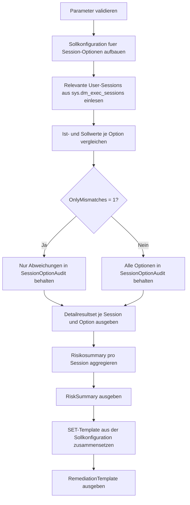

# FilteredIndexSessionOptionsAudit.sql

Dieses Skript prueft User-Sessions gegen eine konservative Sollkonfiguration fuer gefilterte Indizes. Der Schwerpunkt liegt auf einer lesenden Audit-Sicht ueber `sys.dm_exec_sessions`, damit Abweichungen bei `QUOTED_IDENTIFIER` und verwandten SET-Optionen vor DDL-Schritten schnell sichtbar werden.

## Uebersicht

<!-- SQLDOC:SUMMARY_TABLE:BEGIN -->
| Feld | Wert |
|---|---|
| Script | [FilteredIndexSessionOptionsAudit.sql](FilteredIndexSessionOptionsAudit.sql) |
| Version | `1.0` |
| Typ | `diagnostic-query` |
| Kapitel | `21_QUOTED_IDENTIFIER` |
| Sicherheit | `read-only` |
| Zweck | Audit fuer Session-Optionen, die bei gefilterten Indizes wichtig sind. |
<!-- SQLDOC:SUMMARY_TABLE:END -->

## Einordnung

Gefilterte Indizes haengen nicht nur von einem korrekten Index-Statement ab, sondern auch von einer kompatiblen Session-Konfiguration. Das Skript trennt deshalb die Arbeit in drei Resultsets: einen Detailvergleich je Session und Option, eine verdichtete Risikobewertung pro Session und ein SET-Template fuer remediale Vorbereitung vor indexbezogener DDL.

## Annahmen

- Die Sollwerte werden als didaktische und konservative Baseline fuer gefilterte Indizes modelliert.
- Das Audit liest nur Session-Metadaten aus `sys.dm_exec_sessions` und aendert keine Session-Optionen aktiv.
- `QUOTED_IDENTIFIER` wird als High-Risk-Abweichung markiert, weil dieser Schalter fuer das Kapitel und das Feature besonders relevant ist.
- Das Remediation-Template ist als Startpunkt fuer DDL-Sessions gedacht und muss bei Bedarf in Deployments oder Admin-Runbooks eingebettet werden.

## Anwendungsfall

Das Skript eignet sich fuer Trainingsumgebungen, Datenbank-Reviews und Troubleshooting, wenn `CREATE INDEX` mit Filterpraedikat vorbereitet oder bestehende Sessions vorab geprueft werden sollen. Es ist besonders nuetzlich, wenn mehrere Tools oder Deployments gegen dieselbe Instanz arbeiten und Session-Defaults nicht einheitlich sind.

## Parameter

<!-- SQLDOC:PARAMETERS_TABLE:BEGIN -->
| Parameter | SQL-Typ | Pflicht | Beschreibung |
|---|---|---|---|
| `@IncludeCurrentSession` | `BIT` | Nein | Nimmt bei `1` die aktuelle Session `@@SPID` in die Pruefung auf. |
| `@IncludeOtherUserSessions` | `BIT` | Nein | Nimmt bei `1` weitere User-Sessions aus `sys.dm_exec_sessions` in die Pruefung auf. |
| `@OnlyMismatches` | `BIT` | Nein | Zeigt bei `1` nur Optionen mit Abweichung gegen die Sollkonfiguration. |
<!-- SQLDOC:PARAMETERS_TABLE:END -->

## Abhaengigkeiten

<!-- SQLDOC:DEPENDENCIES_LIST:BEGIN -->
- `sys.dm_exec_sessions`
- `@@SPID`
- Session-Anforderungen fuer gefilterte Indizes
- `SET QUOTED_IDENTIFIER`
<!-- SQLDOC:DEPENDENCIES_LIST:END -->

## Hinweise

- Das Detailresultset ordnet jede Option je Session einer Schwereklasse zu und liefert direkt das passende `SET`-Statement.
- Das Summary-Resultset hebt Sessions mit High-Risk-Abweichungen zuerst hervor.
- Das dritte Resultset erzeugt bewusst nur ein Template und fuehrt keine Remediation aus.

## Versionshistorie

<!-- SQLDOC:VERSION_HISTORY_TABLE:BEGIN -->
| Version | Datum | User | Beschreibung |
|---|---|---|---|
| `1.0` | `2026-04-22` | `ER` | Erstversion des Session-Optionen-Audits fuer gefilterte Indizes |
<!-- SQLDOC:VERSION_HISTORY_TABLE:END -->

## Ablauf

<!-- SQLDOC:MERMAID:BEGIN -->

<!-- SQLDOC:MERMAID:END -->

## SQL-Code

<!-- SQLDOC:SQL_CODE:BEGIN -->
```sql
/*
BEGIN:SQL-HEADER v1
---
sql_header: v1
script_name: "FilteredIndexSessionOptionsAudit.sql"
script_version: "1.0"
script_type: "diagnostic-query"
chapter: "21_QUOTED_IDENTIFIER"

purpose: >
  Prueft Session-Optionen, die fuer das Erstellen und Pflegen gefilterter
  Indizes relevant sind. Das Skript vergleicht aktuelle User-Sessions mit
  einer konservativen Sollkonfiguration und erzeugt ein Remediation-Template
  fuer Sessions mit Abweichungen.

parameters:
  - name: "@IncludeCurrentSession"
    sql_type: "BIT"
    direction: "IN"
    required: false
    description: "1 = aktuelle Session in die Auswertung aufnehmen"
  - name: "@IncludeOtherUserSessions"
    sql_type: "BIT"
    direction: "IN"
    required: false
    description: "1 = weitere User-Sessions aus sys.dm_exec_sessions pruefen"
  - name: "@OnlyMismatches"
    sql_type: "BIT"
    direction: "IN"
    required: false
    description: "1 = nur Abweichungen gegen die Sollkonfiguration ausgeben"

result_sets:
  - name: "SessionOptionAudit"
    description: "Detailvergleich je Session und relevanter SET-Option"
  - name: "RiskSummary"
    description: "Verdichtete Uebersicht ueber Sessions mit Anzahl und Schwere der Abweichungen"
  - name: "RemediationTemplate"
    description: "SET-Skript, um eine Session vor gefilterter Index-DDL kompatibel vorzubereiten"

dependencies:
  - "sys.dm_exec_sessions"
  - "@@SPID"
  - "filtered index session requirements"
  - "SET QUOTED_IDENTIFIER"

safety:
  level: "read-only"
  writes_data: false

documentation:
  markdown_file: "T-SQL/21_QUOTED_IDENTIFIER/SQLScripts/FilteredIndexSessionOptionsAudit.md"
  sync_blocks:
    - "SUMMARY_TABLE"
    - "PARAMETERS_TABLE"
    - "DEPENDENCIES_LIST"
    - "VERSION_HISTORY_TABLE"
    - "SQL_CODE"
  mermaid:
    mode: "ai-agent-from-sql"
    source: "script-body"

main_responsible:
  name: "Erhard Rainer"
  initials: "ER"

version_history:
  - version: "1.0"
    date: "2026-04-22"
    user: "ER"
    description: "Erstversion des Session-Optionen-Audits fuer gefilterte Indizes"

notes:
  - "Die Sollwerte orientieren sich an typischen Session-Anforderungen fuer indexbezogene Features in SQL Server."
  - "Das Skript bleibt rein lesend und erzeugt nur ein Remediation-Template als Resultset."
---
END:SQL-HEADER v1
*/

SET NOCOUNT ON;

DECLARE @IncludeCurrentSession BIT = 1;
DECLARE @IncludeOtherUserSessions BIT = 1;
DECLARE @OnlyMismatches BIT = 0;

IF @IncludeCurrentSession NOT IN (0, 1)
BEGIN
    THROW 50000, '@IncludeCurrentSession muss 0 oder 1 sein.', 1;
END;

IF @IncludeOtherUserSessions NOT IN (0, 1)
BEGIN
    THROW 50001, '@IncludeOtherUserSessions muss 0 oder 1 sein.', 1;
END;

IF @OnlyMismatches NOT IN (0, 1)
BEGIN
    THROW 50002, '@OnlyMismatches muss 0 oder 1 sein.', 1;
END;

IF @IncludeCurrentSession = 0 AND @IncludeOtherUserSessions = 0
BEGIN
    THROW 50003, 'Mindestens eine Session-Gruppe muss ausgewaehlt werden.', 1;
END;

DROP TABLE IF EXISTS #RequiredOptions;
DROP TABLE IF EXISTS #SessionSnapshot;
DROP TABLE IF EXISTS #SessionOptionAudit;
DROP TABLE IF EXISTS #RiskSummary;
DROP TABLE IF EXISTS #RemediationTemplate;

CREATE TABLE #RequiredOptions
(
    StepNumber       INT           NOT NULL,
    OptionName       VARCHAR(40)   NOT NULL,
    ExpectedValue    BIT           NOT NULL,
    RecommendedSet   VARCHAR(40)   NOT NULL,
    WhyItMatters     VARCHAR(260)  NOT NULL
);

INSERT INTO #RequiredOptions
(
    StepNumber,
    OptionName,
    ExpectedValue,
    RecommendedSet,
    WhyItMatters
)
VALUES
    (1, 'ANSI_NULLS', 1, 'SET ANSI_NULLS ON;', 'Unterstuetzt kompatible DDL-Bedingungen fuer indexbezogene Features.'),
    (2, 'ANSI_PADDING', 1, 'SET ANSI_PADDING ON;', 'Sichert konsistente Speicherung und Metadaten fuer Zeichen- und Binaerspalten.'),
    (3, 'ANSI_WARNINGS', 1, 'SET ANSI_WARNINGS ON;', 'Verhindert Session-Konfigurationen, die fuer Index-DDL unguenstig sind.'),
    (4, 'ARITHABORT', 1, 'SET ARITHABORT ON;', 'Gehoert zu den erwarteten Session-Optionen fuer mehrere schemagebundene Features.'),
    (5, 'CONCAT_NULL_YIELDS_NULL', 1, 'SET CONCAT_NULL_YIELDS_NULL ON;', 'Haelt Ausdrucks- und Metadatenverhalten stabil.'),
    (6, 'QUOTED_IDENTIFIER', 1, 'SET QUOTED_IDENTIFIER ON;', 'Ist fuer gefilterte Indizes besonders relevant und Fokus dieses Kapitels.'),
    (7, 'NUMERIC_ROUNDABORT', 0, 'SET NUMERIC_ROUNDABORT OFF;', 'Soll fuer kompatible DDL-Sessions deaktiviert sein.');

CREATE TABLE #SessionSnapshot
(
    session_id                    SMALLINT      NOT NULL,
    login_name                    SYSNAME       NULL,
    host_name                     NVARCHAR(128) NULL,
    program_name                  NVARCHAR(128) NULL,
    status                        NVARCHAR(30)  NOT NULL,
    last_request_start_time       DATETIME      NULL,
    ansi_nulls                    BIT           NOT NULL,
    ansi_padding                  BIT           NOT NULL,
    ansi_warnings                 BIT           NOT NULL,
    arithabort                    BIT           NOT NULL,
    concat_null_yields_null       BIT           NOT NULL,
    quoted_identifier             BIT           NOT NULL,
    numeric_roundabort            BIT           NOT NULL
);

INSERT INTO #SessionSnapshot
(
    session_id,
    login_name,
    host_name,
    program_name,
    status,
    last_request_start_time,
    ansi_nulls,
    ansi_padding,
    ansi_warnings,
    arithabort,
    concat_null_yields_null,
    quoted_identifier,
    numeric_roundabort
)
SELECT
    s.session_id,
    s.login_name,
    s.host_name,
    s.program_name,
    s.status,
    s.last_request_start_time,
    s.ansi_nulls,
    s.ansi_padding,
    s.ansi_warnings,
    s.arithabort,
    s.concat_null_yields_null,
    s.quoted_identifier,
    s.numeric_roundabort
FROM sys.dm_exec_sessions AS s
WHERE s.is_user_process = 1
  AND
  (
      (@IncludeCurrentSession = 1 AND s.session_id = @@SPID)
      OR (@IncludeOtherUserSessions = 1 AND s.session_id <> @@SPID)
  );

CREATE TABLE #SessionOptionAudit
(
    session_id         SMALLINT       NOT NULL,
    login_name         SYSNAME        NULL,
    host_name          NVARCHAR(128)  NULL,
    program_name       NVARCHAR(128)  NULL,
    OptionName         VARCHAR(40)    NOT NULL,
    ExpectedValue      VARCHAR(3)     NOT NULL,
    ActualValue        VARCHAR(3)     NOT NULL,
    AuditStatus        VARCHAR(12)    NOT NULL,
    Severity           VARCHAR(10)    NOT NULL,
    RecommendedSet     VARCHAR(40)    NOT NULL,
    WhyItMatters       VARCHAR(260)   NOT NULL,
    last_request_start_time DATETIME  NULL
);

INSERT INTO #SessionOptionAudit
(
    session_id,
    login_name,
    host_name,
    program_name,
    OptionName,
    ExpectedValue,
    ActualValue,
    AuditStatus,
    Severity,
    RecommendedSet,
    WhyItMatters,
    last_request_start_time
)
SELECT
    ss.session_id,
    ss.login_name,
    ss.host_name,
    ss.program_name,
    ro.OptionName,
    CASE ro.ExpectedValue
        WHEN 1 THEN 'ON'
        ELSE 'OFF'
    END AS ExpectedValue,
    CASE ca.ActualValue
        WHEN 1 THEN 'ON'
        ELSE 'OFF'
    END AS ActualValue,
    CASE
        WHEN ca.ActualValue = ro.ExpectedValue THEN 'OK'
        ELSE 'Mismatch'
    END AS AuditStatus,
    CASE
        WHEN ca.ActualValue = ro.ExpectedValue THEN 'Info'
        WHEN ro.OptionName = 'QUOTED_IDENTIFIER' THEN 'High'
        ELSE 'Medium'
    END AS Severity,
    ro.RecommendedSet,
    ro.WhyItMatters,
    ss.last_request_start_time
FROM #SessionSnapshot AS ss
CROSS JOIN #RequiredOptions AS ro
CROSS APPLY
(
    SELECT
        CASE ro.OptionName
            WHEN 'ANSI_NULLS' THEN ss.ansi_nulls
            WHEN 'ANSI_PADDING' THEN ss.ansi_padding
            WHEN 'ANSI_WARNINGS' THEN ss.ansi_warnings
            WHEN 'ARITHABORT' THEN ss.arithabort
            WHEN 'CONCAT_NULL_YIELDS_NULL' THEN ss.concat_null_yields_null
            WHEN 'QUOTED_IDENTIFIER' THEN ss.quoted_identifier
            WHEN 'NUMERIC_ROUNDABORT' THEN ss.numeric_roundabort
        END AS ActualValue
) AS ca
WHERE @OnlyMismatches = 0
   OR ca.ActualValue <> ro.ExpectedValue;

SELECT
    soa.session_id,
    soa.login_name,
    soa.host_name,
    soa.program_name,
    soa.OptionName,
    soa.ExpectedValue,
    soa.ActualValue,
    soa.AuditStatus,
    soa.Severity,
    soa.RecommendedSet,
    soa.WhyItMatters,
    soa.last_request_start_time
FROM #SessionOptionAudit AS soa
ORDER BY
    soa.session_id,
    CASE soa.Severity
        WHEN 'High' THEN 1
        WHEN 'Medium' THEN 2
        ELSE 3
    END,
    soa.OptionName;

CREATE TABLE #RiskSummary
(
    session_id              SMALLINT       NOT NULL,
    login_name              SYSNAME        NULL,
    program_name            NVARCHAR(128)  NULL,
    mismatch_count          INT            NOT NULL,
    high_severity_count     INT            NOT NULL,
    session_risk            VARCHAR(12)    NOT NULL,
    last_request_start_time DATETIME       NULL
);

INSERT INTO #RiskSummary
(
    session_id,
    login_name,
    program_name,
    mismatch_count,
    high_severity_count,
    session_risk,
    last_request_start_time
)
SELECT
    soa.session_id,
    MAX(soa.login_name) AS login_name,
    MAX(soa.program_name) AS program_name,
    SUM(CASE WHEN soa.AuditStatus = 'Mismatch' THEN 1 ELSE 0 END) AS mismatch_count,
    SUM(CASE WHEN soa.Severity = 'High' AND soa.AuditStatus = 'Mismatch' THEN 1 ELSE 0 END) AS high_severity_count,
    CASE
        WHEN SUM(CASE WHEN soa.Severity = 'High' AND soa.AuditStatus = 'Mismatch' THEN 1 ELSE 0 END) > 0 THEN 'High'
        WHEN SUM(CASE WHEN soa.AuditStatus = 'Mismatch' THEN 1 ELSE 0 END) > 0 THEN 'Medium'
        ELSE 'Aligned'
    END AS session_risk,
    MAX(soa.last_request_start_time) AS last_request_start_time
FROM #SessionOptionAudit AS soa
GROUP BY
    soa.session_id;

SELECT
    rs.session_id,
    rs.login_name,
    rs.program_name,
    rs.mismatch_count,
    rs.high_severity_count,
    rs.session_risk,
    rs.last_request_start_time
FROM #RiskSummary AS rs
ORDER BY
    CASE rs.session_risk
        WHEN 'High' THEN 1
        WHEN 'Medium' THEN 2
        ELSE 3
    END,
    rs.mismatch_count DESC,
    rs.session_id;

CREATE TABLE #RemediationTemplate
(
    TemplateName      VARCHAR(40)    NOT NULL,
    TemplateSql       NVARCHAR(MAX)  NOT NULL,
    UsageHint         VARCHAR(260)   NOT NULL
);

INSERT INTO #RemediationTemplate
(
    TemplateName,
    TemplateSql,
    UsageHint
)
SELECT
    'FilteredIndexSessionBaseline',
    STRING_AGG(ro.RecommendedSet, CHAR(13) + CHAR(10)) WITHIN GROUP (ORDER BY ro.StepNumber),
    'Vor CREATE INDEX oder CREATE VIEW im Kontext gefilterter Indizes ausfuehren.'
FROM #RequiredOptions AS ro;

SELECT
    rt.TemplateName,
    rt.TemplateSql,
    rt.UsageHint
FROM #RemediationTemplate AS rt;
```
<!-- SQLDOC:SQL_CODE:END -->
