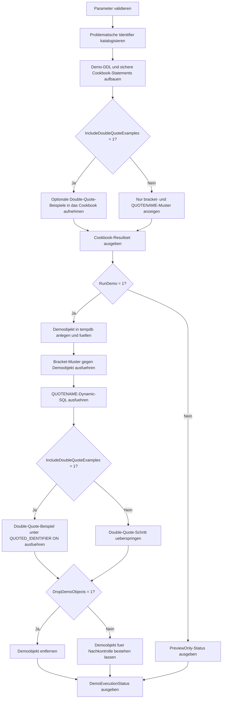

# IdentifierEscapingCookbook.sql

Dieses Skript liefert ein didaktisches Cookbook fuer problematische Objekt- und Spaltennamen. Es kombiniert eine kleine `tempdb`-Demo mit wiederverwendbaren Mustern fuer statisches SQL, dynamisches SQL ueber `QUOTENAME()` und optionale Beispiele mit doppelten Anfuehrungszeichen unter `QUOTED_IDENTIFIER ON`.

## Uebersicht

<!-- SQLDOC:SUMMARY_TABLE:BEGIN -->
| Feld | Wert |
|---|---|
| Script | [IdentifierEscapingCookbook.sql](IdentifierEscapingCookbook.sql) |
| Version | `1.0` |
| Typ | `didactic-lab` |
| Kapitel | `21_QUOTED_IDENTIFIER` |
| Sicherheit | `demo-write-tempdb` |
| Zweck | Didaktisches Cookbook fuer sichere Escape-Muster bei problematischen Bezeichnern. |
<!-- SQLDOC:SUMMARY_TABLE:END -->

## Einordnung

Das Kapitel zu `QUOTED_IDENTIFIER` braucht nicht nur eine Session-Pruefung, sondern auch konkrete Schreibmuster fuer unbequeme Identifier. Deshalb trennt das Skript die Arbeit in drei Perspektiven: einen Katalog typischer Problemfaelle, direkt nutzbare Cookbook-Statements und eine optionale Demo, die dieselben Muster gegen ein `tempdb`-Objekt ausfuehrt.

## Annahmen

- Es handelt sich um eine didaktische Erstversion ohne produktive Zieltabellen.
- `[]` und `QUOTENAME()` sind die bevorzugten Standardmuster, weil sie nicht vom Session-Schalter `QUOTED_IDENTIFIER` abhaengen.
- Das Beispiel mit doppelten Anfuehrungszeichen ist bewusst optional und nur fuer Sessions mit `SET QUOTED_IDENTIFIER ON` gedacht.
- Die Demo nutzt ein `tempdb`-Objekt mit Leerzeichen, reservierten Woertern, Bindestrichen und einem eingebetteten doppelten Anfuehrungszeichen im Spaltennamen.

## Anwendungsfall

Das Skript eignet sich fuer Unterricht, Review und Troubleshooting, wenn bestehende SQL-Snippets unsaubere Identifier verwenden oder dynamisches SQL robust aufgebaut werden soll. Besonders hilfreich ist es, wenn Teams zwischen reinen Bracket-Mustern, `QUOTENAME()`-basierten Generatoren und optionalen `"`-Beispielen unterscheiden wollen.

## Parameter

<!-- SQLDOC:PARAMETERS_TABLE:BEGIN -->
| Parameter | SQL-Typ | Pflicht | Beschreibung |
|---|---|---|---|
| `@RunDemo` | `BIT` | Nein | Fuehrt bei `1` die Demo gegen `tempdb.dbo.IdentifierEscapingCookbookDemo` wirklich aus. |
| `@IncludeDoubleQuoteExamples` | `BIT` | Nein | Zeigt bei `1` zusaetzliche Beispiele mit `"` unter `QUOTED_IDENTIFIER ON`. |
| `@DropDemoObjects` | `BIT` | Nein | Entfernt bei `1` das Demoobjekt nach einer optionalen Ausfuehrung wieder. |
<!-- SQLDOC:PARAMETERS_TABLE:END -->

## Abhaengigkeiten

<!-- SQLDOC:DEPENDENCIES_LIST:BEGIN -->
- `tempdb`-Demoobjekte
- `QUOTENAME`
- dynamisches SQL ueber `sys.sp_executesql`
- `SET QUOTED_IDENTIFIER`
- `DROP TABLE IF EXISTS`
<!-- SQLDOC:DEPENDENCIES_LIST:END -->

## Hinweise

- Der Identifier-Katalog ordnet jedem Problemfall direkt ein empfohlenes Escape-Muster zu.
- Das Cookbook-Resultset mischt statische Vorlagen, dynamische `QUOTENAME()`-Muster und optionale `"`-Beispiele, damit die Unterschiede nebeneinander sichtbar werden.
- Die Demo fuehrt bewusst nur lesbare Beispiele und ein einfaches `INSERT`-Template als Vorlage mit `tempdb`-Objekten aus.

## Versionshistorie

<!-- SQLDOC:VERSION_HISTORY_TABLE:BEGIN -->
| Version | Datum | User | Beschreibung |
|---|---|---|---|
| `1.0` | `2026-04-22` | `ER` | Erstversion des didaktischen Cookbooks fuer problematische Bezeichner |
<!-- SQLDOC:VERSION_HISTORY_TABLE:END -->

## Ablauf

<!-- SQLDOC:MERMAID:BEGIN -->

<!-- SQLDOC:MERMAID:END -->

## SQL-Code

<!-- SQLDOC:SQL_CODE:BEGIN -->
```sql
/*
BEGIN:SQL-HEADER v1
---
sql_header: v1
script_name: "IdentifierEscapingCookbook.sql"
script_version: "1.0"
script_type: "didactic-lab"
chapter: "21_QUOTED_IDENTIFIER"

purpose: >
  Liefert ein didaktisches Cookbook fuer problematische Objekt- und
  Spaltennamen. Das Skript sammelt sichere Quoting-Muster mit Klammern,
  QUOTENAME() und optional doppelten Anfuehrungszeichen unter
  QUOTED_IDENTIFIER ON und kann diese Muster gegen eine tempdb-Demo pruefen.

parameters:
  - name: "@RunDemo"
    sql_type: "BIT"
    direction: "IN"
    required: false
    description: "1 = Demoobjekt in tempdb anlegen und ausgewaehlte Cookbook-Muster ausfuehren"
  - name: "@IncludeDoubleQuoteExamples"
    sql_type: "BIT"
    direction: "IN"
    required: false
    description: "1 = zusaetzliche Beispiele mit doppelten Anfuehrungszeichen unter QUOTED_IDENTIFIER ON aufnehmen"
  - name: "@DropDemoObjects"
    sql_type: "BIT"
    direction: "IN"
    required: false
    description: "1 = Demoobjekt nach einer optionalen Ausfuehrung wieder entfernen"

result_sets:
  - name: "IdentifierCatalog"
    description: "Liste problematischer Bezeichner und des jeweils empfohlenen Escape-Musters"
  - name: "CookbookStatements"
    description: "Wiederverwendbare SELECT-, INSERT- und Dynamic-SQL-Beispiele mit sicheren Identifier-Mustern"
  - name: "DemoExecutionStatus"
    description: "Status der optionalen tempdb-Demo samt Beispielabfrage"

dependencies:
  - "tempdb demo objects"
  - "QUOTENAME"
  - "dynamic SQL via sys.sp_executesql"
  - "SET QUOTED_IDENTIFIER"
  - "DROP TABLE IF EXISTS"

safety:
  level: "demo-write-tempdb"
  writes_data: false

documentation:
  markdown_file: "T-SQL/21_QUOTED_IDENTIFIER/SQLScripts/IdentifierEscapingCookbook.md"
  sync_blocks:
    - "SUMMARY_TABLE"
    - "PARAMETERS_TABLE"
    - "DEPENDENCIES_LIST"
    - "VERSION_HISTORY_TABLE"
    - "SQL_CODE"
  mermaid:
    mode: "ai-agent-from-sql"
    source: "script-body"

main_responsible:
  name: "Erhard Rainer"
  initials: "ER"

version_history:
  - version: "1.0"
    date: "2026-04-22"
    user: "ER"
    description: "Erstversion des didaktischen Cookbooks fuer problematische Bezeichner"

notes:
  - "Die Demo verwendet tempdb.dbo-Objekte mit bewusst unbequemen Spaltennamen."
  - "Brackets und QUOTENAME() werden als Standardmuster bevorzugt; doppelte Anfuehrungszeichen sind optional und an QUOTED_IDENTIFIER ON gebunden."
---
END:SQL-HEADER v1
*/

SET NOCOUNT ON;

DECLARE @RunDemo BIT = 0;
DECLARE @IncludeDoubleQuoteExamples BIT = 1;
DECLARE @DropDemoObjects BIT = 1;

IF @RunDemo NOT IN (0, 1)
BEGIN
    THROW 50000, '@RunDemo muss 0 oder 1 sein.', 1;
END;

IF @IncludeDoubleQuoteExamples NOT IN (0, 1)
BEGIN
    THROW 50001, '@IncludeDoubleQuoteExamples muss 0 oder 1 sein.', 1;
END;

IF @DropDemoObjects NOT IN (0, 1)
BEGIN
    THROW 50002, '@DropDemoObjects muss 0 oder 1 sein.', 1;
END;

DECLARE @DemoTableName SYSNAME = N'tempdb.dbo.IdentifierEscapingCookbookDemo';
DECLARE @CreateDemoSql NVARCHAR(MAX);
DECLARE @SeedDemoSql NVARCHAR(MAX);
DECLARE @DropDemoSql NVARCHAR(MAX);
DECLARE @BracketSelectSql NVARCHAR(MAX);
DECLARE @QuotedIdentifierSelectSql NVARCHAR(MAX);
DECLARE @DynamicProjectionSql NVARCHAR(MAX);

DROP TABLE IF EXISTS #IdentifierCatalog;
DROP TABLE IF EXISTS #CookbookStatements;
DROP TABLE IF EXISTS #DemoExecutionStatus;

CREATE TABLE #IdentifierCatalog
(
    StepNumber          INT            NOT NULL,
    IdentifierRole      VARCHAR(40)    NOT NULL,
    RawIdentifier       NVARCHAR(128)  NOT NULL,
    WhyItIsProblematic  VARCHAR(260)   NOT NULL,
    PreferredPattern    VARCHAR(40)    NOT NULL,
    ExampleEscaping     NVARCHAR(260)  NOT NULL
);

INSERT INTO #IdentifierCatalog
(
    StepNumber,
    IdentifierRole,
    RawIdentifier,
    WhyItIsProblematic,
    PreferredPattern,
    ExampleEscaping
)
VALUES
    (1, 'Column', N'Order Number', 'Enthaelt ein Leerzeichen und muss deshalb als Identifier gequotet werden.', 'brackets', N'[Order Number]'),
    (2, 'Column', N'select', 'Ist ein reserviertes Wort und sollte nicht ungequotet verwendet werden.', 'brackets', N'[select]'),
    (3, 'Column', N'customer-status', 'Enthaelt ein Minuszeichen und kollidiert ungequotet mit Operator-Syntax.', 'QUOTENAME', QUOTENAME(N'customer-status')),
    (4, 'Column', N'sales"region', 'Enthaelt ein doppeltes Anfuehrungszeichen und braucht ein robustes Escape-Muster.', 'QUOTENAME', QUOTENAME(N'sales"region')),
    (5, 'Alias', N'Gross Margin %', 'Alias mit Leerzeichen und Sonderzeichen bleiben lesbar, wenn sie sauber gequotet werden.', 'brackets', N'[Gross Margin %]');

SELECT
    ic.StepNumber,
    ic.IdentifierRole,
    ic.RawIdentifier,
    ic.WhyItIsProblematic,
    ic.PreferredPattern,
    ic.ExampleEscaping
FROM #IdentifierCatalog AS ic
ORDER BY
    ic.StepNumber;

SET @CreateDemoSql = N'
DROP TABLE IF EXISTS ' + @DemoTableName + N';

CREATE TABLE ' + @DemoTableName + N'
(
    [Order Number]     INT            NOT NULL,
    [select]           NVARCHAR(40)   NOT NULL,
    [customer-status]  NVARCHAR(20)   NOT NULL,
    [sales"region]     NVARCHAR(40)   NOT NULL,
    [Gross Margin %]   DECIMAL(5,2)   NOT NULL
);';

SET @SeedDemoSql = N'
INSERT INTO ' + @DemoTableName + N'
(
    [Order Number],
    [select],
    [customer-status],
    [sales"region],
    [Gross Margin %]
)
VALUES
    (1001, N''priority'', N''active'', N''North "A"'', 31.50),
    (1002, N''standard'', N''hold'', N''South-West'', 18.25),
    (1003, N''priority'', N''active'', N''Central'', 42.00);';

SET @DropDemoSql = N'
DROP TABLE IF EXISTS ' + @DemoTableName + N';';

SET @BracketSelectSql = N'
SELECT
    d.[Order Number],
    d.[select],
    d.[customer-status],
    d.[sales"region],
    d.[Gross Margin %]
FROM ' + @DemoTableName + N' AS d
WHERE d.[customer-status] = N''active''
ORDER BY
    d.[Order Number];';

SET @QuotedIdentifierSelectSql = N'
SET QUOTED_IDENTIFIER ON;

SELECT
    d."Order Number",
    d."select",
    d."customer-status",
    d."sales""region",
    d."Gross Margin %"
FROM ' + @DemoTableName + N' AS d
WHERE d."customer-status" = N''active''
ORDER BY
    d."Order Number";';

SET @DynamicProjectionSql = N'
DECLARE @ColumnList NVARCHAR(MAX) =
    QUOTENAME(N''Order Number'') + N'', ''
    + QUOTENAME(N''select'') + N'', ''
    + QUOTENAME(N''customer-status'');

DECLARE @Sql NVARCHAR(MAX) =
    N''SELECT '' + @ColumnList + N'' FROM ' + @DemoTableName + N' ORDER BY '' + QUOTENAME(N''Order Number'') + N'';'';

EXEC sys.sp_executesql @Sql;';

CREATE TABLE #CookbookStatements
(
    StepNumber       INT            NOT NULL,
    PatternName      VARCHAR(50)    NOT NULL,
    PreferredUse     VARCHAR(160)   NOT NULL,
    RequiresQuotedIdentifier BIT    NOT NULL,
    CookbookSql      NVARCHAR(MAX)  NOT NULL
);

INSERT INTO #CookbookStatements
(
    StepNumber,
    PatternName,
    PreferredUse,
    RequiresQuotedIdentifier,
    CookbookSql
)
VALUES
    (1, 'BracketIdentifierSelect', 'Direkter Zugriff auf problematische Bezeichner in statischem SQL.', 0, @BracketSelectSql),
    (2, 'QuotenameProjectionBuilder', 'Sicheres Zusammensetzen dynamischer Identifier-Listen fuer generiertes SQL.', 0, @DynamicProjectionSql),
    (3, 'SafeInsertTemplate', 'Vorlage fuer INSERT in Tabellen mit Leerzeichen, Bindestrichen oder reservierten Woertern.', 0,
N'INSERT INTO [dbo].[Target Table]
(
    [Order Number],
    [select],
    [customer-status]
)
VALUES
(
    @OrderNumber,
    @SelectionLabel,
    @CustomerStatus
);'),
    (4, 'DoubleQuoteIdentifierSelect', 'Optionales Beispiel mit doppelten Anfuehrungszeichen fuer Sessions mit QUOTED_IDENTIFIER ON.', 1, @QuotedIdentifierSelectSql);

SELECT
    cs.StepNumber,
    cs.PatternName,
    cs.PreferredUse,
    cs.RequiresQuotedIdentifier,
    cs.CookbookSql
FROM #CookbookStatements AS cs
WHERE @IncludeDoubleQuoteExamples = 1
   OR cs.RequiresQuotedIdentifier = 0
ORDER BY
    cs.StepNumber;

CREATE TABLE #DemoExecutionStatus
(
    StepNumber         INT            NOT NULL,
    StatusStep         VARCHAR(40)    NOT NULL,
    StatusText         VARCHAR(260)   NOT NULL,
    ExecutedPattern    VARCHAR(50)    NULL,
    ExampleIdentifier  NVARCHAR(128)  NULL
);

IF @RunDemo = 1
BEGIN
    EXEC sys.sp_executesql @CreateDemoSql;
    EXEC sys.sp_executesql @SeedDemoSql;
    EXEC sys.sp_executesql @BracketSelectSql;

    INSERT INTO #DemoExecutionStatus
    (
        StepNumber,
        StatusStep,
        StatusText,
        ExecutedPattern,
        ExampleIdentifier
    )
    VALUES
    (
        1,
        'BracketPattern',
        'Die Demoabfrage mit Klammern wurde gegen tempdb erfolgreich ausgefuehrt.',
        'BracketIdentifierSelect',
        N'Order Number'
    );

    EXEC sys.sp_executesql @DynamicProjectionSql;

    INSERT INTO #DemoExecutionStatus
    (
        StepNumber,
        StatusStep,
        StatusText,
        ExecutedPattern,
        ExampleIdentifier
    )
    VALUES
    (
        2,
        'QuotenamePattern',
        'Das dynamische QUOTENAME()-Beispiel wurde erfolgreich gegen tempdb ausgefuehrt.',
        'QuotenameProjectionBuilder',
        N'customer-status'
    );

    IF @IncludeDoubleQuoteExamples = 1
    BEGIN
        EXEC sys.sp_executesql @QuotedIdentifierSelectSql;

        INSERT INTO #DemoExecutionStatus
        (
            StepNumber,
            StatusStep,
            StatusText,
            ExecutedPattern,
            ExampleIdentifier
        )
        VALUES
        (
            3,
            'DoubleQuotePattern',
            'Das Beispiel mit doppelten Anfuehrungszeichen lief unter QUOTED_IDENTIFIER ON.',
            'DoubleQuoteIdentifierSelect',
            N'sales"region'
        );
    END;

    IF @DropDemoObjects = 1
    BEGIN
        EXEC sys.sp_executesql @DropDemoSql;

        INSERT INTO #DemoExecutionStatus
        (
            StepNumber,
            StatusStep,
            StatusText,
            ExecutedPattern,
            ExampleIdentifier
        )
        VALUES
        (
            4,
            'Cleanup',
            'Das tempdb-Demoobjekt wurde nach der Ausfuehrung wieder entfernt.',
            NULL,
            NULL
        );
    END;
END;
ELSE
BEGIN
    INSERT INTO #DemoExecutionStatus
    (
        StepNumber,
        StatusStep,
        StatusText,
        ExecutedPattern,
        ExampleIdentifier
    )
    VALUES
    (
        1,
        'PreviewOnly',
        'Die Demo wurde nicht ausgefuehrt; nutze die Cookbook-Statements als sichere Vorlagen.',
        NULL,
        NULL
    );
END;

SELECT
    des.StepNumber,
    des.StatusStep,
    des.StatusText,
    des.ExecutedPattern,
    des.ExampleIdentifier
FROM #DemoExecutionStatus AS des
ORDER BY
    des.StepNumber;
```
<!-- SQLDOC:SQL_CODE:END -->
