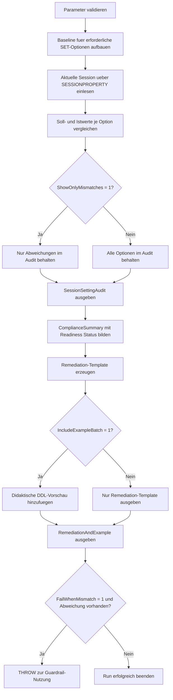

# IndexedComputedColumnSettingsCheck.sql

Dieses Skript prueft die aktuelle Session gegen eine konservative Baseline fuer indizierte berechnete Spalten. Der Fokus liegt auf den SET-Optionen, die vor `CREATE INDEX` auf einer persistierten computed column stabil gesetzt sein sollten, damit die DDL reproduzierbar vorbereitet werden kann.

## Uebersicht

<!-- SQLDOC:SUMMARY_TABLE:BEGIN -->
| Feld | Wert |
|---|---|
| Script | [IndexedComputedColumnSettingsCheck.sql](IndexedComputedColumnSettingsCheck.sql) |
| Version | `1.0` |
| Typ | `diagnostic-query` |
| Kapitel | `21_QUOTED_IDENTIFIER` |
| Sicherheit | `read-only` |
| Zweck | Audit der aktuellen Session fuer SET-Optionen rund um indexed computed columns. |
<!-- SQLDOC:SUMMARY_TABLE:END -->

## Einordnung

Indizierte berechnete Spalten verbinden Ausdruckslogik, Persistierung und Index-DDL. Das Skript reduziert diesen Kontext auf eine nachvollziehbare Session-Pruefung: Zuerst werden die erwarteten SET-Optionen modelliert, dann mit `SESSIONPROPERTY()` abgeglichen, anschliessend als Readiness-Status verdichtet und zuletzt in ein Remediation-Template sowie eine optionale DDL-Vorschau ueberfuehrt.

## Annahmen

- Die Baseline ist didaktisch und konservativ; sie bildet typische SQL-Server-Voraussetzungen fuer indizierte berechnete Spalten ab.
- Das Skript betrachtet bewusst nur die aktuelle Session `@@SPID`, damit Abweichungen direkt vor einer DDL-Vorbereitung sichtbar sind.
- Die Beispiel-Batch wird nur als Text ausgegeben und fuehrt keine Objekterstellung automatisch aus.
- `QUOTED_IDENTIFIER` wird als High-Risk-Option behandelt, weil das Kapitel auf diesem Schalter aufbaut und die DDL davon abhaengt.

## Anwendungsfall

Das Skript eignet sich fuer Trainingsumgebungen, Pre-Deployment-Checks und Fehlersuche, wenn eine persistierte computed column indiziert werden soll oder ein bestehender Build-Prozess auf Session-Defaults angewiesen ist. Mit `@FailWhenMismatch = 1` kann dieselbe Logik auch als Guardrail in einer kontrollierten Build-Session dienen.

## Parameter

<!-- SQLDOC:PARAMETERS_TABLE:BEGIN -->
| Parameter | SQL-Typ | Pflicht | Beschreibung |
|---|---|---|---|
| `@ShowOnlyMismatches` | `BIT` | Nein | Zeigt bei `1` nur Settings mit Abweichung gegen die Baseline. |
| `@FailWhenMismatch` | `BIT` | Nein | Loest bei `1` nach dem Audit einen Fehler aus, falls Abweichungen bestehen. |
| `@IncludeExampleBatch` | `BIT` | Nein | Fuegt bei `1` eine didaktische DDL-Vorschau fuer eine indizierte berechnete Spalte hinzu. |
<!-- SQLDOC:PARAMETERS_TABLE:END -->

## Abhaengigkeiten

<!-- SQLDOC:DEPENDENCIES_LIST:BEGIN -->
- `SESSIONPROPERTY`
- `@@SPID`
- `SET QUOTED_IDENTIFIER`
- Session-Anforderungen fuer indexed computed columns
<!-- SQLDOC:DEPENDENCIES_LIST:END -->

## Hinweise

- Das erste Resultset zeigt pro Option Sollwert, Istwert, Schweregrad und direkt das passende `SET`-Statement.
- Das Summary-Resultset verdichtet die Session in `Ready`, `NeedsReview` oder `Blocked`.
- Das dritte Resultset liefert immer ein Remediation-Template und optional eine didaktische DDL-Vorschau fuer eine persistierte computed column.

## Versionshistorie

<!-- SQLDOC:VERSION_HISTORY_TABLE:BEGIN -->
| Version | Datum | User | Beschreibung |
|---|---|---|---|
| `1.0` | `2026-04-22` | `ER` | Erstversion des Session-Settings-Checks fuer indexed computed columns |
<!-- SQLDOC:VERSION_HISTORY_TABLE:END -->

## Ablauf

<!-- SQLDOC:MERMAID:BEGIN -->

<!-- SQLDOC:MERMAID:END -->

## SQL-Code

<!-- SQLDOC:SQL_CODE:BEGIN -->
```sql
/*
BEGIN:SQL-HEADER v1
---
sql_header: v1
script_name: "IndexedComputedColumnSettingsCheck.sql"
script_version: "1.0"
script_type: "diagnostic-query"
chapter: "21_QUOTED_IDENTIFIER"

purpose: >
  Prueft, ob die aktuelle Session die empfohlenen SET-Optionen fuer das
  Erstellen und Pflegen indizierter berechneter Spalten verwendet. Das Skript
  vergleicht SESSIONPROPERTY()-Werte mit einer konservativen Baseline und
  liefert ein Remediation-Template sowie eine didaktische DDL-Vorschau.

parameters:
  - name: "@ShowOnlyMismatches"
    sql_type: "BIT"
    direction: "IN"
    required: false
    description: "1 = nur Optionen mit Abweichung gegen die Baseline ausgeben"
  - name: "@FailWhenMismatch"
    sql_type: "BIT"
    direction: "IN"
    required: false
    description: "1 = nach dem Audit bei Abweichungen einen Fehler ausloesen"
  - name: "@IncludeExampleBatch"
    sql_type: "BIT"
    direction: "IN"
    required: false
    description: "1 = zusaetzlich eine didaktische DDL-Vorschau fuer eine indizierte berechnete Spalte ausgeben"

result_sets:
  - name: "SessionSettingAudit"
    description: "Vergleich zwischen erwarteten und aktuellen Session-Settings"
  - name: "ComplianceSummary"
    description: "Verdichtete Bewertung der aktuellen Session fuer Indexed Computed Columns"
  - name: "RemediationAndExample"
    description: "SET-Template und optionale DDL-Vorschau fuer eine didaktische Demo"

dependencies:
  - "SESSIONPROPERTY"
  - "@@SPID"
  - "SET QUOTED_IDENTIFIER"
  - "indexed computed column session requirements"

safety:
  level: "read-only"
  writes_data: false

documentation:
  markdown_file: "T-SQL/21_QUOTED_IDENTIFIER/SQLScripts/IndexedComputedColumnSettingsCheck.md"
  sync_blocks:
    - "SUMMARY_TABLE"
    - "PARAMETERS_TABLE"
    - "DEPENDENCIES_LIST"
    - "VERSION_HISTORY_TABLE"
    - "SQL_CODE"
  mermaid:
    mode: "ai-agent-from-sql"
    source: "script-body"

main_responsible:
  name: "Erhard Rainer"
  initials: "ER"

version_history:
  - version: "1.0"
    date: "2026-04-22"
    user: "ER"
    description: "Erstversion des Session-Settings-Checks fuer indexed computed columns"

notes:
  - "Die Baseline ist didaktisch konservativ und orientiert sich an typischen SQL-Server-Anforderungen fuer indizierte berechnete Spalten."
  - "Das Skript fuehrt keine DDL aus; die Beispiel-Batch wird nur als Text ausgegeben."
---
END:SQL-HEADER v1
*/

SET NOCOUNT ON;

DECLARE @ShowOnlyMismatches BIT = 0;
DECLARE @FailWhenMismatch BIT = 0;
DECLARE @IncludeExampleBatch BIT = 1;

IF @ShowOnlyMismatches NOT IN (0, 1)
BEGIN
    THROW 50000, '@ShowOnlyMismatches muss 0 oder 1 sein.', 1;
END;

IF @FailWhenMismatch NOT IN (0, 1)
BEGIN
    THROW 50001, '@FailWhenMismatch muss 0 oder 1 sein.', 1;
END;

IF @IncludeExampleBatch NOT IN (0, 1)
BEGIN
    THROW 50002, '@IncludeExampleBatch muss 0 oder 1 sein.', 1;
END;

DROP TABLE IF EXISTS #RequiredSettings;
DROP TABLE IF EXISTS #CurrentSessionSettings;
DROP TABLE IF EXISTS #SessionSettingAudit;
DROP TABLE IF EXISTS #ComplianceSummary;
DROP TABLE IF EXISTS #RemediationAndExample;

CREATE TABLE #RequiredSettings
(
    StepNumber        INT           NOT NULL,
    OptionName        VARCHAR(40)   NOT NULL,
    ExpectedValue     BIT           NOT NULL,
    RecommendedSet    VARCHAR(40)   NOT NULL,
    WhyItMatters      VARCHAR(260)  NOT NULL,
    SeverityIfWrong   VARCHAR(10)   NOT NULL
);

INSERT INTO #RequiredSettings
(
    StepNumber,
    OptionName,
    ExpectedValue,
    RecommendedSet,
    WhyItMatters,
    SeverityIfWrong
)
VALUES
    (1, 'ANSI_NULLS', 1, 'SET ANSI_NULLS ON;', 'Wird fuer kompatible DDL rund um indizierte berechnete Spalten erwartet.', 'High'),
    (2, 'ANSI_PADDING', 1, 'SET ANSI_PADDING ON;', 'Haelt Zeichen- und Binaerverhalten fuer schema- und indexbezogene DDL stabil.', 'Medium'),
    (3, 'ANSI_WARNINGS', 1, 'SET ANSI_WARNINGS ON;', 'Verhindert nicht kompatible Session-Konfigurationen waehrend Index-DDL.', 'High'),
    (4, 'ARITHABORT', 1, 'SET ARITHABORT ON;', 'Gehoert zu den ueblichen Session-Voraussetzungen fuer indizierte berechnete Spalten.', 'High'),
    (5, 'CONCAT_NULL_YIELDS_NULL', 1, 'SET CONCAT_NULL_YIELDS_NULL ON;', 'Haelt Ausdruckslogik und Persistierungsverhalten konsistent.', 'Medium'),
    (6, 'QUOTED_IDENTIFIER', 1, 'SET QUOTED_IDENTIFIER ON;', 'Ist fuer das Erstellen von Indizes auf berechneten Spalten zentral und Fokus des Kapitels.', 'High'),
    (7, 'NUMERIC_ROUNDABORT', 0, 'SET NUMERIC_ROUNDABORT OFF;', 'Soll deaktiviert sein, damit die Session fuer die DDL kompatibel bleibt.', 'Medium');

CREATE TABLE #CurrentSessionSettings
(
    session_id                 INT          NOT NULL,
    ansi_nulls                 BIT          NOT NULL,
    ansi_padding               BIT          NOT NULL,
    ansi_warnings              BIT          NOT NULL,
    arithabort                 BIT          NOT NULL,
    concat_null_yields_null    BIT          NOT NULL,
    quoted_identifier          BIT          NOT NULL,
    numeric_roundabort         BIT          NOT NULL
);

INSERT INTO #CurrentSessionSettings
(
    session_id,
    ansi_nulls,
    ansi_padding,
    ansi_warnings,
    arithabort,
    concat_null_yields_null,
    quoted_identifier,
    numeric_roundabort
)
SELECT
    @@SPID,
    CONVERT(BIT, SESSIONPROPERTY('ANSI_NULLS')),
    CONVERT(BIT, SESSIONPROPERTY('ANSI_PADDING')),
    CONVERT(BIT, SESSIONPROPERTY('ANSI_WARNINGS')),
    CONVERT(BIT, SESSIONPROPERTY('ARITHABORT')),
    CONVERT(BIT, SESSIONPROPERTY('CONCAT_NULL_YIELDS_NULL')),
    CONVERT(BIT, SESSIONPROPERTY('QUOTED_IDENTIFIER')),
    CONVERT(BIT, SESSIONPROPERTY('NUMERIC_ROUNDABORT'));

CREATE TABLE #SessionSettingAudit
(
    session_id         INT           NOT NULL,
    OptionName         VARCHAR(40)   NOT NULL,
    ExpectedValue      VARCHAR(3)    NOT NULL,
    ActualValue        VARCHAR(3)    NOT NULL,
    AuditStatus        VARCHAR(12)   NOT NULL,
    Severity           VARCHAR(10)   NOT NULL,
    RecommendedSet     VARCHAR(40)   NOT NULL,
    WhyItMatters       VARCHAR(260)  NOT NULL
);

INSERT INTO #SessionSettingAudit
(
    session_id,
    OptionName,
    ExpectedValue,
    ActualValue,
    AuditStatus,
    Severity,
    RecommendedSet,
    WhyItMatters
)
SELECT
    css.session_id,
    rs.OptionName,
    CASE rs.ExpectedValue
        WHEN 1 THEN 'ON'
        ELSE 'OFF'
    END AS ExpectedValue,
    CASE ca.ActualValue
        WHEN 1 THEN 'ON'
        ELSE 'OFF'
    END AS ActualValue,
    CASE
        WHEN ca.ActualValue = rs.ExpectedValue THEN 'OK'
        ELSE 'Mismatch'
    END AS AuditStatus,
    CASE
        WHEN ca.ActualValue = rs.ExpectedValue THEN 'Info'
        ELSE rs.SeverityIfWrong
    END AS Severity,
    rs.RecommendedSet,
    rs.WhyItMatters
FROM #CurrentSessionSettings AS css
CROSS JOIN #RequiredSettings AS rs
CROSS APPLY
(
    SELECT
        CASE rs.OptionName
            WHEN 'ANSI_NULLS' THEN css.ansi_nulls
            WHEN 'ANSI_PADDING' THEN css.ansi_padding
            WHEN 'ANSI_WARNINGS' THEN css.ansi_warnings
            WHEN 'ARITHABORT' THEN css.arithabort
            WHEN 'CONCAT_NULL_YIELDS_NULL' THEN css.concat_null_yields_null
            WHEN 'QUOTED_IDENTIFIER' THEN css.quoted_identifier
            WHEN 'NUMERIC_ROUNDABORT' THEN css.numeric_roundabort
        END AS ActualValue
) AS ca
;

SELECT
    ssa.session_id,
    ssa.OptionName,
    ssa.ExpectedValue,
    ssa.ActualValue,
    ssa.AuditStatus,
    ssa.Severity,
    ssa.RecommendedSet,
    ssa.WhyItMatters
FROM #SessionSettingAudit AS ssa
WHERE @ShowOnlyMismatches = 0
   OR ssa.AuditStatus = 'Mismatch'
ORDER BY
    CASE ssa.Severity
        WHEN 'High' THEN 1
        WHEN 'Medium' THEN 2
        ELSE 3
    END,
    ssa.OptionName;

CREATE TABLE #ComplianceSummary
(
    session_id              INT           NOT NULL,
    checked_setting_count   INT           NOT NULL,
    mismatch_count          INT           NOT NULL,
    high_severity_count     INT           NOT NULL,
    readiness_status        VARCHAR(20)   NOT NULL,
    recommended_action      VARCHAR(260)  NOT NULL
);

INSERT INTO #ComplianceSummary
(
    session_id,
    checked_setting_count,
    mismatch_count,
    high_severity_count,
    readiness_status,
    recommended_action
)
SELECT
    css.session_id,
    COUNT(*) AS checked_setting_count,
    SUM(CASE WHEN cssa.AuditStatus = 'Mismatch' THEN 1 ELSE 0 END) AS mismatch_count,
    SUM(CASE WHEN cssa.AuditStatus = 'Mismatch' AND cssa.Severity = 'High' THEN 1 ELSE 0 END) AS high_severity_count,
    CASE
        WHEN SUM(CASE WHEN cssa.AuditStatus = 'Mismatch' THEN 1 ELSE 0 END) = 0 THEN 'Ready'
        WHEN SUM(CASE WHEN cssa.AuditStatus = 'Mismatch' AND cssa.Severity = 'High' THEN 1 ELSE 0 END) > 0 THEN 'Blocked'
        ELSE 'NeedsReview'
    END AS readiness_status,
    CASE
        WHEN SUM(CASE WHEN cssa.AuditStatus = 'Mismatch' THEN 1 ELSE 0 END) = 0 THEN 'Session kann die DDL fuer indizierte berechnete Spalten mit dieser Baseline vorbereiten.'
        WHEN SUM(CASE WHEN cssa.AuditStatus = 'Mismatch' AND cssa.Severity = 'High' THEN 1 ELSE 0 END) > 0 THEN 'Fuehre zuerst das SET-Template aus, bevor CREATE INDEX oder ALTER TABLE vorbereitet wird.'
        ELSE 'Gleiche die Medium-Risk-Optionen gegen die Baseline ab und pruefe danach erneut.'
    END AS recommended_action
FROM #CurrentSessionSettings AS css
INNER JOIN #SessionSettingAudit AS cssa
    ON css.session_id = cssa.session_id
GROUP BY
    css.session_id;

SELECT
    cs.session_id,
    cs.checked_setting_count,
    cs.mismatch_count,
    cs.high_severity_count,
    cs.readiness_status,
    cs.recommended_action
FROM #ComplianceSummary AS cs;

CREATE TABLE #RemediationAndExample
(
    ItemType         VARCHAR(30)    NOT NULL,
    ItemName         VARCHAR(80)    NOT NULL,
    ItemSql          NVARCHAR(MAX)  NOT NULL,
    UsageHint        VARCHAR(260)   NOT NULL
);

INSERT INTO #RemediationAndExample
(
    ItemType,
    ItemName,
    ItemSql,
    UsageHint
)
SELECT
    'RemediationTemplate',
    'IndexedComputedColumnSessionBaseline',
    STRING_AGG(rs.RecommendedSet, CHAR(13) + CHAR(10)) WITHIN GROUP (ORDER BY rs.StepNumber),
    'Vor dem Erstellen oder Rebuild eines Indexes auf einer berechneten Spalte in derselben Session ausfuehren.'
FROM #RequiredSettings AS rs;

IF @IncludeExampleBatch = 1
BEGIN
    INSERT INTO #RemediationAndExample
    (
        ItemType,
        ItemName,
        ItemSql,
        UsageHint
    )
    VALUES
    (
        'ExampleBatch',
        'IndexedComputedColumnDidacticPreview',
        N'-- Didaktische Vorschau, nicht automatisch ausfuehren' + CHAR(13) + CHAR(10)
        + N'SET ANSI_NULLS ON;' + CHAR(13) + CHAR(10)
        + N'SET ANSI_PADDING ON;' + CHAR(13) + CHAR(10)
        + N'SET ANSI_WARNINGS ON;' + CHAR(13) + CHAR(10)
        + N'SET ARITHABORT ON;' + CHAR(13) + CHAR(10)
        + N'SET CONCAT_NULL_YIELDS_NULL ON;' + CHAR(13) + CHAR(10)
        + N'SET QUOTED_IDENTIFIER ON;' + CHAR(13) + CHAR(10)
        + N'SET NUMERIC_ROUNDABORT OFF;' + CHAR(13) + CHAR(10) + CHAR(13) + CHAR(10)
        + N'CREATE TABLE dbo.SalesLineDemo' + CHAR(13) + CHAR(10)
        + N'(' + CHAR(13) + CHAR(10)
        + N'    SalesLineID      INT            NOT NULL,' + CHAR(13) + CHAR(10)
        + N'    NetAmount        DECIMAL(10,2)  NOT NULL,' + CHAR(13) + CHAR(10)
        + N'    TaxRate          DECIMAL(5,4)   NOT NULL,' + CHAR(13) + CHAR(10)
        + N'    GrossAmount AS CAST(NetAmount * (1 + TaxRate) AS DECIMAL(10,2)) PERSISTED,' + CHAR(13) + CHAR(10)
        + N'    CONSTRAINT PK_SalesLineDemo PRIMARY KEY CLUSTERED (SalesLineID)' + CHAR(13) + CHAR(10)
        + N');' + CHAR(13) + CHAR(10) + CHAR(13) + CHAR(10)
        + N'CREATE INDEX IX_SalesLineDemo_GrossAmount' + CHAR(13) + CHAR(10)
        + N'ON dbo.SalesLineDemo (GrossAmount);',
        'Didaktische Vorschau fuer das Zusammenspiel aus Session-Baseline, persistierter berechneter Spalte und Index-DDL.'
    );
END;

SELECT
    rae.ItemType,
    rae.ItemName,
    rae.ItemSql,
    rae.UsageHint
FROM #RemediationAndExample AS rae
ORDER BY
    CASE rae.ItemType
        WHEN 'RemediationTemplate' THEN 1
        ELSE 2
    END,
    rae.ItemName;

IF @FailWhenMismatch = 1
   AND EXISTS
   (
       SELECT
           1
       FROM #ComplianceSummary AS cs
       WHERE cs.mismatch_count > 0
   )
BEGIN
    THROW 50003, 'Die aktuelle Session erfuellt die Baseline fuer indexed computed columns nicht.', 1;
END;
```
<!-- SQLDOC:SQL_CODE:END -->
