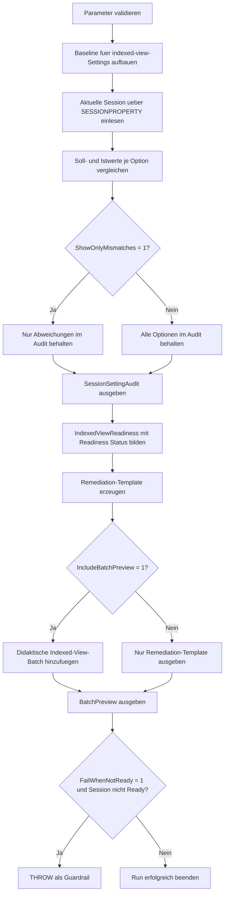

# IndexedViewBatchSettings.sql

Dieses Skript prueft die aktuelle Session gegen eine konservative Baseline fuer indexed views und liefert zusaetzlich eine didaktische Batch-Vorschau fuer `CREATE VIEW ... WITH SCHEMABINDING` und den anschliessenden Index-Aufbau.

## Uebersicht

<!-- SQLDOC:SUMMARY_TABLE:BEGIN -->
| Feld | Wert |
|---|---|
| Script | [IndexedViewBatchSettings.sql](IndexedViewBatchSettings.sql) |
| Version | `1.0` |
| Typ | `diagnostic-query` |
| Kapitel | `21_QUOTED_IDENTIFIER` |
| Sicherheit | `read-only` |
| Zweck | Review der Session-Settings und Batch-Vorbereitung fuer indexed views. |
<!-- SQLDOC:SUMMARY_TABLE:END -->

## Einordnung

Indexed views benoetigen nicht nur eine passende View-Definition, sondern auch eine kompatible Session-Konfiguration fuer `SCHEMABINDING` und den Index-Aufbau. Das Skript reduziert diesen Zusammenhang auf drei gut pruefbare Teile: Audit der aktuellen Session, verdichtete Readiness-Bewertung und eine Batch-Vorschau als Text.

## Annahmen

- Die Baseline ist didaktisch und konservativ; sie modelliert uebliche Session-Anforderungen fuer indexed views.
- Das Skript betrachtet bewusst nur die aktuelle Session `@@SPID`, damit die Vorbereitung fuer eine konkrete DDL-Batch nachvollziehbar bleibt.
- Die Beispiel-Batch wird nur als Text ausgegeben und fuehrt keine Objekterstellung automatisch aus.
- `QUOTED_IDENTIFIER` wird als High-Risk-Option behandelt, weil der Schalter fuer indexed views zentral ist und den Kapitelkontext traegt.

## Anwendungsfall

Das Skript eignet sich fuer Trainingsumgebungen, Deployment-Reviews und Troubleshooting, wenn eine schemagebundene View indiziert werden soll oder ein vorhandener Build-Prozess von stabilen Session-Defaults abhaengt. Mit `@FailWhenNotReady = 1` kann dasselbe Audit auch als Guardrail vor DDL-Schritten eingesetzt werden.

## Parameter

<!-- SQLDOC:PARAMETERS_TABLE:BEGIN -->
| Parameter | SQL-Typ | Pflicht | Beschreibung |
|---|---|---|---|
| `@ShowOnlyMismatches` | `BIT` | Nein | Zeigt bei `1` nur Settings mit Abweichung gegen die Baseline. |
| `@IncludeBatchPreview` | `BIT` | Nein | Fuegt bei `1` eine didaktische Indexed-View-Batch als Text hinzu. |
| `@FailWhenNotReady` | `BIT` | Nein | Loest bei `1` nach dem Audit einen Fehler aus, wenn die Session nicht `Ready` ist. |
<!-- SQLDOC:PARAMETERS_TABLE:END -->

## Abhaengigkeiten

<!-- SQLDOC:DEPENDENCIES_LIST:BEGIN -->
- `SESSIONPROPERTY`
- `@@SPID`
- `SET QUOTED_IDENTIFIER`
- Session-Anforderungen fuer indexed views
<!-- SQLDOC:DEPENDENCIES_LIST:END -->

## Hinweise

- Das erste Resultset zeigt pro Option Sollwert, Istwert, Schweregrad und das passende `SET`-Statement.
- Das zweite Resultset verdichtet die Session zu `Ready`, `NeedsReview` oder `Blocked`.
- Das dritte Resultset liefert immer ein Remediation-Template und optional eine didaktische Batch-Vorschau fuer eine schemagebundene Aggregat-View.

## Versionshistorie

<!-- SQLDOC:VERSION_HISTORY_TABLE:BEGIN -->
| Version | Datum | User | Beschreibung |
|---|---|---|---|
| `1.0` | `2026-04-22` | `ER` | Erstversion des Session- und Batch-Checks fuer indexed views |
<!-- SQLDOC:VERSION_HISTORY_TABLE:END -->

## Ablauf

<!-- SQLDOC:MERMAID:BEGIN -->

<!-- SQLDOC:MERMAID:END -->

## SQL-Code

<!-- SQLDOC:SQL_CODE:BEGIN -->
```sql
/*
BEGIN:SQL-HEADER v1
---
sql_header: v1
script_name: "IndexedViewBatchSettings.sql"
script_version: "1.0"
script_type: "diagnostic-query"
chapter: "21_QUOTED_IDENTIFIER"

purpose: >
  Prueft die aktuelle Session gegen eine konservative Baseline fuer
  indexed-view-relevante SET-Optionen und erzeugt zusaetzlich eine
  didaktische Batch-Vorschau fuer CREATE VIEW WITH SCHEMABINDING und den
  zugehoerigen Index-Aufbau.

parameters:
  - name: "@ShowOnlyMismatches"
    sql_type: "BIT"
    direction: "IN"
    required: false
    description: "1 = nur Optionen mit Abweichung gegen die Baseline ausgeben"
  - name: "@IncludeBatchPreview"
    sql_type: "BIT"
    direction: "IN"
    required: false
    description: "1 = eine didaktische Indexed-View-Batch als Text ausgeben"
  - name: "@FailWhenNotReady"
    sql_type: "BIT"
    direction: "IN"
    required: false
    description: "1 = nach dem Audit bei kritischen Abweichungen einen Fehler ausloesen"

result_sets:
  - name: "SessionSettingAudit"
    description: "Vergleich zwischen erwarteten und aktuellen SET-Optionen der Session"
  - name: "IndexedViewReadiness"
    description: "Verdichtete Bewertung der Session fuer Indexed-View-DDL"
  - name: "BatchPreview"
    description: "Remediation-Template und optionale didaktische DDL-Vorschau"

dependencies:
  - "SESSIONPROPERTY"
  - "@@SPID"
  - "SET QUOTED_IDENTIFIER"
  - "indexed view session requirements"

safety:
  level: "read-only"
  writes_data: false

documentation:
  markdown_file: "T-SQL/21_QUOTED_IDENTIFIER/SQLScripts/IndexedViewBatchSettings.md"
  sync_blocks:
    - "SUMMARY_TABLE"
    - "PARAMETERS_TABLE"
    - "DEPENDENCIES_LIST"
    - "VERSION_HISTORY_TABLE"
    - "SQL_CODE"
  mermaid:
    mode: "ai-agent-from-sql"
    source: "script-body"

main_responsible:
  name: "Erhard Rainer"
  initials: "ER"

version_history:
  - version: "1.0"
    date: "2026-04-22"
    user: "ER"
    description: "Erstversion des Session- und Batch-Checks fuer indexed views"

notes:
  - "Die Baseline ist didaktisch konservativ und fokussiert die ueblichen SET-Voraussetzungen fuer indexed views."
  - "Das Skript fuehrt keine DDL aus; die Batch-Vorschau wird nur als Text ausgegeben."
---
END:SQL-HEADER v1
*/

SET NOCOUNT ON;

DECLARE @ShowOnlyMismatches BIT = 0;
DECLARE @IncludeBatchPreview BIT = 1;
DECLARE @FailWhenNotReady BIT = 0;

IF @ShowOnlyMismatches NOT IN (0, 1)
BEGIN
    THROW 50000, '@ShowOnlyMismatches muss 0 oder 1 sein.', 1;
END;

IF @IncludeBatchPreview NOT IN (0, 1)
BEGIN
    THROW 50001, '@IncludeBatchPreview muss 0 oder 1 sein.', 1;
END;

IF @FailWhenNotReady NOT IN (0, 1)
BEGIN
    THROW 50002, '@FailWhenNotReady muss 0 oder 1 sein.', 1;
END;

DROP TABLE IF EXISTS #RequiredSettings;
DROP TABLE IF EXISTS #CurrentSessionSettings;
DROP TABLE IF EXISTS #SessionSettingAudit;
DROP TABLE IF EXISTS #IndexedViewReadiness;
DROP TABLE IF EXISTS #BatchPreview;

CREATE TABLE #RequiredSettings
(
    StepNumber        INT           NOT NULL,
    OptionName        VARCHAR(40)   NOT NULL,
    ExpectedValue     BIT           NOT NULL,
    RecommendedSet    VARCHAR(40)   NOT NULL,
    WhyItMatters      VARCHAR(260)  NOT NULL,
    SeverityIfWrong   VARCHAR(10)   NOT NULL
);

INSERT INTO #RequiredSettings
(
    StepNumber,
    OptionName,
    ExpectedValue,
    RecommendedSet,
    WhyItMatters,
    SeverityIfWrong
)
VALUES
    (1, 'ANSI_NULLS', 1, 'SET ANSI_NULLS ON;', 'Wird fuer schemagebundene Views und deren Index-DDL erwartet.', 'High'),
    (2, 'ANSI_PADDING', 1, 'SET ANSI_PADDING ON;', 'Haelt Metadaten und Ausdrucksverhalten fuer indexierte View-Definitionen stabil.', 'Medium'),
    (3, 'ANSI_WARNINGS', 1, 'SET ANSI_WARNINGS ON;', 'Verhindert nicht kompatible Session-Konfigurationen waehrend CREATE VIEW und CREATE INDEX.', 'High'),
    (4, 'ARITHABORT', 1, 'SET ARITHABORT ON;', 'Gehoert zu den ueblichen Voraussetzungen fuer indexed views und Folge-Queries.', 'High'),
    (5, 'CONCAT_NULL_YIELDS_NULL', 1, 'SET CONCAT_NULL_YIELDS_NULL ON;', 'Sichert deterministisches Ausdrucksverhalten in schemagebundenen Definitionen.', 'Medium'),
    (6, 'QUOTED_IDENTIFIER', 1, 'SET QUOTED_IDENTIFIER ON;', 'Ist fuer indexed views zentral und Schwerpunkt dieses Kapitels.', 'High'),
    (7, 'NUMERIC_ROUNDABORT', 0, 'SET NUMERIC_ROUNDABORT OFF;', 'Soll deaktiviert sein, damit die Session fuer indexed-view-DDL kompatibel bleibt.', 'Medium');

CREATE TABLE #CurrentSessionSettings
(
    session_id                 INT          NOT NULL,
    ansi_nulls                 BIT          NOT NULL,
    ansi_padding               BIT          NOT NULL,
    ansi_warnings              BIT          NOT NULL,
    arithabort                 BIT          NOT NULL,
    concat_null_yields_null    BIT          NOT NULL,
    quoted_identifier          BIT          NOT NULL,
    numeric_roundabort         BIT          NOT NULL
);

INSERT INTO #CurrentSessionSettings
(
    session_id,
    ansi_nulls,
    ansi_padding,
    ansi_warnings,
    arithabort,
    concat_null_yields_null,
    quoted_identifier,
    numeric_roundabort
)
SELECT
    @@SPID,
    CONVERT(BIT, SESSIONPROPERTY('ANSI_NULLS')),
    CONVERT(BIT, SESSIONPROPERTY('ANSI_PADDING')),
    CONVERT(BIT, SESSIONPROPERTY('ANSI_WARNINGS')),
    CONVERT(BIT, SESSIONPROPERTY('ARITHABORT')),
    CONVERT(BIT, SESSIONPROPERTY('CONCAT_NULL_YIELDS_NULL')),
    CONVERT(BIT, SESSIONPROPERTY('QUOTED_IDENTIFIER')),
    CONVERT(BIT, SESSIONPROPERTY('NUMERIC_ROUNDABORT'));

CREATE TABLE #SessionSettingAudit
(
    session_id         INT           NOT NULL,
    OptionName         VARCHAR(40)   NOT NULL,
    ExpectedValue      VARCHAR(3)    NOT NULL,
    ActualValue        VARCHAR(3)    NOT NULL,
    AuditStatus        VARCHAR(12)   NOT NULL,
    Severity           VARCHAR(10)   NOT NULL,
    RecommendedSet     VARCHAR(40)   NOT NULL,
    WhyItMatters       VARCHAR(260)  NOT NULL
);

INSERT INTO #SessionSettingAudit
(
    session_id,
    OptionName,
    ExpectedValue,
    ActualValue,
    AuditStatus,
    Severity,
    RecommendedSet,
    WhyItMatters
)
SELECT
    css.session_id,
    rs.OptionName,
    CASE rs.ExpectedValue
        WHEN 1 THEN 'ON'
        ELSE 'OFF'
    END AS ExpectedValue,
    CASE ca.ActualValue
        WHEN 1 THEN 'ON'
        ELSE 'OFF'
    END AS ActualValue,
    CASE
        WHEN ca.ActualValue = rs.ExpectedValue THEN 'OK'
        ELSE 'Mismatch'
    END AS AuditStatus,
    CASE
        WHEN ca.ActualValue = rs.ExpectedValue THEN 'Info'
        ELSE rs.SeverityIfWrong
    END AS Severity,
    rs.RecommendedSet,
    rs.WhyItMatters
FROM #CurrentSessionSettings AS css
CROSS JOIN #RequiredSettings AS rs
CROSS APPLY
(
    SELECT
        CASE rs.OptionName
            WHEN 'ANSI_NULLS' THEN css.ansi_nulls
            WHEN 'ANSI_PADDING' THEN css.ansi_padding
            WHEN 'ANSI_WARNINGS' THEN css.ansi_warnings
            WHEN 'ARITHABORT' THEN css.arithabort
            WHEN 'CONCAT_NULL_YIELDS_NULL' THEN css.concat_null_yields_null
            WHEN 'QUOTED_IDENTIFIER' THEN css.quoted_identifier
            WHEN 'NUMERIC_ROUNDABORT' THEN css.numeric_roundabort
        END AS ActualValue
) AS ca;

SELECT
    ssa.session_id,
    ssa.OptionName,
    ssa.ExpectedValue,
    ssa.ActualValue,
    ssa.AuditStatus,
    ssa.Severity,
    ssa.RecommendedSet,
    ssa.WhyItMatters
FROM #SessionSettingAudit AS ssa
WHERE @ShowOnlyMismatches = 0
   OR ssa.AuditStatus = 'Mismatch'
ORDER BY
    CASE ssa.Severity
        WHEN 'High' THEN 1
        WHEN 'Medium' THEN 2
        ELSE 3
    END,
    ssa.OptionName;

CREATE TABLE #IndexedViewReadiness
(
    session_id              INT           NOT NULL,
    checked_setting_count   INT           NOT NULL,
    mismatch_count          INT           NOT NULL,
    high_severity_count     INT           NOT NULL,
    readiness_status        VARCHAR(20)   NOT NULL,
    recommended_action      VARCHAR(260)  NOT NULL
);

INSERT INTO #IndexedViewReadiness
(
    session_id,
    checked_setting_count,
    mismatch_count,
    high_severity_count,
    readiness_status,
    recommended_action
)
SELECT
    css.session_id,
    COUNT(*) AS checked_setting_count,
    SUM(CASE WHEN ssa.AuditStatus = 'Mismatch' THEN 1 ELSE 0 END) AS mismatch_count,
    SUM(CASE WHEN ssa.AuditStatus = 'Mismatch' AND ssa.Severity = 'High' THEN 1 ELSE 0 END) AS high_severity_count,
    CASE
        WHEN SUM(CASE WHEN ssa.AuditStatus = 'Mismatch' THEN 1 ELSE 0 END) = 0 THEN 'Ready'
        WHEN SUM(CASE WHEN ssa.AuditStatus = 'Mismatch' AND ssa.Severity = 'High' THEN 1 ELSE 0 END) > 0 THEN 'Blocked'
        ELSE 'NeedsReview'
    END AS readiness_status,
    CASE
        WHEN SUM(CASE WHEN ssa.AuditStatus = 'Mismatch' THEN 1 ELSE 0 END) = 0 THEN 'Session ist fuer CREATE VIEW WITH SCHEMABINDING und den zugehoerigen Index vorbereitet.'
        WHEN SUM(CASE WHEN ssa.AuditStatus = 'Mismatch' AND ssa.Severity = 'High' THEN 1 ELSE 0 END) > 0 THEN 'Fuehre zuerst das SET-Template aus, bevor die indexed-view-Batch gestartet wird.'
        ELSE 'Gleiche die Medium-Risk-Optionen gegen die Baseline ab und pruefe danach erneut.'
    END AS recommended_action
FROM #CurrentSessionSettings AS css
INNER JOIN #SessionSettingAudit AS ssa
    ON css.session_id = ssa.session_id
GROUP BY
    css.session_id;

SELECT
    ivr.session_id,
    ivr.checked_setting_count,
    ivr.mismatch_count,
    ivr.high_severity_count,
    ivr.readiness_status,
    ivr.recommended_action
FROM #IndexedViewReadiness AS ivr;

CREATE TABLE #BatchPreview
(
    ItemType         VARCHAR(30)    NOT NULL,
    ItemName         VARCHAR(80)    NOT NULL,
    ItemSql          NVARCHAR(MAX)  NOT NULL,
    UsageHint        VARCHAR(260)   NOT NULL
);

INSERT INTO #BatchPreview
(
    ItemType,
    ItemName,
    ItemSql,
    UsageHint
)
SELECT
    'RemediationTemplate',
    'IndexedViewSessionBaseline',
    STRING_AGG(rs.RecommendedSet, CHAR(13) + CHAR(10)) WITHIN GROUP (ORDER BY rs.StepNumber),
    'Vor CREATE VIEW WITH SCHEMABINDING und CREATE UNIQUE CLUSTERED INDEX in derselben Session ausfuehren.'
FROM #RequiredSettings AS rs;

IF @IncludeBatchPreview = 1
BEGIN
    INSERT INTO #BatchPreview
    (
        ItemType,
        ItemName,
        ItemSql,
        UsageHint
    )
    VALUES
    (
        'ExampleBatch',
        'IndexedViewDidacticPreview',
        N'-- Didaktische Vorschau, nicht automatisch ausfuehren' + CHAR(13) + CHAR(10)
        + N'SET ANSI_NULLS ON;' + CHAR(13) + CHAR(10)
        + N'SET ANSI_PADDING ON;' + CHAR(13) + CHAR(10)
        + N'SET ANSI_WARNINGS ON;' + CHAR(13) + CHAR(10)
        + N'SET ARITHABORT ON;' + CHAR(13) + CHAR(10)
        + N'SET CONCAT_NULL_YIELDS_NULL ON;' + CHAR(13) + CHAR(10)
        + N'SET QUOTED_IDENTIFIER ON;' + CHAR(13) + CHAR(10)
        + N'SET NUMERIC_ROUNDABORT OFF;' + CHAR(13) + CHAR(10) + CHAR(13) + CHAR(10)
        + N'CREATE TABLE dbo.SalesOrderLineDemo' + CHAR(13) + CHAR(10)
        + N'(' + CHAR(13) + CHAR(10)
        + N'    SalesOrderID    INT            NOT NULL,' + CHAR(13) + CHAR(10)
        + N'    ProductID       INT            NOT NULL,' + CHAR(13) + CHAR(10)
        + N'    Quantity        INT            NOT NULL,' + CHAR(13) + CHAR(10)
        + N'    NetAmount       DECIMAL(12,2)  NOT NULL,' + CHAR(13) + CHAR(10)
        + N'    CONSTRAINT PK_SalesOrderLineDemo PRIMARY KEY CLUSTERED (SalesOrderID, ProductID)' + CHAR(13) + CHAR(10)
        + N');' + CHAR(13) + CHAR(10) + CHAR(13) + CHAR(10)
        + N'CREATE VIEW dbo.vSalesOrderLineAgg' + CHAR(13) + CHAR(10)
        + N'WITH SCHEMABINDING' + CHAR(13) + CHAR(10)
        + N'AS' + CHAR(13) + CHAR(10)
        + N'SELECT' + CHAR(13) + CHAR(10)
        + N'    sol.ProductID,' + CHAR(13) + CHAR(10)
        + N'    COUNT_BIG(*) AS RowCount,' + CHAR(13) + CHAR(10)
        + N'    SUM(sol.Quantity) AS TotalQuantity,' + CHAR(13) + CHAR(10)
        + N'    SUM(sol.NetAmount) AS TotalNetAmount' + CHAR(13) + CHAR(10)
        + N'FROM dbo.SalesOrderLineDemo AS sol' + CHAR(13) + CHAR(10)
        + N'GROUP BY' + CHAR(13) + CHAR(10)
        + N'    sol.ProductID;' + CHAR(13) + CHAR(10) + CHAR(13) + CHAR(10)
        + N'CREATE UNIQUE CLUSTERED INDEX CIX_vSalesOrderLineAgg' + CHAR(13) + CHAR(10)
        + N'ON dbo.vSalesOrderLineAgg (ProductID);',
        'Didaktische Vorschau fuer das Zusammenspiel aus Session-Baseline, SCHEMABINDING und Index-Aufbau auf einer View.'
    );
END;

SELECT
    bp.ItemType,
    bp.ItemName,
    bp.ItemSql,
    bp.UsageHint
FROM #BatchPreview AS bp
ORDER BY
    CASE bp.ItemType
        WHEN 'RemediationTemplate' THEN 1
        ELSE 2
    END,
    bp.ItemName;

IF @FailWhenNotReady = 1
   AND EXISTS
   (
       SELECT
           1
       FROM #IndexedViewReadiness AS ivr
       WHERE ivr.readiness_status <> 'Ready'
   )
BEGIN
    THROW 50003, 'Die aktuelle Session erfuellt die Baseline fuer indexed views nicht.', 1;
END;
```
<!-- SQLDOC:SQL_CODE:END -->
