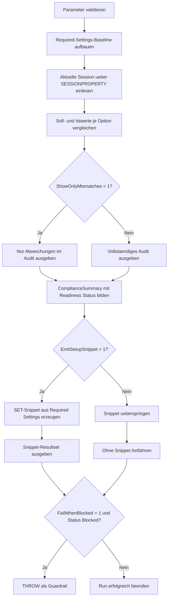

# IndexedViewRequiredSettingsCheck.sql

Dieses Skript prueft die aktuelle Session auf die fuer indexed views relevanten SET-Optionen und liefert eine klare Freigabeempfehlung fuer die naechste DDL-Batch.

## Uebersicht

<!-- SQLDOC:SUMMARY_TABLE:BEGIN -->
| Feld | Wert |
|---|---|
| Script | [IndexedViewRequiredSettingsCheck.sql](IndexedViewRequiredSettingsCheck.sql) |
| Version | `1.0` |
| Typ | `diagnostic-query` |
| Kapitel | `21_QUOTED_IDENTIFIER` |
| Sicherheit | `read-only` |
| Zweck | Prueft die aktuelle Session gegen die Required-Settings-Baseline fuer indexed views. |
<!-- SQLDOC:SUMMARY_TABLE:END -->

## Einordnung

Bei indexed views ist nicht nur die View-Definition wichtig, sondern auch die Session-Konfiguration, in der `SCHEMABINDING` und der Index-Aufbau stattfinden. Das Skript konzentriert sich deshalb bewusst auf den Required-Settings-Check der aktuellen Session und trennt Detailaudit, Summary und Setup-Snippet in drei Resultsets.

## Annahmen

- Die Baseline ist didaktisch konservativ und bildet uebliche SQL-Server-Voraussetzungen fuer indexed views ab.
- Geprueft wird nur die aktuelle Session `@@SPID`, weil genau diese Session spaeter die DDL-Batch ausfuehren soll.
- Das optionale Setup-Snippet gibt nur `SET`-Anweisungen aus und fuehrt keine View- oder Index-DDL automatisch aus.
- `QUOTED_IDENTIFIER` wird als High-Risk-Option behandelt, weil der Schalter fuer indexed views zentral ist und den Kapitelkontext traegt.

## Anwendungsfall

Das Skript eignet sich als Vorabpruefung vor `CREATE VIEW ... WITH SCHEMABINDING`, vor dem Anlegen eines eindeutigen Clustered Indexes auf einer View und fuer Trainings- oder Review-Szenarien, in denen Session-Defaults nachvollziehbar gemacht werden sollen.

## Parameter

<!-- SQLDOC:PARAMETERS_TABLE:BEGIN -->
| Parameter | SQL-Typ | Pflicht | Beschreibung |
|---|---|---|---|
| `@ShowOnlyMismatches` | `BIT` | Nein | Zeigt bei `1` nur abweichende Optionen im Detailreport. |
| `@FailWhenBlocked` | `BIT` | Nein | Loest bei `1` einen Fehler aus, wenn High-Risk-Abweichungen vorliegen. |
| `@EmitSetupSnippet` | `BIT` | Nein | Gibt bei `1` ein kompaktes `SET`-Snippet fuer die naechste DDL-Batch aus. |
<!-- SQLDOC:PARAMETERS_TABLE:END -->

## Abhaengigkeiten

<!-- SQLDOC:DEPENDENCIES_LIST:BEGIN -->
- `SESSIONPROPERTY`
- `@@SPID`
- `SET QUOTED_IDENTIFIER`
- Session-Anforderungen fuer indexed views
<!-- SQLDOC:DEPENDENCIES_LIST:END -->

## Hinweise

- Das erste Resultset zeigt Sollwert, Istwert, Risiko, erforderliches `SET` und einen kurzen Konsequenzhinweis pro Option.
- Das zweite Resultset verdichtet die Session zu `Ready`, `NeedsReview` oder `Blocked`.
- Das dritte Resultset ist optional und liefert nur das noetige `SET`-Snippet fuer die naechste indexed-view-DDL.

## Versionshistorie

<!-- SQLDOC:VERSION_HISTORY_TABLE:BEGIN -->
| Version | Datum | User | Beschreibung |
|---|---|---|---|
| `1.0` | `2026-04-22` | `ER` | Erstversion des Required-Settings-Checks fuer indexed views |
<!-- SQLDOC:VERSION_HISTORY_TABLE:END -->

## Ablauf

<!-- SQLDOC:MERMAID:BEGIN -->

<!-- SQLDOC:MERMAID:END -->

## SQL-Code

<!-- SQLDOC:SQL_CODE:BEGIN -->
```sql
/*
BEGIN:SQL-HEADER v1
---
sql_header: v1
script_name: "IndexedViewRequiredSettingsCheck.sql"
script_version: "1.0"
script_type: "diagnostic-query"
chapter: "21_QUOTED_IDENTIFIER"

purpose: >
  Prueft die aktuelle Session auf die fuer indexed views relevanten
  SET-Optionen, bewertet Abweichungen nach Risiko und liefert ein kompaktes
  Remediation-Set sowie eine Freigabeempfehlung fuer die naechste DDL-Batch.

parameters:
  - name: "@ShowOnlyMismatches"
    sql_type: "BIT"
    direction: "IN"
    required: false
    description: "1 = nur abweichende Optionen im Detailreport ausgeben"
  - name: "@FailWhenBlocked"
    sql_type: "BIT"
    direction: "IN"
    required: false
    description: "1 = Fehler ausloesen, wenn High-Risk-Abweichungen vorliegen"
  - name: "@EmitSetupSnippet"
    sql_type: "BIT"
    direction: "IN"
    required: false
    description: "1 = SET-Snippet fuer die naechste Indexed-View-DDL ausgeben"

result_sets:
  - name: "IndexedViewSettingAudit"
    description: "Soll-Ist-Vergleich der fuer indexed views benoetigten Session-Optionen"
  - name: "IndexedViewComplianceSummary"
    description: "Verdichtete Bewertung mit Freigabeempfehlung fuer die Session"
  - name: "IndexedViewSetupSnippet"
    description: "Kompaktes Remediation-Set fuer eine kompatible Indexed-View-DDL-Session"

dependencies:
  - "SESSIONPROPERTY"
  - "@@SPID"
  - "SET QUOTED_IDENTIFIER"
  - "indexed view session requirements"

safety:
  level: "read-only"
  writes_data: false

documentation:
  markdown_file: "T-SQL/21_QUOTED_IDENTIFIER/SQLScripts/IndexedViewRequiredSettingsCheck.md"
  sync_blocks:
    - "SUMMARY_TABLE"
    - "PARAMETERS_TABLE"
    - "DEPENDENCIES_LIST"
    - "VERSION_HISTORY_TABLE"
    - "SQL_CODE"
  mermaid:
    mode: "ai-agent-from-sql"
    source: "script-body"

main_responsible:
  name: "Erhard Rainer"
  initials: "ER"

version_history:
  - version: "1.0"
    date: "2026-04-22"
    user: "ER"
    description: "Erstversion des Required-Settings-Checks fuer indexed views"

notes:
  - "Das Skript prueft nur die aktuelle Session und fuehrt keine DDL oder persistente Datenoperationen aus."
  - "Die Baseline ist didaktisch konservativ und orientiert sich an ueblichen SQL-Server-Voraussetzungen fuer indexed views."
---
END:SQL-HEADER v1
*/

SET NOCOUNT ON;

DECLARE @ShowOnlyMismatches BIT = 0;
DECLARE @FailWhenBlocked BIT = 0;
DECLARE @EmitSetupSnippet BIT = 1;

IF @ShowOnlyMismatches NOT IN (0, 1)
BEGIN
    THROW 50000, '@ShowOnlyMismatches muss 0 oder 1 sein.', 1;
END;

IF @FailWhenBlocked NOT IN (0, 1)
BEGIN
    THROW 50001, '@FailWhenBlocked muss 0 oder 1 sein.', 1;
END;

IF @EmitSetupSnippet NOT IN (0, 1)
BEGIN
    THROW 50002, '@EmitSetupSnippet muss 0 oder 1 sein.', 1;
END;

DROP TABLE IF EXISTS #RequiredSettings;
DROP TABLE IF EXISTS #CurrentSessionSettings;
DROP TABLE IF EXISTS #IndexedViewSettingAudit;
DROP TABLE IF EXISTS #IndexedViewComplianceSummary;
DROP TABLE IF EXISTS #IndexedViewSetupSnippet;

CREATE TABLE #RequiredSettings
(
    StepNumber         INT            NOT NULL,
    OptionName         VARCHAR(40)    NOT NULL,
    ExpectedValue      BIT            NOT NULL,
    RiskLevel          VARCHAR(10)    NOT NULL,
    RequiredSet        VARCHAR(40)    NOT NULL,
    WhyItMatters       VARCHAR(260)   NOT NULL,
    ConsequenceHint    VARCHAR(220)   NOT NULL
);

INSERT INTO #RequiredSettings
(
    StepNumber,
    OptionName,
    ExpectedValue,
    RiskLevel,
    RequiredSet,
    WhyItMatters,
    ConsequenceHint
)
VALUES
    (1, 'ANSI_NULLS', 1, 'High', 'SET ANSI_NULLS ON;', 'Wird fuer indexed-view-DDL und schemagebundene Definitionen erwartet.', 'CREATE VIEW oder CREATE INDEX koennen mit unpassender Session-Konfiguration scheitern.'),
    (2, 'ANSI_PADDING', 1, 'Medium', 'SET ANSI_PADDING ON;', 'Haelt Zeichen- und Binaerverhalten fuer indexierte View-Definitionen stabil.', 'Metadaten und Ausdrucksverhalten koennen von der Baseline abweichen.'),
    (3, 'ANSI_WARNINGS', 1, 'High', 'SET ANSI_WARNINGS ON;', 'Ist Teil der konservativen Session-Baseline fuer indexed views.', 'DDL und nachfolgende Zugriffe koennen nicht kompatibel sein.'),
    (4, 'ARITHABORT', 1, 'High', 'SET ARITHABORT ON;', 'Wird fuer indexed views und abhaengige Abfragen typischerweise vorausgesetzt.', 'Indexbezogene DDL und Nutzungsmuster koennen blockiert werden.'),
    (5, 'CONCAT_NULL_YIELDS_NULL', 1, 'Medium', 'SET CONCAT_NULL_YIELDS_NULL ON;', 'Sichert konsistentes Ausdrucksverhalten in schemagebundenen Objekten.', 'Ausdruecke koennen sich anders verhalten als fuer indexed views erwartet.'),
    (6, 'QUOTED_IDENTIFIER', 1, 'High', 'SET QUOTED_IDENTIFIER ON;', 'Ist fuer indexed views zentral und Schwerpunkt dieses Kapitels.', 'Indexed-view-DDL wird mit hoher Wahrscheinlichkeit nicht freigegeben.'),
    (7, 'NUMERIC_ROUNDABORT', 0, 'Medium', 'SET NUMERIC_ROUNDABORT OFF;', 'Soll deaktiviert sein, damit die Session fuer indexed-view-DDL kompatibel bleibt.', 'Die Session weicht von der empfohlenen Build-Baseline ab.');

CREATE TABLE #CurrentSessionSettings
(
    session_id                 INT           NOT NULL,
    ansi_nulls                 BIT           NOT NULL,
    ansi_padding               BIT           NOT NULL,
    ansi_warnings              BIT           NOT NULL,
    arithabort                 BIT           NOT NULL,
    concat_null_yields_null    BIT           NOT NULL,
    quoted_identifier          BIT           NOT NULL,
    numeric_roundabort         BIT           NOT NULL
);

INSERT INTO #CurrentSessionSettings
(
    session_id,
    ansi_nulls,
    ansi_padding,
    ansi_warnings,
    arithabort,
    concat_null_yields_null,
    quoted_identifier,
    numeric_roundabort
)
SELECT
    @@SPID,
    CONVERT(BIT, SESSIONPROPERTY('ANSI_NULLS')),
    CONVERT(BIT, SESSIONPROPERTY('ANSI_PADDING')),
    CONVERT(BIT, SESSIONPROPERTY('ANSI_WARNINGS')),
    CONVERT(BIT, SESSIONPROPERTY('ARITHABORT')),
    CONVERT(BIT, SESSIONPROPERTY('CONCAT_NULL_YIELDS_NULL')),
    CONVERT(BIT, SESSIONPROPERTY('QUOTED_IDENTIFIER')),
    CONVERT(BIT, SESSIONPROPERTY('NUMERIC_ROUNDABORT'));

CREATE TABLE #IndexedViewSettingAudit
(
    session_id          INT            NOT NULL,
    OptionName          VARCHAR(40)    NOT NULL,
    ExpectedValue       VARCHAR(3)     NOT NULL,
    ActualValue         VARCHAR(3)     NOT NULL,
    AuditStatus         VARCHAR(12)    NOT NULL,
    RiskLevel           VARCHAR(10)    NOT NULL,
    RequiredSet         VARCHAR(40)    NOT NULL,
    WhyItMatters        VARCHAR(260)   NOT NULL,
    ConsequenceHint     VARCHAR(220)   NOT NULL
);

INSERT INTO #IndexedViewSettingAudit
(
    session_id,
    OptionName,
    ExpectedValue,
    ActualValue,
    AuditStatus,
    RiskLevel,
    RequiredSet,
    WhyItMatters,
    ConsequenceHint
)
SELECT
    css.session_id,
    rs.OptionName,
    CASE rs.ExpectedValue
        WHEN 1 THEN 'ON'
        ELSE 'OFF'
    END AS ExpectedValue,
    CASE ca.ActualValue
        WHEN 1 THEN 'ON'
        ELSE 'OFF'
    END AS ActualValue,
    CASE
        WHEN ca.ActualValue = rs.ExpectedValue THEN 'OK'
        ELSE 'Mismatch'
    END AS AuditStatus,
    CASE
        WHEN ca.ActualValue = rs.ExpectedValue THEN 'Info'
        ELSE rs.RiskLevel
    END AS RiskLevel,
    rs.RequiredSet,
    rs.WhyItMatters,
    rs.ConsequenceHint
FROM #CurrentSessionSettings AS css
CROSS JOIN #RequiredSettings AS rs
CROSS APPLY
(
    SELECT
        CASE rs.OptionName
            WHEN 'ANSI_NULLS' THEN css.ansi_nulls
            WHEN 'ANSI_PADDING' THEN css.ansi_padding
            WHEN 'ANSI_WARNINGS' THEN css.ansi_warnings
            WHEN 'ARITHABORT' THEN css.arithabort
            WHEN 'CONCAT_NULL_YIELDS_NULL' THEN css.concat_null_yields_null
            WHEN 'QUOTED_IDENTIFIER' THEN css.quoted_identifier
            WHEN 'NUMERIC_ROUNDABORT' THEN css.numeric_roundabort
        END AS ActualValue
) AS ca;

SELECT
    iva.session_id,
    iva.OptionName,
    iva.ExpectedValue,
    iva.ActualValue,
    iva.AuditStatus,
    iva.RiskLevel,
    iva.RequiredSet,
    iva.WhyItMatters,
    iva.ConsequenceHint
FROM #IndexedViewSettingAudit AS iva
WHERE @ShowOnlyMismatches = 0
   OR iva.AuditStatus = 'Mismatch'
ORDER BY
    CASE iva.RiskLevel
        WHEN 'High' THEN 1
        WHEN 'Medium' THEN 2
        ELSE 3
    END,
    iva.OptionName;

CREATE TABLE #IndexedViewComplianceSummary
(
    session_id              INT            NOT NULL,
    checked_setting_count   INT            NOT NULL,
    mismatch_count          INT            NOT NULL,
    high_risk_count         INT            NOT NULL,
    readiness_status        VARCHAR(20)    NOT NULL,
    release_recommendation  VARCHAR(260)   NOT NULL
);

INSERT INTO #IndexedViewComplianceSummary
(
    session_id,
    checked_setting_count,
    mismatch_count,
    high_risk_count,
    readiness_status,
    release_recommendation
)
SELECT
    css.session_id,
    COUNT(*) AS checked_setting_count,
    SUM(CASE WHEN iva.AuditStatus = 'Mismatch' THEN 1 ELSE 0 END) AS mismatch_count,
    SUM(CASE WHEN iva.AuditStatus = 'Mismatch' AND iva.RiskLevel = 'High' THEN 1 ELSE 0 END) AS high_risk_count,
    CASE
        WHEN SUM(CASE WHEN iva.AuditStatus = 'Mismatch' THEN 1 ELSE 0 END) = 0 THEN 'Ready'
        WHEN SUM(CASE WHEN iva.AuditStatus = 'Mismatch' AND iva.RiskLevel = 'High' THEN 1 ELSE 0 END) > 0 THEN 'Blocked'
        ELSE 'NeedsReview'
    END AS readiness_status,
    CASE
        WHEN SUM(CASE WHEN iva.AuditStatus = 'Mismatch' THEN 1 ELSE 0 END) = 0 THEN 'Session kann fuer die naechste indexed-view-DDL direkt verwendet werden.'
        WHEN SUM(CASE WHEN iva.AuditStatus = 'Mismatch' AND iva.RiskLevel = 'High' THEN 1 ELSE 0 END) > 0 THEN 'Vor CREATE VIEW WITH SCHEMABINDING oder CREATE INDEX zuerst die High-Risk-SET-Optionen angleichen.'
        ELSE 'Session ist fast kompatibel; Medium-Risk-Abweichungen vor dem Build noch angleichen.'
    END AS release_recommendation
FROM #CurrentSessionSettings AS css
INNER JOIN #IndexedViewSettingAudit AS iva
    ON css.session_id = iva.session_id
GROUP BY
    css.session_id;

SELECT
    ivcs.session_id,
    ivcs.checked_setting_count,
    ivcs.mismatch_count,
    ivcs.high_risk_count,
    ivcs.readiness_status,
    ivcs.release_recommendation
FROM #IndexedViewComplianceSummary AS ivcs;

CREATE TABLE #IndexedViewSetupSnippet
(
    ItemType         VARCHAR(30)    NOT NULL,
    ItemName         VARCHAR(80)    NOT NULL,
    ItemSql          NVARCHAR(MAX)  NOT NULL,
    UsageHint        VARCHAR(260)   NOT NULL
);

IF @EmitSetupSnippet = 1
BEGIN
    INSERT INTO #IndexedViewSetupSnippet
    (
        ItemType,
        ItemName,
        ItemSql,
        UsageHint
    )
    SELECT
        'SetupSnippet',
        'IndexedViewRequiredSessionSettings',
        STRING_AGG(rs.RequiredSet, CHAR(13) + CHAR(10)) WITHIN GROUP (ORDER BY rs.StepNumber),
        'Vor CREATE VIEW WITH SCHEMABINDING und CREATE UNIQUE CLUSTERED INDEX in derselben Session ausfuehren.'
    FROM #RequiredSettings AS rs;
END;

SELECT
    ivss.ItemType,
    ivss.ItemName,
    ivss.ItemSql,
    ivss.UsageHint
FROM #IndexedViewSetupSnippet AS ivss
ORDER BY
    ivss.ItemName;

IF @FailWhenBlocked = 1
   AND EXISTS
   (
       SELECT
           1
       FROM #IndexedViewComplianceSummary AS ivcs
       WHERE ivcs.readiness_status = 'Blocked'
   )
BEGIN
    THROW 50003, 'Die aktuelle Session erfuellt die High-Risk-Anforderungen fuer indexed views nicht.', 1;
END;
```
<!-- SQLDOC:SQL_CODE:END -->


