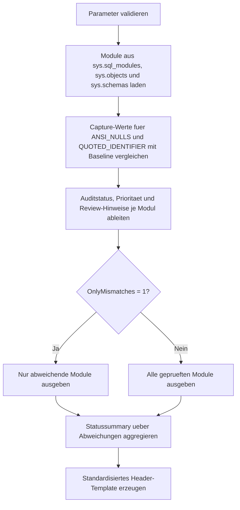

# ModuleHeaderConsistencyAudit.sql

Dieses Skript bewertet vorhandene SQL-Module gegen eine standardisierte Header-Baseline fuer `ANSI_NULLS` und `QUOTED_IDENTIFIER`. Die Umsetzung bleibt rein lesend, nutzt `sys.sql_modules` als technische Quelle und erzeugt zusaetzlich ein Header-Template fuer Review- oder Re-Deployment-Schritte.

## Uebersicht

<!-- SQLDOC:SUMMARY_TABLE:BEGIN -->
| Feld | Wert |
|---|---|
| Script | [ModuleHeaderConsistencyAudit.sql](ModuleHeaderConsistencyAudit.sql) |
| Version | `1.0` |
| Typ | `diagnostic-query` |
| Kapitel | `21_QUOTED_IDENTIFIER` |
| Sicherheit | `read-only` |
| Zweck | Auditiert Modul-Capture-Werte gegen eine standardisierte Header-Baseline. |
<!-- SQLDOC:SUMMARY_TABLE:END -->

## Einordnung

Bei SQL-Modulen werden `ANSI_NULLS` und `QUOTED_IDENTIFIER` zum Zeitpunkt von `CREATE` oder `ALTER` in den Modulmetadaten gespeichert. Ein Review von Modul-Headern ist deshalb oft indirekt: Das Skript vergleicht die gespeicherten Capture-Werte mit einer erwarteten Baseline und markiert Module, deren naechster Deployment-Header bewusst ueberprueft oder vereinheitlicht werden sollte.

## Annahmen

- Die fachliche Konsistenz von Modul-Headern wird in dieser Erstversion ueber die in `sys.sql_modules` gespeicherten Capture-Werte modelliert.
- Eine standardisierte Baseline mit `ANSI_NULLS ON` und `QUOTED_IDENTIFIER ON` ist der Default fuer viele moderne Deployment-Muster und daher der voreingestellte Vergleich.
- Verschluesselte Module koennen inhaltlich nicht vollstaendig inspiziert werden; ihre Capture-Werte bleiben aber fuer das Audit verwertbar.
- Das Header-Template ist eine Review- und Deployment-Hilfe und fuehrt selbst keine Neuerstellung von Modulen aus.

## Anwendungsfall

Das Skript eignet sich fuer Bestandsaufnahmen in gewachsenen Datenbanken, fuer Deployment-Hygiene in Trainingsumgebungen und fuer Refactoring-Vorhaben, bei denen Modulskripte auf ein einheitliches Header-Muster gebracht werden sollen. Besonders im Kapitelkontext `QUOTED_IDENTIFIER` hilft es dabei, problematische Altstaende schnell vorzusortieren.

## Parameter

<!-- SQLDOC:PARAMETERS_TABLE:BEGIN -->
| Parameter | SQL-Typ | Pflicht | Beschreibung |
|---|---|---|---|
| `@ExpectedAnsiNulls` | `BIT` | Nein | Definiert den erwarteten Modul-Capture fuer `ANSI_NULLS`. |
| `@ExpectedQuotedIdentifier` | `BIT` | Nein | Definiert den erwarteten Modul-Capture fuer `QUOTED_IDENTIFIER`. |
| `@OnlyMismatches` | `BIT` | Nein | Zeigt bei `1` nur Module mit Abweichung gegen die Baseline. |
| `@IncludeEncryptedModules` | `BIT` | Nein | Bezieht bei `1` auch verschluesselte Module in das Audit ein. |
<!-- SQLDOC:PARAMETERS_TABLE:END -->

## Abhaengigkeiten

<!-- SQLDOC:DEPENDENCIES_LIST:BEGIN -->
- `sys.sql_modules`
- `sys.objects`
- `sys.schemas`
- `OBJECTPROPERTYEX`
- `SET ANSI_NULLS`
- `SET QUOTED_IDENTIFIER`
<!-- SQLDOC:DEPENDENCIES_LIST:END -->

## Hinweise

- Das Detailresultset priorisiert Abweichungen bei `QUOTED_IDENTIFIER`, weil diese im Kapitelkontext besonders relevant sind.
- Die Summary aggregiert die Abweichungen nach Status und macht sichtbar, ob eher `ANSI_NULLS`, `QUOTED_IDENTIFIER` oder beide Captures abweichen.
- Das Header-Template kann als Ausgangspunkt fuer `CREATE OR ALTER`-Skripte oder Deployment-Runbooks verwendet werden.

## Versionshistorie

<!-- SQLDOC:VERSION_HISTORY_TABLE:BEGIN -->
| Version | Datum | User | Beschreibung |
|---|---|---|---|
| `1.0` | `2026-04-22` | `ER` | Erstversion des Audits fuer Modul-Header-Konsistenz |
<!-- SQLDOC:VERSION_HISTORY_TABLE:END -->

## Ablauf

<!-- SQLDOC:MERMAID:BEGIN -->

<!-- SQLDOC:MERMAID:END -->

## SQL-Code

<!-- SQLDOC:SQL_CODE:BEGIN -->
```sql
/*
BEGIN:SQL-HEADER v1
---
sql_header: v1
script_name: "ModuleHeaderConsistencyAudit.sql"
script_version: "1.0"
script_type: "diagnostic-query"
chapter: "21_QUOTED_IDENTIFIER"

purpose: >
  Prueft vorhandene SQL-Module auf Konsistenz zu einer standardisierten
  Header-Baseline fuer ANSI_NULLS und QUOTED_IDENTIFIER. Das Skript liest
  Metadaten aus dem Katalog, bewertet Abweichungen gegen erwartete
  Session-Captures und erzeugt eine kompakte Header-Vorlage fuer Reviews
  oder Re-Deployments.

parameters:
  - name: "@ExpectedAnsiNulls"
    sql_type: "BIT"
    direction: "IN"
    required: false
    description: "Erwarteter Capture-Wert fuer ANSI_NULLS im Modul"
  - name: "@ExpectedQuotedIdentifier"
    sql_type: "BIT"
    direction: "IN"
    required: false
    description: "Erwarteter Capture-Wert fuer QUOTED_IDENTIFIER im Modul"
  - name: "@OnlyMismatches"
    sql_type: "BIT"
    direction: "IN"
    required: false
    description: "1 = nur Module mit Abweichung gegen die Baseline ausgeben"
  - name: "@IncludeEncryptedModules"
    sql_type: "BIT"
    direction: "IN"
    required: false
    description: "1 = verschluesselte Module in die Audit-Sicht einbeziehen"

result_sets:
  - name: "ModuleHeaderConsistencyAudit"
    description: "Detailsicht auf Module mit aktueller Header-Bewertung und Review-Hinweisen"
  - name: "ConsistencySummary"
    description: "Verdichtete Uebersicht ueber den Konsistenzstatus der geprueften Module"
  - name: "HeaderTemplate"
    description: "Standardisierte Header-Vorlage fuer CREATE OR ALTER von Modulen"

dependencies:
  - "sys.sql_modules"
  - "sys.objects"
  - "sys.schemas"
  - "OBJECTPROPERTYEX"
  - "SET ANSI_NULLS"
  - "SET QUOTED_IDENTIFIER"

safety:
  level: "read-only"
  writes_data: false

documentation:
  markdown_file: "T-SQL/21_QUOTED_IDENTIFIER/SQLScripts/ModuleHeaderConsistencyAudit.md"
  sync_blocks:
    - "SUMMARY_TABLE"
    - "PARAMETERS_TABLE"
    - "DEPENDENCIES_LIST"
    - "VERSION_HISTORY_TABLE"
    - "SQL_CODE"
  mermaid:
    mode: "ai-agent-from-sql"
    source: "script-body"

main_responsible:
  name: "Erhard Rainer"
  initials: "ER"

version_history:
  - version: "1.0"
    date: "2026-04-22"
    user: "ER"
    description: "Erstversion des Audits fuer Modul-Header-Konsistenz"

notes:
  - "Die Baseline wird ueber erwartete Modul-Capture-Werte fuer ANSI_NULLS und QUOTED_IDENTIFIER modelliert."
  - "Das Skript liest nur Katalogmetadaten und erzeugt ein Re-Deployment-Template als Resultset."
---
END:SQL-HEADER v1
*/

SET NOCOUNT ON;

DECLARE @ExpectedAnsiNulls BIT = 1;
DECLARE @ExpectedQuotedIdentifier BIT = 1;
DECLARE @OnlyMismatches BIT = 1;
DECLARE @IncludeEncryptedModules BIT = 1;

IF @ExpectedAnsiNulls NOT IN (0, 1)
BEGIN
    THROW 50000, '@ExpectedAnsiNulls muss 0 oder 1 sein.', 1;
END;

IF @ExpectedQuotedIdentifier NOT IN (0, 1)
BEGIN
    THROW 50001, '@ExpectedQuotedIdentifier muss 0 oder 1 sein.', 1;
END;

IF @OnlyMismatches NOT IN (0, 1)
BEGIN
    THROW 50002, '@OnlyMismatches muss 0 oder 1 sein.', 1;
END;

IF @IncludeEncryptedModules NOT IN (0, 1)
BEGIN
    THROW 50003, '@IncludeEncryptedModules muss 0 oder 1 sein.', 1;
END;

DROP TABLE IF EXISTS #ModuleInventory;
DROP TABLE IF EXISTS #ModuleHeaderAudit;
DROP TABLE IF EXISTS #ConsistencySummary;
DROP TABLE IF EXISTS #HeaderTemplate;

CREATE TABLE #ModuleInventory
(
    object_id               INT            NOT NULL,
    schema_name             SYSNAME        NOT NULL,
    module_name             SYSNAME        NOT NULL,
    module_type             NVARCHAR(60)   NOT NULL,
    create_date             DATETIME       NOT NULL,
    modify_date             DATETIME       NOT NULL,
    uses_ansi_nulls         BIT            NOT NULL,
    uses_quoted_identifier  BIT            NOT NULL,
    is_schema_bound         BIT            NOT NULL,
    is_encrypted            BIT            NOT NULL,
    definition_preview      NVARCHAR(200)  NULL
);

INSERT INTO #ModuleInventory
(
    object_id,
    schema_name,
    module_name,
    module_type,
    create_date,
    modify_date,
    uses_ansi_nulls,
    uses_quoted_identifier,
    is_schema_bound,
    is_encrypted,
    definition_preview
)
SELECT
    o.object_id,
    s.name AS schema_name,
    o.name AS module_name,
    o.type_desc AS module_type,
    o.create_date,
    o.modify_date,
    sm.uses_ansi_nulls,
    sm.uses_quoted_identifier,
    CONVERT(BIT, OBJECTPROPERTYEX(o.object_id, 'IsSchemaBound')) AS is_schema_bound,
    sm.is_encrypted,
    CASE
        WHEN sm.is_encrypted = 1 THEN NULL
        ELSE LEFT(REPLACE(REPLACE(sm.definition, CHAR(13), ' '), CHAR(10), ' '), 200)
    END AS definition_preview
FROM sys.sql_modules AS sm
INNER JOIN sys.objects AS o
    ON sm.object_id = o.object_id
INNER JOIN sys.schemas AS s
    ON o.schema_id = s.schema_id
WHERE o.type IN ('P', 'V', 'FN', 'IF', 'TF', 'TR')
  AND (@IncludeEncryptedModules = 1 OR sm.is_encrypted = 0);

CREATE TABLE #ModuleHeaderAudit
(
    object_id                    INT            NOT NULL,
    module_qualified_name        NVARCHAR(517)  NOT NULL,
    module_type                  NVARCHAR(60)   NOT NULL,
    create_date                  DATETIME       NOT NULL,
    modify_date                  DATETIME       NOT NULL,
    uses_ansi_nulls              VARCHAR(3)     NOT NULL,
    uses_quoted_identifier       VARCHAR(3)     NOT NULL,
    expected_ansi_nulls          VARCHAR(3)     NOT NULL,
    expected_quoted_identifier   VARCHAR(3)     NOT NULL,
    header_consistency_status    VARCHAR(20)    NOT NULL,
    review_priority              VARCHAR(10)    NOT NULL,
    review_reason                VARCHAR(260)   NOT NULL,
    recommended_header_block     NVARCHAR(260)  NOT NULL,
    definition_preview           NVARCHAR(200)  NULL
);

INSERT INTO #ModuleHeaderAudit
(
    object_id,
    module_qualified_name,
    module_type,
    create_date,
    modify_date,
    uses_ansi_nulls,
    uses_quoted_identifier,
    expected_ansi_nulls,
    expected_quoted_identifier,
    header_consistency_status,
    review_priority,
    review_reason,
    recommended_header_block,
    definition_preview
)
SELECT
    mi.object_id,
    QUOTENAME(mi.schema_name) + N'.' + QUOTENAME(mi.module_name) AS module_qualified_name,
    mi.module_type,
    mi.create_date,
    mi.modify_date,
    CASE mi.uses_ansi_nulls
        WHEN 1 THEN 'ON'
        ELSE 'OFF'
    END AS uses_ansi_nulls,
    CASE mi.uses_quoted_identifier
        WHEN 1 THEN 'ON'
        ELSE 'OFF'
    END AS uses_quoted_identifier,
    CASE @ExpectedAnsiNulls
        WHEN 1 THEN 'ON'
        ELSE 'OFF'
    END AS expected_ansi_nulls,
    CASE @ExpectedQuotedIdentifier
        WHEN 1 THEN 'ON'
        ELSE 'OFF'
    END AS expected_quoted_identifier,
    CASE
        WHEN mi.uses_ansi_nulls = @ExpectedAnsiNulls
         AND mi.uses_quoted_identifier = @ExpectedQuotedIdentifier THEN 'Aligned'
        WHEN mi.uses_quoted_identifier <> @ExpectedQuotedIdentifier
         AND mi.uses_ansi_nulls <> @ExpectedAnsiNulls THEN 'BothMismatch'
        WHEN mi.uses_quoted_identifier <> @ExpectedQuotedIdentifier THEN 'QuotedMismatch'
        WHEN mi.uses_ansi_nulls <> @ExpectedAnsiNulls THEN 'AnsiMismatch'
        ELSE 'ReviewNeeded'
    END AS header_consistency_status,
    CASE
        WHEN mi.uses_quoted_identifier <> @ExpectedQuotedIdentifier THEN 'High'
        WHEN mi.uses_ansi_nulls <> @ExpectedAnsiNulls THEN 'Medium'
        ELSE 'Info'
    END AS review_priority,
    CASE
        WHEN mi.uses_quoted_identifier <> @ExpectedQuotedIdentifier
         AND mi.uses_ansi_nulls <> @ExpectedAnsiNulls THEN 'ANSI_NULLS und QUOTED_IDENTIFIER weichen beide von der Header-Baseline ab.'
        WHEN mi.uses_quoted_identifier <> @ExpectedQuotedIdentifier THEN 'QUOTED_IDENTIFIER weicht von der erwarteten Header-Baseline ab.'
        WHEN mi.uses_ansi_nulls <> @ExpectedAnsiNulls THEN 'ANSI_NULLS weicht von der erwarteten Header-Baseline ab.'
        WHEN mi.is_encrypted = 1 THEN 'Modul ist verschluesselt, bleibt aber laut Capture-Werten mit der Baseline ausgerichtet.'
        WHEN mi.is_schema_bound = 1 THEN 'Schema-gebundenes Modul ist mit der Baseline ausgerichtet.'
        ELSE 'Capture-Werte stimmen mit der Header-Baseline ueberein.'
    END AS review_reason,
    CASE @ExpectedAnsiNulls
        WHEN 1 THEN 'SET ANSI_NULLS ON;'
        ELSE 'SET ANSI_NULLS OFF;'
    END
    + CHAR(13) + CHAR(10)
    + CASE @ExpectedQuotedIdentifier
        WHEN 1 THEN 'SET QUOTED_IDENTIFIER ON;'
        ELSE 'SET QUOTED_IDENTIFIER OFF;'
      END AS recommended_header_block,
    mi.definition_preview
FROM #ModuleInventory AS mi;

SELECT
    mha.module_qualified_name,
    mha.module_type,
    mha.create_date,
    mha.modify_date,
    mha.uses_ansi_nulls,
    mha.uses_quoted_identifier,
    mha.expected_ansi_nulls,
    mha.expected_quoted_identifier,
    mha.header_consistency_status,
    mha.review_priority,
    mha.review_reason,
    mha.recommended_header_block,
    mha.definition_preview
FROM #ModuleHeaderAudit AS mha
WHERE @OnlyMismatches = 0
   OR mha.header_consistency_status <> 'Aligned'
ORDER BY
    CASE mha.review_priority
        WHEN 'High' THEN 1
        WHEN 'Medium' THEN 2
        ELSE 3
    END,
    mha.modify_date,
    mha.module_qualified_name;

CREATE TABLE #ConsistencySummary
(
    header_consistency_status  VARCHAR(20)   NOT NULL,
    module_count               INT           NOT NULL,
    quoted_mismatch_count      INT           NOT NULL,
    ansi_mismatch_count        INT           NOT NULL,
    encrypted_module_count     INT           NOT NULL,
    summary_note               VARCHAR(260)  NOT NULL
);

INSERT INTO #ConsistencySummary
(
    header_consistency_status,
    module_count,
    quoted_mismatch_count,
    ansi_mismatch_count,
    encrypted_module_count,
    summary_note
)
SELECT
    mha.header_consistency_status,
    COUNT(*) AS module_count,
    SUM(CASE WHEN mha.uses_quoted_identifier <> mha.expected_quoted_identifier THEN 1 ELSE 0 END) AS quoted_mismatch_count,
    SUM(CASE WHEN mha.uses_ansi_nulls <> mha.expected_ansi_nulls THEN 1 ELSE 0 END) AS ansi_mismatch_count,
    SUM(CASE WHEN mi.is_encrypted = 1 THEN 1 ELSE 0 END) AS encrypted_module_count,
    CASE mha.header_consistency_status
        WHEN 'BothMismatch' THEN 'Diese Module weichen bei beiden Header-Captures ab und sollten mit einer konsistenten Baseline neu deployt werden.'
        WHEN 'QuotedMismatch' THEN 'Diese Module sollten mit standardisiertem QUOTED_IDENTIFIER-Header neu bewertet oder neu deployt werden.'
        WHEN 'AnsiMismatch' THEN 'Diese Module weichen bei ANSI_NULLS von der Baseline ab und sollten im Deployment-Skript geprueft werden.'
        ELSE 'Diese Module folgen der gewaehlten Header-Baseline.'
    END AS summary_note
FROM #ModuleHeaderAudit AS mha
INNER JOIN #ModuleInventory AS mi
    ON mha.object_id = mi.object_id
WHERE @OnlyMismatches = 0
   OR mha.header_consistency_status <> 'Aligned'
GROUP BY
    mha.header_consistency_status;

SELECT
    cs.header_consistency_status,
    cs.module_count,
    cs.quoted_mismatch_count,
    cs.ansi_mismatch_count,
    cs.encrypted_module_count,
    cs.summary_note
FROM #ConsistencySummary AS cs
ORDER BY
    CASE cs.header_consistency_status
        WHEN 'BothMismatch' THEN 1
        WHEN 'QuotedMismatch' THEN 2
        WHEN 'AnsiMismatch' THEN 3
        ELSE 4
    END;

CREATE TABLE #HeaderTemplate
(
    template_name     VARCHAR(60)    NOT NULL,
    template_sql      NVARCHAR(MAX)  NOT NULL,
    usage_hint        VARCHAR(260)   NOT NULL
);

INSERT INTO #HeaderTemplate
(
    template_name,
    template_sql,
    usage_hint
)
VALUES
(
    'StandardModuleHeaderTemplate',
    CASE @ExpectedAnsiNulls
        WHEN 1 THEN N'SET ANSI_NULLS ON;'
        ELSE N'SET ANSI_NULLS OFF;'
    END
    + CHAR(13) + CHAR(10)
    + CASE @ExpectedQuotedIdentifier
        WHEN 1 THEN N'SET QUOTED_IDENTIFIER ON;'
        ELSE N'SET QUOTED_IDENTIFIER OFF;'
      END
    + CHAR(13) + CHAR(10) + CHAR(13) + CHAR(10)
    + N'CREATE OR ALTER PROCEDURE dbo.SampleProcedure' + CHAR(13) + CHAR(10)
    + N'AS' + CHAR(13) + CHAR(10)
    + N'BEGIN' + CHAR(13) + CHAR(10)
    + N'    SET NOCOUNT ON;' + CHAR(13) + CHAR(10)
    + N'    SELECT ''Header baseline placeholder'' AS message;' + CHAR(13) + CHAR(10)
    + N'END;',
    'Als standardisierte Header-Vorlage fuer Review, Neuerstellung oder Deployment-Skripte verwenden.'
);

SELECT
    ht.template_name,
    ht.template_sql,
    ht.usage_hint
FROM #HeaderTemplate AS ht;
```
<!-- SQLDOC:SQL_CODE:END -->
