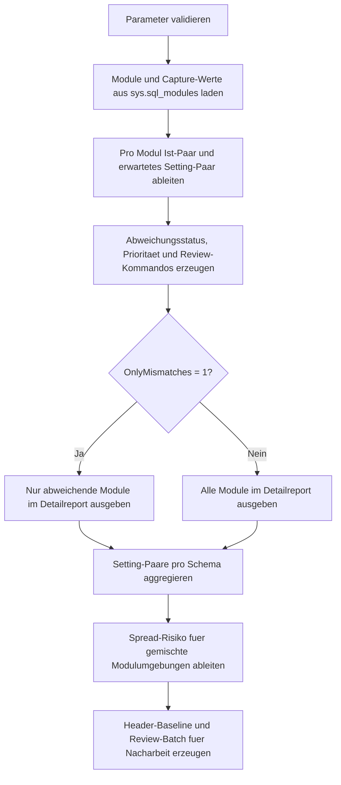

# ModuleOptionMismatchReport.sql

Dieses Diagnose-Skript erstellt einen Report ueber SQL-Module mit inkonsistenten Capture-Settings fuer `ANSI_NULLS` und `QUOTED_IDENTIFIER`. Der Fokus liegt auf einer rein lesenden Bestandsaufnahme, die Abweichungen je Modul sichtbar macht und gemischte Modulumgebungen pro Schema verdichtet.

## Uebersicht

<!-- SQLDOC:SUMMARY_TABLE:BEGIN -->
| Feld | Wert |
|---|---|
| Script | [ModuleOptionMismatchReport.sql](ModuleOptionMismatchReport.sql) |
| Version | `1.0` |
| Typ | `diagnostic-query` |
| Kapitel | `21_QUOTED_IDENTIFIER` |
| Sicherheit | `read-only` |
| Zweck | Report ueber Module mit Baseline-Abweichungen und gemischten Setting-Paaren. |
<!-- SQLDOC:SUMMARY_TABLE:END -->

## Einordnung

Im Kapitelkontext `QUOTED_IDENTIFIER` reicht es oft nicht, nur einzelne Problemobjekte zu finden. Interessant ist auch, ob ein Schema intern mit mehreren Setting-Kombinationen arbeitet. Das Skript kombiniert deshalb eine Detailsicht pro Modul mit einer Schema-Summary, damit inkonsistente Modulumgebungen schnell priorisiert werden koennen.

## Annahmen

- Die Zielumgebung wird in dieser Erstversion ueber eine erwartete Baseline fuer `ANSI_NULLS` und `QUOTED_IDENTIFIER` modelliert.
- Inkonsistenz bedeutet entweder eine konkrete Abweichung eines Moduls gegen diese Baseline oder mehrere unterschiedliche Setting-Paare innerhalb desselben Schemas.
- Das Skript bewertet nur die in `sys.sql_modules` gespeicherten Capture-Werte und aendert keine Moduldefinitionen.
- Das dritte Resultset liefert Review-Kommandos und eine Header-Baseline als Vorbereitung fuer manuelle `CREATE OR ALTER`-Schritte.

## Anwendungsfall

Das Skript eignet sich fuer Datenbank-Reviews, Modernisierungsprojekte und Trainingsumgebungen mit gewachsenen Modulbestaenden. Es ist besonders nuetzlich, wenn mehrere Deployment-Staende, Legacy-Header oder uneinheitliche Modul-Neuerstellungen zu gemischten Capture-Werten gefuehrt haben.

## Parameter

<!-- SQLDOC:PARAMETERS_TABLE:BEGIN -->
| Parameter | SQL-Typ | Pflicht | Beschreibung |
|---|---|---|---|
| `@ExpectedAnsiNulls` | `BIT` | Nein | Definiert den erwarteten Capture-Wert fuer `ANSI_NULLS`. |
| `@ExpectedQuotedIdentifier` | `BIT` | Nein | Definiert den erwarteten Capture-Wert fuer `QUOTED_IDENTIFIER`. |
| `@OnlyMismatches` | `BIT` | Nein | Zeigt bei `1` nur Module mit Abweichung gegen die Baseline. |
| `@IncludeEncryptedModules` | `BIT` | Nein | Bezieht bei `1` auch verschluesselte Module in die Report-Sicht ein. |
<!-- SQLDOC:PARAMETERS_TABLE:END -->

## Abhaengigkeiten

<!-- SQLDOC:DEPENDENCIES_LIST:BEGIN -->
- `sys.sql_modules`
- `sys.objects`
- `sys.schemas`
- `OBJECTPROPERTYEX`
- `SET ANSI_NULLS`
- `SET QUOTED_IDENTIFIER`
<!-- SQLDOC:DEPENDENCIES_LIST:END -->

## Hinweise

- Das erste Resultset priorisiert Module mit `QUOTED_IDENTIFIER`-Abweichung vor reinen `ANSI_NULLS`-Abweichungen.
- Das zweite Resultset zeigt, ob ein Schema intern mehrere Setting-Paare mischt oder nur geschlossen von der Baseline abweicht.
- Das dritte Resultset fuehrt keine Anpassung aus, sondern erzeugt nur eine Review-Hilfe fuer standardisierte Header.

## Versionshistorie

<!-- SQLDOC:VERSION_HISTORY_TABLE:BEGIN -->
| Version | Datum | User | Beschreibung |
|---|---|---|---|
| `1.0` | `2026-04-22` | `ER` | Erstversion des Reports fuer inkonsistente Modul-Settings |
<!-- SQLDOC:VERSION_HISTORY_TABLE:END -->

## Ablauf

<!-- SQLDOC:MERMAID:BEGIN -->

<!-- SQLDOC:MERMAID:END -->

## SQL-Code

<!-- SQLDOC:SQL_CODE:BEGIN -->
```sql
/*
BEGIN:SQL-HEADER v1
---
sql_header: v1
script_name: "ModuleOptionMismatchReport.sql"
script_version: "1.0"
script_type: "diagnostic-query"
chapter: "21_QUOTED_IDENTIFIER"

purpose: >
  Erstellt einen Report ueber SQL-Module mit inkonsistenten Capture-Settings
  fuer ANSI_NULLS und QUOTED_IDENTIFIER. Das Skript zeigt Detailabweichungen,
  verdichtet gemischte Modulumgebungen pro Schema und liefert eine
  Header-Baseline fuer manuelle Nacharbeiten.

parameters:
  - name: "@ExpectedAnsiNulls"
    sql_type: "BIT"
    direction: "IN"
    required: false
    description: "Erwarteter Capture-Wert fuer ANSI_NULLS in der Zielumgebung"
  - name: "@ExpectedQuotedIdentifier"
    sql_type: "BIT"
    direction: "IN"
    required: false
    description: "Erwarteter Capture-Wert fuer QUOTED_IDENTIFIER in der Zielumgebung"
  - name: "@OnlyMismatches"
    sql_type: "BIT"
    direction: "IN"
    required: false
    description: "1 = nur Module mit Abweichung gegen die Baseline ausgeben"
  - name: "@IncludeEncryptedModules"
    sql_type: "BIT"
    direction: "IN"
    required: false
    description: "1 = verschluesselte Module in die Report-Sicht einbeziehen"

result_sets:
  - name: "ModuleOptionMismatchReport"
    description: "Detailsicht auf Module mit Setting-Paar, Abweichungsstatus und Review-Hinweisen"
  - name: "SchemaOptionSpread"
    description: "Verdichtete Sicht auf gemischte Modulumgebungen je Schema"
  - name: "NormalizationTemplate"
    description: "Header-Baseline und Review-Kommandos fuer die manuelle Vereinheitlichung"

dependencies:
  - "sys.sql_modules"
  - "sys.objects"
  - "sys.schemas"
  - "OBJECTPROPERTYEX"
  - "SET ANSI_NULLS"
  - "SET QUOTED_IDENTIFIER"

safety:
  level: "read-only"
  writes_data: false

documentation:
  markdown_file: "T-SQL/21_QUOTED_IDENTIFIER/SQLScripts/ModuleOptionMismatchReport.md"
  sync_blocks:
    - "SUMMARY_TABLE"
    - "PARAMETERS_TABLE"
    - "DEPENDENCIES_LIST"
    - "VERSION_HISTORY_TABLE"
    - "SQL_CODE"
  mermaid:
    mode: "ai-agent-from-sql"
    source: "script-body"

main_responsible:
  name: "Erhard Rainer"
  initials: "ER"

version_history:
  - version: "1.0"
    date: "2026-04-22"
    user: "ER"
    description: "Erstversion des Reports fuer inkonsistente Modul-Settings"

notes:
  - "Inkonsistenz bedeutet hier eine Abweichung gegen die erwartete Baseline oder gemischte Setting-Paare innerhalb eines Schemas."
  - "Das Skript liefert nur Diagnose- und Review-Hinweise und fuehrt keine Re-Deployments aus."
---
END:SQL-HEADER v1
*/

SET NOCOUNT ON;

DECLARE @ExpectedAnsiNulls BIT = 1;
DECLARE @ExpectedQuotedIdentifier BIT = 1;
DECLARE @OnlyMismatches BIT = 1;
DECLARE @IncludeEncryptedModules BIT = 1;

IF @ExpectedAnsiNulls NOT IN (0, 1)
BEGIN
    THROW 50000, '@ExpectedAnsiNulls muss 0 oder 1 sein.', 1;
END;

IF @ExpectedQuotedIdentifier NOT IN (0, 1)
BEGIN
    THROW 50001, '@ExpectedQuotedIdentifier muss 0 oder 1 sein.', 1;
END;

IF @OnlyMismatches NOT IN (0, 1)
BEGIN
    THROW 50002, '@OnlyMismatches muss 0 oder 1 sein.', 1;
END;

IF @IncludeEncryptedModules NOT IN (0, 1)
BEGIN
    THROW 50003, '@IncludeEncryptedModules muss 0 oder 1 sein.', 1;
END;

DROP TABLE IF EXISTS #ModuleInventory;
DROP TABLE IF EXISTS #ModuleOptionMismatchReport;
DROP TABLE IF EXISTS #SchemaOptionSpread;
DROP TABLE IF EXISTS #NormalizationTemplate;

CREATE TABLE #ModuleInventory
(
    object_id                    INT            NOT NULL,
    schema_name                  SYSNAME        NOT NULL,
    module_name                  SYSNAME        NOT NULL,
    module_type                  NVARCHAR(60)   NOT NULL,
    create_date                  DATETIME       NOT NULL,
    modify_date                  DATETIME       NOT NULL,
    uses_ansi_nulls              BIT            NOT NULL,
    uses_quoted_identifier       BIT            NOT NULL,
    is_schema_bound              BIT            NOT NULL,
    is_encrypted                 BIT            NOT NULL,
    definition_preview           NVARCHAR(200)  NULL
);

INSERT INTO #ModuleInventory
(
    object_id,
    schema_name,
    module_name,
    module_type,
    create_date,
    modify_date,
    uses_ansi_nulls,
    uses_quoted_identifier,
    is_schema_bound,
    is_encrypted,
    definition_preview
)
SELECT
    o.object_id,
    s.name AS schema_name,
    o.name AS module_name,
    o.type_desc AS module_type,
    o.create_date,
    o.modify_date,
    sm.uses_ansi_nulls,
    sm.uses_quoted_identifier,
    CONVERT(BIT, OBJECTPROPERTYEX(o.object_id, 'IsSchemaBound')) AS is_schema_bound,
    sm.is_encrypted,
    CASE
        WHEN sm.is_encrypted = 1 THEN NULL
        ELSE LEFT(REPLACE(REPLACE(sm.definition, CHAR(13), ' '), CHAR(10), ' '), 200)
    END AS definition_preview
FROM sys.sql_modules AS sm
INNER JOIN sys.objects AS o
    ON sm.object_id = o.object_id
INNER JOIN sys.schemas AS s
    ON o.schema_id = s.schema_id
WHERE o.type IN ('P', 'V', 'FN', 'IF', 'TF', 'TR')
  AND (@IncludeEncryptedModules = 1 OR sm.is_encrypted = 0);

CREATE TABLE #ModuleOptionMismatchReport
(
    object_id                    INT            NOT NULL,
    schema_name                  SYSNAME        NOT NULL,
    module_qualified_name        NVARCHAR(517)  NOT NULL,
    module_type                  NVARCHAR(60)   NOT NULL,
    create_date                  DATETIME       NOT NULL,
    modify_date                  DATETIME       NOT NULL,
    ansi_nulls_setting           VARCHAR(3)     NOT NULL,
    quoted_identifier_setting    VARCHAR(3)     NOT NULL,
    expected_setting_pair        VARCHAR(32)    NOT NULL,
    actual_setting_pair          VARCHAR(32)    NOT NULL,
    mismatch_scope               VARCHAR(24)    NOT NULL,
    review_priority              VARCHAR(10)    NOT NULL,
    review_reason                VARCHAR(260)   NOT NULL,
    recommended_header_block     NVARCHAR(260)  NOT NULL,
    review_command               NVARCHAR(260)  NOT NULL,
    definition_preview           NVARCHAR(200)  NULL
);

INSERT INTO #ModuleOptionMismatchReport
(
    object_id,
    schema_name,
    module_qualified_name,
    module_type,
    create_date,
    modify_date,
    ansi_nulls_setting,
    quoted_identifier_setting,
    expected_setting_pair,
    actual_setting_pair,
    mismatch_scope,
    review_priority,
    review_reason,
    recommended_header_block,
    review_command,
    definition_preview
)
SELECT
    mi.object_id,
    mi.schema_name,
    QUOTENAME(mi.schema_name) + N'.' + QUOTENAME(mi.module_name) AS module_qualified_name,
    mi.module_type,
    mi.create_date,
    mi.modify_date,
    CASE mi.uses_ansi_nulls
        WHEN 1 THEN 'ON'
        ELSE 'OFF'
    END AS ansi_nulls_setting,
    CASE mi.uses_quoted_identifier
        WHEN 1 THEN 'ON'
        ELSE 'OFF'
    END AS quoted_identifier_setting,
    CASE
        WHEN @ExpectedAnsiNulls = 1 AND @ExpectedQuotedIdentifier = 1 THEN 'ANSI_ON__QI_ON'
        WHEN @ExpectedAnsiNulls = 1 AND @ExpectedQuotedIdentifier = 0 THEN 'ANSI_ON__QI_OFF'
        WHEN @ExpectedAnsiNulls = 0 AND @ExpectedQuotedIdentifier = 1 THEN 'ANSI_OFF__QI_ON'
        ELSE 'ANSI_OFF__QI_OFF'
    END AS expected_setting_pair,
    CASE
        WHEN mi.uses_ansi_nulls = 1 AND mi.uses_quoted_identifier = 1 THEN 'ANSI_ON__QI_ON'
        WHEN mi.uses_ansi_nulls = 1 AND mi.uses_quoted_identifier = 0 THEN 'ANSI_ON__QI_OFF'
        WHEN mi.uses_ansi_nulls = 0 AND mi.uses_quoted_identifier = 1 THEN 'ANSI_OFF__QI_ON'
        ELSE 'ANSI_OFF__QI_OFF'
    END AS actual_setting_pair,
    CASE
        WHEN mi.uses_ansi_nulls = @ExpectedAnsiNulls
         AND mi.uses_quoted_identifier = @ExpectedQuotedIdentifier THEN 'Aligned'
        WHEN mi.uses_quoted_identifier <> @ExpectedQuotedIdentifier
         AND mi.uses_ansi_nulls <> @ExpectedAnsiNulls THEN 'BothMismatch'
        WHEN mi.uses_quoted_identifier <> @ExpectedQuotedIdentifier THEN 'QuotedMismatch'
        ELSE 'AnsiMismatch'
    END AS mismatch_scope,
    CASE
        WHEN mi.uses_quoted_identifier <> @ExpectedQuotedIdentifier THEN 'High'
        WHEN mi.uses_ansi_nulls <> @ExpectedAnsiNulls THEN 'Medium'
        ELSE 'Info'
    END AS review_priority,
    CASE
        WHEN mi.uses_quoted_identifier <> @ExpectedQuotedIdentifier
         AND mi.uses_ansi_nulls <> @ExpectedAnsiNulls THEN 'Modul weicht bei ANSI_NULLS und QUOTED_IDENTIFIER von der Baseline ab.'
        WHEN mi.uses_quoted_identifier <> @ExpectedQuotedIdentifier THEN 'Modul weicht bei QUOTED_IDENTIFIER von der Baseline ab.'
        WHEN mi.uses_ansi_nulls <> @ExpectedAnsiNulls THEN 'Modul weicht bei ANSI_NULLS von der Baseline ab.'
        WHEN mi.is_encrypted = 1 THEN 'Modul ist verschluesselt, wirkt aber laut Capture-Werten ausgerichtet.'
        WHEN mi.is_schema_bound = 1 THEN 'Schema-gebundenes Modul ist mit der Baseline ausgerichtet.'
        ELSE 'Capture-Werte stimmen mit der erwarteten Baseline ueberein.'
    END AS review_reason,
    CASE @ExpectedAnsiNulls
        WHEN 1 THEN 'SET ANSI_NULLS ON;'
        ELSE 'SET ANSI_NULLS OFF;'
    END
    + CHAR(13) + CHAR(10)
    + CASE @ExpectedQuotedIdentifier
        WHEN 1 THEN 'SET QUOTED_IDENTIFIER ON;'
        ELSE 'SET QUOTED_IDENTIFIER OFF;'
      END AS recommended_header_block,
    N'EXEC sys.sp_helptext N'''
    + QUOTENAME(mi.schema_name) + N'.' + QUOTENAME(mi.module_name)
    + N''';' AS review_command,
    mi.definition_preview
FROM #ModuleInventory AS mi;

SELECT
    mor.module_qualified_name,
    mor.module_type,
    mor.create_date,
    mor.modify_date,
    mor.ansi_nulls_setting,
    mor.quoted_identifier_setting,
    mor.actual_setting_pair,
    mor.expected_setting_pair,
    mor.mismatch_scope,
    mor.review_priority,
    mor.review_reason,
    mor.recommended_header_block,
    mor.review_command,
    mor.definition_preview
FROM #ModuleOptionMismatchReport AS mor
WHERE @OnlyMismatches = 0
   OR mor.mismatch_scope <> 'Aligned'
ORDER BY
    CASE mor.review_priority
        WHEN 'High' THEN 1
        WHEN 'Medium' THEN 2
        ELSE 3
    END,
    mor.modify_date,
    mor.module_qualified_name;

CREATE TABLE #SchemaOptionSpread
(
    schema_name                    SYSNAME       NOT NULL,
    module_count                   INT           NOT NULL,
    distinct_setting_pairs         INT           NOT NULL,
    aligned_modules                INT           NOT NULL,
    quoted_mismatch_modules        INT           NOT NULL,
    ansi_mismatch_modules          INT           NOT NULL,
    both_mismatch_modules          INT           NOT NULL,
    spread_risk                    VARCHAR(18)   NOT NULL,
    spread_note                    VARCHAR(260)  NOT NULL
);

INSERT INTO #SchemaOptionSpread
(
    schema_name,
    module_count,
    distinct_setting_pairs,
    aligned_modules,
    quoted_mismatch_modules,
    ansi_mismatch_modules,
    both_mismatch_modules,
    spread_risk,
    spread_note
)
SELECT
    mor.schema_name,
    COUNT(*) AS module_count,
    COUNT(DISTINCT mor.actual_setting_pair) AS distinct_setting_pairs,
    SUM(CASE WHEN mor.mismatch_scope = 'Aligned' THEN 1 ELSE 0 END) AS aligned_modules,
    SUM(CASE WHEN mor.mismatch_scope = 'QuotedMismatch' THEN 1 ELSE 0 END) AS quoted_mismatch_modules,
    SUM(CASE WHEN mor.mismatch_scope = 'AnsiMismatch' THEN 1 ELSE 0 END) AS ansi_mismatch_modules,
    SUM(CASE WHEN mor.mismatch_scope = 'BothMismatch' THEN 1 ELSE 0 END) AS both_mismatch_modules,
    CASE
        WHEN COUNT(DISTINCT mor.actual_setting_pair) >= 3 THEN 'HighSpread'
        WHEN COUNT(DISTINCT mor.actual_setting_pair) = 2 THEN 'Mixed'
        WHEN SUM(CASE WHEN mor.mismatch_scope <> 'Aligned' THEN 1 ELSE 0 END) > 0 THEN 'UniformButOff'
        ELSE 'Aligned'
    END AS spread_risk,
    CASE
        WHEN COUNT(DISTINCT mor.actual_setting_pair) >= 3 THEN 'Schema enthaelt mehrere verschiedene Setting-Paare und sollte priorisiert vereinheitlicht werden.'
        WHEN COUNT(DISTINCT mor.actual_setting_pair) = 2 THEN 'Schema arbeitet mit gemischten Modul-Settings und profitiert von einer Baseline-Pruefung.'
        WHEN SUM(CASE WHEN mor.mismatch_scope <> 'Aligned' THEN 1 ELSE 0 END) > 0 THEN 'Schema ist intern einheitlich, weicht aber von der erwarteten Baseline ab.'
        ELSE 'Schema ist intern konsistent und folgt der erwarteten Baseline.'
    END AS spread_note
FROM #ModuleOptionMismatchReport AS mor
GROUP BY
    mor.schema_name;

SELECT
    sos.schema_name,
    sos.module_count,
    sos.distinct_setting_pairs,
    sos.aligned_modules,
    sos.quoted_mismatch_modules,
    sos.ansi_mismatch_modules,
    sos.both_mismatch_modules,
    sos.spread_risk,
    sos.spread_note
FROM #SchemaOptionSpread AS sos
ORDER BY
    CASE sos.spread_risk
        WHEN 'HighSpread' THEN 1
        WHEN 'Mixed' THEN 2
        WHEN 'UniformButOff' THEN 3
        ELSE 4
    END,
    sos.module_count DESC,
    sos.schema_name;

CREATE TABLE #NormalizationTemplate
(
    template_name                  VARCHAR(80)    NOT NULL,
    baseline_header                NVARCHAR(260)  NOT NULL,
    affected_modules               INT            NOT NULL,
    review_batch_example           NVARCHAR(MAX)  NOT NULL,
    usage_hint                     VARCHAR(260)   NOT NULL
);

INSERT INTO #NormalizationTemplate
(
    template_name,
    baseline_header,
    affected_modules,
    review_batch_example,
    usage_hint
)
SELECT
    'ModuleOptionNormalizationTemplate',
    CASE @ExpectedAnsiNulls
        WHEN 1 THEN 'SET ANSI_NULLS ON;'
        ELSE 'SET ANSI_NULLS OFF;'
    END
    + CHAR(13) + CHAR(10)
    + CASE @ExpectedQuotedIdentifier
        WHEN 1 THEN 'SET QUOTED_IDENTIFIER ON;'
        ELSE 'SET QUOTED_IDENTIFIER OFF;'
      END AS baseline_header,
    COALESCE(SUM(CASE WHEN mor.mismatch_scope <> 'Aligned' THEN 1 ELSE 0 END), 0) AS affected_modules,
    COALESCE(
        STRING_AGG(CAST(CASE WHEN mor.mismatch_scope <> 'Aligned' THEN mor.review_command END AS NVARCHAR(MAX)), CHAR(13) + CHAR(10)) WITHIN GROUP (ORDER BY mor.module_qualified_name),
        N'-- Keine Abweichungen gegen die gewaehlte Baseline gefunden.'
    ) AS review_batch_example,
    'Review-Kommandos vor einem CREATE OR ALTER mit standardisiertem Header ausfuehren.'
FROM #ModuleOptionMismatchReport AS mor
;

SELECT
    nt.template_name,
    nt.baseline_header,
    nt.affected_modules,
    nt.review_batch_example,
    nt.usage_hint
FROM #NormalizationTemplate AS nt;
```
<!-- SQLDOC:SQL_CODE:END -->
