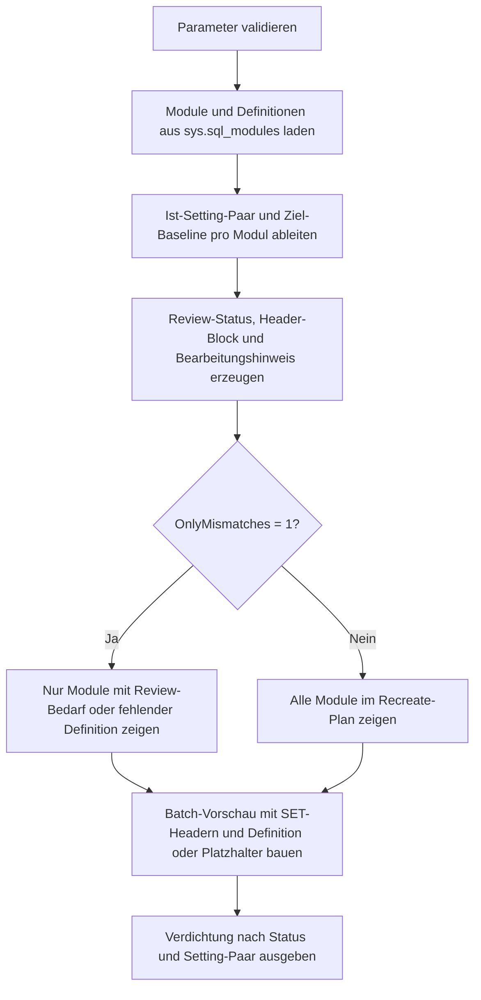

# ModuleRecreateBatchTemplate.sql

Dieses Skript erzeugt eine rein lesende Vorlage fuer konsistente Recreate-Batches von SQL-Modulen. Es kombiniert die gespeicherten Moduldefinitionen mit einer Ziel-Baseline fuer `ANSI_NULLS` und `QUOTED_IDENTIFIER` und gibt pro Objekt einen ueberpruefbaren Batch als Text aus.

## Uebersicht

<!-- SQLDOC:SUMMARY_TABLE:BEGIN -->
| Feld | Wert |
|---|---|
| Script | [ModuleRecreateBatchTemplate.sql](ModuleRecreateBatchTemplate.sql) |
| Version | `1.0` |
| Typ | `template` |
| Kapitel | `21_QUOTED_IDENTIFIER` |
| Sicherheit | `read-only` |
| Zweck | Vorlage fuer Recreate-Batches mit konsistentem `SET ANSI_NULLS`- und `SET QUOTED_IDENTIFIER`-Header. |
<!-- SQLDOC:SUMMARY_TABLE:END -->

## Einordnung

Im Kapitel `21_QUOTED_IDENTIFIER` ist nicht nur die Analyse von Modulen relevant, sondern auch eine saubere Nacharbeitsvorlage. Dieses Skript baut deshalb keinen automatischen Re-Deploy-Prozess, sondern eine kontrollierbare Batch-Vorschau, die vor dem Ausfuehren manuell angepasst werden kann.

## Annahmen

- Die Ziel-Baseline fuer `ANSI_NULLS` und `QUOTED_IDENTIFIER` wird ueber zwei BIT-Parameter modelliert.
- Das Skript nutzt die in `sys.sql_modules` gespeicherten Definitionen und fuehrt keine DDL aus.
- Vor einer produktiven Nutzung muss geprueft werden, ob das vorhandene `CREATE` im Definitionstext zu `ALTER` oder `CREATE OR ALTER` angepasst werden soll.
- Verschluesselte oder fehlende Definitionen werden nicht erraten, sondern als manuell zu vervollstaendigende Faelle markiert.

## Anwendungsfall

Die erste Ausgabe listet alle Module mit Ist-/Soll-Settings und Review-Hinweisen. Die zweite Ausgabe erzeugt die eigentliche Batch-Vorschau. Die dritte Ausgabe verdichtet, wie viele Module bereits ausgerichtet sind und wo Header-Nacharbeit ansteht.

## Parameter

<!-- SQLDOC:PARAMETERS_TABLE:BEGIN -->
| Parameter | SQL-Typ | Pflicht | Beschreibung |
|---|---|---|---|
| `@SchemaName` | `SYSNAME` | Nein | Optionaler Filter auf ein Schema. |
| `@ModuleName` | `SYSNAME` | Nein | Optionaler Filter auf einen einzelnen Modulnamen. |
| `@ExpectedAnsiNulls` | `BIT` | Nein | Zielwert fuer `SET ANSI_NULLS` im Batch-Header. |
| `@ExpectedQuotedIdentifier` | `BIT` | Nein | Zielwert fuer `SET QUOTED_IDENTIFIER` im Batch-Header. |
| `@OnlyMismatches` | `BIT` | Nein | Zeigt bei `1` nur Module mit Review-Bedarf oder fehlender Definition. |
| `@IncludeReviewNotes` | `BIT` | Nein | Schreibt bei `1` erklaerende Kommentarzeilen in die Batch-Vorschau. |
<!-- SQLDOC:PARAMETERS_TABLE:END -->

## Abhaengigkeiten

<!-- SQLDOC:DEPENDENCIES_LIST:BEGIN -->
- `sys.sql_modules`
- `sys.objects`
- `sys.schemas`
- `OBJECT_DEFINITION`
- `SET ANSI_NULLS`
- `SET QUOTED_IDENTIFIER`
- `temp tables`
<!-- SQLDOC:DEPENDENCIES_LIST:END -->

## Hinweise

- `compatibility_status = HeaderReview` bedeutet, dass die gespeicherten Capture-Werte nicht zur Ziel-Baseline passen.
- `compatibility_status = DefinitionMissing` deckt verschluesselte oder fehlende Definitionen ab und erzeugt nur einen Platzhalter-Batch.
- Die Batch-Vorschau endet je Modul mit `GO`, damit sie direkt in Review- oder Deployment-Notizen uebernommen werden kann.
- Das Skript bevorzugt Kontrolle vor Automatisierung und nimmt deshalb keine automatische Umschreibung von `CREATE` auf `ALTER` vor.

## Versionshistorie

<!-- SQLDOC:VERSION_HISTORY_TABLE:BEGIN -->
| Version | Datum | User | Beschreibung |
|---|---|---|---|
| `1.0` | `2026-04-22` | `ER` | Erstversion der Recreate-Batch-Vorlage fuer Module |
<!-- SQLDOC:VERSION_HISTORY_TABLE:END -->

## Ablauf

<!-- SQLDOC:MERMAID:BEGIN -->

<!-- SQLDOC:MERMAID:END -->

## SQL-Code

<!-- SQLDOC:SQL_CODE:BEGIN -->
```sql
/*
BEGIN:SQL-HEADER v1
---
sql_header: v1
script_name: "ModuleRecreateBatchTemplate.sql"
script_version: "1.0"
script_type: "template"
chapter: "21_QUOTED_IDENTIFIER"

purpose: >
  Erstellt eine rein lesende Vorlage fuer konsistente Recreate-Batches von
  SQL-Modulen. Das Skript liest Moduldefinitionen aus den Katalogen,
  kombiniert sie mit einer Ziel-Baseline fuer ANSI_NULLS und
  QUOTED_IDENTIFIER und gibt pro Modul einen Review-Batch als Text aus.

parameters:
  - name: "@SchemaName"
    sql_type: "SYSNAME"
    direction: "IN"
    required: false
    description: "Optionaler Filter auf ein Schema"
  - name: "@ModuleName"
    sql_type: "SYSNAME"
    direction: "IN"
    required: false
    description: "Optionaler Filter auf einen einzelnen Modulnamen"
  - name: "@ExpectedAnsiNulls"
    sql_type: "BIT"
    direction: "IN"
    required: false
    description: "Zielwert fuer den Batch-Header SET ANSI_NULLS"
  - name: "@ExpectedQuotedIdentifier"
    sql_type: "BIT"
    direction: "IN"
    required: false
    description: "Zielwert fuer den Batch-Header SET QUOTED_IDENTIFIER"
  - name: "@OnlyMismatches"
    sql_type: "BIT"
    direction: "IN"
    required: false
    description: "1 = nur Module mit abweichenden Capture-Werten oder fehlender Definition zeigen"
  - name: "@IncludeReviewNotes"
    sql_type: "BIT"
    direction: "IN"
    required: false
    description: "1 = erklaerende Review-Kommentare oberhalb der Batch-Vorschau ausgeben"

result_sets:
  - name: "ModuleRecreatePlan"
    description: "Modulliste mit Ist-Werten, Ziel-Header und Review-Hinweisen"
  - name: "RecreateBatchPreview"
    description: "Pro Modul ein Batch-Template mit SET-Headern und Definitionstext"
  - name: "RecreateBatchSummary"
    description: "Verdichtung nach Setting-Paar und Bearbeitungsstatus"

dependencies:
  - "sys.sql_modules"
  - "sys.objects"
  - "sys.schemas"
  - "OBJECT_DEFINITION"
  - "SET ANSI_NULLS"
  - "SET QUOTED_IDENTIFIER"
  - "temp tables"

safety:
  level: "read-only"
  writes_data: false

documentation:
  markdown_file: "T-SQL/21_QUOTED_IDENTIFIER/SQLScripts/ModuleRecreateBatchTemplate.md"
  sync_blocks:
    - "SUMMARY_TABLE"
    - "PARAMETERS_TABLE"
    - "DEPENDENCIES_LIST"
    - "VERSION_HISTORY_TABLE"
    - "SQL_CODE"
  mermaid:
    mode: "ai-agent-from-sql"
    source: "script-body"

main_responsible:
  name: "Erhard Rainer"
  initials: "ER"

version_history:
  - version: "1.0"
    date: "2026-04-22"
    user: "ER"
    description: "Erstversion der Recreate-Batch-Vorlage fuer Module"

notes:
  - "Die Batch-Vorschau fuehrt keine DDL aus und dient als Review- und Copy-Paste-Vorlage."
  - "Vor der produktiven Nutzung muss geprueft werden, ob CREATE im Definitionstext zu ALTER angepasst werden soll."
---
END:SQL-HEADER v1
*/

SET NOCOUNT ON;

DECLARE @SchemaName SYSNAME = NULL;
DECLARE @ModuleName SYSNAME = NULL;
DECLARE @ExpectedAnsiNulls BIT = 1;
DECLARE @ExpectedQuotedIdentifier BIT = 1;
DECLARE @OnlyMismatches BIT = 1;
DECLARE @IncludeReviewNotes BIT = 1;

IF @ExpectedAnsiNulls NOT IN (0, 1)
BEGIN
    THROW 50000, '@ExpectedAnsiNulls muss 0 oder 1 sein.', 1;
END;

IF @ExpectedQuotedIdentifier NOT IN (0, 1)
BEGIN
    THROW 50001, '@ExpectedQuotedIdentifier muss 0 oder 1 sein.', 1;
END;

IF @OnlyMismatches NOT IN (0, 1)
BEGIN
    THROW 50002, '@OnlyMismatches muss 0 oder 1 sein.', 1;
END;

IF @IncludeReviewNotes NOT IN (0, 1)
BEGIN
    THROW 50003, '@IncludeReviewNotes muss 0 oder 1 sein.', 1;
END;

DROP TABLE IF EXISTS #ModuleInventory;
DROP TABLE IF EXISTS #ModuleRecreatePlan;
DROP TABLE IF EXISTS #RecreateBatchPreview;
DROP TABLE IF EXISTS #RecreateBatchSummary;

CREATE TABLE #ModuleInventory
(
    object_id                  INT            NOT NULL,
    schema_name                SYSNAME        NOT NULL,
    module_name                SYSNAME        NOT NULL,
    module_qualified_name      NVARCHAR(517)  NOT NULL,
    module_type                NVARCHAR(60)   NOT NULL,
    create_date                DATETIME       NOT NULL,
    modify_date                DATETIME       NOT NULL,
    uses_ansi_nulls            BIT            NOT NULL,
    uses_quoted_identifier     BIT            NOT NULL,
    is_schema_bound            BIT            NOT NULL,
    is_encrypted               BIT            NOT NULL,
    definition_text            NVARCHAR(MAX)  NULL
);

INSERT INTO #ModuleInventory
(
    object_id,
    schema_name,
    module_name,
    module_qualified_name,
    module_type,
    create_date,
    modify_date,
    uses_ansi_nulls,
    uses_quoted_identifier,
    is_schema_bound,
    is_encrypted,
    definition_text
)
SELECT
    o.object_id,
    s.name AS schema_name,
    o.name AS module_name,
    QUOTENAME(s.name) + N'.' + QUOTENAME(o.name) AS module_qualified_name,
    o.type_desc AS module_type,
    o.create_date,
    o.modify_date,
    sm.uses_ansi_nulls,
    sm.uses_quoted_identifier,
    CONVERT(BIT, OBJECTPROPERTYEX(o.object_id, 'IsSchemaBound')) AS is_schema_bound,
    sm.is_encrypted,
    sm.definition AS definition_text
FROM sys.sql_modules AS sm
INNER JOIN sys.objects AS o
    ON sm.object_id = o.object_id
INNER JOIN sys.schemas AS s
    ON s.schema_id = o.schema_id
WHERE o.type IN ('P', 'V', 'FN', 'IF', 'TF', 'TR')
  AND (@SchemaName IS NULL OR s.name = @SchemaName)
  AND (@ModuleName IS NULL OR o.name = @ModuleName);

CREATE TABLE #ModuleRecreatePlan
(
    object_id                  INT            NOT NULL,
    module_qualified_name      NVARCHAR(517)  NOT NULL,
    module_type                NVARCHAR(60)   NOT NULL,
    create_date                DATETIME       NOT NULL,
    modify_date                DATETIME       NOT NULL,
    current_setting_pair       VARCHAR(32)    NOT NULL,
    target_setting_pair        VARCHAR(32)    NOT NULL,
    compatibility_status       VARCHAR(24)    NOT NULL,
    header_block               NVARCHAR(200)  NOT NULL,
    review_reason              NVARCHAR(260)  NOT NULL,
    batch_action_hint          NVARCHAR(160)  NOT NULL
);

INSERT INTO #ModuleRecreatePlan
(
    object_id,
    module_qualified_name,
    module_type,
    create_date,
    modify_date,
    current_setting_pair,
    target_setting_pair,
    compatibility_status,
    header_block,
    review_reason,
    batch_action_hint
)
SELECT
    mi.object_id,
    mi.module_qualified_name,
    mi.module_type,
    mi.create_date,
    mi.modify_date,
    CASE
        WHEN mi.uses_ansi_nulls = 1 AND mi.uses_quoted_identifier = 1 THEN 'ANSI_ON__QI_ON'
        WHEN mi.uses_ansi_nulls = 1 AND mi.uses_quoted_identifier = 0 THEN 'ANSI_ON__QI_OFF'
        WHEN mi.uses_ansi_nulls = 0 AND mi.uses_quoted_identifier = 1 THEN 'ANSI_OFF__QI_ON'
        ELSE 'ANSI_OFF__QI_OFF'
    END AS current_setting_pair,
    CASE
        WHEN @ExpectedAnsiNulls = 1 AND @ExpectedQuotedIdentifier = 1 THEN 'ANSI_ON__QI_ON'
        WHEN @ExpectedAnsiNulls = 1 AND @ExpectedQuotedIdentifier = 0 THEN 'ANSI_ON__QI_OFF'
        WHEN @ExpectedAnsiNulls = 0 AND @ExpectedQuotedIdentifier = 1 THEN 'ANSI_OFF__QI_ON'
        ELSE 'ANSI_OFF__QI_OFF'
    END AS target_setting_pair,
    CASE
        WHEN mi.is_encrypted = 1 THEN 'DefinitionMissing'
        WHEN mi.definition_text IS NULL OR LEN(mi.definition_text) = 0 THEN 'DefinitionMissing'
        WHEN mi.uses_ansi_nulls = @ExpectedAnsiNulls
         AND mi.uses_quoted_identifier = @ExpectedQuotedIdentifier THEN 'Aligned'
        ELSE 'HeaderReview'
    END AS compatibility_status,
    'SET ANSI_NULLS '
    + CASE @ExpectedAnsiNulls WHEN 1 THEN 'ON' ELSE 'OFF' END
    + ';' + CHAR(13) + CHAR(10)
    + 'SET QUOTED_IDENTIFIER '
    + CASE @ExpectedQuotedIdentifier WHEN 1 THEN 'ON' ELSE 'OFF' END
    + ';' AS header_block,
    CASE
        WHEN mi.is_encrypted = 1 THEN 'Modul ist verschluesselt; Definition muss extern bereitgestellt werden.'
        WHEN mi.definition_text IS NULL OR LEN(mi.definition_text) = 0 THEN 'Keine Moduldefinition im Katalog gefunden.'
        WHEN mi.uses_ansi_nulls = @ExpectedAnsiNulls
         AND mi.uses_quoted_identifier = @ExpectedQuotedIdentifier THEN 'Capture-Werte stimmen bereits mit der Ziel-Baseline ueberein.'
        WHEN mi.uses_quoted_identifier <> @ExpectedQuotedIdentifier
         AND mi.uses_ansi_nulls <> @ExpectedAnsiNulls THEN 'Beide Capture-Werte weichen von der Ziel-Baseline ab.'
        WHEN mi.uses_quoted_identifier <> @ExpectedQuotedIdentifier THEN 'QUOTED_IDENTIFIER weicht von der Ziel-Baseline ab.'
        ELSE 'ANSI_NULLS weicht von der Ziel-Baseline ab.'
    END AS review_reason,
    CASE
        WHEN mi.is_encrypted = 1 THEN 'Definition extern beschaffen und Header manuell davor setzen.'
        WHEN mi.definition_text IS NULL OR LEN(mi.definition_text) = 0 THEN 'Objektdefinition pruefen und Batch manuell vervollstaendigen.'
        WHEN mi.module_type = 'SQL_TRIGGER' THEN 'CREATE-Statement fuer Trigger pruefen und im Batch gezielt ersetzen.'
        ELSE 'CREATE-Statement vor Ausfuehrung bei Bedarf zu ALTER oder CREATE OR ALTER anpassen.'
    END AS batch_action_hint
FROM #ModuleInventory AS mi;

SELECT
    mrp.module_qualified_name,
    mrp.module_type,
    mrp.create_date,
    mrp.modify_date,
    mrp.current_setting_pair,
    mrp.target_setting_pair,
    mrp.compatibility_status,
    mrp.header_block,
    mrp.review_reason,
    mrp.batch_action_hint
FROM #ModuleRecreatePlan AS mrp
WHERE @OnlyMismatches = 0
   OR mrp.compatibility_status <> 'Aligned'
ORDER BY
    CASE mrp.compatibility_status
        WHEN 'HeaderReview' THEN 1
        WHEN 'DefinitionMissing' THEN 2
        ELSE 3
    END,
    mrp.module_qualified_name;

CREATE TABLE #RecreateBatchPreview
(
    module_qualified_name      NVARCHAR(517)  NOT NULL,
    compatibility_status       VARCHAR(24)    NOT NULL,
    recreate_batch             NVARCHAR(MAX)  NOT NULL
);

INSERT INTO #RecreateBatchPreview
(
    module_qualified_name,
    compatibility_status,
    recreate_batch
)
SELECT
    mrp.module_qualified_name,
    mrp.compatibility_status,
    CASE
        WHEN mrp.compatibility_status = 'DefinitionMissing' THEN
            '-- Review fuer ' + mrp.module_qualified_name + CHAR(13) + CHAR(10)
            + '-- ' + mrp.review_reason + CHAR(13) + CHAR(10)
            + mrp.header_block + CHAR(13) + CHAR(10)
            + '-- Definition hier einfuegen, sobald sie verfuegbar ist.' + CHAR(13) + CHAR(10)
            + '-- Beispiel: CREATE OR ALTER ...' + CHAR(13) + CHAR(10)
            + 'GO'
        ELSE
            CASE WHEN @IncludeReviewNotes = 1
                THEN '-- Review fuer ' + mrp.module_qualified_name + CHAR(13) + CHAR(10)
                     + '-- ' + mrp.review_reason + CHAR(13) + CHAR(10)
                     + '-- ' + mrp.batch_action_hint + CHAR(13) + CHAR(10)
                ELSE ''
            END
            + mrp.header_block + CHAR(13) + CHAR(10)
            + mi.definition_text + CHAR(13) + CHAR(10)
            + 'GO'
    END AS recreate_batch
FROM #ModuleRecreatePlan AS mrp
INNER JOIN #ModuleInventory AS mi
    ON mi.object_id = mrp.object_id;

SELECT
    rbp.module_qualified_name,
    rbp.compatibility_status,
    rbp.recreate_batch
FROM #RecreateBatchPreview AS rbp
WHERE @OnlyMismatches = 0
   OR rbp.compatibility_status <> 'Aligned'
ORDER BY
    CASE rbp.compatibility_status
        WHEN 'HeaderReview' THEN 1
        WHEN 'DefinitionMissing' THEN 2
        ELSE 3
    END,
    rbp.module_qualified_name;

CREATE TABLE #RecreateBatchSummary
(
    compatibility_status       VARCHAR(24)   NOT NULL,
    current_setting_pair       VARCHAR(32)   NOT NULL,
    target_setting_pair        VARCHAR(32)   NOT NULL,
    module_count              INT           NOT NULL
);

INSERT INTO #RecreateBatchSummary
(
    compatibility_status,
    current_setting_pair,
    target_setting_pair,
    module_count
)
SELECT
    mrp.compatibility_status,
    mrp.current_setting_pair,
    mrp.target_setting_pair,
    COUNT(*) AS module_count
FROM #ModuleRecreatePlan AS mrp
GROUP BY
    mrp.compatibility_status,
    mrp.current_setting_pair,
    mrp.target_setting_pair;

SELECT
    rbs.compatibility_status,
    rbs.current_setting_pair,
    rbs.target_setting_pair,
    rbs.module_count
FROM #RecreateBatchSummary AS rbs
ORDER BY
    CASE rbs.compatibility_status
        WHEN 'HeaderReview' THEN 1
        WHEN 'DefinitionMissing' THEN 2
        ELSE 3
    END,
    rbs.current_setting_pair,
    rbs.target_setting_pair;
```
<!-- SQLDOC:SQL_CODE:END -->
