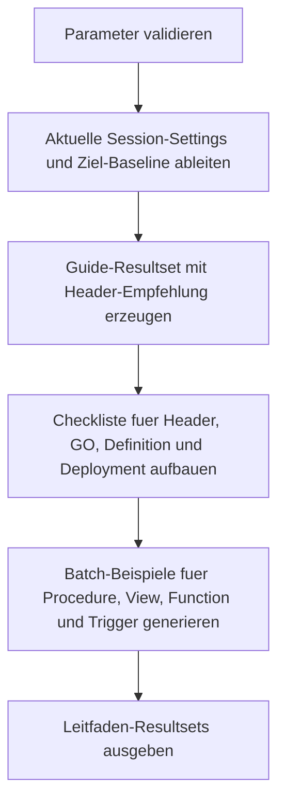

# QuotedIdentifierCreateScriptGuide.sql

Dieses Skript liefert einen didaktischen Leitfaden fuer konsistente Create-Skripte mit `ANSI_NULLS` und `QUOTED_IDENTIFIER`. Es vergleicht die aktuelle Session mit einer Ziel-Baseline, erzeugt eine kurze Review-Checkliste und stellt wiederverwendbare Batch-Vorlagen fuer typische SQL-Modultypen bereit.

## Uebersicht

<!-- SQLDOC:SUMMARY_TABLE:BEGIN -->
| Feld | Wert |
|---|---|
| Script | [QuotedIdentifierCreateScriptGuide.sql](QuotedIdentifierCreateScriptGuide.sql) |
| Version | `1.0` |
| Typ | `template` |
| Kapitel | `21_QUOTED_IDENTIFIER` |
| Sicherheit | `read-only` |
| Zweck | Leitfaden fuer konsistente Create-Skripte mit explizitem Session-Header und Batch-Vorlagen. |
<!-- SQLDOC:SUMMARY_TABLE:END -->

## Einordnung

Im Kapitel `21_QUOTED_IDENTIFIER` reicht eine reine Modulbestandsaufnahme oft nicht aus. Fuer neue oder ueberarbeitete Skripte muss ebenso klar sein, wie ein stabiler Create-Batch aufgebaut wird, damit Session-Optionen reproduzierbar gespeichert werden. Dieses Skript schliesst genau diese Luecke mit einer lesenden Guide-Struktur.

## Annahmen

- Die didaktische Erstversion bevorzugt eine moderne Baseline mit `SET ANSI_NULLS ON;` und `SET QUOTED_IDENTIFIER ON;`.
- Die Ausgabe ist als Review- und Copy-Paste-Hilfe gedacht und fuehrt keine DDL selbst aus.
- `@ObjectSchema` steuert nur die Beispielsnippets; reale Objekt- und Tabellennamen muessen vor produktiver Nutzung angepasst werden.
- `CREATE OR ALTER` wird als bevorzugtes Muster fuer viele Module gezeigt, Views und Trigger bleiben in einer klassischen `CREATE`-Vorlage, damit der Batch-Aufbau klar sichtbar bleibt.

## Anwendungsfall

Die erste Ausgabe zeigt, ob die aktuelle Session bereits zur Ziel-Baseline passt oder ob der Header vor dem Compile-Schritt explizit gesetzt werden muss. Die zweite Ausgabe verdichtet die wichtigsten Review-Schritte. Die dritte Ausgabe liefert konkrete Beispiel-Batches fuer haeufige Modultypen.

## Parameter

<!-- SQLDOC:PARAMETERS_TABLE:BEGIN -->
| Parameter | SQL-Typ | Pflicht | Beschreibung |
|---|---|---|---|
| `@ExpectedAnsiNulls` | `BIT` | Nein | Zielwert fuer `SET ANSI_NULLS` im empfohlenen Create-Batch. |
| `@ExpectedQuotedIdentifier` | `BIT` | Nein | Zielwert fuer `SET QUOTED_IDENTIFIER` im empfohlenen Create-Batch. |
| `@IncludeCreateOrAlter` | `BIT` | Nein | Nutzt bei `1` fuer Procedure und Function ein `CREATE OR ALTER`-Muster. |
| `@ObjectSchema` | `SYSNAME` | Nein | Schema-Praefix fuer die generierten Beispielobjekte. |
<!-- SQLDOC:PARAMETERS_TABLE:END -->

## Abhaengigkeiten

<!-- SQLDOC:DEPENDENCIES_LIST:BEGIN -->
- `SESSIONPROPERTY`
- `SET ANSI_NULLS`
- `SET QUOTED_IDENTIFIER`
- `CREATE OR ALTER`
- `temp tables`
<!-- SQLDOC:DEPENDENCIES_LIST:END -->

## Hinweise

- Der Header wird immer als expliziter Block ausgegeben, auch wenn die aktuelle Session bereits zur Ziel-Baseline passt.
- `GO` trennt den Session-Header vom folgenden Modul-Batch und verhindert versehentliche Mischkontexte.
- Die Beispiel-Batches sind absichtlich knapp gehalten, damit die Session-Optionen und die Batch-Struktur im Vordergrund stehen.
- Vor produktivem Einsatz muessen Objektnamen, Trigger-Zieltabellen und fachliche SQL-Logik ergaenzt oder ersetzt werden.

## Versionshistorie

<!-- SQLDOC:VERSION_HISTORY_TABLE:BEGIN -->
| Version | Datum | User | Beschreibung |
|---|---|---|---|
| `1.0` | `2026-04-22` | `ER` | Erstversion des Leitfadens fuer konsistente Create-Skripte mit Session-Optionen |
<!-- SQLDOC:VERSION_HISTORY_TABLE:END -->

## Ablauf

<!-- SQLDOC:MERMAID:BEGIN -->

<!-- SQLDOC:MERMAID:END -->

## SQL-Code

<!-- SQLDOC:SQL_CODE:BEGIN -->
```sql
/*
BEGIN:SQL-HEADER v1
---
sql_header: v1
script_name: "QuotedIdentifierCreateScriptGuide.sql"
script_version: "1.0"
script_type: "template"
chapter: "21_QUOTED_IDENTIFIER"

purpose: >
  Liefert einen didaktischen Leitfaden fuer konsistente Create-Skripte mit
  Session-Optionen. Das Skript stellt eine Ziel-Baseline fuer ANSI_NULLS und
  QUOTED_IDENTIFIER zusammen, vergleicht sie mit der aktuellen Session und
  erzeugt wiederverwendbare Batch-Vorlagen fuer haeufige SQL-Modultypen.

parameters:
  - name: "@ExpectedAnsiNulls"
    sql_type: "BIT"
    direction: "IN"
    required: false
    description: "Zielwert fuer SET ANSI_NULLS im empfohlenen Create-Batch"
  - name: "@ExpectedQuotedIdentifier"
    sql_type: "BIT"
    direction: "IN"
    required: false
    description: "Zielwert fuer SET QUOTED_IDENTIFIER im empfohlenen Create-Batch"
  - name: "@IncludeCreateOrAlter"
    sql_type: "BIT"
    direction: "IN"
    required: false
    description: "1 = Beispiele mit CREATE OR ALTER und klassischem CREATE-Batch parallel ausgeben"
  - name: "@ObjectSchema"
    sql_type: "SYSNAME"
    direction: "IN"
    required: false
    description: "Schemasuffix fuer die generierten Beispielobjekte"

result_sets:
  - name: "SessionOptionGuide"
    description: "Ist-/Soll-Sicht auf ANSI_NULLS und QUOTED_IDENTIFIER fuer den Create-Batch"
  - name: "CreateScriptChecklist"
    description: "Schrittfolge fuer konsistente Modulskripte mit Session-Optionen"
  - name: "CreateScriptExamples"
    description: "Wiederverwendbare Beispiel-Batches fuer Procedure, View, Function und Trigger"

dependencies:
  - "SESSIONPROPERTY"
  - "SET ANSI_NULLS"
  - "SET QUOTED_IDENTIFIER"
  - "CREATE OR ALTER"
  - "temp tables"

safety:
  level: "read-only"
  writes_data: false

documentation:
  markdown_file: "T-SQL/21_QUOTED_IDENTIFIER/SQLScripts/QuotedIdentifierCreateScriptGuide.md"
  sync_blocks:
    - "SUMMARY_TABLE"
    - "PARAMETERS_TABLE"
    - "DEPENDENCIES_LIST"
    - "VERSION_HISTORY_TABLE"
    - "SQL_CODE"
  mermaid:
    mode: "ai-agent-from-sql"
    source: "script-body"

main_responsible:
  name: "Erhard Rainer"
  initials: "ER"

version_history:
  - version: "1.0"
    date: "2026-04-22"
    user: "ER"
    description: "Erstversion des Leitfadens fuer konsistente Create-Skripte mit Session-Optionen"

notes:
  - "Das Skript gibt nur Leitfaden- und Beispieltext aus und fuehrt keine DDL aus."
  - "Die Vorlagen bevorzugen eine moderne Baseline mit ANSI_NULLS ON und QUOTED_IDENTIFIER ON."
---
END:SQL-HEADER v1
*/

SET NOCOUNT ON;

DECLARE @ExpectedAnsiNulls BIT = 1;
DECLARE @ExpectedQuotedIdentifier BIT = 1;
DECLARE @IncludeCreateOrAlter BIT = 1;
DECLARE @ObjectSchema SYSNAME = N'dbo';

IF @ExpectedAnsiNulls NOT IN (0, 1)
BEGIN
    THROW 50000, '@ExpectedAnsiNulls muss 0 oder 1 sein.', 1;
END;

IF @ExpectedQuotedIdentifier NOT IN (0, 1)
BEGIN
    THROW 50001, '@ExpectedQuotedIdentifier muss 0 oder 1 sein.', 1;
END;

IF @IncludeCreateOrAlter NOT IN (0, 1)
BEGIN
    THROW 50002, '@IncludeCreateOrAlter muss 0 oder 1 sein.', 1;
END;

IF @ObjectSchema IS NULL OR LTRIM(RTRIM(@ObjectSchema)) = N''
BEGIN
    THROW 50003, '@ObjectSchema darf nicht leer sein.', 1;
END;

DECLARE @ExpectedAnsiNullsText VARCHAR(3) =
    CASE @ExpectedAnsiNulls WHEN 1 THEN 'ON' ELSE 'OFF' END;
DECLARE @ExpectedQuotedIdentifierText VARCHAR(3) =
    CASE @ExpectedQuotedIdentifier WHEN 1 THEN 'ON' ELSE 'OFF' END;
DECLARE @CurrentAnsiNullsText VARCHAR(3) =
    CASE WHEN SESSIONPROPERTY('ANSI_NULLS') = 1 THEN 'ON' ELSE 'OFF' END;
DECLARE @CurrentQuotedIdentifierText VARCHAR(3) =
    CASE WHEN SESSIONPROPERTY('QUOTED_IDENTIFIER') = 1 THEN 'ON' ELSE 'OFF' END;
DECLARE @HeaderBlock NVARCHAR(200) =
    N'SET ANSI_NULLS ' + @ExpectedAnsiNullsText + N';'
    + CHAR(13) + CHAR(10)
    + N'SET QUOTED_IDENTIFIER ' + @ExpectedQuotedIdentifierText + N';';

DROP TABLE IF EXISTS #SessionOptionGuide;
DROP TABLE IF EXISTS #CreateScriptChecklist;
DROP TABLE IF EXISTS #CreateScriptExamples;

CREATE TABLE #SessionOptionGuide
(
    guide_name                VARCHAR(80)    NOT NULL,
    current_ansi_nulls        VARCHAR(3)     NOT NULL,
    current_quoted_identifier VARCHAR(3)     NOT NULL,
    expected_ansi_nulls       VARCHAR(3)     NOT NULL,
    expected_quoted_identifier VARCHAR(3)    NOT NULL,
    alignment_status          VARCHAR(24)    NOT NULL,
    recommended_header_block  NVARCHAR(200)  NOT NULL,
    review_note               NVARCHAR(260)  NOT NULL
);

INSERT INTO #SessionOptionGuide
(
    guide_name,
    current_ansi_nulls,
    current_quoted_identifier,
    expected_ansi_nulls,
    expected_quoted_identifier,
    alignment_status,
    recommended_header_block,
    review_note
)
VALUES
(
    'CreateScriptSessionBaseline',
    @CurrentAnsiNullsText,
    @CurrentQuotedIdentifierText,
    @ExpectedAnsiNullsText,
    @ExpectedQuotedIdentifierText,
    CASE
        WHEN @CurrentAnsiNullsText = @ExpectedAnsiNullsText
         AND @CurrentQuotedIdentifierText = @ExpectedQuotedIdentifierText THEN 'Aligned'
        ELSE 'HeaderRequired'
    END,
    @HeaderBlock,
    CASE
        WHEN @CurrentAnsiNullsText = @ExpectedAnsiNullsText
         AND @CurrentQuotedIdentifierText = @ExpectedQuotedIdentifierText
            THEN 'Die aktuelle Session passt zur Ziel-Baseline, der Header sollte im Skript trotzdem explizit stehen.'
        ELSE 'Die aktuelle Session weicht von der Ziel-Baseline ab; der Header muss vor dem Create-Statement explizit gesetzt werden.'
    END
);

SELECT
    sog.guide_name,
    sog.current_ansi_nulls,
    sog.current_quoted_identifier,
    sog.expected_ansi_nulls,
    sog.expected_quoted_identifier,
    sog.alignment_status,
    sog.recommended_header_block,
    sog.review_note
FROM #SessionOptionGuide AS sog;

CREATE TABLE #CreateScriptChecklist
(
    step_number               INT            NOT NULL,
    phase_name                VARCHAR(40)    NOT NULL,
    instruction_text          NVARCHAR(260)  NOT NULL,
    why_it_matters            NVARCHAR(260)  NOT NULL,
    recommended_artifact      NVARCHAR(260)  NOT NULL
);

INSERT INTO #CreateScriptChecklist
(
    step_number,
    phase_name,
    instruction_text,
    why_it_matters,
    recommended_artifact
)
VALUES
    (1, 'Header', N'Batch immer mit explizitem SET ANSI_NULLS und SET QUOTED_IDENTIFIER beginnen.', N'Die Session-Optionen werden beim Erstellen eines Moduls gespeichert und spaeter nicht aus der Laufzeit-Session nachgeladen.', @HeaderBlock),
    (2, 'Separator', N'Vor CREATE, ALTER oder CREATE OR ALTER ein GO zwischen Header und Moduldefinition verwenden.', N'Der Header soll fuer genau den folgenden Compile-Batch gelten und nicht mit Vorbereitungs-SQL vermischt werden.', N'GO'),
    (3, 'Definition', N'Objektnamen mit QUOTENAME oder Klammern stabil halten und CREATE-Text unvermischt versionieren.', N'Identifier-Probleme und versehentliche Header-Verschiebungen werden so frueh sichtbar.', N'CREATE OR ALTER PROCEDURE ' + QUOTENAME(@ObjectSchema) + N'.[SampleProcedure] AS ...'),
    (4, 'Review', N'Vor dem Einchecken die Session-Baseline und den Objekttyp gegen Anforderungen wie schemagebundene Views pruefen.', N'Bestimmte Objekttypen und Deployments reagieren besonders sensibel auf QUOTED_IDENTIFIER OFF.', N'Checkliste und Code-Review'),
    (5, 'Deployment', N'Nur den bereinigten Batch deployen, keine ad-hoc SET-Umschaltungen zwischen mehreren Modulen mischen.', N'Jedes Modul soll einen nachvollziehbaren und reproduzierbaren Capture-Kontext erhalten.', N'Ein Modul pro Batch oder klar getrennte GO-Bloecke');

SELECT
    csc.step_number,
    csc.phase_name,
    csc.instruction_text,
    csc.why_it_matters,
    csc.recommended_artifact
FROM #CreateScriptChecklist AS csc
ORDER BY
    csc.step_number;

CREATE TABLE #CreateScriptExamples
(
    example_order             INT            NOT NULL,
    object_type               VARCHAR(40)    NOT NULL,
    recommended_usage         NVARCHAR(160)  NOT NULL,
    create_pattern            VARCHAR(24)    NOT NULL,
    example_batch             NVARCHAR(MAX)  NOT NULL,
    review_hint               NVARCHAR(260)  NOT NULL
);

INSERT INTO #CreateScriptExamples
(
    example_order,
    object_type,
    recommended_usage,
    create_pattern,
    example_batch,
    review_hint
)
VALUES
(
    1,
    'StoredProcedure',
    N'Baseline fuer procedure-basierte Deployments mit explizitem Header.',
    CASE WHEN @IncludeCreateOrAlter = 1 THEN 'CREATE OR ALTER' ELSE 'CREATE' END,
    @HeaderBlock + CHAR(13) + CHAR(10)
    + N'GO' + CHAR(13) + CHAR(10)
    + CASE WHEN @IncludeCreateOrAlter = 1
        THEN N'CREATE OR ALTER PROCEDURE ' + QUOTENAME(@ObjectSchema) + N'.[SampleProcedure]'
        ELSE N'CREATE PROCEDURE ' + QUOTENAME(@ObjectSchema) + N'.[SampleProcedure]'
      END
    + CHAR(13) + CHAR(10)
    + N'AS' + CHAR(13) + CHAR(10)
    + N'BEGIN' + CHAR(13) + CHAR(10)
    + N'    SET NOCOUNT ON;' + CHAR(13) + CHAR(10)
    + N'    SELECT N''Session baseline captured explicitly.'' AS message;' + CHAR(13) + CHAR(10)
    + N'END;' + CHAR(13) + CHAR(10)
    + N'GO',
    N'Fuer Prozeduren bleibt CREATE OR ALTER meist die wartungsarme Standardwahl.'
),
(
    2,
    'View',
    N'Vorlage fuer Views, bei denen QUOTED_IDENTIFIER ON bewusst mitgefuehrt werden soll.',
    'CREATE VIEW',
    @HeaderBlock + CHAR(13) + CHAR(10)
    + N'GO' + CHAR(13) + CHAR(10)
    + N'CREATE VIEW ' + QUOTENAME(@ObjectSchema) + N'.[SampleQuotedView]' + CHAR(13) + CHAR(10)
    + N'AS' + CHAR(13) + CHAR(10)
    + N'SELECT' + CHAR(13) + CHAR(10)
    + N'    CAST(1 AS INT) AS [DemoId],' + CHAR(13) + CHAR(10)
    + N'    N''Quoted identifiers stay deterministic.'' AS [DemoText];' + CHAR(13) + CHAR(10)
    + N'GO',
    N'Views, indexierte Views und schemagebundene Objekte sollten mit moderner Header-Baseline versioniert werden.'
),
(
    3,
    'ScalarFunction',
    N'Vorlage fuer Funktionen mit sauber getrenntem Header- und Definitionsteil.',
    CASE WHEN @IncludeCreateOrAlter = 1 THEN 'CREATE OR ALTER' ELSE 'CREATE' END,
    @HeaderBlock + CHAR(13) + CHAR(10)
    + N'GO' + CHAR(13) + CHAR(10)
    + CASE WHEN @IncludeCreateOrAlter = 1
        THEN N'CREATE OR ALTER FUNCTION ' + QUOTENAME(@ObjectSchema) + N'.[SampleQuotedFunction] (@InputValue INT)'
        ELSE N'CREATE FUNCTION ' + QUOTENAME(@ObjectSchema) + N'.[SampleQuotedFunction] (@InputValue INT)'
      END
    + CHAR(13) + CHAR(10)
    + N'RETURNS INT' + CHAR(13) + CHAR(10)
    + N'AS' + CHAR(13) + CHAR(10)
    + N'BEGIN' + CHAR(13) + CHAR(10)
    + N'    RETURN @InputValue + 1;' + CHAR(13) + CHAR(10)
    + N'END;' + CHAR(13) + CHAR(10)
    + N'GO',
    N'Funktionen profitieren von reproduzierbaren Headern, damit spaetere Recreates keine alten Session-Optionen einschleppen.'
),
(
    4,
    'Trigger',
    N'Vorlage fuer Trigger-Batches mit eigenem GO-Block und neutralem Beispieltext.',
    'CREATE TRIGGER',
    @HeaderBlock + CHAR(13) + CHAR(10)
    + N'GO' + CHAR(13) + CHAR(10)
    + N'CREATE TRIGGER ' + QUOTENAME(@ObjectSchema) + N'.[SampleAuditTrigger]' + CHAR(13) + CHAR(10)
    + N'ON ' + QUOTENAME(@ObjectSchema) + N'.[SampleTable]' + CHAR(13) + CHAR(10)
    + N'AFTER INSERT' + CHAR(13) + CHAR(10)
    + N'AS' + CHAR(13) + CHAR(10)
    + N'BEGIN' + CHAR(13) + CHAR(10)
    + N'    SET NOCOUNT ON;' + CHAR(13) + CHAR(10)
    + N'    SELECT COUNT(*) AS inserted_rows' + CHAR(13) + CHAR(10)
    + N'    FROM inserted;' + CHAR(13) + CHAR(10)
    + N'END;' + CHAR(13) + CHAR(10)
    + N'GO',
    N'Bei Triggern muss der Zieltabellenkontext vor dem Deployment manuell geprueft und angepasst werden.'
);

SELECT
    cse.object_type,
    cse.recommended_usage,
    cse.create_pattern,
    cse.example_batch,
    cse.review_hint
FROM #CreateScriptExamples AS cse
ORDER BY
    cse.example_order;
```
<!-- SQLDOC:SQL_CODE:END -->
