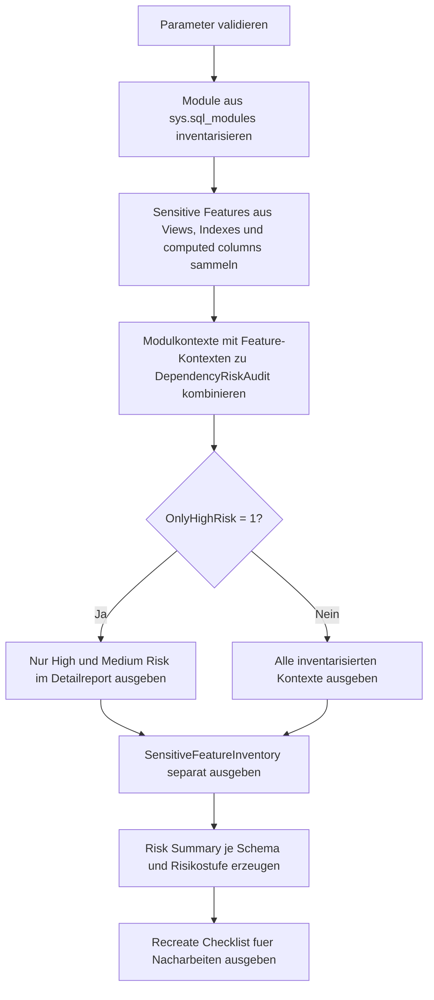

# QuotedIdentifierDependencyCheck.sql

Dieses Skript inventarisiert `QUOTED_IDENTIFIER`-Risiken fuer Recreates und Build-Skripte. Es kombiniert persistierte Modul-Settings aus `sys.sql_modules` mit sensiblen Objektmerkmalen wie indexed views, filtered indexes und indizierten computed columns, damit Review-Prioritaeten aus echten Metadaten abgeleitet werden koennen.

## Uebersicht

<!-- SQLDOC:SUMMARY_TABLE:BEGIN -->
| Feld | Wert |
|---|---|
| Script | [QuotedIdentifierDependencyCheck.sql](QuotedIdentifierDependencyCheck.sql) |
| Version | `1.0` |
| Typ | `diagnostic-query` |
| Kapitel | `21_QUOTED_IDENTIFIER` |
| Sicherheit | `read-only` |
| Zweck | Findet Objekt- und Modulkontexte, bei denen `QUOTED_IDENTIFIER OFF` Build- oder Recreate-Risiken erzeugt. |
<!-- SQLDOC:SUMMARY_TABLE:END -->

## Einordnung

Der Fokus liegt nicht auf einer kompletten Abhaengigkeitsgraph-Analyse, sondern auf einer konservativen Review-Grundlage fuer sensible Recreate-Kontexte. Das Skript zeigt deshalb sowohl gespeicherte Modul-Settings als auch Objektmerkmale, die in SQL Server typischerweise eine moderne Header-Baseline mit `SET ANSI_NULLS ON` und `SET QUOTED_IDENTIFIER ON` erwarten.

## Annahmen

- Die Auswertung bleibt bewusst lesend und arbeitet nur mit Metadaten, die in Standard-Katalogsichten verfuegbar sind.
- Indexed views, filtered indexes und indizierte computed columns werden als High-Risk-Merkmale fuer Recreate-Batches behandelt.
- Wenn ein sensibles Objektmerkmal keinem Modul aus `sys.sql_modules` direkt zugeordnet werden kann, erscheint es separat als Objektkontext im Report.
- Die Ausgabe ist konservativ und eignet sich als Review-Backlog, nicht als formaler Nachweis jeder technischen Abhaengigkeit.

## Anwendungsfall

Das Skript eignet sich fuer Upgrade-Checks, Deployment-Vorbereitungen und Review-Sessions in Legacy-Datenbanken. Es ist besonders hilfreich, wenn vor Recreates, Batch-Bereinigungen oder Standardisierungen zuerst sichtbar gemacht werden soll, welche Module und Objektarten gegenueber `QUOTED_IDENTIFIER OFF` am sensibelsten sind.

## Parameter

<!-- SQLDOC:PARAMETERS_TABLE:BEGIN -->
| Parameter | SQL-Typ | Pflicht | Beschreibung |
|---|---|---|---|
| `@SchemaName` | `SYSNAME` | Nein | Grenzt das Audit optional auf ein einzelnes Schema ein. |
| `@OnlyHighRisk` | `BIT` | Nein | Zeigt bei `1` nur High- und Medium-Risk-Eintraege im Detailreport. |
| `@IncludeAlignedModules` | `BIT` | Nein | Behaelt bei `1` auch Module mit `QUOTED_IDENTIFIER ON` im Detailreport. |
<!-- SQLDOC:PARAMETERS_TABLE:END -->

## Abhaengigkeiten

<!-- SQLDOC:DEPENDENCIES_LIST:BEGIN -->
- `sys.sql_modules`
- `sys.objects`
- `sys.schemas`
- `sys.views`
- `sys.indexes`
- `sys.computed_columns`
- `SESSIONPROPERTY`
- `sys.sp_helptext`
<!-- SQLDOC:DEPENDENCIES_LIST:END -->

## Hinweise

- `DependencyRiskAudit` priorisiert Kontexte nach `High`, `Medium` und `Info`.
- `SensitiveFeatureInventory` zeigt explizit die Objektmerkmale, die fuer Recreate-Batches eine moderne Session-Baseline erwarten.
- `DependencyRiskSummary` verdichtet die Risiken je Schema und Risikostufe.
- `RecreateDependencyChecklist` liefert eine kurze Nacharbeitsfolge fuer Reviews und Batch-Bereinigungen.

## Versionshistorie

<!-- SQLDOC:VERSION_HISTORY_TABLE:BEGIN -->
| Version | Datum | User | Beschreibung |
|---|---|---|---|
| `1.0` | `2026-04-22` | `ER` | Erstversion des Dependency-Checks fuer `QUOTED_IDENTIFIER`-Risiken |
<!-- SQLDOC:VERSION_HISTORY_TABLE:END -->

## Ablauf

<!-- SQLDOC:MERMAID:BEGIN -->

<!-- SQLDOC:MERMAID:END -->

## SQL-Code

<!-- SQLDOC:SQL_CODE:BEGIN -->
```sql
/*
BEGIN:SQL-HEADER v1
---
sql_header: v1
script_name: "QuotedIdentifierDependencyCheck.sql"
script_version: "1.0"
script_type: "diagnostic-query"
chapter: "21_QUOTED_IDENTIFIER"

purpose: >
  Findet Objekte und Modulkontexte, bei denen QUOTED_IDENTIFIER OFF
  Build-, Recreate- oder Review-Risiken erzeugt. Das Skript kombiniert
  persistierte Modul-Settings mit sensiblen Objektmerkmalen wie indexed views,
  filtered indexes und indizierten computed columns und leitet daraus eine
  priorisierte Pruefgrundlage fuer Recreates ab.

parameters:
  - name: "@SchemaName"
    sql_type: "SYSNAME"
    direction: "IN"
    required: false
    description: "Optionaler Schemaname fuer die Eingrenzung des Audits"
  - name: "@OnlyHighRisk"
    sql_type: "BIT"
    direction: "IN"
    required: false
    description: "1 = nur High- oder Medium-Risk-Eintraege im Detailreport ausgeben"
  - name: "@IncludeAlignedModules"
    sql_type: "BIT"
    direction: "IN"
    required: false
    description: "1 = Module mit QUOTED_IDENTIFIER ON im Detailreport behalten"

result_sets:
  - name: "DependencyRiskAudit"
    description: "Detailsicht je Modul oder Objektkontext mit Risiko, Trigger und Review-Hinweisen"
  - name: "SensitiveFeatureInventory"
    description: "Inventar sensibler Features, die fuer Recreate-Batches eine moderne Session-Baseline erwarten"
  - name: "DependencyRiskSummary"
    description: "Verdichtung der Risiken je Schema und Risikotyp"
  - name: "RecreateDependencyChecklist"
    description: "Kompakte Checkliste und Review-Kommandos fuer Nacharbeiten"

dependencies:
  - "sys.sql_modules"
  - "sys.objects"
  - "sys.schemas"
  - "sys.views"
  - "sys.indexes"
  - "sys.computed_columns"
  - "SESSIONPROPERTY"
  - "sys.sp_helptext"

safety:
  level: "read-only"
  writes_data: false

documentation:
  markdown_file: "T-SQL/21_QUOTED_IDENTIFIER/SQLScripts/QuotedIdentifierDependencyCheck.md"
  sync_blocks:
    - "SUMMARY_TABLE"
    - "PARAMETERS_TABLE"
    - "DEPENDENCIES_LIST"
    - "VERSION_HISTORY_TABLE"
    - "SQL_CODE"
  mermaid:
    mode: "ai-agent-from-sql"
    source: "script-body"

main_responsible:
  name: "Erhard Rainer"
  initials: "ER"

version_history:
  - version: "1.0"
    date: "2026-04-22"
    user: "ER"
    description: "Erstversion des Dependency-Checks fuer QUOTED_IDENTIFIER-Risiken"

notes:
  - "Das Skript leitet Risiken nur aus lesbaren Metadaten und Moduldefinitionen ab."
  - "Nicht jedes Recreate-Risiko ist direkt als technische Abhaengigkeit modelliert; die Ausgabe ist bewusst konservativ."
---
END:SQL-HEADER v1
*/

SET NOCOUNT ON;

DECLARE @SchemaName SYSNAME = NULL;
DECLARE @OnlyHighRisk BIT = 0;
DECLARE @IncludeAlignedModules BIT = 1;

IF @OnlyHighRisk NOT IN (0, 1)
BEGIN
    THROW 50000, '@OnlyHighRisk muss 0 oder 1 sein.', 1;
END;

IF @IncludeAlignedModules NOT IN (0, 1)
BEGIN
    THROW 50001, '@IncludeAlignedModules muss 0 oder 1 sein.', 1;
END;

DROP TABLE IF EXISTS #ModuleInventory;
DROP TABLE IF EXISTS #SensitiveFeatureInventory;
DROP TABLE IF EXISTS #DependencyRiskAudit;
DROP TABLE IF EXISTS #DependencyRiskSummary;
DROP TABLE IF EXISTS #RecreateDependencyChecklist;

CREATE TABLE #ModuleInventory
(
    object_id                  INT            NOT NULL,
    schema_name                SYSNAME        NOT NULL,
    object_name                SYSNAME        NOT NULL,
    qualified_name             NVARCHAR(517)  NOT NULL,
    object_type                NVARCHAR(60)   NOT NULL,
    create_date                DATETIME       NOT NULL,
    modify_date                DATETIME       NOT NULL,
    uses_quoted_identifier     BIT            NOT NULL,
    uses_ansi_nulls            BIT            NOT NULL,
    is_schema_bound            BIT            NOT NULL,
    is_encrypted               BIT            NOT NULL,
    definition_preview         NVARCHAR(200)  NULL
);

INSERT INTO #ModuleInventory
(
    object_id,
    schema_name,
    object_name,
    qualified_name,
    object_type,
    create_date,
    modify_date,
    uses_quoted_identifier,
    uses_ansi_nulls,
    is_schema_bound,
    is_encrypted,
    definition_preview
)
SELECT
    o.object_id,
    s.name AS schema_name,
    o.name AS object_name,
    QUOTENAME(s.name) + N'.' + QUOTENAME(o.name) AS qualified_name,
    o.type_desc AS object_type,
    o.create_date,
    o.modify_date,
    sm.uses_quoted_identifier,
    sm.uses_ansi_nulls,
    CONVERT(BIT, OBJECTPROPERTYEX(o.object_id, 'IsSchemaBound')) AS is_schema_bound,
    sm.is_encrypted,
    CASE
        WHEN sm.is_encrypted = 1 THEN NULL
        ELSE LEFT(REPLACE(REPLACE(sm.definition, CHAR(13), ' '), CHAR(10), ' '), 200)
    END AS definition_preview
FROM sys.sql_modules AS sm
INNER JOIN sys.objects AS o
    ON sm.object_id = o.object_id
INNER JOIN sys.schemas AS s
    ON o.schema_id = s.schema_id
WHERE o.type IN ('P', 'V', 'FN', 'IF', 'TF', 'TR')
  AND (@SchemaName IS NULL OR s.name = @SchemaName);

CREATE TABLE #SensitiveFeatureInventory
(
    schema_name                  SYSNAME        NOT NULL,
    object_name                  SYSNAME        NOT NULL,
    qualified_name               NVARCHAR(517)  NOT NULL,
    feature_type                 VARCHAR(40)    NOT NULL,
    feature_scope                VARCHAR(40)    NOT NULL,
    feature_detail               NVARCHAR(260)  NOT NULL,
    impact_level                 VARCHAR(12)    NOT NULL,
    recommended_baseline         NVARCHAR(120)  NOT NULL,
    review_hint                  NVARCHAR(260)  NOT NULL
);

INSERT INTO #SensitiveFeatureInventory
(
    schema_name,
    object_name,
    qualified_name,
    feature_type,
    feature_scope,
    feature_detail,
    impact_level,
    recommended_baseline,
    review_hint
)
SELECT
    s.name AS schema_name,
    v.name AS object_name,
    QUOTENAME(s.name) + N'.' + QUOTENAME(v.name) AS qualified_name,
    'indexed_view' AS feature_type,
    'view' AS feature_scope,
    N'View besitzt mindestens einen Index und erwartet fuer Recreates eine moderne Session-Baseline.' AS feature_detail,
    'High' AS impact_level,
    N'SET ANSI_NULLS ON; SET QUOTED_IDENTIFIER ON;' AS recommended_baseline,
    N'Vor ALTER oder Recreate den Header explizit setzen und Indexed-View-Anforderungen pruefen.' AS review_hint
FROM sys.views AS v
INNER JOIN sys.schemas AS s
    ON v.schema_id = s.schema_id
INNER JOIN sys.indexes AS i
    ON v.object_id = i.object_id
WHERE i.index_id > 0
  AND i.is_hypothetical = 0
  AND (@SchemaName IS NULL OR s.name = @SchemaName)
GROUP BY
    s.name,
    v.name

UNION ALL

SELECT
    s.name AS schema_name,
    t.name AS object_name,
    QUOTENAME(s.name) + N'.' + QUOTENAME(t.name) AS qualified_name,
    'filtered_index' AS feature_type,
    'table' AS feature_scope,
    N'Gefilterter Index ' + QUOTENAME(i.name) + N' mit Filter ' + COALESCE(i.filter_definition, N'<unknown>') AS feature_detail,
    'High' AS impact_level,
    N'SET ANSI_NULLS ON; SET QUOTED_IDENTIFIER ON;' AS recommended_baseline,
    N'Index-Definition und umgebenden Recreate-Batch mit moderner Session-Baseline deployen.' AS review_hint
FROM sys.tables AS t
INNER JOIN sys.schemas AS s
    ON t.schema_id = s.schema_id
INNER JOIN sys.indexes AS i
    ON t.object_id = i.object_id
WHERE i.has_filter = 1
  AND i.is_hypothetical = 0
  AND (@SchemaName IS NULL OR s.name = @SchemaName)

UNION ALL

SELECT
    s.name AS schema_name,
    t.name AS object_name,
    QUOTENAME(s.name) + N'.' + QUOTENAME(t.name) AS qualified_name,
    'indexed_computed_column' AS feature_type,
    'table' AS feature_scope,
    N'Indizierte computed column ' + QUOTENAME(c.name) AS feature_detail,
    'High' AS impact_level,
    N'SET ANSI_NULLS ON; SET QUOTED_IDENTIFIER ON;' AS recommended_baseline,
    N'Persistierte oder indizierte computed columns vor Recreates mit sauberem Header pruefen.' AS review_hint
FROM sys.tables AS t
INNER JOIN sys.schemas AS s
    ON t.schema_id = s.schema_id
INNER JOIN sys.computed_columns AS c
    ON t.object_id = c.object_id
INNER JOIN sys.index_columns AS ic
    ON c.object_id = ic.object_id
   AND c.column_id = ic.column_id
INNER JOIN sys.indexes AS i
    ON ic.object_id = i.object_id
   AND ic.index_id = i.index_id
WHERE i.is_hypothetical = 0
  AND (@SchemaName IS NULL OR s.name = @SchemaName);

CREATE TABLE #DependencyRiskAudit
(
    schema_name                  SYSNAME        NOT NULL,
    context_name                 NVARCHAR(517)  NOT NULL,
    context_type                 VARCHAR(24)    NOT NULL,
    object_type                  NVARCHAR(60)   NOT NULL,
    quoted_identifier_setting    VARCHAR(3)     NOT NULL,
    ansi_nulls_setting           VARCHAR(3)     NOT NULL,
    dependency_trigger           VARCHAR(40)    NOT NULL,
    risk_level                   VARCHAR(12)    NOT NULL,
    recreate_risk                NVARCHAR(260)  NOT NULL,
    review_command               NVARCHAR(260)  NOT NULL,
    feature_note                 NVARCHAR(260)  NOT NULL,
    definition_preview           NVARCHAR(200)  NULL
);

INSERT INTO #DependencyRiskAudit
(
    schema_name,
    context_name,
    context_type,
    object_type,
    quoted_identifier_setting,
    ansi_nulls_setting,
    dependency_trigger,
    risk_level,
    recreate_risk,
    review_command,
    feature_note,
    definition_preview
)
SELECT
    mi.schema_name,
    mi.qualified_name,
    'module' AS context_type,
    mi.object_type,
    CASE mi.uses_quoted_identifier WHEN 1 THEN 'ON' ELSE 'OFF' END AS quoted_identifier_setting,
    CASE mi.uses_ansi_nulls WHEN 1 THEN 'ON' ELSE 'OFF' END AS ansi_nulls_setting,
    CASE
        WHEN sfi.feature_type IS NOT NULL THEN sfi.feature_type
        WHEN mi.is_schema_bound = 1 THEN 'schema_bound_module'
        WHEN mi.object_type = 'VIEW' THEN 'view_recreate'
        ELSE 'legacy_module'
    END AS dependency_trigger,
    CASE
        WHEN mi.uses_quoted_identifier = 0 AND sfi.impact_level = 'High' THEN 'High'
        WHEN mi.uses_quoted_identifier = 0 AND mi.is_schema_bound = 1 THEN 'High'
        WHEN mi.uses_quoted_identifier = 0 THEN 'Medium'
        WHEN sfi.impact_level = 'High' THEN 'Medium'
        ELSE 'Info'
    END AS risk_level,
    CASE
        WHEN mi.uses_quoted_identifier = 0 AND sfi.feature_type IS NOT NULL
            THEN N'Modul oder Objektkontext kollidiert mit einem Feature, das fuer Recreates eine moderne Session-Baseline erwartet.'
        WHEN mi.uses_quoted_identifier = 0 AND mi.is_schema_bound = 1
            THEN N'Schema-gebundenes Modul mit QUOTED_IDENTIFIER OFF sollte vor Recreates oder strukturellen Aenderungen priorisiert bereinigt werden.'
        WHEN mi.uses_quoted_identifier = 0
            THEN N'Modul wurde mit QUOTED_IDENTIFIER OFF gespeichert und sollte vor Neuaufbau, Review oder Deployment explizit modernisiert werden.'
        WHEN sfi.feature_type IS NOT NULL
            THEN N'Das Objekt ist zwar modern gespeichert, haengt aber an einem sensiblen Feature, das eine konsistente Header-Baseline verlangt.'
        ELSE N'Keine unmittelbare Risikoerhoehung festgestellt, aber Session-Header bleiben relevant.'
    END AS recreate_risk,
    CASE
        WHEN mi.is_encrypted = 1
            THEN N'-- Modul ist verschluesselt; Definition ueber Deployment-Quelle oder Quellverwaltung pruefen.'
        ELSE N'EXEC sys.sp_helptext N''' + mi.qualified_name + N''';'
    END AS review_command,
    COALESCE(
        sfi.feature_detail,
        CASE
            WHEN mi.is_schema_bound = 1 THEN N'Schema binding erhoeht die Sensitivitaet gegenueber inkonsistenten Recreate-Batches.'
            WHEN mi.object_type = 'VIEW' THEN N'Views sollten fuer Recreates mit explizitem Header versioniert werden.'
            ELSE N'Persistierte Modul-Settings wurden ohne bekannte Sonderfeatures inventarisiert.'
        END
    ) AS feature_note,
    mi.definition_preview
FROM #ModuleInventory AS mi
LEFT JOIN #SensitiveFeatureInventory AS sfi
    ON mi.schema_name = sfi.schema_name
   AND mi.object_name = sfi.object_name
WHERE @IncludeAlignedModules = 1
   OR mi.uses_quoted_identifier = 0;

INSERT INTO #DependencyRiskAudit
(
    schema_name,
    context_name,
    context_type,
    object_type,
    quoted_identifier_setting,
    ansi_nulls_setting,
    dependency_trigger,
    risk_level,
    recreate_risk,
    review_command,
    feature_note,
    definition_preview
)
SELECT
    sfi.schema_name,
    sfi.qualified_name,
    'object' AS context_type,
    UPPER(sfi.feature_scope),
    'N/A',
    'N/A',
    sfi.feature_type,
    sfi.impact_level,
    N'Sensitives Objektmerkmal sollte nur mit moderner Session-Baseline erstellt oder neu aufgebaut werden.',
    N'-- Objektdefinition und zugehoerige Build-Skripte auf explizites SET ANSI_NULLS ON / SET QUOTED_IDENTIFIER ON pruefen.',
    sfi.feature_detail,
    NULL
FROM #SensitiveFeatureInventory AS sfi
WHERE NOT EXISTS
(
    SELECT 1
    FROM #ModuleInventory AS mi
    WHERE mi.schema_name = sfi.schema_name
      AND mi.object_name = sfi.object_name
);

SELECT
    dra.context_name,
    dra.context_type,
    dra.object_type,
    dra.quoted_identifier_setting,
    dra.ansi_nulls_setting,
    dra.dependency_trigger,
    dra.risk_level,
    dra.recreate_risk,
    dra.feature_note,
    dra.review_command,
    dra.definition_preview
FROM #DependencyRiskAudit AS dra
WHERE @OnlyHighRisk = 0
   OR dra.risk_level IN ('High', 'Medium')
ORDER BY
    CASE dra.risk_level
        WHEN 'High' THEN 1
        WHEN 'Medium' THEN 2
        ELSE 3
    END,
    dra.schema_name,
    dra.context_name;

SELECT
    sfi.qualified_name,
    sfi.feature_type,
    sfi.feature_scope,
    sfi.impact_level,
    sfi.feature_detail,
    sfi.recommended_baseline,
    sfi.review_hint
FROM #SensitiveFeatureInventory AS sfi
ORDER BY
    CASE sfi.impact_level
        WHEN 'High' THEN 1
        ELSE 2
    END,
    sfi.schema_name,
    sfi.qualified_name,
    sfi.feature_type;

CREATE TABLE #DependencyRiskSummary
(
    schema_name                  SYSNAME        NOT NULL,
    risk_level                   VARCHAR(12)    NOT NULL,
    entry_count                  INT            NOT NULL,
    quoted_identifier_off_count  INT            NOT NULL,
    feature_backed_count         INT            NOT NULL,
    summary_note                 NVARCHAR(260)  NOT NULL
);

INSERT INTO #DependencyRiskSummary
(
    schema_name,
    risk_level,
    entry_count,
    quoted_identifier_off_count,
    feature_backed_count,
    summary_note
)
SELECT
    dra.schema_name,
    dra.risk_level,
    COUNT(*) AS entry_count,
    SUM(CASE WHEN dra.quoted_identifier_setting = 'OFF' THEN 1 ELSE 0 END) AS quoted_identifier_off_count,
    SUM(CASE WHEN dra.dependency_trigger IN ('indexed_view', 'filtered_index', 'indexed_computed_column') THEN 1 ELSE 0 END) AS feature_backed_count,
    CASE
        WHEN dra.risk_level = 'High'
            THEN N'Schema enthaelt Kontexte mit direktem Recreate-Risiko und sollte vor Strukturarbeiten priorisiert werden.'
        WHEN dra.risk_level = 'Medium'
            THEN N'Schema enthaelt Legacy- oder Baseline-Abweichungen, die vor einem Neuaufbau bereinigt werden sollten.'
        ELSE N'Keine prioritaeren Risiken, aber Build-Header sollten konsistent bleiben.'
    END AS summary_note
FROM #DependencyRiskAudit AS dra
GROUP BY
    dra.schema_name,
    dra.risk_level;

SELECT
    drs.schema_name,
    drs.risk_level,
    drs.entry_count,
    drs.quoted_identifier_off_count,
    drs.feature_backed_count,
    drs.summary_note
FROM #DependencyRiskSummary AS drs
ORDER BY
    CASE drs.risk_level
        WHEN 'High' THEN 1
        WHEN 'Medium' THEN 2
        ELSE 3
    END,
    drs.entry_count DESC,
    drs.schema_name;

CREATE TABLE #RecreateDependencyChecklist
(
    step_number                 INT            NOT NULL,
    checklist_step              VARCHAR(60)    NOT NULL,
    target_scope                NVARCHAR(160)  NOT NULL,
    recommended_action          NVARCHAR(260)  NOT NULL,
    why_it_matters              NVARCHAR(260)  NOT NULL
);

INSERT INTO #RecreateDependencyChecklist
(
    step_number,
    checklist_step,
    target_scope,
    recommended_action,
    why_it_matters
)
VALUES
    (1, 'BaselineHeader', N'Alle Recreate-Batches', N'Vor CREATE, ALTER oder Rebuild explizit SET ANSI_NULLS ON und SET QUOTED_IDENTIFIER ON setzen.', N'Die Session-Optionen werden beim Build gespeichert und steuern, ob sensible Objekte konsistent neu erstellt werden koennen.'),
    (2, 'LegacyModules', N'Module mit QUOTED_IDENTIFIER OFF', N'Detailreport sichten und Module mit modernem Header neu versionieren.', N'Legacy-Capture-Werte bleiben sonst in Deployments und spaeteren Recreates erhalten.'),
    (3, 'SensitiveFeatures', N'Indexed views, filtered indexes, indexed computed columns', N'Objektdefinitionen und angrenzende Build-Skripte gegen die moderne Session-Baseline pruefen.', N'Diese Features reagieren besonders sensibel auf inkonsistente Session-Optionen.'),
    (4, 'ReviewSource', N'Verschluesselte oder fehlende Definitionen', N'Review ueber Quellverwaltung, Release-Artefakte oder bekannte Build-Skripte nachziehen.', N'Nicht jede Risikoquelle ist aus den Datenbankmetadaten allein rekonstruierbar.');

SELECT
    rdc.step_number,
    rdc.checklist_step,
    rdc.target_scope,
    rdc.recommended_action,
    rdc.why_it_matters
FROM #RecreateDependencyChecklist AS rdc
ORDER BY
    rdc.step_number;
```
<!-- SQLDOC:SQL_CODE:END -->
