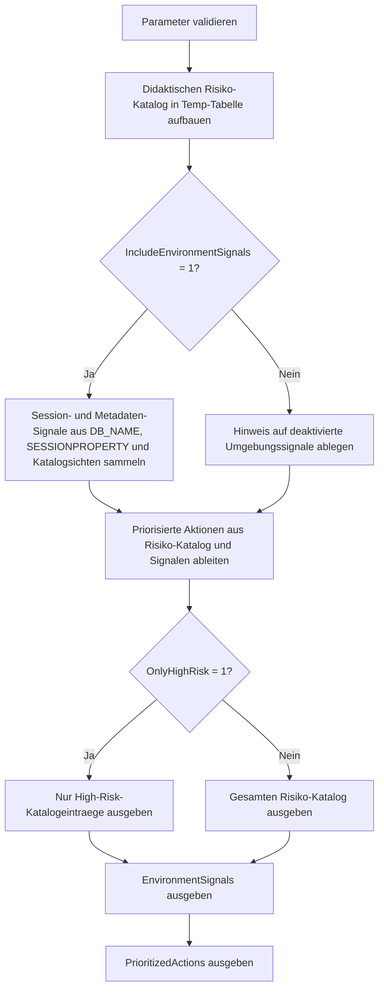

# QuotedIdentifierOffRiskList.sql

Dieses Skript listet typische Risiken von `QUOTED_IDENTIFIER OFF` in einer didaktisch nutzbaren Form auf und kombiniert den Merkkatalog mit optionalen Metadaten-Signalen aus der aktuellen Datenbank. So entsteht nicht nur eine abstrakte Risiko-Liste, sondern auch eine priorisierte Arbeitsgrundlage fuer Reviews, Recreates und Standardisierungsaufgaben.

## Uebersicht

<!-- SQLDOC:SUMMARY_TABLE:BEGIN -->
| Feld | Wert |
|---|---|
| Script | [QuotedIdentifierOffRiskList.sql](QuotedIdentifierOffRiskList.sql) |
| Version | `1.0` |
| Typ | `diagnostic-query` |
| Kapitel | `21_QUOTED_IDENTIFIER` |
| Sicherheit | `read-only` |
| Zweck | Listet moegliche Risiken bei `QUOTED_IDENTIFIER OFF` und verknuepft sie mit optionalen Umgebungssignalen. |
<!-- SQLDOC:SUMMARY_TABLE:END -->

## Einordnung

Der Schwerpunkt liegt auf einer konservativen Diagnose- und Unterrichtssicht. Das Skript aendert keine Objekte, sondern sammelt bekannte Risikofelder, prueft auf einige gut sichtbare Metadaten-Signale und leitet daraus eine priorisierte Aktionsliste ab. Damit eignet es sich sowohl als Merkzettel fuer das Kapitel als auch als Startpunkt fuer technische Reviews.

## Annahmen

- Die Risiko-Liste bildet typische SQL-Server-Szenarien rund um `QUOTED_IDENTIFIER OFF` ab, ohne eine vollstaendige Hersteller-Matrix nachzubauen.
- Umgebungssignale werden nur aus allgemein verfuegbaren Katalogsichten und `SESSIONPROPERTY` abgeleitet.
- Ein gefundenes Signal ist ein Review-Hinweis, aber kein formaler Beweis fuer einen unmittelbar fehlschlagenden Build.
- Wenn Umgebungssignale per Parameter deaktiviert werden, bleibt der didaktische Risiko-Katalog trotzdem nutzbar.

## Anwendungsfall

Das Skript eignet sich fuer Kapitel-Demos, Review-Backlogs und die Vorbereitung von Recreate- oder Standardisierungswellen. Es ist besonders hilfreich, wenn ein Team zunaechst sichtbar machen moechte, welche Arten von Problemen `QUOTED_IDENTIFIER OFF` typischerweise ausloest und ob die aktuelle Datenbank bereits Hinweise auf sensible Objektkontexte liefert.

## Parameter

<!-- SQLDOC:PARAMETERS_TABLE:BEGIN -->
| Parameter | SQL-Typ | Pflicht | Beschreibung |
|---|---|---|---|
| `@OnlyHighRisk` | `BIT` | Nein | Zeigt bei `1` nur High-Risk-Eintraege aus dem Risiko-Katalog. |
| `@IncludeEnvironmentSignals` | `BIT` | Nein | Ermittelt bei `1` zusaetzliche Session- und Metadaten-Signale aus der aktuellen Datenbank. |
<!-- SQLDOC:PARAMETERS_TABLE:END -->

## Abhaengigkeiten

<!-- SQLDOC:DEPENDENCIES_LIST:BEGIN -->
- `sys.sql_modules`
- `sys.views`
- `sys.indexes`
- `sys.computed_columns`
- `SESSIONPROPERTY`
- `DB_NAME`
<!-- SQLDOC:DEPENDENCIES_LIST:END -->

## Hinweise

- `QuotedIdentifierRiskCatalog` liefert die didaktische Kernliste mit Risiko, Signal und empfohlener Nacharbeit.
- `EnvironmentSignals` zeigt, ob die aktuelle Datenbank bereits auf Module mit gespeichertem `OFF`, sensitive Features oder eine problematische Session-Basis hinweist.
- `PrioritizedActions` verdichtet die wichtigsten Massnahmen in einer Reihenfolge, die fuer Review- und Standardisierungsaufgaben direkt verwendbar ist.

## Versionshistorie

<!-- SQLDOC:VERSION_HISTORY_TABLE:BEGIN -->
| Version | Datum | User | Beschreibung |
|---|---|---|---|
| `1.0` | `2026-04-22` | `ER` | Erstversion der Risiko-Liste fuer `QUOTED_IDENTIFIER OFF` |
<!-- SQLDOC:VERSION_HISTORY_TABLE:END -->

## Ablauf

<!-- SQLDOC:MERMAID:BEGIN -->

<!-- SQLDOC:MERMAID:END -->

## SQL-Code

<!-- SQLDOC:SQL_CODE:BEGIN -->
```sql
/*
BEGIN:SQL-HEADER v1
---
sql_header: v1
script_name: "QuotedIdentifierOffRiskList.sql"
script_version: "1.0"
script_type: "diagnostic-query"
chapter: "21_QUOTED_IDENTIFIER"

purpose: >
  Listet moegliche Risiken bei QUOTED_IDENTIFIER OFF und kombiniert einen
  didaktischen Risiko-Katalog mit einfachen Umgebungssignalen aus den
  SQL-Server-Metadaten. Dadurch entsteht eine priorisierte Grundlage fuer
  Reviews, Recreate-Planung und die Standardisierung von Session-Headern.

parameters:
  - name: "@OnlyHighRisk"
    sql_type: "BIT"
    direction: "IN"
    required: false
    description: "1 = nur High-Risk-Eintraege im Risiko-Katalog ausgeben"
  - name: "@IncludeEnvironmentSignals"
    sql_type: "BIT"
    direction: "IN"
    required: false
    description: "1 = zusaetzliche Metadaten-Signale aus der aktuellen Datenbank ermitteln"

result_sets:
  - name: "QuotedIdentifierRiskCatalog"
    description: "Didaktische Liste typischer QUOTED_IDENTIFIER-OFF-Risiken mit Schweregrad, Signal und Review-Fokus"
  - name: "EnvironmentSignals"
    description: "Zusammenfassung von Session- und Metadaten-Signalen, die auf reale Nacharbeit hindeuten koennen"
  - name: "PrioritizedActions"
    description: "Priorisierte Handlungsliste auf Basis des Risiko-Katalogs und optionaler Umgebungssignale"

dependencies:
  - "sys.sql_modules"
  - "sys.views"
  - "sys.indexes"
  - "sys.computed_columns"
  - "SESSIONPROPERTY"
  - "DB_NAME"

safety:
  level: "read-only"
  writes_data: false

documentation:
  markdown_file: "T-SQL/21_QUOTED_IDENTIFIER/SQLScripts/QuotedIdentifierOffRiskList.md"
  sync_blocks:
    - "SUMMARY_TABLE"
    - "PARAMETERS_TABLE"
    - "DEPENDENCIES_LIST"
    - "VERSION_HISTORY_TABLE"
    - "SQL_CODE"
  mermaid:
    mode: "ai-agent-from-sql"
    source: "script-body"

main_responsible:
  name: "Erhard Rainer"
  initials: "ER"

version_history:
  - version: "1.0"
    date: "2026-04-22"
    user: "ER"
    description: "Erstversion der Risiko-Liste fuer QUOTED_IDENTIFIER OFF"

notes:
  - "Der Risiko-Katalog ist bewusst konservativ und dient als Review- und Unterrichtsgrundlage."
  - "Umgebungssignale bleiben optional, damit das Skript auch als reine Merkhilfe nutzbar ist."
---
END:SQL-HEADER v1
*/

SET NOCOUNT ON;

DECLARE @OnlyHighRisk BIT = 0;
DECLARE @IncludeEnvironmentSignals BIT = 1;

IF @OnlyHighRisk NOT IN (0, 1)
BEGIN
    THROW 50000, '@OnlyHighRisk muss 0 oder 1 sein.', 1;
END;

IF @IncludeEnvironmentSignals NOT IN (0, 1)
BEGIN
    THROW 50001, '@IncludeEnvironmentSignals muss 0 oder 1 sein.', 1;
END;

DROP TABLE IF EXISTS #RiskCatalog;
DROP TABLE IF EXISTS #EnvironmentSignals;
DROP TABLE IF EXISTS #PrioritizedActions;

CREATE TABLE #RiskCatalog
(
    risk_id                VARCHAR(20)    NOT NULL,
    risk_level             VARCHAR(10)    NOT NULL,
    risk_area              VARCHAR(40)    NOT NULL,
    risk_title             VARCHAR(120)   NOT NULL,
    why_it_matters         NVARCHAR(260)  NOT NULL,
    detection_signal       NVARCHAR(260)  NOT NULL,
    recommended_action     NVARCHAR(260)  NOT NULL
);

INSERT INTO #RiskCatalog
(
    risk_id,
    risk_level,
    risk_area,
    risk_title,
    why_it_matters,
    detection_signal,
    recommended_action
)
VALUES
    (
        'QI-001',
        'High',
        'DDL baseline',
        'Indexed views oder indexed computed columns koennen Recreate-Probleme erzeugen',
        N'Bestimmte Objektarten erwarten eine konsistente Session-Baseline mit QUOTED_IDENTIFIER ON und reagieren empfindlich auf Legacy-Build-Skripte.',
        N'Indexed views, filtered indexes oder indizierte computed columns sind in den Metadaten vorhanden.',
        N'Vor CREATE, ALTER oder Rebuild explizit SET ANSI_NULLS ON und SET QUOTED_IDENTIFIER ON in allen Deployments setzen.'
    ),
    (
        'QI-002',
        'High',
        'Module capture',
        'Module wurden mit QUOTED_IDENTIFIER OFF gespeichert',
        N'Die gespeicherte Option bleibt am Modul haften und fuehrt dazu, dass spaetere Reviews oder Neuerstellungen auf inkonsistenten Standards beruhen.',
        N'sys.sql_modules.uses_quoted_identifier = 0',
        N'Betroffene Module identifizieren, Definition pruefen und mit modernem Header neu versionieren.'
    ),
    (
        'QI-003',
        'Medium',
        'Parser behavior',
        'Bezeichner und String-Literale koennen missverstaendlich gelesen werden',
        N'Bei OFF werden doppelte Anfuehrungszeichen nicht als Identifier-Quoting genutzt, was Lehrmaterial, Skriptvorlagen und Review-Kommentare fehleranfaellig macht.',
        N'Skripte enthalten doppelt gequotete Namen oder wechselnde Quote-Konventionen.',
        N'Identifier konsequent mit QUOTENAME oder eckigen Klammern absichern und Sessions standardisieren.'
    ),
    (
        'QI-004',
        'Medium',
        'Deployment consistency',
        'Batch-Verhalten haengt vom Ausfuehrungskontext statt vom Skript selbst ab',
        N'Wenn SET-Header fehlen, ist das Ergebnis von der Client-Session, vom Tooling und von vorhandenen Templates abhaengig.',
        N'DDL-Skripte starten ohne expliziten Header oder stammen aus Legacy-Batch-Sammlungen.',
        N'Header in jeder DDL-Datei explizit setzen und Review-Checklisten auf fehlende SET-Zeilen erweitern.'
    ),
    (
        'QI-005',
        'Low',
        'Training and support',
        'Fehlersuche wird in Schulungs- und Support-Szenarien unnoetig schwer',
        N'Unterschiedliche Session-Optionen erschweren die Reproduktion von Parser- oder Recreate-Problemen zwischen Lernumgebung, SSMS und Automationen.',
        N'Auffaellige Unterschiede zwischen SessionPROPERTY und Modul-Metadaten.',
        N'Vor Demos oder Troubleshooting die Session-Basis sichtbar machen und Standards in Beispielskripten dokumentieren.'
    );

CREATE TABLE #EnvironmentSignals
(
    signal_name            VARCHAR(60)    NOT NULL,
    signal_value           NVARCHAR(120)  NOT NULL,
    signal_level           VARCHAR(10)    NOT NULL,
    interpretation         NVARCHAR(260)  NOT NULL
);

IF @IncludeEnvironmentSignals = 1
BEGIN
    INSERT INTO #EnvironmentSignals
    (
        signal_name,
        signal_value,
        signal_level,
        interpretation
    )
    SELECT
        'CurrentDatabase',
        DB_NAME(),
        'Info',
        N'Aktueller Datenbankkontext fuer die Risiko-Sichtung.'
    UNION ALL
    SELECT
        'SessionQuotedIdentifier',
        CASE SESSIONPROPERTY('QUOTED_IDENTIFIER')
            WHEN 1 THEN 'ON'
            WHEN 0 THEN 'OFF'
            ELSE 'UNKNOWN'
        END,
        CASE SESSIONPROPERTY('QUOTED_IDENTIFIER')
            WHEN 0 THEN 'Medium'
            ELSE 'Info'
        END,
        N'Aktueller Session-Wert; eine OFF-Session ist bereits ein Warnsignal fuer Build- oder Demo-Skripte.'
    UNION ALL
    SELECT
        'ModulesStoredWithOff',
        CAST(COUNT(*) AS NVARCHAR(120)),
        CASE
            WHEN COUNT(*) > 0 THEN 'High'
            ELSE 'Info'
        END,
        N'Anzahl der Module aus sys.sql_modules, die mit QUOTED_IDENTIFIER OFF gespeichert wurden.'
    FROM sys.sql_modules
    WHERE uses_quoted_identifier = 0
    UNION ALL
    SELECT
        'IndexedViews',
        CAST(COUNT(DISTINCT v.object_id) AS NVARCHAR(120)),
        CASE
            WHEN COUNT(DISTINCT v.object_id) > 0 THEN 'High'
            ELSE 'Info'
        END,
        N'Indexed views reagieren bei Recreates empfindlich auf inkonsistente Session-Optionen.'
    FROM sys.views AS v
    INNER JOIN sys.indexes AS i
        ON v.object_id = i.object_id
    WHERE i.index_id > 0
      AND i.is_hypothetical = 0
    UNION ALL
    SELECT
        'FilteredIndexes',
        CAST(COUNT(*) AS NVARCHAR(120)),
        CASE
            WHEN COUNT(*) > 0 THEN 'High'
            ELSE 'Info'
        END,
        N'Filtered indexes markieren Objekte, deren Build-Skripte eine saubere Header-Baseline behalten sollten.'
    FROM sys.indexes
    WHERE has_filter = 1
      AND is_hypothetical = 0
    UNION ALL
    SELECT
        'IndexedComputedColumns',
        CAST(COUNT(*) AS NVARCHAR(120)),
        CASE
            WHEN COUNT(*) > 0 THEN 'High'
            ELSE 'Info'
        END,
        N'Indizierte computed columns erhoehen den Druck, alte OFF-Batches vor Recreates zu bereinigen.'
    FROM sys.computed_columns AS c
    WHERE EXISTS
    (
        SELECT 1
        FROM sys.index_columns AS ic
        INNER JOIN sys.indexes AS i
            ON ic.object_id = i.object_id
           AND ic.index_id = i.index_id
        WHERE ic.object_id = c.object_id
          AND ic.column_id = c.column_id
          AND i.is_hypothetical = 0
    );
END;
ELSE
BEGIN
    INSERT INTO #EnvironmentSignals
    (
        signal_name,
        signal_value,
        signal_level,
        interpretation
    )
    VALUES
    (
        'EnvironmentSignalsSkipped',
        'disabled',
        'Info',
        N'Umgebungssignale wurden per Parameter deaktiviert; der Risiko-Katalog bleibt trotzdem nutzbar.'
    );
END;

CREATE TABLE #PrioritizedActions
(
    priority_no            INT            NOT NULL,
    action_name            VARCHAR(60)    NOT NULL,
    trigger_level          VARCHAR(10)    NOT NULL,
    action_summary         NVARCHAR(260)  NOT NULL,
    supporting_signal      NVARCHAR(260)  NOT NULL
);

INSERT INTO #PrioritizedActions
(
    priority_no,
    action_name,
    trigger_level,
    action_summary,
    supporting_signal
)
SELECT
    1,
    'StandardizeHeaders',
    'High',
    N'Alle DDL- und Recreate-Skripte mit explizitem SET ANSI_NULLS ON und SET QUOTED_IDENTIFIER ON versehen.',
    N'Grundmassnahme fuer alle High-Risk-Szenarien aus dem Katalog.'
UNION ALL
SELECT
    2,
    'ReviewStoredModules',
    CASE
        WHEN EXISTS
        (
            SELECT 1
            FROM #EnvironmentSignals
            WHERE signal_name = 'ModulesStoredWithOff'
              AND TRY_CONVERT(INT, signal_value) > 0
        ) THEN 'High'
        ELSE 'Medium'
    END,
    N'Module mit gespeichertem QUOTED_IDENTIFIER OFF identifizieren und vor der naechsten Strukturarbeit neu versionieren.',
    COALESCE(
        (
            SELECT TOP (1)
                N'ModulesStoredWithOff = ' + signal_value
            FROM #EnvironmentSignals
            WHERE signal_name = 'ModulesStoredWithOff'
        ),
        N'Kein Umgebungssignal gelesen; Aktion bleibt als vorbeugende Empfehlung bestehen.'
    )
UNION ALL
SELECT
    3,
    'ProtectSensitiveFeatures',
    CASE
        WHEN EXISTS
        (
            SELECT 1
            FROM #EnvironmentSignals
            WHERE signal_name IN ('IndexedViews', 'FilteredIndexes', 'IndexedComputedColumns')
              AND TRY_CONVERT(INT, signal_value) > 0
        ) THEN 'High'
        ELSE 'Medium'
    END,
    N'Objekte mit indexed views, filtered indexes oder indizierten computed columns vor Recreates gegen Header-Standards pruefen.',
    N'Sensitive Features aus den Umgebungssignalen oder dem Risiko-Katalog.'
UNION ALL
SELECT
    4,
    'StabilizeTrainingBaseline',
    CASE
        WHEN EXISTS
        (
            SELECT 1
            FROM #EnvironmentSignals
            WHERE signal_name = 'SessionQuotedIdentifier'
              AND signal_value = 'OFF'
        ) THEN 'Medium'
        ELSE 'Low'
    END,
    N'In Schulungs- und Troubleshooting-Skripten die Session-Basis sichtbar machen, damit Parser-Verhalten reproduzierbar bleibt.',
    COALESCE(
        (
            SELECT TOP (1)
                N'SessionQuotedIdentifier = ' + signal_value
            FROM #EnvironmentSignals
            WHERE signal_name = 'SessionQuotedIdentifier'
        ),
        N'Keine Session-Signale gelesen; Aktion bleibt didaktisch relevant.'
    );

SELECT
    rc.risk_id,
    rc.risk_level,
    rc.risk_area,
    rc.risk_title,
    rc.why_it_matters,
    rc.detection_signal,
    rc.recommended_action
FROM #RiskCatalog AS rc
WHERE @OnlyHighRisk = 0
   OR rc.risk_level = 'High'
ORDER BY
    CASE rc.risk_level
        WHEN 'High' THEN 1
        WHEN 'Medium' THEN 2
        ELSE 3
    END,
    rc.risk_id;

SELECT
    es.signal_name,
    es.signal_value,
    es.signal_level,
    es.interpretation
FROM #EnvironmentSignals AS es
ORDER BY
    CASE es.signal_level
        WHEN 'High' THEN 1
        WHEN 'Medium' THEN 2
        ELSE 3
    END,
    es.signal_name;

SELECT
    pa.priority_no,
    pa.action_name,
    pa.trigger_level,
    pa.action_summary,
    pa.supporting_signal
FROM #PrioritizedActions AS pa
ORDER BY
    pa.priority_no;
```
<!-- SQLDOC:SQL_CODE:END -->
