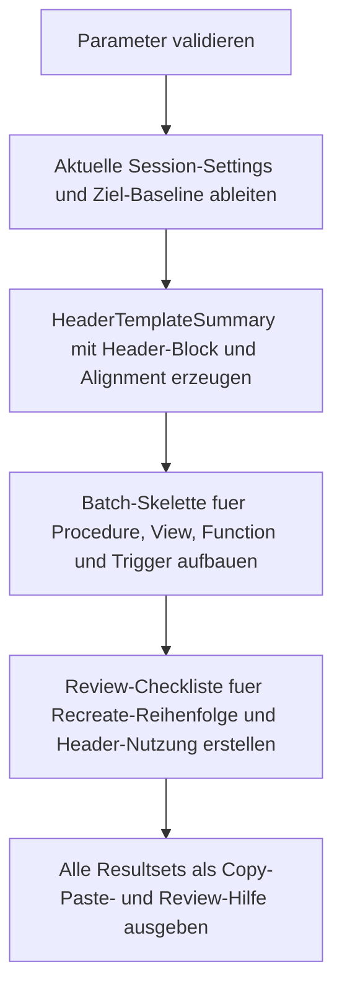

# RecreateScriptHeaderTemplate.sql

Dieses Skript liefert wiederverwendbare Script-Header und Batch-Skelette fuer das Recreate von SQL-Modulen. Es verbindet eine explizite `ANSI_NULLS`-/`QUOTED_IDENTIFIER`-Baseline mit kompakten Recreate-Templates, damit Header und Moduldefinition im gleichen Batch-Kontext planbar bleiben.

## Uebersicht

<!-- SQLDOC:SUMMARY_TABLE:BEGIN -->
| Feld | Wert |
|---|---|
| Script | [RecreateScriptHeaderTemplate.sql](RecreateScriptHeaderTemplate.sql) |
| Version | `1.0` |
| Typ | `template` |
| Kapitel | `21_QUOTED_IDENTIFIER` |
| Sicherheit | `read-only` |
| Zweck | Wiederverwendbare Header- und Batch-Skelette fuer Modul-Recreates mit konsistenter Session-Baseline. |
<!-- SQLDOC:SUMMARY_TABLE:END -->

## Einordnung

Im Kapitel `21_QUOTED_IDENTIFIER` reicht eine reine Modul-Inventur oft nicht aus. Sobald ein Modul neu erstellt oder rekonstruierte Definitionen erneut kompiliert werden sollen, muss der Session-Header sauber mitgefuehrt werden. Dieses Skript konzentriert sich genau auf diesen kleinen, aber fehleranfaelligen Teil des Recreate-Prozesses.

## Annahmen

- Die Erstversion bleibt absichtlich lesend und liefert nur Template-Text statt automatischer DDL-Ausfuehrung.
- Eine moderne Baseline mit `SET ANSI_NULLS ON;` und `SET QUOTED_IDENTIFIER ON;` ist der Standardfall, kann aber per Parameter variiert werden.
- Die erzeugten Objekt- und Tabellennamen sind neutrale Platzhalter fuer Review und Copy-Paste, nicht produktive Zielnamen.
- Vor produktiver Nutzung muessen die originale Moduldefinition, Abhaengigkeiten und das passende `CREATE`-/`ALTER`-Muster manuell bestaetigt werden.

## Anwendungsfall

Die erste Ausgabe zeigt, ob die aktuelle Session bereits zur Ziel-Baseline passt. Die zweite Ausgabe liefert pro Modultyp direkt nutzbare Header- und Batch-Skelette. Die dritte Ausgabe verdichtet die wichtigsten Review-Schritte, damit Recreates nicht nur technisch kompiliert, sondern auch reproduzierbar dokumentiert werden.

## Parameter

<!-- SQLDOC:PARAMETERS_TABLE:BEGIN -->
| Parameter | SQL-Typ | Pflicht | Beschreibung |
|---|---|---|---|
| `@ExpectedAnsiNulls` | `BIT` | Nein | Zielwert fuer `SET ANSI_NULLS` im Recreate-Header. |
| `@ExpectedQuotedIdentifier` | `BIT` | Nein | Zielwert fuer `SET QUOTED_IDENTIFIER` im Recreate-Header. |
| `@ModuleSchema` | `SYSNAME` | Nein | Schema-Praefix fuer die Beispielmodule im Template. |
| `@ModuleName` | `SYSNAME` | Nein | Basename fuer Beispielmodule und Platzhalterobjekte. |
| `@IncludeCreateOrAlter` | `BIT` | Nein | Nutzt bei `1` fuer Procedure und Function ein `CREATE OR ALTER`-Muster. |
| `@IncludeReviewChecklist` | `BIT` | Nein | Ergaenzt bei `1` Kommentarzeilen fuer Review und manuelle Nacharbeit. |
<!-- SQLDOC:PARAMETERS_TABLE:END -->

## Abhaengigkeiten

<!-- SQLDOC:DEPENDENCIES_LIST:BEGIN -->
- `SESSIONPROPERTY`
- `SET ANSI_NULLS`
- `SET QUOTED_IDENTIFIER`
- `CREATE OR ALTER`
- `temp tables`
<!-- SQLDOC:DEPENDENCIES_LIST:END -->

## Hinweise

- `HeaderTemplateSummary` zeigt Ist- und Soll-Kontext der Session plus den empfohlenen Header-Block.
- `RecreateHeaderTemplates` trennt den Session-Header mit `GO` sauber von der eigentlichen Moduldefinition.
- Fuer Views und Trigger bleibt die Vorlage bewusst bei klassischem `CREATE`, damit die Batch-Struktur klar sichtbar bleibt.
- Die Templates markieren nur den Rahmen; die echte Definition, Rechte und Deploy-Reihenfolge muessen weiterhin bewusst geprueft werden.

## Versionshistorie

<!-- SQLDOC:VERSION_HISTORY_TABLE:BEGIN -->
| Version | Datum | User | Beschreibung |
|---|---|---|---|
| `1.0` | `2026-04-22` | `ER` | Erstversion der Header-Vorlage fuer Modul-Recreates |
<!-- SQLDOC:VERSION_HISTORY_TABLE:END -->

## Ablauf

<!-- SQLDOC:MERMAID:BEGIN -->

<!-- SQLDOC:MERMAID:END -->

## SQL-Code

<!-- SQLDOC:SQL_CODE:BEGIN -->
```sql
/*
BEGIN:SQL-HEADER v1
---
sql_header: v1
script_name: "RecreateScriptHeaderTemplate.sql"
script_version: "1.0"
script_type: "template"
chapter: "21_QUOTED_IDENTIFIER"

purpose: >
  Liefert wiederverwendbare Script-Header und Batch-Skelette fuer das
  Recreate von SQL-Modulen. Das Skript bildet eine Ziel-Baseline fuer
  ANSI_NULLS und QUOTED_IDENTIFIER ab, erzeugt Header-Varianten fuer
  typische Recreate-Szenarien und stellt knappe Hinweise fuer die manuelle
  Nacharbeit bereit.

parameters:
  - name: "@ExpectedAnsiNulls"
    sql_type: "BIT"
    direction: "IN"
    required: false
    description: "Zielwert fuer SET ANSI_NULLS im Recreate-Header"
  - name: "@ExpectedQuotedIdentifier"
    sql_type: "BIT"
    direction: "IN"
    required: false
    description: "Zielwert fuer SET QUOTED_IDENTIFIER im Recreate-Header"
  - name: "@ModuleSchema"
    sql_type: "SYSNAME"
    direction: "IN"
    required: false
    description: "Schema-Praefix fuer die Beispielmodule im Header-Template"
  - name: "@ModuleName"
    sql_type: "SYSNAME"
    direction: "IN"
    required: false
    description: "Basename fuer die Beispielmodule im Header-Template"
  - name: "@IncludeCreateOrAlter"
    sql_type: "BIT"
    direction: "IN"
    required: false
    description: "1 = fuer Procedure und Function CREATE OR ALTER im Template verwenden"
  - name: "@IncludeReviewChecklist"
    sql_type: "BIT"
    direction: "IN"
    required: false
    description: "1 = ergaenzende Kommentarzeilen fuer Review und Recreate-Reihenfolge aufnehmen"

result_sets:
  - name: "HeaderTemplateSummary"
    description: "Ziel-Baseline, aktueller Session-Kontext und Kernentscheidungen fuer den Recreate-Header"
  - name: "RecreateHeaderTemplates"
    description: "Direkt nutzbare Header- und Batch-Skelette fuer verschiedene Modultypen"
  - name: "HeaderReviewChecklist"
    description: "Knappe Pruefschritte fuer die manuelle Nacharbeit vor dem echten Recreate"

dependencies:
  - "SESSIONPROPERTY"
  - "SET ANSI_NULLS"
  - "SET QUOTED_IDENTIFIER"
  - "CREATE OR ALTER"
  - "temp tables"

safety:
  level: "read-only"
  writes_data: false

documentation:
  markdown_file: "T-SQL/21_QUOTED_IDENTIFIER/SQLScripts/RecreateScriptHeaderTemplate.md"
  sync_blocks:
    - "SUMMARY_TABLE"
    - "PARAMETERS_TABLE"
    - "DEPENDENCIES_LIST"
    - "VERSION_HISTORY_TABLE"
    - "SQL_CODE"
  mermaid:
    mode: "ai-agent-from-sql"
    source: "script-body"

main_responsible:
  name: "Erhard Rainer"
  initials: "ER"

version_history:
  - version: "1.0"
    date: "2026-04-22"
    user: "ER"
    description: "Erstversion der Header-Vorlage fuer Modul-Recreates"

notes:
  - "Das Skript fuehrt keine DDL aus, sondern gibt nur wiederverwendbare Header- und Batch-Fragmente aus."
  - "Die erzeugten Templates sollen vor produktiver Nutzung bewusst manuell vervollstaendigt werden."
---
END:SQL-HEADER v1
*/

SET NOCOUNT ON;

DECLARE @ExpectedAnsiNulls BIT = 1;
DECLARE @ExpectedQuotedIdentifier BIT = 1;
DECLARE @ModuleSchema SYSNAME = N'dbo';
DECLARE @ModuleName SYSNAME = N'SampleModule';
DECLARE @IncludeCreateOrAlter BIT = 1;
DECLARE @IncludeReviewChecklist BIT = 1;

IF @ExpectedAnsiNulls NOT IN (0, 1)
BEGIN
    THROW 50000, '@ExpectedAnsiNulls muss 0 oder 1 sein.', 1;
END;

IF @ExpectedQuotedIdentifier NOT IN (0, 1)
BEGIN
    THROW 50001, '@ExpectedQuotedIdentifier muss 0 oder 1 sein.', 1;
END;

IF @IncludeCreateOrAlter NOT IN (0, 1)
BEGIN
    THROW 50002, '@IncludeCreateOrAlter muss 0 oder 1 sein.', 1;
END;

IF @IncludeReviewChecklist NOT IN (0, 1)
BEGIN
    THROW 50003, '@IncludeReviewChecklist muss 0 oder 1 sein.', 1;
END;

IF @ModuleSchema IS NULL OR LTRIM(RTRIM(@ModuleSchema)) = N''
BEGIN
    THROW 50004, '@ModuleSchema darf nicht leer sein.', 1;
END;

IF @ModuleName IS NULL OR LTRIM(RTRIM(@ModuleName)) = N''
BEGIN
    THROW 50005, '@ModuleName darf nicht leer sein.', 1;
END;

DECLARE @ExpectedAnsiNullsText VARCHAR(3) =
    CASE @ExpectedAnsiNulls WHEN 1 THEN 'ON' ELSE 'OFF' END;
DECLARE @ExpectedQuotedIdentifierText VARCHAR(3) =
    CASE @ExpectedQuotedIdentifier WHEN 1 THEN 'ON' ELSE 'OFF' END;
DECLARE @CurrentAnsiNullsText VARCHAR(3) =
    CASE WHEN SESSIONPROPERTY('ANSI_NULLS') = 1 THEN 'ON' ELSE 'OFF' END;
DECLARE @CurrentQuotedIdentifierText VARCHAR(3) =
    CASE WHEN SESSIONPROPERTY('QUOTED_IDENTIFIER') = 1 THEN 'ON' ELSE 'OFF' END;
DECLARE @HeaderBlock NVARCHAR(200) =
    N'SET ANSI_NULLS ' + @ExpectedAnsiNullsText + N';'
    + CHAR(13) + CHAR(10)
    + N'SET QUOTED_IDENTIFIER ' + @ExpectedQuotedIdentifierText + N';';
DECLARE @QualifiedProcedureName NVARCHAR(517) =
    QUOTENAME(@ModuleSchema) + N'.' + QUOTENAME(@ModuleName + N'Procedure');
DECLARE @QualifiedViewName NVARCHAR(517) =
    QUOTENAME(@ModuleSchema) + N'.' + QUOTENAME(@ModuleName + N'View');
DECLARE @QualifiedFunctionName NVARCHAR(517) =
    QUOTENAME(@ModuleSchema) + N'.' + QUOTENAME(@ModuleName + N'Function');
DECLARE @QualifiedTriggerName NVARCHAR(517) =
    QUOTENAME(@ModuleSchema) + N'.' + QUOTENAME(@ModuleName + N'Trigger');
DECLARE @QualifiedTableName NVARCHAR(517) =
    QUOTENAME(@ModuleSchema) + N'.' + QUOTENAME(@ModuleName + N'Table');

DROP TABLE IF EXISTS #HeaderTemplateSummary;
DROP TABLE IF EXISTS #RecreateHeaderTemplates;
DROP TABLE IF EXISTS #HeaderReviewChecklist;

CREATE TABLE #HeaderTemplateSummary
(
    template_scope                VARCHAR(80)    NOT NULL,
    current_ansi_nulls            VARCHAR(3)     NOT NULL,
    current_quoted_identifier     VARCHAR(3)     NOT NULL,
    expected_ansi_nulls           VARCHAR(3)     NOT NULL,
    expected_quoted_identifier    VARCHAR(3)     NOT NULL,
    alignment_status              VARCHAR(24)    NOT NULL,
    header_block                  NVARCHAR(200)  NOT NULL,
    usage_note                    NVARCHAR(260)  NOT NULL
);

INSERT INTO #HeaderTemplateSummary
(
    template_scope,
    current_ansi_nulls,
    current_quoted_identifier,
    expected_ansi_nulls,
    expected_quoted_identifier,
    alignment_status,
    header_block,
    usage_note
)
VALUES
(
    'ModuleRecreateHeader',
    @CurrentAnsiNullsText,
    @CurrentQuotedIdentifierText,
    @ExpectedAnsiNullsText,
    @ExpectedQuotedIdentifierText,
    CASE
        WHEN @CurrentAnsiNullsText = @ExpectedAnsiNullsText
         AND @CurrentQuotedIdentifierText = @ExpectedQuotedIdentifierText THEN 'Aligned'
        ELSE 'HeaderRequired'
    END,
    @HeaderBlock,
    CASE
        WHEN @CurrentAnsiNullsText = @ExpectedAnsiNullsText
         AND @CurrentQuotedIdentifierText = @ExpectedQuotedIdentifierText
            THEN 'Die Session passt bereits zur Ziel-Baseline, der Header soll im Recreate-Skript trotzdem explizit stehen.'
        ELSE 'Die Session weicht von der Ziel-Baseline ab; das Recreate-Skript muss den Header selbst tragen.'
    END
);

SELECT
    hts.template_scope,
    hts.current_ansi_nulls,
    hts.current_quoted_identifier,
    hts.expected_ansi_nulls,
    hts.expected_quoted_identifier,
    hts.alignment_status,
    hts.header_block,
    hts.usage_note
FROM #HeaderTemplateSummary AS hts;

CREATE TABLE #RecreateHeaderTemplates
(
    template_order                INT            NOT NULL,
    module_type                   VARCHAR(40)    NOT NULL,
    recreate_goal                 NVARCHAR(180)  NOT NULL,
    recommended_pattern           VARCHAR(24)    NOT NULL,
    header_template               NVARCHAR(MAX)  NOT NULL,
    review_focus                  NVARCHAR(260)  NOT NULL
);

INSERT INTO #RecreateHeaderTemplates
(
    template_order,
    module_type,
    recreate_goal,
    recommended_pattern,
    header_template,
    review_focus
)
VALUES
(
    1,
    'StoredProcedure',
    N'Recreate-Batch fuer gespeicherte Prozeduren mit klar getrenntem Session-Header.',
    CASE WHEN @IncludeCreateOrAlter = 1 THEN 'CREATE OR ALTER' ELSE 'CREATE' END,
    CASE WHEN @IncludeReviewChecklist = 1
        THEN N'-- Recreate template for ' + @QualifiedProcedureName + CHAR(13) + CHAR(10)
             + N'-- 1. Definition aus Quelle oder Repository einfuegen.' + CHAR(13) + CHAR(10)
             + N'-- 2. CREATE bei Bedarf auf ALTER oder CREATE OR ALTER abstimmen.' + CHAR(13) + CHAR(10)
        ELSE N''
    END
    + @HeaderBlock + CHAR(13) + CHAR(10)
    + N'GO' + CHAR(13) + CHAR(10)
    + CASE WHEN @IncludeCreateOrAlter = 1
        THEN N'CREATE OR ALTER PROCEDURE ' + @QualifiedProcedureName
        ELSE N'CREATE PROCEDURE ' + @QualifiedProcedureName
      END + CHAR(13) + CHAR(10)
    + N'AS' + CHAR(13) + CHAR(10)
    + N'BEGIN' + CHAR(13) + CHAR(10)
    + N'    SET NOCOUNT ON;' + CHAR(13) + CHAR(10)
    + N'    -- TODO: Definition oder Recreate-Inhalt hier einfuegen.' + CHAR(13) + CHAR(10)
    + N'END;' + CHAR(13) + CHAR(10)
    + N'GO',
    N'Vor dem Deploy pruefen, ob bestehende Berechtigungen, Signaturen oder Abhaengigkeiten einen gesonderten Recreate-Ablauf benoetigen.'
),
(
    2,
    'View',
    N'Header-Vorlage fuer Views oder schemagebundene Ableitungen mit stabilem QUOTED_IDENTIFIER-Kontext.',
    'CREATE VIEW',
    CASE WHEN @IncludeReviewChecklist = 1
        THEN N'-- Recreate template for ' + @QualifiedViewName + CHAR(13) + CHAR(10)
             + N'-- 1. Bei schemagebundenen oder indexierten Views Abhaengigkeiten vorab pruefen.' + CHAR(13) + CHAR(10)
             + N'-- 2. Recreate nur mit bewusstem Session-Header ausfuehren.' + CHAR(13) + CHAR(10)
        ELSE N''
    END
    + @HeaderBlock + CHAR(13) + CHAR(10)
    + N'GO' + CHAR(13) + CHAR(10)
    + N'CREATE VIEW ' + @QualifiedViewName + CHAR(13) + CHAR(10)
    + N'AS' + CHAR(13) + CHAR(10)
    + N'SELECT' + CHAR(13) + CHAR(10)
    + N'    CAST(1 AS INT) AS [DemoId],' + CHAR(13) + CHAR(10)
    + N'    N''Replace with recovered view definition.'' AS [ReviewNote];' + CHAR(13) + CHAR(10)
    + N'GO',
    N'Views reagieren besonders empfindlich auf inkonsistente Header, wenn spaeter schemagebundene oder indexierte Varianten aufgebaut werden.'
),
(
    3,
    'Function',
    N'Recreate-Skelett fuer skalare oder tabellarische Funktionen mit explizitem Header und GO-Trennung.',
    CASE WHEN @IncludeCreateOrAlter = 1 THEN 'CREATE OR ALTER' ELSE 'CREATE' END,
    CASE WHEN @IncludeReviewChecklist = 1
        THEN N'-- Recreate template for ' + @QualifiedFunctionName + CHAR(13) + CHAR(10)
             + N'-- 1. Rueckgabetyp und Parameter an der Originaldefinition ausrichten.' + CHAR(13) + CHAR(10)
             + N'-- 2. Bei Inline-TVFs die SELECT-Definition unvermischt uebernehmen.' + CHAR(13) + CHAR(10)
        ELSE N''
    END
    + @HeaderBlock + CHAR(13) + CHAR(10)
    + N'GO' + CHAR(13) + CHAR(10)
    + CASE WHEN @IncludeCreateOrAlter = 1
        THEN N'CREATE OR ALTER FUNCTION ' + @QualifiedFunctionName + N' (@InputValue INT)'
        ELSE N'CREATE FUNCTION ' + @QualifiedFunctionName + N' (@InputValue INT)'
      END + CHAR(13) + CHAR(10)
    + N'RETURNS INT' + CHAR(13) + CHAR(10)
    + N'AS' + CHAR(13) + CHAR(10)
    + N'BEGIN' + CHAR(13) + CHAR(10)
    + N'    RETURN @InputValue;' + CHAR(13) + CHAR(10)
    + N'END;' + CHAR(13) + CHAR(10)
    + N'GO',
    N'Bei Funktionen muessen Rueckgabetyp, SET-Header und spaetere Aufrufer konsistent bleiben, damit Recreates keine stillen Seiteneffekte erzeugen.'
),
(
    4,
    'Trigger',
    N'Header-Vorlage fuer Trigger-Recreates mit getrenntem GO-Block und klar markiertem Zielobjekt.',
    'CREATE TRIGGER',
    CASE WHEN @IncludeReviewChecklist = 1
        THEN N'-- Recreate template for ' + @QualifiedTriggerName + CHAR(13) + CHAR(10)
             + N'-- 1. Zieltabelle, Trigger-Typ und Reihenfolge mit dem echten Objekt abgleichen.' + CHAR(13) + CHAR(10)
             + N'-- 2. Trigger nur nach Ruecksicherung der Fachlogik neu kompilieren.' + CHAR(13) + CHAR(10)
        ELSE N''
    END
    + @HeaderBlock + CHAR(13) + CHAR(10)
    + N'GO' + CHAR(13) + CHAR(10)
    + N'CREATE TRIGGER ' + @QualifiedTriggerName + CHAR(13) + CHAR(10)
    + N'ON ' + @QualifiedTableName + CHAR(13) + CHAR(10)
    + N'AFTER INSERT' + CHAR(13) + CHAR(10)
    + N'AS' + CHAR(13) + CHAR(10)
    + N'BEGIN' + CHAR(13) + CHAR(10)
    + N'    SET NOCOUNT ON;' + CHAR(13) + CHAR(10)
    + N'    SELECT COUNT(*) AS inserted_rows FROM inserted;' + CHAR(13) + CHAR(10)
    + N'END;' + CHAR(13) + CHAR(10)
    + N'GO',
    N'Trigger-Recreates brauchen oft zusaetzliche Abstimmung zu Zieltabellen, Abhaengigkeiten und Deploy-Reihenfolgen.'
);

SELECT
    rht.module_type,
    rht.recreate_goal,
    rht.recommended_pattern,
    rht.header_template,
    rht.review_focus
FROM #RecreateHeaderTemplates AS rht
ORDER BY
    rht.template_order;

CREATE TABLE #HeaderReviewChecklist
(
    step_no                       INT            NOT NULL,
    review_phase                  VARCHAR(40)    NOT NULL,
    instruction_text              NVARCHAR(260)  NOT NULL,
    why_it_matters                NVARCHAR(260)  NOT NULL,
    recommended_artifact          NVARCHAR(260)  NOT NULL
);

INSERT INTO #HeaderReviewChecklist
(
    step_no,
    review_phase,
    instruction_text,
    why_it_matters,
    recommended_artifact
)
VALUES
    (1, 'Baseline', N'Den Ziel-Header fuer ANSI_NULLS und QUOTED_IDENTIFIER vor dem Recreate explizit festlegen.', N'Der Capture-Kontext des Moduls soll reproduzierbar aus dem Skript und nicht aus der Client-Session entstehen.', @HeaderBlock),
    (2, 'Source', N'Die rekonstruierte Definition ohne zusaetzliche SET-Umschaltungen zwischen Header und Modultext platzieren.', N'Der Header soll exakt fuer den folgenden Compile-Batch gelten.', N'GO plus unvermischte Moduldefinition'),
    (3, 'ObjectType', N'CREATE, ALTER oder CREATE OR ALTER passend zum Modultyp und Deployment-Szenario waehlen.', N'Nicht jeder Objekttyp erlaubt dieselben Recreate-Muster oder dieselbe Downtime-Strategie.', N'Objekttypspezifisches Template aus dem Resultset'),
    (4, 'Dependencies', N'Vor dem Ausfuehren Abhaengigkeiten wie schemagebundene Views, Signaturen oder Rechte pruefen.', N'Recreates koennen sonst technisch erfolgreich kompilieren, aber fachlich oder sicherheitlich Regressionen hinterlassen.', N'Review-Checkliste oder Deployment-Notiz'),
    (5, 'Execution', N'Nur den final bereinigten Batch deployen und Alt-Header nicht parallel weiterverwenden.', N'Gemischte Session-Kontexte sind eine typische Ursache fuer inkonsistente Modul-Metadaten.', N'Ein Batch pro Modul oder klar getrennte GO-Bloecke');

SELECT
    hrc.step_no,
    hrc.review_phase,
    hrc.instruction_text,
    hrc.why_it_matters,
    hrc.recommended_artifact
FROM #HeaderReviewChecklist AS hrc
ORDER BY
    hrc.step_no;
```
<!-- SQLDOC:SQL_CODE:END -->
