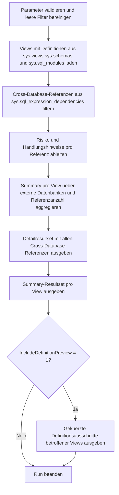

# CrossDatabaseViewReferenceAudit.sql

Dieses Skript zeigt Views der aktuellen Datenbank, die auf Objekte in anderen Datenbanken verweisen. Der Fokus liegt auf einem rein lesenden Metadaten-Audit, damit externe Abhaengigkeiten frueh sichtbar werden und bei Deployments, Berechtigungspruefungen oder Datenbankumbenennungen gezielt abgesichert werden koennen.

## Uebersicht

<!-- SQLDOC:SUMMARY_TABLE:BEGIN -->
| Feld | Wert |
|---|---|
| Script | [CrossDatabaseViewReferenceAudit.sql](CrossDatabaseViewReferenceAudit.sql) |
| Version | `1.0` |
| Typ | `diagnostic-query` |
| Kapitel | `22_Views_Schemata` |
| Sicherheit | `read-only` |
| Zweck | Zeigt Views mit datenbankuebergreifenden Referenzen und verdichtet das Risiko je View. |
<!-- SQLDOC:SUMMARY_TABLE:END -->

## Einordnung

Cross-Database-Views koennen fachlich sinnvoll sein, bringen aber zusaetzliche Kopplung in Deployments, Berechtigungen und Betriebsablaeufe. Das Skript stellt deshalb Detailreferenzen, eine verdichtete Summary pro View und optional einen Ausschnitt der View-Definition nebeneinander bereit.

## Annahmen

- Die Analyse bleibt auf die Metadaten der aktuellen Datenbank beschraenkt; externe Datenbanken werden nur ueber gespeicherte Referenzinformationen betrachtet.
- Cross-Database-Referenzen gelten hier als Architekturmerkmal und werden nur dann hoeher priorisiert, wenn zusaetzliche Risiken wie Remote-Server, unvollstaendige Aufloesung oder fehlendes SCHEMABINDING sichtbar werden.
- Der Definitionsausschnitt ist bewusst auf eine kurze Vorschau begrenzt und ersetzt keine vollstaendige Code-Review der View.

## Anwendungsfall

Das Skript eignet sich fuer Architektur-Reviews, Release-Vorbereitung und Berechtigungspruefungen in Trainings- oder Analyseumgebungen. Es hilft besonders dann, wenn Views ueber mehrere Datenbanken hinweg Daten bereitstellen oder bei einer Trennung von Fach- und Reporting-Datenbanken Abhaengigkeiten transparent gemacht werden sollen.

## Parameter

<!-- SQLDOC:PARAMETERS_TABLE:BEGIN -->
| Parameter | SQL-Typ | Pflicht | Beschreibung |
|---|---|---|---|
| `@SchemaNameLike` | `SYSNAME` | Nein | Optionales LIKE-Muster, um nur Views aus passenden Schemata zu analysieren. |
| `@ReferencedDatabaseLike` | `SYSNAME` | Nein | Optionales LIKE-Muster fuer den Namen externer Datenbanken. |
| `@IncludeDefinitionPreview` | `BIT` | Nein | Gibt bei `1` ein zusaetzliches Resultset mit gekuerzten View-Definitionen aus. |
<!-- SQLDOC:PARAMETERS_TABLE:END -->

## Abhaengigkeiten

<!-- SQLDOC:DEPENDENCIES_LIST:BEGIN -->
- `sys.views`
- `sys.schemas`
- `sys.sql_modules`
- `sys.sql_expression_dependencies`
- `sys.objects`
<!-- SQLDOC:DEPENDENCIES_LIST:END -->

## Hinweise

- Das Detailresultset zeigt pro View jede erkannte datenbankuebergreifende Referenz inklusive Zielobjekt und Handlungshinweis.
- Die Summary fasst Anzahl externer Datenbanken und Referenzen je View zusammen und hebt hoehere Betriebsrisiken zuerst hervor.
- Ein Remote-Server in der Referenz wird strenger bewertet, weil dann neben der Fremddatenbank auch Netzwerk- und Security-Aspekte relevant werden.

## Versionshistorie

<!-- SQLDOC:VERSION_HISTORY_TABLE:BEGIN -->
| Version | Datum | User | Beschreibung |
|---|---|---|---|
| `1.0` | `2026-04-22` | `ER` | Erstversion des Cross-Database-View-Audits |
<!-- SQLDOC:VERSION_HISTORY_TABLE:END -->

## Ablauf

<!-- SQLDOC:MERMAID:BEGIN -->

<!-- SQLDOC:MERMAID:END -->

## SQL-Code

<!-- SQLDOC:SQL_CODE:BEGIN -->
```sql
/*
BEGIN:SQL-HEADER v1
---
sql_header: v1
script_name: "CrossDatabaseViewReferenceAudit.sql"
script_version: "1.0"
script_type: "diagnostic-query"
chapter: "22_Views_Schemata"

purpose: >
  Zeigt Views mit datenbankuebergreifenden Referenzen in der aktuellen
  Datenbank. Das Skript nutzt Metadaten aus sys.views, sys.sql_modules und
  sys.sql_expression_dependencies, um referenzierte Datenbanken, Zielobjekte
  und eine kompakte Risikoeinschaetzung pro View zusammenzufassen.

parameters:
  - name: "@SchemaNameLike"
    sql_type: "SYSNAME"
    direction: "IN"
    required: false
    description: "Optionales LIKE-Muster fuer View-Schemata"
  - name: "@ReferencedDatabaseLike"
    sql_type: "SYSNAME"
    direction: "IN"
    required: false
    description: "Optionales LIKE-Muster fuer referenzierte Datenbanknamen"
  - name: "@IncludeDefinitionPreview"
    sql_type: "BIT"
    direction: "IN"
    required: false
    description: "1 = zusaetzliches Resultset mit Definitionausschnitten betroffener Views ausgeben"

result_sets:
  - name: "CrossDatabaseReferences"
    description: "Detailansicht je View und datenbankuebergreifender Referenz"
  - name: "CrossDatabaseViewSummary"
    description: "Verdichtete Sicht pro View mit Anzahl externer Datenbanken und Referenzen"
  - name: "DefinitionPreview"
    description: "Optionaler Definitionsausschnitt fuer Views mit Cross-Database-Referenzen"

dependencies:
  - "sys.views"
  - "sys.schemas"
  - "sys.sql_modules"
  - "sys.sql_expression_dependencies"
  - "sys.objects"

safety:
  level: "read-only"
  writes_data: false

documentation:
  markdown_file: "T-SQL/22_Views_Schemata/SQLScripts/CrossDatabaseViewReferenceAudit.md"
  sync_blocks:
    - "SUMMARY_TABLE"
    - "PARAMETERS_TABLE"
    - "DEPENDENCIES_LIST"
    - "VERSION_HISTORY_TABLE"
    - "SQL_CODE"
  mermaid:
    mode: "ai-agent-from-sql"
    source: "script-body"

main_responsible:
  name: "Erhard Rainer"
  initials: "ER"

version_history:
  - version: "1.0"
    date: "2026-04-22"
    user: "ER"
    description: "Erstversion des Cross-Database-View-Audits"

notes:
  - "Das Skript bewertet nur Metadaten der aktuellen Datenbank und fuehrt keine Aenderungen aus."
  - "Cross-Database-Referenzen werden als Architektur- und Betriebsmerkmal dokumentiert, nicht pauschal als Fehler."
---
END:SQL-HEADER v1
*/

SET NOCOUNT ON;

DECLARE @SchemaNameLike SYSNAME = NULL;
DECLARE @ReferencedDatabaseLike SYSNAME = NULL;
DECLARE @IncludeDefinitionPreview BIT = 1;

IF @IncludeDefinitionPreview NOT IN (0, 1)
BEGIN
    THROW 50020, '@IncludeDefinitionPreview muss 0 oder 1 sein.', 1;
END;

IF @SchemaNameLike IS NOT NULL AND LTRIM(RTRIM(@SchemaNameLike)) = ''
BEGIN
    SET @SchemaNameLike = NULL;
END;

IF @ReferencedDatabaseLike IS NOT NULL AND LTRIM(RTRIM(@ReferencedDatabaseLike)) = ''
BEGIN
    SET @ReferencedDatabaseLike = NULL;
END;

DROP TABLE IF EXISTS #ViewInventory;
DROP TABLE IF EXISTS #CrossDatabaseDependencies;
DROP TABLE IF EXISTS #CrossDatabaseSummary;

CREATE TABLE #ViewInventory
(
    view_object_id      INT            NOT NULL,
    schema_name         SYSNAME        NOT NULL,
    view_name           SYSNAME        NOT NULL,
    full_view_name      NVARCHAR(517)  NOT NULL,
    uses_schemabinding  BIT            NOT NULL,
    definition_text     NVARCHAR(MAX)  NOT NULL
);

INSERT INTO #ViewInventory
(
    view_object_id,
    schema_name,
    view_name,
    full_view_name,
    uses_schemabinding,
    definition_text
)
SELECT
    v.object_id,
    s.name AS schema_name,
    v.name AS view_name,
    QUOTENAME(s.name) + N'.' + QUOTENAME(v.name) AS full_view_name,
    CONVERT(BIT, OBJECTPROPERTY(v.object_id, 'IsSchemaBound')),
    sm.definition
FROM sys.views AS v
INNER JOIN sys.schemas AS s
    ON s.schema_id = v.schema_id
INNER JOIN sys.sql_modules AS sm
    ON sm.object_id = v.object_id
WHERE @SchemaNameLike IS NULL
   OR s.name LIKE @SchemaNameLike;

CREATE TABLE #CrossDatabaseDependencies
(
    full_view_name            NVARCHAR(517)  NOT NULL,
    schema_name               SYSNAME        NOT NULL,
    view_name                 SYSNAME        NOT NULL,
    referenced_database_name  SYSNAME        NOT NULL,
    referenced_schema_name    SYSNAME        NULL,
    referenced_entity_name    SYSNAME        NULL,
    referenced_server_name    SYSNAME        NULL,
    referenced_class_desc     NVARCHAR(60)   NOT NULL,
    target_entity_display     NVARCHAR(900)  NOT NULL,
    is_schema_bound_reference BIT            NOT NULL,
    risk_level                VARCHAR(10)    NOT NULL,
    finding                   NVARCHAR(260)  NOT NULL,
    recommended_action        NVARCHAR(260)  NOT NULL
);

INSERT INTO #CrossDatabaseDependencies
(
    full_view_name,
    schema_name,
    view_name,
    referenced_database_name,
    referenced_schema_name,
    referenced_entity_name,
    referenced_server_name,
    referenced_class_desc,
    target_entity_display,
    is_schema_bound_reference,
    risk_level,
    finding,
    recommended_action
)
SELECT
    vi.full_view_name,
    vi.schema_name,
    vi.view_name,
    sed.referenced_database_name,
    sed.referenced_schema_name,
    sed.referenced_entity_name,
    sed.referenced_server_name,
    sed.referenced_class_desc,
    COALESCE(QUOTENAME(sed.referenced_server_name) + N'.', N'')
        + QUOTENAME(sed.referenced_database_name)
        + COALESCE(N'.' + QUOTENAME(sed.referenced_schema_name), N'')
        + COALESCE(N'.' + QUOTENAME(sed.referenced_entity_name), N'') AS target_entity_display,
    CONVERT(BIT, sed.is_schema_bound_reference) AS is_schema_bound_reference,
    CASE
        WHEN sed.referenced_server_name IS NOT NULL THEN 'High'
        WHEN sed.referenced_schema_name IS NULL OR sed.referenced_entity_name IS NULL THEN 'Medium'
        WHEN vi.uses_schemabinding = 0 THEN 'Medium'
        ELSE 'Low'
    END AS risk_level,
    CASE
        WHEN sed.referenced_server_name IS NOT NULL
            THEN N'Verweis nutzt einen Linked- oder Remote-Server zusaetzlich zur externen Datenbank.'
        WHEN sed.referenced_schema_name IS NULL OR sed.referenced_entity_name IS NULL
            THEN N'Externe Referenz ist nur teilweise in den Metadaten aufgeloest.'
        WHEN vi.uses_schemabinding = 0
            THEN N'Cross-Database-Referenz ohne SCHEMABINDING erhoeht das Drift-Risiko.'
        ELSE N'Cross-Database-Referenz ist explizit dokumentiert.'
    END AS finding,
    CASE
        WHEN sed.referenced_server_name IS NOT NULL
            THEN N'Erreichbarkeit, Security-Kontext und Deployment-Reihenfolge fuer Remote-Abhaengigkeiten pruefen.'
        WHEN sed.referenced_schema_name IS NULL OR sed.referenced_entity_name IS NULL
            THEN N'Definition der View pruefen und externes Zielobjekt praeziser qualifizieren.'
        WHEN vi.uses_schemabinding = 0
            THEN N'Abhaengigkeit in Release-Checks aufnehmen und bei Bedarf Refresh- oder Regressionstests planen.'
        ELSE N'Referenz dokumentieren und bei Datenbank-Renames oder Deployments gezielt mitpruefen.'
    END AS recommended_action
FROM #ViewInventory AS vi
INNER JOIN sys.sql_expression_dependencies AS sed
    ON sed.referencing_id = vi.view_object_id
WHERE sed.referenced_database_name IS NOT NULL
  AND (
        @ReferencedDatabaseLike IS NULL
        OR sed.referenced_database_name LIKE @ReferencedDatabaseLike
      );

CREATE TABLE #CrossDatabaseSummary
(
    full_view_name                 NVARCHAR(517)  NOT NULL,
    referenced_database_count      INT            NOT NULL,
    cross_database_reference_count INT            NOT NULL,
    highest_risk_level             VARCHAR(10)    NOT NULL,
    uses_schemabinding             BIT            NOT NULL,
    recommendation                 NVARCHAR(260)  NOT NULL
);

INSERT INTO #CrossDatabaseSummary
(
    full_view_name,
    referenced_database_count,
    cross_database_reference_count,
    highest_risk_level,
    uses_schemabinding,
    recommendation
)
SELECT
    cdd.full_view_name,
    COUNT(DISTINCT cdd.referenced_database_name) AS referenced_database_count,
    COUNT(*) AS cross_database_reference_count,
    CASE
        WHEN MAX(CASE cdd.risk_level WHEN 'High' THEN 3 WHEN 'Medium' THEN 2 ELSE 1 END) = 3 THEN 'High'
        WHEN MAX(CASE cdd.risk_level WHEN 'High' THEN 3 WHEN 'Medium' THEN 2 ELSE 1 END) = 2 THEN 'Medium'
        ELSE 'Low'
    END AS highest_risk_level,
    MAX(vi.uses_schemabinding) AS uses_schemabinding,
    CASE
        WHEN MAX(CASE cdd.risk_level WHEN 'High' THEN 3 WHEN 'Medium' THEN 2 ELSE 1 END) >= 2
            THEN N'Deployment-Reihenfolge, Security und Regressionstests fuer die externe Abhaengigkeit explizit absichern.'
        ELSE N'Cross-Database-Referenz dokumentieren und in Architekturuebersichten nachfuehren.'
    END AS recommendation
FROM #CrossDatabaseDependencies AS cdd
INNER JOIN #ViewInventory AS vi
    ON vi.full_view_name = cdd.full_view_name
GROUP BY
    cdd.full_view_name;

SELECT
    cdd.full_view_name,
    cdd.referenced_database_name,
    cdd.referenced_schema_name,
    cdd.referenced_entity_name,
    cdd.referenced_server_name,
    cdd.referenced_class_desc,
    cdd.target_entity_display,
    cdd.is_schema_bound_reference,
    cdd.risk_level,
    cdd.finding,
    cdd.recommended_action
FROM #CrossDatabaseDependencies AS cdd
ORDER BY
    CASE cdd.risk_level WHEN 'High' THEN 1 WHEN 'Medium' THEN 2 ELSE 3 END,
    cdd.full_view_name,
    cdd.referenced_database_name,
    cdd.target_entity_display;

SELECT
    cds.full_view_name,
    cds.referenced_database_count,
    cds.cross_database_reference_count,
    cds.highest_risk_level,
    cds.uses_schemabinding,
    cds.recommendation
FROM #CrossDatabaseSummary AS cds
ORDER BY
    CASE cds.highest_risk_level WHEN 'High' THEN 1 WHEN 'Medium' THEN 2 ELSE 3 END,
    cds.cross_database_reference_count DESC,
    cds.full_view_name;

IF @IncludeDefinitionPreview = 1
BEGIN
    SELECT
        vi.full_view_name,
        LEFT(REPLACE(REPLACE(vi.definition_text, CHAR(13), N' '), CHAR(10), N' '), 400) AS definition_preview
    FROM #ViewInventory AS vi
    WHERE EXISTS
    (
        SELECT 1
        FROM #CrossDatabaseDependencies AS cdd
        WHERE cdd.full_view_name = vi.full_view_name
    )
    ORDER BY
        vi.full_view_name;
END;
```
<!-- SQLDOC:SQL_CODE:END -->
