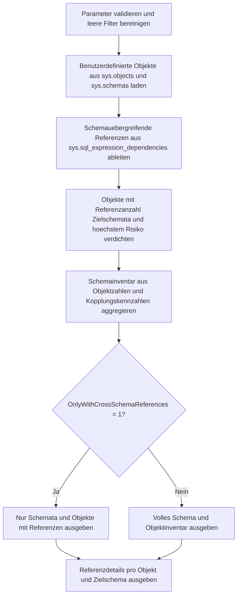

# CrossSchemaObjectInventory.sql

Dieses Skript inventarisiert benutzerdefinierte Objekte der aktuellen Datenbank je Schema und markiert dabei schemauebergreifende Referenzen. Der Fokus liegt auf einem lesenden Metadaten-Audit, das Objektzahlen, Zielschemata und Kopplungsrisiken zusammen in einer uebersichtlichen Form sichtbar macht.

## Uebersicht

<!-- SQLDOC:SUMMARY_TABLE:BEGIN -->
| Feld | Wert |
|---|---|
| Script | [CrossSchemaObjectInventory.sql](CrossSchemaObjectInventory.sql) |
| Version | `1.0` |
| Typ | `diagnostic-query` |
| Kapitel | `22_Views_Schemata` |
| Sicherheit | `read-only` |
| Zweck | Inventar je Schema mit Markierung schemauebergreifender Referenzen. |
<!-- SQLDOC:SUMMARY_TABLE:END -->

## Einordnung

Schemata strukturieren Objekte, entkoppeln Verantwortlichkeiten und beeinflussen Deployment- sowie Berechtigungskonzepte. Das Skript kombiniert deshalb eine Schema-Sicht, ein Objektinventar und die eigentlichen Referenzdetails, damit Kopplungen zwischen Schemata frueh auffallen und gezielt nachverfolgt werden koennen.

## Annahmen

- Das Skript bewertet schemauebergreifende Referenzen als Struktur- und Review-Signal, nicht automatisch als Designfehler.
- Tabellen werden im Inventar mitgefuehrt, koennen aber nur dann schemauebergreifende Referenzen zeigen, wenn Metadaten zu referenzierenden Objekten vorhanden sind.
- Nicht aufloesbare `referenced_id`-Eintraege bleiben als `metadata-only` sichtbar und erhalten eine strengere Review-Note.
- Die Umsetzung bleibt auf die aktuelle Datenbank beschraenkt und fuehrt keine Aenderungen an Objekten oder Berechtigungen aus.

## Anwendungsfall

Das Skript eignet sich fuer Kapitelarbeit zu Views und Schemata, fuer Architektur-Reviews und fuer Refactorings, bei denen Zustands- oder Reportingobjekte zwischen mehreren Schemata verteilt wurden. Besonders hilfreich ist es vor Schema-Neuschnitten, weil betroffene Objekte und deren Zielschemata in einer Reihenfolge nach Kopplungsgrad sichtbar werden.

## Parameter

<!-- SQLDOC:PARAMETERS_TABLE:BEGIN -->
| Parameter | SQL-Typ | Pflicht | Beschreibung |
|---|---|---|---|
| `@SchemaNameLike` | `SYSNAME` | Nein | Optionales LIKE-Muster fuer Quellschemata. |
| `@ObjectTypeLike` | `NVARCHAR(60)` | Nein | Optionales LIKE-Muster fuer Objektarten aus `sys.objects.type_desc`. |
| `@OnlyWithCrossSchemaReferences` | `BIT` | Nein | Zeigt bei `1` nur Schemata und Objekte mit schemauebergreifenden Referenzen. |
<!-- SQLDOC:PARAMETERS_TABLE:END -->

## Abhaengigkeiten

<!-- SQLDOC:DEPENDENCIES_LIST:BEGIN -->
- `sys.objects`
- `sys.schemas`
- `sys.sql_expression_dependencies`
<!-- SQLDOC:DEPENDENCIES_LIST:END -->

## Hinweise

- Das erste Resultset aggregiert Objektzahlen je Schema und priorisiert Schemata mit vielen schemauebergreifenden Referenzen.
- Das zweite Resultset listet die einzelnen Objekte inklusive Zielschema-Liste und hoechster Review-Stufe.
- Das dritte Resultset zeigt die zugrunde liegenden Referenzzeilen und ist damit die technische Detailbasis fuer Nacharbeiten.

## Versionshistorie

<!-- SQLDOC:VERSION_HISTORY_TABLE:BEGIN -->
| Version | Datum | User | Beschreibung |
|---|---|---|---|
| `1.0` | `2026-04-22` | `ER` | Erstversion des schemauebergreifenden Objektinventars |
<!-- SQLDOC:VERSION_HISTORY_TABLE:END -->

## Ablauf

<!-- SQLDOC:MERMAID:BEGIN -->

<!-- SQLDOC:MERMAID:END -->

## SQL-Code

<!-- SQLDOC:SQL_CODE:BEGIN -->
```sql
/*
BEGIN:SQL-HEADER v1
---
sql_header: v1
script_name: "CrossSchemaObjectInventory.sql"
script_version: "1.0"
script_type: "diagnostic-query"
chapter: "22_Views_Schemata"

purpose: >
  Inventarisiert benutzerdefinierte Objekte je Schema und markiert
  schemauebergreifende Referenzen. Das Skript kombiniert
  Objektmetadaten aus sys.objects, sys.schemas und
  sys.sql_expression_dependencies, um Objektzahlen, Zielschemata
  und Kopplungsrisiken kompakt sichtbar zu machen.

parameters:
  - name: "@SchemaNameLike"
    sql_type: "SYSNAME"
    direction: "IN"
    required: false
    description: "Optionales LIKE-Muster fuer Quellschemata"
  - name: "@ObjectTypeLike"
    sql_type: "NVARCHAR(60)"
    direction: "IN"
    required: false
    description: "Optionales LIKE-Muster fuer die Objektart aus sys.objects.type_desc"
  - name: "@OnlyWithCrossSchemaReferences"
    sql_type: "BIT"
    direction: "IN"
    required: false
    description: "1 = nur Objekte mit schemauebergreifender Referenz ausgeben"

result_sets:
  - name: "SchemaInventory"
    description: "Zusammenfassung je Schema mit Objektzahlen und Anzahl schemauebergreifend gekoppelter Objekte"
  - name: "ObjectInventory"
    description: "Detailinventar je Objekt mit Referenzstatus und Zielschemata"
  - name: "CrossSchemaDependencies"
    description: "Detailansicht der erkannten schemauebergreifenden Referenzen"

dependencies:
  - "sys.objects"
  - "sys.schemas"
  - "sys.sql_expression_dependencies"

safety:
  level: "read-only"
  writes_data: false

documentation:
  markdown_file: "T-SQL/22_Views_Schemata/SQLScripts/CrossSchemaObjectInventory.md"
  sync_blocks:
    - "SUMMARY_TABLE"
    - "PARAMETERS_TABLE"
    - "DEPENDENCIES_LIST"
    - "VERSION_HISTORY_TABLE"
    - "SQL_CODE"
  mermaid:
    mode: "ai-agent-from-sql"
    source: "script-body"

main_responsible:
  name: "Erhard Rainer"
  initials: "ER"

version_history:
  - version: "1.0"
    date: "2026-04-22"
    user: "ER"
    description: "Erstversion des schemauebergreifenden Objektinventars"

notes:
  - "Das Skript bleibt rein lesend und bewertet Schemagrenzen als Strukturmerkmal, nicht automatisch als Fehler."
  - "Nicht aufloesbare Referenzen werden als Metadatenhinweis mit erhoehter Pruefprioritaet markiert."
---
END:SQL-HEADER v1
*/

SET NOCOUNT ON;

DECLARE @SchemaNameLike SYSNAME = NULL;
DECLARE @ObjectTypeLike NVARCHAR(60) = NULL;
DECLARE @OnlyWithCrossSchemaReferences BIT = 0;

IF @OnlyWithCrossSchemaReferences NOT IN (0, 1)
BEGIN
    THROW 50040, '@OnlyWithCrossSchemaReferences muss 0 oder 1 sein.', 1;
END;

IF @SchemaNameLike IS NOT NULL AND LTRIM(RTRIM(@SchemaNameLike)) = ''
BEGIN
    SET @SchemaNameLike = NULL;
END;

IF @ObjectTypeLike IS NOT NULL AND LTRIM(RTRIM(@ObjectTypeLike)) = ''
BEGIN
    SET @ObjectTypeLike = NULL;
END;

DROP TABLE IF EXISTS #ObjectInventory;
DROP TABLE IF EXISTS #CrossSchemaDependencies;
DROP TABLE IF EXISTS #ObjectSummary;
DROP TABLE IF EXISTS #SchemaInventory;

CREATE TABLE #ObjectInventory
(
    object_id                        INT             NOT NULL PRIMARY KEY,
    schema_name                      SYSNAME         NOT NULL,
    object_name                      SYSNAME         NOT NULL,
    full_object_name                 NVARCHAR(517)   NOT NULL,
    object_type                      CHAR(2)         NOT NULL,
    object_type_desc                 NVARCHAR(60)    NOT NULL,
    create_date                      DATETIME        NOT NULL,
    modify_date                      DATETIME        NOT NULL
);

INSERT INTO #ObjectInventory
(
    object_id,
    schema_name,
    object_name,
    full_object_name,
    object_type,
    object_type_desc,
    create_date,
    modify_date
)
SELECT
    o.object_id,
    s.name AS schema_name,
    o.name AS object_name,
    QUOTENAME(s.name) + N'.' + QUOTENAME(o.name) AS full_object_name,
    o.type,
    o.type_desc,
    o.create_date,
    o.modify_date
FROM sys.objects AS o
INNER JOIN sys.schemas AS s
    ON s.schema_id = o.schema_id
WHERE o.is_ms_shipped = 0
  AND o.type IN ('V', 'P', 'FN', 'IF', 'TF', 'U')
  AND (@SchemaNameLike IS NULL OR s.name LIKE @SchemaNameLike)
  AND (@ObjectTypeLike IS NULL OR o.type_desc LIKE @ObjectTypeLike);

CREATE TABLE #CrossSchemaDependencies
(
    object_id                        INT             NOT NULL,
    full_object_name                 NVARCHAR(517)   NOT NULL,
    object_type_desc                 NVARCHAR(60)    NOT NULL,
    source_schema_name               SYSNAME         NOT NULL,
    target_schema_name               SYSNAME         NOT NULL,
    target_entity_name               SYSNAME         NULL,
    dependency_scope                 NVARCHAR(40)    NOT NULL,
    is_schema_bound_reference        BIT             NOT NULL,
    is_caller_dependent              BIT             NOT NULL,
    dependency_risk                  VARCHAR(10)     NOT NULL,
    dependency_note                  NVARCHAR(260)   NOT NULL
);

INSERT INTO #CrossSchemaDependencies
(
    object_id,
    full_object_name,
    object_type_desc,
    source_schema_name,
    target_schema_name,
    target_entity_name,
    dependency_scope,
    is_schema_bound_reference,
    is_caller_dependent,
    dependency_risk,
    dependency_note
)
SELECT DISTINCT
    oi.object_id,
    oi.full_object_name,
    oi.object_type_desc,
    oi.schema_name AS source_schema_name,
    COALESCE(target_schema.name, sed.referenced_schema_name) AS target_schema_name,
    COALESCE(target_object.name, sed.referenced_entity_name) AS target_entity_name,
    CASE
        WHEN sed.referenced_id IS NOT NULL THEN 'resolved'
        ELSE 'metadata-only'
    END AS dependency_scope,
    CONVERT(BIT, ISNULL(sed.is_schema_bound_reference, 0)) AS is_schema_bound_reference,
    CONVERT(BIT, ISNULL(sed.is_caller_dependent, 0)) AS is_caller_dependent,
    CASE
        WHEN sed.referenced_id IS NULL THEN 'Medium'
        WHEN ISNULL(sed.is_caller_dependent, 0) = 1 THEN 'Medium'
        ELSE 'Low'
    END AS dependency_risk,
    CASE
        WHEN sed.referenced_id IS NULL THEN N'Schemauebergreifende Referenz ist nur ueber Metadatenname sichtbar.'
        WHEN ISNULL(sed.is_caller_dependent, 0) = 1 THEN N'Referenz ist vom Aufruferkontext abhaengig und sollte gezielt geprueft werden.'
        ELSE N'Schemauebergreifende Referenz ist ueber Metadaten aufloesbar.'
    END AS dependency_note
FROM #ObjectInventory AS oi
INNER JOIN sys.sql_expression_dependencies AS sed
    ON sed.referencing_id = oi.object_id
LEFT JOIN sys.objects AS target_object
    ON target_object.object_id = sed.referenced_id
LEFT JOIN sys.schemas AS target_schema
    ON target_schema.schema_id = target_object.schema_id
WHERE COALESCE(target_schema.name, sed.referenced_schema_name) IS NOT NULL
  AND COALESCE(target_schema.name, sed.referenced_schema_name) <> oi.schema_name;

CREATE TABLE #ObjectSummary
(
    object_id                        INT             NOT NULL PRIMARY KEY,
    full_object_name                 NVARCHAR(517)   NOT NULL,
    schema_name                      SYSNAME         NOT NULL,
    object_type_desc                 NVARCHAR(60)    NOT NULL,
    cross_schema_reference_count     INT             NOT NULL,
    target_schema_count              INT             NOT NULL,
    highest_dependency_risk          VARCHAR(10)     NOT NULL,
    target_schema_list               NVARCHAR(MAX)   NULL
);

INSERT INTO #ObjectSummary
(
    object_id,
    full_object_name,
    schema_name,
    object_type_desc,
    cross_schema_reference_count,
    target_schema_count,
    highest_dependency_risk,
    target_schema_list
)
SELECT
    oi.object_id,
    oi.full_object_name,
    oi.schema_name,
    oi.object_type_desc,
    COUNT(csd.object_id) AS cross_schema_reference_count,
    COUNT(DISTINCT csd.target_schema_name) AS target_schema_count,
    CASE
        WHEN MAX(CASE csd.dependency_risk WHEN 'Medium' THEN 2 WHEN 'Low' THEN 1 ELSE 0 END) = 2 THEN 'Medium'
        WHEN COUNT(csd.object_id) > 0 THEN 'Low'
        ELSE 'Info'
    END AS highest_dependency_risk,
    schema_targets.target_schema_list
FROM #ObjectInventory AS oi
LEFT JOIN
    #CrossSchemaDependencies AS csd
    ON csd.object_id = oi.object_id
OUTER APPLY
(
    SELECT
        STRING_AGG(CONVERT(NVARCHAR(MAX), target_list.target_schema_name), N', ')
            WITHIN GROUP (ORDER BY target_list.target_schema_name) AS target_schema_list
    FROM
    (
        SELECT DISTINCT
            target_schema_name
        FROM #CrossSchemaDependencies
        WHERE object_id = oi.object_id
    ) AS target_list
) AS schema_targets
GROUP BY
    oi.object_id,
    oi.full_object_name,
    oi.schema_name,
    oi.object_type_desc,
    schema_targets.target_schema_list;

CREATE TABLE #SchemaInventory
(
    schema_name                          SYSNAME         NOT NULL PRIMARY KEY,
    object_count                         INT             NOT NULL,
    table_count                          INT             NOT NULL,
    programmable_object_count            INT             NOT NULL,
    cross_schema_object_count            INT             NOT NULL,
    cross_schema_reference_count         INT             NOT NULL,
    distinct_target_schema_count         INT             NOT NULL
);

INSERT INTO #SchemaInventory
(
    schema_name,
    object_count,
    table_count,
    programmable_object_count,
    cross_schema_object_count,
    cross_schema_reference_count,
    distinct_target_schema_count
)
SELECT
    oi.schema_name,
    COUNT(*) AS object_count,
    SUM(CASE WHEN oi.object_type = 'U' THEN 1 ELSE 0 END) AS table_count,
    SUM(CASE WHEN oi.object_type IN ('V', 'P', 'FN', 'IF', 'TF') THEN 1 ELSE 0 END) AS programmable_object_count,
    SUM(CASE WHEN os.cross_schema_reference_count > 0 THEN 1 ELSE 0 END) AS cross_schema_object_count,
    SUM(os.cross_schema_reference_count) AS cross_schema_reference_count,
    COUNT(DISTINCT csd.target_schema_name) AS distinct_target_schema_count
FROM #ObjectInventory AS oi
INNER JOIN #ObjectSummary AS os
    ON os.object_id = oi.object_id
LEFT JOIN #CrossSchemaDependencies AS csd
    ON csd.object_id = oi.object_id
GROUP BY
    oi.schema_name;

SELECT
    si.schema_name,
    si.object_count,
    si.table_count,
    si.programmable_object_count,
    si.cross_schema_object_count,
    si.cross_schema_reference_count,
    si.distinct_target_schema_count
FROM #SchemaInventory AS si
WHERE @OnlyWithCrossSchemaReferences = 0
   OR si.cross_schema_object_count > 0
ORDER BY
    si.cross_schema_reference_count DESC,
    si.cross_schema_object_count DESC,
    si.schema_name;

SELECT
    oi.full_object_name,
    oi.object_type_desc,
    oi.create_date,
    oi.modify_date,
    os.cross_schema_reference_count,
    os.target_schema_count,
    os.highest_dependency_risk,
    COALESCE(os.target_schema_list, N'(keine schemauebergreifenden Referenzen)') AS target_schema_list
FROM #ObjectInventory AS oi
INNER JOIN #ObjectSummary AS os
    ON os.object_id = oi.object_id
WHERE @OnlyWithCrossSchemaReferences = 0
   OR os.cross_schema_reference_count > 0
ORDER BY
    os.cross_schema_reference_count DESC,
    os.target_schema_count DESC,
    oi.full_object_name;

SELECT
    csd.full_object_name,
    csd.object_type_desc,
    csd.source_schema_name,
    csd.target_schema_name,
    csd.target_entity_name,
    csd.dependency_scope,
    csd.is_schema_bound_reference,
    csd.is_caller_dependent,
    csd.dependency_risk,
    csd.dependency_note
FROM #CrossSchemaDependencies AS csd
ORDER BY
    CASE csd.dependency_risk WHEN 'Medium' THEN 1 ELSE 2 END,
    csd.full_object_name,
    csd.target_schema_name,
    csd.target_entity_name;
```
<!-- SQLDOC:SQL_CODE:END -->
