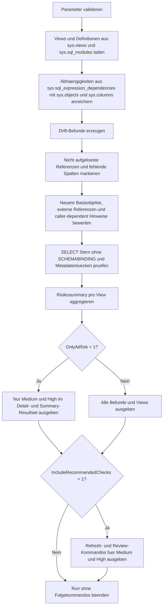

# SchemaDriftImpactOnViews.sql

Dieses Skript bewertet Views der aktuellen Datenbank auf typische Hinweise fuer potenzielle Schema-Drift. Der Fokus liegt auf einer rein lesenden Metadatenanalyse, die aufloesbare und nicht aufloesbare Referenzen, zeitlich spaeter geaenderte Basisobjekte sowie drift-anfaellige View-Definitionen in einer gemeinsamen Risikosicht zusammenfuehrt.

## Uebersicht

<!-- SQLDOC:SUMMARY_TABLE:BEGIN -->
| Feld | Wert |
|---|---|
| Script | [SchemaDriftImpactOnViews.sql](SchemaDriftImpactOnViews.sql) |
| Version | `1.0` |
| Typ | `diagnostic-query` |
| Kapitel | `22_Views_Schemata` |
| Sicherheit | `read-only` |
| Zweck | Audit fuer Views mit potenziellen Auswirkungen durch Schema-Drift. |
<!-- SQLDOC:SUMMARY_TABLE:END -->

## Einordnung

View-Metadaten altern, wenn sich Basisobjekte, Spaltenlisten oder Ausfuehrungskontexte aendern. Das Skript betrachtet deshalb mehrere Drift-Signale parallel und verdichtet sie zu einem nachvollziehbaren Risiko je View, ohne selbst Aenderungen an Objekten vorzunehmen.

## Annahmen

- Die Analyse bleibt auf die aktuelle Datenbank beschraenkt und bewertet externe Datenbanken oder Server nur als zusaetzliches Risiko.
- Ein neueres `modify_date` eines Basisobjekts ist ein Drift-Hinweis, aber kein automatischer Nachweis fuer eine defekte View.
- `SELECT *` ohne `SCHEMABINDING` wird als mittleres Risiko eingeordnet, weil spaetere Spaltenaenderungen verdeckt bleiben koennen.
- Die empfohlenen Refresh-Kommandos sind nur Review-Hilfen und werden nicht automatisch ausgefuehrt.

## Anwendungsfall

Das Skript eignet sich fuer Release-Checks, Datenbank-Reviews und Trainingsumgebungen, in denen nachvollzogen werden soll, welche Views nach Schemaaenderungen erneut getestet oder aktualisiert werden sollten.

## Parameter

<!-- SQLDOC:PARAMETERS_TABLE:BEGIN -->
| Parameter | SQL-Typ | Pflicht | Beschreibung |
|---|---|---|---|
| `@SchemaNameLike` | `SYSNAME` | Nein | Optionales LIKE-Muster, um nur Views aus passenden Schemata zu betrachten. |
| `@OnlyAtRisk` | `BIT` | Nein | Zeigt bei `1` nur Befunde und Views mit Risiko `Medium` oder `High`. |
| `@IncludeRecommendedChecks` | `BIT` | Nein | Steuert, ob ein drittes Resultset mit empfohlenen Refresh-Kommandos ausgegeben wird. |
<!-- SQLDOC:PARAMETERS_TABLE:END -->

## Abhaengigkeiten

<!-- SQLDOC:DEPENDENCIES_LIST:BEGIN -->
- `sys.views`
- `sys.schemas`
- `sys.sql_modules`
- `sys.sql_expression_dependencies`
- `sys.objects`
- `sys.columns`
- `sp_refreshview`
- `sp_refreshsqlmodule`
<!-- SQLDOC:DEPENDENCIES_LIST:END -->

## Hinweise

- Das Detailresultset trennt Befundkategorien wie nicht aufgeloeste Referenzen, fehlende Spalten, spaeter geaenderte Basisobjekte und drift-anfaellige Definitionen.
- Die Summary priorisiert pro View den hoechsten gefundenen Risikowert.
- Das optionale Check-Resultset liefert bewusst nur Kommandovorschlaege fuer manuelle Folgepruefungen.

## Versionshistorie

<!-- SQLDOC:VERSION_HISTORY_TABLE:BEGIN -->
| Version | Datum | User | Beschreibung |
|---|---|---|---|
| `1.0` | `2026-04-22` | `ER` | Erstversion des Audits fuer Schema-Drift-Risiken bei Views |
<!-- SQLDOC:VERSION_HISTORY_TABLE:END -->

## Ablauf

<!-- SQLDOC:MERMAID:BEGIN -->

<!-- SQLDOC:MERMAID:END -->

## SQL-Code

<!-- SQLDOC:SQL_CODE:BEGIN -->
```sql
/*
BEGIN:SQL-HEADER v1
---
sql_header: v1
script_name: "SchemaDriftImpactOnViews.sql"
script_version: "1.0"
script_type: "diagnostic-query"
chapter: "22_Views_Schemata"

purpose: >
  Sucht Views, die von potenzieller Schema-Drift betroffen waeren.
  Das Skript vergleicht View-Metadaten mit ihren bekannten Abhaengigkeiten,
  markiert typische Drift-Signale wie nicht aufgeloeste Referenzen,
  spaeter geaenderte Basisobjekte oder SELECT-Stern ohne SCHEMABINDING
  und liefert eine kompakte Handlungsempfehlung je View.

parameters:
  - name: "@SchemaNameLike"
    sql_type: "SYSNAME"
    direction: "IN"
    required: false
    description: "Optionales LIKE-Muster fuer View-Schemata"
  - name: "@OnlyAtRisk"
    sql_type: "BIT"
    direction: "IN"
    required: false
    description: "1 = nur Views und Befunde mit Risiko >= Medium ausgeben"
  - name: "@IncludeRecommendedChecks"
    sql_type: "BIT"
    direction: "IN"
    required: false
    description: "1 = zusaetzliches Resultset mit Refresh- und Review-Kommandos ausgeben"

result_sets:
  - name: "SchemaDriftFindings"
    description: "Detailbefunde je View und erkannter Drift-Hinweis"
  - name: "SchemaDriftSummary"
    description: "Verdichtete Sicht pro View mit maximalem Drift-Risiko"
  - name: "RecommendedChecks"
    description: "Optionale Folgekommandos fuer Views mit Medium- oder High-Risiko"

dependencies:
  - "sys.views"
  - "sys.schemas"
  - "sys.sql_modules"
  - "sys.sql_expression_dependencies"
  - "sys.objects"
  - "sys.columns"
  - "sp_refreshview"
  - "sp_refreshsqlmodule"

safety:
  level: "read-only"
  writes_data: false

documentation:
  markdown_file: "T-SQL/22_Views_Schemata/SQLScripts/SchemaDriftImpactOnViews.md"
  sync_blocks:
    - "SUMMARY_TABLE"
    - "PARAMETERS_TABLE"
    - "DEPENDENCIES_LIST"
    - "VERSION_HISTORY_TABLE"
    - "SQL_CODE"
  mermaid:
    mode: "ai-agent-from-sql"
    source: "script-body"

main_responsible:
  name: "Erhard Rainer"
  initials: "ER"

version_history:
  - version: "1.0"
    date: "2026-04-22"
    user: "ER"
    description: "Erstversion des Audits fuer Schema-Drift-Risiken bei Views"

notes:
  - "Das Skript bleibt rein lesend und bewertet Metadaten aus der aktuellen Datenbank."
  - "Schema-Drift wird als Risikosignal modelliert und nicht als sicher bestaetigter Defekt."
---
END:SQL-HEADER v1
*/

SET NOCOUNT ON;

DECLARE @SchemaNameLike SYSNAME = NULL;
DECLARE @OnlyAtRisk BIT = 0;
DECLARE @IncludeRecommendedChecks BIT = 1;

IF @OnlyAtRisk NOT IN (0, 1)
BEGIN
    THROW 50030, '@OnlyAtRisk muss 0 oder 1 sein.', 1;
END;

IF @IncludeRecommendedChecks NOT IN (0, 1)
BEGIN
    THROW 50031, '@IncludeRecommendedChecks muss 0 oder 1 sein.', 1;
END;

IF @SchemaNameLike IS NOT NULL AND LTRIM(RTRIM(@SchemaNameLike)) = ''
BEGIN
    SET @SchemaNameLike = NULL;
END;

DROP TABLE IF EXISTS #ViewInventory;
DROP TABLE IF EXISTS #DependencyFacts;
DROP TABLE IF EXISTS #SchemaDriftFindings;
DROP TABLE IF EXISTS #SchemaDriftSummary;
DROP TABLE IF EXISTS #RecommendedChecks;

CREATE TABLE #ViewInventory
(
    view_object_id       INT             NOT NULL,
    schema_name          SYSNAME         NOT NULL,
    view_name            SYSNAME         NOT NULL,
    full_view_name       NVARCHAR(517)   NOT NULL,
    view_modify_date     DATETIME        NOT NULL,
    uses_schemabinding   BIT             NOT NULL,
    has_select_star      BIT             NOT NULL,
    definition_text      NVARCHAR(MAX)   NOT NULL
);

INSERT INTO #ViewInventory
(
    view_object_id,
    schema_name,
    view_name,
    full_view_name,
    view_modify_date,
    uses_schemabinding,
    has_select_star,
    definition_text
)
SELECT
    v.object_id,
    s.name AS schema_name,
    v.name AS view_name,
    QUOTENAME(s.name) + N'.' + QUOTENAME(v.name) AS full_view_name,
    v.modify_date,
    CONVERT(BIT, OBJECTPROPERTY(v.object_id, 'IsSchemaBound')) AS uses_schemabinding,
    CASE
        WHEN sm.definition LIKE '%SELECT *%' OR sm.definition LIKE '%SELECT%*%'
            THEN 1
        ELSE 0
    END AS has_select_star,
    sm.definition
FROM sys.views AS v
INNER JOIN sys.schemas AS s
    ON s.schema_id = v.schema_id
INNER JOIN sys.sql_modules AS sm
    ON sm.object_id = v.object_id
WHERE @SchemaNameLike IS NULL
   OR s.name LIKE @SchemaNameLike;

CREATE TABLE #DependencyFacts
(
    full_view_name              NVARCHAR(517)   NOT NULL,
    schema_name                 SYSNAME         NOT NULL,
    view_name                   SYSNAME         NOT NULL,
    dependency_scope            NVARCHAR(100)   NOT NULL,
    referenced_entity           NVARCHAR(776)   NULL,
    referenced_column           SYSNAME         NULL,
    referenced_object_type      NVARCHAR(60)    NULL,
    referenced_modify_date      DATETIME        NULL,
    view_modify_date            DATETIME        NOT NULL,
    uses_schemabinding          BIT             NOT NULL,
    has_select_star             BIT             NOT NULL,
    is_schema_bound_reference   BIT             NOT NULL,
    is_caller_dependent         BIT             NOT NULL,
    referenced_id_missing       BIT             NOT NULL,
    referenced_column_missing   BIT             NOT NULL
);

INSERT INTO #DependencyFacts
(
    full_view_name,
    schema_name,
    view_name,
    dependency_scope,
    referenced_entity,
    referenced_column,
    referenced_object_type,
    referenced_modify_date,
    view_modify_date,
    uses_schemabinding,
    has_select_star,
    is_schema_bound_reference,
    is_caller_dependent,
    referenced_id_missing,
    referenced_column_missing
)
SELECT
    vi.full_view_name,
    vi.schema_name,
    vi.view_name,
    CASE
        WHEN sed.referenced_server_name IS NOT NULL THEN 'cross-server'
        WHEN sed.referenced_database_name IS NOT NULL THEN 'cross-database'
        WHEN sed.referenced_schema_name IS NOT NULL THEN 'same-database'
        ELSE 'implicit-or-unresolved'
    END AS dependency_scope,
    COALESCE(
        CASE
            WHEN sed.referenced_id IS NOT NULL THEN
                QUOTENAME(OBJECT_SCHEMA_NAME(sed.referenced_id))
                + N'.'
                + QUOTENAME(OBJECT_NAME(sed.referenced_id))
        END,
        CASE
            WHEN sed.referenced_schema_name IS NOT NULL AND sed.referenced_entity_name IS NOT NULL THEN
                QUOTENAME(sed.referenced_schema_name) + N'.' + QUOTENAME(sed.referenced_entity_name)
            WHEN sed.referenced_entity_name IS NOT NULL THEN
                QUOTENAME(sed.referenced_entity_name)
            ELSE
                N'(unresolved reference)'
        END
    ) AS referenced_entity,
    CASE
        WHEN sed.referenced_minor_id > 0 THEN COALESCE(c.name, N'(missing column)')
        ELSE NULL
    END AS referenced_column,
    o.type_desc AS referenced_object_type,
    o.modify_date AS referenced_modify_date,
    vi.view_modify_date,
    vi.uses_schemabinding,
    vi.has_select_star,
    CONVERT(BIT, ISNULL(sed.is_schema_bound_reference, 0)) AS is_schema_bound_reference,
    CONVERT(BIT, ISNULL(sed.is_caller_dependent, 0)) AS is_caller_dependent,
    CONVERT(BIT, CASE WHEN sed.referenced_id IS NULL THEN 1 ELSE 0 END) AS referenced_id_missing,
    CONVERT(BIT, CASE WHEN sed.referenced_minor_id > 0 AND c.column_id IS NULL THEN 1 ELSE 0 END) AS referenced_column_missing
FROM #ViewInventory AS vi
LEFT JOIN sys.sql_expression_dependencies AS sed
    ON sed.referencing_id = vi.view_object_id
LEFT JOIN sys.objects AS o
    ON o.object_id = sed.referenced_id
LEFT JOIN sys.columns AS c
    ON c.object_id = sed.referenced_id
   AND c.column_id = sed.referenced_minor_id
WHERE sed.referencing_id IS NOT NULL;

CREATE TABLE #SchemaDriftFindings
(
    full_view_name         NVARCHAR(517)   NOT NULL,
    schema_name            SYSNAME         NOT NULL,
    view_name              SYSNAME         NOT NULL,
    finding_category       NVARCHAR(80)    NOT NULL,
    dependency_scope       NVARCHAR(100)   NOT NULL,
    referenced_entity      NVARCHAR(776)   NULL,
    referenced_column      SYSNAME         NULL,
    risk_level             VARCHAR(10)     NOT NULL,
    risk_score             INT             NOT NULL,
    finding                NVARCHAR(260)   NOT NULL,
    recommended_action     NVARCHAR(260)   NOT NULL
);

INSERT INTO #SchemaDriftFindings
(
    full_view_name,
    schema_name,
    view_name,
    finding_category,
    dependency_scope,
    referenced_entity,
    referenced_column,
    risk_level,
    risk_score,
    finding,
    recommended_action
)
SELECT
    df.full_view_name,
    df.schema_name,
    df.view_name,
    'unresolved-reference',
    df.dependency_scope,
    df.referenced_entity,
    df.referenced_column,
    'High',
    95,
    'Referenz konnte ueber die aktuellen Metadaten nicht aufgeloest werden.',
    'View-Definition gegen die erwarteten Basisobjekte pruefen und nach Schemaaenderungen gezielt refreshen.'
FROM #DependencyFacts AS df
WHERE df.referenced_id_missing = 1;

INSERT INTO #SchemaDriftFindings
(
    full_view_name,
    schema_name,
    view_name,
    finding_category,
    dependency_scope,
    referenced_entity,
    referenced_column,
    risk_level,
    risk_score,
    finding,
    recommended_action
)
SELECT
    df.full_view_name,
    df.schema_name,
    df.view_name,
    'missing-column',
    df.dependency_scope,
    df.referenced_entity,
    df.referenced_column,
    'High',
    90,
    'Eine referenzierte Spalte ist in den Metadaten nicht mehr vorhanden.',
    'Basistabelle und View-Definition auf umbenannte oder entfernte Spalten pruefen.'
FROM #DependencyFacts AS df
WHERE df.referenced_column_missing = 1;

INSERT INTO #SchemaDriftFindings
(
    full_view_name,
    schema_name,
    view_name,
    finding_category,
    dependency_scope,
    referenced_entity,
    referenced_column,
    risk_level,
    risk_score,
    finding,
    recommended_action
)
SELECT
    df.full_view_name,
    df.schema_name,
    df.view_name,
    'base-object-newer-than-view',
    df.dependency_scope,
    df.referenced_entity,
    NULL,
    CASE
        WHEN df.uses_schemabinding = 0 THEN 'Medium'
        ELSE 'Low'
    END AS risk_level,
    CASE
        WHEN df.uses_schemabinding = 0 THEN 60
        ELSE 30
    END AS risk_score,
    'Ein referenziertes Basisobjekt wurde spaeter geaendert als die View.',
    CASE
        WHEN df.uses_schemabinding = 0 THEN 'View nach Schemaaenderungen mit Regressionstest und optionalem Refresh erneut pruefen.'
        ELSE 'Aenderung pruefen, auch wenn SCHEMABINDING einen Teil der Drift bereits absichert.'
    END AS recommended_action
FROM #DependencyFacts AS df
WHERE df.referenced_modify_date IS NOT NULL
  AND df.referenced_modify_date > df.view_modify_date;

INSERT INTO #SchemaDriftFindings
(
    full_view_name,
    schema_name,
    view_name,
    finding_category,
    dependency_scope,
    referenced_entity,
    referenced_column,
    risk_level,
    risk_score,
    finding,
    recommended_action
)
SELECT
    df.full_view_name,
    df.schema_name,
    df.view_name,
    'external-dependency',
    df.dependency_scope,
    df.referenced_entity,
    NULL,
    'Medium',
    65,
    'Externe Datenbank- oder Serverreferenz vergroessert das Drift- und Deployment-Risiko.',
    'Externe Abhaengigkeiten im Deployment und in Regressionstests explizit absichern.'
FROM #DependencyFacts AS df
WHERE df.dependency_scope IN ('cross-database', 'cross-server');

INSERT INTO #SchemaDriftFindings
(
    full_view_name,
    schema_name,
    view_name,
    finding_category,
    dependency_scope,
    referenced_entity,
    referenced_column,
    risk_level,
    risk_score,
    finding,
    recommended_action
)
SELECT
    df.full_view_name,
    df.schema_name,
    df.view_name,
    'caller-dependent-reference',
    df.dependency_scope,
    df.referenced_entity,
    NULL,
    'Medium',
    55,
    'Die Referenz ist caller-dependent und damit besonders empfindlich gegen Kontextwechsel.',
    'Namensqualifizierung und Ausfuehrungskontext der View pruefen.'
FROM #DependencyFacts AS df
WHERE df.is_caller_dependent = 1;

INSERT INTO #SchemaDriftFindings
(
    full_view_name,
    schema_name,
    view_name,
    finding_category,
    dependency_scope,
    referenced_entity,
    referenced_column,
    risk_level,
    risk_score,
    finding,
    recommended_action
)
SELECT
    vi.full_view_name,
    vi.schema_name,
    vi.view_name,
    'select-star-without-schemabinding',
    'definition-scan',
    vi.full_view_name,
    NULL,
    'Medium',
    70,
    'SELECT * ohne SCHEMABINDING kann Spaltenaenderungen verdecken und spaet sichtbar machen.',
    'Explizite Spaltenliste verwenden und bei stabilen Basisobjekten SCHEMABINDING pruefen.'
FROM #ViewInventory AS vi
WHERE vi.has_select_star = 1
  AND vi.uses_schemabinding = 0;

INSERT INTO #SchemaDriftFindings
(
    full_view_name,
    schema_name,
    view_name,
    finding_category,
    dependency_scope,
    referenced_entity,
    referenced_column,
    risk_level,
    risk_score,
    finding,
    recommended_action
)
SELECT
    vi.full_view_name,
    vi.schema_name,
    vi.view_name,
    'metadata-gap',
    'metadata-gap',
    vi.full_view_name,
    NULL,
    'Low',
    20,
    'Fuer die View wurden keine Abhaengigkeiten in sys.sql_expression_dependencies gefunden.',
    'Bei komplexen Definitionen oder dynamischem SQL die Basisobjekte manuell verifizieren.'
FROM #ViewInventory AS vi
WHERE NOT EXISTS
(
    SELECT 1
    FROM #DependencyFacts AS df
    WHERE df.full_view_name = vi.full_view_name
);

CREATE TABLE #SchemaDriftSummary
(
    full_view_name            NVARCHAR(517)   NOT NULL,
    uses_schemabinding        BIT             NOT NULL,
    finding_count             INT             NOT NULL,
    high_risk_findings        INT             NOT NULL,
    medium_risk_findings      INT             NOT NULL,
    low_risk_findings         INT             NOT NULL,
    highest_risk_score        INT             NOT NULL,
    drift_status              VARCHAR(12)     NOT NULL,
    primary_recommendation    NVARCHAR(260)   NOT NULL
);

INSERT INTO #SchemaDriftSummary
(
    full_view_name,
    uses_schemabinding,
    finding_count,
    high_risk_findings,
    medium_risk_findings,
    low_risk_findings,
    highest_risk_score,
    drift_status,
    primary_recommendation
)
SELECT
    vi.full_view_name,
    vi.uses_schemabinding,
    COUNT(sdf.finding_category) AS finding_count,
    SUM(CASE WHEN sdf.risk_level = 'High' THEN 1 ELSE 0 END) AS high_risk_findings,
    SUM(CASE WHEN sdf.risk_level = 'Medium' THEN 1 ELSE 0 END) AS medium_risk_findings,
    SUM(CASE WHEN sdf.risk_level = 'Low' THEN 1 ELSE 0 END) AS low_risk_findings,
    COALESCE(MAX(sdf.risk_score), 0) AS highest_risk_score,
    CASE
        WHEN COALESCE(MAX(sdf.risk_score), 0) >= 80 THEN 'High'
        WHEN COALESCE(MAX(sdf.risk_score), 0) >= 50 THEN 'Medium'
        ELSE 'Low'
    END AS drift_status,
    CASE
        WHEN COALESCE(MAX(sdf.risk_score), 0) >= 80 THEN 'View und Basisobjekte sofort gegen aktuelle Definitionen und Spalten abgleichen.'
        WHEN COALESCE(MAX(sdf.risk_score), 0) >= 50 THEN 'View nach Schemaaenderungen gezielt testen und gegebenenfalls refreshen.'
        ELSE 'Nur bei kuenftigen Schemaaenderungen erneut pruefen.'
    END AS primary_recommendation
FROM #ViewInventory AS vi
LEFT JOIN #SchemaDriftFindings AS sdf
    ON sdf.full_view_name = vi.full_view_name
GROUP BY
    vi.full_view_name,
    vi.uses_schemabinding;

CREATE TABLE #RecommendedChecks
(
    full_view_name          NVARCHAR(517)   NOT NULL,
    drift_status            VARCHAR(12)     NOT NULL,
    recommended_command     NVARCHAR(700)   NOT NULL,
    execution_hint          NVARCHAR(260)   NOT NULL
);

INSERT INTO #RecommendedChecks
(
    full_view_name,
    drift_status,
    recommended_command,
    execution_hint
)
SELECT
    sds.full_view_name,
    sds.drift_status,
    N'EXEC sys.sp_refreshview @viewname = N'''
        + REPLACE(sds.full_view_name, N'''', N'''''')
        + N''';' AS recommended_command,
    N'Nur nach fachlicher Pruefung der Basisobjekte und idealerweise in einer Testsession ausfuehren.'
FROM #SchemaDriftSummary AS sds
WHERE sds.drift_status IN ('High', 'Medium');

INSERT INTO #RecommendedChecks
(
    full_view_name,
    drift_status,
    recommended_command,
    execution_hint
)
SELECT
    sds.full_view_name,
    sds.drift_status,
    N'EXEC sys.sp_refreshsqlmodule @name = N'''
        + REPLACE(sds.full_view_name, N'''', N'''''')
        + N''';' AS recommended_command,
    N'Geeignet fuer eine Metadaten-Aktualisierung nach Review der View-Definition.'
FROM #SchemaDriftSummary AS sds
WHERE sds.drift_status IN ('High', 'Medium');

SELECT
    sdf.full_view_name,
    sdf.finding_category,
    sdf.dependency_scope,
    sdf.referenced_entity,
    sdf.referenced_column,
    sdf.risk_level,
    sdf.risk_score,
    sdf.finding,
    sdf.recommended_action
FROM #SchemaDriftFindings AS sdf
WHERE @OnlyAtRisk = 0
   OR sdf.risk_score >= 50
ORDER BY
    sdf.full_view_name,
    sdf.risk_score DESC,
    sdf.finding_category,
    sdf.referenced_entity;

SELECT
    sds.full_view_name,
    sds.uses_schemabinding,
    sds.finding_count,
    sds.high_risk_findings,
    sds.medium_risk_findings,
    sds.low_risk_findings,
    sds.highest_risk_score,
    sds.drift_status,
    sds.primary_recommendation
FROM #SchemaDriftSummary AS sds
WHERE @OnlyAtRisk = 0
   OR sds.drift_status IN ('High', 'Medium')
ORDER BY
    CASE sds.drift_status
        WHEN 'High' THEN 1
        WHEN 'Medium' THEN 2
        ELSE 3
    END,
    sds.highest_risk_score DESC,
    sds.full_view_name;

IF @IncludeRecommendedChecks = 1
BEGIN
    SELECT
        rc.full_view_name,
        rc.drift_status,
        rc.recommended_command,
        rc.execution_hint
    FROM #RecommendedChecks AS rc
    WHERE @OnlyAtRisk = 0
       OR rc.drift_status IN ('High', 'Medium')
    ORDER BY
        CASE rc.drift_status
            WHEN 'High' THEN 1
            WHEN 'Medium' THEN 2
            ELSE 3
        END,
        rc.full_view_name,
        rc.recommended_command;
END;
```
<!-- SQLDOC:SQL_CODE:END -->
