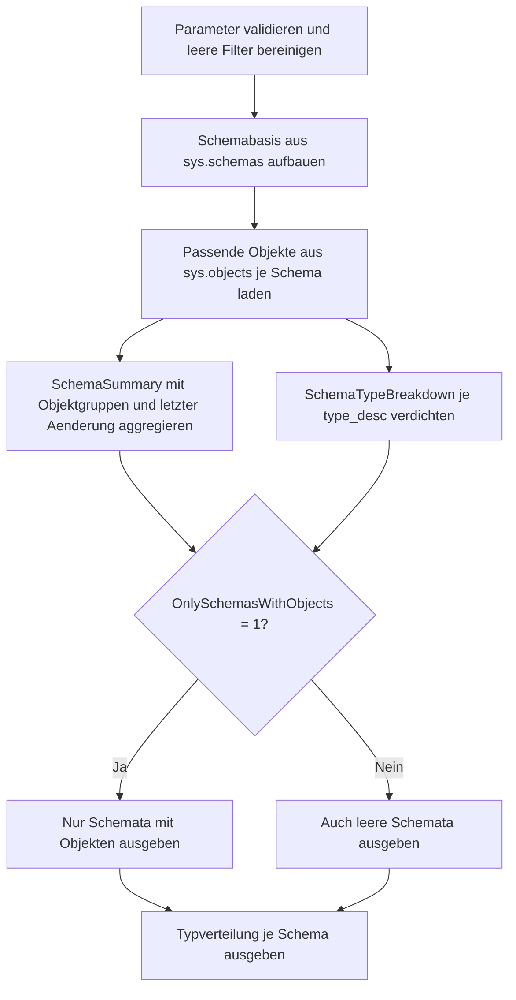

# SchemaObjectCountSummary.sql

Dieses Skript fasst benutzerdefinierte Objektzahlen je Schema zusammen und ergaenzt die Gesamtsicht um eine kompakte Typverteilung. Es ist als rein lesendes Diagnoseskript angelegt und eignet sich fuer Unterricht, Bestandsaufnahmen und erste Struktur-Reviews rund um Views und Schemata.

## Uebersicht

<!-- SQLDOC:SUMMARY_TABLE:BEGIN -->
| Feld | Wert |
|---|---|
| Script | [SchemaObjectCountSummary.sql](SchemaObjectCountSummary.sql) |
| Version | `1.0` |
| Typ | `diagnostic-query` |
| Kapitel | `22_Views_Schemata` |
| Sicherheit | `read-only` |
| Zweck | Objektzahlen je Schema und Typverteilung kompakt zusammenfassen. |
<!-- SQLDOC:SUMMARY_TABLE:END -->

## Einordnung

Schemazuschnitte werden oft erst dann greifbar, wenn sichtbar ist, wie viele Tabellen, Views oder programmierbare Objekte in jedem Schema liegen. Das Skript reduziert diese Frage auf zwei Resultsets: eine zusammenfassende Kennzahlensicht pro Schema und eine zweite Sicht mit den konkreten Objektarten.

## Annahmen

- Die Auswertung bezieht sich auf die aktuelle Datenbank und verwendet nur Metadaten aus `sys.schemas` und `sys.objects`.
- Standardschemata `sys` und `INFORMATION_SCHEMA` werden standardmaessig ausgeblendet, koennen aber bei Bedarf zugeschaltet werden.
- Die Gruppierung `programmable_object_count` ist didaktisch zusammengefasst und kombiniert Prozeduren sowie Funktionen zu einer gemeinsamen Kennzahl.
- Leere Schemata koennen sichtbar gemacht werden, wenn `@OnlySchemasWithObjects = 0` gesetzt wird.

## Anwendungsfall

Das Skript hilft beim Einstieg in Schema-Design, bei Refactorings und bei Architekturgespraechen ueber Verantwortlichkeiten pro Schema. Es ist besonders nuetzlich, wenn schnell geprueft werden soll, ob ein Schema eher tabellenlastig, view-lastig oder durch programmierbare Objekte gepraegt ist.

## Parameter

<!-- SQLDOC:PARAMETERS_TABLE:BEGIN -->
| Parameter | SQL-Typ | Pflicht | Beschreibung |
|---|---|---|---|
| `@SchemaNameLike` | `SYSNAME` | Nein | Optionales LIKE-Muster fuer Schemanamen. |
| `@ObjectTypeLike` | `NVARCHAR(60)` | Nein | Optionales LIKE-Muster fuer `sys.objects.type_desc`. |
| `@IncludeSystemSchemas` | `BIT` | Nein | Bei `1` werden auch `sys` und `INFORMATION_SCHEMA` beruecksichtigt. |
| `@OnlySchemasWithObjects` | `BIT` | Nein | Bei `1` werden nur Schemata mit mindestens einem passenden Objekt ausgegeben. |
<!-- SQLDOC:PARAMETERS_TABLE:END -->

## Abhaengigkeiten

<!-- SQLDOC:DEPENDENCIES_LIST:BEGIN -->
- `sys.schemas`
- `sys.objects`
<!-- SQLDOC:DEPENDENCIES_LIST:END -->

## Hinweise

- Das erste Resultset liefert die eigentliche Management- und Unterrichtssicht pro Schema.
- Das zweite Resultset zeigt, welche `type_desc`-Werte die Kennzahlen im Detail tragen.
- Die Spalte `schema_profile` ist eine didaktische Verdichtung und soll ein schnelles Strukturgespraech erleichtern.

## Versionshistorie

<!-- SQLDOC:VERSION_HISTORY_TABLE:BEGIN -->
| Version | Datum | User | Beschreibung |
|---|---|---|---|
| `1.0` | `2026-04-22` | `ER` | Erstversion der Schema-Objektzusammenfassung |
<!-- SQLDOC:VERSION_HISTORY_TABLE:END -->

## Ablauf

<!-- SQLDOC:MERMAID:BEGIN -->

<!-- SQLDOC:MERMAID:END -->

## SQL-Code

<!-- SQLDOC:SQL_CODE:BEGIN -->
```sql
/*
BEGIN:SQL-HEADER v1
---
sql_header: v1
script_name: "SchemaObjectCountSummary.sql"
script_version: "1.0"
script_type: "diagnostic-query"
chapter: "22_Views_Schemata"

purpose: >
  Fasst benutzerdefinierte Objektzahlen je Schema zusammen und zeigt
  parallel eine kompakte Typverteilung. Das Skript eignet sich fuer
  Lern- und Review-Situationen, in denen Schemazuschnitte, Objektlast
  und die Verteilung von Views, Tabellen und programmierbaren Objekten
  schnell sichtbar werden sollen.

parameters:
  - name: "@SchemaNameLike"
    sql_type: "SYSNAME"
    direction: "IN"
    required: false
    description: "Optionales LIKE-Muster fuer Schemanamen"
  - name: "@ObjectTypeLike"
    sql_type: "NVARCHAR(60)"
    direction: "IN"
    required: false
    description: "Optionales LIKE-Muster fuer sys.objects.type_desc"
  - name: "@IncludeSystemSchemas"
    sql_type: "BIT"
    direction: "IN"
    required: false
    description: "1 = auch sys und INFORMATION_SCHEMA beruecksichtigen"
  - name: "@OnlySchemasWithObjects"
    sql_type: "BIT"
    direction: "IN"
    required: false
    description: "1 = nur Schemata mit mindestens einem passenden Objekt ausgeben"

result_sets:
  - name: "SchemaSummary"
    description: "Zusammenfassung je Schema mit Objektanzahl, Typschwerpunkten und letzter Aenderung"
  - name: "SchemaTypeBreakdown"
    description: "Verdichtung der Objektarten pro Schema fuer Detailanalysen"

dependencies:
  - "sys.schemas"
  - "sys.objects"

safety:
  level: "read-only"
  writes_data: false

documentation:
  markdown_file: "T-SQL/22_Views_Schemata/SQLScripts/SchemaObjectCountSummary.md"
  sync_blocks:
    - "SUMMARY_TABLE"
    - "PARAMETERS_TABLE"
    - "DEPENDENCIES_LIST"
    - "VERSION_HISTORY_TABLE"
    - "SQL_CODE"
  mermaid:
    mode: "ai-agent-from-sql"
    source: "script-body"

main_responsible:
  name: "Erhard Rainer"
  initials: "ER"

version_history:
  - version: "1.0"
    date: "2026-04-22"
    user: "ER"
    description: "Erstversion der Schema-Objektzusammenfassung"

notes:
  - "Das Skript liest nur Katalogsichten und veraendert keine Datenbankobjekte."
  - "Die Typgruppierung bleibt didaktisch kompakt und ersetzt kein vollstaendiges Objektinventar."
---
END:SQL-HEADER v1
*/

SET NOCOUNT ON;

DECLARE @SchemaNameLike SYSNAME = NULL;
DECLARE @ObjectTypeLike NVARCHAR(60) = NULL;
DECLARE @IncludeSystemSchemas BIT = 0;
DECLARE @OnlySchemasWithObjects BIT = 1;

IF @IncludeSystemSchemas NOT IN (0, 1)
BEGIN
    THROW 50050, '@IncludeSystemSchemas muss 0 oder 1 sein.', 1;
END;

IF @OnlySchemasWithObjects NOT IN (0, 1)
BEGIN
    THROW 50051, '@OnlySchemasWithObjects muss 0 oder 1 sein.', 1;
END;

IF @SchemaNameLike IS NOT NULL AND LTRIM(RTRIM(@SchemaNameLike)) = ''
BEGIN
    SET @SchemaNameLike = NULL;
END;

IF @ObjectTypeLike IS NOT NULL AND LTRIM(RTRIM(@ObjectTypeLike)) = ''
BEGIN
    SET @ObjectTypeLike = NULL;
END;

DROP TABLE IF EXISTS #SchemaBase;
DROP TABLE IF EXISTS #SchemaObjectBase;
DROP TABLE IF EXISTS #SchemaSummary;
DROP TABLE IF EXISTS #SchemaTypeBreakdown;

CREATE TABLE #SchemaBase
(
    schema_id INT NOT NULL PRIMARY KEY,
    schema_name SYSNAME NOT NULL
);

INSERT INTO #SchemaBase
(
    schema_id,
    schema_name
)
SELECT
    s.schema_id,
    s.name
FROM sys.schemas AS s
WHERE (@SchemaNameLike IS NULL OR s.name LIKE @SchemaNameLike)
  AND (
        @IncludeSystemSchemas = 1
        OR s.name NOT IN (N'sys', N'INFORMATION_SCHEMA')
      );

CREATE TABLE #SchemaObjectBase
(
    schema_id INT NOT NULL,
    schema_name SYSNAME NOT NULL,
    object_id INT NOT NULL,
    object_name SYSNAME NOT NULL,
    object_type CHAR(2) NOT NULL,
    object_type_desc NVARCHAR(60) NOT NULL,
    modify_date DATETIME NOT NULL
);

INSERT INTO #SchemaObjectBase
(
    schema_id,
    schema_name,
    object_id,
    object_name,
    object_type,
    object_type_desc,
    modify_date
)
SELECT
    sb.schema_id,
    sb.schema_name,
    o.object_id,
    o.name AS object_name,
    o.type,
    o.type_desc,
    o.modify_date
FROM #SchemaBase AS sb
INNER JOIN sys.objects AS o
    ON o.schema_id = sb.schema_id
WHERE o.is_ms_shipped = 0
  AND (@ObjectTypeLike IS NULL OR o.type_desc LIKE @ObjectTypeLike);

CREATE TABLE #SchemaSummary
(
    schema_name SYSNAME NOT NULL PRIMARY KEY,
    total_objects INT NOT NULL,
    view_count INT NOT NULL,
    table_count INT NOT NULL,
    programmable_object_count INT NOT NULL,
    trigger_count INT NOT NULL,
    constraint_count INT NOT NULL,
    other_object_count INT NOT NULL,
    last_modify_date DATETIME NULL
);

INSERT INTO #SchemaSummary
(
    schema_name,
    total_objects,
    view_count,
    table_count,
    programmable_object_count,
    trigger_count,
    constraint_count,
    other_object_count,
    last_modify_date
)
SELECT
    sb.schema_name,
    COUNT(sob.object_id) AS total_objects,
    SUM(CASE WHEN sob.object_type = 'V' THEN 1 ELSE 0 END) AS view_count,
    SUM(CASE WHEN sob.object_type = 'U' THEN 1 ELSE 0 END) AS table_count,
    SUM(CASE WHEN sob.object_type IN ('P', 'FN', 'IF', 'TF', 'AF', 'FS', 'FT', 'PC') THEN 1 ELSE 0 END) AS programmable_object_count,
    SUM(CASE WHEN sob.object_type IN ('TR', 'TA') THEN 1 ELSE 0 END) AS trigger_count,
    SUM(CASE WHEN sob.object_type IN ('C', 'D', 'F', 'PK', 'UQ', 'EC') THEN 1 ELSE 0 END) AS constraint_count,
    SUM(CASE WHEN sob.object_type NOT IN ('V', 'U', 'P', 'FN', 'IF', 'TF', 'AF', 'FS', 'FT', 'PC', 'TR', 'TA', 'C', 'D', 'F', 'PK', 'UQ', 'EC') THEN 1 ELSE 0 END) AS other_object_count,
    MAX(sob.modify_date) AS last_modify_date
FROM #SchemaBase AS sb
LEFT JOIN #SchemaObjectBase AS sob
    ON sob.schema_id = sb.schema_id
GROUP BY
    sb.schema_name;

CREATE TABLE #SchemaTypeBreakdown
(
    schema_name SYSNAME NOT NULL,
    object_type_desc NVARCHAR(60) NOT NULL,
    object_count INT NOT NULL,
    newest_modify_date DATETIME NOT NULL
);

INSERT INTO #SchemaTypeBreakdown
(
    schema_name,
    object_type_desc,
    object_count,
    newest_modify_date
)
SELECT
    sob.schema_name,
    sob.object_type_desc,
    COUNT(*) AS object_count,
    MAX(sob.modify_date) AS newest_modify_date
FROM #SchemaObjectBase AS sob
GROUP BY
    sob.schema_name,
    sob.object_type_desc;

SELECT
    ss.schema_name,
    ss.total_objects,
    ss.view_count,
    ss.table_count,
    ss.programmable_object_count,
    ss.trigger_count,
    ss.constraint_count,
    ss.other_object_count,
    ss.last_modify_date,
    CASE
        WHEN ss.total_objects = 0 THEN 'empty'
        WHEN ss.view_count >= ss.table_count AND ss.view_count >= ss.programmable_object_count THEN 'view-heavy'
        WHEN ss.table_count >= ss.programmable_object_count THEN 'table-heavy'
        ELSE 'programmable-heavy'
    END AS schema_profile
FROM #SchemaSummary AS ss
WHERE @OnlySchemasWithObjects = 0
   OR ss.total_objects > 0
ORDER BY
    ss.total_objects DESC,
    ss.schema_name ASC;

SELECT
    stb.schema_name,
    stb.object_type_desc,
    stb.object_count,
    stb.newest_modify_date
FROM #SchemaTypeBreakdown AS stb
WHERE @OnlySchemasWithObjects = 0
   OR EXISTS
    (
        SELECT 1
        FROM #SchemaSummary AS ss
        WHERE ss.schema_name = stb.schema_name
          AND ss.total_objects > 0
    )
ORDER BY
    stb.schema_name ASC,
    stb.object_count DESC,
    stb.object_type_desc ASC;
```
<!-- SQLDOC:SQL_CODE:END -->
